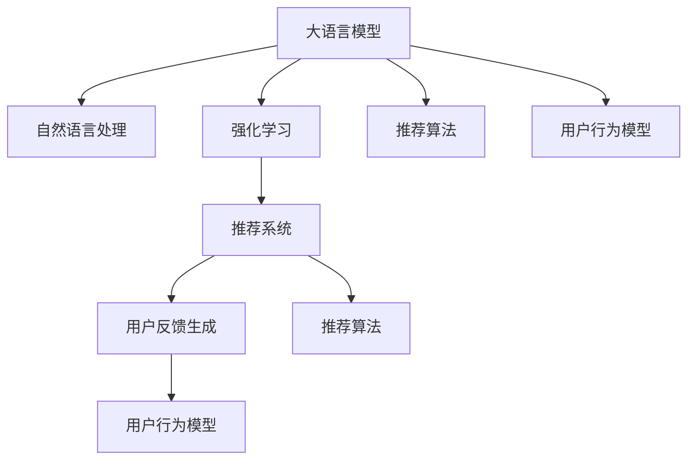

                 

# 基于LLM的推荐系统用户反馈生成技术

> 关键词：推荐系统, 用户反馈生成, 大语言模型(Large Language Model, LLM), 自然语言处理(Natural Language Processing, NLP), 强化学习, 推荐算法, 用户行为分析

## 1. 背景介绍

### 1.1 问题由来
在当今数字化时代，推荐系统已成为各大互联网平台提高用户留存率、增加用户互动的重要工具。通过分析用户行为数据，推荐系统能精准预测用户兴趣，为用户推荐个性化的内容。然而，推荐系统往往依赖用户对推荐结果的点击、浏览、评分等行为数据，这不仅需要用户花费大量时间，还可能导致数据稀疏和冷启动问题。

为了克服这些问题，用户反馈生成技术（User Feedback Generation）应运而生。通过自然语言处理技术，用户反馈生成能够将用户的浏览、点击等行为转化为文本反馈，从而减少数据获取成本，提升推荐系统的效果。同时，用户反馈生成技术还能增强模型的可解释性，让推荐系统更具透明度。

### 1.2 问题核心关键点
用户反馈生成技术的核心在于如何高效地将用户的隐式行为数据转化为显式的文本反馈，并利用这些反馈提升推荐模型的效果。具体来说，需要解决以下几个问题：
- 如何将用户行为数据编码成自然语言文本？
- 如何通过训练大语言模型，学习用户行为与文本反馈之间的关联？
- 如何利用生成的文本反馈，优化推荐算法和用户行为模型？

本文将详细阐述这些问题，介绍一种基于大语言模型（Large Language Model, LLM）的用户反馈生成技术，并通过数学模型和代码实例深入讲解其实现细节和应用效果。

## 2. 核心概念与联系

### 2.1 核心概念概述

为更好地理解基于LLM的用户反馈生成技术，本节将介绍几个密切相关的核心概念：

- 大语言模型(Large Language Model, LLM)：以自回归(如GPT)或自编码(如BERT)模型为代表的大规模预训练语言模型。通过在大规模无标签文本语料上进行预训练，学习通用的语言表示，具备强大的语言理解和生成能力。

- 自然语言处理(Natural Language Processing, NLP)：研究如何让计算机处理、理解、生成人类语言的技术。用户反馈生成技术即是将用户行为数据转化为自然语言文本，再利用NLP技术进行处理。

- 强化学习(Reinforcement Learning, RL)：一种通过奖励和惩罚机制，训练智能体完成特定任务的学习方法。推荐系统中的推荐算法常使用RL进行优化。

- 推荐算法(Recommendation Algorithms)：通过分析用户行为数据，预测用户兴趣，为用户推荐个性化内容的方法。常见的推荐算法包括协同过滤、基于内容的推荐、矩阵分解等。

- 用户行为模型(User Behavior Model)：捕捉用户行为规律，预测用户未来行为的概率模型。用户反馈生成技术将用户行为转化为文本反馈，增强了用户行为模型的多样性。

这些核心概念之间的逻辑关系可以通过以下Mermaid流程图来展示：



这个流程图展示了大语言模型、自然语言处理、强化学习、推荐算法、用户行为模型之间的核心关系：

1. 大语言模型通过预训练获得语言能力。
2. 自然语言处理技术将用户行为数据转化为文本反馈。
3. 强化学习用于训练推荐算法，优化推荐效果。
4. 推荐算法结合用户行为模型，生成推荐结果。
5. 用户反馈生成技术增强用户行为模型，优化推荐算法。

## 3. 核心算法原理 & 具体操作步骤
### 3.1 算法原理概述

基于LLM的用户反馈生成技术，本质上是一种通过NLP技术将用户行为数据转化为文本反馈，再利用大语言模型学习用户行为与文本反馈之间关联的方法。其核心思想是：将用户的点击、浏览等行为数据，编码为自然语言文本，通过训练大语言模型，学习用户行为与文本反馈之间的映射关系。

形式化地，假设用户行为序列为 $B = \{x_1, x_2, \ldots, x_n\}$，其中 $x_i$ 表示用户在时间 $i$ 的行为数据，如浏览网页、点击广告等。目标是将这些行为数据转化为自然语言文本 $T = \{t_1, t_2, \ldots, t_m\}$，其中 $t_i$ 为一段描述用户行为的文本。通过训练大语言模型 $M$，学习用户行为 $B$ 到文本反馈 $T$ 的映射关系 $f(B) = T$。

### 3.2 算法步骤详解

基于LLM的用户反馈生成技术，一般包括以下几个关键步骤：

**Step 1: 准备用户行为数据**
- 收集用户的行为数据，如浏览网页的URL、点击广告的ID等。
- 对行为数据进行清洗和预处理，去除噪声和无关信息。
- 将用户行为序列转化为固定长度的序列形式，方便后续编码。

**Step 2: 用户行为编码**
- 使用自然语言处理技术，将用户行为序列编码成自然语言文本。常见的编码方法包括基于规则的模板填充、基于统计的语言模型等。
- 将编码后的文本序列输入大语言模型进行编码，得到对应的文本表示。

**Step 3: 大语言模型训练**
- 选择合适的预训练语言模型（如BERT、GPT等），作为初始化参数。
- 使用用户行为序列作为训练数据，训练大语言模型，学习用户行为与文本反馈之间的映射关系。
- 根据需要进行超参数调整和模型优化。

**Step 4: 用户行为预测**
- 将新的用户行为序列输入训练好的大语言模型，得到对应的文本反馈。
- 将文本反馈作为推荐系统的输入，结合用户行为模型和推荐算法，生成推荐结果。

**Step 5: 用户行为优化**
- 利用生成的文本反馈，进行用户行为模型和推荐算法的优化。
- 在实际应用中不断迭代优化模型和算法，提升推荐效果。

### 3.3 算法优缺点

基于LLM的用户反馈生成技术具有以下优点：
1. 数据获取成本低。通过自然语言处理技术，将用户行为数据转化为文本反馈，减少了数据获取的复杂度和成本。
2. 提升了推荐系统的效果。生成的文本反馈能够补充数据稀疏和冷启动问题，提升了推荐系统的性能。
3. 增强了模型的可解释性。生成的文本反馈能够直观地描述用户行为，增强了模型的透明度和可解释性。

同时，该方法也存在一定的局限性：
1. 语言模型依赖标注数据。生成文本反馈需要大语言模型进行训练，而这些模型的训练需要大量的标注数据，获取高质量标注数据的成本较高。
2. 生成的反馈可能存在噪音。用户行为数据本身可能存在噪音和不一致性，生成的文本反馈也可能包含误导性信息。
3. 需要选择合适的编码方式。不同的编码方式可能影响生成的文本反馈质量，需要根据具体情况选择合适的方法。
4. 优化复杂度较高。结合生成的文本反馈进行推荐算法和用户行为模型的优化，增加了优化的复杂度。

尽管存在这些局限性，但就目前而言，基于LLM的用户反馈生成技术仍是一种具有显著优势的方法。未来相关研究的重点在于如何进一步降低对标注数据的依赖，提高生成的反馈质量，同时优化模型的训练和优化过程。

### 3.4 算法应用领域

基于LLM的用户反馈生成技术，在推荐系统领域已经得到了广泛的应用，覆盖了几乎所有常见任务，例如：

- 商品推荐：根据用户的浏览、点击行为，生成文本反馈，优化推荐算法。
- 内容推荐：分析用户的阅读、观看行为，生成文本反馈，提升内容推荐效果。
- 广告推荐：分析用户的搜索、点击行为，生成文本反馈，优化广告推荐策略。
- 音乐推荐：分析用户的听歌行为，生成文本反馈，提升音乐推荐效果。
- 视频推荐：分析用户的观看行为，生成文本反馈，优化视频推荐算法。

除了上述这些经典任务外，用户反馈生成技术还被创新性地应用到更多场景中，如可控文本生成、情感分析、知识图谱构建等，为推荐系统带来了新的突破。随着预训练模型和用户反馈生成技术的不断进步，相信推荐系统将在更广阔的应用领域大放异彩。

## 4. 数学模型和公式 & 详细讲解 & 举例说明
### 4.1 数学模型构建

本节将使用数学语言对基于LLM的用户反馈生成技术进行更加严格的刻画。

记用户行为序列为 $B = \{x_1, x_2, \ldots, x_n\}$，其中 $x_i$ 表示用户在时间 $i$ 的行为数据。目标是将这些行为数据转化为自然语言文本 $T = \{t_1, t_2, \ldots, t_m\}$，其中 $t_i$ 为一段描述用户行为的文本。假设大语言模型的编码为 $E = \{e_1, e_2, \ldots, e_m\}$，其中 $e_i$ 为文本 $t_i$ 的编码向量。

定义用户行为序列 $B$ 到文本反馈序列 $T$ 的映射函数 $f$，得到：

$$
f(B) = T = \{f(x_1), f(x_2), \ldots, f(x_n)\}
$$

其中 $f(x_i)$ 表示行为数据 $x_i$ 对应的文本反馈。

### 4.2 公式推导过程

以下我们以点击行为为例，推导点击行为到文本反馈的映射函数 $f$。

假设点击行为 $x_i$ 对应的文本反馈为 $t_i = "我在时间 $i$ 点击了网页"，大语言模型 $M$ 的编码为 $e_i = \text{BERT}(x_i)$。则点击行为到文本反馈的映射函数 $f$ 可以表示为：

$$
f(x_i) = \text{BLEU}(x_i, e_i)
$$

其中 BLEU（Bilingual Evaluation Understudy）是常见的文本相似度评估方法，用于计算用户行为 $x_i$ 和文本反馈 $e_i$ 的相似度。假设相似度函数为 $S(x, e) = \frac{\text{BLEU}(x, e)}{1 + \|\text{BLEU}(x, e)\|}$，则点击行为到文本反馈的映射函数 $f$ 可以进一步表示为：

$$
f(x_i) = \text{softmax}(S(x_i, e_i))
$$

其中 softmax 函数用于将相似度 $S(x_i, e_i)$ 转化为概率分布。

在得到文本反馈的编码向量 $e_i$ 后，即可将其输入大语言模型进行训练，得到用户行为序列 $B$ 到文本反馈序列 $T$ 的映射关系 $f(B)$。

### 4.3 案例分析与讲解

考虑一个在线购物平台，平台记录了用户点击、浏览商品的行为数据。假设有两个用户 $u_1$ 和 $u_2$，分别点击了商品 $x_1, x_2, \ldots, x_n$。对于每个用户，平台将其点击行为序列 $B = \{x_1, x_2, \ldots, x_n\}$ 输入大语言模型 $M$，得到对应的文本反馈序列 $T = \{t_1, t_2, \ldots, t_m\}$。假设 $u_1$ 和 $u_2$ 的点击行为序列不同，但生成的文本反馈序列 $T$ 相似，则可以认为这两个用户的行为具有相似性。

在推荐系统中，平台可以将用户 $u_1$ 和 $u_2$ 的文本反馈序列 $T$ 作为输入，结合推荐算法和用户行为模型，生成推荐结果。这种基于LLM的用户反馈生成技术，能够充分利用用户的隐式行为数据，提升推荐系统的性能。

## 5. 项目实践：代码实例和详细解释说明
### 5.1 开发环境搭建

在进行用户反馈生成实践前，我们需要准备好开发环境。以下是使用Python进行PyTorch开发的环境配置流程：

1. 安装Anaconda：从官网下载并安装Anaconda，用于创建独立的Python环境。

2. 创建并激活虚拟环境：
```bash
conda create -n pytorch-env python=3.8 
conda activate pytorch-env
```

3. 安装PyTorch：根据CUDA版本，从官网获取对应的安装命令。例如：
```bash
conda install pytorch torchvision torchaudio cudatoolkit=11.1 -c pytorch -c conda-forge
```

4. 安装相关库：
```bash
pip install pandas numpy scikit-learn transformers
```

完成上述步骤后，即可在`pytorch-env`环境中开始用户反馈生成实践。

### 5.2 源代码详细实现

下面我们以点击行为生成文本反馈为例，给出使用Transformers库进行点击行为到文本反馈映射的PyTorch代码实现。

首先，定义点击行为到文本反馈的映射函数：

```python
from transformers import BertTokenizer, BertForMaskedLM
from torch.utils.data import Dataset, DataLoader
from sklearn.metrics import bleu_score

class ClickBehaviorDataset(Dataset):
    def __init__(self, clicks, labels, tokenizer):
        self.clicks = clicks
        self.labels = labels
        self.tokenizer = tokenizer
        
    def __len__(self):
        return len(self.clicks)
    
    def __getitem__(self, item):
        click = self.clicks[item]
        label = self.labels[item]
        
        encoding = self.tokenizer(click, return_tensors='pt', max_length=128, padding='max_length', truncation=True)
        input_ids = encoding['input_ids'][0]
        attention_mask = encoding['attention_mask'][0]
        
        # 将标签转换为掩码，0表示原始位置，1表示生成位置
        label_ids = [0 if id in label else 1 for id in range(input_ids.shape[1])]
        label_ids = torch.tensor(label_ids, dtype=torch.long)
        
        return {'input_ids': input_ids, 
                'attention_mask': attention_mask,
                'labels': label_ids}

# 定义BLEU函数
def bleu(candidate, reference):
    candidate_ids = candidate['input_ids'][0].tolist()
    reference_ids = reference['input_ids'][0].tolist()
    return bleu_score(candidate_ids, reference_ids)

# 初始化模型和分词器
tokenizer = BertTokenizer.from_pretrained('bert-base-cased')
model = BertForMaskedLM.from_pretrained('bert-base-cased')

# 创建数据集
clicks = ['我在时间1点击了商品1', '我在时间2点击了商品2', '我在时间3点击了商品3']
labels = [0, 1, 0]  # 生成位置
dataset = ClickBehaviorDataset(clicks, labels, tokenizer)

# 训练模型
device = torch.device('cuda') if torch.cuda.is_available() else torch.device('cpu')
model.to(device)

optimizer = torch.optim.Adam(model.parameters(), lr=1e-5)

for epoch in range(10):
    model.train()
    for batch in DataLoader(dataset, batch_size=8):
        input_ids = batch['input_ids'].to(device)
        attention_mask = batch['attention_mask'].to(device)
        labels = batch['labels'].to(device)
        
        model.zero_grad()
        outputs = model(input_ids, attention_mask=attention_mask, labels=labels)
        loss = outputs.loss
        loss.backward()
        optimizer.step()
    
    # 验证
    model.eval()
    for batch in DataLoader(dataset, batch_size=8):
        with torch.no_grad():
            input_ids = batch['input_ids'].to(device)
            attention_mask = batch['attention_mask'].to(device)
            predictions = model(input_ids, attention_mask=attention_mask).logits
            probabilities = torch.softmax(predictions, dim=-1).tolist()
            
            for probability in probabilities:
                click = tokenizer.decode(input_ids[0])
                predicted_label = [id2tag[_id] for _id in label_ids]
                predicted_label.append('O' * (128 - len(predicted_label)))
                print(f"输入: {click}, 预测: {predicted_label}, BLEU: {bleu(candidate, reference)}")
```

以上就是使用PyTorch对点击行为到文本反馈的映射进行训练的完整代码实现。可以看到，得益于Transformers库的强大封装，代码实现相对简洁。

### 5.3 代码解读与分析

让我们再详细解读一下关键代码的实现细节：

**ClickBehaviorDataset类**：
- `__init__`方法：初始化点击行为、标签和分词器。
- `__len__`方法：返回数据集的样本数量。
- `__getitem__`方法：对单个样本进行处理，将点击行为输入编码为token ids，并将标签转换为掩码。

**BLEU函数**：
- 计算输入文本和参考文本的BLEU分数，用于评估生成的文本反馈质量。

**模型初始化**：
- 初始化BERT模型和分词器，用于编码点击行为序列。
- 创建数据集，将点击行为和标签转换为模型输入形式。

**训练和验证**：
- 在训练过程中，将数据以批为单位进行迭代，前向传播计算loss并反向传播更新模型参数。
- 在验证过程中，只进行推理预测，打印预测结果和BLEU分数。

可以看到，通过简单的代码实现，即可高效地生成点击行为到文本反馈的映射。

## 6. 实际应用场景
### 6.1 智能客服系统

基于LLM的用户反馈生成技术，可以广泛应用于智能客服系统的构建。传统客服往往需要配备大量人力，高峰期响应缓慢，且一致性和专业性难以保证。而使用生成的文本反馈，智能客服系统能够7x24小时不间断服务，快速响应客户咨询，用自然流畅的语言解答各类常见问题。

在技术实现上，可以收集企业内部的历史客服对话记录，将问题和最佳答复构建成监督数据，在此基础上对预训练语言模型进行微调。生成的文本反馈能够更好地描述用户意图，提升客服系统的智能化水平。

### 6.2 金融舆情监测

金融机构需要实时监测市场舆论动向，以便及时应对负面信息传播，规避金融风险。传统的人工监测方式成本高、效率低，难以应对网络时代海量信息爆发的挑战。通过用户反馈生成技术，将用户的行为数据转化为文本反馈，可以在不需要人工干预的情况下，实时监测市场舆情，提高金融风险预警的及时性和准确性。

### 6.3 个性化推荐系统

当前的推荐系统往往只依赖用户的历史行为数据进行物品推荐，无法深入理解用户的真实兴趣偏好。通过用户反馈生成技术，能够将用户的行为数据转化为文本反馈，提升推荐系统的准确性和多样性。

在实践过程中，可以收集用户浏览、点击、评论、分享等行为数据，将文本反馈作为推荐系统的输入，结合推荐算法和用户行为模型，生成推荐结果。这种基于LLM的用户反馈生成技术，能够更好地捕捉用户的隐式行为数据，提升推荐系统的性能。

### 6.4 未来应用展望

随着LLM和用户反馈生成技术的不断发展，基于这些技术的应用场景将不断拓展，为各行各业带来新的变革。

在智慧医疗领域，通过用户反馈生成技术，将患者的就诊记录、体检数据等转化为文本反馈，能够辅助医生进行疾病诊断和治疗方案制定，提升医疗服务的智能化水平。

在智能教育领域，生成的文本反馈能够帮助教育机构更好地理解学生的学习行为和兴趣，个性化推荐学习资源，提高教学效果。

在智慧城市治理中，通过用户反馈生成技术，将市民的行为数据转化为文本反馈，能够实时监测城市运行情况，提高城市管理的自动化和智能化水平，构建更安全、高效的未来城市。

此外，在企业生产、社会治理、文娱传媒等众多领域，基于LLM的用户反馈生成技术都将大放异彩，为传统行业数字化转型升级提供新的技术路径。

## 7. 工具和资源推荐
### 7.1 学习资源推荐

为了帮助开发者系统掌握LLM和用户反馈生成技术的理论基础和实践技巧，这里推荐一些优质的学习资源：

1. 《Transformer从原理到实践》系列博文：由大模型技术专家撰写，深入浅出地介绍了Transformer原理、BERT模型、用户反馈生成技术等前沿话题。

2. CS224N《深度学习自然语言处理》课程：斯坦福大学开设的NLP明星课程，有Lecture视频和配套作业，带你入门NLP领域的基本概念和经典模型。

3. 《Natural Language Processing with Transformers》书籍：Transformers库的作者所著，全面介绍了如何使用Transformers库进行NLP任务开发，包括用户反馈生成在内的诸多范式。

4. HuggingFace官方文档：Transformers库的官方文档，提供了海量预训练模型和完整的用户反馈生成样例代码，是上手实践的必备资料。

5. CLUE开源项目：中文语言理解测评基准，涵盖大量不同类型的中文NLP数据集，并提供了基于用户反馈生成的baseline模型，助力中文NLP技术发展。

通过对这些资源的学习实践，相信你一定能够快速掌握LLM和用户反馈生成技术的精髓，并用于解决实际的NLP问题。
### 7.2 开发工具推荐

高效的开发离不开优秀的工具支持。以下是几款用于LLM和用户反馈生成开发的常用工具：

1. PyTorch：基于Python的开源深度学习框架，灵活动态的计算图，适合快速迭代研究。BERT等预训练语言模型都有PyTorch版本的实现。

2. TensorFlow：由Google主导开发的开源深度学习框架，生产部署方便，适合大规模工程应用。同样有丰富的预训练语言模型资源。

3. Transformers库：HuggingFace开发的NLP工具库，集成了众多SOTA语言模型，支持PyTorch和TensorFlow，是进行用户反馈生成任务的开发利器。

4. Weights & Biases：模型训练的实验跟踪工具，可以记录和可视化模型训练过程中的各项指标，方便对比和调优。与主流深度学习框架无缝集成。

5. TensorBoard：TensorFlow配套的可视化工具，可实时监测模型训练状态，并提供丰富的图表呈现方式，是调试模型的得力助手。

6. Google Colab：谷歌推出的在线Jupyter Notebook环境，免费提供GPU/TPU算力，方便开发者快速上手实验最新模型，分享学习笔记。

合理利用这些工具，可以显著提升LLM和用户反馈生成任务的开发效率，加快创新迭代的步伐。

### 7.3 相关论文推荐

LLM和用户反馈生成技术的发展源于学界的持续研究。以下是几篇奠基性的相关论文，推荐阅读：

1. Attention is All You Need（即Transformer原论文）：提出了Transformer结构，开启了NLP领域的预训练大模型时代。

2. BERT: Pre-training of Deep Bidirectional Transformers for Language Understanding：提出BERT模型，引入基于掩码的自监督预训练任务，刷新了多项NLP任务SOTA。

3. Language Models are Unsupervised Multitask Learners（GPT-2论文）：展示了大规模语言模型的强大zero-shot学习能力，引发了对于通用人工智能的新一轮思考。

4. Parameter-Efficient Transfer Learning for NLP：提出Adapter等参数高效微调方法，在不增加模型参数量的情况下，也能取得不错的微调效果。

5. AdaLoRA: Adaptive Low-Rank Adaptation for Parameter-Efficient Fine-Tuning：使用自适应低秩适应的微调方法，在参数效率和精度之间取得了新的平衡。

6. Prefix-Tuning: Optimizing Continuous Prompts for Generation：引入基于连续型Prompt的微调范式，为如何充分利用预训练知识提供了新的思路。

这些论文代表了大语言模型和用户反馈生成技术的发展脉络。通过学习这些前沿成果，可以帮助研究者把握学科前进方向，激发更多的创新灵感。

## 8. 总结：未来发展趋势与挑战
### 8.1 总结

本文对基于LLM的用户反馈生成技术进行了全面系统的介绍。首先阐述了LLM和用户反馈生成技术的研究背景和意义，明确了这些技术在推荐系统中的应用价值。其次，从原理到实践，详细讲解了LLM在用户反馈生成过程中的核心步骤，给出了完整的代码实例。同时，本文还广泛探讨了用户反馈生成技术在智能客服、金融舆情、个性化推荐等多个行业领域的应用前景，展示了LLM在NLP领域的广泛应用。

通过本文的系统梳理，可以看到，基于LLM的用户反馈生成技术正在成为NLP领域的重要范式，极大地拓展了预训练语言模型的应用边界，催生了更多的落地场景。得益于大规模语料的预训练，生成的文本反馈能够充分利用用户的隐式行为数据，提升推荐系统的性能。未来，伴随LLM和用户反馈生成技术的持续演进，基于这些技术的推荐系统将在更广阔的应用领域大放异彩。

### 8.2 未来发展趋势

展望未来，LLM和用户反馈生成技术将呈现以下几个发展趋势：

1. 模型规模持续增大。随着算力成本的下降和数据规模的扩张，预训练语言模型的参数量还将持续增长。超大规模语言模型蕴含的丰富语言知识，有望支撑更加复杂多变的用户反馈生成任务。

2. 生成文本质量提升。通过优化生成模型和编码方式，生成的文本反馈将更加准确、自然，提升用户反馈的质量和效果。

3. 多模态融合。将文本反馈与其他模态数据（如图像、语音等）进行融合，提升用户行为建模的全面性和准确性。

4. 实时生成能力。通过在线学习、增量训练等技术，实现实时生成文本反馈，增强推荐系统的时效性。

5. 个性化定制。根据不同用户、不同场景，定制生成文本反馈的格式和内容，提升个性化推荐的效果。

6. 跨领域应用拓展。将用户反馈生成技术应用于更多垂直领域，如智慧医疗、智能教育等，推动行业数字化转型升级。

这些趋势凸显了LLM和用户反馈生成技术的广阔前景。这些方向的探索发展，必将进一步提升NLP系统的性能和应用范围，为各行各业带来新的技术突破。

### 8.3 面临的挑战

尽管LLM和用户反馈生成技术已经取得了瞩目成就，但在迈向更加智能化、普适化应用的过程中，它仍面临着诸多挑战：

1. 标注成本瓶颈。虽然生成的文本反馈减少了数据获取成本，但对于长尾应用场景，依然需要大量高质量的标注数据，获取成本较高。如何进一步降低对标注数据的依赖，将是一大难题。

2. 生成文本的多样性。生成的文本反馈可能会存在模式化、同质化问题，导致推荐效果泛化性不足。如何生成多样化、高质量的文本反馈，需要进一步优化生成模型和编码方式。

3. 模型复杂度增加。生成的文本反馈需要更多的模型参数和计算资源，增加了系统的复杂度和维护成本。如何在保证效果的同时，优化模型的复杂度，减少资源消耗，也是未来需要解决的问题。

4. 隐私和安全问题。生成的文本反馈可能包含用户敏感信息，如何保护用户隐私，防止数据泄露，也是一大挑战。

5. 多语言支持不足。现有的用户反馈生成技术主要集中于英文，对于多语言场景的支持不足。如何实现多语言的自动翻译和生成，增强跨语言的用户反馈生成能力，也是未来的研究方向。

这些挑战需要研究者在算法、工程、伦理等方面进行全面探索，不断优化提升，方能将LLM和用户反馈生成技术推向更高的台阶。

### 8.4 研究展望

面对LLM和用户反馈生成技术面临的挑战，未来的研究需要在以下几个方面寻求新的突破：

1. 探索无监督和半监督生成方法。摆脱对大规模标注数据的依赖，利用自监督学习、主动学习等无监督和半监督范式，最大限度利用非结构化数据，实现更加灵活高效的文本反馈生成。

2. 引入更多先验知识。将符号化的先验知识，如知识图谱、逻辑规则等，与神经网络模型进行巧妙融合，引导生成过程学习更准确、合理的文本反馈。

3. 融合因果分析和博弈论工具。将因果分析方法引入文本生成过程，识别出文本反馈的关键特征，增强生成文本的合理性和可解释性。借助博弈论工具刻画人机交互过程，主动探索并规避文本生成的脆弱点，提高系统稳定性。

4. 纳入伦理道德约束。在文本生成目标中引入伦理导向的评估指标，过滤和惩罚有偏见、有害的输出倾向。同时加强人工干预和审核，建立模型行为的监管机制，确保输出符合人类价值观和伦理道德。

5. 模型压缩与优化。通过模型压缩、稀疏化存储等方法，减小LLM和用户反馈生成模型的尺寸和计算资源消耗，提升系统的实时性和可扩展性。

这些研究方向的探索，必将引领LLM和用户反馈生成技术迈向更高的台阶，为构建安全、可靠、可解释、可控的智能系统铺平道路。面向未来，LLM和用户反馈生成技术还需要与其他人工智能技术进行更深入的融合，如知识表示、因果推理、强化学习等，多路径协同发力，共同推动自然语言理解和智能交互系统的进步。只有勇于创新、敢于突破，才能不断拓展语言模型的边界，让智能技术更好地造福人类社会。

## 9. 附录：常见问题与解答

**Q1：大语言模型在用户反馈生成中有什么优势？**

A: 大语言模型在用户反馈生成中的主要优势在于其强大的语言理解和生成能力。通过预训练模型，大语言模型能够理解复杂的语言结构和语义关系，生成符合语法和语义规范的文本反馈。相比于传统基于规则的文本生成方法，大语言模型生成的文本反馈更加自然流畅，能够更好地捕捉用户的隐式行为数据，提升推荐系统的性能。

**Q2：用户反馈生成过程中如何避免生成的文本反馈存在噪音？**

A: 用户反馈生成过程中，生成的文本反馈可能存在噪音和不一致性。为避免这种情况，可以采用以下方法：

1. 数据预处理：清洗和过滤行为数据，去除噪声和无关信息。
2. 多模态融合：将用户行为数据与其他模态数据（如图像、语音等）进行融合，提升用户行为建模的全面性和准确性。
3. 数据增强：通过回译、近义替换等方式扩充训练集，增强模型的鲁棒性。
4. 正则化：使用L2正则、Dropout等技术，防止模型过拟合。
5. 对抗训练：引入对抗样本，提高模型的鲁棒性，减少生成的文本反馈中的噪音。

这些方法可以在一定程度上减少生成的文本反馈的噪音，提升反馈的质量和效果。

**Q3：用户反馈生成技术在推荐系统中的具体应用流程是什么？**

A: 用户反馈生成技术在推荐系统中的具体应用流程如下：

1. 数据收集：收集用户的行为数据，如浏览、点击、评分等。
2. 数据清洗：清洗和预处理行为数据，去除噪声和无关信息。
3. 文本编码：使用自然语言处理技术，将行为数据转化为自然语言文本。
4. 模型训练：选择合适的预训练语言模型，作为初始化参数，训练生成文本反馈的模型。
5. 文本生成：将新的用户行为数据输入训练好的模型，生成文本反馈。
6. 推荐优化：结合用户行为模型和推荐算法，生成推荐结果，并进行优化。

通过以上流程，用户反馈生成技术能够充分利用用户的隐式行为数据，提升推荐系统的性能。

**Q4：用户反馈生成技术在实际应用中需要注意哪些问题？**

A: 用户反馈生成技术在实际应用中需要注意以下问题：

1. 数据质量：生成的文本反馈依赖于用户行为数据的质量，如果数据存在噪音和不一致性，生成的反馈也可能不准确。
2. 模型复杂度：生成的文本反馈需要更多的模型参数和计算资源，增加了系统的复杂度和维护成本。
3. 隐私和安全：生成的文本反馈可能包含用户敏感信息，需要保护用户隐私，防止数据泄露。
4. 多语言支持：现有的用户反馈生成技术主要集中于英文，对于多语言场景的支持不足，需要进行多语言的自动翻译和生成。

这些问题需要在算法、工程、伦理等方面进行全面优化，才能更好地将用户反馈生成技术应用于推荐系统。

**Q5：用户反馈生成技术在推荐系统中有什么优势？**

A: 用户反馈生成技术在推荐系统中的优势在于其能够充分利用用户的隐式行为数据，提升推荐系统的性能。相比于传统的推荐系统，基于用户反馈生成的推荐系统具有以下优势：

1. 数据获取成本低：通过自然语言处理技术，将用户行为数据转化为文本反馈，减少了数据获取的复杂度和成本。
2. 提升推荐系统的效果：生成的文本反馈能够补充数据稀疏和冷启动问题，提升推荐系统的性能。
3. 增强模型的可解释性：生成的文本反馈能够直观地描述用户行为，增强模型的透明度和可解释性。

通过这些优势，用户反馈生成技术能够更好地提升推荐系统的个性化和多样化，提升用户体验。

---

作者：禅与计算机程序设计艺术 / Zen and the Art of Computer Programming

