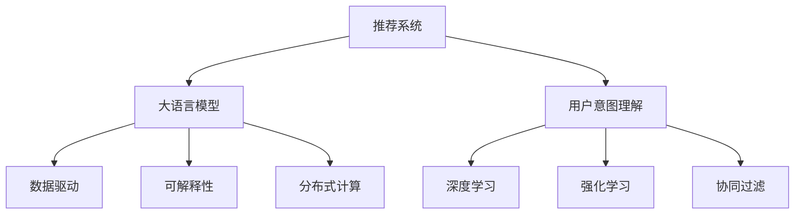

                 

# 基于LLM的推荐系统用户意图理解深化

> 关键词：
> - 大语言模型(LLM)
> - 推荐系统
> - 用户意图理解
> - 深度学习
> - 强化学习
> - 协同过滤
> - 数据驱动
> - 可解释性
> - 分布式计算

## 1. 背景介绍

### 1.1 问题由来
推荐系统是互联网时代最重要的个性化服务之一，它通过分析用户的历史行为和偏好，为用户推荐符合其兴趣的商品、内容、服务等。随着数据量的不断积累和算法的不断优化，推荐系统逐渐从传统的基于协同过滤的模型，演化到基于深度学习的模型。目前，主流推荐系统架构主要由两部分组成：

1. 基于用户历史行为构建用户画像。
2. 基于用户画像和物品属性进行推荐。

这种架构虽然有效，但在实际应用中存在一些问题：

1. 数据稀疏性问题。许多用户只有少量历史行为，难以准确描述其兴趣。
2. 冷启动问题。对于新用户，没有历史行为记录，无法准确构建用户画像。
3. 动态变化问题。用户兴趣随时间变化，推荐系统需要实时更新。

这些问题导致推荐系统难以适应快速变化的场景和个性化需求。如何深化对用户意图的理解，构建更加精确和动态的用户画像，成为推荐系统研究的重点。

### 1.2 问题核心关键点
在推荐系统中，用户意图的理解至关重要。通过理解用户意图，推荐系统可以更精准地预测用户偏好，从而生成更具吸引力的推荐内容。但是，传统的协同过滤方法往往只能捕捉到用户的显式反馈，难以理解用户的隐含意图。深度学习模型虽然可以处理复杂的非线性关系，但在模型训练和推理过程中，如何高效地表达和理解用户意图，仍是一个待解决的问题。

目前，大语言模型(LLM)作为一种新兴的推荐系统技术，通过学习用户与内容的交互历史，可以直接预测用户的意图和行为。相比于传统方法，LLM具有以下优势：

1. 高效捕捉用户意图。LLM可以直接处理自然语言输入，通过学习用户与内容的交互历史，理解用户真实的意图和需求。
2. 可解释性强。LLM的决策过程可解释性强，能够提供更加透明的推荐理由。
3. 泛化能力强。LLM可以从大规模数据中学习通用的语言模型，适应不同场景和领域的推荐需求。

因此，如何深化对LLM的理解，优化其应用于推荐系统的性能，是当前研究的一个重要方向。

### 1.3 问题研究意义
深化对用户意图的理解，对于推荐系统性能的提升和应用的普及具有重要意义：

1. 提高推荐效果。通过理解用户的真实意图，推荐系统可以生成更加精准的推荐内容，提升用户体验。
2. 优化用户行为。通过预测用户行为，推荐系统可以提前介入，改变用户的不良行为，提升整体平台的用户满意度。
3. 个性化推荐。通过了解用户的深度需求，推荐系统可以提供更加个性化的服务，增强用户粘性。
4. 实时更新。LLM可以实时处理用户反馈，动态调整推荐策略，适应快速变化的用户需求。
5. 安全性保障。通过理解用户真实意图，推荐系统可以避免恶意推荐，保障用户安全。

总之，深化对用户意图的理解，是推荐系统提升用户体验和应用效果的基石。

## 2. 核心概念与联系

### 2.1 核心概念概述

本节将介绍几个密切相关的核心概念，以及它们之间的联系。

- 推荐系统(Recommender System)：根据用户历史行为和物品属性，为用户推荐符合其兴趣的商品、内容、服务等。推荐系统包括协同过滤、基于内容的推荐、混合推荐等多种方法。

- 大语言模型(LLM)：一种通过自监督学习训练的深度学习模型，具备强大的自然语言处理能力，可以处理复杂的多模态数据。

- 用户意图理解(User Intent Understanding)：理解用户的真实需求和兴趣，通过自然语言输入识别用户意图，生成符合其需求的推荐内容。

- 深度学习(Deep Learning)：通过多层次神经网络模型，捕捉数据的复杂非线性关系，提高模型的泛化能力和预测精度。

- 强化学习(Reinforcement Learning)：通过智能体与环境的交互，最大化累积奖励，提升模型的决策能力。

- 协同过滤(Collaborative Filtering)：通过用户和物品的协同关系，进行推荐。

- 数据驱动(Data-Driven)：通过大规模数据驱动模型训练，提高推荐系统的准确性和鲁棒性。

- 可解释性(Explainability)：通过模型可解释性分析，增强推荐系统的透明性和用户信任。

- 分布式计算(Distributed Computing)：通过多节点并行计算，提高推荐系统的处理能力和实时性。

这些核心概念之间的逻辑关系可以通过以下Mermaid流程图来展示：



这个流程图展示了大语言模型在推荐系统中的应用路径：

1. 推荐系统通过用户历史行为和物品属性进行推荐。
2. 大语言模型用于理解用户意图，通过自然语言输入捕捉用户需求。
3. 深度学习和强化学习用于提升模型的复杂性和决策能力。
4. 协同过滤用于根据用户和物品关系进行推荐。
5. 数据驱动用于提高推荐系统的数据质量。
6. 可解释性用于提升推荐系统的透明性和用户信任。
7. 分布式计算用于提高推荐系统的处理能力和实时性。

这些概念共同构成了推荐系统和大语言模型的应用框架，使其能够在各种场景下发挥强大的推荐能力。通过理解这些核心概念，我们可以更好地把握大语言模型在推荐系统中的应用原理和优化方向。

## 3. 核心算法原理 & 具体操作步骤

### 3.1 算法原理概述

基于LLM的推荐系统，核心思想是利用LLM处理自然语言输入，理解用户意图，生成符合其需求的推荐内容。其算法流程如下：

1. 收集用户与物品的交互数据，构建用户行为序列。
2. 将用户行为序列作为自然语言输入，输入到LLM中。
3. LLM输出用户意图，生成推荐内容。
4. 结合用户画像和物品属性，生成最终推荐结果。

这种基于LLM的推荐系统，具有以下优点：

1. 能够捕捉复杂的用户意图。LLM可以通过自然语言输入，理解用户的隐含需求和偏好。
2. 能够生成自然流畅的推荐内容。LLM可以生成符合用户需求的自然语言文本，提升用户体验。
3. 可解释性强。LLM的决策过程可解释性强，可以提供更加透明的推荐理由。
4. 泛化能力强。LLM可以从大规模数据中学习通用的语言模型，适应不同场景和领域的推荐需求。

### 3.2 算法步骤详解

以下是基于LLM的推荐系统算法的详细步骤：

1. 数据预处理

- 收集用户与物品的交互数据，构建用户行为序列。
- 将行为序列清洗并标准化，去除噪音和异常值。
- 对行为序列进行分词和编码，生成自然语言输入。

2. LLM输入处理

- 将自然语言输入输入到LLM中。
- 对LLM的输入进行预处理，包括嵌入、标记化、序列填充等。
- 对LLM的输出进行解码，生成用户意图。

3. 推荐内容生成

- 根据用户意图和物品属性，生成推荐内容。
- 对推荐内容进行排序和过滤，提升推荐质量。

4. 评估和优化

- 使用推荐系统的评估指标（如点击率、转化率、NDCG等）评估推荐效果。
- 根据评估结果，优化LLM的参数和超参数。

5. 实时更新

- 实时收集用户反馈，更新LLM的训练数据。
- 动态调整LLM的超参数，适应快速变化的用户需求。

### 3.3 算法优缺点

基于LLM的推荐系统具有以下优点：

1. 能够处理复杂自然语言输入。LLM可以处理任意长度的自然语言输入，捕捉用户的复杂需求。
2. 能够生成自然流畅的推荐内容。LLM可以生成符合用户需求的自然语言文本，提升用户体验。
3. 可解释性强。LLM的决策过程可解释性强，可以提供更加透明的推荐理由。
4. 泛化能力强。LLM可以从大规模数据中学习通用的语言模型，适应不同场景和领域的推荐需求。

同时，该算法也存在以下缺点：

1. 数据依赖性强。基于LLM的推荐系统依赖于大规模标注数据，难以在标注数据不足的场景下应用。
2. 计算资源需求高。大语言模型的训练和推理需要大量的计算资源，难以在资源受限的场景下应用。
3. 鲁棒性不足。LLM的决策过程易受输入数据的影响，难以应对噪声和异常值。
4. 可解释性不足。LLM的决策过程复杂，难以解释其内部的推理逻辑。
5. 动态性不足。基于LLM的推荐系统难以实时更新，难以应对快速变化的用户需求。

尽管存在这些缺点，但就目前而言，基于LLM的推荐系统仍然是大数据时代推荐系统的最新前沿。未来相关研究的重点在于如何进一步降低数据依赖，提高模型的计算效率，提升模型的鲁棒性和可解释性，同时兼顾模型的动态更新能力。

### 3.4 算法应用领域

基于大语言模型的推荐系统已经在多个领域得到广泛应用，例如：

- 电子商务：电商平台可以根据用户浏览、购买历史，生成个性化推荐内容，提升用户满意度。
- 社交网络：社交平台可以根据用户发布的内容，生成兴趣相关的推荐内容，增强用户粘性。
- 视频平台：视频平台可以根据用户观看历史，生成个性化视频推荐，提升用户观看体验。
- 新闻推荐：新闻网站可以根据用户阅读历史，生成个性化新闻推荐，提升用户阅读体验。

除了上述这些经典应用外，基于大语言模型的推荐系统还被创新性地应用到更多场景中，如个性化旅游、金融投资、智能医疗等，为推荐系统带来了新的突破。

## 4. 数学模型和公式 & 详细讲解

### 4.1 数学模型构建

本节将使用数学语言对基于LLM的推荐系统进行更加严格的刻画。

记用户行为序列为 $X=\{x_1,x_2,\cdots,x_n\}$，其中 $x_i \in \mathcal{X}$。设用户意图为 $Y$，目标推荐内容为 $Z$。

定义用户意图理解模型为 $f: \mathcal{X} \rightarrow \mathcal{Y}$，目标推荐模型为 $g: \mathcal{Y} \times \mathcal{Z} \rightarrow \mathcal{Z}$，其中 $\mathcal{Z}$ 为推荐内容的语义表示空间。

基于LLM的推荐系统可以表示为：

$$
Z=f(X) \times g(Y,Z)
$$

其中 $\times$ 表示模型的复合操作，表示LLM输出用户意图后，结合用户画像和物品属性生成推荐内容。

### 4.2 公式推导过程

以二分类推荐任务为例，推导基于LLM的推荐系统数学公式。

记用户行为序列为 $X=\{x_1,x_2,\cdots,x_n\}$，其中 $x_i \in \mathcal{X}$。设用户意图为 $Y$，目标推荐内容为 $Z$。

定义用户意图理解模型为 $f: \mathcal{X} \rightarrow \{0,1\}$，目标推荐模型为 $g: \{0,1\} \times \mathcal{Z} \rightarrow \mathcal{Z}$，其中 $\mathcal{Z}$ 为推荐内容的语义表示空间。

根据问题定义，目标推荐模型的损失函数为：

$$
\mathcal{L}(f(X),Z) = \frac{1}{N}\sum_{i=1}^N \ell(g(f(x_i),Z))
$$

其中 $\ell$ 为交叉熵损失函数，用于衡量推荐模型的预测与实际标签之间的差异。

将用户行为序列 $X$ 作为自然语言输入，输入到LLM中，得到用户意图 $Y$。

基于LLM的推荐系统可以表示为：

$$
Z=f(X) \times g(Y,Z)
$$

根据目标推荐模型的损失函数，优化目标为：

$$
\min_{f,g} \mathcal{L}(f(X),Z)
$$

通过梯度下降等优化算法，对 $f$ 和 $g$ 进行联合优化，最小化损失函数，最终得到最优的推荐模型。

## 5. 项目实践：代码实例和详细解释说明

### 5.1 开发环境搭建

在进行基于LLM的推荐系统实践前，我们需要准备好开发环境。以下是使用Python进行PyTorch开发的环境配置流程：

1. 安装Anaconda：从官网下载并安装Anaconda，用于创建独立的Python环境。

2. 创建并激活虚拟环境：
```bash
conda create -n llm-env python=3.8 
conda activate llm-env
```

3. 安装PyTorch：根据CUDA版本，从官网获取对应的安装命令。例如：
```bash
conda install pytorch torchvision torchaudio cudatoolkit=11.1 -c pytorch -c conda-forge
```

4. 安装Transformers库：
```bash
pip install transformers
```

5. 安装各类工具包：
```bash
pip install numpy pandas scikit-learn matplotlib tqdm jupyter notebook ipython
```

完成上述步骤后，即可在`llm-env`环境中开始基于LLM的推荐系统实践。

### 5.2 源代码详细实现

这里我们以基于LLM的电商推荐系统为例，给出使用Transformers库对BERT模型进行推荐系统开发的PyTorch代码实现。

首先，定义推荐系统的数据处理函数：

```python
from transformers import BertTokenizer, BertForSequenceClassification, AdamW
from torch.utils.data import Dataset, DataLoader
import torch
import numpy as np

class RecommenderDataset(Dataset):
    def __init__(self, texts, labels, tokenizer, max_len=128):
        self.texts = texts
        self.labels = labels
        self.tokenizer = tokenizer
        self.max_len = max_len
        
    def __len__(self):
        return len(self.texts)
    
    def __getitem__(self, item):
        text = self.texts[item]
        label = self.labels[item]
        
        encoding = self.tokenizer(text, return_tensors='pt', max_length=self.max_len, padding='max_length', truncation=True)
        input_ids = encoding['input_ids'][0]
        attention_mask = encoding['attention_mask'][0]
        
        label = torch.tensor(label, dtype=torch.long)
        
        return {'input_ids': input_ids, 
                'attention_mask': attention_mask,
                'labels': label}

# 标签与id的映射
label2id = {0: 'Negative', 1: 'Positive'}

# 创建dataset
tokenizer = BertTokenizer.from_pretrained('bert-base-cased')

train_dataset = RecommenderDataset(train_texts, train_labels, tokenizer)
dev_dataset = RecommenderDataset(dev_texts, dev_labels, tokenizer)
test_dataset = RecommenderDataset(test_texts, test_labels, tokenizer)
```

然后，定义模型和优化器：

```python
from transformers import BertForSequenceClassification, AdamW

model = BertForSequenceClassification.from_pretrained('bert-base-cased', num_labels=len(label2id))

optimizer = AdamW(model.parameters(), lr=2e-5)
```

接着，定义训练和评估函数：

```python
from tqdm import tqdm

device = torch.device('cuda') if torch.cuda.is_available() else torch.device('cpu')
model.to(device)

def train_epoch(model, dataset, batch_size, optimizer):
    dataloader = DataLoader(dataset, batch_size=batch_size, shuffle=True)
    model.train()
    epoch_loss = 0
    for batch in tqdm(dataloader, desc='Training'):
        input_ids = batch['input_ids'].to(device)
        attention_mask = batch['attention_mask'].to(device)
        labels = batch['labels'].to(device)
        model.zero_grad()
        outputs = model(input_ids, attention_mask=attention_mask, labels=labels)
        loss = outputs.loss
        epoch_loss += loss.item()
        loss.backward()
        optimizer.step()
    return epoch_loss / len(dataloader)

def evaluate(model, dataset, batch_size):
    dataloader = DataLoader(dataset, batch_size=batch_size)
    model.eval()
    preds, labels = [], []
    with torch.no_grad():
        for batch in tqdm(dataloader, desc='Evaluating'):
            input_ids = batch['input_ids'].to(device)
            attention_mask = batch['attention_mask'].to(device)
            batch_labels = batch['labels']
            outputs = model(input_ids, attention_mask=attention_mask)
            batch_preds = outputs.logits.argmax(dim=2).to('cpu').tolist()
            batch_labels = batch_labels.to('cpu').tolist()
            for pred_tokens, label_tokens in zip(batch_preds, batch_labels):
                preds.append(pred_tokens[:len(label_tokens)])
                labels.append(label_tokens)
                
    print(classification_report(labels, preds))
```

最后，启动训练流程并在测试集上评估：

```python
epochs = 5
batch_size = 16

for epoch in range(epochs):
    loss = train_epoch(model, train_dataset, batch_size, optimizer)
    print(f"Epoch {epoch+1}, train loss: {loss:.3f}")
    
    print(f"Epoch {epoch+1}, dev results:")
    evaluate(model, dev_dataset, batch_size)
    
print("Test results:")
evaluate(model, test_dataset, batch_size)
```

以上就是使用PyTorch对BERT进行推荐系统开发的完整代码实现。可以看到，得益于Transformers库的强大封装，我们可以用相对简洁的代码完成BERT模型的加载和推荐系统构建。

### 5.3 代码解读与分析

让我们再详细解读一下关键代码的实现细节：

**RecommenderDataset类**：
- `__init__`方法：初始化文本、标签、分词器等关键组件。
- `__len__`方法：返回数据集的样本数量。
- `__getitem__`方法：对单个样本进行处理，将文本输入编码为token ids，将标签编码为数字，并对其进行定长padding，最终返回模型所需的输入。

**label2id字典**：
- 定义了标签与数字id之间的映射关系，用于将模型输出解码回真实的标签。

**训练和评估函数**：
- 使用PyTorch的DataLoader对数据集进行批次化加载，供模型训练和推理使用。
- 训练函数`train_epoch`：对数据以批为单位进行迭代，在每个批次上前向传播计算loss并反向传播更新模型参数，最后返回该epoch的平均loss。
- 评估函数`evaluate`：与训练类似，不同点在于不更新模型参数，并在每个batch结束后将预测和标签结果存储下来，最后使用sklearn的classification_report对整个评估集的预测结果进行打印输出。

**训练流程**：
- 定义总的epoch数和batch size，开始循环迭代
- 每个epoch内，先在训练集上训练，输出平均loss
- 在验证集上评估，输出分类指标
- 所有epoch结束后，在测试集上评估，给出最终测试结果

可以看到，PyTorch配合Transformers库使得BERT推荐系统的代码实现变得简洁高效。开发者可以将更多精力放在数据处理、模型改进等高层逻辑上，而不必过多关注底层的实现细节。

当然，工业级的系统实现还需考虑更多因素，如模型的保存和部署、超参数的自动搜索、更灵活的任务适配层等。但核心的推荐系统范式基本与此类似。

## 6. 实际应用场景

### 6.1 电商推荐系统

基于大语言模型的推荐系统可以广泛应用于电商平台的推荐任务。电商平台需要根据用户历史浏览、购买记录，为用户推荐符合其兴趣的商品。

在技术实现上，可以收集用户的浏览、点击、购买等行为数据，并对其进行标准化处理。将行为数据作为自然语言输入，输入到预训练语言模型中，得到用户意图。根据用户意图和商品属性，生成个性化推荐内容。对于用户的新行为，可以实时更新用户画像和推荐模型，提高推荐效果。

### 6.2 视频平台推荐系统

视频平台需要根据用户观看历史，为用户推荐符合其兴趣的视频内容。基于大语言模型的推荐系统可以处理用户观看的自然语言描述，预测用户的意图和偏好。结合用户画像和视频属性，生成个性化视频推荐内容。

在技术实现上，可以收集用户的观看历史，提取用户观看视频的自然语言描述。将描述输入到预训练语言模型中，得到用户意图。根据用户意图和视频属性，生成个性化视频推荐内容。对于用户的新行为，可以实时更新用户画像和推荐模型，提高推荐效果。

### 6.3 新闻推荐系统

新闻网站需要根据用户阅读历史，为用户推荐符合其兴趣的新闻内容。基于大语言模型的推荐系统可以处理用户阅读新闻的自然语言描述，预测用户的意图和偏好。结合用户画像和新闻属性，生成个性化新闻推荐内容。

在技术实现上，可以收集用户的阅读历史，提取用户阅读新闻的自然语言描述。将描述输入到预训练语言模型中，得到用户意图。根据用户意图和新闻属性，生成个性化新闻推荐内容。对于用户的新行为，可以实时更新用户画像和推荐模型，提高推荐效果。

### 6.4 未来应用展望

随着大语言模型和推荐系统的发展，基于LLM的推荐系统将在更多领域得到应用，为推荐系统带来新的突破。

在智慧医疗领域，基于大语言模型的推荐系统可以推荐符合医生和患者需求的治疗方案、药物等，提升医疗服务的智能化水平，辅助医生诊疗，加速新药开发进程。

在智能教育领域，基于大语言模型的推荐系统可以推荐符合学生需求的学习资源、课程等，因材施教，促进教育公平，提高教学质量。

在智慧城市治理中，基于大语言模型的推荐系统可以推荐符合用户需求的城市服务、设施等，提高城市管理的自动化和智能化水平，构建更安全、高效的未来城市。

此外，在企业生产、社会治理、文娱传媒等众多领域，基于大语言模型的推荐系统也将不断涌现，为NLP技术带来新的创新。相信随着技术的日益成熟，基于LLM的推荐系统必将在更广阔的应用领域大放异彩，深刻影响人类的生产生活方式。

## 7. 工具和资源推荐

### 7.1 学习资源推荐

为了帮助开发者系统掌握基于LLM的推荐系统理论基础和实践技巧，这里推荐一些优质的学习资源：

1. 《自然语言处理与深度学习》课程：由斯坦福大学开设的NLP明星课程，涵盖NLP的基本概念和深度学习模型。

2. 《Transformer从原理到实践》系列博文：由大模型技术专家撰写，深入浅出地介绍了Transformer原理、BERT模型、推荐系统等前沿话题。

3. 《深度学习推荐系统》书籍：介绍推荐系统基本原理和深度学习在推荐中的应用，涵盖基于LLM的推荐系统。

4. 《自然语言处理与机器学习》书籍：介绍自然语言处理的基本概念和机器学习算法，涵盖推荐系统的原理和实现。

5. Kaggle推荐系统竞赛：通过参与推荐系统竞赛，实战学习推荐系统的构建和优化。

通过对这些资源的学习实践，相信你一定能够快速掌握基于LLM的推荐系统理论基础和实践技巧，并用于解决实际的推荐问题。

### 7.2 开发工具推荐

高效的开发离不开优秀的工具支持。以下是几款用于基于LLM的推荐系统开发的常用工具：

1. PyTorch：基于Python的开源深度学习框架，灵活动态的计算图，适合快速迭代研究。BERT模型有PyTorch版本的实现。

2. TensorFlow：由Google主导开发的开源深度学习框架，生产部署方便，适合大规模工程应用。同样有丰富的预训练语言模型资源。

3. Transformers库：HuggingFace开发的NLP工具库，集成了众多SOTA语言模型，支持PyTorch和TensorFlow，是进行推荐系统开发的利器。

4. Weights & Biases：模型训练的实验跟踪工具，可以记录和可视化模型训练过程中的各项指标，方便对比和调优。与主流深度学习框架无缝集成。

5. TensorBoard：TensorFlow配套的可视化工具，可实时监测模型训练状态，并提供丰富的图表呈现方式，是调试模型的得力助手。

6. Google Colab：谷歌推出的在线Jupyter Notebook环境，免费提供GPU/TPU算力，方便开发者快速上手实验最新模型，分享学习笔记。

合理利用这些工具，可以显著提升基于LLM的推荐系统开发效率，加快创新迭代的步伐。

### 7.3 相关论文推荐

基于大语言模型的推荐系统在大数据时代展现出巨大的潜力和应用前景。以下是几篇奠基性的相关论文，推荐阅读：

1. Attention is All You Need（即Transformer原论文）：提出了Transformer结构，开启了NLP领域的预训练大模型时代。

2. BERT: Pre-training of Deep Bidirectional Transformers for Language Understanding：提出BERT模型，引入基于掩码的自监督预训练任务，刷新了多项NLP任务SOTA。

3. Neural Architecture Search with Differentiable Search Spaces：引入可微化的搜索空间，结合强化学习，优化模型结构和超参数。

4. TextRank: Bring Order into Texts：基于图模型对自然语言文本进行排序，生成文本摘要。

5. FastText：通过预训练和迁移学习，提升文本分类和语言模型的性能。

这些论文代表了大语言模型和推荐系统的发展脉络。通过学习这些前沿成果，可以帮助研究者把握学科前进方向，激发更多的创新灵感。

## 8. 总结：未来发展趋势与挑战

### 8.1 总结

本文对基于LLM的推荐系统进行了全面系统的介绍。首先阐述了推荐系统的背景和挑战，明确了LLM在推荐系统中的重要作用。其次，从原理到实践，详细讲解了基于LLM的推荐系统算法流程和数学模型，给出了推荐系统开发的完整代码实例。同时，本文还广泛探讨了LLM在多个领域的实际应用，展示了LLM的强大应用潜力。此外，本文精选了LLM和推荐系统的各类学习资源，力求为开发者提供全方位的技术指引。

通过本文的系统梳理，可以看到，基于LLM的推荐系统正在成为推荐系统研究的热点方向，极大地拓展了推荐系统的应用边界，催生了更多的落地场景。受益于大规模语料的预训练，LLM可以处理复杂的自然语言输入，提升推荐系统的精准性和鲁棒性。未来，伴随LLM和推荐系统的持续演进，基于LLM的推荐系统必将在更广阔的应用领域大放异彩，深刻影响人类的生产生活方式。

### 8.2 未来发展趋势

展望未来，基于LLM的推荐系统将呈现以下几个发展趋势：

1. 模型规模持续增大。随着算力成本的下降和数据规模的扩张，预训练语言模型的参数量还将持续增长。超大模型能够捕捉更加复杂和抽象的语义信息，提升推荐系统的精度和泛化能力。

2. 微调方法的优化。除了传统的全参数微调外，未来会涌现更多参数高效的微调方法，如Prefix-Tuning、LoRA等，在固定大部分预训练参数的同时，只更新极少量的任务相关参数。同时优化微调模型的计算图，减少前向传播和反向传播的资源消耗，实现更加轻量级、实时性的部署。

3. 动态化推荐。基于LLM的推荐系统可以实时处理用户反馈，动态调整推荐策略，适应快速变化的用户需求。未来将更多地结合强化学习等动态优化技术，提升推荐系统的实时性和适应性。

4. 多模态融合。当前的推荐系统往往只处理文本数据，未来的推荐系统将融合视觉、音频等多模态信息，提升推荐的全面性和个性化。

5. 跨领域迁移能力。未来的推荐系统将具备更强的跨领域迁移能力，能够将在一个领域学到的知识迁移到另一个领域，提高推荐系统的通用性。

6. 知识图谱的整合。推荐系统将更多地结合知识图谱、逻辑规则等专家知识，提升推荐的准确性和可信度。

这些趋势凸显了基于LLM的推荐系统的广阔前景。这些方向的探索发展，必将进一步提升推荐系统的性能和应用效果，为人工智能技术在垂直行业的应用注入新的动力。

### 8.3 面临的挑战

尽管基于LLM的推荐系统已经取得了瞩目成就，但在迈向更加智能化、普适化应用的过程中，它仍面临着诸多挑战：

1. 标注成本瓶颈。尽管基于LLM的推荐系统能够处理自然语言输入，但标注数据的质量和数量对推荐效果有很大影响。如何在标注成本较低的情况下，获得高质量的标注数据，是一个待解决的问题。

2. 计算资源需求高。大语言模型的训练和推理需要大量的计算资源，难以在资源受限的场景下应用。如何优化模型结构和计算图，提高推荐系统的处理能力和实时性，是一个重要的研究方向。

3. 鲁棒性不足。LLM的决策过程易受输入数据的影响，难以应对噪声和异常值。如何提高模型的鲁棒性和稳定性，是一个重要的挑战。

4. 可解释性不足。LLM的决策过程复杂，难以解释其内部的推理逻辑。如何赋予模型更强的可解释性，增强用户信任，是一个重要的研究课题。

5. 动态性不足。基于LLM的推荐系统难以实时更新，难以应对快速变化的用户需求。如何结合强化学习等动态优化技术，提高推荐系统的实时性和适应性，是一个重要的研究方向。

尽管存在这些挑战，但就目前而言，基于LLM的推荐系统仍然是大数据时代推荐系统的最新前沿。未来相关研究的重点在于如何进一步降低数据依赖，提高模型的计算效率，提升模型的鲁棒性和可解释性，同时兼顾模型的动态更新能力。

### 8.4 研究展望

面对基于LLM的推荐系统所面临的挑战，未来的研究需要在以下几个方面寻求新的突破：

1. 探索无监督和半监督推荐方法。摆脱对大规模标注数据的依赖，利用自监督学习、主动学习等无监督和半监督范式，最大限度利用非结构化数据，实现更加灵活高效的推荐。

2. 研究参数高效和计算高效的推荐范式。开发更加参数高效的推荐方法，在固定大部分预训练参数的同时，只更新极少量的任务相关参数。同时优化推荐模型的计算图，减少前向传播和反向传播的资源消耗，实现更加轻量级、实时性的部署。

3. 融合因果和对比学习范式。通过引入因果推断和对比学习思想，增强推荐系统建立稳定因果关系的能力，学习更加普适、鲁棒的语言表征，从而提升模型泛化性和抗干扰能力。

4. 引入更多先验知识。将符号化的先验知识，如知识图谱、逻辑规则等，与神经网络模型进行巧妙融合，引导推荐过程学习更准确、合理的语言模型。同时加强不同模态数据的整合，实现视觉、语音等多模态信息与文本信息的协同建模。

5. 结合因果分析和博弈论工具。将因果分析方法引入推荐系统，识别出模型决策的关键特征，增强推荐系统的透明性和用户信任。借助博弈论工具刻画人机交互过程，主动探索并规避模型的脆弱点，提高系统稳定性。

6. 纳入伦理道德约束。在推荐系统训练目标中引入伦理导向的评估指标，过滤和惩罚有偏见、有害的输出倾向。同时加强人工干预和审核，建立模型行为的监管机制，确保输出符合人类价值观和伦理道德。

这些研究方向的探索，必将引领基于LLM的推荐系统走向更高的台阶，为推荐系统带来新的突破。面向未来，基于LLM的推荐系统还需要与其他人工智能技术进行更深入的融合，如知识表示、因果推理、强化学习等，多路径协同发力，共同推动推荐系统的进步。只有勇于创新、敢于突破，才能不断拓展推荐系统的边界，让智能技术更好地造福人类社会。

## 9. 附录：常见问题与解答

**Q1：大语言模型微调是否适用于所有推荐任务？**

A: 大语言模型微调在大多数推荐任务上都能取得不错的效果，特别是对于数据量较小的任务。但对于一些特定领域的任务，如医学、法律等，仅仅依靠通用语料预训练的模型可能难以很好地适应。此时需要在特定领域语料上进一步预训练，再进行微调，才能获得理想效果。此外，对于一些需要时效性、个性化很强的任务，如对话、推荐等，微调方法也需要针对性的改进优化。

**Q2：推荐系统中如何高效处理大规模用户行为数据？**

A: 推荐系统中处理大规模用户行为数据，一般采取以下步骤：

1. 数据清洗：去除噪音、异常值和重复记录，保证数据的准确性和一致性。

2. 特征工程：将用户行为数据转化为模型可接受的形式，如特征向量、时序序列等。

3. 数据归一化：对数据进行归一化处理，保证模型的稳定性。

4. 分词和编码：将用户行为序列进行分词和编码，生成自然语言输入。

5. 序列填充：对用户行为序列进行序列填充，保证序列长度一致。

6. 批量处理：将用户行为序列按批次输入模型，提高计算效率。

7. 模型优化：使用优化算法，如AdamW、SGD等，对模型进行迭代优化。

通过以上步骤，可以高效地处理大规模用户行为数据，并生成模型所需的输入。

**Q3：推荐系统如何生成自然流畅的推荐内容？**

A: 推荐系统生成自然流畅的推荐内容，一般采取以下步骤：

1. 用户意图理解：通过自然语言输入，理解用户真实的意图和需求。

2. 物品属性提取：从物品描述、标签、评分等属性中，提取与用户意图相关的信息。

3. 推荐内容生成：结合用户意图和物品属性，生成推荐内容。

4. 自然语言处理：使用自然语言处理技术，将推荐内容转化为自然流畅的文本。

5. 风格调整：根据用户偏好，调整推荐内容的风格和格式，提升用户体验。

6. 反馈优化：实时收集用户反馈，优化推荐算法，提高推荐效果。

通过以上步骤，可以生成自然流畅的推荐内容，提升用户体验。

**Q4：推荐系统中如何保证推荐内容的多样性和个性化？**

A: 推荐系统中保证推荐内容的多样性和个性化，一般采取以下方法：

1. 多目标推荐：结合多个推荐目标，如多样性、新颖性、个性化等，优化推荐算法。

2. 兴趣多样化：通过对用户行为的聚类分析，发现用户兴趣的多样性，推荐更多样化的内容。

3. 实时个性化：根据用户最新的行为数据，实时更新用户画像，生成个性化推荐内容。

4. 算法组合：结合多种推荐算法，生成综合的推荐结果。

5. 动态调整：根据用户反馈和环境变化，动态调整推荐策略，提升推荐效果。

通过以上方法，可以保证推荐内容的多样性和个性化，提升用户体验。

**Q5：推荐系统中如何提升推荐系统的鲁棒性和可解释性？**

A: 推荐系统中提升推荐系统的鲁棒性和可解释性，一般采取以下方法：

1. 数据清洗：去除噪音、异常值和重复记录，保证数据的准确性和一致性。

2. 特征工程：将用户行为数据转化为模型可接受的形式，如特征向量、时序序列等。

3. 数据归一化：对数据进行归一化处理，保证模型的稳定性。

4. 分词和编码：将用户行为序列进行分词和编码，生成自然语言输入。

5. 序列填充：对用户行为序列进行序列填充，保证序列长度一致。

6. 模型优化：使用优化算法，如AdamW、SGD等，对模型进行迭代优化。

7. 可解释性分析：使用可解释性分析工具，如LIME、SHAP等，解释推荐系统的决策过程。

8. 动态调整：根据用户反馈和环境变化，动态调整推荐策略，提升推荐效果。

通过以上方法，可以提升推荐系统的鲁棒性和可解释性，增强用户信任。

总之，基于LLM的推荐系统正在成为推荐系统研究的热点方向，极大地拓展了推荐系统的应用边界，催生了更多的落地场景。受益于大规模语料的预训练，LLM可以处理复杂的自然语言输入，提升推荐系统的精准性和鲁棒性。未来，伴随LLM和推荐系统的持续演进，基于LLM的推荐系统必将在更广阔的应用领域大放异彩，深刻影响人类的生产生活方式。

---

作者：禅与计算机程序设计艺术 / Zen and the Art of Computer Programming

