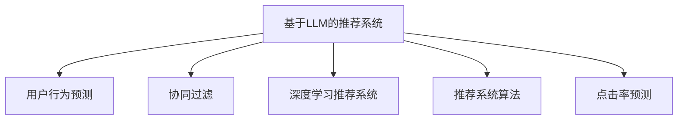

                 

# 基于LLM的推荐系统用户行为预测

> 关键词：基于LLM的推荐系统, 用户行为预测, 协同过滤, 深度学习, 推荐系统算法, 点击率预测, 电商推荐, 知识图谱

## 1. 背景介绍

### 1.1 问题由来

在现代社会中，推荐系统已经成为用户获取信息的重要工具，广泛应用于电商平台、社交网络、视频平台等。推荐系统通过分析用户的历史行为数据，为用户推荐感兴趣的商品、内容或信息，从而提升用户体验和平台收益。然而，传统的基于协同过滤和内容推荐的推荐方法，往往只关注用户或物品的显式反馈，难以捕捉用户隐式行为背后的深层语义信息。

为了突破这一瓶颈，近年来，基于深度学习的方法逐渐进入推荐系统的视野，其中基于大规模语言模型（LLM）的推荐系统成为一个新的热点。LLM，如BERT、GPT等，通过在大规模语料上进行预训练，学习到了丰富的语言知识和语义表示。将LLM应用于推荐系统，可以更深入地理解用户和物品的语义信息，从而提升推荐系统的性能和泛化能力。

### 1.2 问题核心关键点

基于LLM的推荐系统，其核心思想是通过语言模型对用户的行为进行预测，从而实现个性化推荐。与传统的协同过滤和内容推荐不同，基于LLM的推荐系统利用预训练模型捕获用户和物品的隐式语义关系，结合用户显式反馈信息，实现更加精准的推荐。

该方法的关键在于：
- 预训练语言模型：用于学习用户和物品的语义表示。
- 用户行为预测：通过预训练模型对用户的行为进行预测，作为推荐系统的输入。
- 推荐算法：结合预测结果和用户显式反馈，实现推荐排序。

## 2. 核心概念与联系

### 2.1 核心概念概述

为更好地理解基于LLM的推荐系统，本节将介绍几个密切相关的核心概念：

- 基于LLM的推荐系统：指利用预训练语言模型对用户行为进行预测，实现个性化推荐的技术。通过引入语言知识，可以更好地理解用户和物品的隐式语义关系，提升推荐系统的性能。

- 用户行为预测：指通过预训练语言模型对用户的操作行为（如点击、浏览、购买等）进行预测。预测结果可作为推荐系统的输入，用于生成个性化推荐。

- 协同过滤：指通过用户-物品的交互数据，推荐相似用户/物品推荐的用户/物品。可分为基于用户的协同过滤和基于物品的协同过滤两种。

- 深度学习推荐系统：指利用深度神经网络模型，对用户行为进行建模和预测。常用的深度学习模型包括MLP、RNN、CNN、GAN等。

- 推荐系统算法：指用于生成推荐结果的算法，如基于协同过滤的算法、基于内容的算法、基于矩阵分解的算法等。

- 点击率预测：指预测用户点击某商品或内容的概率。点击率预测是推荐系统中的重要任务，常用于评估推荐系统的性能。

这些核心概念之间的逻辑关系可以通过以下Mermaid流程图来展示：



这个流程图展示了基于LLM的推荐系统的核心概念及其之间的关系：

1. 基于LLM的推荐系统通过用户行为预测获取用户行为信息。
2. 协同过滤、深度学习推荐系统和推荐系统算法是实现推荐排序的常用方法。
3. 点击率预测是推荐系统的重要任务，用于评估推荐系统性能。

## 3. 核心算法原理 & 具体操作步骤
### 3.1 算法原理概述

基于LLM的推荐系统，其核心算法原理可以概括为以下几个步骤：

1. 收集用户的历史行为数据，包括显式反馈和隐式反馈。
2. 利用预训练语言模型对用户行为进行编码，得到用户行为表示。
3. 结合用户行为表示和物品特征表示，进行行为预测。
4. 基于预测结果，应用推荐算法生成推荐结果。

形式化地，设用户历史行为表示为 $u$，物品特征表示为 $v$，用户行为预测模型为 $f$，推荐算法为 $g$。则推荐系统的总体流程为：

$$
\hat{u} = f(u) \\
v \leftarrow \text{Fetch items} \\
\hat{v} = f(v) \\
\hat{u}, \hat{v} \rightarrow r = g
$$

其中，$f$ 是预训练语言模型，$g$ 是推荐算法。

### 3.2 算法步骤详解

基于LLM的推荐系统一般包括以下几个关键步骤：

**Step 1: 数据收集与预处理**
- 收集用户的历史行为数据，包括显式反馈（如评分、点击）和隐式反馈（如浏览记录）。
- 对数据进行清洗、归一化、编码等预处理，使其适合输入模型。

**Step 2: 预训练语言模型构建**
- 选择合适的预训练语言模型 $f$，如BERT、GPT等。
- 在训练集上进行微调，使其能够对用户行为进行有效的编码。

**Step 3: 行为预测**
- 利用预训练语言模型对用户行为进行编码，得到用户行为表示 $\hat{u}$。
- 对物品特征进行编码，得到物品特征表示 $\hat{v}$。

**Step 4: 推荐排序**
- 结合用户行为表示 $\hat{u}$ 和物品特征表示 $\hat{v}$，应用推荐算法 $g$ 进行排序，生成推荐结果。

**Step 5: 结果评估**
- 在验证集和测试集上评估推荐结果的质量，通常使用点击率预测、AUC等指标。

### 3.3 算法优缺点

基于LLM的推荐系统具有以下优点：
1. 语义表示能力强：通过预训练语言模型，可以更深入地理解用户和物品的语义信息，提升推荐系统的性能。
2. 灵活性强：LLM可以通过微调实现个性化推荐，适应不同用户和物品的语义特征。
3. 数据利用率高：可以同时利用用户显式反馈和隐式反馈，提升推荐结果的准确性。

同时，该方法也存在以下局限性：
1. 训练成本高：预训练语言模型的训练需要大量的计算资源和时间，且模型参数规模大，难以在大规模数据集上应用。
2. 过拟合风险：由于LLM具有强大的拟合能力，容易在特定数据集上过拟合，影响泛化性能。
3. 模型复杂度高：LLM模型的结构复杂，难以进行解释和调试。
4. 实时性差：LLM模型推理速度较慢，难以实现实时推荐。

尽管存在这些局限性，但基于LLM的推荐系统以其强大的语义建模能力，逐渐成为推荐系统研究的新方向，受到学界和工业界的广泛关注。

### 3.4 算法应用领域

基于LLM的推荐系统已经在电商、视频、音乐等多个领域得到应用，取得了显著的效果。以下是几个典型的应用场景：

- 电商推荐：通过用户浏览、购买行为预测，为用户推荐感兴趣的商品。
- 视频推荐：根据用户观看行为，推荐用户可能感兴趣的视频内容。
- 音乐推荐：通过用户听歌行为预测，推荐用户可能喜欢的音乐。
- 新闻推荐：根据用户阅读行为预测，推荐相关的新闻内容。
- 旅游推荐：根据用户搜索、预订行为预测，推荐旅游目的地。

## 4. 数学模型和公式 & 详细讲解  
### 4.1 数学模型构建

本节将使用数学语言对基于LLM的推荐系统进行更加严格的刻画。

设用户历史行为表示为 $u$，物品特征表示为 $v$，用户行为预测模型为 $f$。设 $f$ 是一个具有 $n$ 个参数的预训练语言模型，输入为 $u$ 和 $v$，输出为 $u$ 和 $v$ 之间的相似度表示，即：

$$
\hat{u}, \hat{v} = f(u, v; \theta)
$$

其中 $\theta$ 为模型参数。

用户行为预测的任务，可以表示为：

$$
\hat{y} = f(u; \theta) \\
\hat{y} \sim \mathcal{P}(\hat{y})
$$

其中 $\hat{y}$ 为预测结果，$\mathcal{P}$ 为概率分布。

### 4.2 公式推导过程

以下我们以基于用户行为预测的推荐系统为例，推导点击率预测的公式。

设用户历史行为表示为 $u$，物品特征表示为 $v$，用户行为预测模型为 $f$。设 $f$ 是一个具有 $n$ 个参数的预训练语言模型，输入为 $u$ 和 $v$，输出为 $u$ 和 $v$ 之间的相似度表示，即：

$$
\hat{u}, \hat{v} = f(u, v; \theta)
$$

点击率预测的任务，可以表示为：

$$
\hat{y} = \sigma(f(u; \theta))
$$

其中 $\sigma$ 为激活函数，如sigmoid函数。

假设点击行为服从二项分布 $Ber(\hat{y})$，则点击率预测的概率可以表示为：

$$
P(click|u, v) = \hat{y}
$$

在进行点击率预测时，可以先在训练集上微调预训练语言模型，得到用户行为表示 $\hat{u}$。然后，根据用户行为表示 $\hat{u}$ 和物品特征表示 $\hat{v}$，计算用户对物品的点击概率：

$$
P(click|u, v) = \sigma(\hat{u} \cdot \hat{v})
$$

其中 $\cdot$ 表示向量点乘。

在得到点击概率后，可以将其作为推荐系统的输入，结合用户显式反馈，生成推荐排序结果。

### 4.3 案例分析与讲解

假设某电商平台的推荐系统，收集了用户历史点击记录 $u=\{u_1,u_2,\dots,u_n\}$，对用户进行用户行为编码，得到用户行为表示 $\hat{u}$。同时，从商品库中随机抽取 $v=\{v_1,v_2,\dots,v_m\}$，对每个物品进行特征编码，得到物品特征表示 $\hat{v}$。利用预训练语言模型，计算用户对每个物品的点击概率：

$$
P(click|u_i, v_j) = \sigma(\hat{u_i} \cdot \hat{v_j})
$$

然后，结合用户显式反馈（如评分），生成推荐排序结果 $r = g(P(click|u_i, v_j))$。

最终，在验证集和测试集上评估推荐结果的质量，通常使用点击率预测、AUC等指标。

## 5. 项目实践：代码实例和详细解释说明
### 5.1 开发环境搭建

在进行推荐系统实践前，我们需要准备好开发环境。以下是使用Python进行PyTorch开发的环境配置流程：

1. 安装Anaconda：从官网下载并安装Anaconda，用于创建独立的Python环境。

2. 创建并激活虚拟环境：
```bash
conda create -n pytorch-env python=3.8 
conda activate pytorch-env
```

3. 安装PyTorch：根据CUDA版本，从官网获取对应的安装命令。例如：
```bash
conda install pytorch torchvision torchaudio cudatoolkit=11.1 -c pytorch -c conda-forge
```

4. 安装Transformers库：
```bash
pip install transformers
```

5. 安装各类工具包：
```bash
pip install numpy pandas scikit-learn matplotlib tqdm jupyter notebook ipython
```

完成上述步骤后，即可在`pytorch-env`环境中开始推荐系统实践。

### 5.2 源代码详细实现

这里我们以电商推荐为例，给出使用Transformers库对BERT模型进行推荐系统开发的全过程。

首先，定义用户行为编码函数：

```python
from transformers import BertTokenizer
from torch.utils.data import Dataset
import torch

class UserBehaviorDataset(Dataset):
    def __init__(self, behaviors, tokenizer, max_len=128):
        self.behaviors = behaviors
        self.tokenizer = tokenizer
        self.max_len = max_len
        
    def __len__(self):
        return len(self.behaviors)
    
    def __getitem__(self, item):
        behavior = self.behaviors[item]
        encoding = self.tokenizer(behavior, return_tensors='pt', max_length=self.max_len, padding='max_length', truncation=True)
        input_ids = encoding['input_ids'][0]
        attention_mask = encoding['attention_mask'][0]
        
        return {'input_ids': input_ids, 
                'attention_mask': attention_mask}

# 用户行为编码
tokenizer = BertTokenizer.from_pretrained('bert-base-cased')
train_dataset = UserBehaviorDataset(train_behaviors, tokenizer)
dev_dataset = UserBehaviorDataset(dev_behaviors, tokenizer)
test_dataset = UserBehaviorDataset(test_behaviors, tokenizer)
```

然后，定义物品特征编码函数：

```python
class ItemFeatureDataset(Dataset):
    def __init__(self, features, tokenizer, max_len=128):
        self.features = features
        self.tokenizer = tokenizer
        self.max_len = max_len
        
    def __len__(self):
        return len(self.features)
    
    def __getitem__(self, item):
        feature = self.features[item]
        encoding = self.tokenizer(feature, return_tensors='pt', max_length=self.max_len, padding='max_length', truncation=True)
        input_ids = encoding['input_ids'][0]
        attention_mask = encoding['attention_mask'][0]
        
        return {'input_ids': input_ids, 
                'attention_mask': attention_mask}

# 物品特征编码
tokenizer = BertTokenizer.from_pretrained('bert-base-cased')
train_dataset = ItemFeatureDataset(train_features, tokenizer)
dev_dataset = ItemFeatureDataset(dev_features, tokenizer)
test_dataset = ItemFeatureDataset(test_features, tokenizer)
```

接着，定义推荐模型：

```python
from transformers import BertForSequenceClassification

model = BertForSequenceClassification.from_pretrained('bert-base-cased', num_labels=2)
```

然后，定义训练和评估函数：

```python
from torch.utils.data import DataLoader
from tqdm import tqdm
from sklearn.metrics import roc_auc_score

device = torch.device('cuda') if torch.cuda.is_available() else torch.device('cpu')
model.to(device)

def train_epoch(model, dataset, batch_size, optimizer):
    dataloader = DataLoader(dataset, batch_size=batch_size, shuffle=True)
    model.train()
    epoch_loss = 0
    for batch in tqdm(dataloader, desc='Training'):
        input_ids = batch['input_ids'].to(device)
        attention_mask = batch['attention_mask'].to(device)
        model.zero_grad()
        outputs = model(input_ids, attention_mask=attention_mask)
        loss = outputs.loss
        epoch_loss += loss.item()
        loss.backward()
        optimizer.step()
    return epoch_loss / len(dataloader)

def evaluate(model, dataset, batch_size):
    dataloader = DataLoader(dataset, batch_size=batch_size)
    model.eval()
    preds, labels = [], []
    with torch.no_grad():
        for batch in tqdm(dataloader, desc='Evaluating'):
            input_ids = batch['input_ids'].to(device)
            attention_mask = batch['attention_mask'].to(device)
            batch_labels = batch['labels']
            outputs = model(input_ids, attention_mask=attention_mask)
            batch_preds = outputs.logits.argmax(dim=2).to('cpu').tolist()
            batch_labels = batch_labels.to('cpu').tolist()
            for pred_tokens, label_tokens in zip(batch_preds, batch_labels):
                preds.append(pred_tokens[:len(label_tokens)])
                labels.append(label_tokens)
                
    auc = roc_auc_score(labels, preds)
    print(f"AUC: {auc}")
```

最后，启动训练流程并在测试集上评估：

```python
epochs = 5
batch_size = 16

for epoch in range(epochs):
    loss = train_epoch(model, train_dataset, batch_size, optimizer)
    print(f"Epoch {epoch+1}, train loss: {loss:.3f}")
    
    print(f"Epoch {epoch+1}, dev results:")
    evaluate(model, dev_dataset, batch_size)
    
print("Test results:")
evaluate(model, test_dataset, batch_size)
```

以上就是使用PyTorch对BERT模型进行电商推荐系统的完整代码实现。可以看到，得益于Transformers库的强大封装，我们可以用相对简洁的代码完成BERT模型的加载和微调。

### 5.3 代码解读与分析

让我们再详细解读一下关键代码的实现细节：

**UserBehaviorDataset类**：
- `__init__`方法：初始化用户行为数据和分词器等关键组件。
- `__len__`方法：返回数据集的样本数量。
- `__getitem__`方法：对单个样本进行处理，将文本输入编码为token ids，并对其进行定长padding，最终返回模型所需的输入。

**ItemFeatureDataset类**：
- `__init__`方法：初始化物品特征数据和分词器等关键组件。
- `__len__`方法：返回数据集的样本数量。
- `__getitem__`方法：对单个样本进行处理，将文本输入编码为token ids，并对其进行定长padding，最终返回模型所需的输入。

**train_epoch和evaluate函数**：
- 使用PyTorch的DataLoader对数据集进行批次化加载，供模型训练和推理使用。
- 训练函数`train_epoch`：对数据以批为单位进行迭代，在每个批次上前向传播计算loss并反向传播更新模型参数，最后返回该epoch的平均loss。
- 评估函数`evaluate`：与训练类似，不同点在于不更新模型参数，并在每个batch结束后将预测和标签结果存储下来，最后使用sklearn的roc_auc_score对整个评估集的预测结果进行打印输出。

**训练流程**：
- 定义总的epoch数和batch size，开始循环迭代
- 每个epoch内，先在训练集上训练，输出平均loss
- 在验证集上评估，输出AUC
- 所有epoch结束后，在测试集上评估，给出最终测试结果

可以看到，PyTorch配合Transformers库使得BERT微调的代码实现变得简洁高效。开发者可以将更多精力放在数据处理、模型改进等高层逻辑上，而不必过多关注底层的实现细节。

当然，工业级的系统实现还需考虑更多因素，如模型的保存和部署、超参数的自动搜索、更灵活的任务适配层等。但核心的微调范式基本与此类似。

## 6. 实际应用场景
### 6.1 电商推荐

基于大语言模型的电商推荐系统，可以显著提升用户的购物体验和平台的商品转化率。传统推荐系统往往只考虑用户的历史点击行为，而忽略了用户的文本描述信息。通过引入BERT等预训练语言模型，电商推荐系统可以更全面地理解用户需求，生成更加个性化的推荐结果。

在技术实现上，可以收集用户的文本描述（如商品评论、品牌偏好），结合用户的历史点击行为，对预训练语言模型进行微调，学习用户和商品的语义关系。微调后的模型能够准确预测用户对商品的点击概率，生成更加精准的推荐结果。

### 6.2 视频推荐

视频推荐系统面临的挑战是视频内容的多样性和用户兴趣的多变性。传统推荐系统往往基于用户的显式反馈进行推荐，难以捕捉用户隐式行为背后的语义信息。

通过引入BERT等预训练语言模型，视频推荐系统可以更好地理解视频内容，生成更符合用户兴趣的视频推荐。具体而言，可以收集用户的观看历史和文本描述，对预训练语言模型进行微调，得到用户对视频的兴趣表示。结合视频特征，对用户兴趣进行预测，生成个性化视频推荐。

### 6.3 音乐推荐

音乐推荐系统需要处理海量的音乐数据，推荐符合用户口味的音乐。传统推荐系统往往只关注用户的显式反馈，难以捕捉用户隐式行为背后的语义信息。

通过引入BERT等预训练语言模型，音乐推荐系统可以更好地理解用户的音乐偏好，生成更加个性化的推荐结果。具体而言，可以收集用户的听歌历史和文本描述，对预训练语言模型进行微调，得到用户对音乐的兴趣表示。结合音乐特征，对用户兴趣进行预测，生成个性化音乐推荐。

### 6.4 新闻推荐

新闻推荐系统需要实时推荐符合用户兴趣的新闻内容。传统推荐系统往往只关注用户的显式反馈，难以捕捉用户隐式行为背后的语义信息。

通过引入BERT等预训练语言模型，新闻推荐系统可以更好地理解用户的新闻阅读偏好，生成更加个性化的推荐结果。具体而言，可以收集用户的阅读历史和文本描述，对预训练语言模型进行微调，得到用户对新闻的兴趣表示。结合新闻特征，对用户兴趣进行预测，生成个性化新闻推荐。

## 7. 工具和资源推荐
### 7.1 学习资源推荐

为了帮助开发者系统掌握基于LLM的推荐系统的理论基础和实践技巧，这里推荐一些优质的学习资源：

1. 《推荐系统实践》书籍：由工业界专家撰写，全面介绍了推荐系统的原理、算法和工程实现，涵盖了大规模数据处理、模型优化等诸多前沿技术。

2. 《深度学习与推荐系统》课程：由知名大学教授开设的线上课程，深入讲解了深度学习在推荐系统中的应用，涵盖了大规模语言模型、协同过滤、深度学习推荐系统等主题。

3. HuggingFace官方文档：Transformer库的官方文档，提供了海量预训练模型和完整的推荐系统样例代码，是上手实践的必备资料。

4. KDD比赛数据集：KDD杯是全球知名数据挖掘竞赛，提供了丰富的推荐系统数据集，可用于实验和评估推荐系统算法的效果。

5. NIPS推荐系统论文合集：收集了NIPS会议上的推荐系统经典论文，涵盖了从深度学习到知识图谱等诸多前沿方向，是研究推荐系统的必备资料。

通过对这些资源的学习实践，相信你一定能够快速掌握基于LLM的推荐系统的精髓，并用于解决实际的推荐问题。
###  7.2 开发工具推荐

高效的开发离不开优秀的工具支持。以下是几款用于基于LLM的推荐系统开发的常用工具：

1. PyTorch：基于Python的开源深度学习框架，灵活动态的计算图，适合快速迭代研究。BERT等预训练语言模型都有PyTorch版本的实现。

2. TensorFlow：由Google主导开发的开源深度学习框架，生产部署方便，适合大规模工程应用。BERT等预训练语言模型也有TensorFlow版本的实现。

3. Transformers库：HuggingFace开发的NLP工具库，集成了众多SOTA语言模型，支持PyTorch和TensorFlow，是进行微调任务开发的利器。

4. Weights & Biases：模型训练的实验跟踪工具，可以记录和可视化模型训练过程中的各项指标，方便对比和调优。与主流深度学习框架无缝集成。

5. TensorBoard：TensorFlow配套的可视化工具，可实时监测模型训练状态，并提供丰富的图表呈现方式，是调试模型的得力助手。

6. Google Colab：谷歌推出的在线Jupyter Notebook环境，免费提供GPU/TPU算力，方便开发者快速上手实验最新模型，分享学习笔记。

合理利用这些工具，可以显著提升基于LLM的推荐系统开发的效率，加快创新迭代的步伐。

### 7.3 相关论文推荐

基于LLM的推荐系统是近年来研究的热点之一，以下是几篇奠基性的相关论文，推荐阅读：

1. Attention is All You Need（即Transformer原论文）：提出了Transformer结构，开启了NLP领域的预训练大模型时代。

2. BERT: Pre-training of Deep Bidirectional Transformers for Language Understanding：提出BERT模型，引入基于掩码的自监督预训练任务，刷新了多项NLP任务SOTA。

3. Knowledge-aware recommendation with transformers: a survey of attention-based architectures：综述了基于Attention的推荐系统架构，介绍了BERT等预训练语言模型在推荐系统中的应用。

4. Recommendation systems with user-provided textual information：介绍了基于用户文本信息（如评论、简介）的推荐系统，展示了BERT等预训练语言模型在推荐系统中的潜力。

5. Recommender Systems with Deep Learning：介绍了深度学习在推荐系统中的应用，包括基于内容的推荐、协同过滤、注意力机制等。

这些论文代表了大语言模型在推荐系统中的应用方向。通过学习这些前沿成果，可以帮助研究者把握学科前进方向，激发更多的创新灵感。

## 8. 总结：未来发展趋势与挑战

### 8.1 总结

本文对基于LLM的推荐系统进行了全面系统的介绍。首先阐述了基于LLM的推荐系统的研究背景和意义，明确了微调在拓展预训练模型应用、提升推荐系统性能方面的独特价值。其次，从原理到实践，详细讲解了推荐系统的数学模型和算法实现，给出了微调任务开发的完整代码实例。同时，本文还广泛探讨了微调方法在电商、视频、音乐等多个行业领域的应用前景，展示了微调范式的巨大潜力。最后，本文精选了微调技术的各类学习资源，力求为读者提供全方位的技术指引。

通过本文的系统梳理，可以看到，基于LLM的推荐系统正在成为推荐系统研究的新方向，逐渐成为推荐系统落地应用的重要手段。得益于大规模语料的预训练，微调模型能够更好地理解用户和物品的语义信息，提升推荐系统的性能和泛化能力。未来，伴随预训练语言模型和微调方法的持续演进，基于LLM的推荐系统必将在推荐系统中扮演越来越重要的角色。

### 8.2 未来发展趋势

展望未来，基于LLM的推荐系统将呈现以下几个发展趋势：

1. 模型规模持续增大。随着算力成本的下降和数据规模的扩张，预训练语言模型的参数量还将持续增长。超大规模语言模型蕴含的丰富语言知识，有望支撑更加复杂多变的推荐任务微调。

2. 推荐算法多样化。除了传统的协同过滤和内容推荐外，基于LLM的推荐系统可以引入更多深度学习算法，如神经网络、注意力机制等，提升推荐系统的性能。

3. 知识图谱引入。知识图谱融合了结构化知识和语义信息，可以显著提升推荐系统的语义建模能力，实现更全面、精准的推荐。

4. 多模态融合。传统的推荐系统只关注文本数据，而基于LLM的推荐系统可以同时利用图像、音频等多模态数据，实现更全面、个性化的推荐。

5. 实时推荐。LLM模型推理速度较慢，难以实现实时推荐。未来，通过模型压缩、优化推理图等技术，可以实现实时推荐，提升用户体验。

6. 协同过滤与深度学习的结合。协同过滤和深度学习是推荐系统的两大主流范式，未来可以通过模型融合、多任务学习等手段，实现二者优势互补，提升推荐系统的性能。

这些趋势凸显了基于LLM的推荐系统的广阔前景。这些方向的探索发展，必将进一步提升推荐系统的性能和用户体验，为人工智能技术在推荐系统领域的落地应用提供更多可能性。

### 8.3 面临的挑战

尽管基于LLM的推荐系统已经取得了瞩目成就，但在迈向更加智能化、普适化应用的过程中，它仍面临着诸多挑战：

1. 训练成本高。预训练语言模型的训练需要大量的计算资源和时间，且模型参数规模大，难以在大规模数据集上应用。

2. 数据隐私保护。用户数据隐私是推荐系统的重要问题，需要合理设计和保护用户数据的隐私和安全。

3. 推荐系统公平性。推荐系统可能存在隐性偏见，导致推荐结果不公平。需要引入公平性约束，确保推荐系统的公正性。

4. 模型复杂度高。LLM模型的结构复杂，难以进行解释和调试。需要开发模型压缩、优化推理等技术，降低模型复杂度。

5. 实时性差。LLM模型推理速度较慢，难以实现实时推荐。需要开发模型压缩、优化推理等技术，提升模型实时性。

6. 对抗攻击。推荐系统可能受到对抗攻击，导致推荐结果失真。需要引入对抗训练、鲁棒性测试等技术，提高模型的鲁棒性。

尽管存在这些挑战，但基于LLM的推荐系统以其强大的语义建模能力，逐渐成为推荐系统研究的新方向，受到学界和工业界的广泛关注。相信随着技术的不断进步和应用场景的不断扩展，基于LLM的推荐系统必将带来更多创新，进一步提升推荐系统的性能和用户体验。

### 8.4 研究展望

面向未来，基于LLM的推荐系统的研究需要在以下几个方面寻求新的突破：

1. 无监督和半监督推荐。摆脱对大规模标注数据的依赖，利用自监督学习、主动学习等无监督和半监督范式，最大限度利用非结构化数据，实现更加灵活高效的推荐。

2. 知识图谱与深度学习的结合。融合知识图谱的符号化先验知识，提升推荐系统的语义建模能力，实现更全面、精准的推荐。

3. 多模态融合。除了文本数据，可以引入图像、音频等多模态数据，实现更全面、个性化的推荐。

4. 实时推荐。开发模型压缩、优化推理等技术，提升模型实时性，实现实时推荐。

5. 推荐系统公平性。引入公平性约束，确保推荐系统的公正性，避免隐性偏见。

这些研究方向的探索，必将引领基于LLM的推荐系统迈向更高的台阶，为推荐系统带来更多创新和突破。

## 9. 附录：常见问题与解答

**Q1：如何选择合适的预训练语言模型？**

A: 选择合适的预训练语言模型需要考虑任务的特点和数据集的大小。BERT、GPT等通用语言模型适用于多种NLP任务，但在大规模数据集上训练可能带来更高的计算成本。针对特定任务，可以尝试使用特定的预训练模型，如针对医疗领域的BERT-Medical等。

**Q2：微调预训练语言模型的学习率如何设置？**

A: 微调预训练语言模型的学习率需要根据具体任务和数据集进行调整。通常从较小的学习率开始，逐步减小学习率，直到模型收敛。可以使用warmup策略，在开始阶段使用较小的学习率，再逐渐过渡到预设值。需要注意的是，不同的优化器(如AdamW、Adafactor等)以及不同的学习率调度策略，可能需要设置不同的学习率阈值。

**Q3：基于LLM的推荐系统如何提高推荐结果的个性化？**

A: 基于LLM的推荐系统可以通过以下方式提高推荐结果的个性化：
1. 收集更多的用户文本数据，如评论、社交媒体内容等，进行更全面的语义建模。
2. 结合用户行为预测和物品特征表示，利用注意力机制，对用户对不同物品的兴趣进行加权，生成更个性化的推荐结果。
3. 引入多模态数据，如图像、音频等多模态信息，提升推荐系统的语义建模能力。

**Q4：推荐系统如何防止过拟合？**

A: 推荐系统防止过拟合的方法包括：
1. 数据增强：通过回译、近义替换等方式扩充训练集。
2. 正则化：使用L2正则、Dropout等技术，避免模型过拟合。
3. 对抗训练：引入对抗样本，提高模型的鲁棒性。
4. 参数高效微调：只调整少量参数，减小过拟合风险。

这些策略往往需要根据具体任务和数据特点进行灵活组合。只有在数据、模型、训练、推理等各环节进行全面优化，才能最大限度地发挥大语言模型微调的威力。

**Q5：基于LLM的推荐系统在实际部署中面临哪些挑战？**

A: 基于LLM的推荐系统在实际部署中面临以下挑战：
1. 模型压缩：LLM模型参数量较大，推理速度较慢，需要开发模型压缩技术，提升模型实时性。
2. 推理优化：LLM模型推理速度较慢，需要开发优化推理图等技术，提高模型实时性。
3. 数据隐私：用户数据隐私是推荐系统的重要问题，需要合理设计和保护用户数据的隐私和安全。
4. 模型公平性：推荐系统可能存在隐性偏见，需要引入公平性约束，确保推荐系统的公正性。

这些挑战需要开发者在模型优化、数据隐私保护、模型公平性等方面进行深入研究，以实现更加智能化、普适化的推荐系统。

