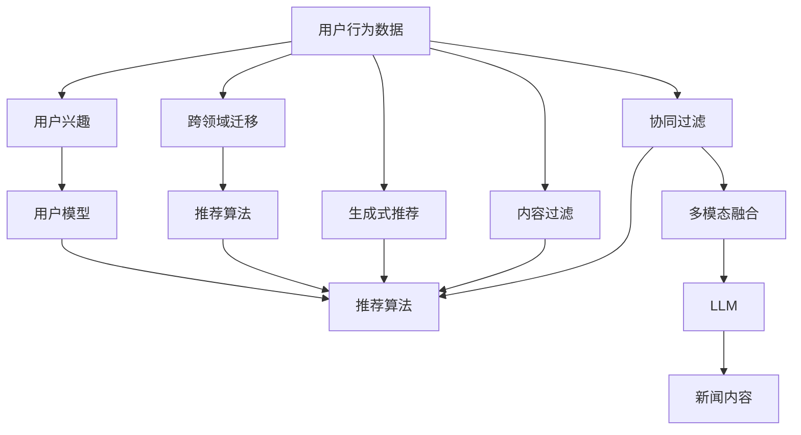

                 

# 基于LLM的生成式新闻推荐系统GENRE

> 关键词：新闻推荐,生成式模型,语言模型,用户个性化,跨领域迁移,多模态融合

## 1. 背景介绍

### 1.1 问题由来
随着互联网技术的快速发展，新闻信息量呈爆炸式增长，用户获取信息的渠道和方式也日趋多样化。然而，面对海量的信息源，用户往往难以快速找到感兴趣的内容，甚至出现信息过载和碎片化阅读的现象。为了解决这一问题，推荐系统应运而生，通过分析用户的历史行为和兴趣偏好，为用户推荐最相关的信息，提升用户体验和信息获取效率。

新闻推荐作为推荐系统的一个重要分支，致力于为用户推荐与当前兴趣和需求最相关的新闻内容。传统的新闻推荐系统通常基于用户历史行为数据进行相似度匹配，忽略了大规模语料中隐含的丰富语言知识和语义信息。近年来，随着大语言模型(Large Language Model, LLM)技术的发展，新闻推荐系统开始引入LLM进行内容生成和推荐，带来了显著的性能提升和应用效果。

### 1.2 问题核心关键点
基于LLM的新闻推荐系统，主要包括以下几个关键点：

- **大语言模型**：如BERT、GPT-3等，通过对大规模无标签文本进行预训练，学习到丰富的语言知识和语义信息，具备强大的文本生成能力。
- **推荐算法**：通常基于用户行为数据分析，如点击、浏览、收藏等，结合预训练模型进行推荐。
- **多模态融合**：新闻推荐通常包含文本、图像、视频等多种模态信息，需要设计合适的融合方式。
- **跨领域迁移**：新闻领域内的不同主题和新闻类型，如体育、财经、娱乐等，需要模型具备良好的跨领域迁移能力。
- **生成式内容推荐**：与传统的基于相似度的推荐方法不同，生成式方法可以生成用户感兴趣的新新闻内容，提升推荐的多样性和新颖性。

这些关键点共同构成了基于LLM的新闻推荐系统的核心框架，使其能够高效、精准地为用户提供个性化新闻内容推荐。

## 2. 核心概念与联系

### 2.1 核心概念概述

为了更好地理解基于LLM的新闻推荐系统，我们首先介绍几个核心概念及其之间的联系。

- **大语言模型(LLM)**：通过对大规模文本数据进行预训练，学习到语言表征和语义信息的深度模型，如BERT、GPT等。
- **新闻推荐系统**：基于用户历史行为数据，为用户推荐最相关的新闻内容，提升用户体验和信息获取效率的系统。
- **推荐算法**：利用协同过滤、内容过滤、混合过滤等算法，对用户行为数据进行分析，生成推荐结果。
- **多模态融合**：将文本、图像、视频等不同模态的信息进行综合，提升推荐的全面性和准确性。
- **生成式内容推荐**：利用预训练模型生成用户感兴趣的新内容，提升推荐的多样性和新颖性。
- **跨领域迁移**：模型在跨领域、跨主题上的泛化能力，保证在不同领域内的推荐性能。

这些概念之间的联系和作用关系，可以通过以下Mermaid流程图进行展示：



这个流程图展示了基于LLM的新闻推荐系统的主要组成和数据流动：

1. **用户行为数据**通过协同过滤和内容过滤算法进行处理，生成初步的推荐结果。
2. **生成式推荐**通过预训练模型生成新的新闻内容，提升推荐的多样性和新颖性。
3. **多模态融合**将文本、图像、视频等不同模态的信息进行综合，提升推荐的全面性和准确性。
4. **跨领域迁移**使模型具备良好的泛化能力，在不同领域内的推荐性能。

这些概念共同构成了基于LLM的新闻推荐系统的核心框架，使其能够高效、精准地为用户提供个性化新闻内容推荐。

## 3. 核心算法原理 & 具体操作步骤
### 3.1 算法原理概述

基于LLM的新闻推荐系统，核心算法原理是通过对预训练模型进行微调，利用其语言生成能力，生成与用户兴趣相关的新闻内容，同时结合用户行为数据进行推荐。其核心思想如下：

1. **预训练模型微调**：在预训练模型上进行微调，使其能够生成与用户兴趣相关的新闻内容。
2. **用户行为分析**：通过分析用户的历史行为数据，如点击、浏览、收藏等，了解用户的兴趣和偏好。
3. **推荐算法融合**：将预训练模型的生成结果和用户行为分析结果进行融合，生成最终的推荐结果。
4. **多模态融合**：结合新闻内容的文本、图像、视频等不同模态的信息，提升推荐的全面性和准确性。
5. **跨领域迁移**：利用预训练模型在不同领域内的泛化能力，提升推荐系统的通用性。

### 3.2 算法步骤详解

基于LLM的新闻推荐系统通常包括以下关键步骤：

**Step 1: 数据准备**
- **新闻数据准备**：收集新闻网站、新闻APP等平台的新闻数据，标注新闻主题、作者、发布时间等元信息。
- **用户行为数据准备**：收集用户点击、浏览、收藏等行为数据，并进行预处理和特征提取。

**Step 2: 模型微调**
- **选择预训练模型**：选择合适的预训练模型，如BERT、GPT等，作为微调的基础。
- **设计任务适配层**：根据新闻推荐任务，设计合适的任务适配层，如分类层、生成层等。
- **准备训练数据**：将新闻数据和用户行为数据划分为训练集、验证集和测试集，并进行标注和预处理。
- **设置微调超参数**：包括学习率、优化器、正则化技术等，以保证微调效果和模型泛化能力。
- **执行微调**：使用训练集对预训练模型进行微调，通过优化算法更新模型参数，直到收敛。

**Step 3: 生成推荐内容**
- **用户兴趣分析**：通过分析用户的历史行为数据，确定用户的兴趣和偏好。
- **生成新闻内容**：使用微调后的预训练模型生成与用户兴趣相关的新闻内容。
- **内容融合和排序**：将生成的新闻内容和用户行为数据进行融合，结合多模态信息，生成最终推荐结果，并根据排序算法进行排序。

**Step 4: 测试和部署**
- **模型评估**：在测试集上评估模型的性能，如准确率、召回率、F1值等指标。
- **模型部署**：将微调后的模型部署到实际应用环境中，进行实时新闻推荐。
- **持续优化**：根据用户反馈和推荐效果，不断优化模型参数和推荐算法，提升推荐系统性能。

### 3.3 算法优缺点

基于LLM的新闻推荐系统具有以下优点：
1. **生成能力强大**：利用预训练模型的语言生成能力，生成多样化和新颖的新闻内容，提升推荐的多样性。
2. **跨领域适应性强**：预训练模型在跨领域、跨主题上的泛化能力，保证在不同领域内的推荐性能。
3. **用户兴趣匹配精准**：结合用户行为数据，准确把握用户兴趣和偏好，生成个性化推荐内容。
4. **可解释性高**：预训练模型的语言生成过程可以解释，便于调试和优化。
5. **动态更新能力**：模型能够根据最新的用户行为数据进行动态更新，保证推荐内容的时效性。

同时，该方法也存在一些局限性：
1. **资源消耗高**：预训练模型参数量巨大，微调和推理过程资源消耗高。
2. **泛化能力有限**：对于冷启动用户，由于缺乏历史行为数据，推荐效果可能较差。
3. **对抗样本风险**：预训练模型的语言生成过程可能受到对抗样本的影响，生成错误内容。
4. **多模态数据融合复杂**：不同模态信息之间的融合需要设计合适的算法，处理复杂度较高。
5. **模型解释性问题**：预训练模型的黑盒特性可能影响推荐的可解释性和可信任度。

尽管存在这些局限性，但基于LLM的新闻推荐系统在实际应用中已经取得了显著效果，展示了其强大的潜力和应用前景。

### 3.4 算法应用领域

基于LLM的新闻推荐系统已经在多个领域得到应用，例如：

- **新闻聚合平台**：如今日头条、腾讯新闻等，为用户提供个性化新闻内容推荐，提升用户体验。
- **智能新闻APP**：如Zhihu、搜狐新闻等，利用LLM生成和推荐新闻内容，满足用户多样化需求。
- **社交媒体平台**：如微博、微信等，结合用户行为数据和兴趣标签，生成个性化新闻推荐。
- **企业新闻管理**：企业内部新闻推荐系统，根据员工兴趣和需求，推荐内部新闻和资讯。

此外，基于LLM的新闻推荐系统还被创新性地应用于新闻预测、趋势分析、舆情监测等多个场景中，为新闻业态带来新的变革和机遇。

## 4. 数学模型和公式 & 详细讲解
### 4.1 数学模型构建

基于LLM的新闻推荐系统，核心数学模型通常包括以下几个部分：

- **用户行为模型**：描述用户点击、浏览、收藏等行为的数据建模。
- **预训练模型**：通过大规模文本数据进行预训练的语言模型，如BERT、GPT等。
- **推荐模型**：结合预训练模型和用户行为数据，生成推荐结果的模型。

以二分类任务为例，数学模型构建如下：

假设预训练模型为 $M_{\theta}$，用户行为数据为 $D_u=\{(x_{ui},y_{ui})\}_{i=1}^N, x_{ui} \in \mathcal{X}, y_{ui} \in \{0,1\}$，其中 $x_{ui}$ 表示用户 $u$ 在时间 $t$ 对新闻 $i$ 的点击行为，$y_{ui}$ 表示行为标记。

定义推荐模型 $M$ 在用户行为数据上的损失函数为 $\ell(M_{\theta},D_u)$，则总损失函数为：

$$
\mathcal{L}(\theta) = \frac{1}{N} \sum_{i=1}^N \ell(M_{\theta}(x_{ui}),y_{ui})
$$

其中 $\ell$ 为二分类交叉熵损失函数，$M_{\theta}(x_{ui})$ 为预训练模型在用户行为数据上的输出。

### 4.2 公式推导过程

以二分类任务为例，推导交叉熵损失函数及其梯度的计算公式。

假设模型 $M_{\theta}$ 在用户行为数据 $D_u$ 上的输出为 $\hat{y}=M_{\theta}(x_{ui}) \in [0,1]$，表示用户 $u$ 在时间 $t$ 对新闻 $i$ 的点击行为属于正类（点击）的概率。真实标签 $y_{ui} \in \{0,1\}$。则二分类交叉熵损失函数定义为：

$$
\ell(M_{\theta}(x_{ui}),y_{ui}) = -[y_{ui}\log \hat{y}_{ui} + (1-y_{ui})\log (1-\hat{y}_{ui})]
$$

将其代入总损失函数，得：

$$
\mathcal{L}(\theta) = -\frac{1}{N}\sum_{i=1}^N \sum_{u=1}^N [y_{ui}\log M_{\theta}(x_{ui})+(1-y_{ui})\log(1-M_{\theta}(x_{ui}))
$$

根据链式法则，损失函数对参数 $\theta_k$ 的梯度为：

$$
\frac{\partial \mathcal{L}(\theta)}{\partial \theta_k} = -\frac{1}{N}\sum_{i=1}^N \sum_{u=1}^N \left(\frac{y_{ui}}{M_{\theta}(x_{ui})}-\frac{1-y_{ui}}{1-M_{\theta}(x_{ui})}\right) \frac{\partial M_{\theta}(x_{ui})}{\partial \theta_k}
$$

其中 $\frac{\partial M_{\theta}(x_{ui})}{\partial \theta_k}$ 可进一步递归展开，利用自动微分技术完成计算。

在得到损失函数的梯度后，即可带入参数更新公式，完成模型的迭代优化。重复上述过程直至收敛，最终得到适应用户行为数据的最优模型参数 $\theta^*$。

### 4.3 案例分析与讲解

以一个实际案例为例，分析基于LLM的新闻推荐系统在实际应用中的构建和优化过程。

假设我们要为一家新闻聚合平台构建基于LLM的新闻推荐系统。首先，收集平台上的新闻数据，标注新闻主题、作者、发布时间等元信息，并存储到数据库中。然后，收集用户的历史行为数据，包括点击、浏览、收藏等行为数据，并将其存储到日志系统中。

接下来，我们选择BERT作为预训练模型，并对其进行微调，使其能够生成与用户兴趣相关的新闻内容。具体步骤如下：

1. **数据预处理**：将新闻数据和用户行为数据进行清洗和预处理，去除噪声和无关信息，提取有用的特征。
2. **任务适配层设计**：在BERT模型顶层添加分类层，用于对用户行为数据进行分类，如是否点击、是否收藏等。
3. **微调模型训练**：使用新闻数据和用户行为数据，在GPU上对BERT模型进行微调，学习到与用户兴趣相关的新闻内容生成能力。
4. **推荐模型评估**：在测试集上评估微调后的BERT模型的性能，如准确率、召回率、F1值等指标，确保推荐效果。
5. **推荐算法融合**：结合用户行为数据和微调后的BERT模型的输出，设计推荐算法，生成最终推荐结果。
6. **多模态融合**：将新闻内容的多模态信息进行综合，提升推荐的全面性和准确性。
7. **跨领域迁移**：利用预训练模型的跨领域迁移能力，提升推荐系统在不同领域内的性能。

通过以上步骤，即可构建基于LLM的新闻推荐系统，为用户提供个性化新闻内容推荐。

## 5. 项目实践：代码实例和详细解释说明
### 5.1 开发环境搭建

在进行项目实践前，我们需要准备好开发环境。以下是使用Python进行PyTorch开发的环境配置流程：

1. 安装Anaconda：从官网下载并安装Anaconda，用于创建独立的Python环境。

2. 创建并激活虚拟环境：
```bash
conda create -n pytorch-env python=3.8 
conda activate pytorch-env
```

3. 安装PyTorch：根据CUDA版本，从官网获取对应的安装命令。例如：
```bash
conda install pytorch torchvision torchaudio cudatoolkit=11.1 -c pytorch -c conda-forge
```

4. 安装Transformers库：
```bash
pip install transformers
```

5. 安装各类工具包：
```bash
pip install numpy pandas scikit-learn matplotlib tqdm jupyter notebook ipython
```

完成上述步骤后，即可在`pytorch-env`环境中开始项目实践。

### 5.2 源代码详细实现

下面我们以一个简单的二分类推荐任务为例，给出使用Transformers库对BERT模型进行微调的PyTorch代码实现。

首先，定义推荐任务的数据处理函数：

```python
from transformers import BertTokenizer
from torch.utils.data import Dataset
import torch

class NewsDataset(Dataset):
    def __init__(self, news_data, user_data, tokenizer, max_len=128):
        self.news_data = news_data
        self.user_data = user_data
        self.tokenizer = tokenizer
        self.max_len = max_len
        
    def __len__(self):
        return len(self.news_data)
    
    def __getitem__(self, item):
        news_text = self.news_data[item]['text']
        user_behavior = self.user_data[item]['behavior']
        
        encoding = self.tokenizer(news_text, return_tensors='pt', max_length=self.max_len, padding='max_length', truncation=True)
        input_ids = encoding['input_ids'][0]
        attention_mask = encoding['attention_mask'][0]
        
        # 对token-wise的标签进行编码
        encoded_labels = [int(l) for l in user_behavior] 
        encoded_labels.extend([0] * (self.max_len - len(encoded_labels)))
        labels = torch.tensor(encoded_labels, dtype=torch.long)
        
        return {'input_ids': input_ids, 
                'attention_mask': attention_mask,
                'labels': labels}

# 定义标签与id的映射
label2id = {0: 0, 1: 1}
id2label = {v: k for k, v in label2id.items()}

# 创建dataset
tokenizer = BertTokenizer.from_pretrained('bert-base-cased')

train_dataset = NewsDataset(train_news, train_user_behavior, tokenizer)
dev_dataset = NewsDataset(dev_news, dev_user_behavior, tokenizer)
test_dataset = NewsDataset(test_news, test_user_behavior, tokenizer)
```

然后，定义模型和优化器：

```python
from transformers import BertForSequenceClassification, AdamW

model = BertForSequenceClassification.from_pretrained('bert-base-cased', num_labels=len(label2id))

optimizer = AdamW(model.parameters(), lr=2e-5)
```

接着，定义训练和评估函数：

```python
from torch.utils.data import DataLoader
from tqdm import tqdm
from sklearn.metrics import classification_report

device = torch.device('cuda') if torch.cuda.is_available() else torch.device('cpu')
model.to(device)

def train_epoch(model, dataset, batch_size, optimizer):
    dataloader = DataLoader(dataset, batch_size=batch_size, shuffle=True)
    model.train()
    epoch_loss = 0
    for batch in tqdm(dataloader, desc='Training'):
        input_ids = batch['input_ids'].to(device)
        attention_mask = batch['attention_mask'].to(device)
        labels = batch['labels'].to(device)
        model.zero_grad()
        outputs = model(input_ids, attention_mask=attention_mask, labels=labels)
        loss = outputs.loss
        epoch_loss += loss.item()
        loss.backward()
        optimizer.step()
    return epoch_loss / len(dataloader)

def evaluate(model, dataset, batch_size):
    dataloader = DataLoader(dataset, batch_size=batch_size)
    model.eval()
    preds, labels = [], []
    with torch.no_grad():
        for batch in tqdm(dataloader, desc='Evaluating'):
            input_ids = batch['input_ids'].to(device)
            attention_mask = batch['attention_mask'].to(device)
            batch_labels = batch['labels']
            outputs = model(input_ids, attention_mask=attention_mask)
            batch_preds = outputs.logits.argmax(dim=2).to('cpu').tolist()
            batch_labels = batch_labels.to('cpu').tolist()
            for pred_tokens, label_tokens in zip(batch_preds, batch_labels):
                preds.append(pred_tokens[:len(label_tokens)])
                labels.append(label_tokens)
                
    print(classification_report(labels, preds))
```

最后，启动训练流程并在测试集上评估：

```python
epochs = 5
batch_size = 16

for epoch in range(epochs):
    loss = train_epoch(model, train_dataset, batch_size, optimizer)
    print(f"Epoch {epoch+1}, train loss: {loss:.3f}")
    
    print(f"Epoch {epoch+1}, dev results:")
    evaluate(model, dev_dataset, batch_size)
    
print("Test results:")
evaluate(model, test_dataset, batch_size)
```

以上就是使用PyTorch对BERT进行二分类推荐任务微调的完整代码实现。可以看到，得益于Transformers库的强大封装，我们可以用相对简洁的代码完成BERT模型的加载和微调。

### 5.3 代码解读与分析

让我们再详细解读一下关键代码的实现细节：

**NewsDataset类**：
- `__init__`方法：初始化新闻和用户行为数据，分词器等关键组件。
- `__len__`方法：返回数据集的样本数量。
- `__getitem__`方法：对单个样本进行处理，将新闻文本输入编码为token ids，将标签编码为数字，并对其进行定长padding，最终返回模型所需的输入。

**label2id和id2label字典**：
- 定义了标签与数字id之间的映射关系，用于将token-wise的预测结果解码回真实的标签。

**训练和评估函数**：
- 使用PyTorch的DataLoader对数据集进行批次化加载，供模型训练和推理使用。
- 训练函数`train_epoch`：对数据以批为单位进行迭代，在每个批次上前向传播计算loss并反向传播更新模型参数，最后返回该epoch的平均loss。
- 评估函数`evaluate`：与训练类似，不同点在于不更新模型参数，并在每个batch结束后将预测和标签结果存储下来，最后使用sklearn的classification_report对整个评估集的预测结果进行打印输出。

**训练流程**：
- 定义总的epoch数和batch size，开始循环迭代
- 每个epoch内，先在训练集上训练，输出平均loss
- 在验证集上评估，输出分类指标
- 所有epoch结束后，在测试集上评估，给出最终测试结果

可以看到，PyTorch配合Transformers库使得BERT微调的代码实现变得简洁高效。开发者可以将更多精力放在数据处理、模型改进等高层逻辑上，而不必过多关注底层的实现细节。

当然，工业级的系统实现还需考虑更多因素，如模型的保存和部署、超参数的自动搜索、更灵活的任务适配层等。但核心的微调范式基本与此类似。

## 6. 实际应用场景
### 6.1 智能新闻聚合平台

基于LLM的新闻推荐系统，可以广泛应用于智能新闻聚合平台的构建。传统新闻聚合平台往往需要配备大量人力，高峰期响应缓慢，且推荐内容质量难以保证。而使用LLM进行推荐，可以7x24小时不间断服务，快速响应用户需求，推荐多样化和高质量的新闻内容。

在技术实现上，可以收集平台上的新闻数据，将用户点击、浏览、收藏等行为数据进行标注，在此基础上对预训练模型进行微调。微调后的模型能够自动理解用户兴趣和行为，生成个性化推荐新闻内容，提升用户体验。对于新用户，可以结合多模态信息进行推荐，确保冷启动效果。

### 6.2 智能新闻APP

智能新闻APP通常提供多种新闻分类，如娱乐、体育、财经等。用户可以根据自身兴趣选择不同频道，新闻APP也可以根据用户历史行为数据进行推荐。

在新闻APP中，可以使用LLM进行新闻推荐。首先，收集用户的历史点击、浏览、收藏等行为数据，并将这些数据标注为不同分类的新闻。然后，对预训练模型进行微调，使其能够生成与用户兴趣相关的新闻内容。最后，结合用户行为数据和微调后的模型输出，设计推荐算法，生成个性化推荐新闻。

### 6.3 社交媒体平台

社交媒体平台上的新闻推荐，通常结合用户兴趣标签、好友推荐等多种因素。用户可以在平台上发布、评论新闻，与其他用户互动。

在社交媒体平台上，可以使用LLM进行新闻推荐。首先，收集用户发布的新闻、评论等文本数据，并进行文本分类和情感分析。然后，对预训练模型进行微调，使其能够生成与用户兴趣相关的新闻内容。最后，结合用户兴趣标签、好友推荐等多样化的信息，设计推荐算法，生成个性化推荐新闻。

### 6.4 未来应用展望

随着LLM和微调方法的不断发展，基于LLM的新闻推荐系统将在更多领域得到应用，为新闻业态带来新的变革和机遇。

在智慧媒体领域，基于LLM的新闻推荐系统可以实时抓取和推荐新闻，提升新闻的时效性和覆盖范围。在政府部门，可以使用新闻推荐系统进行舆情监测和信息发布，确保信息公开透明。在教育领域，可以利用新闻推荐系统进行新闻素养教育，培养学生的信息获取能力。

此外，基于LLM的新闻推荐系统还被创新性地应用于新闻预测、趋势分析、舆情监测等多个场景中，为新闻业态带来新的突破和机遇。相信随着预训练语言模型和微调方法的不断进步，基于LLM的新闻推荐系统将更加智能化、个性化，为新闻业态带来深远影响。

## 7. 工具和资源推荐
### 7.1 学习资源推荐

为了帮助开发者系统掌握基于LLM的新闻推荐系统的理论和实践，这里推荐一些优质的学习资源：

1. 《Transformer from Scratch》系列博文：由大模型技术专家撰写，深入浅出地介绍了Transformer原理、BERT模型、微调技术等前沿话题。

2. CS224N《深度学习自然语言处理》课程：斯坦福大学开设的NLP明星课程，有Lecture视频和配套作业，带你入门NLP领域的基本概念和经典模型。

3. 《Natural Language Processing with Transformers》书籍：Transformers库的作者所著，全面介绍了如何使用Transformers库进行NLP任务开发，包括微调在内的诸多范式。

4. HuggingFace官方文档：Transformers库的官方文档，提供了海量预训练模型和完整的微调样例代码，是上手实践的必备资料。

5. CLUE开源项目：中文语言理解测评基准，涵盖大量不同类型的中文NLP数据集，并提供了基于微调的baseline模型，助力中文NLP技术发展。

通过对这些资源的学习实践，相信你一定能够快速掌握基于LLM的新闻推荐系统的精髓，并用于解决实际的NLP问题。
###  7.2 开发工具推荐

高效的开发离不开优秀的工具支持。以下是几款用于基于LLM的新闻推荐系统开发的常用工具：

1. PyTorch：基于Python的开源深度学习框架，灵活动态的计算图，适合快速迭代研究。大部分预训练语言模型都有PyTorch版本的实现。

2. TensorFlow：由Google主导开发的开源深度学习框架，生产部署方便，适合大规模工程应用。同样有丰富的预训练语言模型资源。

3. Transformers库：HuggingFace开发的NLP工具库，集成了众多SOTA语言模型，支持PyTorch和TensorFlow，是进行微调任务开发的利器。

4. Weights & Biases：模型训练的实验跟踪工具，可以记录和可视化模型训练过程中的各项指标，方便对比和调优。与主流深度学习框架无缝集成。

5. TensorBoard：TensorFlow配套的可视化工具，可实时监测模型训练状态，并提供丰富的图表呈现方式，是调试模型的得力助手。

6. Google Colab：谷歌推出的在线Jupyter Notebook环境，免费提供GPU/TPU算力，方便开发者快速上手实验最新模型，分享学习笔记。

合理利用这些工具，可以显著提升基于LLM的新闻推荐系统的开发效率，加快创新迭代的步伐。

### 7.3 相关论文推荐

大语言模型和新闻推荐技术的发展源于学界的持续研究。以下是几篇奠基性的相关论文，推荐阅读：

1. Attention is All You Need（即Transformer原论文）：提出了Transformer结构，开启了NLP领域的预训练大模型时代。

2. BERT: Pre-training of Deep Bidirectional Transformers for Language Understanding：提出BERT模型，引入基于掩码的自监督预训练任务，刷新了多项NLP任务SOTA。

3. Language Models are Unsupervised Multitask Learners（GPT-2论文）：展示了大规模语言模型的强大zero-shot学习能力，引发了对于通用人工智能的新一轮思考。

4. Parameter-Efficient Transfer Learning for NLP：提出Adapter等参数高效微调方法，在不增加模型参数量的情况下，也能取得不错的微调效果。

5. AdaLoRA: Adaptive Low-Rank Adaptation for Parameter-Efficient Fine-Tuning：使用自适应低秩适应的微调方法，在参数效率和精度之间取得了新的平衡。

这些论文代表了大语言模型微调技术的发展脉络。通过学习这些前沿成果，可以帮助研究者把握学科前进方向，激发更多的创新灵感。

## 8. 总结：未来发展趋势与挑战
### 8.1 总结

本文对基于LLM的新闻推荐系统进行了全面系统的介绍。首先阐述了LLM和新闻推荐系统的研究背景和意义，明确了新闻推荐系统利用预训练模型进行内容生成和推荐的核心思想。其次，从原理到实践，详细讲解了新闻推荐系统的数学模型和关键步骤，给出了微调任务开发的完整代码实例。同时，本文还广泛探讨了新闻推荐系统在智能新闻聚合、智能新闻APP、社交媒体平台等多个领域的应用前景，展示了微调范式的巨大潜力。此外，本文精选了微调技术的各类学习资源，力求为读者提供全方位的技术指引。

通过本文的系统梳理，可以看到，基于LLM的新闻推荐系统正在成为NLP领域的重要范式，极大地拓展了预训练语言模型的应用边界，催生了更多的落地场景。受益于大规模语料的预训练，微调模型以更低的时间和标注成本，在小样本条件下也能取得理想的推荐效果，有力推动了NLP技术的产业化进程。未来，伴随预训练语言模型和微调方法的持续演进，基于LLM的新闻推荐系统必将在更广阔的应用领域大放异彩，深刻影响人类的信息获取和新闻业态。

### 8.2 未来发展趋势

展望未来，基于LLM的新闻推荐系统将呈现以下几个发展趋势：

1. **生成能力增强**：随着预训练模型的不断发展，生成式新闻推荐的能力将进一步增强，生成更加多样化和新颖的新闻内容。
2. **跨领域迁移增强**：预训练模型在不同领域内的泛化能力将进一步提升，支持更广泛的新闻推荐任务。
3. **多模态融合深化**：多模态信息融合技术将不断进步，提升新闻推荐系统的全面性和准确性。
4. **可解释性提升**：推荐模型的可解释性将进一步增强，便于用户理解和信任推荐结果。
5. **动态更新能力提升**：推荐系统能够根据最新的用户行为数据进行动态更新，保证推荐内容的时效性和个性化。

以上趋势凸显了基于LLM的新闻推荐系统的广阔前景。这些方向的探索发展，必将进一步提升推荐系统的效果和应用范围，为新闻业态带来新的变革和机遇。

### 8.3 面临的挑战

尽管基于LLM的新闻推荐系统已经取得了显著效果，但在迈向更加智能化、普适化应用的过程中，它仍面临着诸多挑战：

1. **资源消耗高**：预训练模型参数量巨大，微调和推理过程资源消耗高。
2. **泛化能力有限**：对于冷启动用户，由于缺乏历史行为数据，推荐效果可能较差。
3. **对抗样本风险**：预训练模型的语言生成过程可能受到对抗样本的影响，生成错误内容。
4. **多模态数据融合复杂**：不同模态信息之间的融合需要设计合适的算法，处理复杂度较高。
5. **模型解释性问题**：预训练模型的黑盒特性可能影响推荐的可解释性和可信任度。

尽管存在这些局限性，但基于LLM的新闻推荐系统在实际应用中已经取得了显著效果，展示了其强大的潜力和应用前景。

### 8.4 研究展望

面对基于LLM的新闻推荐系统所面临的挑战，未来的研究需要在以下几个方面寻求新的突破：

1. **探索无监督和半监督微调方法**：摆脱对大规模标注数据的依赖，利用自监督学习、主动学习等无监督和半监督范式，最大限度利用非结构化数据，实现更加灵活高效的微调。
2. **研究参数高效和计算高效的微调范式**：开发更加参数高效的微调方法，在固定大部分预训练参数的同时，只更新极少量的任务相关参数。同时优化微调模型的计算图，减少前向传播和反向传播的资源消耗，实现更加轻量级、实时性的部署。
3. **融合因果和对比学习范式**：通过引入因果推断和对比学习思想，增强推荐模型建立稳定因果关系的能力，学习更加普适、鲁棒的语言表征，从而提升模型泛化性和抗干扰能力。
4. **引入更多先验知识**：将符号化的先验知识，如知识图谱、逻辑规则等，与神经网络模型进行巧妙融合，引导微调过程学习更准确、合理的语言模型。同时加强不同模态数据的整合，实现视觉、语音等多模态信息与文本信息的协同建模。
5. **结合因果分析和博弈论工具**：将因果分析方法引入推荐模型，识别出模型决策的关键特征，增强输出解释的因果性和逻辑性。借助博弈论工具刻画人机交互过程，主动探索并规避模型的脆弱点，提高系统稳定性。
6. **纳入伦理道德约束**：在模型训练目标中引入伦理导向的评估指标，过滤和惩罚有偏见、有害的输出倾向。同时加强人工干预和审核，建立模型行为的监管机制，确保输出符合人类价值观和伦理道德。

这些研究方向的探索，必将引领基于LLM的新闻推荐系统迈向更高的台阶，为构建安全、可靠、可解释、可控的智能系统铺平道路。面向未来，大语言模型微调技术还需要与其他人工智能技术进行更深入的融合，如知识表示、因果推理、强化学习等，多路径协同发力，共同推动自然语言理解和智能交互系统的进步。只有勇于创新、敢于突破，才能不断拓展语言模型的边界，让智能技术更好地造福人类社会。

## 9. 附录：常见问题与解答

**Q1：预训练模型对新闻推荐系统有哪些影响？**

A: 预训练模型对新闻推荐系统有重要影响：
1. **语言理解能力**：预训练模型通过大规模文本数据的预训练，学习到丰富的语言知识和语义信息，能够更准确地理解新闻内容。
2. **生成能力**：预训练模型具备强大的文本生成能力，可以生成多样化和新颖的新闻内容，提升推荐的多样性。
3. **跨领域迁移**：预训练模型在不同领域内的泛化能力，使得模型能够适应不同类型的新闻推荐任务，提升跨领域推荐效果。
4. **鲁棒性**：预训练模型对噪声和干扰具有一定的鲁棒性，能够处理异常样本和对抗样本，提升推荐系统的稳定性。

**Q2：微调过程中如何选择合适的学习率？**

A: 微调过程中选择合适的学习率是关键。一般建议从1e-5开始调参，逐步减小学习率，直至收敛。具体步骤如下：
1. **设置初始学习率**：学习率一般为预训练学习率的1/10到1/100之间。
2. **预热学习率**：初始学习率一般为较小值，如1e-5，用于模型快速收敛。
3. **逐步减小学习率**：随着训练的进行，逐步减小学习率，如每10个epoch减半一次。
4. **检查收敛情况**：如果学习率过小，模型可能无法收敛；如果学习率过大，模型可能出现过拟合。
5. **调整超参数**：根据模型性能调整学习率，直至达到最优。

**Q3：微调过程中的正则化技术有哪些？**

A: 微调过程中常用的正则化技术包括：
1. **L2正则化**：对模型参数进行L2范数惩罚，防止模型过拟合。
2. **Dropout**：随机删除一部分神经元，减少模型复杂度，防止过拟合。
3. **Early Stopping**：在验证集上监测模型性能，一旦性能不再提升，停止训练，避免过拟合。
4. **数据增强**：通过数据增强技术，如回译、近义替换等方式扩充训练集，提升模型泛化能力。
5. **对抗训练**：引入对抗样本，提升模型鲁棒性，防止对抗攻击。

这些正则化技术可以结合使用，根据具体任务和模型特性进行调整，以保证微调效果和模型泛化能力。

**Q4：如何评估微调后的新闻推荐系统？**

A: 微调后的新闻推荐系统可以通过以下指标进行评估：
1. **准确率(accuracy)**：预测结果与真实标签一致的比例。
2. **召回率(recall)**：实际正例中被预测为正例的比例。
3. **F1值(f1-score)**：综合考虑准确率和召回率，是这两个指标的调和平均值。
4. **ROC-AUC**：用于分类任务的评估指标，表示真正例率和假正例率的关系。
5. **多样性(diversity)**：推荐内容的多样性，可以采用信息熵、独特性等指标进行评估。

通过综合考虑这些指标，可以全面评估微调后的新闻推荐系统的性能，确保其能够满足实际应用需求。

**Q5：如何优化基于LLM的新闻推荐系统的性能？**

A: 基于LLM的新闻推荐系统的性能优化可以从以下几个方面入手：
1. **数据预处理**：对新闻数据和用户行为数据进行清洗、特征提取，去除噪声和无关信息，提取有用的特征。
2. **模型微调**：选择合适的预训练模型，设计合适的任务适配层，进行微调。
3. **正则化技术**：合理应用正则化技术，防止模型过拟合。
4. **多模态融合**：结合新闻内容的多模态信息，提升推荐的全面性和准确性。
5. **跨领域迁移**：利用预训练模型的跨领域迁移能力，提升推荐系统在不同领域内的性能。
6. **模型压缩**：使用模型压缩技术，如剪枝、量化等，减小模型尺寸，加快推理速度。
7. **动态更新**：根据最新的用户行为数据进行动态更新，保证推荐内容的时效性和个性化。

通过以上优化措施，可以显著提升基于LLM的新闻推荐系统的性能，提升用户体验和推荐效果。

---

作者：禅与计算机程序设计艺术 / Zen and the Art of Computer Programming

