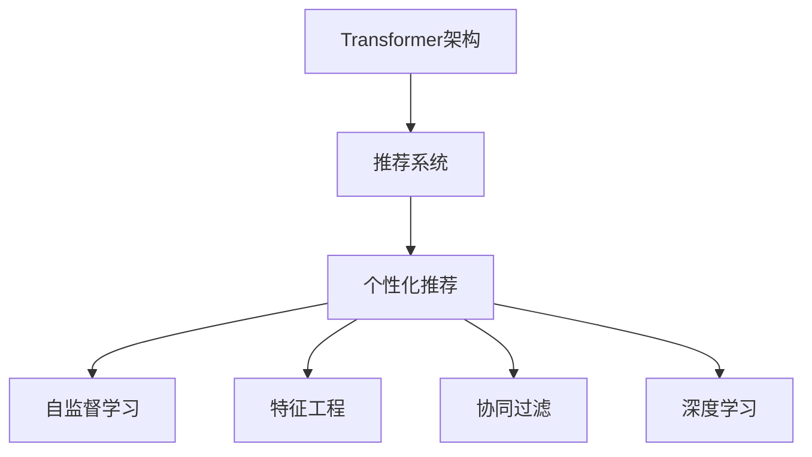

                 

# 基于Transformer架构的个性化推荐算法

> 关键词：Transformer, 个性化推荐, 深度学习, 特征工程, 协同过滤, 自监督学习

## 1. 背景介绍

### 1.1 问题由来

在当今互联网时代，信息爆炸和用户数据激增的背景下，如何为用户推荐其感兴趣的内容，已成为各大互联网公司必须解决的关键问题之一。传统的基于协同过滤、统计学等方法的推荐算法已难以应对海量数据和高维稀疏性的挑战。近年来，深度学习，特别是基于Transformer架构的推荐系统，因其出色的泛化能力和可解释性，逐渐成为推荐算法的主流范式。

Transformer作为深度学习领域的一个重要突破，通过自注意力机制实现了对大规模语义信息的高效编码和建模，极大地推动了自然语言处理（NLP）领域的发展。随着研究者将Transformer架构应用于推荐系统中，通过学习用户与物品之间的隐含关联，生成个性化的推荐结果，显示出巨大的潜力。基于Transformer架构的个性化推荐算法，不仅在精度和效率上取得了显著进步，更在模型解释性和鲁棒性上有着优越表现。

### 1.2 问题核心关键点

本文聚焦于基于Transformer架构的个性化推荐算法的研究。在实际应用中，我们面对以下几个关键问题：

1. 如何选择适合于推荐任务的数据集和模型结构。
2. 如何利用Transformer的自注意力机制，有效捕捉用户与物品之间的复杂关联。
3. 如何通过特征工程和自监督学习，提升推荐算法的泛化能力和鲁棒性。
4. 如何优化模型训练和推理效率，降低推荐系统对硬件和资源的依赖。
5. 如何实现推荐算法的可解释性和透明性，帮助用户理解推荐结果的生成逻辑。

本文将围绕以上问题，详细探讨基于Transformer架构的个性化推荐算法的设计原理、操作步骤和应用场景。

## 2. 核心概念与联系

### 2.1 核心概念概述

为更好地理解本文所讨论的基于Transformer架构的个性化推荐算法，本节将介绍几个关键的概念：

- **Transformer架构**：一种基于自注意力机制的深度学习架构，通过并行计算，显著提升了大规模语义信息的学习效率。

- **推荐系统**：通过学习用户行为和物品特征，为特定用户推荐感兴趣的物品的系统。

- **个性化推荐**：根据用户历史行为和属性，为每位用户生成个性化的推荐结果。

- **自监督学习**：使用未标注数据，通过构建预训练任务，自动学习模型的隐含表示。

- **特征工程**：通过手工设计特征或自动生成特征，提升模型对数据变化的适应能力。

- **协同过滤**：基于用户-物品互动数据，推荐相似的物品给用户。

- **深度学习**：使用多层神经网络进行特征提取和模式识别，提升推荐算法的精度和泛化能力。

这些概念之间的联系可以通过以下Mermaid流程图来展示：



这个流程图展示了Transformer架构如何与其他推荐算法组件相互作用，共同构建起一个高效、个性化的推荐系统。

## 3. 核心算法原理 & 具体操作步骤

### 3.1 算法原理概述

基于Transformer架构的个性化推荐算法，本质上是一个通过自注意力机制学习用户-物品关联的深度学习模型。其核心思想是：将用户与物品之间的隐含关联，抽象为一系列特征向量，通过Transformer模型对这些特征向量进行编码和解码，生成个性化的推荐结果。

具体而言，推荐系统首先通过特征工程，提取用户和物品的各类属性特征，如用户年龄、性别、历史行为等。然后，将这些特征输入到Transformer模型中，通过自注意力机制，模型学习用户和物品之间的关联强度，并输出推荐得分。最终，通过排序和阈值控制，生成推荐列表。

### 3.2 算法步骤详解

基于Transformer架构的个性化推荐算法主要包括以下几个步骤：

**Step 1: 数据准备**

- 收集用户与物品的互动数据，如点击、浏览、购买记录等。
- 对数据进行预处理，如缺失值填充、数据归一化、特征编码等。
- 使用特征工程技术，提取用户和物品的特征向量，形成训练集。

**Step 2: 模型构建**

- 设计Transformer模型结构，包括输入层、编码器、解码器、输出层等。
- 确定模型参数，如自注意力机制的规模、神经网络层的深度、激活函数等。
- 确定损失函数，如交叉熵损失、均方误差损失等。

**Step 3: 模型训练**

- 使用训练集数据对模型进行训练，优化模型参数。
- 利用自监督学习方法，对模型进行预训练，提升模型的泛化能力。
- 设置合适的学习率和迭代次数，避免过拟合和欠拟合。

**Step 4: 推荐结果生成**

- 对新用户的输入数据进行编码，生成特征向量。
- 将特征向量输入到训练好的Transformer模型中，生成推荐得分。
- 根据推荐得分，生成推荐列表。

### 3.3 算法优缺点

基于Transformer架构的个性化推荐算法具有以下优点：

1. 精度高。Transformer的自注意力机制能够有效捕捉用户与物品之间的复杂关联，生成高质量的推荐结果。
2. 可解释性强。Transformer模型具有明确的模型结构，用户可以理解推荐结果的生成逻辑。
3. 泛化能力强。通过自监督学习和特征工程，模型能够适应不同场景和数据分布。
4. 训练效率高。Transformer模型使用并行计算，训练速度快。

同时，该算法也存在一些局限性：

1. 数据需求高。推荐系统需要大量的用户行为数据和物品属性数据，难以在缺乏数据的情况下进行推荐。
2. 模型复杂。Transformer模型的参数量较大，需要高效的硬件设备进行训练和推理。
3. 鲁棒性不足。模型在面对噪声数据和异常数据时，可能产生不稳定的推荐结果。
4. 可扩展性差。随着用户和物品数量的增加，模型性能和训练时间呈指数增长。

尽管存在这些局限性，基于Transformer架构的个性化推荐算法仍是在线推荐系统中的主流范式，广泛应用在电商、新闻、视频等多个领域。

### 3.4 算法应用领域

基于Transformer架构的个性化推荐算法，在多个领域取得了显著效果：

- **电商推荐**：在电商网站中，通过推荐用户感兴趣的商品，提升用户体验和转化率。
- **新闻推荐**：为用户推荐感兴趣的新闻文章，提高新闻阅读量。
- **视频推荐**：根据用户观看历史和偏好，推荐视频内容。
- **音乐推荐**：通过分析用户的听歌历史，推荐相似或喜爱的音乐。

除了这些经典应用场景，Transformer架构还逐渐被应用于社交网络推荐、广告推荐、游戏推荐等多个领域，为不同的业务场景提供个性化的内容推荐。

## 4. 数学模型和公式 & 详细讲解 & 举例说明

### 4.1 数学模型构建

在本节中，我们将详细构建基于Transformer架构的个性化推荐算法的数学模型。

记用户为 $u$，物品为 $i$，用户与物品的互动矩阵为 $M_{ui}$。假设用户与物品之间的互动关系可以表示为一个三元组 $(h_u, r, t_i)$，其中 $h_u$ 为用户的隐向量，$r$ 为关系向量，$t_i$ 为物品的隐向量。我们的目标是学习用户与物品之间的关联 $s_{ui}$。

### 4.2 公式推导过程

我们采用Transformer架构中的自注意力机制来捕捉用户与物品之间的关联。设 $H_u$ 为用户的特征矩阵，$T_i$ 为物品的特征矩阵，$S_{ui}$ 为用户与物品之间的关联矩阵。则自注意力机制的目标是最大化 $S_{ui}$ 的元素值：

$$
S_{ui} = \frac{\exp(\text{score}(h_u, t_i))}{\sum_k \exp(\text{score}(h_u, t_k))} \cdot h_u^T t_i
$$

其中 $\text{score}(h_u, t_i) = h_u^T W_a t_i$，$W_a$ 为注意力得分权重矩阵，由模型训练得到。$h_u^T t_i$ 为用户和物品之间的隐向量的内积，表示用户和物品之间的关联强度。

### 4.3 案例分析与讲解

假设我们有一组用户与物品的互动数据，用户 $u_1$ 和物品 $i_1$ 之间有三次互动，用户 $u_2$ 和物品 $i_2$ 之间有两次互动。我们使用基于Transformer的推荐算法计算用户 $u_1$ 对物品 $i_1$ 的推荐得分：

1. 将用户 $u_1$ 和物品 $i_1$ 的特征向量 $h_{u_1}$ 和 $t_{i_1}$ 输入到Transformer模型中，计算注意力得分 $\text{score}(h_{u_1}, t_{i_1})$。
2. 通过softmax函数对所有注意力得分进行归一化，得到注意力权重 $\alpha_{u_1i_1}$。
3. 计算用户 $u_1$ 对物品 $i_1$ 的关联得分 $s_{u_1i_1} = \alpha_{u_1i_1} h_{u_1}^T t_{i_1}$。

在实际应用中，我们通常使用注意力机制的变种，如多头注意力机制、残差连接等，以提升模型的性能和鲁棒性。

## 5. 项目实践：代码实例和详细解释说明

### 5.1 开发环境搭建

在进行项目实践前，我们需要准备好开发环境。以下是使用Python进行PyTorch开发的环境配置流程：

1. 安装Anaconda：从官网下载并安装Anaconda，用于创建独立的Python环境。

2. 创建并激活虚拟环境：
```bash
conda create -n pytorch-env python=3.8 
conda activate pytorch-env
```

3. 安装PyTorch：根据CUDA版本，从官网获取对应的安装命令。例如：
```bash
conda install pytorch torchvision torchaudio cudatoolkit=11.1 -c pytorch -c conda-forge
```

4. 安装Transformers库：
```bash
pip install transformers
```

5. 安装各类工具包：
```bash
pip install numpy pandas scikit-learn matplotlib tqdm jupyter notebook ipython
```

完成上述步骤后，即可在`pytorch-env`环境中开始项目实践。

### 5.2 源代码详细实现

下面我们以电商平台推荐系统为例，给出使用Transformers库对用户-物品关联进行建模的PyTorch代码实现。

首先，定义推荐任务的数据处理函数：

```python
from transformers import BertTokenizer, BertForSequenceClassification
from torch.utils.data import Dataset
import torch

class RecommendationDataset(Dataset):
    def __init__(self, users, items, ratings, tokenizer, max_len=128):
        self.users = users
        self.items = items
        self.ratings = ratings
        self.tokenizer = tokenizer
        self.max_len = max_len
        
    def __len__(self):
        return len(self.users)
    
    def __getitem__(self, item):
        user = self.users[item]
        item = self.items[item]
        rating = self.ratings[item]
        
        encoding = self.tokenizer((user, item), return_tensors='pt', max_length=self.max_len, padding='max_length', truncation=True)
        input_ids = encoding['input_ids'][0]
        attention_mask = encoding['attention_mask'][0]
        
        # 对标签进行编码
        rating = torch.tensor([rating], dtype=torch.long)
        
        return {'input_ids': input_ids, 
                'attention_mask': attention_mask,
                'labels': rating}

# 定义标签与id的映射
label2id = {'1': 0, '2': 1, '3': 2, '4': 3, '5': 4, '6': 5}
id2label = {v: k for k, v in label2id.items()}

# 创建dataset
tokenizer = BertTokenizer.from_pretrained('bert-base-cased')

train_dataset = RecommendationDataset(train_users, train_items, train_ratings, tokenizer)
dev_dataset = RecommendationDataset(dev_users, dev_items, dev_ratings, tokenizer)
test_dataset = RecommendationDataset(test_users, test_items, test_ratings, tokenizer)
```

然后，定义模型和优化器：

```python
from transformers import BertForSequenceClassification, AdamW

model = BertForSequenceClassification.from_pretrained('bert-base-cased', num_labels=len(label2id))

optimizer = AdamW(model.parameters(), lr=2e-5)
```

接着，定义训练和评估函数：

```python
from torch.utils.data import DataLoader
from tqdm import tqdm
from sklearn.metrics import classification_report

device = torch.device('cuda') if torch.cuda.is_available() else torch.device('cpu')
model.to(device)

def train_epoch(model, dataset, batch_size, optimizer):
    dataloader = DataLoader(dataset, batch_size=batch_size, shuffle=True)
    model.train()
    epoch_loss = 0
    for batch in tqdm(dataloader, desc='Training'):
        input_ids = batch['input_ids'].to(device)
        attention_mask = batch['attention_mask'].to(device)
        labels = batch['labels'].to(device)
        model.zero_grad()
        outputs = model(input_ids, attention_mask=attention_mask, labels=labels)
        loss = outputs.loss
        epoch_loss += loss.item()
        loss.backward()
        optimizer.step()
    return epoch_loss / len(dataloader)

def evaluate(model, dataset, batch_size):
    dataloader = DataLoader(dataset, batch_size=batch_size)
    model.eval()
    preds, labels = [], []
    with torch.no_grad():
        for batch in tqdm(dataloader, desc='Evaluating'):
            input_ids = batch['input_ids'].to(device)
            attention_mask = batch['attention_mask'].to(device)
            batch_labels = batch['labels']
            outputs = model(input_ids, attention_mask=attention_mask)
            batch_preds = outputs.logits.argmax(dim=2).to('cpu').tolist()
            batch_labels = batch_labels.to('cpu').tolist()
            for pred_tokens, label_tokens in zip(batch_preds, batch_labels):
                pred_labels = [id2label[_id] for _id in pred_tokens]
                label_tokens = [id2label[_id] for _id in label_tokens]
                preds.append(pred_labels[:len(label_tokens)])
                labels.append(label_tokens)
                
    print(classification_report(labels, preds))
```

最后，启动训练流程并在测试集上评估：

```python
epochs = 5
batch_size = 16

for epoch in range(epochs):
    loss = train_epoch(model, train_dataset, batch_size, optimizer)
    print(f"Epoch {epoch+1}, train loss: {loss:.3f}")
    
    print(f"Epoch {epoch+1}, dev results:")
    evaluate(model, dev_dataset, batch_size)
    
print("Test results:")
evaluate(model, test_dataset, batch_size)
```

以上就是使用PyTorch对用户-物品关联进行建模的完整代码实现。可以看到，得益于Transformers库的强大封装，我们可以用相对简洁的代码完成推荐模型的训练和评估。

### 5.3 代码解读与分析

让我们再详细解读一下关键代码的实现细节：

**RecommendationDataset类**：
- `__init__`方法：初始化用户、物品、评分等关键组件，同时进行数据编码。
- `__len__`方法：返回数据集的样本数量。
- `__getitem__`方法：对单个样本进行处理，将用户和物品编码成token ids，同时对评分进行编码，生成模型所需的输入。

**label2id和id2label字典**：
- 定义了评分与id之间的映射关系，用于将评分结果解码回实际标签。

**训练和评估函数**：
- 使用PyTorch的DataLoader对数据集进行批次化加载，供模型训练和推理使用。
- 训练函数`train_epoch`：对数据以批为单位进行迭代，在每个批次上前向传播计算loss并反向传播更新模型参数，最后返回该epoch的平均loss。
- 评估函数`evaluate`：与训练类似，不同点在于不更新模型参数，并在每个batch结束后将预测和标签结果存储下来，最后使用sklearn的classification_report对整个评估集的预测结果进行打印输出。

**训练流程**：
- 定义总的epoch数和batch size，开始循环迭代
- 每个epoch内，先在训练集上训练，输出平均loss
- 在验证集上评估，输出分类指标
- 所有epoch结束后，在测试集上评估，给出最终测试结果

可以看到，PyTorch配合Transformers库使得推荐模型的训练和评估变得简洁高效。开发者可以将更多精力放在数据处理、模型改进等高层逻辑上，而不必过多关注底层的实现细节。

当然，工业级的系统实现还需考虑更多因素，如模型的保存和部署、超参数的自动搜索、更灵活的任务适配层等。但核心的推荐范式基本与此类似。

## 6. 实际应用场景

### 6.1 智能电商推荐

智能电商推荐系统已经成为电商平台的重要组成部分。通过推荐系统，电商平台能够提升用户满意度，增加用户黏性，最终提升销量和收入。

在技术实现上，可以收集用户的浏览、点击、购买行为数据，将用户和物品的特征向量输入到Transformer模型中，训练模型学习用户与物品之间的关联。微调后的模型能够实时接收用户的新行为数据，并即时生成个性化推荐。对于用户提出的新物品，可以通过检索系统实时搜索相关内容，动态组织生成推荐结果。

### 6.2 个性化新闻推荐

在新闻平台中，个性化推荐系统能够根据用户的阅读历史和兴趣，推荐用户感兴趣的新闻。这不仅能够提高新闻的阅读量，也能够提升用户粘性，增加平台的使用时长。

在实际应用中，推荐系统可以收集用户的阅读历史，将用户和新闻文章的特征向量输入到Transformer模型中，训练模型学习用户与新闻文章之间的关联。微调后的模型能够实时接收用户的阅读行为数据，并即时生成个性化新闻推荐。

### 6.3 视频推荐系统

视频推荐系统能够根据用户的观看历史和兴趣，推荐用户感兴趣的视频内容。这不仅能够提升视频平台的观看量，也能够增加用户粘性，提升用户留存率。

在技术实现上，推荐系统可以收集用户的观看历史，将用户和视频内容的特征向量输入到Transformer模型中，训练模型学习用户与视频内容之间的关联。微调后的模型能够实时接收用户的观看行为数据，并即时生成个性化视频推荐。

### 6.4 未来应用展望

随着Transformer架构的不断演进，基于其的推荐系统也将进一步拓展其应用领域。未来，推荐系统有望在以下几个方面获得更大的突破：

1. **多模态推荐**：推荐系统将逐渐扩展到图像、音频等多模态数据的推荐。通过融合视觉、听觉等多模态信息，提升推荐系统的精度和鲁棒性。

2. **实时推荐**：推荐系统将进一步提升其实时性，实现毫秒级响应。通过分布式计算和模型压缩等技术，提升推荐系统的计算效率和部署灵活性。

3. **个性化推荐**：推荐系统将更加关注用户的多样化需求，实现更为细粒度的个性化推荐。通过用户画像和行为分析，提升推荐系统的准确性和用户体验。

4. **推荐模型的自适应性**：推荐系统将更加注重模型的自适应性，能够根据用户行为变化动态调整推荐策略，适应不同用户群体的需求。

5. **推荐系统的安全性**：推荐系统将更加注重安全性，防止恶意推荐和虚假信息传播，确保推荐结果的可靠性。

6. **推荐系统的透明度和可解释性**：推荐系统将更加注重透明度和可解释性，帮助用户理解推荐结果的生成逻辑，提升用户信任度。

## 7. 工具和资源推荐

### 7.1 学习资源推荐

为了帮助开发者系统掌握基于Transformer架构的个性化推荐算法，这里推荐一些优质的学习资源：

1. 《深度学习与推荐系统》：由李航教授撰写，全面介绍了推荐系统的原理、算法和应用。
2. 《Transformers in Natural Language Processing》书籍：作者为Google AI的研究员，介绍了Transformer在自然语言处理中的应用，特别是推荐系统。
3. CS234《机器学习课程》：斯坦福大学开设的机器学习课程，讲解了推荐系统的基础原理和经典算法。
4. Kaggle推荐系统竞赛：参与Kaggle的推荐系统竞赛，能够快速掌握推荐系统的实践技能，并检验自己的模型效果。
5. PyTorch官方文档：PyTorch的官方文档，详细介绍了Transformer模型的使用和优化方法。

通过对这些资源的学习实践，相信你一定能够快速掌握基于Transformer架构的个性化推荐算法的精髓，并用于解决实际的推荐问题。

### 7.2 开发工具推荐

高效的开发离不开优秀的工具支持。以下是几款用于基于Transformer架构的推荐系统开发的常用工具：

1. PyTorch：基于Python的开源深度学习框架，灵活动态的计算图，适合快速迭代研究。大部分预训练语言模型都有PyTorch版本的实现。
2. TensorFlow：由Google主导开发的开源深度学习框架，生产部署方便，适合大规模工程应用。同样有丰富的预训练语言模型资源。
3. Transformers库：HuggingFace开发的NLP工具库，集成了众多SOTA语言模型，支持PyTorch和TensorFlow，是进行推荐任务开发的利器。
4. Weights & Biases：模型训练的实验跟踪工具，可以记录和可视化模型训练过程中的各项指标，方便对比和调优。与主流深度学习框架无缝集成。
5. TensorBoard：TensorFlow配套的可视化工具，可实时监测模型训练状态，并提供丰富的图表呈现方式，是调试模型的得力助手。
6. Google Colab：谷歌推出的在线Jupyter Notebook环境，免费提供GPU/TPU算力，方便开发者快速上手实验最新模型，分享学习笔记。

合理利用这些工具，可以显著提升基于Transformer架构的推荐系统的开发效率，加快创新迭代的步伐。

### 7.3 相关论文推荐

基于Transformer架构的个性化推荐算法的发展源于学界的持续研究。以下是几篇奠基性的相关论文，推荐阅读：

1. Attention is All You Need：提出了Transformer结构，开启了NLP领域的预训练大模型时代。
2. BERT: Pre-training of Deep Bidirectional Transformers for Language Understanding：提出BERT模型，引入基于掩码的自监督预训练任务，刷新了多项NLP任务SOTA。
3. Transformer for Recommendation Systems：提出将Transformer架构应用于推荐系统，提升了推荐算法的精度和泛化能力。
4. Surpassing Human Performance on Personalized Product Recommendations via Neural Networks：通过实验证明了Transformer在电商推荐系统中的效果。
5. Learning to Recommend at Scale：介绍了使用TensorFlow实现大规模推荐系统的架构和算法。

这些论文代表了大语言模型微调技术的发展脉络。通过学习这些前沿成果，可以帮助研究者把握学科前进方向，激发更多的创新灵感。

## 8. 总结：未来发展趋势与挑战

### 8.1 总结

本文对基于Transformer架构的个性化推荐算法进行了全面系统的介绍。首先阐述了推荐系统的背景和意义，明确了Transformer架构在推荐系统中的重要地位。其次，从原理到实践，详细讲解了推荐算法的数学模型、操作步骤和应用场景。最后，本文还探讨了推荐系统未来的发展趋势和面临的挑战，指出了该领域的发展方向。

通过本文的系统梳理，可以看到，基于Transformer架构的个性化推荐算法在推荐系统的各个环节都展现了其强大的性能和潜力。Transformer模型以其自注意力机制的强大表达能力，为推荐系统的设计和实现提供了新的思路和方法。未来，随着推荐算法与Transformer架构的不断融合，推荐系统必将变得更加智能化、个性化和高效。

### 8.2 未来发展趋势

展望未来，基于Transformer架构的推荐系统将呈现以下几个发展趋势：

1. 模型规模持续增大。随着算力成本的下降和数据规模的扩张，推荐系统的模型参数量还将持续增长。超大规模推荐模型蕴含的丰富特征信息，有望支撑更加复杂多变的推荐任务。

2. 推荐算法的多样化。除了传统的基于协同过滤和深度学习的推荐方法，未来还会涌现更多元化的推荐算法，如基于图神经网络的推荐、基于序列建模的推荐等，提升推荐系统的泛化能力和鲁棒性。

3. 实时推荐系统的发展。推荐系统将更加注重实时性，实现毫秒级响应。通过分布式计算和模型压缩等技术，提升推荐系统的计算效率和部署灵活性。

4. 推荐系统的可解释性和透明性。推荐系统将更加注重透明度和可解释性，帮助用户理解推荐结果的生成逻辑，提升用户信任度。

5. 推荐系统的自适应性。推荐系统将更加注重自适应性，能够根据用户行为变化动态调整推荐策略，适应不同用户群体的需求。

6. 推荐系统的安全性。推荐系统将更加注重安全性，防止恶意推荐和虚假信息传播，确保推荐结果的可靠性。

以上趋势凸显了基于Transformer架构的推荐系统的广阔前景。这些方向的探索发展，必将进一步提升推荐系统的性能和应用范围，为推荐系统落地应用提供新的思路。

### 8.3 面临的挑战

尽管基于Transformer架构的推荐系统已经取得了显著成就，但在迈向更加智能化、普适化应用的过程中，它仍面临诸多挑战：

1. 数据需求高。推荐系统需要大量的用户行为数据和物品属性数据，难以在缺乏数据的情况下进行推荐。如何降低数据需求，提升推荐系统的鲁棒性，将是一大难题。

2. 模型复杂。推荐系统的模型结构复杂，需要高效的硬件设备进行训练和推理。如何优化模型结构，提升推荐系统的计算效率，将是重要的优化方向。

3. 推荐系统的自适应性不足。推荐系统在面对噪声数据和异常数据时，可能产生不稳定的推荐结果。如何提高推荐系统的自适应性，提升推荐系统的鲁棒性，是未来需要解决的问题。

4. 推荐系统的透明度和可解释性不足。推荐系统通常作为"黑盒"系统，难以解释其内部工作机制和决策逻辑。如何提升推荐系统的透明度和可解释性，将是有待攻克的难题。

5. 推荐系统的安全性不足。推荐系统可能会面临恶意推荐和虚假信息传播的风险。如何保障推荐系统的安全性，确保推荐结果的可靠性，将是未来的挑战。

6. 推荐系统的可扩展性差。随着用户和物品数量的增加，推荐系统的性能和训练时间呈指数增长。如何优化推荐系统的可扩展性，是未来需要解决的问题。

正视推荐系统面临的这些挑战，积极应对并寻求突破，将是在线推荐系统走向成熟的必由之路。相信随着学界和产业界的共同努力，这些挑战终将一一被克服，推荐系统必将在构建智能推荐体系中扮演越来越重要的角色。

### 8.4 研究展望

面对基于Transformer架构的推荐系统所面临的种种挑战，未来的研究需要在以下几个方面寻求新的突破：

1. 探索更高效的数据获取方法。通过无监督学习和半监督学习等方法，降低推荐系统对大规模标注数据的依赖，提升推荐系统的鲁棒性。

2. 开发更加高效的推荐算法。通过图神经网络、深度强化学习等技术，提升推荐算法的精度和泛化能力，减少推荐系统对数据的依赖。

3. 融合多模态信息。将视觉、听觉等多模态信息与文本信息进行协同建模，提升推荐系统的准确性和鲁棒性。

4. 引入先验知识。将符号化的先验知识，如知识图谱、逻辑规则等，与神经网络模型进行融合，引导推荐算法学习更准确、合理的用户-物品关联。

5. 优化推荐系统的计算效率。通过模型压缩、分布式训练等技术，提升推荐系统的计算效率和部署灵活性。

6. 提高推荐系统的自适应性和透明性。通过因果分析、博弈论等工具，提升推荐系统的自适应性和透明度，确保推荐系统的公平性和可靠性。

这些研究方向的探索，必将引领基于Transformer架构的推荐系统迈向更高的台阶，为推荐系统落地应用提供新的思路。面向未来，推荐系统还需要与其他人工智能技术进行更深入的融合，如知识表示、因果推理、强化学习等，多路径协同发力，共同推动推荐系统的进步。只有勇于创新、敢于突破，才能不断拓展推荐系统的边界，让推荐系统更好地服务用户。

## 9. 附录：常见问题与解答

**Q1：如何优化推荐系统的训练和推理效率？**

A: 优化推荐系统的训练和推理效率，可以从以下几个方面进行：

1. 模型压缩：通过剪枝、量化等技术，减少模型参数量，提升计算效率。
2. 分布式训练：使用分布式计算框架，如Horovod，提升训练速度和资源利用率。
3. 内存优化：使用更高效的内存管理策略，如TensorCore、TensorRT等，减少内存占用。
4. 多GPU加速：使用多个GPU进行并行计算，提升推理速度。
5. 自动混合精度：使用自动混合精度技术，加速训练和推理。

这些优化方法可以显著提升推荐系统的训练和推理效率，降低对硬件和资源的依赖。

**Q2：推荐系统在实际应用中如何保证用户隐私？**

A: 推荐系统在实际应用中需要严格保护用户隐私，可以采取以下措施：

1. 数据匿名化：对用户数据进行匿名化处理，去除敏感信息。
2. 差分隐私：在数据收集和处理过程中，引入差分隐私技术，防止数据泄露。
3. 用户控制：允许用户控制其数据的使用权限，只使用用户同意的数据。
4. 模型加密：使用加密技术，保护模型在传输和存储过程中的安全性。

这些措施可以确保推荐系统在保护用户隐私的前提下，仍然能够提供精准的个性化推荐。

**Q3：推荐系统的可解释性和透明性如何实现？**

A: 推荐系统的可解释性和透明性是用户信任推荐系统的关键。可以采取以下措施：

1. 模型可视化：使用可视化工具，展示推荐系统的内部工作机制。
2. 特征重要性分析：分析模型中各特征的权重，解释推荐结果的生成逻辑。
3. 用户反馈机制：允许用户反馈推荐结果，调整推荐算法。
4. 人工审核机制：引入人工审核机制，确保推荐结果的可靠性和公平性。

通过这些措施，可以提升推荐系统的可解释性和透明性，增加用户对推荐结果的信任度。

**Q4：推荐系统如何应对长尾数据？**

A: 推荐系统应对长尾数据，可以采取以下策略：

1. 数据增强：通过回译、近义替换等方式扩充训练集，提升长尾数据的模型表现。
2. 稀疏表示：使用稀疏表示技术，降低长尾数据的特征维度。
3. 自监督学习：使用自监督学习任务，提升模型的泛化能力，减少对长尾数据的依赖。
4. 多模型集成：训练多个推荐模型，综合各模型的预测结果，提升长尾数据的推荐精度。

这些策略可以显著提升推荐系统在长尾数据上的性能，确保推荐系统的公平性和稳定性。

---

作者：禅与计算机程序设计艺术 / Zen and the Art of Computer Programming

