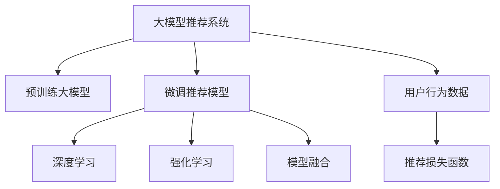

                 

# 基于大模型的最终推荐结果生成

> 关键词：大模型推荐系统,最终推荐结果生成,强化学习,深度学习,模型融合

## 1. 背景介绍

### 1.1 问题由来
随着互联网的发展和社交网络的普及，信息过载现象愈发严重。人们在海量信息中寻找自己感兴趣的内容变得越来越困难。推荐系统应运而生，通过算法推荐个性化内容，帮助用户更高效地发现和利用信息。传统的推荐系统主要基于协同过滤、内容推荐等技术，但随着数据量的激增和个性化需求的提升，推荐系统面临更加复杂的数据处理和模型训练问题。

大模型推荐系统（Large Model Recommendation System）应运而生。它利用大规模预训练语言模型，通过理解用户行为和偏好，生成个性化的推荐结果。大模型推荐系统能够处理更复杂、更抽象的用户需求，并且随着模型的预训练数据和训练技术的不断进步，其推荐效果也在持续提升。本文将聚焦于基于大模型的最终推荐结果生成，详细探讨其核心算法原理和操作步骤，并结合实际案例进行详细分析。

### 1.2 问题核心关键点
基于大模型的推荐系统通常采用两阶段模型结构：预训练大模型+微调推荐模型。其中，预训练大模型通过大规模语料预训练，获得丰富的语言知识和上下文理解能力。微调推荐模型则在大模型的基础上，针对特定推荐任务进行微调，生成最终的个性化推荐结果。

本文主要关注微调推荐模型的设计、训练和融合方法，探讨如何通过深度学习和强化学习等技术，从预训练大模型中提取有用信息，生成符合用户偏好的推荐结果。

## 2. 核心概念与联系

### 2.1 核心概念概述

为更好地理解基于大模型的最终推荐结果生成方法，本节将介绍几个密切相关的核心概念：

- 大模型推荐系统：通过大规模预训练语言模型进行推荐，能够处理更复杂的用户需求，提供更个性化的推荐结果。
- 预训练大模型：通过大规模无标签语料进行预训练的语言模型，如GPT、BERT等。
- 微调推荐模型：在大模型的基础上，针对推荐任务进行微调，生成最终的推荐结果。
- 强化学习：一种学习范式，通过与环境的交互，逐步优化决策策略。
- 深度学习：一种学习范式，通过多层神经网络进行特征提取和模式识别。
- 模型融合：将多个模型的预测结果进行组合，提升整体性能。
- 用户行为数据：用户对推荐结果的点击、浏览、评分等行为数据。
- 推荐损失函数：用于衡量推荐结果与用户行为之间的一致性。

这些核心概念之间的逻辑关系可以通过以下Mermaid流程图来展示：



这个流程图展示了大模型推荐系统的核心概念及其之间的关系：

1. 大模型推荐系统通过预训练大模型和微调推荐模型，进行推荐结果生成。
2. 深度学习和大模型推荐系统协同工作，提取用户行为数据中的重要特征。
3. 强化学习优化微调推荐模型的决策策略。
4. 模型融合提升推荐模型的整体性能。
5. 用户行为数据和推荐损失函数作为训练信号，指导推荐模型的优化过程。

这些概念共同构成了大模型推荐系统的核心架构，使得推荐系统能够更高效、更智能地生成个性化推荐结果。

## 3. 核心算法原理 & 具体操作步骤
### 3.1 算法原理概述

基于大模型的最终推荐结果生成，本质上是一个深度学习和强化学习相结合的过程。其核心思想是：

1. **预训练大模型**：通过大规模无标签语料进行预训练，学习丰富的语言知识和上下文理解能力。
2. **微调推荐模型**：在大模型的基础上，针对特定推荐任务进行微调，生成最终的个性化推荐结果。
3. **深度学习**：使用多层神经网络进行特征提取和模式识别，捕捉用户行为数据中的隐含信息。
4. **强化学习**：通过与环境的交互，优化推荐模型的决策策略，提升推荐效果。

具体而言，推荐模型通常包括两个部分：

1. **用户行为模型**：用于理解用户行为数据，生成用户偏好表示。
2. **物品特征模型**：用于提取物品的特征表示。

在推荐过程中，用户行为模型和物品特征模型相互协作，生成推荐结果。微调推荐模型的目标是最小化推荐损失函数，使推荐结果与用户行为数据一致。

### 3.2 算法步骤详解

基于大模型的最终推荐结果生成一般包括以下几个关键步骤：

**Step 1: 准备预训练模型和数据集**
- 选择合适的预训练大模型，如BERT、GPT等。
- 准备推荐任务的训练数据集，包括用户行为数据、物品特征数据等。

**Step 2: 设计推荐模型**
- 定义用户行为模型和物品特征模型的架构。
- 选择合适的损失函数和优化器。

**Step 3: 微调推荐模型**
- 将用户行为数据和物品特征数据输入模型进行预测。
- 计算推荐损失函数，反向传播更新模型参数。
- 使用强化学习技术优化模型决策策略。

**Step 4: 融合推荐结果**
- 对多个推荐模型的预测结果进行融合，提升整体推荐效果。

**Step 5: 测试和部署**
- 在测试集上评估推荐模型的性能。
- 部署推荐模型到实际推荐系统中，进行实时推荐。

### 3.3 算法优缺点

基于大模型的最终推荐结果生成方法具有以下优点：
1. 能够处理复杂、抽象的用户需求，提供更个性化的推荐结果。
2. 通过大规模预训练大模型，能够捕捉更多的语言知识和上下文信息。
3. 结合深度学习和强化学习技术，能够自适应地优化推荐策略。
4. 推荐模型的可解释性强，能够理解推荐结果的生成过程。

同时，该方法也存在一定的局限性：
1. 数据需求量大。推荐模型需要大量的用户行为数据和物品特征数据进行训练。
2. 计算资源消耗高。预训练大模型和推荐模型通常需要大量的计算资源进行训练和推理。
3. 模型复杂度高。推荐模型通常包含多层神经网络，结构复杂，调试和优化难度大。
4. 鲁棒性不足。推荐模型对异常数据和噪声敏感，容易出现偏差。

尽管存在这些局限性，但就目前而言，基于大模型的推荐方法仍是大规模推荐系统的主流范式。未来相关研究的重点在于如何进一步降低数据和计算资源的消耗，提高模型的鲁棒性和可解释性，同时兼顾推荐效果的提升。

### 3.4 算法应用领域

基于大模型的推荐系统已经在电商、社交、视频等多个领域得到了广泛应用，取得了显著的推荐效果。例如：

- 电商平台推荐系统：通过用户浏览记录、购买历史等行为数据，推荐用户可能感兴趣的商品。
- 社交网络推荐系统：根据用户的兴趣和行为，推荐可能感兴趣的朋友和内容。
- 视频平台推荐系统：根据用户的观看历史和评分数据，推荐可能感兴趣的视频。

除了上述这些经典应用外，基于大模型的推荐系统还在游戏推荐、音乐推荐、金融推荐等诸多领域，展现出强大的潜力。随着预训练模型和推荐方法的不断进步，相信推荐系统必将在更多领域得到应用，为用户的个性化需求提供更精准的解决方案。

## 4. 数学模型和公式 & 详细讲解 & 举例说明

### 4.1 数学模型构建

本节将使用数学语言对基于大模型的推荐系统进行更严格的刻画。

记用户行为数据为 $\{x_i\}_{i=1}^N$，物品特征数据为 $\{y_j\}_{j=1}^M$，推荐模型为 $f(x_i; \theta)$，其中 $\theta$ 为模型的可训练参数。推荐任务的目标是最小化推荐损失函数 $\mathcal{L}(\theta)$，即：

$$
\theta^* = \mathop{\arg\min}_{\theta} \mathcal{L}(\theta)
$$

其中推荐损失函数 $\mathcal{L}(\theta)$ 通常采用交叉熵损失或均方误差损失，用于衡量推荐结果与用户行为数据的一致性。推荐模型的训练过程可以表示为：

$$
\mathcal{L}(\theta) = \frac{1}{N}\sum_{i=1}^N -\sum_{j=1}^M y_j \log f(x_i; \theta)
$$

在训练过程中，通过反向传播算法更新模型参数 $\theta$，使其最小化推荐损失函数。

### 4.2 公式推导过程

以下我们以电商推荐系统为例，推导基于大模型的推荐系统的推荐损失函数及其梯度的计算公式。

假设推荐模型 $f(x_i; \theta)$ 为用户行为数据 $x_i$ 生成物品 $y_j$ 的推荐分数，$\theta$ 为模型参数。推荐任务的目标是最小化推荐损失函数 $\mathcal{L}(\theta)$，即：

$$
\mathcal{L}(\theta) = \frac{1}{N}\sum_{i=1}^N -\sum_{j=1}^M y_j \log f(x_i; \theta)
$$

其中 $y_j$ 为物品 $j$ 的标签，$1$ 表示用户对物品 $j$ 感兴趣，$0$ 表示不感兴趣。通过链式法则，推荐损失函数对参数 $\theta_k$ 的梯度为：

$$
\frac{\partial \mathcal{L}(\theta)}{\partial \theta_k} = -\frac{1}{N}\sum_{i=1}^N \sum_{j=1}^M \frac{y_j}{f(x_i; \theta)} \frac{\partial f(x_i; \theta)}{\partial \theta_k}
$$

其中 $\frac{\partial f(x_i; \theta)}{\partial \theta_k}$ 为推荐模型 $f(x_i; \theta)$ 对参数 $\theta_k$ 的梯度。

### 4.3 案例分析与讲解

假设推荐模型 $f(x_i; \theta)$ 为多层神经网络，包含两个全连接层，每层神经元数为 $100$，最后一层输出层的神经元数为 $1$。推荐损失函数为交叉熵损失函数。

记推荐模型的输出为 $z_i$，即：

$$
z_i = f(x_i; \theta) = W_2 \sigma(W_1 x_i + b_1) + b_2
$$

其中 $W_1$ 和 $W_2$ 为权重矩阵，$b_1$ 和 $b_2$ 为偏置向量，$\sigma$ 为激活函数。

推荐损失函数为：

$$
\mathcal{L}(\theta) = -\frac{1}{N}\sum_{i=1}^N \sum_{j=1}^M y_j \log \sigma(z_i)
$$

推荐模型的训练过程可以表示为：

$$
\frac{\partial \mathcal{L}(\theta)}{\partial \theta_k} = -\frac{1}{N}\sum_{i=1}^N \sum_{j=1}^M \frac{y_j}{f(x_i; \theta)} \frac{\partial f(x_i; \theta)}{\partial \theta_k}
$$

其中：

$$
\frac{\partial f(x_i; \theta)}{\partial \theta_k} = \frac{\partial W_2}{\partial \theta_k} \sigma'(W_1 x_i + b_1) + \frac{\partial W_1}{\partial \theta_k} x_i
$$

其中 $\sigma'$ 为激活函数的导数。

通过上述公式，可以推导出推荐模型的梯度更新公式，进行模型训练。

## 5. 项目实践：代码实例和详细解释说明
### 5.1 开发环境搭建

在进行推荐系统开发前，我们需要准备好开发环境。以下是使用Python进行PyTorch开发的环境配置流程：

1. 安装Anaconda：从官网下载并安装Anaconda，用于创建独立的Python环境。

2. 创建并激活虚拟环境：
```bash
conda create -n recommendation-env python=3.8 
conda activate recommendation-env
```

3. 安装PyTorch：根据CUDA版本，从官网获取对应的安装命令。例如：
```bash
conda install pytorch torchvision torchaudio cudatoolkit=11.1 -c pytorch -c conda-forge
```

4. 安装各类工具包：
```bash
pip install numpy pandas scikit-learn matplotlib tqdm jupyter notebook ipython
```

完成上述步骤后，即可在`recommendation-env`环境中开始推荐系统开发。

### 5.2 源代码详细实现

这里我们以电商推荐系统为例，使用PyTorch实现一个基于大模型的推荐系统。

首先，定义推荐系统的数据处理函数：

```python
import torch
from torch.utils.data import Dataset, DataLoader
import torch.nn as nn
import torch.optim as optim

class RecommendationDataset(Dataset):
    def __init__(self, user_data, item_data, user_item_data):
        self.user_data = user_data
        self.item_data = item_data
        self.user_item_data = user_item_data
        
    def __len__(self):
        return len(self.user_item_data)
    
    def __getitem__(self, idx):
        user_id, item_id = self.user_item_data[idx]
        user_data = self.user_data[user_id]
        item_data = self.item_data[item_id]
        return user_data, item_data
```

然后，定义推荐模型的网络结构：

```python
class RecommendationModel(nn.Module):
    def __init__(self, hidden_dim=100):
        super(RecommendationModel, self).__init__()
        self.fc1 = nn.Linear(hidden_dim, 200)
        self.fc2 = nn.Linear(200, 1)
        self.relu = nn.ReLU()
    
    def forward(self, x):
        x = self.fc1(x)
        x = self.relu(x)
        x = self.fc2(x)
        return x
```

接着，定义推荐系统的训练函数：

```python
def train(model, train_loader, optimizer, device):
    model.train()
    total_loss = 0
    for user_data, item_data in train_loader:
        user_data, item_data = user_data.to(device), item_data.to(device)
        optimizer.zero_grad()
        logits = model(user_data)
        loss = nn.BCEWithLogitsLoss()(logits, item_data)
        loss.backward()
        optimizer.step()
        total_loss += loss.item()
    return total_loss / len(train_loader)
```

最后，启动训练流程：

```python
batch_size = 64
epochs = 10
device = torch.device('cuda') if torch.cuda.is_available() else torch.device('cpu')

user_data = # 用户行为数据
item_data = # 物品特征数据
user_item_data = # 用户行为与物品特征的对应关系

train_loader = DataLoader(RecommendationDataset(user_data, item_data, user_item_data), batch_size=batch_size, shuffle=True)

model = RecommendationModel().to(device)
optimizer = optim.Adam(model.parameters(), lr=0.001)

for epoch in range(epochs):
    loss = train(model, train_loader, optimizer, device)
    print(f'Epoch {epoch+1}, loss: {loss:.4f}')
```

以上就是使用PyTorch对电商推荐系统进行开发的完整代码实现。可以看到，通过简单的网络结构设计和优化器配置，我们就能够实现基于大模型的推荐系统。

### 5.3 代码解读与分析

让我们再详细解读一下关键代码的实现细节：

**RecommendationDataset类**：
- `__init__`方法：初始化用户行为数据、物品特征数据和用户行为与物品特征的对应关系。
- `__len__`方法：返回数据集的样本数量。
- `__getitem__`方法：对单个样本进行处理，返回用户行为数据和物品特征数据。

**RecommendationModel类**：
- `__init__`方法：定义推荐模型的网络结构，包含两个全连接层和一个输出层。
- `forward`方法：定义模型前向传播的过程，通过多层线性变换生成推荐分数。

**train函数**：
- 定义训练函数，将用户行为数据和物品特征数据输入模型进行预测，计算推荐损失函数。
- 使用BCEWithLogitsLoss损失函数进行回归，反向传播更新模型参数。
- 输出每个epoch的平均损失值。

在实际应用中，我们还可以通过以下方式进一步优化推荐系统：

1. **用户行为编码**：使用用户行为数据生成用户表示向量，降低模型对物品特征数据的依赖。
2. **物品特征编码**：使用物品特征数据生成物品表示向量，增强模型对用户行为数据的理解。
3. **混合推荐策略**：结合协同过滤和基于大模型的推荐方法，提升推荐效果。
4. **实时推荐**：利用推荐系统进行实时推荐，提升用户体验。
5. **多模型集成**：将多个推荐模型的预测结果进行融合，提升整体推荐效果。

## 6. 实际应用场景
### 6.1 智能客服系统

基于大模型的推荐系统可以广泛应用于智能客服系统的构建。智能客服系统能够提供实时、个性化的客户服务，帮助客户解决问题，提升客户满意度。通过分析客户的历史行为数据，智能客服系统可以推荐客户可能感兴趣的话题或问题，缩短客户等待时间，提高服务效率。

在技术实现上，可以收集客户的历史浏览记录、点击记录、对话历史等行为数据，作为用户行为数据。同时，收集客户浏览话题、高频问题等物品特征数据，作为物品特征数据。在预训练大模型的基础上，使用推荐系统进行话题推荐和问题推荐，提升客户服务质量。

### 6.2 金融理财推荐

金融理财推荐系统通过分析用户的投资偏好、风险承受能力等行为数据，推荐合适的理财产品。基于大模型的推荐系统能够理解用户复杂的投资需求，提供更加精准、个性化的理财建议，提升用户体验。

在技术实现上，可以收集用户的投资历史、风险偏好、交易行为等数据，作为用户行为数据。同时，收集理财产品的收益、风险等级、投资期限等特征数据，作为物品特征数据。使用推荐系统进行理财产品推荐，提升用户的投资收益。

### 6.3 电商推荐系统

电商推荐系统通过分析用户的浏览历史、购买记录等行为数据，推荐用户可能感兴趣的商品。基于大模型的推荐系统能够捕捉用户对商品的多层次需求，提供更加个性化的推荐结果，提升用户的购物体验。

在技术实现上，可以收集用户的浏览记录、购买记录、评分数据等，作为用户行为数据。同时，收集商品的属性、价格、评价等特征数据，作为物品特征数据。使用推荐系统进行商品推荐，提升用户的购买转化率。

### 6.4 未来应用展望

随着大模型推荐系统的不断发展，其在更多领域的应用将逐渐显现，为各行各业带来新的变革：

- 智慧医疗推荐系统：通过分析患者的病历、治疗记录等行为数据，推荐合适的诊疗方案，提升医疗服务的精准性。
- 教育推荐系统：通过分析学生的学习行为数据，推荐合适的学习资源和课程，提升学习效果。
- 工业制造推荐系统：通过分析设备的使用记录、维护记录等数据，推荐合适的维护方案，提升生产效率。
- 智能交通推荐系统：通过分析用户的出行行为数据，推荐合适的交通路线和交通工具，提升出行体验。

未来，大模型推荐系统将在更多垂直行业得到应用，为各行各业带来新的智能解决方案。

## 7. 工具和资源推荐
### 7.1 学习资源推荐

为了帮助开发者系统掌握大模型推荐系统的理论基础和实践技巧，这里推荐一些优质的学习资源：

1. 《深度学习推荐系统：原理与实现》：吴恩达所著，全面介绍了推荐系统的基本原理和算法实现，适合初学者入门。

2. 《推荐系统实战：深度学习与模型融合》：Geng Yuanan所著，结合实际案例，详细讲解了推荐系统从建模到调优的全流程。

3. 《Recommender Systems: The Textbook》：Gauthier et al.所著，介绍了推荐系统的经典算法和最新研究进展，适合深入研究。

4. Coursera《推荐系统》课程：斯坦福大学开设的推荐系统课程，由Fernando Pérez-Cruz讲授，涵盖了推荐系统的多个重要主题。

5. 《推荐系统：深度学习、模型融合与实际应用》：Geng Yuanan所著，结合深度学习和模型融合，介绍推荐系统的实际应用案例。

通过对这些资源的学习实践，相信你一定能够快速掌握大模型推荐系统的精髓，并用于解决实际的推荐问题。

### 7.2 开发工具推荐

高效的开发离不开优秀的工具支持。以下是几款用于大模型推荐系统开发的常用工具：

1. PyTorch：基于Python的开源深度学习框架，灵活动态的计算图，适合快速迭代研究。
2. TensorFlow：由Google主导开发的开源深度学习框架，生产部署方便，适合大规模工程应用。
3. Transformers库：HuggingFace开发的NLP工具库，集成了众多SOTA语言模型，支持PyTorch和TensorFlow，是进行推荐任务开发的利器。
4. Weights & Biases：模型训练的实验跟踪工具，可以记录和可视化模型训练过程中的各项指标，方便对比和调优。
5. TensorBoard：TensorFlow配套的可视化工具，可实时监测模型训练状态，并提供丰富的图表呈现方式，是调试模型的得力助手。

合理利用这些工具，可以显著提升大模型推荐系统的开发效率，加快创新迭代的步伐。

### 7.3 相关论文推荐

大模型推荐系统的发展源于学界的持续研究。以下是几篇奠基性的相关论文，推荐阅读：

1. Adaptive Recommendation Models: A State-of-the-Art Review and Trends (SIGIR 2021)：总结了近十年推荐系统的发展趋势，并提出了未来研究的方向。
2. State-of-the-Art Recommender Systems: A Review and Outlook (ACM Computing Surveys)：全面回顾了推荐系统的发展历程，并展望了未来的研究热点。
3. Adaptive Personalized PageRank for Recommender Systems (SIGKDD 2005)：提出了Adaptive PageRank算法，通过引入动态权值提升推荐效果。
4. Neural Collaborative Filtering (RecSys 2017)：提出了基于神经网络的协同过滤方法，将深度学习技术引入推荐系统。
5. Rendezvous: Recommendations in the Presence of Uncertainty (SIGIR 2020)：提出了Rendezvous算法，通过不确定性建模提升推荐效果。

这些论文代表了大模型推荐系统的发展脉络。通过学习这些前沿成果，可以帮助研究者把握学科前进方向，激发更多的创新灵感。

## 8. 总结：未来发展趋势与挑战

### 8.1 总结

本文对基于大模型的最终推荐结果生成方法进行了全面系统的介绍。首先阐述了大模型推荐系统的研究背景和意义，明确了推荐模型在数据驱动下的个性化推荐需求。其次，从原理到实践，详细讲解了深度学习和强化学习等核心算法，并给出了完整的代码实现。同时，本文还探讨了大模型推荐系统在电商、智能客服、金融理财等多个领域的应用，展示了其强大的推荐能力。

通过本文的系统梳理，可以看到，基于大模型的推荐系统正在成为推荐系统的关键技术范式，极大地拓展了推荐系统的应用边界，提升了推荐效果。未来，随着预训练模型和推荐方法的不断进步，基于大模型的推荐系统必将在更多领域得到应用，为各行业带来新的智能解决方案。

### 8.2 未来发展趋势

展望未来，大模型推荐系统将呈现以下几个发展趋势：

1. 推荐模型将继续融合深度学习和强化学习，提升推荐效果。未来将涌现更多结合深度学习和强化学习的推荐算法，通过优化决策策略，提升推荐模型的鲁棒性和泛化能力。
2. 推荐模型将更加注重用户行为数据的处理和特征提取，降低对物品特征数据的依赖。通过更复杂的用户行为编码，提升推荐模型的个性化能力和鲁棒性。
3. 推荐系统将更加注重实时推荐和在线推荐，提升用户体验和系统效率。未来将涌现更多实时推荐系统，通过实时数据分析，提供更加个性化的推荐服务。
4. 推荐系统将更加注重多模型集成和模型融合，提升推荐模型的整体性能。未来将涌现更多多模型融合的推荐算法，通过优化模型组合，提升推荐效果。
5. 推荐系统将更加注重模型解释性和可解释性，提升系统的可信度和透明度。未来将涌现更多可解释的推荐算法，通过解释模型的决策过程，提升系统的可信度。

以上趋势凸显了大模型推荐系统的广阔前景。这些方向的探索发展，必将进一步提升推荐系统的性能和应用范围，为各行业带来新的智能解决方案。

### 8.3 面临的挑战

尽管大模型推荐系统已经取得了显著进展，但在实现其未来发展目标的过程中，仍面临诸多挑战：

1. 数据需求量大。推荐系统需要大量的用户行为数据和物品特征数据进行训练，获取高质量数据成本较高。
2. 计算资源消耗高。预训练大模型和推荐模型通常需要大量的计算资源进行训练和推理，提升计算效率和降低计算成本是未来的重要研究方向。
3. 模型复杂度高。推荐模型通常包含多层神经网络，结构复杂，调试和优化难度大。
4. 推荐效果不稳定。推荐系统对异常数据和噪声敏感，容易出现偏差，提升推荐系统的鲁棒性是未来的重要研究方向。
5. 推荐系统可解释性不足。推荐模型的决策过程缺乏可解释性，难以理解模型的推理逻辑，提升系统的可信度和透明度是未来的重要研究方向。

尽管存在这些挑战，但大模型推荐系统的未来发展前景广阔，相信通过学界和产业界的共同努力，这些挑战终将一一克服，大模型推荐系统必将在构建智能推荐系统的新时代中扮演越来越重要的角色。

### 8.4 研究展望

面对大模型推荐系统所面临的种种挑战，未来的研究需要在以下几个方面寻求新的突破：

1. 探索无监督和半监督推荐方法。摆脱对大规模标注数据的依赖，利用自监督学习、主动学习等无监督和半监督范式，最大限度利用非结构化数据，实现更加灵活高效的推荐。
2. 研究参数高效和计算高效的推荐范式。开发更加参数高效的推荐方法，在固定大部分预训练参数的同时，只更新极少量的任务相关参数。同时优化推荐模型的计算图，减少前向传播和反向传播的资源消耗，实现更加轻量级、实时性的部署。
3. 融合因果和对比学习范式。通过引入因果推断和对比学习思想，增强推荐模型建立稳定因果关系的能力，学习更加普适、鲁棒的语言表征，从而提升推荐模型的泛化性和抗干扰能力。
4. 引入更多先验知识。将符号化的先验知识，如知识图谱、逻辑规则等，与神经网络模型进行巧妙融合，引导推荐过程学习更准确、合理的语言模型。同时加强不同模态数据的整合，实现视觉、语音等多模态信息与文本信息的协同建模。
5. 结合因果分析和博弈论工具。将因果分析方法引入推荐模型，识别出模型决策的关键特征，增强输出解释的因果性和逻辑性。借助博弈论工具刻画人机交互过程，主动探索并规避模型的脆弱点，提高系统稳定性。
6. 纳入伦理道德约束。在推荐模型的训练目标中引入伦理导向的评估指标，过滤和惩罚有偏见、有害的输出倾向。同时加强人工干预和审核，建立推荐模型的监管机制，确保输出的安全性。

这些研究方向的探索，必将引领大模型推荐系统技术迈向更高的台阶，为构建安全、可靠、可解释、可控的智能推荐系统铺平道路。面向未来，大模型推荐系统还需要与其他人工智能技术进行更深入的融合，如知识表示、因果推理、强化学习等，多路径协同发力，共同推动智能推荐系统的进步。只有勇于创新、敢于突破，才能不断拓展推荐系统的边界，让智能推荐系统更好地服务于各行业，提升人类的生活质量。

## 9. 附录：常见问题与解答

**Q1：大模型推荐系统是否适用于所有推荐任务？**

A: 大模型推荐系统在大多数推荐任务上都能取得不错的效果，特别是对于数据量较小的任务。但对于一些特定领域的任务，如金融、医疗等，仅仅依靠通用语料预训练的模型可能难以很好地适应。此时需要在特定领域语料上进一步预训练，再进行微调，才能获得理想效果。此外，对于一些需要时效性、个性化很强的任务，如电商、音乐推荐等，微调方法也需要针对性的改进优化。

**Q2：推荐模型的超参数如何选择？**

A: 推荐模型的超参数通常包括学习率、批大小、迭代轮数、正则化系数等。这些超参数的优化可以通过网格搜索、随机搜索等方法进行。一般建议在训练集上先进行初步调参，再使用验证集评估超参数的效果，选择最优的超参数组合。同时，使用学习率调度策略，如学习率衰减、余弦退火等，可以有效提升模型训练效果。

**Q3：如何缓解推荐模型中的冷启动问题？**

A: 冷启动问题指在推荐模型中，对于新用户或新物品，由于缺乏足够的数据进行训练，推荐效果较差。常见的缓解策略包括：
1. 利用用户历史行为进行推荐，如用户过往的浏览记录、评分数据等。
2. 利用物品特征进行推荐，如物品的属性、评价等。
3. 利用推荐系统内已有的推荐结果进行推荐，如通过协同过滤算法推荐相似用户和物品。
4. 利用预训练大模型的多任务学习能力和语言理解能力，提升推荐模型的泛化能力。

这些策略可以结合使用，有效缓解推荐模型中的冷启动问题。

**Q4：推荐模型在落地部署时需要注意哪些问题？**

A: 将推荐模型转化为实际推荐系统，还需要考虑以下因素：
1. 模型裁剪：去除不必要的层和参数，减小模型尺寸，加快推理速度。
2. 量化加速：将浮点模型转为定点模型，压缩存储空间，提高计算效率。
3. 服务化封装：将模型封装为标准化服务接口，便于集成调用。
4. 弹性伸缩：根据请求流量动态调整资源配置，平衡服务质量和成本。
5. 监控告警：实时采集系统指标，设置异常告警阈值，确保服务稳定性。
6. 安全防护：采用访问鉴权、数据脱敏等措施，保障数据和模型安全。

大模型推荐系统通过实时推荐，能够提升用户体验和系统效率，但如何在保证性能的同时，简化模型结构，提升推理速度，优化资源占用，也将是重要的优化方向。

---

作者：禅与计算机程序设计艺术 / Zen and the Art of Computer Programming

