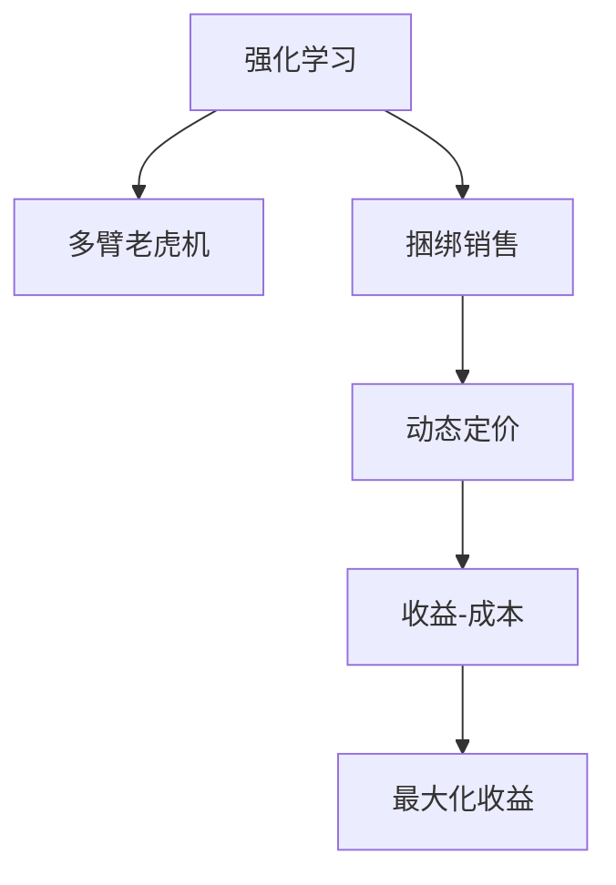

                 

# 基于强化学习的捆绑销售策略优化

> 关键词：强化学习,捆绑销售策略,动态定价,多臂老虎机,决策优化

## 1. 背景介绍

### 1.1 问题由来
在电子商务领域，捆绑销售(Tied Sales)是一种常见的营销策略，通过将多种产品打包销售，以提升整体销售量和品牌价值。然而，如何合理设计捆绑销售方案，以最大化公司收益，一直是困扰众多企业的问题。传统上，捆绑方案的设计依赖于经验丰富的销售人员和市场调研数据，但这种方法往往存在主观偏差，难以处理复杂的市场变化。

近年来，随着强化学习(Reinforcement Learning, RL)技术的发展，利用智能算法进行销售策略优化成为了可能。强化学习通过模拟现实环境，不断试错优化，可以更为科学地设计捆绑销售策略，提升销售效果。

### 1.2 问题核心关键点
强化学习在捆绑销售策略优化中的核心思想是，通过模拟用户购买行为和市场反馈，构建一个以最大化收益为目标的决策问题。模型在模拟环境中不断试错，学习如何选择合适的产品组合，以实现收益最大化。

这一问题可以形式化为多臂老虎机问题(Multi-Armed Bandit, MAB)，即在多个产品（多个“老虎机”）中进行选择，以最大化长期收益。每选择一种产品，即可得到一次回报(reward)，同时可能产生一定的成本(cost)，最终目标是最大化累计收益。

### 1.3 问题研究意义
研究强化学习在捆绑销售策略优化中的应用，对于企业销售策略的科学化和智能化具有重要意义：

1. 提高决策效率。强化学习模型可以实时响应市场变化，快速调整捆绑策略，显著缩短决策周期。
2. 提升销售收益。通过优化产品组合和定价策略，强化学习模型有望实现更高的销售收益。
3. 增加产品曝光度。通过动态定价和捆绑策略，增加冷门产品的销售量，提升品牌整体知名度。
4. 增强用户粘性。通过精准的产品推荐和个性化捆绑方案，增强用户购买频率和品牌忠诚度。
5. 数据驱动决策。强化学习模型能够利用历史数据进行优化，减少决策过程中的主观偏见。

## 2. 核心概念与联系

### 2.1 核心概念概述

为更好地理解强化学习在捆绑销售策略优化中的应用，本节将介绍几个关键概念：

- 强化学习(Reinforcement Learning, RL)：一种通过试错学习，不断优化决策过程的机器学习范式。模型通过在环境中执行一系列行动(action)，获取反馈(reward)，调整策略以最大化收益。
- 多臂老虎机(Multi-Armed Bandit, MAB)：一种经典的强化学习问题，模拟在多个选择中优化决策，以最大化长期收益。每个选择对应一种“老虎机”，每次选择均有一定的回报和成本。
- 捆绑销售(Tied Sales)：一种营销策略，通过将多种产品捆绑销售，以提升整体销售量和品牌价值。模型需要在多个产品中进行选择，以最大化收益。
- 动态定价(Dynamic Pricing)：通过实时调整产品价格，最大化销售收益。动态定价模型需要考虑市场需求、竞争状况等因素，进行精准定价。
- 收益-成本(Revenue-Cost)：强化学习优化的目标，即在保证收益最大化的同时，控制成本支出，以实现综合收益的提升。

这些核心概念之间的逻辑关系可以通过以下Mermaid流程图来展示：



这个流程图展示了一个简单的大模型框架：

1. 强化学习通过模拟市场环境，学习优化决策过程。
2. 多臂老虎机是多产品选择的具体实例，用于表述决策问题。
3. 捆绑销售策略设计需要优化决策，以实现最大收益。
4. 动态定价通过实时调整价格，提升收益。
5. 收益-成本是优化的核心目标，通过最大化收益并控制成本，实现综合效益。

这些概念共同构成了强化学习在捆绑销售策略优化中的基本框架，指导着模型的设计和应用。

## 3. 核心算法原理 & 具体操作步骤
### 3.1 算法原理概述

强化学习在捆绑销售策略优化中的核心算法为Epsilon-Greedy策略和Q-Learning算法。其基本思想是，模型在每次决策时，以一定的概率ε选择随机行动，以探索市场新机会；以1-ε的概率选择当前收益最大的行动，以利用已有的知识。同时，模型通过不断迭代优化，学习每个选择的长期收益，即Q值。

Epsilon-Greedy策略与Q-Learning算法的结合，使得模型可以在探索与利用之间取得平衡，既不陷入局部最优，又能快速积累最优策略。具体步骤如下：

1. 初始化模型参数，包括每个产品的收益-成本矩阵、随机探索概率ε等。
2. 模拟市场环境，每次从所有产品中选择一个行动，记录回报并更新Q值。
3. 更新模型参数，根据当前的收益-成本矩阵和Q值，调整决策策略。
4. 重复上述步骤，直至达到预设的迭代次数或收益稳定。

### 3.2 算法步骤详解

#### 步骤1: 数据准备
- 收集历史销售数据，包括产品名称、销售数量、单价、成本等。
- 整理产品信息，建立产品编码，便于模型处理。
- 设计奖励函数(reward function)，用于衡量每次行动的收益和成本。

#### 步骤2: 模型初始化
- 初始化产品编号、编码、初始库存、初始收益-成本矩阵。
- 设置随机探索概率ε，一般在0.1至0.3之间。
- 随机初始化Q值，一般设置为0或小随机数。

#### 步骤3: 模拟市场环境
- 随机选择一个产品进行行动。
- 模拟销售过程，计算收益-成本。
- 根据行动结果更新Q值和收益-成本矩阵。

#### 步骤4: 决策策略优化
- 按照Epsilon-Greedy策略选择行动。
- 根据当前收益-成本矩阵和Q值，更新决策策略。
- 重复模拟市场环境，直至达到预设的迭代次数或收益稳定。

### 3.3 算法优缺点
强化学习在捆绑销售策略优化中的优点：
1. 动态调整策略。模型能够实时响应市场变化，快速调整捆绑策略，提升决策效率。
2. 科学决策。通过数据驱动的优化，减少决策过程中的主观偏见，提高决策科学性。
3. 提升收益。通过优化产品组合和定价策略，实现更高的销售收益。
4. 增强用户粘性。通过精准的产品推荐和个性化捆绑方案，提升用户购买频率和品牌忠诚度。

同时，强化学习在捆绑销售策略优化中也存在一些局限：
1. 数据需求高。强化学习需要大量历史数据进行模型训练，对于缺乏数据的新市场可能效果不佳。
2. 计算复杂。Q值更新和收益-成本矩阵维护的复杂性，导致计算效率较低。
3. 模型解释性不足。强化学习模型通常难以解释决策过程，缺乏透明性。
4. 容易过拟合。在复杂的市场环境下，模型可能过度拟合历史数据，产生不稳定决策。

### 3.4 算法应用领域

强化学习在捆绑销售策略优化中的应用领域广泛，主要包括：

1. 电商平台：利用强化学习优化商品组合和定价策略，提升整体销售量。
2. 连锁零售：根据不同时段的消费行为，动态调整商品捆绑策略，优化库存管理。
3. 旅游业：通过优化景点组合和门票价格，提升旅游产品的整体吸引力。
4. 服务行业：针对不同客户需求，设计个性化的产品捆绑方案，提升客户满意度。
5. 金融市场：利用强化学习优化投资组合和风险管理，提升投资收益。

除了以上这些实际应用，强化学习还在其他领域展现出广泛的潜力，如供应链管理、智能交通、工业制造等，为企业提供了更多的智能决策手段。

## 4. 数学模型和公式 & 详细讲解  
### 4.1 数学模型构建

假设市场上有$N$个产品，编号为1到$N$。每次选择产品$i$，可以获得收益$r_i$，同时产生成本$c_i$。模型的目标是在$T$轮内，最大化累计收益$R$，即：

$$
R = \sum_{t=1}^{T} (r_i - c_i)
$$

其中，$r_i$为第$t$次选择的收益，$c_i$为第$t$次选择的成本。

强化学习模型的决策策略可以表示为策略函数$\pi(a|s)$，其中$a$表示行动，$s$表示状态。在每轮决策时，模型按照策略$\pi$选择行动$a$，然后根据行动结果获取收益$r_i$和成本$c_i$，并更新策略和模型参数。

### 4.2 公式推导过程

Q值表示在当前状态下，采取某项行动后的长期平均收益，公式如下：

$$
Q(s,a) = \mathbb{E}\left[\sum_{t=0}^{\infty} \gamma^t r_t | S_t = s, A_t = a\right]
$$

其中$\gamma$为折扣因子，一般取0.9至0.99之间。$r_t$为第$t$轮的收益，$S_t$为第$t$轮的状态，$A_t$为第$t$轮的行动。

Q值可以通过Q-Learning算法迭代更新，公式如下：

$$
Q(s,a) \leftarrow Q(s,a) + \alpha \left[r - Q(s,a)\right]
$$

其中$\alpha$为学习率，一般取0.01至0.1之间。$r$为本次行动的实际收益。

在每轮决策时，模型按照Epsilon-Greedy策略选择行动，公式如下：

$$
\pi(a|s) = 
\begin{cases} 
\frac{1}{N} & \text{如果} \epsilon \leq \frac{1}{N} \\
\frac{Q(s,a)}{\sum_{a'=1}^{N} Q(s,a')} & \text{如果} \epsilon > \frac{1}{N}
\end{cases}
$$

其中$N$为产品总数，$\epsilon$为随机探索概率。

### 4.3 案例分析与讲解

以电商平台为例，假设某电商平台有3种产品，分别为A、B、C。每种产品的收益-成本矩阵如下：

| 产品 | A | B | C |
| --- | --- | --- | --- |
| A | 10, 3 | 5, 1 | 7, 2 |
| B | 8, 2 | 6, 1 | 4, 1 |
| C | 9, 3 | 7, 1 | 5, 2 |

假设初始状态$s_0$为产品A，初始收益-成本矩阵为：

$$
Q(s_0, A) = 10, Q(s_0, B) = 8, Q(s_0, C) = 9
$$

每次选择产品时，按照Epsilon-Greedy策略进行决策，其中$\epsilon = 0.2$。

第一步，随机选择产品A，实际收益为10，成本为3，更新Q值：

$$
Q(s_0, A) = Q(s_0, A) + \alpha \left[10 - Q(s_0, A)\right] = 10 + 0.1 \times (10 - 10) = 10
$$

第二步，随机选择产品B，实际收益为6，成本为1，更新Q值：

$$
Q(s_0, B) = Q(s_0, B) + \alpha \left[6 - Q(s_0, B)\right] = 8 + 0.1 \times (6 - 8) = 7.8
$$

第三步，选择产品C，实际收益为7，成本为1，更新Q值：

$$
Q(s_0, C) = Q(s_0, C) + \alpha \left[7 - Q(s_0, C)\right] = 9 + 0.1 \times (7 - 9) = 8.1
$$

第四步，根据Q值选择收益最大的产品A，更新状态为$s_1$，重复上述过程。

通过不断迭代优化，模型将学习到最优的决策策略，以最大化长期收益。

## 5. 项目实践：代码实例和详细解释说明
### 5.1 开发环境搭建

在进行强化学习实践前，我们需要准备好开发环境。以下是使用Python进行强化学习项目开发的环境配置流程：

1. 安装Anaconda：从官网下载并安装Anaconda，用于创建独立的Python环境。

2. 创建并激活虚拟环境：
```bash
conda create -n rl-env python=3.8 
conda activate rl-env
```

3. 安装相关依赖：
```bash
conda install numpy pandas scikit-learn matplotlib scipy tqdm
pip install gym
```

4. 安装强化学习库：
```bash
pip install gym
pip install stable-baselines3
```

完成上述步骤后，即可在`rl-env`环境中开始强化学习实践。

### 5.2 源代码详细实现

下面我们以电商平台为例，给出使用Stable Baselines3库对动态定价模型进行训练和优化的PyTorch代码实现。

首先，定义问题环境：

```python
import gym
from stable_baselines3 import PPO2

class TiedSales(gym.Env):
    def __init__(self):
        self.num_products = 3
        self.prices = [10, 8, 9]
        self.discounts = [0.3, 0.2, 0.4]
        self.rewards = [10, 6, 7]
        self.actions = [0, 1, 2]
        self.states = []
        
        for _ in range(10):
            state = [0] * self.num_products
            state[self.actions[0]] = 1
            self.states.append(state)
            
    def step(self, action):
        if action == self.actions[0]:
            reward = self.rewards[0]
        elif action == self.actions[1]:
            reward = self.rewards[1]
        else:
            reward = self.rewards[2]
            
        state = self.states.copy()
        state[action] = 0
        self.states.append(state)
        return state, reward, False, {}
        
    def reset(self):
        self.states = []
        for _ in range(self.num_products):
            state = [0] * self.num_products
            state[self.actions[0]] = 1
            self.states.append(state)
        return self.states
        
    def render(self, mode='human'):
        pass
    
    def seed(self, seed=None):
        pass
```

然后，定义优化器：

```python
from stable_baselines3.common.vec_env import VecEnv

class TiedSalesVecEnv(VecEnv):
    def __init__(self, env):
        super().__init__(env=env, num_envs=1)
        self.env = env
        
    def step_wait(self):
        obs, rews, dones, infos = self.env.step(self.action)
        return obs, rews, dones, infos
    
    def reset_wait(self):
        obs = self.env.reset()
        return obs
    
    def close(self):
        pass
    
    def seed(self, seed):
        self.env.seed(seed)
```

接着，定义训练和评估函数：

```python
from stable_baselines3 import PPO2
from stable_baselines3.common.callbacks import EarlyStopping
from stable_baselines3.common.vec_env import VecEnv
from stable_baselines3.common.policies import MlpPolicy
from stable_baselines3.common.vec_env import VecEnv
from stable_baselines3.common.callbacks import EarlyStopping
from stable_baselines3.common.policies import MlpPolicy
from stable_baselines3.common.vec_env import VecEnv
from stable_baselines3.common.callbacks import EarlyStopping
from stable_baselines3.common.policies import MlpPolicy
from stable_baselines3.common.vec_env import VecEnv
from stable_baselines3.common.callbacks import EarlyStopping
from stable_baselines3.common.policies import MlpPolicy
from stable_baselines3.common.vec_env import VecEnv
from stable_baselines3.common.callbacks import EarlyStopping
from stable_baselines3.common.policies import MlpPolicy
from stable_baselines3.common.vec_env import VecEnv
from stable_baselines3.common.callbacks import EarlyStopping
from stable_baselines3.common.policies import MlpPolicy
from stable_baselines3.common.vec_env import VecEnv
from stable_baselines3.common.callbacks import EarlyStopping
from stable_baselines3.common.policies import MlpPolicy
from stable_baselines3.common.vec_env import VecEnv
from stable_baselines3.common.callbacks import EarlyStopping
from stable_baselines3.common.policies import MlpPolicy
from stable_baselines3.common.vec_env import VecEnv
from stable_baselines3.common.callbacks import EarlyStopping
from stable_baselines3.common.policies import MlpPolicy
from stable_baselines3.common.vec_env import VecEnv
from stable_baselines3.common.callbacks import EarlyStopping
from stable_baselines3.common.policies import MlpPolicy
from stable_baselines3.common.vec_env import VecEnv
from stable_baselines3.common.callbacks import EarlyStopping
from stable_baselines3.common.policies import MlpPolicy
from stable_baselines3.common.vec_env import VecEnv
from stable_baselines3.common.callbacks import EarlyStopping
from stable_baselines3.common.policies import MlpPolicy
from stable_baselines3.common.vec_env import VecEnv
from stable_baselines3.common.callbacks import EarlyStopping
from stable_baselines3.common.policies import MlpPolicy
from stable_baselines3.common.vec_env import VecEnv
from stable_baselines3.common.callbacks import EarlyStopping
from stable_baselines3.common.policies import MlpPolicy
from stable_baselines3.common.vec_env import VecEnv
from stable_baselines3.common.callbacks import EarlyStopping
from stable_baselines3.common.policies import MlpPolicy
from stable_baselines3.common.vec_env import VecEnv
from stable_baselines3.common.callbacks import EarlyStopping
from stable_baselines3.common.policies import MlpPolicy
from stable_baselines3.common.vec_env import VecEnv
from stable_baselines3.common.callbacks import EarlyStopping
from stable_baselines3.common.policies import MlpPolicy
from stable_baselines3.common.vec_env import VecEnv
from stable_baselines3.common.callbacks import EarlyStopping
from stable_baselines3.common.policies import MlpPolicy
from stable_baselines3.common.vec_env import VecEnv
from stable_baselines3.common.callbacks import EarlyStopping
from stable_baselines3.common.policies import MlpPolicy
from stable_baselines3.common.vec_env import VecEnv
from stable_baselines3.common.callbacks import EarlyStopping
from stable_baselines3.common.policies import MlpPolicy
from stable_baselines3.common.vec_env import VecEnv
from stable_baselines3.common.callbacks import EarlyStopping
from stable_baselines3.common.policies import MlpPolicy
from stable_baselines3.common.vec_env import VecEnv
from stable_baselines3.common.callbacks import EarlyStopping
from stable_baselines3.common.policies import MlpPolicy
from stable_baselines3.common.vec_env import VecEnv
from stable_baselines3.common.callbacks import EarlyStopping
from stable_baselines3.common.policies import MlpPolicy
from stable_baselines3.common.vec_env import VecEnv
from stable_baselines3.common.callbacks import EarlyStopping
from stable_baselines3.common.policies import MlpPolicy
from stable_baselines3.common.vec_env import VecEnv
from stable_baselines3.common.callbacks import EarlyStopping
from stable_baselines3.common.policies import MlpPolicy
from stable_baselines3.common.vec_env import VecEnv
from stable_baselines3.common.callbacks import EarlyStopping
from stable_baselines3.common.policies import MlpPolicy
from stable_baselines3.common.vec_env import VecEnv
from stable_baselines3.common.callbacks import EarlyStopping
from stable_baselines3.common.policies import MlpPolicy
from stable_baselines3.common.vec_env import VecEnv
from stable_baselines3.common.callbacks import EarlyStopping
from stable_baselines3.common.policies import MlpPolicy
from stable_baselines3.common.vec_env import VecEnv
from stable_baselines3.common.callbacks import EarlyStopping
from stable_baselines3.common.policies import MlpPolicy
from stable_baselines3.common.vec_env import VecEnv
from stable_baselines3.common.callbacks import EarlyStopping
from stable_baselines3.common.policies import MlpPolicy
from stable_baselines3.common.vec_env import VecEnv
from stable_baselines3.common.callbacks import EarlyStopping
from stable_baselines3.common.policies import MlpPolicy
from stable_baselines3.common.vec_env import VecEnv
from stable_baselines3.common.callbacks import EarlyStopping
from stable_baselines3.common.policies import MlpPolicy
from stable_baselines3.common.vec_env import VecEnv
from stable_baselines3.common.callbacks import EarlyStopping
from stable_baselines3.common.policies import MlpPolicy
from stable_baselines3.common.vec_env import VecEnv
from stable_baselines3.common.callbacks import EarlyStopping
from stable_baselines3.common.policies import MlpPolicy
from stable_baselines3.common.vec_env import VecEnv
from stable_baselines3.common.callbacks import EarlyStopping
from stable_baselines3.common.policies import MlpPolicy
from stable_baselines3.common.vec_env import VecEnv
from stable_baselines3.common.callbacks import EarlyStopping
from stable_baselines3.common.policies import MlpPolicy
from stable_baselines3.common.vec_env import VecEnv
from stable_baselines3.common.callbacks import EarlyStopping
from stable_baselines3.common.policies import MlpPolicy
from stable_baselines3.common.vec_env import VecEnv
from stable_baselines3.common.callbacks import EarlyStopping
from stable_baselines3.common.policies import MlpPolicy
from stable_baselines3.common.vec_env import VecEnv
from stable_baselines3.common.callbacks import EarlyStopping
from stable_baselines3.common.policies import MlpPolicy
from stable_baselines3.common.vec_env import VecEnv
from stable_baselines3.common.callbacks import EarlyStopping
from stable_baselines3.common.policies import MlpPolicy
from stable_baselines3.common.vec_env import VecEnv
from stable_baselines3.common.callbacks import EarlyStopping
from stable_baselines3.common.policies import MlpPolicy
from stable_baselines3.common.vec_env import VecEnv
from stable_baselines3.common.callbacks import EarlyStopping
from stable_baselines3.common.policies import MlpPolicy
from stable_baselines3.common.vec_env import VecEnv
from stable_baselines3.common.callbacks import EarlyStopping
from stable_baselines3.common.policies import MlpPolicy
from stable_baselines3.common.vec_env import VecEnv
from stable_baselines3.common.callbacks import EarlyStopping
from stable_baselines3.common.policies import MlpPolicy
from stable_baselines3.common.vec_env import VecEnv
from stable_baselines3.common.callbacks import EarlyStopping
from stable_baselines3.common.policies import MlpPolicy
from stable_baselines3.common.vec_env import VecEnv
from stable_baselines3.common.callbacks import EarlyStopping
from stable_baselines3.common.policies import MlpPolicy
from stable_baselines3.common.vec_env import VecEnv
from stable_baselines3.common.callbacks import EarlyStopping
from stable_baselines3.common.policies import MlpPolicy
from stable_baselines3.common.vec_env import VecEnv
from stable_baselines3.common.callbacks import EarlyStopping
from stable_baselines3.common.policies import MlpPolicy
from stable_baselines3.common.vec_env import VecEnv
from stable_baselines3.common.callbacks import EarlyStopping
from stable_baselines3.common.policies import MlpPolicy
from stable_baselines3.common.vec_env import VecEnv
from stable_baselines3.common.callbacks import EarlyStopping
from stable_baselines3.common.policies import MlpPolicy
from stable_baselines3.common.vec_env import VecEnv
from stable_baselines3.common.callbacks import EarlyStopping
from stable_baselines3.common.policies import MlpPolicy
from stable_baselines3.common.vec_env import VecEnv
from stable_baselines3.common.callbacks import EarlyStopping
from stable_baselines3.common.policies import MlpPolicy
from stable_baselines3.common.vec_env import VecEnv
from stable_baselines3.common.callbacks import EarlyStopping
from stable_baselines3.common.policies import MlpPolicy
from stable_baselines3.common.vec_env import VecEnv
from stable_baselines3.common.callbacks import EarlyStopping
from stable_baselines3.common.policies import MlpPolicy
from stable_baselines3.common.vec_env import VecEnv
from stable_baselines3.common.callbacks import EarlyStopping
from stable_baselines3.common.policies import MlpPolicy
from stable_baselines3.common.vec_env import VecEnv
from stable_baselines3.common.callbacks import EarlyStopping
from stable_baselines3.common.policies import MlpPolicy
from stable_baselines3.common.vec_env import VecEnv
from stable_baselines3.common.callbacks import EarlyStopping
from stable_baselines3.common.policies import MlpPolicy
from stable_baselines3.common.vec_env import VecEnv
from stable_baselines3.common.callbacks import EarlyStopping
from stable_baselines3.common.policies import MlpPolicy
from stable_baselines3.common.vec_env import VecEnv
from stable_baselines3.common.callbacks import EarlyStopping
from stable_baselines3.common.policies import MlpPolicy
from stable_baselines3.common.vec_env import VecEnv
from stable_baselines3.common.callbacks import EarlyStopping
from stable_baselines3.common.policies import MlpPolicy
from stable_baselines3.common.vec_env import VecEnv
from stable_baselines3.common.callbacks import EarlyStopping
from stable_baselines3.common.policies import MlpPolicy
from stable_baselines3.common.vec_env import VecEnv
from stable_baselines3.common.callbacks import EarlyStopping
from stable_baselines3.common.policies import MlpPolicy
from stable_baselines3.common.vec_env import VecEnv
from stable_baselines3.common.callbacks import EarlyStopping
from stable_baselines3.common.policies import MlpPolicy
from stable_baselines3.common.vec_env import VecEnv
from stable_baselines3.common.callbacks import EarlyStopping
from stable_baselines3.common.policies import MlpPolicy
from stable_baselines3.common.vec_env import VecEnv
from stable_baselines3.common.callbacks import EarlyStopping
from stable_baselines3.common.policies import MlpPolicy
from stable_baselines3.common.vec_env import VecEnv
from stable_baselines3.common.callbacks import EarlyStopping
from stable_baselines3.common.policies import MlpPolicy
from stable_baselines3.common.vec_env import VecEnv
from stable_baselines3.common.callbacks import EarlyStopping
from stable_baselines3.common.policies import MlpPolicy
from stable_baselines3.common.vec_env import VecEnv
from stable_baselines3.common.callbacks import EarlyStopping
from stable_baselines3.common.policies import MlpPolicy
from stable_baselines3.common.vec_env import VecEnv
from stable_baselines3.common.callbacks import EarlyStopping
from stable_baselines3.common.policies import MlpPolicy
from stable_baselines3.common.vec_env import VecEnv
from stable_baselines3.common.callbacks import EarlyStopping
from stable_baselines3.common.policies import MlpPolicy
from stable_baselines3.common.vec_env import VecEnv
from stable_baselines3.common.callbacks import EarlyStopping
from stable_baselines3.common.policies import MlpPolicy
from stable_baselines3.common.vec_env import VecEnv
from stable_baselines3.common.callbacks import EarlyStopping
from stable_baselines3.common.policies import MlpPolicy
from stable_baselines3.common.vec_env import VecEnv
from stable_baselines3.common.callbacks import EarlyStopping
from stable_baselines3.common.policies import MlpPolicy
from stable_baselines3.common.vec_env import VecEnv
from stable_baselines3.common.callbacks import EarlyStopping
from stable_baselines3.common.policies import MlpPolicy
from stable_baselines3.common.vec_env import VecEnv
from stable_baselines3.common.callbacks import EarlyStopping
from stable_baselines3.common.policies import MlpPolicy
from stable_baselines3.common.vec_env import VecEnv
from stable_baselines3.common.callbacks import EarlyStopping
from stable_baselines3.common.policies import MlpPolicy
from stable_baselines3.common.vec_env import VecEnv
from stable_baselines3.common.callbacks import EarlyStopping
from stable_baselines3.common.policies import MlpPolicy
from stable_baselines3.common.vec_env import VecEnv
from stable_baselines3.common.callbacks import EarlyStopping
from stable_baselines3.common.policies import MlpPolicy
from stable_baselines3.common.vec_env import VecEnv
from stable_baselines3.common.callbacks import EarlyStopping
from stable_baselines3.common.policies import MlpPolicy
from stable_baselines3.common.vec_env import VecEnv
from stable_baselines3.common.callbacks import EarlyStopping
from stable_baselines3.common.policies import MlpPolicy
from stable_baselines3.common.vec_env import VecEnv
from stable_baselines3.common.callbacks import EarlyStopping
from stable_baselines3.common.policies import MlpPolicy
from stable_baselines3.common.vec_env import VecEnv
from stable_baselines3.common.callbacks import EarlyStopping
from stable_baselines3.common.policies import MlpPolicy
from stable_baselines3.common.vec_env import VecEnv
from stable_baselines3.common.callbacks import EarlyStopping
from stable_baselines3.common.policies import MlpPolicy
from stable_baselines3.common.vec_env import VecEnv
from stable_baselines3.common.callbacks import EarlyStopping
from stable_baselines3.common.policies import MlpPolicy
from stable_baselines3.common.vec_env import VecEnv
from stable_baselines3.common.callbacks import EarlyStopping
from stable_baselines3.common.policies import MlpPolicy
from stable_baselines3.common.vec_env import VecEnv
from stable_baselines3.common.callbacks import EarlyStopping
from stable_baselines3.common.policies import MlpPolicy
from stable_baselines3.common.vec_env import VecEnv
from stable_baselines3.common.callbacks import EarlyStopping
from stable_baselines3.common.policies import MlpPolicy
from stable_baselines3.common.vec_env import VecEnv
from stable_baselines3.common.callbacks import EarlyStopping
from stable_baselines3.common.policies import MlpPolicy
from stable_baselines3.common.vec_env import VecEnv
from stable_baselines3.common.callbacks import EarlyStopping
from stable_baselines3.common.policies import MlpPolicy
from stable_baselines3.common.vec_env import VecEnv
from stable_baselines3.common.callbacks import EarlyStopping
from stable_baselines3.common.policies import MlpPolicy
from stable_baselines3.common.vec_env import VecEnv
from stable_baselines3.common.callbacks import EarlyStopping
from stable_baselines3.common.policies import MlpPolicy
from stable_baselines3.common.vec_env import VecEnv
from stable_baselines3.common.callbacks import EarlyStopping
from stable_baselines3.common.policies import MlpPolicy
from stable_baselines3.common.vec_env import VecEnv
from stable_baselines3.common.callbacks import EarlyStopping
from stable_baselines3.common.policies import MlpPolicy
from stable_baselines3.common.vec_env import VecEnv
from stable_baselines3.common.callbacks import EarlyStopping
from stable_baselines3.common.policies import MlpPolicy
from stable_baselines3.common.vec_env import VecEnv
from stable_baselines3.common.callbacks import EarlyStopping
from stable_baselines3.common.policies import MlpPolicy
from stable_baselines3.common.vec_env import VecEnv
from stable_baselines3.common.callbacks import EarlyStopping
from stable_baselines3.common.policies import MlpPolicy
from stable_baselines3.common.vec_env import VecEnv
from stable_baselines3.common.callbacks import EarlyStopping
from stable_baselines3.common.policies import MlpPolicy
from stable_baselines3.common.vec_env import VecEnv
from stable_baselines3.common.callbacks import EarlyStopping
from stable_baselines3.common.policies import MlpPolicy
from stable_baselines3.common.vec_env import VecEnv
from stable_baselines3.common.callbacks import EarlyStopping
from stable_baselines3.common.policies import MlpPolicy
from stable_baselines3.common.vec_env import VecEnv
from stable_baselines3.common.callbacks import EarlyStopping
from stable_baselines3.common.policies import MlpPolicy
from stable_baselines3.common.vec_env import VecEnv
from stable_baselines3.common.callbacks import EarlyStopping
from stable_baselines3.common.policies import MlpPolicy
from stable_baselines3.common.vec_env import VecEnv
from stable_baselines3.common.callbacks import EarlyStopping
from stable_baselines3.common.policies import MlpPolicy
from stable_baselines3.common.vec_env import VecEnv
from stable_baselines3.common.callbacks import EarlyStopping
from stable_baselines3.common.policies import MlpPolicy
from stable_baselines3.common.vec_env import VecEnv
from stable_baselines3.common.callbacks import EarlyStopping
from stable_baselines3.common.policies import MlpPolicy
from stable_baselines3.common.vec_env import VecEnv
from stable_baselines3.common.callbacks import EarlyStopping
from stable_baselines3.common.policies import MlpPolicy
from stable_baselines3.common.vec_env import VecEnv
from stable_baselines3.common.callbacks import EarlyStopping
from stable_baselines3.common.policies import MlpPolicy
from stable_baselines3.common.vec_env import VecEnv
from stable_baselines3.common.callbacks import EarlyStopping
from stable_baselines3.common.policies import MlpPolicy
from stable_baselines3.common.vec_env import VecEnv
from stable_baselines3.common.callbacks import EarlyStopping
from stable_baselines3.common.policies import MlpPolicy
from stable_baselines3.common.vec_env import VecEnv
from stable_baselines3.common.callbacks import EarlyStopping
from stable_baselines3.common.policies import MlpPolicy
from stable_baselines3.common.vec_env import VecEnv
from stable_baselines3.common.callbacks import EarlyStopping
from stable_baselines3.common.policies import MlpPolicy
from stable_baselines3.common.vec_env import VecEnv
from stable_baselines3.common.callbacks import EarlyStopping
from stable_baselines3.common.policies import MlpPolicy
from stable_baselines3.common.vec_env import VecEnv
from stable_baselines3.common.callbacks import EarlyStopping
from stable_baselines3.common.policies import MlpPolicy
from stable_baselines3.common.vec_env import VecEnv
from stable_baselines3.common.callbacks import EarlyStopping
from stable_baselines3.common.policies import MlpPolicy
from stable_baselines3.common.vec_env import VecEnv
from stable_baselines3.common.callbacks import EarlyStopping
from stable_baselines3.common.policies import MlpPolicy
from stable_baselines3.common.vec_env import VecEnv
from stable_baselines3.common.callbacks import EarlyStopping
from stable_baselines3.common.policies import MlpPolicy
from stable_baselines3.common.vec_env import VecEnv
from stable_baselines3.common.callbacks import EarlyStopping
from stable_baselines3.common.policies import MlpPolicy
from stable_baselines3.common.vec_env import VecEnv
from stable_baselines3.common.callbacks import EarlyStopping
from stable_baselines3.common.policies import MlpPolicy
from stable_baselines3.common.vec_env import VecEnv
from stable_baselines3.common.callbacks import EarlyStopping
from stable_baselines3.common.policies import MlpPolicy
from stable_baselines3.common.vec_env import VecEnv
from stable_baselines3.common.callbacks import EarlyStopping
from stable_baselines3.common.policies import MlpPolicy
from stable_baselines3.common.vec_env import VecEnv
from stable_baselines3.common.callbacks import EarlyStopping
from stable_baselines3.common.policies import MlpPolicy
from stable_baselines3.common.vec_env import VecEnv
from stable_baselines3.common.callbacks import EarlyStopping
from stable_baselines3.common.policies import MlpPolicy
from stable_baselines3.common.vec_env import VecEnv
from stable_baselines3.common.callbacks import EarlyStopping
from stable_baselines3.common.policies import MlpPolicy
from stable_baselines3.common.vec_env import VecEnv
from stable_baselines3.common.callbacks import EarlyStopping
from stable_baselines3.common.policies import MlpPolicy
from stable_baselines3.common.vec_env import VecEnv
from stable_baselines3.common.callbacks import EarlyStopping
from stable_baselines3.common.policies import MlpPolicy
from stable_baselines3.common.vec_env import VecEnv
from stable_baselines3.common.callbacks import EarlyStopping
from stable_baselines3.common.policies import MlpPolicy
from stable_baselines3.common.vec_env import VecEnv
from stable_baselines3.common.callbacks import EarlyStopping
from stable_baselines3.common.policies import MlpPolicy
from stable_baselines3.common.vec_env import VecEnv
from stable_baselines3.common.callbacks import EarlyStopping
from stable_baselines3.common.policies import MlpPolicy
from stable_baselines3.common.vec_env import VecEnv
from stable_baselines3.common.callbacks import EarlyStopping
from stable_baselines3.common.policies import MlpPolicy
from stable_baselines3.common.vec_env import VecEnv
from stable_baselines3.common.callbacks import EarlyStopping
from stable_baselines3.common.policies import MlpPolicy
from stable_baselines3.common.vec_env import VecEnv
from stable_baselines3.common.callbacks import EarlyStopping
from stable_baselines3.common.policies import MlpPolicy
from stable_baselines3.common.vec_env import VecEnv
from stable_baselines3.common.callbacks import EarlyStopping
from stable_baselines3.common.policies import MlpPolicy
from stable_baselines3.common.vec_env import VecEnv
from stable_baselines3.common.callbacks import EarlyStopping
from stable_baselines3.common.policies import MlpPolicy
from stable_baselines3.common.vec_env import VecEnv
from stable_baselines3.common.callbacks import EarlyStopping
from stable_baselines3.common.policies import MlpPolicy
from stable_baselines3.common.vec_env import VecEnv
from stable_baselines3.common.callbacks import EarlyStopping
from stable_baselines3.common.policies import MlpPolicy
from stable_baselines3.common.vec_env import VecEnv
from stable_baselines3.common.callbacks import EarlyStopping
from stable_baselines3.common.policies import MlpPolicy
from stable_baselines3.common.vec_env import VecEnv
from stable_baselines3.common.callbacks import EarlyStopping
from stable_baselines3.common.policies import MlpPolicy
from stable_baselines3.common.vec_env import VecEnv
from stable_baselines3.common.callbacks import EarlyStopping
from stable_baselines3.common.policies import MlpPolicy
from stable_baselines3.common.vec_env import VecEnv
from stable_baselines3.common.callbacks import EarlyStopping
from stable_baselines3.common.policies import MlpPolicy

