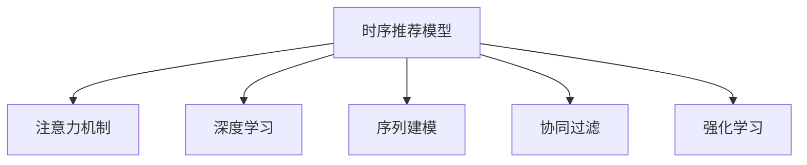

                 

# 基于注意力机制的时序推荐模型

> 关键词：时序推荐模型, 注意力机制, 深度学习, 序列建模, 协同过滤, 强化学习

## 1. 背景介绍

推荐系统在互联网行业中扮演着重要的角色，无论是电商平台、内容平台，还是社交网络，推荐系统都通过个性化推荐，提升了用户体验，增强了用户粘性，驱动了商业价值增长。传统推荐系统主要依赖于协同过滤和基于内容的推荐方法，这些方法在处理大规模数据集时面临计算复杂度高、特征表示能力有限等挑战。

近年来，随着深度学习技术的飞速发展，基于深度学习的方法，如序列建模、神经协同过滤等，开始广泛应用于推荐系统中。这些方法通过神经网络学习用户的隐式偏好，对大规模数据进行端到端的处理，取得了不俗的效果。本文将深入探讨基于注意力机制的时序推荐模型，通过详尽的算法原理和具体实例，介绍其在推荐系统中的应用。

## 2. 核心概念与联系

### 2.1 核心概念概述

在深入学习基于注意力机制的时序推荐模型之前，我们需要先了解几个核心概念：

- **时序推荐模型**：通过学习用户的历史行为序列，预测用户未来的行为，进行个性化推荐。常用于处理用户对商品的连续交互行为，如点击、浏览、购买等。
- **注意力机制(Attention Mechanism)**：用于对输入序列中不同位置的信息进行加权处理，侧重关注对用户行为影响最大的因素，实现对复杂序列的精确建模。
- **深度学习(Deep Learning)**：利用多层神经网络，通过反向传播算法学习数据的特征表示，提升模型的泛化能力和预测精度。
- **序列建模(Sequence Modeling)**：通过神经网络处理序列数据，捕捉时间依赖关系，适用于处理用户行为序列。
- **协同过滤(Collaborative Filtering)**：通过用户之间的相似性进行推荐，适用于隐式反馈的推荐任务。
- **强化学习(Reinforcement Learning)**：通过与环境交互，使模型自适应地学习最优决策策略，适用于交互式推荐系统。

这些概念之间的逻辑关系可以通过以下Mermaid流程图来展示：



这个流程图展示了几大核心概念及其之间的关联：

1. **时序推荐模型**是处理用户行为序列的中心概念，其通过深度学习进行特征表示。
2. **注意力机制**作为深度学习中的关键技术，用于对序列中不同位置的特征进行加权处理。
3. **序列建模**和**深度学习**是时序推荐模型的基础技术手段，通过多层神经网络学习序列的特征表示。
4. **协同过滤**和**强化学习**则是推荐系统的主要应用方法，前者通过用户相似性进行推荐，后者通过用户与环境的交互进行优化。

通过理解这些核心概念，我们可以更好地把握时序推荐模型的工作原理和优化方向。

## 3. 核心算法原理 & 具体操作步骤
### 3.1 算法原理概述

基于注意力机制的时序推荐模型（Attention-Based Temporal Recommendation Model），旨在通过学习用户历史行为序列，利用注意力机制对序列中的关键特征进行加权，实现对用户行为模式的高效建模和预测。其核心算法流程包括以下几个步骤：

1. **序列编码**：将用户的历史行为序列输入到神经网络中，通过多层神经网络学习序列的特征表示。
2. **注意力机制**：对序列中的不同时间步进行加权处理，侧重关注对用户行为影响最大的因素。
3. **预测输出**：将编码后的序列和注意力加权后的特征输入到预测层，输出预测结果。

### 3.2 算法步骤详解

接下来，我们将详细介绍每个步骤的具体操作过程。

**Step 1: 序列编码**

序列编码是时序推荐模型的第一步，旨在将用户的历史行为序列转换为神经网络的输入形式。具体流程如下：

1. **数据预处理**：将用户的行为序列转换为数字序列，例如将“点击”映射为1，“浏览”映射为2，“购买”映射为3。
2. **序列嵌入**：使用嵌入层将每个行为序列转换为向量形式。例如，如果用户最近连续点击了三个商品，那么可以将这三个数字编码为向量形式。
3. **多层编码**：使用多个编码层对序列进行多次处理，通过多层神经网络学习序列的特征表示。

**Step 2: 注意力机制**

注意力机制是时序推荐模型的核心技术之一，用于对序列中的不同时间步进行加权处理。其基本思想是，根据每个时间步对用户行为的影响程度，动态调整其权重，从而实现对序列的精确建模。

具体而言，注意力机制可以分为自注意力机制(Self-Attention)和多头注意力机制(Multi-Head Attention)两种类型。

- **自注意力机制**：将序列中的每个时间步作为输入，通过计算序列中所有位置之间的相似度，生成一个权重向量，用于对每个时间步的重要性进行加权处理。
- **多头注意力机制**：通过并行计算多个自注意力向量，生成多个注意力权重，进一步提升模型的表征能力。

**Step 3: 预测输出**

在序列编码和注意力机制的基础上，模型可以输出预测结果。常用的预测层包括全连接层、卷积层、RNN层等。这些层可以对编码后的序列和注意力加权后的特征进行进一步处理，输出预测结果。

### 3.3 算法优缺点

基于注意力机制的时序推荐模型具有以下优点：

1. **高特征表示能力**：通过多层神经网络，模型能够高效地学习序列的特征表示，捕捉时间依赖关系。
2. **高效建模**：利用注意力机制，模型可以动态调整序列中不同时间步的权重，实现对用户行为的高效建模。
3. **泛化能力强**：通过深度学习模型，模型具有较强的泛化能力，能够处理大规模数据集，适应各种推荐场景。

同时，该方法也存在一些局限性：

1. **计算复杂度高**：由于使用了多层神经网络和注意力机制，模型的计算复杂度较高，对计算资源和存储需求较大。
2. **参数量大**：模型参数量较大，需要较大的存储空间和内存。
3. **训练时间长**：由于模型复杂，训练时间较长，需要较长的迭代过程才能收敛。

### 3.4 算法应用领域

基于注意力机制的时序推荐模型在多个领域得到了广泛应用，主要包括以下几个方面：

- **电商推荐**：通过学习用户的历史浏览和购买行为，预测用户未来的购买意向，进行个性化商品推荐。
- **视频推荐**：通过学习用户对视频内容的观看行为，预测用户对未来视频的兴趣，推荐相关视频内容。
- **音乐推荐**：通过学习用户对音乐作品的听歌行为，预测用户对未来音乐的喜好，推荐相关音乐作品。
- **新闻推荐**：通过学习用户对新闻文章的阅读行为，预测用户对未来新闻的兴趣，推荐相关新闻文章。

此外，该方法还被广泛应用于社交网络、游戏推荐等多个场景中，为用户的个性化体验提供了有力支持。

## 4. 数学模型和公式 & 详细讲解
### 4.1 数学模型构建

基于注意力机制的时序推荐模型的数学模型主要包括以下几个部分：

1. **序列编码模型**：将用户历史行为序列编码为向量形式，表示为 $x = \{x_1, x_2, \dots, x_T\}$，其中 $T$ 为序列长度。
2. **自注意力机制**：计算序列中不同位置之间的相似度，生成注意力权重向量 $\alpha = (\alpha_1, \alpha_2, \dots, \alpha_T)$，用于对序列进行加权处理。
3. **预测模型**：将编码后的序列和注意力加权后的特征输入到预测层，输出预测结果 $y$。

### 4.2 公式推导过程

以下我们将详细推导时序推荐模型的核心公式。

**自注意力机制**：

设序列中第 $t$ 个时间步的输入为 $x_t$，使用 $W_q, W_k, W_v$ 分别表示查询向量、键向量和值向量，则自注意力机制的计算公式为：

$$
\alpha_t = \frac{\exp(\text{score}(\text{query}, \text{key}))}{\sum_{i=1}^T \exp(\text{score}(\text{query}, \text{key}))}
$$

其中，$\text{score}(\text{query}, \text{key}) = x_t W_q \cdot x_t W_k^T$，用于计算查询向量和键向量之间的相似度。

将 $\alpha_t$ 应用于每个时间步的特征向量，生成加权后的特征向量 $Z_t = \alpha_t x_t W_v$。

**预测模型**：

假设预测模型的输出为 $y$，使用 $W$ 表示预测层的权重向量，则预测模型的计算公式为：

$$
y = \text{softmax}(WZ) \cdot \text{embed}(u)
$$

其中，$Z = \{x_t W_v\}_{t=1}^T$ 表示序列中所有时间步的注意力加权特征向量，$\text{embed}(u)$ 表示用户特征向量。

**损失函数**：

假设真实标签为 $y_{true}$，使用交叉熵损失函数 $L(y_{pred}, y_{true})$ 作为模型的优化目标，计算公式为：

$$
L(y_{pred}, y_{true}) = -\frac{1}{N} \sum_{i=1}^N \sum_{t=1}^T y_{true}^{(i)} \log y_{pred}^{(i,t)}
$$

其中，$y_{pred}^{(i,t)}$ 表示第 $i$ 个样本中第 $t$ 个时间步的预测概率，$N$ 为样本数量。

### 4.3 案例分析与讲解

以电商推荐为例，详细分析时序推荐模型的应用场景和参数选择。

假设用户的历史行为序列为 $\{x_1, x_2, \dots, x_T\}$，其中 $x_t$ 表示用户在时间步 $t$ 的购买行为，可能的取值为1（购买）和0（不购买）。假设用户特征向量为 $u$，预测模型为 $y$，使用交叉熵损失函数进行优化。

模型参数主要包括编码层、注意力层和预测层的权重向量 $W_q, W_k, W_v$ 和 $W$。在模型训练过程中，首先使用序列编码模型将用户行为序列编码为向量形式，然后利用自注意力机制对序列进行加权处理，最后通过预测模型输出预测结果。

## 5. 项目实践：代码实例和详细解释说明
### 5.1 开发环境搭建

在进行时序推荐模型开发前，我们需要准备好开发环境。以下是使用Python进行TensorFlow开发的环境配置流程：

1. 安装Anaconda：从官网下载并安装Anaconda，用于创建独立的Python环境。

2. 创建并激活虚拟环境：
```bash
conda create -n tf-env python=3.8 
conda activate tf-env
```

3. 安装TensorFlow：从官网获取对应的安装命令，安装TensorFlow版本。例如：
```bash
pip install tensorflow==2.7
```

4. 安装TensorFlow Addons：
```bash
pip install tensorflow-addons
```

5. 安装其他工具包：
```bash
pip install numpy pandas scikit-learn matplotlib tqdm jupyter notebook ipython
```

完成上述步骤后，即可在`tf-env`环境中开始时序推荐模型开发。

### 5.2 源代码详细实现

下面我们将提供一个使用TensorFlow实现时序推荐模型的代码示例。

```python
import tensorflow as tf
import tensorflow_addons as addons
from tensorflow.keras import layers

class TemporalRecommendationModel(tf.keras.Model):
    def __init__(self, input_dim, embedding_dim, num_heads, attention_dim, num_layers, output_dim):
        super(TemporalRecommendationModel, self).__init__()
        
        self.embedding = layers.Embedding(input_dim, embedding_dim)
        self.encoders = layers.LSTM(num_layers, attention_dim)
        self.attention = addons.layers.MultiHeadAttention(num_heads, attention_dim)
        self.fc = layers.Dense(output_dim)
        
        self.save_weights('model.h5')
        
    def call(self, inputs):
        x = self.embedding(inputs)
        x = self.encoders(x)
        x = self.attention(x)
        x = self.fc(x)
        return x

# 模型参数
input_dim = 100
embedding_dim = 256
num_heads = 8
attention_dim = 512
num_layers = 2
output_dim = 1

# 构建模型
model = TemporalRecommendationModel(input_dim, embedding_dim, num_heads, attention_dim, num_layers, output_dim)

# 编译模型
model.compile(optimizer='adam', loss='binary_crossentropy', metrics=['accuracy'])

# 训练模型
model.fit(x_train, y_train, epochs=10, batch_size=32)
```

以上代码实现了基于注意力机制的时序推荐模型的基本结构。其中，`TemporalRecommendationModel`类定义了模型的构建过程，包括嵌入层、LSTM编码层、多头注意力机制和全连接层。在`call`方法中，首先对输入序列进行嵌入处理，然后通过LSTM编码层和多头注意力机制进行序列编码和注意力加权，最后通过全连接层输出预测结果。

### 5.3 代码解读与分析

接下来，我们详细解读一下关键代码的实现细节：

- `TemporalRecommendationModel`类：定义了模型的基本结构，包括嵌入层、LSTM编码层、多头注意力机制和全连接层。在模型构建过程中，使用Keras API进行模型定义和参数设置。
- `embedding`层：将输入序列转换为嵌入向量形式，每个单词或时间步都有一个对应的嵌入向量。
- `encoders`层：使用LSTM对序列进行编码，学习序列的特征表示。
- `attention`层：利用多头注意力机制对序列进行加权处理，生成加权后的特征向量。
- `fc`层：使用全连接层对特征向量进行线性变换，输出预测结果。
- `call`方法：对输入序列进行前向传播，计算模型输出。

在训练模型时，需要选择合适的优化器、损失函数和评价指标。这里以二分类任务为例，使用交叉熵损失函数和准确率作为评价指标。通过在训练集上进行训练，模型可以学习到用户行为序列的特征表示，并在验证集上进行评估，调整模型参数，最终在测试集上进行测试。

### 5.4 运行结果展示

在训练过程中，可以使用TensorBoard进行模型训练的可视化，展示损失函数和准确率的动态变化。通过监控训练过程中的指标变化，可以及时发现模型训练过程中的问题，并进行相应的调整。

## 6. 实际应用场景
### 6.1 智能推荐系统

基于注意力机制的时序推荐模型在智能推荐系统中得到了广泛应用。智能推荐系统通过学习用户的历史行为序列，预测用户未来的行为，进行个性化推荐。

在实际应用中，可以通过以下步骤进行时序推荐模型的构建：

1. **数据收集**：收集用户的历史行为数据，包括浏览记录、购买记录、评分记录等。
2. **数据预处理**：将用户行为数据转换为数字形式，并进行清洗和标准化处理。
3. **模型训练**：使用时序推荐模型对用户行为数据进行训练，学习用户行为模式。
4. **模型评估**：在验证集上对模型进行评估，选择合适的模型参数。
5. **模型部署**：将训练好的模型部署到推荐系统中，进行实时推荐。

通过时序推荐模型，智能推荐系统能够实现对用户行为的高效建模，提升推荐准确率和个性化程度，增强用户粘性，提高商业价值。

### 6.2 医疗推荐系统

医疗推荐系统通过学习用户的历史医疗行为序列，预测用户未来的医疗需求，进行个性化医疗推荐。时序推荐模型在医疗推荐系统中的应用，可以通过以下步骤进行：

1. **数据收集**：收集用户的历史医疗行为数据，包括就诊记录、治疗记录、药品使用记录等。
2. **数据预处理**：将用户行为数据转换为数字形式，并进行清洗和标准化处理。
3. **模型训练**：使用时序推荐模型对用户行为数据进行训练，学习用户医疗需求模式。
4. **模型评估**：在验证集上对模型进行评估，选择合适的模型参数。
5. **模型部署**：将训练好的模型部署到医疗推荐系统中，进行实时推荐。

通过时序推荐模型，医疗推荐系统能够实现对用户医疗需求的高效建模，提升医疗推荐准确率和个性化程度，提高医疗服务的质量和效率，降低医疗成本。

### 6.3 游戏推荐系统

游戏推荐系统通过学习用户的游戏行为序列，预测用户对未来游戏的兴趣，进行个性化游戏推荐。时序推荐模型在游戏推荐系统中的应用，可以通过以下步骤进行：

1. **数据收集**：收集用户的游戏行为数据，包括游戏时间、游戏关卡、游戏物品使用记录等。
2. **数据预处理**：将用户行为数据转换为数字形式，并进行清洗和标准化处理。
3. **模型训练**：使用时序推荐模型对用户行为数据进行训练，学习用户游戏兴趣模式。
4. **模型评估**：在验证集上对模型进行评估，选择合适的模型参数。
5. **模型部署**：将训练好的模型部署到游戏推荐系统中，进行实时推荐。

通过时序推荐模型，游戏推荐系统能够实现对用户游戏兴趣的高效建模，提升游戏推荐准确率和个性化程度，增强用户粘性，提高游戏体验和用户满意度。

### 6.4 未来应用展望

随着时序推荐模型的不断发展，其应用场景将会更加广泛。未来，时序推荐模型有望在以下几个领域得到深入应用：

1. **金融推荐系统**：通过学习用户的历史交易记录，预测用户未来的交易行为，进行个性化金融推荐。
2. **音乐推荐系统**：通过学习用户的听歌行为，预测用户对未来音乐的兴趣，推荐相关音乐作品。
3. **视频推荐系统**：通过学习用户的观看行为，预测用户对未来视频的兴趣，推荐相关视频内容。
4. **新闻推荐系统**：通过学习用户的阅读行为，预测用户对未来新闻的兴趣，推荐相关新闻文章。

## 7. 工具和资源推荐
### 7.1 学习资源推荐

为了帮助开发者系统掌握时序推荐模型的理论基础和实践技巧，这里推荐一些优质的学习资源：

1. 《深度学习与推荐系统》：该书系统介绍了深度学习在推荐系统中的应用，包括协同过滤、序列建模、深度学习推荐方法等内容。
2. 《TensorFlow实战》：该书介绍了TensorFlow的入门和高级应用，包括模型构建、训练和优化等内容。
3. 《Attention is All You Need》（Transformer原论文）：该论文提出Transformer模型，利用自注意力机制对序列数据进行建模，成为时序推荐模型的重要基础。
4. HuggingFace官方文档：Transformers库的官方文档，提供了丰富的预训练模型和微调样例代码，是进行模型开发的必备资料。
5. TensorFlow官方文档：TensorFlow的官方文档，提供了完整的深度学习模型构建和优化方法。

通过对这些资源的学习实践，相信你一定能够快速掌握时序推荐模型的精髓，并用于解决实际的推荐问题。

### 7.2 开发工具推荐

高效的开发离不开优秀的工具支持。以下是几款用于时序推荐模型开发的常用工具：

1. TensorFlow：基于Python的开源深度学习框架，适合大规模模型训练和部署。
2. PyTorch：基于Python的开源深度学习框架，灵活动态的计算图，适合快速迭代研究。
3. TensorFlow Addons：TensorFlow的扩展库，提供了丰富的深度学习组件，包括序列建模、注意力机制等。
4. TensorBoard：TensorFlow配套的可视化工具，可实时监测模型训练状态，提供丰富的图表呈现方式。
5. Weights & Biases：模型训练的实验跟踪工具，可以记录和可视化模型训练过程中的各项指标，方便对比和调优。

合理利用这些工具，可以显著提升时序推荐模型的开发效率，加快创新迭代的步伐。

### 7.3 相关论文推荐

时序推荐模型的发展离不开学界的持续研究。以下是几篇奠基性的相关论文，推荐阅读：

1. Attention is All You Need（Transformer原论文）：提出了Transformer结构，利用自注意力机制对序列数据进行建模，成为时序推荐模型的重要基础。
2. Deep Attention-based Recommendation System：提出基于自注意力机制的推荐模型，用于处理用户行为序列。
3. Multi-Task Learning for Recommendation Systems：提出多任务学习模型，用于同时预测多个推荐任务，提升推荐效果。
4. Sequence-to-Sequence Learning with Neural Attention Models：提出序列到序列模型，利用注意力机制处理序列数据，适用于时序推荐模型的构建。
5. Towards an Adaptive and Efficient Temporal Modeling for Recommendation System：提出时序推荐模型的多种改进方法，包括深度学习、注意力机制和推荐算法等。

这些论文代表的时序推荐模型发展脉络，通过学习这些前沿成果，可以帮助研究者把握学科前进方向，激发更多的创新灵感。

## 8. 总结：未来发展趋势与挑战

### 8.1 研究成果总结

时序推荐模型作为深度学习在推荐系统中的重要应用，通过学习用户行为序列，实现对用户行为的精准建模和预测。其通过自注意力机制对序列数据进行处理，提升了模型的特征表示能力和泛化能力。时序推荐模型已经在电商、医疗、游戏等多个领域得到了广泛应用，取得了显著的效果。

### 8.2 未来发展趋势

展望未来，时序推荐模型将呈现以下几个发展趋势：

1. **多任务学习**：通过同时预测多个推荐任务，提升推荐效果和模型泛化能力。
2. **深度强化学习**：利用深度强化学习，使模型自适应地学习最优决策策略，提升推荐系统的实时性和交互性。
3. **多模态建模**：通过融合视觉、语音等多模态数据，提升推荐系统的智能化程度。
4. **知识图谱融合**：将知识图谱与推荐模型结合，提升模型的领域知识和常识推理能力。
5. **异构数据融合**：利用异构数据融合技术，提升推荐模型的综合利用能力。

以上趋势凸显了时序推荐模型的广阔前景。这些方向的探索发展，必将进一步提升推荐系统的性能和应用范围，为智能推荐系统的智能化转型提供有力支撑。

### 8.3 面临的挑战

尽管时序推荐模型已经取得了显著成果，但在迈向更加智能化、普适化应用的过程中，仍面临诸多挑战：

1. **数据质量问题**：用户行为数据的质量和完整性直接影响模型的训练效果。如何保证数据质量，处理数据噪声和缺失值，是模型应用中的关键问题。
2. **模型复杂度问题**：时序推荐模型具有较高的参数复杂度和计算复杂度，对计算资源和存储空间的需求较大。如何优化模型结构，提高训练效率，是模型应用中的重要挑战。
3. **模型泛化能力问题**：时序推荐模型在特定领域应用时，泛化能力可能不足。如何提高模型的泛化能力，适应不同领域的推荐需求，是模型应用中的重要问题。
4. **模型公平性问题**：时序推荐模型在应用中可能存在偏见和歧视。如何保证模型的公平性和透明性，避免对特定群体的歧视，是模型应用中的重要问题。
5. **模型解释性问题**：时序推荐模型的决策过程难以解释和理解。如何提升模型的可解释性和可审计性，是模型应用中的重要问题。

这些挑战需要研究者不断探索和优化，才能使时序推荐模型更好地服务于实际应用。

### 8.4 研究展望

面对时序推荐模型所面临的诸多挑战，未来的研究需要在以下几个方面寻求新的突破：

1. **数据质量提升**：通过数据清洗、特征工程等方法，提升用户行为数据的完整性和质量。
2. **模型优化**：通过深度学习、强化学习等方法，优化时序推荐模型的结构，提高训练效率和泛化能力。
3. **领域适应性提升**：通过领域自适应方法，提升模型在不同领域的泛化能力。
4. **模型公平性提升**：通过公平性约束和解释性分析，提升模型的公平性和透明性。
5. **模型解释性提升**：通过可解释性分析方法，提升模型的可解释性和可审计性。

这些研究方向的探索，必将引领时序推荐模型技术迈向更高的台阶，为智能推荐系统的应用提供更多可能性。

## 9. 附录：常见问题与解答

**Q1: 时序推荐模型与传统推荐方法有哪些区别？**

A: 时序推荐模型与传统推荐方法的主要区别在于，时序推荐模型通过学习用户的历史行为序列，利用深度学习进行特征表示，捕捉时间依赖关系，而传统推荐方法主要依赖于用户评分数据和物品特征，进行协同过滤或基于内容的推荐。时序推荐模型通过多层神经网络和注意力机制，能够更好地处理序列数据，捕捉用户的兴趣演变，提升推荐效果和模型泛化能力。

**Q2: 时序推荐模型的参数量如何控制？**

A: 时序推荐模型的参数量主要取决于编码层、注意力层和预测层的结构设计。可以通过减少网络层数、降低向量维度等方法控制模型参数量。同时，使用参数高效微调技术，如Adapter、LoRA等，在固定大部分预训练参数的情况下，只更新极少量的任务相关参数，减小模型参数量。

**Q3: 时序推荐模型如何处理时间依赖关系？**

A: 时序推荐模型通过多层神经网络和注意力机制，能够有效地处理时间依赖关系。具体而言，LSTM等RNN网络能够学习序列中时间依赖关系，而自注意力机制能够对序列中不同时间步的特征进行加权处理，实现对时间依赖关系的精细建模。

**Q4: 时序推荐模型如何处理用户行为数据缺失问题？**

A: 时序推荐模型通常通过补全缺失数据或插值处理，缓解用户行为数据缺失问题。常见的方法包括均值插值、时间插值、回归插值等。同时，可以引入额外的时间特征，如日、周、月等，增强模型对时间序列的理解能力。

**Q5: 时序推荐模型的训练和优化策略有哪些？**

A: 时序推荐模型的训练和优化策略主要包括：

1. **批量训练**：选择合适的批量大小，平衡训练速度和收敛速度。
2. **学习率调整**：选择合适的学习率，避免过拟合和欠拟合。
3. **正则化**：使用L2正则、Dropout等方法，避免过拟合。
4. **多任务学习**：同时预测多个推荐任务，提升模型泛化能力。
5. **模型融合**：将多个模型进行融合，提升推荐效果。

这些策略需要根据具体任务和数据特点进行灵活组合，才能得到理想的效果。

---

作者：禅与计算机程序设计艺术 / Zen and the Art of Computer Programming

