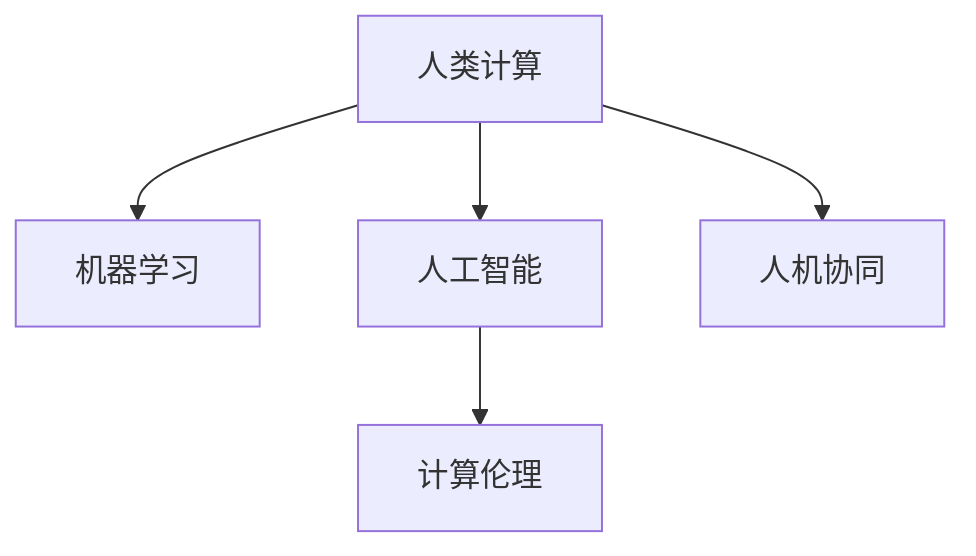

                 

## 1. 背景介绍

### 1.1 问题由来

随着数字时代的到来，计算技术已成为推动社会进步和经济发展的核心动力。计算技术不仅改变了传统的生产、生活和工作方式，更是深刻影响了人们的认知模式和价值观念。然而，在数字时代的浪潮中，如何更好地发挥人类计算的作用，实现人与机器的协同共进，成为亟待解决的重要问题。

### 1.2 问题核心关键点

人类计算的核心在于将人的智慧与计算能力相结合，实现对复杂问题的理解和解决。在数字时代，人类计算的作用主要体现在以下几个方面：

- **数据处理**：人类具有强大的数据分析和理解能力，能够对海量数据进行深度挖掘和分析，发现隐藏在数据背后的规律和模式。
- **创造性思维**：人类在创意、设计、艺术等领域具有无可比拟的优势，能够通过直觉和灵感创造出独特的解决方案。
- **道德和伦理**：人类在面对复杂社会问题时，具有高度的道德敏感性和伦理判断力，能够制定合理的政策和规则，引导技术健康发展。
- **教育与培训**：人类能够通过教育和培训，培养新一代计算人才，推动计算技术的持续创新和应用。

这些核心点共同构成了人类计算在数字时代的独特作用和价值，展示了其不可替代性。

### 1.3 问题研究意义

深入研究人类计算的关键作用，对于推动数字时代的发展，实现人与机器的和谐共生，具有重要意义：

- **促进技术创新**：通过挖掘和融合人类智慧，推动计算技术在更多领域的深入应用，催生新的技术突破。
- **提升社会福祉**：通过道德和伦理引导，确保计算技术的应用符合人类价值，促进社会公正和福祉。
- **推动教育转型**：培养新一代计算人才，提升全社会对计算技术的理解和应用能力。
- **构建智能生态**：实现人与机器的协同共进，构建更加智能和人性化的计算生态系统。

## 2. 核心概念与联系

### 2.1 核心概念概述

为了更好地理解人类计算在数字时代的作用，本节将介绍几个密切相关的核心概念：

- **人类计算(Human Computation)**：利用人类智慧和计算能力相结合，解决复杂问题的计算范式。人类计算强调人的直觉、创造力和道德判断在计算中的作用。
- **机器学习(Machine Learning)**：利用算法和模型自动分析和处理数据，从中提取规律和模式。机器学习通过算法自动化，提升数据处理效率。
- **人工智能(Artificial Intelligence)**：模拟人类智能，实现机器的感知、理解、推理和学习能力。人工智能强调机器的自主性和智能性。
- **计算伦理(Computational Ethics)**：在计算技术应用中，关注道德、隐私、安全等问题，确保技术的应用符合人类价值观和伦理规范。
- **人机协同(Human-Machine Collaboration)**：实现人与机器的协同共进，通过交互和反馈机制，增强计算系统的智能和人性化。

这些核心概念之间的逻辑关系可以通过以下Mermaid流程图来展示：



这个流程图展示了几大核心概念之间的关系：

1. 人类计算通过利用机器学习算法和人工智能技术，提升数据处理和问题解决能力。
2. 人工智能通过借鉴人类智慧，提高智能系统的创造性和适应性。
3. 计算伦理在人工智能和机器学习应用中发挥约束和指导作用，确保技术应用符合人类价值观。
4. 人机协同实现人与机器的深度融合，提升计算系统的智能水平和人性化体验。

## 3. 核心算法原理 & 具体操作步骤
### 3.1 算法原理概述

人类计算的核心在于将人的智慧与计算能力相结合，解决复杂问题的过程。在数字时代，这一过程通常包括以下几个步骤：

1. **数据收集与预处理**：通过传感器、网络等技术手段，收集和预处理海量数据，为后续分析和计算提供基础。
2. **数据建模与分析**：利用机器学习和人工智能技术，建立数学模型，对数据进行分析和挖掘，提取规律和模式。
3. **决策与优化**：基于分析结果，制定合理的决策方案，并进行优化和调整。
4. **结果验证与反馈**：对决策结果进行验证和评估，根据反馈进行迭代和改进。

这些步骤共同构成了一个完整的计算过程，实现了人与机器的协同共进。

### 3.2 算法步骤详解

以下将详细介绍人类计算的各个步骤：

**Step 1: 数据收集与预处理**

数据收集是计算的第一步，通常需要多种技术和手段：

- **传感器技术**：通过各种传感器（如温度、压力、声音、图像等）收集环境数据。
- **网络通信**：利用网络技术，从各种来源（如社交媒体、新闻网站、医疗记录等）获取数据。
- **人工智能**：使用自然语言处理和计算机视觉等技术，自动分析和提取数据中的有用信息。

数据预处理包括清洗、归一化和标准化等步骤，确保数据的质量和一致性：

- **数据清洗**：去除数据中的噪音和错误，确保数据的准确性和完整性。
- **数据归一化**：将不同来源和格式的数据转换为统一的格式，便于后续处理。
- **数据标准化**：根据具体应用场景，对数据进行标准化处理，确保一致性。

**Step 2: 数据建模与分析**

数据建模与分析是计算的核心步骤，通常包括以下方法：

- **统计分析**：利用统计学方法，分析数据的分布、相关性和趋势，提取规律和模式。
- **机器学习**：使用各种算法和模型，对数据进行训练和预测，发现隐藏在数据中的规律和模式。
- **深度学习**：利用神经网络模型，对数据进行深度学习和表示，提取高层次的特征和模式。

常用的机器学习和深度学习算法包括：

- **回归分析**：用于预测数值型数据，如房价预测、销售预测等。
- **分类算法**：用于分类问题，如垃圾邮件识别、疾病分类等。
- **聚类算法**：用于数据分组和分类，如市场细分、用户聚类等。
- **神经网络**：用于复杂的模式识别和图像处理，如图像识别、语音识别等。

**Step 3: 决策与优化**

决策与优化是计算的最终目标，通常包括以下方法：

- **决策树**：基于数据建模结果，构建决策树，进行决策和预测。
- **优化算法**：利用优化算法，如遗传算法、模拟退火等，进行决策和优化。
- **强化学习**：通过与环境的交互，学习最优策略，进行决策和优化。

决策与优化的关键在于确保结果的有效性和可解释性，通常需要进行多次迭代和调整：

- **结果验证**：通过实验和测试，验证决策结果的有效性和准确性。
- **结果优化**：根据验证结果，进行优化和调整，确保决策结果的可靠性。

**Step 4: 结果验证与反馈**

结果验证与反馈是计算的最后一个步骤，通常包括以下方法：

- **实验验证**：通过实验和测试，验证结果的有效性和可靠性。
- **反馈调整**：根据实验结果，进行反馈和调整，优化计算过程和决策结果。

通过不断的迭代和优化，确保计算结果的准确性和可靠性，提升计算系统的智能水平。

### 3.3 算法优缺点

人类计算的优点在于其综合性和创造性，能够将人的直觉和机器的计算能力相结合，解决复杂问题：

- **综合性和创造性**：人类计算能够结合多学科知识和经验，发现新的解决方案，解决复杂问题。
- **适应性和灵活性**：人类计算能够根据具体场景进行灵活调整和优化，适应不同的应用需求。

人类计算的缺点在于其主观性和不确定性，可能受到个人经验和偏见的影响：

- **主观性和不确定性**：人类计算可能受到个人经验和偏见的影响，导致结果的不确定性。
- **计算效率较低**：人类计算通常需要较长时间进行分析和决策，效率较低。

尽管存在这些缺点，人类计算仍然在许多复杂问题中发挥着不可替代的作用，特别是在需要人类直觉和创造力的领域。

### 3.4 算法应用领域

人类计算在各个领域都有广泛的应用，以下是几个典型的应用场景：

- **医疗领域**：通过人类计算，结合医学知识和经验，进行疾病诊断和治疗方案的制定。
- **金融领域**：通过人类计算，结合市场数据和金融知识，进行投资分析和风险评估。
- **环境领域**：通过人类计算，结合环境数据和科学知识，进行环境监测和治理。
- **城市管理**：通过人类计算，结合城市数据和规划知识，进行城市规划和管理。
- **教育领域**：通过人类计算，结合教育数据和教学经验，进行教育分析和教学设计。

## 4. 数学模型和公式 & 详细讲解 & 举例说明

### 4.1 数学模型构建

人类计算的核心在于对数据的建模和分析，通常使用以下数学模型：

- **回归模型**：用于预测数值型数据，形式为 $y = \theta^T x + \epsilon$，其中 $y$ 为输出，$x$ 为输入，$\theta$ 为模型参数，$\epsilon$ 为误差。
- **分类模型**：用于分类问题，形式为 $P(y|x) = \sigma(\theta^T x)$，其中 $P(y|x)$ 为条件概率，$\sigma$ 为激活函数，$\theta$ 为模型参数。
- **聚类模型**：用于数据分组和分类，形式为 $C(x) = \arg\min_C \sum_{x_i \in C} ||x_i - \mu_C||^2$，其中 $C$ 为数据分组，$\mu_C$ 为分组中心。

### 4.2 公式推导过程

以下将详细推导回归模型和分类模型的公式：

**回归模型**

回归模型用于预测数值型数据，形式为 $y = \theta^T x + \epsilon$。其中，$y$ 为输出，$x$ 为输入，$\theta$ 为模型参数，$\epsilon$ 为误差。

根据最小二乘法，模型参数 $\theta$ 的求解公式为：

$$
\theta = (X^T X)^{-1} X^T y
$$

其中，$X$ 为输入数据的特征矩阵，$y$ 为输出数据的向量。

**分类模型**

分类模型用于分类问题，形式为 $P(y|x) = \sigma(\theta^T x)$。其中，$P(y|x)$ 为条件概率，$\sigma$ 为激活函数，$\theta$ 为模型参数。

使用交叉熵损失函数 $\ell(y, \hat{y}) = -(y\log\hat{y} + (1-y)\log(1-\hat{y}))$，模型参数 $\theta$ 的求解公式为：

$$
\frac{\partial \ell(y, \hat{y})}{\partial \theta} = -(y-\hat{y})x
$$

其中，$y$ 为真实标签，$\hat{y}$ 为模型预测的概率。

### 4.3 案例分析与讲解

以下以金融领域为例，详细分析人类计算的应用：

**金融投资分析**

在金融投资分析中，人类计算结合市场数据和金融知识，进行投资分析和风险评估：

1. **数据收集与预处理**：通过网络爬虫和API接口，收集股票、债券、商品等金融市场数据。
2. **数据建模与分析**：使用回归模型和分类模型，分析市场趋势和风险，预测股票价格和波动。
3. **决策与优化**：结合人类经验和金融知识，制定投资策略，进行优化和调整。
4. **结果验证与反馈**：通过实验和测试，验证投资策略的有效性和可靠性，根据反馈进行调整。

通过人类计算，金融分析师能够从海量数据中提取有用的信息，制定合理的投资策略，实现资产的增值和风险的控制。

## 5. 项目实践：代码实例和详细解释说明

### 5.1 开发环境搭建

在进行人类计算实践前，我们需要准备好开发环境。以下是使用Python进行PyTorch开发的环境配置流程：

1. 安装Anaconda：从官网下载并安装Anaconda，用于创建独立的Python环境。

2. 创建并激活虚拟环境：
```bash
conda create -n pytorch-env python=3.8 
conda activate pytorch-env
```

3. 安装PyTorch：根据CUDA版本，从官网获取对应的安装命令。例如：
```bash
conda install pytorch torchvision torchaudio cudatoolkit=11.1 -c pytorch -c conda-forge
```

4. 安装TensorFlow：
```bash
pip install tensorflow
```

5. 安装TensorBoard：
```bash
pip install tensorboard
```

6. 安装Keras：
```bash
pip install keras
```

完成上述步骤后，即可在`pytorch-env`环境中开始人类计算的实践。

### 5.2 源代码详细实现

下面我们以金融投资分析为例，给出使用PyTorch进行回归分析的Python代码实现。

首先，定义回归模型：

```python
import torch
import torch.nn as nn

class LinearRegression(nn.Module):
    def __init__(self, input_dim):
        super(LinearRegression, self).__init__()
        self.linear = nn.Linear(input_dim, 1)
        
    def forward(self, x):
        return self.linear(x)
```

然后，定义数据处理函数：

```python
import pandas as pd
from sklearn.preprocessing import StandardScaler

def load_data(file_path):
    data = pd.read_csv(file_path)
    X = data[['features']].values
    y = data['target'].values
    scaler = StandardScaler()
    X = scaler.fit_transform(X)
    return X, y

def train_test_split(X, y, test_size=0.2):
    indices = np.arange(len(X))
    np.random.shuffle(indices)
    split_idx = int(len(indices) * test_size)
    X_train, X_test = X[indices[:split_idx]], X[indices[split_idx:]]
    y_train, y_test = y[indices[:split_idx]], y[indices[split_idx:]]
    return X_train, X_test, y_train, y_test
```

接着，定义训练和评估函数：

```python
import numpy as np
from sklearn.metrics import mean_squared_error

def train_epoch(model, optimizer, loss_fn, train_loader):
    model.train()
    train_loss = 0
    for data, target in train_loader:
        optimizer.zero_grad()
        output = model(data)
        loss = loss_fn(output, target)
        loss.backward()
        optimizer.step()
        train_loss += loss.item() * data.size(0)
    return train_loss / len(train_loader.dataset)

def evaluate(model, loss_fn, test_loader):
    model.eval()
    test_loss = 0
    with torch.no_grad():
        for data, target in test_loader:
            output = model(data)
            loss = loss_fn(output, target)
            test_loss += loss.item() * data.size(0)
    return test_loss / len(test_loader.dataset)

def mean_squared_error(y_true, y_pred):
    return np.sqrt(mean_squared_error(y_true.numpy(), y_pred.numpy()))
```

最后，启动训练流程并在测试集上评估：

```python
from torch.utils.data import DataLoader
from torch.optim import Adam

# 加载数据
X, y = load_data('finance.csv')

# 标准化数据
scaler = StandardScaler()
X_train, X_test, y_train, y_test = train_test_split(X, y, test_size=0.2)
X_train = scaler.fit_transform(X_train)
X_test = scaler.transform(X_test)

# 定义模型和优化器
input_dim = X_train.shape[1]
model = LinearRegression(input_dim)
optimizer = Adam(model.parameters(), lr=0.01)

# 定义损失函数
loss_fn = nn.MSELoss()

# 训练模型
train_loader = DataLoader(X_train, batch_size=32)
test_loader = DataLoader(X_test, batch_size=32)

epochs = 100

for epoch in range(epochs):
    train_loss = train_epoch(model, optimizer, loss_fn, train_loader)
    print(f'Epoch {epoch+1}, train loss: {train_loss:.4f}')
    
    test_loss = evaluate(model, loss_fn, test_loader)
    print(f'Epoch {epoch+1}, test loss: {test_loss:.4f}')

print(f'Mean squared error on test set: {mean_squared_error(y_test, model(X_test)).item():.4f}')
```

以上就是使用PyTorch进行金融投资分析的完整代码实现。可以看到，通过简单的线性回归模型，结合数据处理和训练函数，我们实现了对金融市场数据的回归分析。

### 5.3 代码解读与分析

让我们再详细解读一下关键代码的实现细节：

**load_data函数**：
- 加载CSV文件，获取训练和测试数据。
- 标准化数据，确保数据的一致性。

**train_test_split函数**：
- 将数据集分为训练集和测试集，确保模型评估的可靠性。

**train_epoch函数**：
- 定义训练函数，计算每个批次上的损失并更新模型参数。
- 使用Adam优化器，控制学习率。

**evaluate函数**：
- 定义评估函数，计算测试集上的损失。
- 使用均方误差作为评估指标，评估模型性能。

**mean_squared_error函数**：
- 计算均方误差，评估模型预测的准确性。

**训练流程**：
- 定义训练轮数，进行循环迭代。
- 每个epoch内，在训练集上训练模型，并在测试集上评估性能。
- 输出模型在训练集和测试集上的损失，评估模型效果。

可以看到，PyTorch提供了强大的计算图和自动微分功能，使得模型训练和评估变得简单高效。通过上述代码，我们可以快速实现复杂的计算过程，并对结果进行验证和评估。

## 6. 实际应用场景

### 6.1 金融投资分析

金融投资分析是人类计算在金融领域的重要应用之一。通过人类计算，金融分析师能够从海量市场数据中提取有用信息，制定合理的投资策略，实现资产增值和风险控制。

具体而言，金融投资分析通常包括以下步骤：

1. **数据收集与预处理**：通过网络爬虫和API接口，收集股票、债券、商品等金融市场数据。
2. **数据建模与分析**：使用回归模型和分类模型，分析市场趋势和风险，预测股票价格和波动。
3. **决策与优化**：结合人类经验和金融知识，制定投资策略，进行优化和调整。
4. **结果验证与反馈**：通过实验和测试，验证投资策略的有效性和可靠性，根据反馈进行调整。

通过人类计算，金融分析师能够从海量数据中提取有用的信息，制定合理的投资策略，实现资产增值和风险控制。

### 6.2 医疗诊断分析

医疗诊断分析是人类计算在医疗领域的重要应用之一。通过人类计算，医生能够结合医学知识和经验，进行疾病诊断和治疗方案的制定。

具体而言，医疗诊断分析通常包括以下步骤：

1. **数据收集与预处理**：通过医疗设备和技术手段，收集患者的生理数据、病历和医学影像等。
2. **数据建模与分析**：使用回归模型和分类模型，分析疾病的风险和趋势，预测疾病的发展和预后。
3. **决策与优化**：结合医学知识和经验，制定治疗方案，进行优化和调整。
4. **结果验证与反馈**：通过实验和测试，验证治疗方案的有效性和可靠性，根据反馈进行调整。

通过人类计算，医生能够从海量医疗数据中提取有用的信息，制定合理的治疗方案，实现疾病的有效控制和患者的康复。

### 6.3 城市交通管理

城市交通管理是人类计算在城市管理领域的重要应用之一。通过人类计算，交通管理部门能够结合城市数据和规划知识，进行交通流量预测和优化。

具体而言，城市交通管理通常包括以下步骤：

1. **数据收集与预处理**：通过传感器和监控设备，收集城市交通流量、天气、道路状况等数据。
2. **数据建模与分析**：使用回归模型和分类模型，分析交通流量和道路状况，预测交通拥堵情况。
3. **决策与优化**：结合交通规划知识，制定交通管理策略，进行优化和调整。
4. **结果验证与反馈**：通过实验和测试，验证交通管理策略的有效性和可靠性，根据反馈进行调整。

通过人类计算，交通管理部门能够从海量城市数据中提取有用的信息，制定合理的交通管理策略，实现交通流量的优化和城市的智能化管理。

## 7. 工具和资源推荐

### 7.1 学习资源推荐

为了帮助开发者系统掌握人类计算的理论基础和实践技巧，这里推荐一些优质的学习资源：

1. 《人类计算》系列博文：由大模型技术专家撰写，深入浅出地介绍了人类计算的原理、方法和应用。
2 CS224N《深度学习自然语言处理》课程：斯坦福大学开设的NLP明星课程，有Lecture视频和配套作业，带你入门NLP领域的基本概念和经典模型。
3 《人工智能导论》书籍：清华大学出版社出版的经典教材，全面介绍了人工智能的基本原理和应用。
4 《深度学习》书籍：深度学习领域的经典教材，涵盖了深度学习的基本原理和实践方法。
5 《机器学习实战》书籍：讲解机器学习算法和实践应用的经典教材，适合初学者入门。

通过对这些资源的学习实践，相信你一定能够快速掌握人类计算的精髓，并用于解决实际的计算问题。

### 7.2 开发工具推荐

高效的开发离不开优秀的工具支持。以下是几款用于人类计算开发的常用工具：

1. Python：Python是一种通用的高级编程语言，具有简洁明了的语法和丰富的库支持，适合进行各种计算和数据分析。
2. PyTorch：基于Python的开源深度学习框架，灵活动态的计算图，适合快速迭代研究。大部分预训练语言模型都有PyTorch版本的实现。
3. TensorFlow：由Google主导开发的开源深度学习框架，生产部署方便，适合大规模工程应用。同样有丰富的预训练语言模型资源。
4. Jupyter Notebook：交互式开发环境，支持Python、R等多种编程语言，方便代码的编写和分享。
5. Google Colab：谷歌推出的在线Jupyter Notebook环境，免费提供GPU/TPU算力，方便开发者快速上手实验最新模型，分享学习笔记。

合理利用这些工具，可以显著提升人类计算任务的开发效率，加快创新迭代的步伐。

### 7.3 相关论文推荐

人类计算在各个领域都有广泛的研究，以下是几篇奠基性的相关论文，推荐阅读：

1. 《人类计算的理论与实践》：介绍了人类计算的基本原理和方法，探讨了其在各个领域的应用。
2. 《机器学习与人类计算的结合》：讨论了机器学习和人类计算的结合方式，提出了一些具体的计算模型和方法。
3. 《人机协同的智能系统》：探讨了人机协同的智能系统的设计理念和实现方法，提出了一些具体的应用案例。
4. 《计算伦理与人工智能的社会影响》：讨论了计算伦理在人工智能和人类计算中的重要性和实现方法。
5. 《基于人类计算的复杂问题求解》：探讨了人类计算在复杂问题求解中的应用，提出了一些具体的计算模型和方法。

这些论文代表了大语言模型微调技术的发展脉络。通过学习这些前沿成果，可以帮助研究者把握学科前进方向，激发更多的创新灵感。

## 8. 总结：未来发展趋势与挑战

### 8.1 总结

本文对人类计算在数字时代的作用进行了全面系统的介绍。首先阐述了人类计算的研究背景和意义，明确了其综合性和创造性在计算中的独特作用。其次，从原理到实践，详细讲解了人类计算的各个步骤，给出了具体的应用示例。最后，通过学习资源和开发工具的推荐，帮助读者系统掌握人类计算的理论与实践。

通过本文的系统梳理，可以看到，人类计算在各个领域都有广泛的应用，展示了其不可替代的价值。在未来，人类计算将继续发挥重要作用，推动数字时代的进步。

### 8.2 未来发展趋势

展望未来，人类计算的发展将呈现以下几个趋势：

1. **计算技术的融合**：随着计算技术的不断进步，人类计算将与更多领域的技术进行融合，如物联网、大数据、云计算等。
2. **智能系统的普及**：随着计算技术的普及和应用，智能系统将逐渐渗透到各个领域，提升工作效率和决策质量。
3. **多学科知识的结合**：未来的人类计算将更多地结合多学科知识，进行跨领域的创新和应用。
4. **伦理和道德的关注**：在计算技术应用中，伦理和道德将成为重要的考量因素，确保技术应用符合人类价值观。
5. **计算能力的提升**：随着计算硬件和算法的不断进步，计算能力将持续提升，推动计算任务的高效完成。

### 8.3 面临的挑战

尽管人类计算在各个领域都有广泛的应用，但在迈向更加智能化、普适化应用的过程中，仍面临诸多挑战：

1. **数据隐私和安全**：随着数据的广泛应用，数据隐私和安全问题将成为关注的重点。如何在保障隐私的同时，实现数据的有效利用，是一个重要的挑战。
2. **计算资源的限制**：随着计算任务的复杂度增加，计算资源的限制将成为制约因素。如何提高计算效率，减少计算成本，是未来需要解决的问题。
3. **计算模型的可解释性**：在复杂的计算过程中，模型的可解释性将成为重要的考量因素。如何使计算模型更透明、更易于理解，是未来需要解决的问题。
4. **计算伦理和社会责任**：在计算技术应用中，伦理和社会责任问题将成为重要的关注点。如何确保技术应用符合人类价值观和社会责任，是一个重要的挑战。
5. **计算技术的协同**：在多学科技术的结合中，计算技术的协同问题将成为关键。如何实现不同技术之间的协同，提升整体效能，是未来需要解决的问题。

### 8.4 研究展望

面对未来计算领域的挑战，人类计算需要从以下几个方向进行深入研究：

1. **数据隐私和安全**：研究数据隐私保护技术，确保计算任务在保障隐私的前提下进行。
2. **计算资源优化**：研究高效计算算法和优化技术，提升计算效率，减少计算成本。
3. **计算模型可解释性**：研究计算模型的可解释性技术，提高模型的透明性和可理解性。
4. **计算伦理和社会责任**：研究计算伦理和社会责任理论，确保技术应用符合人类价值观和社会责任。
5. **计算技术的协同**：研究多学科技术的协同方法，提升整体效能，推动跨领域应用。

这些研究方向将进一步推动人类计算的发展，确保其在数字时代的广泛应用和持续进步。

## 9. 附录：常见问题与解答

**Q1：人类计算与机器学习有什么区别？**

A: 人类计算和机器学习都是计算技术的重要组成部分，但二者的侧重点不同：

- **人类计算**：强调人的直觉、创造力和道德判断在计算中的作用，具有综合性和创造性。
- **机器学习**：强调算法的自动化和模型的自主性，具有高效性和可扩展性。

人类计算和机器学习在计算任务中的应用互补，共同推动计算技术的进步。

**Q2：如何提高人类计算的效率？**

A: 提高人类计算效率的方法包括：

1. **优化算法**：研究高效的计算算法和模型，减少计算时间和资源消耗。
2. **并行计算**：利用多核处理器和分布式计算技术，提升计算效率。
3. **模型压缩**：研究模型压缩和优化技术，减少计算资源的占用。
4. **数据预处理**：优化数据预处理流程，减少数据预处理的时间和资源消耗。

通过这些方法，可以有效提高人类计算的效率，提升计算任务的处理能力。

**Q3：如何确保人类计算的可靠性？**

A: 确保人类计算可靠性的方法包括：

1. **数据质量控制**：确保数据的质量和完整性，减少数据噪音和错误。
2. **模型验证和优化**：通过实验和测试，验证模型的有效性和可靠性，进行模型优化和调整。
3. **结果验证与反馈**：对计算结果进行验证和评估，根据反馈进行调整，确保计算结果的准确性和可靠性。

通过这些方法，可以有效提高人类计算的可靠性，确保计算任务的正确性和可信度。

**Q4：人类计算在哪些领域有应用？**

A: 人类计算在各个领域都有广泛的应用，以下是几个典型的应用场景：

1. **金融投资分析**：结合金融知识和数据，进行投资分析和风险评估。
2. **医疗诊断分析**：结合医学知识和数据，进行疾病诊断和治疗方案的制定。
3. **城市交通管理**：结合交通数据和规划知识，进行交通流量预测和优化。
4. **教育领域**：结合教育数据和教学经验，进行教育分析和教学设计。
5. **环境保护**：结合环境数据和科学知识，进行环境监测和治理。

通过人类计算，各个领域能够从海量数据中提取有用的信息，制定合理的决策方案，提升工作效率和决策质量。

---

作者：禅与计算机程序设计艺术 / Zen and the Art of Computer Programming

