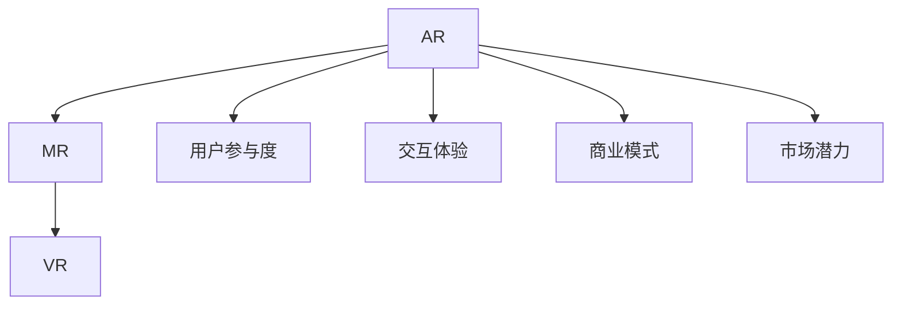
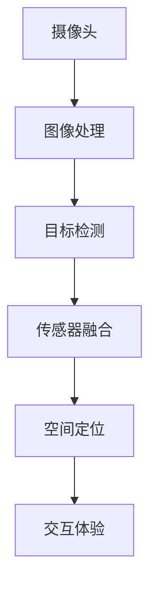

                 

# 增强现实创业：融合虚实的商业新机遇

> 关键词：增强现实(AR)，混合现实(MR)，虚拟现实(VR)，融合现实应用，商业创新，用户参与度，交互体验，商业模式，市场潜力

## 1. 背景介绍

### 1.1 问题由来

近年来，随着计算机视觉、传感器技术、人工智能等技术的飞速发展，增强现实（AR）技术逐渐走入大众视野。尤其是在疫情影响下，人们对于线上沟通和体验的需求愈发强烈，AR成为各行各业提升用户体验、拓展新业务的重要手段。据市场调研机构预测，2025年全球AR市场规模将达到1240亿美元，年均复合增长率约为41.2%[[1]]。

AR的魅力在于其能够将虚拟信息与现实世界融合，为人们提供沉浸式的交互体验。在电商、教育、医疗、旅游等多个领域，AR技术的创新应用正在改变传统业务模式，带来前所未有的商业机遇。然而，从技术到商业落地，AR创业项目面临着诸多挑战。如何在激烈的市场竞争中脱颖而出，实现商业成功，是每一个AR创业者需要深思的问题。

### 1.2 问题核心关键点

AR创业项目能否成功，关键在于以下几个核心要素：

- **用户体验**：优秀的用户体验是吸引用户、提升参与度的关键。AR技术需要提供直观、自然、无缝的交互方式，让用户感到自然舒适。
- **技术可靠性**：高精度的传感器、先进的算法、稳定的硬件是实现高质量AR体验的基础。创业公司需要在这些核心技术上不断突破，提升产品稳定性。
- **商业模式**：成功的AR应用需要明确的市场定位和盈利模式，找到与用户价值相匹配的商业模式，实现商业闭环。
- **数据与智能**：通过数据分析和智能算法优化用户体验，提供个性化推荐，增强用户粘性。
- **市场应用**：选择具有高市场潜力的行业和应用场景，如零售、教育、医疗、旅游等，进行精准布局。

这些关键点相互影响、相互促进，共同构成了AR创业项目的核心竞争力。

### 1.3 问题研究意义

研究AR创业的商业机遇和挑战，对于推动AR技术的广泛应用，拓展新型商业模式，提升用户体验，具有重要意义：

1. **技术引领市场**：通过深入探索AR技术在各个行业的应用，推动技术进步，为市场提供创新解决方案。
2. **优化用户体验**：基于用户体验的研究，帮助创业项目更准确地定位目标用户，设计更符合用户需求的产品功能。
3. **探索商业模式**：通过对AR应用场景和盈利模式的研究，发现潜在的商业机会，帮助创业项目建立稳定的收入模型。
4. **推动行业发展**：通过案例分析和市场趋势的深入分析，为整个行业提供决策参考，推动AR产业的良性发展。

## 2. 核心概念与联系

### 2.1 核心概念概述

为更好地理解AR创业的商业机遇，本文将介绍几个密切相关的核心概念：

- **增强现实（AR）**：通过将虚拟信息与现实世界融合，增强用户对现实世界的感知和互动。
- **混合现实（MR）**：将虚拟与现实混合，创建全新的三维交互空间。
- **虚拟现实（VR）**：完全沉浸式的虚拟世界体验，使用户无法区分虚拟与现实。
- **融合现实应用**：利用AR、VR、MR等技术，实现虚拟信息与现实世界的深度融合，提供创新体验。
- **用户参与度**：用户对AR产品的使用频率和时长，反映了产品受欢迎程度。
- **交互体验**：用户与AR产品的互动方式，包括手势识别、语音交互等。
- **商业模式**：AR应用的盈利模式，如直接销售、订阅服务、广告收入等。
- **市场潜力**：市场规模、用户增长率、市场渗透率等指标，反映了AR应用的潜力和发展空间。

这些核心概念之间的逻辑关系可以通过以下Mermaid流程图来展示：



这个流程图展示了AR、MR、VR之间的关系，以及它们与用户参与度、交互体验、商业模式和市场潜力等关键概念的联系。

## 3. 核心算法原理 & 具体操作步骤
### 3.1 算法原理概述

AR创业项目中，算法原理涉及计算机视觉、图像处理、传感器融合、人机交互等多个领域。其核心在于如何实现虚拟信息与现实世界的深度融合，为用户提供自然、直观、无缝的交互体验。

1. **计算机视觉**：通过摄像头捕捉现实世界的图像，使用深度学习算法进行目标检测、跟踪和识别。
2. **图像处理**：对捕捉的图像进行增强、降噪、滤波等处理，提升图像质量。
3. **传感器融合**：融合GPS、IMU、陀螺仪等多种传感器数据，实现高精度的空间定位和姿态估计。
4. **人机交互**：通过手势识别、语音交互等技术，实现自然交互，提升用户参与度。

这些算法技术相互结合，构成了AR应用的核心。其原理可以通过以下图示来展示：



### 3.2 算法步骤详解

AR创业项目涉及从算法到商业化的多个步骤，主要包括：

1. **市场调研**：了解目标市场的用户需求、竞争态势和趋势。
2. **技术研发**：基于市场调研结果，选择核心技术和硬件设备，进行算法研发和原型开发。
3. **产品设计**：设计用户界面和交互方式，确保产品易用性和用户参与度。
4. **商业模式设计**：明确产品的盈利模式，如销售、订阅、广告等，建立商业闭环。
5. **市场推广**：通过线上线下渠道，推广产品，吸引用户。
6. **用户反馈与优化**：收集用户反馈，持续优化产品功能和用户体验。
7. **市场拓展**：根据用户反馈和市场需求，拓展市场应用场景，扩大市场份额。

### 3.3 算法优缺点

AR创业项目的算法具有以下优点：

- **创新性**：通过融合虚拟信息与现实世界，提供全新的用户体验和交互方式。
- **广泛应用**：适用于电商、教育、医疗、旅游等多个行业，市场潜力巨大。
- **技术壁垒高**：算法技术复杂，开发难度大，有助于形成技术优势。

同时，也存在一些缺点：

- **技术门槛高**：需要高水平的算法和技术人才，对创业团队的技术能力要求较高。
- **硬件成本高**：高质量的传感器、AR眼镜等硬件设备成本较高，增加了产品成本。
- **市场竞争激烈**：AR市场潜在参与者众多，竞争激烈，需要通过技术创新和商业模式创新才能脱颖而出。
- **用户体验不完善**：部分AR应用存在延迟、眩晕、精度不足等问题，需要不断优化。

### 3.4 算法应用领域

AR技术在多个领域都有广泛应用，以下是几个典型的应用场景：

- **电商**：通过AR眼镜或手机应用，用户可以虚拟试穿、试用商品，提升购物体验。
- **教育**：利用AR技术进行虚拟实验、虚拟场景教学，提升教学效果。
- **医疗**：在手术过程中，医生可以虚拟规划手术路径，提升手术精准度。
- **旅游**：通过AR地图，用户可以虚拟游历景点，提升旅游体验。
- **建筑与设计**：设计师可以在虚拟环境中进行设计和施工，提高设计效率和质量。

这些应用场景展示了AR技术的强大潜力和广阔前景。

## 4. 数学模型和公式 & 详细讲解 & 举例说明

### 4.1 数学模型构建

AR创业项目中的算法模型涉及多个领域，包括计算机视觉、图像处理、传感器融合等。以下以目标检测为例，介绍其数学模型构建。

目标检测问题可以形式化为：给定一张图像 $I$ 和一组类别 $C$，目标是检测图像中属于 $C$ 类别的物体，并给出其在图像中的位置和大小。

其数学模型可以表示为：

$$
P(y|\text{data}) = \prod_{c \in C} P(y=c|\text{data})
$$

其中 $y$ 为模型对图像的预测结果，$\text{data}$ 为输入的图像数据，$P(y|\text{data})$ 为模型的预测概率。

### 4.2 公式推导过程

目标检测问题可以使用单阶段检测方法，如Faster R-CNN，也可以使用两阶段检测方法，如YOLO、SSD。这里以YOLO为例，推导其核心公式。

YOLO算法将图像分为多个网格，每个网格预测多个物体的边界框和类别概率。目标检测公式可以表示为：

$$
P(y|\text{data}) = \prod_{i=1}^{N} \prod_{j=1}^{M} P(y_{ij}|\text{data})
$$

其中 $N$ 和 $M$ 分别为网格数和物体数，$P(y_{ij}|\text{data})$ 表示第 $i$ 行第 $j$ 列网格预测的物体边界框和类别概率。

### 4.3 案例分析与讲解

以医疗手术模拟为例，分析AR技术在医疗领域的应用。

在手术过程中，医生可以佩戴AR眼镜，通过摄像头实时捕捉手术区域图像，并使用深度学习算法进行目标检测和跟踪。例如，利用YOLO算法检测手术区域中的关键部位，如血管、器官等，生成虚拟标识，辅助医生进行手术规划和操作。此外，医生还可以利用AR眼镜进行虚拟模拟手术，提升手术技能。

## 5. 项目实践：代码实例和详细解释说明
### 5.1 开发环境搭建

在进行AR项目开发前，需要准备好开发环境。以下是使用Python进行OpenCV和PyTorch开发的环境配置流程：

1. 安装Anaconda：从官网下载并安装Anaconda，用于创建独立的Python环境。

2. 创建并激活虚拟环境：
```bash
conda create -n ar-env python=3.8 
conda activate ar-env
```

3. 安装OpenCV和PyTorch：
```bash
pip install opencv-python torch torchvision torchaudio cudatoolkit=11.1 -c pytorch -c conda-forge
```

4. 安装PyARKit库：
```bash
pip install pyarkit
```

5. 安装相关工具包：
```bash
pip install numpy pandas scikit-image matplotlib tqdm jupyter notebook ipython
```

完成上述步骤后，即可在`ar-env`环境中开始AR项目开发。

### 5.2 源代码详细实现

这里我们以AR眼镜虚拟试穿应用为例，给出使用OpenCV和PyTorch实现AR眼镜的应用代码。

首先，定义AR眼镜的初始化函数：

```python
import cv2
import numpy as np
from pyar import PyARKit

def init_arKit():
    arKit = PyARKit()
    arKit.start()
    return arKit
```

然后，定义目标检测函数：

```python
from pyar import target detection

def detect_targets(image, model_path):
    target_detector = target detection.DetectionModel(model_path)
    targets = target_detector.detect(image)
    return targets
```

接着，定义AR眼镜渲染函数：

```python
def render_arKit(image, targets):
    arKit = init_arKit()
    arKit.add_objects(targets)
    arKit.update()
    return arKit.render()
```

最后，启动AR眼镜的虚拟试穿应用：

```python
from pyar import arKit

def main():
    model_path = "path/to/model"
    image_path = "path/to/image"
    
    image = cv2.imread(image_path)
    image_rgb = cv2.cvtColor(image, cv2.COLOR_BGR2RGB)
    targets = detect_targets(image_rgb, model_path)
    
    result = render_arKit(image_rgb, targets)
    cv2.imshow("AR Glasses", result)
    cv2.waitKey(0)
    cv2.destroyAllWindows()
```

完整代码实现如上所示，通过OpenCV读取图像，使用PyARKit进行目标检测和渲染，实现了AR眼镜的虚拟试穿应用。

### 5.3 代码解读与分析

让我们再详细解读一下关键代码的实现细节：

**init_arKit函数**：
- 初始化PyARKit对象，并启动AR捕捉。
- PyARKit是一个开源的AR眼镜应用框架，支持多平台设备。

**detect_targets函数**：
- 使用目标检测模型检测图像中的物体，返回检测结果。
- PyARKit支持多种目标检测模型，如YOLO、SSD等。

**render_arKit函数**：
- 将目标检测结果渲染到AR眼镜显示屏幕。
- PyARKit提供了丰富的渲染功能，支持透明度、颜色调整等效果。

**main函数**：
- 读取图像，进行目标检测和渲染，显示AR眼镜应用界面。
- 代码简洁高效，可以方便地集成到其他AR项目中。

## 6. 实际应用场景

### 6.1 智能购物

AR技术在电商领域的应用非常广泛，用户可以通过AR眼镜或手机应用进行虚拟试穿、试用商品，提升购物体验。例如，利用AR眼镜在商场中虚拟试穿衣物，用户可以即时看到不同颜色、款式的衣服效果，减少试穿次数，提升购物效率。

### 6.2 教育培训

AR技术在教育培训中的应用也越来越多。例如，利用AR眼镜进行虚拟实验、虚拟场景教学，提升教学效果。例如，在化学实验中，学生可以通过AR眼镜观察虚拟实验过程中的化学反应过程，增强理解。

### 6.3 医疗手术

AR技术在医疗领域也有广泛应用。例如，在手术过程中，医生可以佩戴AR眼镜，通过摄像头实时捕捉手术区域图像，并使用深度学习算法进行目标检测和跟踪。例如，利用YOLO算法检测手术区域中的关键部位，如血管、器官等，生成虚拟标识，辅助医生进行手术规划和操作。此外，医生还可以利用AR眼镜进行虚拟模拟手术，提升手术技能。

### 6.4 旅游观光

AR技术在旅游观光中的应用也非常丰富。例如，通过AR地图，用户可以虚拟游历景点，提升旅游体验。例如，在故宫博物馆中，用户可以通过AR眼镜实时看到虚拟导览，了解展品的详细信息和历史背景。

### 6.5 建筑与设计

AR技术在建筑与设计领域也有广泛应用。例如，设计师可以在虚拟环境中进行设计和施工，提高设计效率和质量。例如，在建筑设计中，设计师可以通过AR眼镜进行虚拟走图，了解建筑细节和效果。

## 7. 工具和资源推荐

### 7.1 学习资源推荐

为了帮助开发者系统掌握AR技术的应用和开发，这里推荐一些优质的学习资源：

1. **ARKit官方文档**：苹果公司开发的AR开发框架，提供了详细的API和示例代码。
2. **Google ARCore开发者文档**：谷歌公司开发的AR开发框架，支持多种平台设备。
3. **AR.js官方文档**：一个开源的AR框架，支持Web平台和移动平台。
4. **OpenCV官方文档**：计算机视觉领域最流行的开源库，提供了丰富的图像处理和目标检测功能。
5. **PyTorch官方文档**：深度学习领域最流行的开源库，提供了强大的模型训练和推理能力。

通过对这些资源的学习实践，相信你一定能够快速掌握AR技术的应用和开发，实现商业成功。

### 7.2 开发工具推荐

高效的开发离不开优秀的工具支持。以下是几款用于AR项目开发的常用工具：

1. **ARKit**：苹果公司开发的AR开发框架，支持多种平台设备，提供了丰富的AR功能和API。
2. **ARCore**：谷歌公司开发的AR开发框架，支持多种平台设备，提供了强大的AR功能和API。
3. **AR.js**：一个开源的AR框架，支持Web平台和移动平台，提供了丰富的AR功能和API。
4. **OpenCV**：计算机视觉领域最流行的开源库，提供了丰富的图像处理和目标检测功能。
5. **PyTorch**：深度学习领域最流行的开源库，提供了强大的模型训练和推理能力。
6. **Jupyter Notebook**：一个强大的交互式编程环境，支持Python和多种科学计算库。

合理利用这些工具，可以显著提升AR项目开发的效率，加速创新迭代的步伐。

### 7.3 相关论文推荐

AR技术的发展源于学界的持续研究。以下是几篇奠基性的相关论文，推荐阅读：

1. **AR-Core Reference**：谷歌公司开发的AR开发框架，提供了丰富的AR功能和API。
2. **ARKit Reference**：苹果公司开发的AR开发框架，提供了丰富的AR功能和API。
3. **Augmented Reality**：计算机视觉领域的经典论文，介绍了AR技术的基本原理和实现方法。
4. **AR-Kit开发指南**：苹果公司开发的AR开发框架，提供了详细的开发指南和示例代码。
5. **AR-Core开发指南**：谷歌公司开发的AR开发框架，提供了详细的开发指南和示例代码。

这些论文代表了大规模语言模型微调技术的发展脉络。通过学习这些前沿成果，可以帮助研究者把握学科前进方向，激发更多的创新灵感。

## 8. 总结：未来发展趋势与挑战

### 8.1 研究成果总结

本文对AR创业项目的商业机遇和挑战进行了全面系统的介绍。首先阐述了AR技术在电商、教育、医疗、旅游等多个领域的应用潜力，明确了AR创业项目的市场前景。其次，从原理到实践，详细讲解了AR技术的核心算法和操作步骤，给出了AR项目开发的完整代码实例。同时，本文还广泛探讨了AR技术在各行业的具体应用场景，展示了AR技术的强大潜力和广阔前景。最后，本文精选了AR技术的各类学习资源，力求为读者提供全方位的技术指引。

通过本文的系统梳理，可以看到，AR技术在商业领域具有广阔的应用前景，可以为用户提供沉浸式的交互体验，提升用户参与度和满意度。未来，随着AR技术的不断进步，其在各行各业的应用将更加广泛，为用户带来前所未有的创新体验。

### 8.2 未来发展趋势

展望未来，AR技术的发展趋势如下：

1. **技术进步**：随着深度学习、计算机视觉等技术的不断进步，AR技术的精度和性能将不断提升，为用户提供更优质的体验。
2. **市场扩展**：AR技术将在更多行业得到应用，如智能家居、游戏、娱乐等，市场规模将进一步扩大。
3. **应用多样化**：AR技术将更多应用于消费级市场，如智能眼镜、AR游戏等，用户体验将更加丰富。
4. **生态系统构建**：AR生态系统将逐步完善，产业链上下游的协同合作将更加紧密。
5. **标准化**：AR技术将逐步实现标准化，跨平台、跨设备的互操作性将增强。
6. **融合技术**：AR技术将与VR、MR、IoT等技术深度融合，实现更多创新应用。

以上趋势凸显了AR技术的广阔前景，未来将有更多行业和领域受益于AR技术的应用。

### 8.3 面临的挑战

尽管AR技术发展迅速，但面临诸多挑战：

1. **硬件成本高**：高质量的AR眼镜、传感器等硬件设备成本较高，增加了产品成本。
2. **技术门槛高**：AR技术涉及计算机视觉、图像处理、传感器融合等多个领域，技术门槛较高。
3. **市场竞争激烈**：AR市场潜在参与者众多，竞争激烈，需要通过技术创新和商业模式创新才能脱颖而出。
4. **用户体验不完善**：部分AR应用存在延迟、眩晕、精度不足等问题，需要不断优化。
5. **生态系统不完善**：AR生态系统尚未完全成熟，跨平台、跨设备的应用体验有待提升。
6. **隐私安全问题**：AR技术涉及用户隐私数据，隐私安全问题需要引起重视。

这些挑战需要业界共同努力，通过技术创新、产品优化、市场推广等多方面措施，推动AR技术在商业领域的应用和发展。

### 8.4 研究展望

面对AR技术面临的诸多挑战，未来的研究需要在以下几个方面寻求新的突破：

1. **硬件创新**：开发更轻便、成本更低的AR硬件设备，提升用户体验。
2. **技术优化**：优化目标检测、空间定位等关键算法，提高技术性能。
3. **生态系统构建**：推动AR生态系统的完善，促进产业链上下游的协同合作。
4. **隐私保护**：建立AR技术的隐私保护机制，保障用户数据安全。
5. **融合技术**：探索AR技术与VR、MR、IoT等技术的深度融合，实现更多创新应用。
6. **商业模式创新**：探索多样化的商业模式，如SaaS、订阅服务、按需付费等，实现商业成功。

这些研究方向的探索，必将引领AR技术迈向更高的台阶，为商业领域带来更多创新应用。

## 9. 附录：常见问题与解答

**Q1：AR技术在电商领域有哪些应用场景？**

A: AR技术在电商领域的应用场景非常广泛，例如：

1. 虚拟试穿：用户可以通过AR眼镜或手机应用进行虚拟试穿衣物，提升购物体验。
2. 虚拟试用：用户可以虚拟试用化妆品、电子产品等商品，减少退换货风险。
3. 产品展示：商家可以通过AR技术展示产品效果，吸引用户购买。
4. 个性化推荐：通过AR技术进行用户行为分析，提供个性化推荐，提升用户体验。

**Q2：如何选择合适的AR硬件设备？**

A: 选择AR硬件设备需要考虑以下几个因素：

1. 显示效果：分辨率、刷新率、对比度等指标，影响用户体验。
2. 硬件性能：处理速度、内存大小等，影响系统性能。
3. 便携性：重量、尺寸、电池续航等，影响使用方便性。
4. 应用场景：如商务会议、游戏娱乐等，不同应用场景选择不同设备。

**Q3：AR项目开发中如何优化用户体验？**

A: 优化用户体验是AR项目开发的重要目标，以下是几个关键措施：

1. 提升目标检测精度：通过优化算法和硬件，提高目标检测精度，减少漏检和误检。
2. 降低延迟和眩晕：优化系统性能，降低延迟和眩晕感，提升用户体验。
3. 提供自然的交互方式：使用手势识别、语音交互等技术，提供自然的交互方式，增强用户参与度。
4. 设计易用的用户界面：设计简洁、易用的用户界面，减少操作复杂度，提升用户满意度。

**Q4：AR项目开发中如何应对市场竞争？**

A: 应对市场竞争需要采取以下策略：

1. 技术创新：通过技术创新，提升产品性能和用户体验，形成技术优势。
2. 差异化定位：根据市场需求和用户特点，进行差异化定位，避免同质化竞争。
3. 营销推广：通过多渠道营销推广，提升品牌知名度，吸引用户关注。
4. 合作共赢：与其他技术、企业进行合作，共同开拓市场，形成生态效应。

这些措施可以帮助AR项目在市场竞争中立于不败之地。

**Q5：AR技术在医疗领域有哪些应用场景？**

A: AR技术在医疗领域的应用场景非常广泛，例如：

1. 手术辅助：通过AR眼镜进行手术规划和操作，提高手术精度。
2. 康复训练：通过AR技术进行虚拟康复训练，提升康复效果。
3. 医学教育：通过AR技术进行虚拟解剖、虚拟手术等教学，提升教学效果。
4. 医疗管理：通过AR技术进行医疗信息管理，提升工作效率。

这些应用场景展示了AR技术在医疗领域的强大潜力和广阔前景。

---

作者：禅与计算机程序设计艺术 / Zen and the Art of Computer Programming

