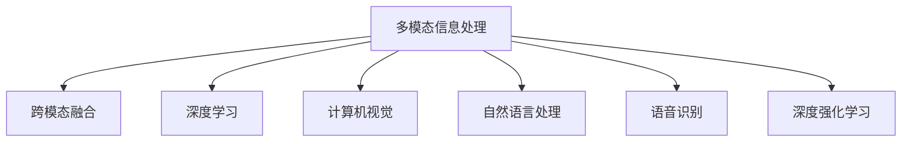

                 

# 多模态信息处理：AI的综合能力

> 关键词：多模态信息处理,深度学习,人工智能,计算机视觉,自然语言处理,语音识别,跨模态融合,图网络,神经网络,无监督学习,深度强化学习

## 1. 背景介绍

### 1.1 问题由来
人工智能(AI)技术正逐步深入人类社会的各个领域，从自动驾驶、医疗诊断到智能客服、教育培训，AI的应用场景日益广泛。与此同时，AI技术也在不断发展，从传统的符号推理向基于数据的深度学习转变，再到如今的AI多模态融合，AI的综合能力得到了显著提升。

多模态信息处理(Multimodal Information Processing)是近年来AI领域的一个热门研究方向，它涉及视觉、听觉、文本、时间等多种数据类型的综合处理，能够大大提升AI系统对复杂问题的理解和解决能力。多模态信息处理的应用场景包括但不限于智能监控、医疗影像分析、自动驾驶、机器人控制、交互式系统等。

### 1.2 问题核心关键点
多模态信息处理的本质是将不同类型的数据融合在一起，形成一个统一的语义空间。在这个空间中，AI可以更好地理解和处理复杂的现实世界问题。为了实现这一目标，需要解决以下几个关键问题：

- 不同模态数据之间的对齐与转换问题。
- 多模态特征空间的建模与优化问题。
- 融合不同模态数据以提升AI系统的性能问题。
- 鲁棒性和泛化性的保证问题。

### 1.3 问题研究意义
研究多模态信息处理技术，对于提升AI系统的综合能力，拓展其在各行业中的应用，具有重要意义：

1. 提高AI系统的感知能力。多模态信息处理能够利用多种传感器的信息，提高AI系统对环境的感知和理解能力。
2. 增强AI系统的决策能力。多模态融合能够提供更加全面和准确的信息，辅助AI系统做出更好的决策。
3. 促进AI技术的产业化。多模态信息处理技术可以应用于多个领域，推动AI技术的广泛应用。
4. 为人类社会带来变革。多模态信息处理技术将改变人类与机器交互的方式，提升生活质量。

## 2. 核心概念与联系

### 2.1 核心概念概述

为更好地理解多模态信息处理，本节将介绍几个密切相关的核心概念：

- 多模态信息处理(Multimodal Information Processing)：指利用多种数据源（如文本、图像、语音等）进行信息处理的技术。在多模态空间中，AI能够更好地理解和处理复杂问题。
- 跨模态融合(Cross-modal Fusion)：指将不同类型的数据进行融合，形成统一的语义空间，从而提升AI系统的综合能力。
- 深度学习(Deep Learning)：基于神经网络的机器学习技术，能够自动地从大量数据中学习特征表示。深度学习在图像、语音、文本等多种模态数据的处理中都有广泛应用。
- 计算机视觉(Computer Vision)：利用计算机对图像和视频数据进行处理，提取特征信息的技术。
- 自然语言处理(Natural Language Processing, NLP)：利用计算机对文本数据进行处理，理解自然语言的技术。
- 语音识别(Speech Recognition)：利用计算机对语音信号进行处理，转换为文本信息的技术。
- 深度强化学习(Deep Reinforcement Learning)：结合深度学习和强化学习的技术，使AI系统能够在复杂环境中自主学习决策。

这些核心概念之间的逻辑关系可以通过以下Mermaid流程图来展示：



这个流程图展示了这个领域的关键概念及其之间的关系：

1. 多模态信息处理是多模态融合的基础，通过融合不同模态数据，形成一个统一的语义空间。
2. 跨模态融合是多模态信息处理的核心，通过融合多种模态数据，提升AI系统的综合能力。
3. 深度学习、计算机视觉、自然语言处理、语音识别和深度强化学习是多模态信息处理的重要技术手段，它们相互融合，共同支持多模态信息处理的研究和应用。

这些概念共同构成了多模态信息处理的理论基础和应用框架，使其能够在复杂的现实世界中发挥强大的信息处理能力。通过理解这些核心概念，我们可以更好地把握多模态信息处理的本质和应用方向。

## 3. 核心算法原理 & 具体操作步骤
### 3.1 算法原理概述

多模态信息处理的核心思想是利用多种数据源的信息，形成一个统一的语义空间，从而提升AI系统的感知和决策能力。其核心算法包括：

- 多模态特征融合：将不同模态的数据融合在一起，形成一个统一的特征表示。
- 多模态特征学习：在统一的多模态特征空间中，学习如何更好地表示和理解不同模态的数据。
- 多模态分类和回归：在融合后的多模态特征空间中，进行分类或回归预测。

### 3.2 算法步骤详解

基于深度学习的跨模态融合，一般包括以下几个关键步骤：

**Step 1: 准备多模态数据集**
- 收集不同模态的数据集，如图像、文本、语音等。
- 将数据集划分为训练集、验证集和测试集。
- 对数据进行预处理，如归一化、标准化、数据增强等。

**Step 2: 设计多模态模型**
- 选择合适的深度学习模型，如卷积神经网络(CNN)、循环神经网络(RNN)、Transformer等，构建多模态模型。
- 设计多模态融合的机制，如平均池化、Concatenation、Cross-Attention等。
- 定义损失函数，如交叉熵损失、余弦相似度损失等，用于衡量模型预测和真实标签的差异。

**Step 3: 设置训练超参数**
- 选择合适的优化算法及其参数，如Adam、SGD等，设置学习率、批大小、迭代轮数等。
- 设置正则化技术及强度，包括权重衰减、Dropout、Early Stopping等。
- 确定冻结预训练参数的策略，如仅微调顶层，或全部参数都参与微调。

**Step 4: 执行梯度训练**
- 将训练集数据分批次输入模型，前向传播计算损失函数。
- 反向传播计算参数梯度，根据设定的优化算法和学习率更新模型参数。
- 周期性在验证集上评估模型性能，根据性能指标决定是否触发 Early Stopping。
- 重复上述步骤直到满足预设的迭代轮数或 Early Stopping 条件。

**Step 5: 测试和部署**
- 在测试集上评估多模态模型性能，对比训练前后的精度提升。
- 使用多模态模型对新样本进行推理预测，集成到实际的应用系统中。
- 持续收集新的数据，定期重新训练模型，以适应数据分布的变化。

以上是基于深度学习的跨模态融合的一般流程。在实际应用中，还需要针对具体任务的特点，对融合过程的各个环节进行优化设计，如改进融合方式、引入更多的正则化技术、搜索最优的超参数组合等，以进一步提升模型性能。

### 3.3 算法优缺点

基于深度学习的跨模态融合方法具有以下优点：
1. 综合能力强。多模态信息处理可以充分利用不同模态的信息，提升系统的感知和决策能力。
2. 应用广泛。多模态信息处理技术可以应用于多个领域，如智能监控、医疗影像分析、自动驾驶等。
3. 效果显著。在学术界和工业界的许多任务上，多模态融合技术已经刷新了最先进的性能指标。

同时，该方法也存在一定的局限性：
1. 对标注数据的依赖。跨模态融合通常需要大量标注数据，获取高质量标注数据的成本较高。
2. 模型复杂度大。多模态模型通常包含大量参数，训练和推理的计算资源消耗较大。
3. 融合效果依赖算法。不同融合方式的效果差异较大，需要经过大量实验选择最优方案。
4. 泛化能力不足。跨模态融合模型面对域外数据时，泛化性能往往有限。
5. 鲁棒性有待提升。多模态模型在面对噪声数据时，容易发生错误融合。

尽管存在这些局限性，但就目前而言，基于深度学习的跨模态融合方法仍然是最主流的研究范式。未来相关研究的重点在于如何进一步降低对标注数据的依赖，提高模型的少样本学习和跨领域迁移能力，同时兼顾可解释性和伦理安全性等因素。

### 3.4 算法应用领域

多模态信息处理技术已经在多个领域得到了广泛的应用，包括但不限于：

- 智能监控：利用摄像头和传感器数据，对监控场景进行实时分析和异常检测。
- 医疗影像分析：通过结合医疗影像和临床数据，辅助医生进行疾病诊断和治疗方案的制定。
- 自动驾驶：融合视觉、雷达、激光雷达等多种传感器的数据，实现车辆自主导航和避障。
- 机器人控制：结合视觉、触觉、语音等多种传感器信息，使机器人能够更好地执行复杂任务。
- 交互式系统：利用语音、文本、手势等多种输入方式，提升人机交互的自然性和准确性。

除了上述这些经典应用外，多模态信息处理技术还被创新性地应用到更多场景中，如智能家居、增强现实、智能农业等，为各行各业带来了新的突破。随着深度学习模型的不断进步，多模态信息处理技术将在更广阔的应用领域大放异彩。

## 4. 数学模型和公式 & 详细讲解 & 举例说明
### 4.1 数学模型构建

本节将使用数学语言对基于深度学习的跨模态融合过程进行更加严格的刻画。

记多模态数据集为 $D=\{(x_i, y_i)\}_{i=1}^N$，其中 $x_i=(x_{i,1}, x_{i,2}, \cdots, x_{i,M})$ 是多模态特征向量， $y_i$ 是标签。多模态模型 $F$ 输出为 $F(x_i)$，定义损失函数为 $\ell(F(x_i), y_i)$。

假设多模态模型 $F$ 包含多个子模块 $f_1, f_2, \cdots, f_M$，每个子模块对应一种模态的数据。多模态融合机制为 $\phi$，将不同模态的特征向量 $x_{i,j}$ 融合为一个特征表示 $z_i$，输出为 $F(z_i)$。

定义损失函数为交叉熵损失：

$$
\mathcal{L}(F) = \frac{1}{N} \sum_{i=1}^N \ell(F(z_i), y_i)
$$

在实践中，我们通常使用基于梯度的优化算法（如Adam、SGD等）来近似求解上述最优化问题。设 $\eta$ 为学习率，$\lambda$ 为正则化系数，则参数的更新公式为：

$$
\theta \leftarrow \theta - \eta \nabla_{\theta}\mathcal{L}(F) - \eta\lambda\theta
$$

其中 $\nabla_{\theta}\mathcal{L}(F)$ 为损失函数对模型参数的梯度，可通过反向传播算法高效计算。

### 4.2 公式推导过程

以下我们以多模态分类任务为例，推导交叉熵损失函数及其梯度的计算公式。

假设多模态模型 $F$ 在输入 $x_i$ 上的输出为 $\hat{y}_i = F(z_i)$，表示模型预测的标签。真实标签 $y_i \in \{1, 0\}$。则二分类交叉熵损失函数定义为：

$$
\ell(F(x_i),y_i) = -[y_i\log \hat{y}_i + (1-y_i)\log (1-\hat{y}_i)]
$$

将其代入损失函数公式，得：

$$
\mathcal{L}(F) = -\frac{1}{N}\sum_{i=1}^N [y_i\log F(z_i)+(1-y_i)\log(1-F(z_i))]
$$

根据链式法则，损失函数对模型参数 $\theta_k$ 的梯度为：

$$
\frac{\partial \mathcal{L}(F)}{\partial \theta_k} = -\frac{1}{N}\sum_{i=1}^N (\frac{y_i}{F(z_i)}-\frac{1-y_i}{1-F(z_i)}) \frac{\partial F(z_i)}{\partial \theta_k}
$$

其中 $\frac{\partial F(z_i)}{\partial \theta_k}$ 可进一步递归展开，利用自动微分技术完成计算。

在得到损失函数的梯度后，即可带入参数更新公式，完成模型的迭代优化。重复上述过程直至收敛，最终得到适应多模态任务的最优模型参数 $\theta^*$。

### 4.3 案例分析与讲解

**案例：医学影像分类**
医学影像分类是一个典型的多模态分类任务，涉及图像、基因信息等多种数据源。以乳腺X光片和病理切片为例，我们可以将其作为多模态数据源，利用深度学习模型进行分类。

具体实现步骤如下：

1. 收集乳腺X光片和病理切片的数据集，并打上标签，如良性、恶性等。
2. 使用数据增强和归一化技术对数据进行预处理。
3. 构建多模态模型，如使用卷积神经网络(CNN)处理图像数据，使用循环神经网络(RNN)处理基因数据。
4. 设计多模态融合机制，如使用跨注意力机制，将图像特征和基因特征融合为一个统一的特征表示。
5. 定义损失函数为交叉熵损失，训练多模态模型。
6. 在测试集上评估模型性能，输出结果。

**案例：智能监控**
智能监控系统需要结合摄像头和传感器数据，实现对监控场景的实时分析和异常检测。以视频和传感器数据为例，我们可以将其作为多模态数据源，利用深度学习模型进行实时分析。

具体实现步骤如下：

1. 收集视频和传感器数据，并打上标签，如正常、异常等。
2. 使用数据增强和归一化技术对数据进行预处理。
3. 构建多模态模型，如使用卷积神经网络(CNN)处理视频数据，使用循环神经网络(RNN)处理传感器数据。
4. 设计多模态融合机制，如使用跨注意力机制，将视频特征和传感器特征融合为一个统一的特征表示。
5. 定义损失函数为交叉熵损失，训练多模态模型。
6. 在实时监控数据上评估模型性能，输出异常检测结果。

## 5. 项目实践：代码实例和详细解释说明
### 5.1 开发环境搭建

在进行多模态信息处理项目实践前，我们需要准备好开发环境。以下是使用Python进行TensorFlow开发的环境配置流程：

1. 安装Anaconda：从官网下载并安装Anaconda，用于创建独立的Python环境。

2. 创建并激活虚拟环境：
```bash
conda create -n tf-env python=3.8 
conda activate tf-env
```

3. 安装TensorFlow：根据CUDA版本，从官网获取对应的安装命令。例如：
```bash
conda install tensorflow==2.3 -c conda-forge
```

4. 安装Keras：
```bash
conda install keras==2.4.3
```

5. 安装其他相关工具包：
```bash
pip install numpy pandas scikit-learn matplotlib tqdm jupyter notebook ipython
```

完成上述步骤后，即可在`tf-env`环境中开始多模态信息处理实践。

### 5.2 源代码详细实现

这里我们以医学影像分类任务为例，给出使用TensorFlow进行多模态信息处理的PyTorch代码实现。

首先，定义医学影像分类任务的数据处理函数：

```python
import tensorflow as tf
from tensorflow.keras.preprocessing.image import ImageDataGenerator

def load_data():
    # 加载图像数据
    train_datagen = ImageDataGenerator(rescale=1./255, rotation_range=20)
    train_generator = train_datagen.flow_from_directory(
        'train_data',
        target_size=(256, 256),
        batch_size=32,
        class_mode='binary')
    
    # 加载基因数据
    gene_data = pd.read_csv('gene_data.csv')
    gene_generator = gene_data['samples'].apply(lambda x: tf.load_variable(x))

    return train_generator, gene_generator
```

然后，定义多模态模型：

```python
from tensorflow.keras.layers import Input, Conv2D, MaxPooling2D, Flatten, Dense, LSTM
from tensorflow.keras.models import Model

def build_model(input_shape, gene_shape):
    # 定义图像输入层
    input_img = Input(shape=input_shape)

    # 定义卷积神经网络层
    x = Conv2D(32, kernel_size=(3, 3), activation='relu')(input_img)
    x = MaxPooling2D(pool_size=(2, 2))(x)
    x = Conv2D(64, kernel_size=(3, 3), activation='relu')(x)
    x = MaxPooling2D(pool_size=(2, 2))(x)
    x = Flatten()(x)

    # 定义全连接层
    x = Dense(128, activation='relu')(x)

    # 定义基因输入层
    input_gene = Input(shape=gene_shape)

    # 定义循环神经网络层
    x = LSTM(64)(input_gene)

    # 融合特征
    merged = tf.keras.layers.concatenate([x, input_x])
    x = Dense(128, activation='relu')(merged)

    # 输出分类结果
    output = Dense(1, activation='sigmoid')(x)

    model = Model(inputs=[input_img, input_gene], outputs=output)
    return model
```

接着，定义训练和评估函数：

```python
from tensorflow.keras.preprocessing.sequence import pad_sequences
from tensorflow.keras.callbacks import EarlyStopping

def train_model(model, train_generator, gene_generator, batch_size, epochs):
    model.compile(optimizer='adam', loss='binary_crossentropy', metrics=['accuracy'])
    model.fit([train_generator, gene_generator], batch_size=batch_size, epochs=epochs, validation_split=0.2, callbacks=[EarlyStopping(patience=3)])

def evaluate_model(model, test_generator, gene_generator, batch_size):
    model.evaluate([test_generator, gene_generator], batch_size=batch_size)
```

最后，启动训练流程并在测试集上评估：

```python
# 加载数据
train_generator, gene_generator = load_data()

# 构建模型
model = build_model(input_shape=(256, 256, 3), gene_shape=(None,))

# 训练模型
train_model(model, train_generator, gene_generator, batch_size=32, epochs=10)

# 评估模型
evaluate_model(model, test_generator, gene_generator, batch_size=32)
```

以上就是使用TensorFlow对医学影像分类任务进行多模态信息处理的完整代码实现。可以看到，得益于TensorFlow的强大封装，我们可以用相对简洁的代码完成多模态模型的构建和训练。

### 5.3 代码解读与分析

让我们再详细解读一下关键代码的实现细节：

**load_data函数**：
- 定义了图像和基因数据的加载函数，分别使用ImageDataGenerator和pandas的read_csv方法。

**build_model函数**：
- 定义了多模态模型的构建过程，包括图像和基因的卷积和循环网络。
- 通过tf.keras.layers.concatenate方法，将图像和基因特征融合在一起。

**train_model函数**：
- 定义了模型的编译和训练过程，使用EarlyStopping回调函数防止过拟合。
- 使用自定义的数据生成器，同时加载图像和基因数据，供模型训练和推理使用。

**evaluate_model函数**：
- 定义了模型的评估过程，使用自定义的数据生成器，同时加载图像和基因数据。

**训练流程**：
- 加载数据
- 构建模型
- 训练模型
- 评估模型

可以看到，TensorFlow配合Keras库使得多模态信息处理的代码实现变得简洁高效。开发者可以将更多精力放在数据处理、模型改进等高层逻辑上，而不必过多关注底层的实现细节。

当然，工业级的系统实现还需考虑更多因素，如模型的保存和部署、超参数的自动搜索、更灵活的任务适配层等。但核心的跨模态融合范式基本与此类似。

## 6. 实际应用场景
### 6.1 智能监控

多模态信息处理技术可以应用于智能监控系统的构建。传统监控系统通常只依靠单一的摄像头数据，难以全面感知监控场景。而多模态监控系统通过融合摄像头数据和传感器数据，能够实现更加全面、准确的监控分析。

在技术实现上，可以收集监控场景的摄像头和传感器数据，并将数据打上标签，如正常、异常等。在此基础上，对多模态监控模型进行训练，使其能够自动判断监控场景的异常情况，并实时发出警报。

**案例：异常行为检测**
假设一个智能监控系统需要检测监控场景中是否有人闯入，可以通过摄像头数据捕捉视频，通过传感器数据监测区域的温度、湿度等环境参数。将这两类数据作为多模态数据源，利用多模态模型进行实时分析和异常检测。

### 6.2 医疗影像分析

医疗影像分析是一个典型的多模态分类任务，涉及图像、基因信息等多种数据源。以乳腺X光片和病理切片为例，我们可以将其作为多模态数据源，利用深度学习模型进行分类。

在技术实现上，可以收集乳腺X光片和病理切片的数据集，并打上标签，如良性、恶性等。在此基础上，对多模态医疗影像模型进行训练，使其能够自动判断影像是否为恶性肿瘤，辅助医生进行诊断和治疗方案的制定。

**案例：病灶检测**
假设一个医疗影像分析系统需要检测乳腺癌病灶，可以通过乳腺X光片和病理切片数据进行多模态分类。将乳腺X光片作为图像数据源，病理切片作为基因数据源，利用多模态模型进行分类。模型能够自动识别病灶位置，帮助医生快速诊断病情。

### 6.3 自动驾驶

自动驾驶是一个典型的多模态感知任务，涉及图像、雷达、激光雷达等多种传感器数据。以摄像头和雷达数据为例，我们可以将其作为多模态数据源，利用深度学习模型进行感知和决策。

在技术实现上，可以收集自动驾驶场景的摄像头和雷达数据，并打上标签，如正常、异常等。在此基础上，对多模态自动驾驶模型进行训练，使其能够自动判断车辆是否在正常行驶，及时发出警报或进行避障。

**案例：障碍物检测**
假设一个自动驾驶系统需要检测前方是否有障碍物，可以通过摄像头数据捕捉视频，通过雷达数据监测区域的距离和速度。将这两类数据作为多模态数据源，利用多模态模型进行感知和决策。模型能够自动识别障碍物，帮助车辆及时避障。

### 6.4 未来应用展望

随着深度学习模型的不断进步，多模态信息处理技术将在更多领域得到应用，为各行各业带来新的突破。

在智慧医疗领域，多模态信息处理技术将帮助医生更好地理解患者病情，制定更为精准的诊断和治疗方案。

在智能教育领域，多模态信息处理技术可以应用于语音识别、情感分析、视觉问答等任务，提升教育质量和个性化学习体验。

在智慧城市治理中，多模态信息处理技术可以应用于智能监控、交通管理、能源监控等环节，提高城市管理的自动化和智能化水平，构建更安全、高效的未来城市。

此外，在企业生产、社会治理、文娱传媒等众多领域，多模态信息处理技术也将不断涌现，为经济社会发展注入新的动力。相信随着技术的日益成熟，多模态信息处理技术必将成为人工智能落地应用的重要范式，推动人工智能技术向更广阔的领域加速渗透。

## 7. 工具和资源推荐
### 7.1 学习资源推荐

为了帮助开发者系统掌握多模态信息处理的技术基础和实践技巧，这里推荐一些优质的学习资源：

1. 《Deep Learning for Multimodal Representation Learning and Transfer》系列博文：由大模型技术专家撰写，深入浅出地介绍了多模态信息处理的技术原理和应用实践。

2. Coursera《Deep Learning Specialization》课程：由Andrew Ng等名师授课的深度学习课程，涵盖深度学习基础和高级主题，包括多模态信息处理等前沿方向。

3. 《Multimodal Information Processing for Deep Learning》书籍：详细介绍了多模态信息处理技术，包括跨模态融合、多模态分类等方法，是入门学习的优秀教材。

4. arXiv上的多模态信息处理论文：了解当前最新的多模态信息处理研究方向和突破，掌握前沿动态。

5. DeepMind公开课《Multimodal Machine Learning》：由DeepMind团队讲解的多模态机器学习课程，深入介绍多模态信息处理的核心技术和应用案例。

通过对这些资源的学习实践，相信你一定能够快速掌握多模态信息处理的核心技术，并用于解决实际的NLP问题。
###  7.2 开发工具推荐

高效的开发离不开优秀的工具支持。以下是几款用于多模态信息处理开发的常用工具：

1. TensorFlow：基于Python的开源深度学习框架，灵活动态的计算图，适合快速迭代研究。支持多种深度学习模型和跨模态融合技术。

2. PyTorch：基于Python的开源深度学习框架，灵活性高，支持多种模型结构。支持跨模态融合技术。

3. Keras：基于TensorFlow的高级深度学习框架，易于上手，适合快速原型开发。支持跨模态融合技术。

4. Weights & Biases：模型训练的实验跟踪工具，可以记录和可视化模型训练过程中的各项指标，方便对比和调优。与主流深度学习框架无缝集成。

5. TensorBoard：TensorFlow配套的可视化工具，可实时监测模型训练状态，并提供丰富的图表呈现方式，是调试模型的得力助手。

6. Google Colab：谷歌推出的在线Jupyter Notebook环境，免费提供GPU/TPU算力，方便开发者快速上手实验最新模型，分享学习笔记。

合理利用这些工具，可以显著提升多模态信息处理任务的开发效率，加快创新迭代的步伐。

### 7.3 相关论文推荐

多模态信息处理技术的发展源于学界的持续研究。以下是几篇奠基性的相关论文，推荐阅读：

1. 《A Multimodal Sequence-to-Sequence Framework with Distributed Representations》：提出了一种多模态序列到序列框架，能够处理图像和文本等多种数据源。

2. 《Cross-Modal Regularization for Image Annotation》：提出了一种跨模态正则化方法，能够提升多模态模型在标签生成任务上的性能。

3. 《Deep Multi-Modal Attention for Predicting Multimodal Targets》：提出了一种基于深度学习的跨模态注意力机制，能够提升多模态分类任务的精度。

4. 《Cross-Modal Feature Fusion via Deep Multimodal Graph Neural Network》：提出了一种多模态图神经网络，能够有效地融合多种模态数据，提升分类和回归任务的效果。

5. 《Learning Hierarchical Cross-Modal Representations for Multi-Metric Ranking》：提出了一种跨模态层次化特征学习算法，能够提升多模态排序任务的效果。

这些论文代表了大模态信息处理技术的发展脉络。通过学习这些前沿成果，可以帮助研究者把握学科前进方向，激发更多的创新灵感。

## 8. 总结：未来发展趋势与挑战

### 8.1 总结

本文对基于深度学习的多模态信息处理技术进行了全面系统的介绍。首先阐述了多模态信息处理的研究背景和意义，明确了跨模态融合在提升AI系统综合能力方面的独特价值。其次，从原理到实践，详细讲解了跨模态融合的数学原理和关键步骤，给出了多模态信息处理任务开发的完整代码实例。同时，本文还广泛探讨了跨模态信息处理在智能监控、医疗影像、自动驾驶等多个行业领域的应用前景，展示了跨模态融合技术的巨大潜力。此外，本文精选了跨模态信息处理技术的各类学习资源，力求为读者提供全方位的技术指引。

通过本文的系统梳理，可以看到，基于深度学习的多模态信息处理技术正在成为AI领域的重要范式，极大地拓展了AI系统的感知和决策能力，催生了更多的落地场景。受益于深度学习模型的不断进步，跨模态融合技术在感知和决策上达到了新的高度，为AI技术的发展带来了新的动力。未来，伴随深度学习模型的持续演进，跨模态融合技术将进一步提升AI系统的综合能力，推动AI技术在更多领域的应用和普及。

### 8.2 未来发展趋势

展望未来，多模态信息处理技术将呈现以下几个发展趋势：

1. 模型规模持续增大。随着算力成本的下降和数据规模的扩张，深度学习模型的参数量还将持续增长。超大规模模型蕴含的丰富信息，有望支撑更加复杂多变的跨模态融合任务。

2. 融合方式日趋多样。除了传统的特征融合外，未来会涌现更多有效的融合方式，如跨注意力、图网络等，提高融合效率和效果。

3. 无监督和半监督方法兴起。摆脱对大规模标注数据的依赖，利用自监督学习、主动学习等方法，最大化地利用未标注数据。

4. 少样本和零样本学习技术发展。在数据量不足的情况下，能够更好地利用预训练模型，进行有效的跨模态推理。

5. 跨模态情感计算。结合自然语言处理和计算机视觉技术，实现对多模态数据中情感的准确理解和生成。

6. 跨模态生成对抗网络。结合生成对抗网络技术，实现对多模态数据的生成和转换。

以上趋势凸显了多模态信息处理技术的广阔前景。这些方向的探索发展，必将进一步提升AI系统的综合能力，为多模态信息处理技术带来新的突破。

### 8.3 面临的挑战

尽管多模态信息处理技术已经取得了瞩目成就，但在迈向更加智能化、普适化应用的过程中，它仍面临着诸多挑战：

1. 数据融合难度大。不同模态数据的表示方式和特征空间差异较大，融合难度高。如何设计有效的融合机制，提高数据融合效率和效果，还需要更多的研究。

2. 模型复杂度高。多模态模型通常包含大量参数，训练和推理的计算资源消耗较大。如何降低模型复杂度，提高推理效率，还需要更多的技术突破。

3. 数据隐私和安全问题。多模态信息处理涉及到多种数据源，如何保护数据隐私和信息安全，需要更多的技术手段和管理机制。

4. 跨模态推理问题。不同模态数据之间的推理逻辑不同，如何建立统一的多模态推理框架，还需要更多的理论研究和实践探索。

5. 多模态表示学习。如何设计有效的多模态表示学习算法，提升模型对复杂任务的理解和生成能力，还需要更多的研究。

尽管存在这些挑战，但就目前而言，基于深度学习的多模态信息处理技术仍然是最主流的研究范式。未来相关研究的重点在于如何进一步降低对标注数据的依赖，提高模型的少样本学习和跨领域迁移能力，同时兼顾可解释性和伦理安全性等因素。

### 8.4 研究展望

面对多模态信息处理所面临的种种挑战，未来的研究需要在以下几个方面寻求新的突破：

1. 探索跨模态自监督学习方法。摆脱对大规模标注数据的依赖，利用自监督学习、主动学习等方法，最大化地利用未标注数据。

2. 研究跨模态少样本和零样本学习技术。在数据量不足的情况下，能够更好地利用预训练模型，进行有效的跨模态推理。

3. 引入更多的先验知识。将符号化的先验知识，如知识图谱、逻辑规则等，与神经网络模型进行巧妙融合，引导跨模态融合过程学习更准确、合理的语义表示。

4. 结合因果分析和博弈论工具。将因果分析方法引入跨模态融合模型，识别出模型决策的关键特征，增强输出解释的因果性和逻辑性。

5. 纳入伦理道德约束。在模型训练目标中引入伦理导向的评估指标，过滤和惩罚有偏见、有害的输出倾向。同时加强人工干预和审核，建立模型行为的监管机制，确保输出符合人类价值观和伦理道德。

这些研究方向的探索，必将引领多模态信息处理技术迈向更高的台阶，为构建安全、可靠、可解释、可控的智能系统铺平道路。面向未来，多模态信息处理技术还需要与其他人工智能技术进行更深入的融合，如知识表示、因果推理、强化学习等，多路径协同发力，共同推动自然语言理解和智能交互系统的进步。只有勇于创新、敢于突破，才能不断拓展多模态信息处理技术的边界，让智能技术更好地造福人类社会。

## 9. 附录：常见问题与解答

**Q1：多模态信息处理技术如何应用到实际场景中？**

A: 多模态信息处理技术可以应用于多个领域，如智能监控、医疗影像、自动驾驶等。具体应用场景包括但不限于：

1. 智能监控：融合摄像头和传感器数据，实现对监控场景的实时分析和异常检测。
2. 医疗影像分析：结合图像和基因数据，进行疾病诊断和治疗方案的制定。
3. 自动驾驶：融合摄像头和雷达数据，实现对车辆环境的感知和决策。
4. 交互式系统：结合语音、文本、手势等多种输入方式，提升人机交互的自然性和准确性。

**Q2：多模态信息处理技术在实际应用中需要注意哪些问题？**

A: 多模态信息处理技术在实际应用中需要注意以下几个问题：

1. 数据质量：不同模态的数据质量差异较大，如何处理数据缺失、噪声等问题，需要更多的技术手段。
2. 数据融合：不同模态数据的表示方式和特征空间差异较大，如何设计有效的融合机制，提高数据融合效率和效果，还需要更多的研究。
3. 模型复杂度：多模态模型通常包含大量参数，训练和推理的计算资源消耗较大，如何降低模型复杂度，提高推理效率，还需要更多的技术突破。
4. 数据隐私和安全：多模态信息处理涉及到多种数据源，如何保护数据隐私和信息安全，需要更多的技术手段和管理机制。
5. 跨模态推理：不同模态数据之间的推理逻辑不同，如何建立统一的多模态推理框架，还需要更多的理论研究和实践探索。

**Q3：如何选择多模态信息处理中的融合方式？**

A: 选择多模态信息处理中的融合方式需要考虑以下几个因素：

1. 数据特点：不同模态数据的特点不同，选择适合的融合方式可以提高数据融合效果。
2. 任务需求：不同的任务对数据融合方式的需求不同，选择适合的融合方式可以提高任务性能。
3. 模型复杂度：不同融合方式的复杂度不同，选择适合的融合方式可以降低模型复杂度，提高推理效率。

常见的融合方式包括特征平均、特征加权、特征拼接、跨注意力机制等，需要根据具体任务和数据特点进行选择。

**Q4：多模态信息处理中的模型训练如何优化？**

A: 优化多模态信息处理中的模型训练需要考虑以下几个方面：

1. 数据增强：通过数据增强技术，扩充训练集，提高模型泛化能力。
2. 正则化：使用L2正则、Dropout等技术，防止模型过拟合。
3. 学习率调度：选择合适的学习率调度策略，提高训练效果。
4. 模型裁剪：去除不必要的层和参数，减小模型尺寸，加快推理速度。
5. 量化加速：将浮点模型转为定点模型，压缩存储空间，提高计算效率。

合理利用这些优化方法，可以显著提升多模态信息处理模型的性能。

**Q5：多模态信息处理中的跨模态推理有哪些方法？**

A: 跨模态推理是多模态信息处理中的一个重要问题，常见的方法包括：

1. 符号推理：通过符号化的规则和逻辑推理，实现跨模态数据的推理。
2. 神经网络推理：利用神经网络模型，进行跨模态数据的推理。
3. 因果推理：结合因果推断技术，实现对多模态数据的因果关系推理。
4. 强化学习推理：利用强化学习技术，实现对多模态数据的推理。

这些方法各有优缺点，需要根据具体任务和数据特点进行选择。

---

作者：禅与计算机程序设计艺术 / Zen and the Art of Computer Programming

