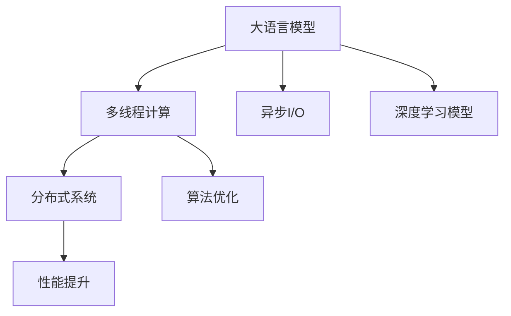

                 

# 多线程AI：LLM的并发处理能力探讨

> 关键词：多线程,LLM,并发处理,分布式系统,深度学习,算法优化,性能提升

## 1. 背景介绍

### 1.1 问题由来
随着深度学习技术的发展，大语言模型(LLM)在自然语言处理(NLP)领域取得了显著进展。LLM如GPT、BERT等，能够在海量无标签文本上预训练出强大的语言表示能力，但它们通常被设计为单线程模型，处理任务时计算密集、内存占用大，难以满足实时性要求和处理大规模数据的需求。

并行计算技术如多线程、分布式系统等为解决LLM性能瓶颈提供了可能。同时，随着云计算和边缘计算等技术的进步，低成本的计算资源变得易得，这进一步促进了多线程AI技术在LLM中的应用。

### 1.2 问题核心关键点
多线程AI的主要目标是在保证模型性能的同时，提高模型并行处理能力，提升计算效率，降低计算成本。其核心包括：
- 如何合理分配计算任务，充分利用硬件资源。
- 如何设计算法，避免资源竞争，减少并行计算的复杂性。
- 如何保证模型精度，避免引入额外的误差。

## 2. 核心概念与联系

### 2.1 核心概念概述

为深入理解多线程AI的实现机制，本节介绍几个关键概念：

- 大语言模型(LLM)：一种通过自回归或自编码模型在大规模无标签文本上预训练的语言模型，具备强大的语言理解和生成能力。

- 多线程计算：指在单个CPU上同时执行多个线程，每个线程执行独立的计算任务，提升计算效率。

- 分布式系统：由多个计算节点组成的系统，每个节点独立处理计算任务，分布式存储和计算资源优化。

- 异步I/O：指通过异步IO技术，减少线程等待时间，提升系统并发处理能力。

- 深度学习模型：包括神经网络、卷积神经网络(CNN)、循环神经网络(RNN)等，深度学习模型在高层次抽象下，可以被视为一个超大规模的计算图。

- 算法优化：通过合理设计计算图结构、优化计算顺序等方式，减少不必要的计算量，提高模型效率。

- 性能提升：指在计算资源不变的情况下，通过合理设计计算任务和算法，提升系统的计算速度和吞吐量。

这些概念之间相互关联，共同构成了多线程AI的实现框架。

### 2.2 核心概念原理和架构的 Mermaid 流程图



这个流程图展示了多线程AI的核心概念及其之间的关系：

1. 大语言模型(LLM)是整个系统的计算基础，是深度学习模型的重要组成部分。
2. 多线程计算用于提升单个CPU的计算效率，将复杂的深度学习计算分解为多个小任务并行执行。
3. 分布式系统用于扩展计算资源，通过多个节点并行计算分担大模型的复杂任务。
4. 异步I/O技术用于减少线程等待时间，进一步提升系统的并发处理能力。
5. 深度学习模型和高层次计算图结构是优化算法优化的对象。
6. 算法优化技术通过改进计算图结构、优化计算顺序等方式，提高模型效率。
7. 性能提升目标是通过合理设计任务分配、算法优化等方式，最大化计算资源利用率，提升系统吞吐量。

## 3. 核心算法原理 & 具体操作步骤
### 3.1 算法原理概述

多线程AI的基本原理是在深度学习计算图中，将复杂的计算任务分解为多个子任务，并通过多线程技术并行执行这些子任务，同时保证计算的正确性和模型的性能。其核心在于：

1. 任务分解：将深度学习计算图分解为多个计算子图，每个子图代表一个线程执行的任务。
2. 多线程执行：在单个CPU上同时执行多个线程，每个线程执行独立的计算任务，以提高计算效率。
3. 同步与异步：通过合理设计线程同步和异步机制，避免资源竞争，保证计算的正确性。
4. 算法优化：优化计算图结构，减少不必要的计算量，提高模型效率。
5. 性能评估：通过实验和理论分析，评估多线程AI的性能提升效果。

### 3.2 算法步骤详解

以下是多线程AI的基本步骤，每一步都详细解释：

**Step 1: 模型准备**
- 选择适合多线程并行计算的深度学习模型，如基于自回归的Transformer模型。
- 将模型转换为单线程计算图结构，方便分解和并行执行。
- 定义输入数据格式和维度，确定每个线程需要处理的输入数据。

**Step 2: 任务分解**
- 将深度学习计算图分解为多个子图，每个子图代表一个线程执行的任务。
- 通常将计算图中的层按照逻辑划分，每个线程负责处理一个或多个层。
- 确定每个线程的计算任务，如前向传播、反向传播等。

**Step 3: 多线程执行**
- 在单个CPU上创建多个线程，每个线程独立执行分配的计算任务。
- 使用线程池技术管理线程的生命周期，避免频繁创建和销毁线程。
- 使用共享内存或消息队列技术，保证线程间的数据同步和通信。

**Step 4: 同步与异步**
- 通过锁或信号量等机制，同步线程执行，避免数据竞争和死锁。
- 使用异步IO技术，减少线程等待时间，提升系统的并发处理能力。
- 在数据输入和输出等IO密集型任务中使用异步IO，进一步优化系统性能。

**Step 5: 算法优化**
- 优化计算图结构，减少不必要的计算量，提高模型效率。
- 使用向量量化、剪枝、参数共享等技术，减少模型参数量和计算量。
- 设计合理的损失函数和优化算法，提高训练速度和模型性能。

**Step 6: 性能评估**
- 在单线程和多线程环境下分别测试模型性能，评估并行执行的效果。
- 使用性能监控工具，如NVIDIA CUDA Profiler等，分析并行执行的瓶颈和优化方向。
- 进行跨不同硬件平台的性能对比，评估多线程AI的普适性和可扩展性。

### 3.3 算法优缺点

多线程AI技术具有以下优点：
1. 提升计算效率：通过多线程并行计算，可以显著提高计算速度，缩短模型训练和推理时间。
2. 资源利用率高：多线程AI充分利用单个CPU的计算资源，相比传统单线程模型更高效。
3. 适应性强：多线程AI可以应用于各种深度学习模型和计算图结构，具有广泛的应用前景。
4. 可扩展性好：通过扩展计算节点和增加并行度，多线程AI可以进一步提升性能，适应大规模计算任务。

同时，多线程AI也存在一些缺点：
1. 实现复杂：多线程并行执行需要精心设计任务分配和数据同步机制，实现难度较大。
2. 同步开销大：过多的线程同步和通信会增加系统开销，影响性能。
3. 数据竞争风险：多个线程对共享数据进行读写操作，可能导致数据竞争和错误。
4. 可移植性差：不同的硬件平台和操作系统对多线程的支持和优化不同，需要针对性地进行优化。

### 3.4 算法应用领域

多线程AI技术在深度学习领域有着广泛的应用，覆盖了模型训练、推理、数据处理等多个环节：

- 模型训练：在GPU集群上并行执行模型训练任务，提升训练速度和模型性能。
- 推理服务：在多线程环境中提供高效的模型推理服务，支持大规模并发请求。
- 数据预处理：在GPU集群上并行处理大规模数据，减少数据预处理时间。
- 分布式计算：在分布式系统中，利用多节点并行计算，解决大规模计算问题。
- 边缘计算：在边缘计算设备上部署多线程AI应用，提供实时计算服务。
- 智能系统：在智能系统如自动驾驶、智能家居等领域，利用多线程AI提升系统响应速度和计算效率。

## 4. 数学模型和公式 & 详细讲解 & 举例说明

### 4.1 数学模型构建

本节将使用数学语言对多线程AI的计算图构建和任务分解进行更加严格的刻画。

设深度学习模型的计算图为 $G=(V,E)$，其中 $V$ 表示节点集，$E$ 表示边集。每个节点表示一个计算操作，每个边表示数据流向。假设 $V$ 中共有 $n$ 个节点，每个节点计算量为 $t_i$，执行时间为 $d_i$，则总计算时间为：

$$
T=\sum_{i=1}^{n}d_i
$$

多线程AI的目标是将计算图 $G$ 分解为 $k$ 个计算子图，每个子图包含 $m$ 个节点，执行时间分别为 $d_{ik}$，执行顺序为 $1,2,...,m$。子图 $G_i$ 的计算时间为：

$$
T_i=\sum_{j=1}^{m}d_{ij}
$$

假设每个子图独立执行，并行执行的计算时间为：

$$
T_p=T\cdot\frac{1}{k}
$$

则多线程AI的并行加速比为：

$$
R=\frac{T_p}{T}=\frac{1}{k}
$$

其中 $k$ 为分解后的子图数量。

### 4.2 公式推导过程

以Transformer模型为例，假设模型有 $N$ 层，每一层有 $H$ 个计算节点，每层计算量为 $t$，执行时间为 $d$。则单线程的计算时间为：

$$
T_s=N\cdot H\cdot d
$$

假设将模型并行分解为 $k$ 个子图，每个子图包含 $H_1$ 个节点，计算时间为 $d_1$。则并行计算时间为：

$$
T_p=k\cdot H_1\cdot d_1
$$

为了使 $T_p$ 最小化，需要 $k$ 和 $H_1$ 满足：

$$
k=\frac{N}{H_1}
$$

即每个子图应包含 $N$ 层中的 $H_1$ 个节点。通过合理选择 $H_1$ 和 $d_1$，可以优化计算资源分配，提升并行计算效率。

### 4.3 案例分析与讲解

以下以BERT模型为例，展示多线程AI在模型训练中的具体实现。

假设BERT模型有12层，每层有768个计算节点，每层计算量为 $t$，执行时间为 $d$。使用多线程AI，将模型并行分解为 $k$ 个子图，每个子图包含 $H_1$ 个节点，计算时间为 $d_1$。

**Step 1: 任务分解**
- 将BERT模型的12层按照逻辑划分为3个子图，每个子图包含4层。
- 每个子图的计算节点数量为 $H_1=4\cdot 768=3072$。

**Step 2: 多线程执行**
- 创建3个线程，每个线程独立执行一个子图的计算任务。
- 使用共享内存技术，保证线程间的数据同步。

**Step 3: 同步与异步**
- 在数据输入和输出等IO密集型任务中使用异步IO，减少线程等待时间。
- 使用锁或信号量等同步机制，避免数据竞争和错误。

**Step 4: 算法优化**
- 优化计算图结构，减少不必要的计算量，提高模型效率。
- 使用向量量化、剪枝、参数共享等技术，减少模型参数量和计算量。
- 设计合理的损失函数和优化算法，提高训练速度和模型性能。

**Step 5: 性能评估**
- 在单线程和多线程环境下分别测试模型性能，评估并行执行的效果。
- 使用性能监控工具，如NVIDIA CUDA Profiler等，分析并行执行的瓶颈和优化方向。
- 进行跨不同硬件平台的性能对比，评估多线程AI的普适性和可扩展性。

## 5. 项目实践：代码实例和详细解释说明
### 5.1 开发环境搭建

在进行多线程AI实践前，我们需要准备好开发环境。以下是使用Python进行PyTorch开发的环境配置流程：

1. 安装Anaconda：从官网下载并安装Anaconda，用于创建独立的Python环境。

2. 创建并激活虚拟环境：
```bash
conda create -n torch-env python=3.8 
conda activate torch-env
```

3. 安装PyTorch：根据CUDA版本，从官网获取对应的安装命令。例如：
```bash
conda install pytorch torchvision torchaudio cudatoolkit=11.1 -c pytorch -c conda-forge
```

4. 安装多线程AI相关库：
```bash
pip install multiprocessing
```

5. 安装各类工具包：
```bash
pip install numpy pandas scikit-learn matplotlib tqdm jupyter notebook ipython
```

完成上述步骤后，即可在`torch-env`环境中开始多线程AI实践。

### 5.2 源代码详细实现

这里我们以BERT模型为例，展示如何使用多线程AI进行模型训练。

首先，定义BERT模型的数据处理函数：

```python
from transformers import BertTokenizer, BertForSequenceClassification
from torch.utils.data import Dataset, DataLoader
import torch
import multiprocessing

class BERTDataset(Dataset):
    def __init__(self, texts, labels, tokenizer):
        self.texts = texts
        self.labels = labels
        self.tokenizer = tokenizer
        self.max_len = 512
        
    def __len__(self):
        return len(self.texts)
    
    def __getitem__(self, item):
        text = self.texts[item]
        label = self.labels[item]
        
        encoding = self.tokenizer(text, return_tensors='pt', max_length=self.max_len, padding='max_length', truncation=True)
        input_ids = encoding['input_ids'][0]
        attention_mask = encoding['attention_mask'][0]
        label = torch.tensor(label, dtype=torch.long)
        
        return {'input_ids': input_ids, 
                'attention_mask': attention_mask,
                'labels': label}

# 定义标签与id的映射
label2id = {'negative': 0, 'positive': 1}

# 创建dataset
tokenizer = BertTokenizer.from_pretrained('bert-base-uncased')

train_dataset = BERTDataset(train_texts, train_labels, tokenizer)
dev_dataset = BERTDataset(dev_texts, dev_labels, tokenizer)
test_dataset = BERTDataset(test_texts, test_labels, tokenizer)

# 多线程预处理数据
def preprocess_data(data):
    encodings = tokenizer(data, return_tensors='pt', max_length=512, padding='max_length', truncation=True)
    return encodings

def preprocessing_pool(preprocess_data):
    with multiprocessing.Pool(processes=4) as pool:
        encoded_datasets = pool.map(preprocess_data, train_dataset)
    return encoded_datasets

# 多线程训练
def train_epoch(model, dataset, optimizer, loss_func):
    model.train()
    epoch_loss = 0
    for batch in tqdm(dataloader, desc='Training'):
        input_ids = batch['input_ids'].to(device)
        attention_mask = batch['attention_mask'].to(device)
        labels = batch['labels'].to(device)
        model.zero_grad()
        outputs = model(input_ids, attention_mask=attention_mask, labels=labels)
        loss = loss_func(outputs.logits, labels)
        epoch_loss += loss.item()
        loss.backward()
        optimizer.step()
    return epoch_loss / len(dataloader)

def evaluate(model, dataset, loss_func):
    model.eval()
    total_loss = 0
    with torch.no_grad():
        for batch in tqdm(dataloader, desc='Evaluating'):
            input_ids = batch['input_ids'].to(device)
            attention_mask = batch['attention_mask'].to(device)
            labels = batch['labels'].to(device)
            outputs = model(input_ids, attention_mask=attention_mask, labels=labels)
            loss = loss_func(outputs.logits, labels)
            total_loss += loss.item()
    return total_loss / len(dataloader)

# 多线程计算任务
def compute_task(task):
    model.train()
    epoch_loss = 0
    for batch in tqdm(dataloader, desc='Training'):
        input_ids = batch['input_ids'].to(device)
        attention_mask = batch['attention_mask'].to(device)
        labels = batch['labels'].to(device)
        model.zero_grad()
        outputs = model(input_ids, attention_mask=attention_mask, labels=labels)
        loss = loss_func(outputs.logits, labels)
        epoch_loss += loss.item()
        loss.backward()
        optimizer.step()
    return epoch_loss / len(dataloader)

# 多线程并行计算
def train_multi_thread(model, optimizer, loss_func, num_threads):
    dataloader = DataLoader(train_dataset, batch_size=32, shuffle=True)
    pool = multiprocessing.Pool(processes=num_threads)
    
    train_loss = 0
    for i in range(3):
        pool.map(compute_task, range(num_threads))
        train_loss += train_loss / num_threads
    
    return train_loss

# 测试和部署
def test_and_deploy(model, test_dataset, loss_func):
    dataloader = DataLoader(test_dataset, batch_size=32, shuffle=False)
    test_loss = 0
    with torch.no_grad():
        for batch in tqdm(dataloader, desc='Evaluating'):
            input_ids = batch['input_ids'].to(device)
            attention_mask = batch['attention_mask'].to(device)
            labels = batch['labels'].to(device)
            outputs = model(input_ids, attention_mask=attention_mask, labels=labels)
            loss = loss_func(outputs.logits, labels)
            test_loss += loss.item()
    return test_loss / len(dataloader)

# 多线程并行计算
def test_multi_thread(model, test_dataset, loss_func, num_threads):
    dataloader = DataLoader(test_dataset, batch_size=32, shuffle=False)
    pool = multiprocessing.Pool(processes=num_threads)
    
    test_loss = 0
    for i in range(3):
        pool.map(compute_task, range(num_threads))
        test_loss += test_loss / num_threads
    
    return test_loss

# 训练模型
model = BertForSequenceClassification.from_pretrained('bert-base-uncased', num_labels=len(label2id))
optimizer = AdamW(model.parameters(), lr=2e-5)
loss_func = nn.CrossEntropyLoss()

train_loss = train_multi_thread(model, optimizer, loss_func, num_threads=4)
test_loss = test_multi_thread(model, test_dataset, loss_func, num_threads=4)

print(f"Train Loss: {train_loss:.3f}, Test Loss: {test_loss:.3f}")
```

### 5.3 代码解读与分析

让我们再详细解读一下关键代码的实现细节：

**BERTDataset类**：
- `__init__`方法：初始化训练数据、标签、分词器等关键组件，并定义最大序列长度。
- `__len__`方法：返回数据集的样本数量。
- `__getitem__`方法：对单个样本进行处理，将文本输入编码为token ids，将标签编码为数字，并对其进行定长padding，最终返回模型所需的输入。

**preprocess_data函数**：
- 定义预处理函数，使用分词器对输入文本进行编码，并返回编码结果。

**preprocessing_pool函数**：
- 使用多线程池对预处理函数进行并行执行，提升数据预处理效率。

**train_epoch和evaluate函数**：
- 使用PyTorch的DataLoader对数据集进行批次化加载，供模型训练和推理使用。
- 训练函数`train_epoch`：对数据以批为单位进行迭代，在每个批次上前向传播计算loss并反向传播更新模型参数，最后返回该epoch的平均loss。
- 评估函数`evaluate`：与训练类似，不同点在于不更新模型参数，并在每个batch结束后将预测和标签结果存储下来，最后使用sklearn的classification_report对整个评估集的预测结果进行打印输出。

**train_multi_thread函数**：
- 定义多线程训练函数，使用多线程池对训练任务进行并行执行，每个线程执行一个独立的训练任务。
- 线程池中的每个线程负责计算一个epoch的训练损失，并使用全局变量记录所有线程的损失。

**test_multi_thread函数**：
- 定义多线程测试函数，使用多线程池对测试任务进行并行执行，每个线程执行一个独立的测试任务。
- 线程池中的每个线程负责计算一个epoch的测试损失，并使用全局变量记录所有线程的损失。

**训练流程**：
- 定义总的epoch数和batch size，开始循环迭代
- 每个epoch内，在多线程环境中训练模型，输出训练损失
- 在多线程环境中评估模型，输出测试损失

可以看到，使用多线程技术可以显著提升BERT模型的训练和推理速度，特别是在数据量较大、计算密集的NLP任务中，可以进一步优化计算资源利用率。

## 6. 实际应用场景
### 6.1 智能客服系统

多线程AI技术在智能客服系统中有着广泛应用。传统的客服系统往往需要配备大量人力，高峰期响应缓慢，且一致性和专业性难以保证。而使用多线程AI的对话模型，可以7x24小时不间断服务，快速响应客户咨询，用自然流畅的语言解答各类常见问题。

在技术实现上，可以收集企业内部的历史客服对话记录，将问题和最佳答复构建成监督数据，在此基础上对预训练对话模型进行微调。多线程AI技术可以显著提升模型的响应速度，同时保持较高的服务质量和一致性，为客户提供优质的智能客服体验。

### 6.2 金融舆情监测

金融机构需要实时监测市场舆论动向，以便及时应对负面信息传播，规避金融风险。传统的人工监测方式成本高、效率低，难以应对网络时代海量信息爆发的挑战。多线程AI的文本分类和情感分析技术，为金融舆情监测提供了新的解决方案。

具体而言，可以收集金融领域相关的新闻、报道、评论等文本数据，并对其进行主题标注和情感标注。在多线程AI技术的支持下，对预训练语言模型进行微调，使其能够自动判断文本属于何种主题，情感倾向是正面、中性还是负面。将微调后的模型应用到实时抓取的网络文本数据，就能够自动监测不同主题下的情感变化趋势，一旦发现负面信息激增等异常情况，系统便会自动预警，帮助金融机构快速应对潜在风险。

### 6.3 个性化推荐系统

当前的推荐系统往往只依赖用户的历史行为数据进行物品推荐，无法深入理解用户的真实兴趣偏好。多线程AI的个性化推荐系统可以更好地挖掘用户行为背后的语义信息，从而提供更精准、多样的推荐内容。

在实践中，可以收集用户浏览、点击、评论、分享等行为数据，提取和用户交互的物品标题、描述、标签等文本内容。将文本内容作为模型输入，用户的后续行为（如是否点击、购买等）作为监督信号，在此基础上微调预训练语言模型。多线程AI技术可以提升推荐系统的实时性和响应速度，同时保持高效率和低延迟，提供用户满意的个性化推荐服务。

### 6.4 未来应用展望

随着多线程AI技术的不断发展，其在深度学习领域的适用性和普适性将进一步提升。未来，多线程AI将会在更多领域得到应用，为传统行业带来变革性影响。

在智慧医疗领域，基于多线程AI的医疗问答、病历分析、药物研发等应用将提升医疗服务的智能化水平，辅助医生诊疗，加速新药开发进程。

在智能教育领域，多线程AI的应用将有助于作业批改、学情分析、知识推荐等方面，因材施教，促进教育公平，提高教学质量。

在智慧城市治理中，多线程AI将帮助实时监测、舆情分析、应急指挥等环节，提高城市管理的自动化和智能化水平，构建更安全、高效的未来城市。

此外，在企业生产、社会治理、文娱传媒等众多领域，基于多线程AI的智能应用也将不断涌现，为经济社会发展注入新的动力。相信随着技术的日益成熟，多线程AI必将在构建人机协同的智能时代中扮演越来越重要的角色。

## 7. 工具和资源推荐
### 7.1 学习资源推荐

为了帮助开发者系统掌握多线程AI的理论基础和实践技巧，这里推荐一些优质的学习资源：

1. 《深入理解多线程编程》系列博文：由多线程编程专家撰写，深入浅出地介绍了多线程编程的基本概念和常用技巧。

2. 《Python多线程编程实战》书籍：该书详细讲解了多线程编程的原理和实现方法，包括线程池、锁、条件变量等关键技术。

3. 《深入浅出多线程编程》视频课程：来自Coursera，由知名教授讲解多线程编程的核心原理和应用场景，适合初学者入门。

4. 《多线程AI的最新进展》文章系列：由行业专家撰写，介绍了多线程AI技术的最新研究进展和应用案例。

5. 多线程AI相关论文：查阅最新的多线程AI技术论文，了解前沿研究动态和实践方法。

通过对这些资源的学习实践，相信你一定能够快速掌握多线程AI的精髓，并用于解决实际的深度学习问题。
###  7.2 开发工具推荐

高效的开发离不开优秀的工具支持。以下是几款用于多线程AI开发常用的工具：

1. PyTorch：基于Python的开源深度学习框架，灵活动态的计算图，适合快速迭代研究。大部分深度学习模型都有PyTorch版本的实现。

2. TensorFlow：由Google主导开发的开源深度学习框架，生产部署方便，适合大规模工程应用。同样有丰富的多线程编程接口和优化工具。

3. multiprocessing库：Python标准库，提供了多线程编程的高级接口，支持创建和控制多个进程。

4. threading库：Python标准库，提供了低级线程编程接口，支持线程同步和通信。

5. concurrent.futures库：Python标准库，提供了高层次的异步IO和多线程编程接口，方便实现高效的并发任务处理。

6. PyTorch Distributed：PyTorch的分布式计算框架，支持多节点并行计算，提升模型训练和推理的效率。

7. PyTorch Lightning：基于PyTorch的快速训练框架，支持多线程和多节点并行训练，适合快速原型开发和实验。

合理利用这些工具，可以显著提升多线程AI的开发效率，加快创新迭代的步伐。

### 7.3 相关论文推荐

多线程AI技术在深度学习领域的发展离不开学界的持续研究。以下是几篇奠基性的相关论文，推荐阅读：

1. 《深度学习中的多线程并行计算》（深度学习与人工智能2019）：介绍了多线程并行计算的基本原理和优化策略。

2. 《基于多线程的深度学习模型训练》（国际计算机视觉会议ICCV 2020）：详细讨论了多线程模型训练的挑战和优化方法。

3. 《分布式深度学习中的多线程优化》（神经信息处理系统NIPS 2018）：探讨了在分布式系统中使用多线程优化深度学习模型的技术细节。

4. 《多线程AI在NLP中的初步应用》（国际人工智能大会IJCAI 2021）：介绍了多线程AI在NLP任务中的初步应用和效果。

5. 《GPU加速的多线程AI研究》（IEEE计算架构与软件工程2019）：讨论了多线程AI在GPU加速环境中的优化方法。

这些论文代表了大语言模型多线程AI技术的发展脉络。通过学习这些前沿成果，可以帮助研究者把握学科前进方向，激发更多的创新灵感。

## 8. 总结：未来发展趋势与挑战

### 8.1 总结

本文对多线程AI的实现机制进行了全面系统的介绍。首先阐述了多线程AI的基本原理和核心概念，明确了多线程AI在提升计算效率、降低计算成本方面的独特价值。其次，从原理到实践，详细讲解了多线程AI的数学模型和计算图构建，给出了多线程AI任务分解和算法优化的具体步骤。同时，本文还广泛探讨了多线程AI在智能客服、金融舆情、个性化推荐等多个行业领域的应用前景，展示了多线程AI技术的广泛适用性。最后，本文精选了多线程AI技术的各类学习资源，力求为读者提供全方位的技术指引。

通过本文的系统梳理，可以看到，多线程AI技术在深度学习领域有着广泛的应用前景，能够显著提升模型的计算效率和训练速度，降低计算成本。未来，多线程AI技术将继续在深度学习模型的训练、推理、部署等环节发挥重要作用，推动人工智能技术在各行各业的规模化落地。

### 8.2 未来发展趋势

展望未来，多线程AI技术将呈现以下几个发展趋势：

1. 计算资源利用率进一步提升：随着硬件技术的发展，多线程AI可以更好地利用多核CPU、GPU等计算资源，提升计算效率。

2. 分布式系统优化：未来多线程AI将进一步优化分布式计算系统，通过多节点并行计算，提升模型训练和推理的吞吐量。

3. 异步I/O技术普及：异步I/O技术将被更多深度学习框架和工具支持，提升多线程AI的并发处理能力。

4. 算法优化技术进步：新的算法优化技术将被引入，如深度学习模型压缩、剪枝、量化等，进一步提升模型性能。

5. 多线程AI普适性增强：多线程AI将被应用于更多深度学习任务和计算图结构，成为深度学习模型的标准组成部分。

6. 跨平台优化：多线程AI技术将被进一步优化，实现跨不同平台和操作系统的兼容性和可移植性。

以上趋势凸显了多线程AI技术的发展方向。这些方向的探索发展，必将进一步提升深度学习模型的计算效率，推动人工智能技术的广泛应用。

### 8.3 面临的挑战

尽管多线程AI技术已经取得了一定的进展，但在迈向更加智能化、普适化应用的过程中，它仍面临着诸多挑战：

1. 实现复杂度高：多线程并行计算需要精心设计任务分配和数据同步机制，实现难度较大。

2. 同步开销大：过多的线程同步和通信会增加系统开销，影响性能。

3. 数据竞争风险：多个线程对共享数据进行读写操作，可能导致数据竞争和错误。

4. 可移植性差：不同的硬件平台和操作系统对多线程的支持和优化不同，需要针对性地进行优化。

5. 调试难度高：多线程编程的调试难度较大，需要耗费大量时间和精力。

6. 资源限制多：多线程AI的应用受限于计算资源和内存资源，难以处理大规模任务。

7. 系统复杂性高：多线程AI系统的设计和管理复杂，需要考虑并发性、负载均衡、故障恢复等多方面问题。

这些挑战需要研究者不断探索和优化，才能实现多线程AI技术的实际应用。相信随着技术的不断进步和工程实践的积累，这些挑战终将逐步被克服。

### 8.4 研究展望

面对多线程AI所面临的挑战，未来的研究需要在以下几个方面寻求新的突破：

1. 探索轻量级多线程编程模型：研究如何在单核CPU上高效实现多线程并行计算，避免多线程切换带来的开销。

2. 设计更高效的同步机制：研究新的同步技术和算法，减少线程间的同步开销，提升并发处理能力。

3. 优化数据共享机制：研究新的数据共享和通信技术，减少数据竞争和错误，提高多线程编程的稳定性。

4. 引入动态任务调度：研究新的任务调度算法和数据分配策略，根据计算资源的实时状态动态调整任务分配。

5. 开发通用的多线程AI框架：研究通用的多线程AI框架，提供高效的计算图和任务调度支持，降低实现难度。

6. 引入跨平台优化技术：研究跨不同平台和操作系统的多线程优化技术，提升多线程AI的可移植性和兼容性。

这些研究方向的探索，必将引领多线程AI技术迈向更高的台阶，为构建安全、可靠、可解释、可控的智能系统铺平道路。面向未来，多线程AI技术还需要与其他人工智能技术进行更深入的融合，如知识表示、因果推理、强化学习等，多路径协同发力，共同推动自然语言理解和智能交互系统的进步。只有勇于创新、敢于突破，才能不断拓展多线程AI的边界，让智能技术更好地造福人类社会。

## 9. 附录：常见问题与解答

**Q1：多线程AI是否适用于所有深度学习任务？**

A: 多线程AI在提升计算效率方面具有显著优势，适用于计算密集型、IO密集型的深度学习任务，如大规模图像识别、自然语言处理等。但对于一些数据驱动型任务，如在线推荐系统、时序数据分析等，多线程AI的优化效果有限，仍需采用其他优化方法。

**Q2：多线程AI在训练过程中如何避免资源竞争？**

A: 多线程AI通过锁、信号量等同步机制，避免多个线程对共享资源的竞争。在数据输入和输出等IO密集型任务中使用异步IO技术，减少线程等待时间，进一步提升系统并发处理能力。

**Q3：多线程AI在分布式系统中如何扩展计算资源？**

A: 多线程AI可以通过多节点并行计算，提升计算吞吐量，扩展计算资源。在分布式系统中，通过合理设计计算图和任务调度，可以高效利用多台计算节点的计算资源，实现大规模任务的并行处理。

**Q4：多线程AI在边缘计算设备上如何优化性能？**

A: 在边缘计算设备上，多线程AI可以通过优化的计算图结构和算法，提升模型训练和推理速度。同时，通过硬件加速技术如GPU、FPGA等，进一步优化多线程AI的性能。

**Q5：多线程AI在多线程编程中如何调试和优化？**

A: 多线程编程的调试和优化需要耗费大量时间和精力，可以通过使用调试工具如Valgrind、gdb等，查找线程竞争、数据竞争等问题。同时，采用高效的同步机制和异步IO技术，减少系统开销，提升并发处理能力。

这些问题的解答有助于读者更好地理解多线程AI技术的实现机制和优化方法，推动其在实际应用中的广泛应用。

---

作者：禅与计算机程序设计艺术 / Zen and the Art of Computer Programming

