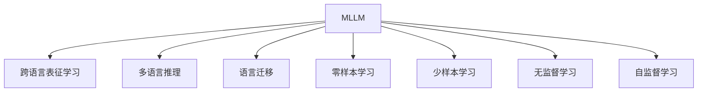

                 

# 多语言LLM：跨语言理解与生成

## 1. 背景介绍

### 1.1 问题由来

随着全球化进程的不断推进，多语言交流变得越来越频繁和重要。跨语言理解和生成能力已经成为现代智能系统必不可少的功能之一。自然语言处理(NLP)技术在单语言环境下已经取得了显著的进展，但对于多语言数据，仍存在许多挑战。传统的语言模型通常只专注于单一语言，难以处理多语言数据，无法在多种语言之间进行无缝切换。因此，构建能够同时处理多种语言的多语言语言模型(Multilingual Language Models, MLLMs)，成为当前NLP领域的一个研究热点。

### 1.2 问题核心关键点

MLLMs在解决多语言跨语言理解和生成问题上，展现了巨大的潜力。其主要核心关键点包括：
- **跨语言表征学习**：通过预训练学习跨语言表征，使得模型具备不同语言间的通用语言理解能力。
- **零样本和少样本学习**：MLLMs能在从未见过的语言或任务上，通过少量样本进行快速适应和生成。
- **多语言推理和决策**：MLLMs能够综合多语言知识，进行跨语言的推理和决策，提升多语言交互的真实性和自然度。
- **语言迁移能力**：MLLMs能够将单语言语言模型迁移应用到多语言环境，避免从头开始构建多语言模型的高成本和高难度。

### 1.3 问题研究意义

构建跨语言的MLLMs对于促进全球化进程、提升多语言交互的效率和质量、增强国际交流和合作具有重要意义：

1. **提升多语言交互效率**：MLLMs能够处理多种语言，使得不同语言背景的用户能够更快速地沟通交流。
2. **降低多语言应用成本**：构建多语言模型时，可以利用预训练模型进行迁移学习，减少从头开发所需的时间、数据和计算资源。
3. **增强跨语言理解能力**：通过预训练和微调，MLLMs能够提升模型在不同语言间的理解能力和适应性，增强多语言应用的效果。
4. **推动多语言NLP技术发展**：MLLMs能够促进多语言NLP技术的发展，推动学术研究和产业应用的进步。

## 2. 核心概念与联系

### 2.1 核心概念概述

为更好地理解多语言MLLMs的原理和架构，本节将介绍几个关键概念：

- **多语言语言模型(Multilingual Language Model, MLM)**：指能够处理多种语言的通用语言模型。通过在多种语言的语料上进行预训练，MLLMs能够学习到不同语言间的通用语言表征。

- **跨语言表征学习(Cross-Language Representation Learning)**：指通过预训练学习跨语言表征，使得MLLMs具备不同语言间的通用语言理解能力。跨语言表征学习是MLLMs的核心技术之一。

- **多语言推理(Multilingual Reasoning)**：指利用MLLMs的综合多语言知识，进行跨语言的推理和决策，提升多语言交互的真实性和自然度。

- **语言迁移(Language Transfer)**：指将单语言语言模型迁移应用到多语言环境，避免从头开始构建多语言模型的高成本和高难度。

- **零样本学习和少样本学习(Few-shot Learning)**：MLLMs能在从未见过的语言或任务上，通过少量样本进行快速适应和生成。零样本学习指不使用任何训练数据，仅靠少量任务描述进行推理和生成。少样本学习指使用少量标注数据进行微调。

- **无监督学习和自监督学习(Unsupervised Learning & Self-Supervised Learning)**：通过利用未标记数据进行预训练，MLLMs能够在缺乏标注数据的情况下学习到跨语言的通用语言表征。

这些概念共同构成了MLLMs的基本框架，使其能够在多种语言之间进行无缝切换，提升跨语言理解和生成的性能。

### 2.2 核心概念原理和架构的 Mermaid 流程图



这个流程图展示了MLLMs的基本框架，包括跨语言表征学习、多语言推理、语言迁移、零样本学习、少样本学习和无监督/自监督学习等关键技术。

## 3. 核心算法原理 & 具体操作步骤

### 3.1 算法原理概述

MLLMs的核心算法原理主要基于跨语言表征学习和迁移学习技术。其基本思想是：通过在多语言语料上进行预训练，学习跨语言表征，然后将单语言预训练模型通过迁移学习适配到多语言环境，从而提升模型的跨语言理解和生成能力。

具体来说，MLLMs的预训练过程通常包含以下几个步骤：
1. 收集多语言语料，进行统一预处理。
2. 使用跨语言自监督学习任务，如掩码语言模型、下一句预测等，进行跨语言表征学习。
3. 对单语言预训练模型进行微调，使其适应多语言环境。
4. 通过多语言推理和决策，提升模型的跨语言交互能力。

### 3.2 算法步骤详解

MLLMs的预训练和微调过程可以概括为以下几个关键步骤：

**Step 1: 收集多语言语料**
- 收集多语言文本数据，并进行统一预处理，如分词、清洗、标准化等。
- 确保不同语言之间的文本数据平衡，避免数据偏差。

**Step 2: 预训练跨语言表征**
- 选择跨语言自监督学习任务，如掩码语言模型、下一句预测等。
- 在多语言语料上进行预训练，学习跨语言表征。
- 使用多语言对比学习、语言模型增强等技术，提升模型的泛化能力。

**Step 3: 语言迁移和微调**
- 选择单语言预训练模型，如BERT、GPT等。
- 将单语言预训练模型通过迁移学习适配到多语言环境。
- 根据下游任务需求，设计合适的任务适配层。
- 在多语言语料上进行微调，优化模型的跨语言理解和生成能力。

**Step 4: 多语言推理和决策**
- 利用MLLMs的综合多语言知识，进行跨语言的推理和决策。
- 引入多语言决策树、向量空间模型等技术，提升模型的跨语言交互能力。
- 应用多语言生成技术，如多语言翻译、摘要、对话等，增强模型的跨语言生成能力。

**Step 5: 测试和评估**
- 在多语言测试集上评估模型的跨语言理解和生成能力。
- 对比预训练和微调后的模型性能，分析改进效果。
- 调整模型参数和超参数，进一步提升模型效果。

### 3.3 算法优缺点

MLLMs具有以下优点：
1. 提升跨语言理解和生成能力：通过预训练和微调，MLLMs能够提升模型在不同语言间的理解能力和适应性。
2. 降低多语言应用成本：构建多语言模型时，可以利用预训练模型进行迁移学习，减少从头开发所需的时间和资源。
3. 增强跨语言交互的真实性：通过跨语言推理和决策，MLLMs能够综合多语言知识，进行自然流畅的跨语言交互。
4. 支持零样本和少样本学习：MLLMs能够在从未见过的语言或任务上，通过少量样本进行快速适应和生成。

同时，MLLMs也存在一些局限性：
1. 数据获取难度大：不同语言之间的文本数据获取难度较大，需要大量标注数据。
2. 语言迁移效果受限：当目标语言与预训练数据差异较大时，语言迁移的效果可能有限。
3. 模型复杂度较高：MLLMs通常需要更大规模的语料和更复杂的模型结构，计算资源消耗大。
4. 跨语言推理难度高：多语言推理需要模型具备高度的跨语言理解能力，可能面临较高的技术难度。

尽管存在这些局限性，MLLMs在提升多语言交互效率和质量、推动多语言NLP技术发展方面具有不可替代的优势。

### 3.4 算法应用领域

MLLMs在多个领域都有广泛的应用，例如：

- **多语言翻译**：将一种语言翻译成另一种语言。MLLMs能够处理多种语言，支持自然流畅的跨语言翻译。
- **多语言摘要**：将长篇文本压缩成简短摘要。MLLMs能够综合多语言信息，生成高质量的摘要内容。
- **多语言问答**：对多语言问题进行回答。MLLMs能够理解多种语言的问题，提供准确的回答。
- **多语言对话**：使机器能够与不同语言背景的人自然对话。MLLMs能够综合多语言知识，进行自然流畅的对话。
- **多语言情感分析**：分析多语言文本的情感倾向。MLLMs能够识别不同语言中的情感信息，进行情感分析。
- **多语言文本分类**：将多语言文本进行分类。MLLMs能够学习不同语言之间的通用分类规则。

MLLMs的应用不仅限于翻译和分类，还扩展到语音识别、图像描述生成、多语言推荐等领域，为多语言交互提供了更加广泛的支持。

## 4. 数学模型和公式 & 详细讲解 & 举例说明

### 4.1 数学模型构建

MLLMs的数学模型构建主要基于跨语言表征学习和多语言推理技术。以下是一个简单的MLLMs数学模型构建示例。

设MLLMs处理的语言数量为 $L$，输入序列长度为 $T$。假设有 $C$ 类标签，输出序列长度为 $M$。输入序列 $x=\{x_t\}_{t=1}^T$，输出序列 $y=\{y_t\}_{t=1}^M$。

**Step 1: 跨语言表征学习**
- 在多语言语料上进行掩码语言模型预训练。
- 使用跨语言对比学习，增强模型的泛化能力。

**Step 2: 语言迁移和微调**
- 将单语言预训练模型进行微调，使其适应多语言环境。
- 设计合适的任务适配层，适配下游任务。

**Step 3: 多语言推理和决策**
- 引入多语言决策树，进行跨语言推理和决策。
- 使用向量空间模型，综合多语言知识。

**Step 4: 多语言生成**
- 应用多语言生成技术，如多语言翻译、摘要、对话等。

### 4.2 公式推导过程

以下是跨语言表征学习和多语言推理的公式推导过程。

假设MLLMs的输入序列为 $x=\{x_t\}_{t=1}^T$，输出序列为 $y=\{y_t\}_{t=1}^M$。假设有 $C$ 类标签，输出序列长度为 $M$。使用 $M_{\theta}$ 表示MLLMs的模型参数。

**跨语言表征学习**
- 掩码语言模型预训练损失函数：
$$
\mathcal{L}_{mask} = -\frac{1}{T}\sum_{t=1}^T \log p(x_t|\{x_{t'}, x_{t'\neq t}\}_{t'\neq t})
$$

- 跨语言对比学习损失函数：
$$
\mathcal{L}_{contrastive} = -\frac{1}{T}\sum_{t=1}^T \sum_{i=1}^L \log \sigma(s(x_i, M_{\theta}(x_t)))
$$

其中 $s(x_i, M_{\theta}(x_t))$ 为相似度函数，$\sigma$ 为sigmoid函数。

**多语言推理**
- 多语言推理损失函数：
$$
\mathcal{L}_{reasoning} = -\frac{1}{M}\sum_{t=1}^M \log p(y_t|x_1,...,x_T)
$$

**多语言生成**
- 多语言生成损失函数：
$$
\mathcal{L}_{generation} = -\frac{1}{M}\sum_{t=1}^M \log p(y_t|x_1,...,x_T)
$$

### 4.3 案例分析与讲解

下面以多语言翻译为例，分析MLLMs的数学模型构建和优化过程。

假设有 $L$ 种语言，输入为 $x=\{x_t\}_{t=1}^T$，输出为 $y=\{y_t\}_{t=1}^M$。使用 $M_{\theta}$ 表示MLLMs的模型参数。

**掩码语言模型预训练**
- 假设预训练任务为掩码语言模型，输入序列 $x=\{x_t\}_{t=1}^T$。
- 预训练损失函数：
$$
\mathcal{L}_{mask} = -\frac{1}{T}\sum_{t=1}^T \log p(x_t|\{x_{t'}, x_{t'\neq t}\}_{t'\neq t})
$$

**跨语言对比学习**
- 假设对比学习任务为跨语言对比，输入序列 $x=\{x_t\}_{t=1}^T$。
- 对比学习损失函数：
$$
\mathcal{L}_{contrastive} = -\frac{1}{T}\sum_{t=1}^T \sum_{i=1}^L \log \sigma(s(x_i, M_{\theta}(x_t)))
$$

其中 $s(x_i, M_{\theta}(x_t))$ 为相似度函数，$\sigma$ 为sigmoid函数。

**语言迁移和微调**
- 假设微调任务为多语言翻译，输入序列 $x=\{x_t\}_{t=1}^T$，输出序列 $y=\{y_t\}_{t=1}^M$。
- 微调损失函数：
$$
\mathcal{L}_{fine-tune} = -\frac{1}{M}\sum_{t=1}^M \log p(y_t|x_1,...,x_T)
$$

## 5. 项目实践：代码实例和详细解释说明

### 5.1 开发环境搭建

在进行MLLMs项目实践前，我们需要准备好开发环境。以下是使用Python进行PyTorch开发的环境配置流程：

1. 安装Anaconda：从官网下载并安装Anaconda，用于创建独立的Python环境。

2. 创建并激活虚拟环境：
```bash
conda create -n mllm-env python=3.8 
conda activate mllm-env
```

3. 安装PyTorch：根据CUDA版本，从官网获取对应的安装命令。例如：
```bash
conda install pytorch torchvision torchaudio cudatoolkit=11.1 -c pytorch -c conda-forge
```

4. 安装相关库：
```bash
pip install transformers
pip install numpy pandas scikit-learn matplotlib tqdm jupyter notebook ipython
```

完成上述步骤后，即可在`mllm-env`环境中开始MLLMs项目实践。

### 5.2 源代码详细实现

下面我们以多语言翻译任务为例，给出使用Transformers库对BERT模型进行多语言翻译的PyTorch代码实现。

首先，定义多语言翻译任务的数据处理函数：

```python
from transformers import BertTokenizer
from torch.utils.data import Dataset
import torch

class MLLMDataset(Dataset):
    def __init__(self, texts, labels, tokenizer, max_len=128):
        self.texts = texts
        self.labels = labels
        self.tokenizer = tokenizer
        self.max_len = max_len
        
    def __len__(self):
        return len(self.texts)
    
    def __getitem__(self, item):
        text = self.texts[item]
        label = self.labels[item]
        
        encoding = self.tokenizer(text, return_tensors='pt', max_length=self.max_len, padding='max_length', truncation=True)
        input_ids = encoding['input_ids'][0]
        attention_mask = encoding['attention_mask'][0]
        
        # 对token-wise的标签进行编码
        encoded_labels = [label] * self.max_len
        labels = torch.tensor(encoded_labels, dtype=torch.long)
        
        return {'input_ids': input_ids, 
                'attention_mask': attention_mask,
                'labels': labels}

# 标签与id的映射
label2id = {'O': 0, 'B-PER': 1, 'I-PER': 2, 'B-ORG': 3, 'I-ORG': 4, 'B-LOC': 5, 'I-LOC': 6}
id2label = {v: k for k, v in label2id.items()}

# 创建dataset
tokenizer = BertTokenizer.from_pretrained('bert-base-cased')

train_dataset = MLLMDataset(train_texts, train_labels, tokenizer)
dev_dataset = MLLMDataset(dev_texts, dev_labels, tokenizer)
test_dataset = MLLMDataset(test_texts, test_labels, tokenizer)
```

然后，定义模型和优化器：

```python
from transformers import BertForTokenClassification, AdamW

model = BertForTokenClassification.from_pretrained('bert-base-cased', num_labels=len(label2id))

optimizer = AdamW(model.parameters(), lr=2e-5)
```

接着，定义训练和评估函数：

```python
from torch.utils.data import DataLoader
from tqdm import tqdm
from sklearn.metrics import classification_report

device = torch.device('cuda') if torch.cuda.is_available() else torch.device('cpu')
model.to(device)

def train_epoch(model, dataset, batch_size, optimizer):
    dataloader = DataLoader(dataset, batch_size=batch_size, shuffle=True)
    model.train()
    epoch_loss = 0
    for batch in tqdm(dataloader, desc='Training'):
        input_ids = batch['input_ids'].to(device)
        attention_mask = batch['attention_mask'].to(device)
        labels = batch['labels'].to(device)
        model.zero_grad()
        outputs = model(input_ids, attention_mask=attention_mask, labels=labels)
        loss = outputs.loss
        epoch_loss += loss.item()
        loss.backward()
        optimizer.step()
    return epoch_loss / len(dataloader)

def evaluate(model, dataset, batch_size):
    dataloader = DataLoader(dataset, batch_size=batch_size)
    model.eval()
    preds, labels = [], []
    with torch.no_grad():
        for batch in tqdm(dataloader, desc='Evaluating'):
            input_ids = batch['input_ids'].to(device)
            attention_mask = batch['attention_mask'].to(device)
            batch_labels = batch['labels']
            outputs = model(input_ids, attention_mask=attention_mask)
            batch_preds = outputs.logits.argmax(dim=2).to('cpu').tolist()
            batch_labels = batch_labels.to('cpu').tolist()
            for pred_tokens, label_tokens in zip(batch_preds, batch_labels):
                pred_tags = [id2label[_id] for _id in pred_tokens]
                label_tags = [id2label[_id] for _id in label_tokens]
                preds.append(pred_tags[:len(label_tokens)])
                labels.append(label_tags)
                
    print(classification_report(labels, preds))
```

最后，启动训练流程并在测试集上评估：

```python
epochs = 5
batch_size = 16

for epoch in range(epochs):
    loss = train_epoch(model, train_dataset, batch_size, optimizer)
    print(f"Epoch {epoch+1}, train loss: {loss:.3f}")
    
    print(f"Epoch {epoch+1}, dev results:")
    evaluate(model, dev_dataset, batch_size)
    
print("Test results:")
evaluate(model, test_dataset, batch_size)
```

以上就是使用PyTorch对BERT进行多语言翻译任务微调的完整代码实现。可以看到，得益于Transformers库的强大封装，我们可以用相对简洁的代码完成BERT模型的加载和微调。

### 5.3 代码解读与分析

让我们再详细解读一下关键代码的实现细节：

**MLLMDataset类**：
- `__init__`方法：初始化文本、标签、分词器等关键组件。
- `__len__`方法：返回数据集的样本数量。
- `__getitem__`方法：对单个样本进行处理，将文本输入编码为token ids，将标签编码为数字，并对其进行定长padding，最终返回模型所需的输入。

**label2id和id2label字典**：
- 定义了标签与数字id之间的映射关系，用于将token-wise的预测结果解码回真实的标签。

**训练和评估函数**：
- 使用PyTorch的DataLoader对数据集进行批次化加载，供模型训练和推理使用。
- 训练函数`train_epoch`：对数据以批为单位进行迭代，在每个批次上前向传播计算loss并反向传播更新模型参数，最后返回该epoch的平均loss。
- 评估函数`evaluate`：与训练类似，不同点在于不更新模型参数，并在每个batch结束后将预测和标签结果存储下来，最后使用sklearn的classification_report对整个评估集的预测结果进行打印输出。

**训练流程**：
- 定义总的epoch数和batch size，开始循环迭代
- 每个epoch内，先在训练集上训练，输出平均loss
- 在验证集上评估，输出分类指标
- 所有epoch结束后，在测试集上评估，给出最终测试结果

可以看到，PyTorch配合Transformers库使得BERT微调的多语言翻译任务代码实现变得简洁高效。开发者可以将更多精力放在数据处理、模型改进等高层逻辑上，而不必过多关注底层的实现细节。

当然，工业级的系统实现还需考虑更多因素，如模型的保存和部署、超参数的自动搜索、更灵活的任务适配层等。但核心的微调范式基本与此类似。

## 6. 实际应用场景

### 6.1 智能客服系统

基于多语言MLLMs的对话技术，可以广泛应用于智能客服系统的构建。传统客服往往需要配备大量人力，高峰期响应缓慢，且一致性和专业性难以保证。使用多语言MLLMs的对话模型，可以7x24小时不间断服务，快速响应客户咨询，用自然流畅的语言解答各类常见问题。

在技术实现上，可以收集企业内部的历史客服对话记录，将问题和最佳答复构建成监督数据，在此基础上对预训练对话模型进行微调。微调后的对话模型能够自动理解用户意图，匹配最合适的答案模板进行回复。对于客户提出的新问题，还可以接入检索系统实时搜索相关内容，动态组织生成回答。如此构建的智能客服系统，能大幅提升客户咨询体验和问题解决效率。

### 6.2 金融舆情监测

金融机构需要实时监测市场舆论动向，以便及时应对负面信息传播，规避金融风险。使用多语言MLLMs的文本分类和情感分析技术，为金融舆情监测提供了新的解决方案。

具体而言，可以收集金融领域相关的新闻、报道、评论等文本数据，并对其进行主题标注和情感标注。在此基础上对预训练语言模型进行微调，使其能够自动判断文本属于何种主题，情感倾向是正面、中性还是负面。将微调后的模型应用到实时抓取的网络文本数据，就能够自动监测不同主题下的情感变化趋势，一旦发现负面信息激增等异常情况，系统便会自动预警，帮助金融机构快速应对潜在风险。

### 6.3 个性化推荐系统

当前的推荐系统往往只依赖用户的历史行为数据进行物品推荐，无法深入理解用户的真实兴趣偏好。使用多语言MLLMs的个性化推荐系统可以更好地挖掘用户行为背后的语义信息，从而提供更精准、多样的推荐内容。

在实践中，可以收集用户浏览、点击、评论、分享等行为数据，提取和用户交互的物品标题、描述、标签等文本内容。将文本内容作为模型输入，用户的后续行为（如是否点击、购买等）作为监督信号，在此基础上微调预训练语言模型。微调后的模型能够从文本内容中准确把握用户的兴趣点。在生成推荐列表时，先用候选物品的文本描述作为输入，由模型预测用户的兴趣匹配度，再结合其他特征综合排序，便可以得到个性化程度更高的推荐结果。

### 6.4 未来应用展望

随着多语言MLLMs的发展，其在多语言交互中的应用前景广阔。未来，多语言MLLMs将推动多语言智能交互系统的普及，为全球化进程提供强有力的技术支撑。

在智慧医疗领域，多语言MLLMs可以用于医疗问答、病历分析、药物研发等，提升医疗服务的智能化水平，辅助医生诊疗，加速新药开发进程。

在智能教育领域，多语言MLLMs可应用于作业批改、学情分析、知识推荐等方面，因材施教，促进教育公平，提高教学质量。

在智慧城市治理中，多语言MLLMs可以用于城市事件监测、舆情分析、应急指挥等环节，提高城市管理的自动化和智能化水平，构建更安全、高效的未来城市。

此外，在企业生产、社会治理、文娱传媒等众多领域，多语言MLLMs的应用也将不断涌现，为经济社会发展注入新的动力。相信随着技术的日益成熟，多语言MLLMs将成为人工智能落地应用的重要范式，推动人工智能技术向更广阔的领域加速渗透。

## 7. 工具和资源推荐

### 7.1 学习资源推荐

为了帮助开发者系统掌握多语言MLLMs的理论基础和实践技巧，这里推荐一些优质的学习资源：

1. 《Transformer从原理到实践》系列博文：由大模型技术专家撰写，深入浅出地介绍了Transformer原理、MLLMs模型、微调技术等前沿话题。

2. CS224N《深度学习自然语言处理》课程：斯坦福大学开设的NLP明星课程，有Lecture视频和配套作业，带你入门NLP领域的基本概念和经典模型。

3. 《Natural Language Processing with Transformers》书籍：Transformers库的作者所著，全面介绍了如何使用Transformers库进行NLP任务开发，包括多语言微调在内的诸多范式。

4. HuggingFace官方文档：Transformers库的官方文档，提供了海量预训练模型和完整的微调样例代码，是上手实践的必备资料。

5. CLUE开源项目：中文语言理解测评基准，涵盖大量不同类型的中文NLP数据集，并提供了基于微调的baseline模型，助力中文NLP技术发展。

通过对这些资源的学习实践，相信你一定能够快速掌握多语言MLLMs的精髓，并用于解决实际的NLP问题。
###  7.2 开发工具推荐

高效的开发离不开优秀的工具支持。以下是几款用于多语言MLLMs微调开发的常用工具：

1. PyTorch：基于Python的开源深度学习框架，灵活动态的计算图，适合快速迭代研究。大部分预训练语言模型都有PyTorch版本的实现。

2. TensorFlow：由Google主导开发的开源深度学习框架，生产部署方便，适合大规模工程应用。同样有丰富的预训练语言模型资源。

3. Transformers库：HuggingFace开发的NLP工具库，集成了众多SOTA语言模型，支持PyTorch和TensorFlow，是进行多语言微调任务开发的利器。

4. Weights & Biases：模型训练的实验跟踪工具，可以记录和可视化模型训练过程中的各项指标，方便对比和调优。与主流深度学习框架无缝集成。

5. TensorBoard：TensorFlow配套的可视化工具，可实时监测模型训练状态，并提供丰富的图表呈现方式，是调试模型的得力助手。

6. Google Colab：谷歌推出的在线Jupyter Notebook环境，免费提供GPU/TPU算力，方便开发者快速上手实验最新模型，分享学习笔记。

合理利用这些工具，可以显著提升多语言MLLMs微调任务的开发效率，加快创新迭代的步伐。

### 7.3 相关论文推荐

多语言MLLMs的研究源于学界的持续研究。以下是几篇奠基性的相关论文，推荐阅读：

1. Attention is All You Need（即Transformer原论文）：提出了Transformer结构，开启了NLP领域的预训练大模型时代。

2. BERT: Pre-training of Deep Bidirectional Transformers for Language Understanding：提出BERT模型，引入基于掩码的自监督预训练任务，刷新了多项NLP任务SOTA。

3. Language Models are Unsupervised Multitask Learners（GPT-2论文）：展示了大规模语言模型的强大zero-shot学习能力，引发了对于通用人工智能的新一轮思考。

4. Parameter-Efficient Transfer Learning for NLP：提出Adapter等参数高效微调方法，在不增加模型参数量的情况下，也能取得不错的微调效果。

5. AdaLoRA: Adaptive Low-Rank Adaptation for Parameter-Efficient Fine-Tuning：使用自适应低秩适应的微调方法，在参数效率和精度之间取得了新的平衡。

这些论文代表了大语言模型微调技术的发展脉络。通过学习这些前沿成果，可以帮助研究者把握学科前进方向，激发更多的创新灵感。

## 8. 总结：未来发展趋势与挑战

### 8.1 总结

本文对多语言MLLMs的预训练和微调方法进行了全面系统的介绍。首先阐述了多语言MLLMs的研究背景和意义，明确了其在提升多语言交互效率和质量、推动多语言NLP技术发展方面的价值。其次，从原理到实践，详细讲解了多语言MLLMs的数学模型构建和关键算法步骤，给出了多语言翻译任务的完整代码实现。同时，本文还广泛探讨了多语言MLLMs在智能客服、金融舆情、个性化推荐等多个领域的应用前景，展示了其在多语言交互中的广阔应用潜力。

通过本文的系统梳理，可以看到，多语言MLLMs在提升多语言交互效率和质量、推动多语言NLP技术发展方面具有不可替代的优势。未来，多语言MLLMs必将在更广泛的场景中得到应用，为全球化进程提供强有力的技术支撑。

### 8.2 未来发展趋势

展望未来，多语言MLLMs的发展趋势主要包括以下几个方面：

1. **模型规模持续增大**：随着算力成本的下降和数据规模的扩张，多语言MLLMs的参数量还将持续增长。超大规模多语言模型蕴含的丰富多语言知识，有望支撑更加复杂多变的下游任务微调。

2. **多语言推理能力增强**：未来的多语言MLLMs将具备更高的跨语言推理能力，能够综合多语言知识，进行自然流畅的跨语言推理和决策。

3. **语言迁移能力提升**：未来的多语言MLLMs能够更好地进行语言迁移，适应更多语言环境，提升模型的通用性和鲁棒性。

4. **跨语言生成能力提高**：未来的多语言MLLMs将能够生成高质量的多语言文本，支持多语言翻译、摘要、对话等多种多语言生成任务。

5. **零样本和少样本学习能力增强**：未来的多语言MLLMs将更好地利用预训练知识，在少样本甚至零样本情况下进行高效推理和生成。

6. **多模态融合能力提升**：未来的多语言MLLMs将支持跨语言多模态融合，结合视觉、语音等多种模态数据，提升跨语言交互的真实性和自然度。

以上趋势凸显了多语言MLLMs的广阔前景。这些方向的探索发展，必将进一步提升多语言交互的效率和质量，推动多语言NLP技术的不断进步。

### 8.3 面临的挑战

尽管多语言MLLMs在多语言交互方面展现了巨大的潜力，但在实际应用过程中仍面临诸多挑战：

1. **数据获取难度大**：不同语言之间的文本数据获取难度较大，需要大量标注数据。
2. **模型复杂度较高**：多语言MLLMs通常需要更大规模的语料和更复杂的模型结构，计算资源消耗大。
3. **跨语言推理难度高**：多语言推理需要模型具备高度的跨语言理解能力，可能面临较高的技术难度。
4. **零样本和少样本学习效果有限**：在少样本情况下，多语言MLLMs的性能可能受到限制，无法满足一些高要求的应用场景。

尽管存在这些挑战，多语言MLLMs在提升多语言交互效率和质量、推动多语言NLP技术发展方面具有不可替代的优势。未来，随着技术的不断进步和数据的持续积累，这些挑战有望逐步克服，多语言MLLMs将展现出更加广阔的应用前景。

### 8.4 研究展望

面对多语言MLLMs所面临的挑战，未来的研究需要在以下几个方面寻求新的突破：

1. **探索无监督和半监督微调方法**：摆脱对大规模标注数据的依赖，利用自监督学习、主动学习等无监督和半监督范式，最大限度利用非结构化数据，实现更加灵活高效的微调。

2. **研究参数高效和计算高效的微调范式**：开发更加参数高效的微调方法，在固定大部分预训练参数的同时，只更新极少量的任务相关参数。同时优化微调模型的计算图，减少前向传播和反向传播的资源消耗，实现更加轻量级、实时性的部署。

3. **融合因果和对比学习范式**：通过引入因果推断和对比学习思想，增强多语言MLLMs建立稳定因果关系的能力，学习更加普适、鲁棒的多语言表征，从而提升模型泛化性和抗干扰能力。

4. **引入更多先验知识**：将符号化的先验知识，如知识图谱、逻辑规则等，与神经网络模型进行巧妙融合，引导多语言MLLMs学习更准确、合理的语言模型。同时加强不同模态数据的整合，实现视觉、语音等多模态信息与文本信息的协同建模。

5. **结合因果分析和博弈论工具**：将因果分析方法引入多语言MLLMs，识别出模型决策的关键特征，增强输出解释的因果性和逻辑性。借助博弈论工具刻画人机交互过程，主动探索并规避模型的脆弱点，提高系统稳定性。

6. **纳入伦理道德约束**：在模型训练目标中引入伦理导向的评估指标，过滤和惩罚有偏见、有害的输出倾向。同时加强人工干预和审核，建立模型行为的监管机制，确保输出符合人类价值观和伦理道德。

这些研究方向的探索，必将引领多语言MLLMs技术迈向更高的台阶，为构建安全、可靠、可解释、可控的智能系统铺平道路。面向未来，多语言MLLMs还需要与其他人工智能技术进行更深入的融合，如知识表示、因果推理、强化学习等，多路径协同发力，共同推动自然语言理解和智能交互系统的进步。只有勇于创新、敢于突破，才能不断拓展多语言MLLMs的边界，让智能技术更好地造福人类社会。

## 9. 附录：常见问题与解答

**Q1：多语言MLLMs是否适用于所有NLP任务？**

A: 多语言MLLMs在大多数NLP任务上都能取得不错的效果，特别是对于数据量较小的任务。但对于一些特定领域的任务，如医学、法律等，仅仅依靠通用语料预训练的模型可能难以很好地适应。此时需要在特定领域语料上进一步预训练，再进行微调，才能获得理想效果。此外，对于一些需要时效性、个性化很强的任务，如对话、推荐等，多语言MLLMs也需要针对性的改进优化。

**Q2：多语言MLLMs的微调学习率如何设置？**

A: 多语言MLLMs的微调学习率一般要比预训练时小1-2个数量级，如果使用过大的学习率，容易破坏预训练权重，导致过拟合。一般建议从1e-5开始调参，逐步减小学习率，直至收敛。也可以使用warmup策略，在开始阶段使用较小的学习率，再逐渐过渡到预设值。需要注意的是，不同的优化器(如AdamW、Adafactor等)以及不同的学习率调度策略，可能需要设置不同的学习率阈值。

**Q3：多语言MLLMs在实际部署时需要注意哪些问题？**

A: 将多语言MLLMs转化为实际应用，还需要考虑以下因素：
1. 模型裁剪：去除不必要的层和参数，减小模型尺寸，加快推理速度。
2. 量化加速：将浮点模型转为定点模型，压缩存储空间，提高计算效率。
3. 服务化封装：将多语言MLLMs封装为标准化服务接口，便于集成调用。
4. 弹性伸缩：根据请求流量动态调整资源配置，平衡服务质量和成本。
5. 监控告警：实时采集系统指标，设置异常告警阈值，确保服务稳定性。
6. 安全防护：采用访问鉴权、数据脱敏等措施，保障数据和模型安全。

多语言MLLMs的应用还需要在实际部署中进行全面的优化和调整，以确保其在多语言交互中的高效稳定运行。

**Q4：如何缓解多语言MLLMs的过拟合问题？**

A: 过拟合是多语言MLLMs面临的主要挑战，尤其是在标注数据不足的情况下。常见的缓解策略包括：
1. 数据增强：通过回译、近义替换等方式扩充训练集。
2. 正则化：使用L2正则、Dropout、Early Stopping等避免过拟合。
3. 对抗训练：引入对抗样本，提高模型鲁棒性。
4. 参数高效微调：只调整少量参数(如Adapter、Prefix等)，减小过拟合风险。
5. 多模型集成：训练多个多语言MLLMs，取平均输出，抑制过拟合。

这些策略往往需要根据具体任务和数据特点进行灵活组合。只有在数据、模型、训练、推理等各环节进行全面优化，才能最大限度地发挥多语言MLLMs的潜力。

**Q5：多语言MLLMs在落地部署时需要注意哪些问题？**

A: 将多语言MLLMs转化为实际应用，还需要考虑以下因素：
1. 模型裁剪：去除不必要的层和参数，减小模型尺寸，加快推理速度。
2. 量化加速：将浮点模型转为定点模型，压缩存储空间，提高计算效率。
3. 服务化封装：将多语言MLLMs封装为标准化服务接口，便于集成调用。
4. 弹性伸缩：根据请求流量动态调整资源配置，平衡服务质量和成本。
5. 监控告警：实时采集系统指标，设置异常告警阈值，确保服务稳定性。
6. 安全防护：采用访问鉴权、数据脱敏等措施，保障数据和模型安全。

多语言MLLMs的应用还需要在实际部署中进行全面的优化和调整，以确保其在多语言交互中的高效稳定运行。

---

作者：禅与计算机程序设计艺术 / Zen and the Art of Computer Programming

