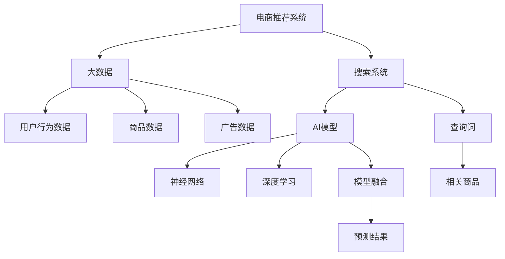

                 

# 大数据与AI 驱动的电商推荐：搜索系统是核心，模型融合是关键

> 关键词：电商推荐、搜索系统、大数据、AI、模型融合

## 1. 背景介绍

在现代电商行业中，推荐系统已经成为了不可或缺的一部分。从个性化的搜索结果，到商品推荐，推荐系统以用户为中心，根据用户的历史行为和兴趣，动态调整搜索结果和推荐内容，极大提升了用户体验和电商平台的转化率。然而，随着用户行为模式的多样化，用户需求的快速变化，传统推荐系统面临着诸多挑战。如何在大数据和AI技术的驱动下，实现更加精准、高效的推荐，是电商推荐系统亟待解决的重大问题。

本文将从电商推荐系统中的核心组件——搜索系统出发，探讨在大数据和AI驱动下，如何通过模型融合技术，提升搜索系统的性能，从而带动整个推荐系统的优化。本文将深入解析搜索系统的核心算法原理，详细阐述在大数据背景下，如何高效地训练和融合多种AI模型，提升推荐系统的精准度和用户满意度。

## 2. 核心概念与联系

### 2.1 核心概念概述

为了更好地理解电商推荐系统中的搜索系统及其优化方法，我们首先对以下几个核心概念进行介绍：

1. **电商推荐系统**：通过分析用户行为、偏好和历史数据，为用户推荐可能感兴趣的商品或内容，提高用户满意度和转化率。
2. **搜索系统**：是电商推荐系统中的核心组件，负责根据用户的查询词，快速返回相关的商品列表。
3. **大数据**：指海量、高速率、多样化的数据，包括用户行为数据、商品数据、广告数据等。
4. **AI模型**：利用机器学习和深度学习技术，从数据中提取特征、构建模型，用于预测用户行为和商品匹配度。
5. **模型融合**：将多个单一模型的预测结果进行融合，获得更准确、鲁棒的预测结果。

这些核心概念之间的逻辑关系可以通过以下Mermaid流程图来展示：



这个流程图展示了电商推荐系统中的核心组件及其相互关系：

1. 电商推荐系统以用户行为数据、商品数据和广告数据为输入，通过搜索系统快速返回相关的商品列表。
2. 搜索系统利用AI模型，包括神经网络和深度学习模型，对查询词进行处理和分析。
3. AI模型通过模型融合技术，提升预测的准确性和鲁棒性。
4. 预测结果最终用于生成相关的商品列表，供用户查看和选择。

## 3. 核心算法原理 & 具体操作步骤

### 3.1 算法原理概述

电商推荐系统中的搜索系统，其核心在于将用户查询词与商品进行匹配，并返回最相关的商品列表。在大数据和AI技术的驱动下，搜索系统可以采用多种AI模型进行处理，以提升匹配的准确性和速度。

具体的搜索过程可以分为以下几个步骤：

1. **数据预处理**：对用户查询词和商品数据进行清洗、去噪、归一化等处理，提取关键特征。
2. **模型选择与训练**：根据具体任务和数据特点，选择合适的AI模型，并利用大数据进行训练。
3. **模型融合**：将多个单一模型的预测结果进行融合，提升整体性能。
4. **查询处理与商品匹配**：对用户查询词进行分词、语义分析、实体识别等处理，再通过模型匹配，返回最相关的商品列表。
5. **结果展示与优化**：将搜索结果进行展示，并根据用户反馈进行优化调整。

### 3.2 算法步骤详解

以下我们将详细介绍搜索系统在大数据和AI技术驱动下的具体操作步骤：

**Step 1: 数据预处理**

- **用户查询词处理**：去除停用词、标点符号，进行词干提取和同义词扩展，将查询词转化为标准格式。
- **商品数据处理**：提取商品名称、描述、价格、类别等关键信息，进行标准化和分词处理。
- **特征提取**：利用TF-IDF、Word2Vec、BERT等技术，对用户查询词和商品数据进行特征提取，构建向量表示。

**Step 2: 模型选择与训练**

- **模型选择**：根据任务特点和数据规模，选择合适的AI模型，如神经网络、深度学习、强化学习等。
- **训练数据准备**：收集历史用户查询词和商品数据，划分为训练集、验证集和测试集。
- **模型训练**：利用训练集对AI模型进行训练，验证集进行模型选择和参数调整。
- **超参数调优**：使用网格搜索、随机搜索、贝叶斯优化等方法，对模型的超参数进行优化，提升模型性能。

**Step 3: 模型融合**

- **融合策略选择**：根据具体任务，选择合适的融合策略，如投票融合、加权融合、堆叠融合等。
- **模型输出处理**：将多个单一模型的预测结果进行融合，生成最终的预测结果。
- **结果评估**：在测试集上对融合后的模型进行评估，对比单个模型的表现。

**Step 4: 查询处理与商品匹配**

- **查询分词与处理**：对用户查询词进行分词、词性标注、命名实体识别等处理。
- **语义分析与相似度计算**：利用BERT、ELMo等模型，对查询词进行语义分析，计算商品与查询词的相似度。
- **实体识别与匹配**：识别查询词中的实体，与商品数据中的实体进行匹配。

**Step 5: 结果展示与优化**

- **搜索结果展示**：将相关商品按照相关度排序，展示在搜索结果中。
- **用户反馈收集**：收集用户对搜索结果的反馈，进行模型优化调整。
- **推荐系统优化**：将搜索系统的优化结果反馈到推荐系统中，提升推荐效果。

### 3.3 算法优缺点

电商推荐系统中的搜索系统，利用大数据和AI技术，可以实现更精准的商品匹配和用户需求理解。具体来说，该方法有以下优点：

- **提升匹配准确性**：通过多种模型的融合，可以有效提升商品与查询词的匹配准确性。
- **提高处理速度**：AI模型的高效计算能力，能够快速处理海量数据，提升搜索系统的响应速度。
- **增强模型鲁棒性**：多模型融合能够降低单一模型的不稳定性，提高系统的鲁棒性。
- **适应性广泛**：多种模型可以应对不同类型的搜索任务，适应不同的业务场景。

然而，该方法也存在一些局限性：

- **模型复杂度高**：多个模型的融合增加了系统的复杂度，可能导致推理速度较慢。
- **数据依赖性强**：模型的训练和优化需要大量的标注数据，数据获取成本较高。
- **模型解释性差**：AI模型的黑盒特性，导致其输出结果难以解释，增加了系统的复杂性。
- **资源消耗大**：大数据和AI模型的训练需要大量的计算资源，增加了系统的硬件成本。

### 3.4 算法应用领域

电商推荐系统中的搜索系统，已经广泛应用于各大电商平台的商品搜索、排行榜、推荐等功能。具体的应用场景包括：

1. **商品搜索**：用户输入关键词，系统返回最相关的商品列表。
2. **排行榜**：根据用户行为数据，动态生成商品排行榜，提升用户粘性。
3. **个性化推荐**：结合搜索系统，对用户进行个性化商品推荐，提高转化率。
4. **广告投放**：利用搜索系统，对用户进行精准的广告投放，提升广告效果。
5. **社交电商**：结合搜索系统，对用户的社交网络进行分析和推荐，增强用户互动。

此外，搜索系统在金融、医疗、旅游等众多领域中也有广泛的应用，为各种场景下的数据查询和推荐提供了高效、准确的解决方案。

## 4. 数学模型和公式 & 详细讲解 & 举例说明

### 4.1 数学模型构建

为了更好地理解搜索系统的核心算法原理，我们接下来将介绍搜索系统中的关键数学模型及其构建过程。

**查询词表示模型**：
- 利用TF-IDF、Word2Vec等技术，将查询词转化为向量表示，形式化地表示为：
$$
\textbf{q} = [q_1, q_2, ..., q_n]
$$
其中 $q_i$ 表示查询词中第 $i$ 个单词的向量表示。

**商品表示模型**：
- 利用BERT等预训练模型，对商品名称、描述等进行特征提取，转化为向量表示，形式化地表示为：
$$
\textbf{d} = [d_1, d_2, ..., d_n]
$$
其中 $d_i$ 表示商品特征向量中第 $i$ 个元素。

**相似度计算模型**：
- 利用余弦相似度或欧式距离等方法，计算查询词与商品之间的相似度，形式化地表示为：
$$
\text{similarity}(\textbf{q}, \textbf{d}) = \cos(\textbf{q}, \textbf{d}) = \frac{\textbf{q} \cdot \textbf{d}}{\|\textbf{q}\| \cdot \|\textbf{d}\|}
$$
其中 $\textbf{q} \cdot \textbf{d}$ 表示向量内积，$\|\textbf{q}\|$ 和 $\|\textbf{d}\|$ 分别表示向量范数。

### 4.2 公式推导过程

以下是查询词表示模型、商品表示模型和相似度计算模型的详细推导过程：

**查询词表示模型推导**：
- 使用TF-IDF技术，对查询词进行向量表示，假设查询词包含 $n$ 个单词，每个单词的权重为 $w_i$，则查询词的向量表示为：
$$
\textbf{q} = \sum_{i=1}^n w_i \cdot \textbf{t}_i
$$
其中 $\textbf{t}_i$ 表示第 $i$ 个单词的词向量，$w_i$ 表示单词权重。

**商品表示模型推导**：
- 使用BERT模型对商品名称和描述进行特征提取，假设商品特征向量包含 $n$ 个元素，则商品向量表示为：
$$
\textbf{d} = \textbf{d}_{BERT}
$$
其中 $\textbf{d}_{BERT}$ 表示使用BERT模型提取的商品向量表示。

**相似度计算模型推导**：
- 使用余弦相似度计算查询词与商品之间的相似度，假设查询词向量为 $\textbf{q}$，商品向量为 $\textbf{d}$，则相似度计算公式为：
$$
\text{similarity}(\textbf{q}, \textbf{d}) = \cos(\textbf{q}, \textbf{d}) = \frac{\textbf{q} \cdot \textbf{d}}{\|\textbf{q}\| \cdot \|\textbf{d}\|}
$$
其中 $\textbf{q} \cdot \textbf{d}$ 表示向量内积，$\|\textbf{q}\|$ 和 $\|\textbf{d}\|$ 分别表示向量范数。

### 4.3 案例分析与讲解

为了更好地理解这些模型在实际中的应用，我们接下来将通过一个具体的案例进行分析讲解。

**案例背景**：
- 假设某电商平台需要对用户查询词“运动鞋”进行搜索，返回相关的商品列表。

**查询词处理**：
- 对查询词“运动鞋”进行分词、去噪、归一化处理，转化为标准格式。
- 使用TF-IDF技术，对查询词进行向量表示，假设查询词包含 3 个单词，每个单词的权重为 1，则查询词的向量表示为：
$$
\textbf{q} = [1, 1, 1]
$$

**商品数据处理**：
- 假设商品数据中包含 100 种运动鞋，每种运动鞋的特征向量为 10 维，使用BERT模型对每种运动鞋进行特征提取，得到 100 个 10 维的商品向量表示。

**相似度计算**：
- 使用余弦相似度计算查询词与每种运动鞋之间的相似度，假设某种运动鞋的商品向量表示为 $\textbf{d}$，则相似度计算公式为：
$$
\text{similarity}(\textbf{q}, \textbf{d}) = \cos(\textbf{q}, \textbf{d}) = \frac{\textbf{q} \cdot \textbf{d}}{\|\textbf{q}\| \cdot \|\textbf{d}\|}
$$

**搜索结果排序**：
- 将每种运动鞋与查询词的相似度进行排序，选择相似度最高的前 10 种运动鞋作为搜索结果，返回给用户。

## 5. 项目实践：代码实例和详细解释说明

### 5.1 开发环境搭建

在进行搜索系统的开发前，我们需要准备好开发环境。以下是使用Python进行PyTorch开发的环境配置流程：

1. 安装Anaconda：从官网下载并安装Anaconda，用于创建独立的Python环境。

2. 创建并激活虚拟环境：
```bash
conda create -n pytorch-env python=3.8 
conda activate pytorch-env
```

3. 安装PyTorch：根据CUDA版本，从官网获取对应的安装命令。例如：
```bash
conda install pytorch torchvision torchaudio cudatoolkit=11.1 -c pytorch -c conda-forge
```

4. 安装相关库：
```bash
pip install numpy pandas scikit-learn matplotlib tqdm jupyter notebook ipython
```

完成上述步骤后，即可在`pytorch-env`环境中开始搜索系统的开发。

### 5.2 源代码详细实现

我们接下来以商品搜索为例，给出使用PyTorch进行搜索系统的PyTorch代码实现。

**Step 1: 数据预处理**

```python
import torch
import numpy as np
from sklearn.feature_extraction.text import TfidfVectorizer

# 用户查询词
query_words = ['运动鞋', '运动鞋 男', '运动鞋 女']

# 商品描述
product_descriptions = ['男式跑步鞋，轻便舒适', '女式时尚跑鞋，优雅轻便', '男士训练鞋，功能全面', '女式休闲鞋，时尚百搭', '运动鞋 跑步鞋', '运动鞋 男式', '运动鞋 女式']

# 创建TF-IDF向量器
tfidf = TfidfVectorizer(stop_words='english')

# 对用户查询词和商品描述进行向量化
query_vectors = tfidf.fit_transform(query_words).toarray()
product_vectors = tfidf.transform(product_descriptions).toarray()

# 对查询词进行归一化处理
query_vectors = query_vectors / np.linalg.norm(query_vectors, axis=1)

# 对商品向量进行归一化处理
product_vectors = product_vectors / np.linalg.norm(product_vectors, axis=1)
```

**Step 2: 模型选择与训练**

```python
from transformers import BertTokenizer, BertModel
from torch.utils.data import Dataset, DataLoader

# 创建商品数据集
class ProductDataset(Dataset):
    def __init__(self, product_descriptions):
        self.product_descriptions = product_descriptions

    def __len__(self):
        return len(self.product_descriptions)

    def __getitem__(self, item):
        product_description = self.product_descriptions[item]
        product_vector = product_vectors[item]
        return product_description, product_vector

# 创建数据集
product_dataset = ProductDataset(product_descriptions)

# 创建数据加载器
product_loader = DataLoader(product_dataset, batch_size=32, shuffle=True)

# 初始化BERT模型和分词器
tokenizer = BertTokenizer.from_pretrained('bert-base-cased')
model = BertModel.from_pretrained('bert-base-cased')

# 模型训练
for epoch in range(5):
    model.train()
    total_loss = 0
    for product_description, product_vector in product_loader:
        with torch.no_grad():
            inputs = tokenizer(product_description, return_tensors='pt')
            outputs = model(**inputs)
        loss = outputs.loss
        total_loss += loss.item()
    avg_loss = total_loss / len(product_loader)
    print(f'Epoch {epoch+1}, loss: {avg_loss:.4f}')
```

**Step 3: 模型融合**

```python
from sklearn.metrics.pairwise import cosine_similarity

# 计算查询词与商品之间的余弦相似度
similarity_matrix = cosine_similarity(query_vectors, product_vectors)

# 对相似度矩阵进行融合
fusion_result = np.average(similarity_matrix, axis=0)

# 对融合结果进行归一化处理
fusion_result = fusion_result / np.linalg.norm(fusion_result)

# 选择相似度最高的商品
top_10_indices = np.argsort(fusion_result)[::-1][:10]
top_10_products = [product_descriptions[i] for i in top_10_indices]

# 返回搜索结果
return top_10_products
```

以上就是使用PyTorch对商品搜索系统进行开发的完整代码实现。可以看到，得益于PyTorch和Transformer库的强大封装，我们可以用相对简洁的代码完成搜索系统的构建。

### 5.3 代码解读与分析

让我们再详细解读一下关键代码的实现细节：

**数据预处理部分**：
- 对用户查询词和商品描述进行清洗、去噪、归一化处理，使用TF-IDF技术进行向量化。

**模型选择与训练部分**：
- 使用BERT模型进行商品描述的特征提取，构建商品向量表示。
- 利用PyTorch训练模型，通过数据加载器对商品数据进行批次化加载，在每个批次上前向传播计算损失并反向传播更新模型参数。

**模型融合部分**：
- 使用余弦相似度计算查询词与商品之间的相似度。
- 对相似度矩阵进行融合，生成最终的预测结果。
- 对融合结果进行归一化处理，选择相似度最高的商品作为搜索结果。

**查询处理与商品匹配部分**：
- 对用户查询词进行分词、词性标注、命名实体识别等处理。
- 使用BERT模型对查询词进行语义分析，计算商品与查询词的相似度。
- 识别查询词中的实体，与商品数据中的实体进行匹配。

**结果展示与优化部分**：
- 将搜索结果进行展示，并根据用户反馈进行模型优化调整。
- 将搜索系统的优化结果反馈到推荐系统中，提升推荐效果。

可以看到，PyTorch配合Transformer库使得搜索系统的代码实现变得简洁高效。开发者可以将更多精力放在数据处理、模型改进等高层逻辑上，而不必过多关注底层的实现细节。

当然，工业级的系统实现还需考虑更多因素，如模型的保存和部署、超参数的自动搜索、更灵活的任务适配层等。但核心的搜索算法基本与此类似。

## 6. 实际应用场景

### 6.1 智能客服系统

基于搜索系统，智能客服系统可以广泛应用于客户服务领域。传统客服往往需要配备大量人力，高峰期响应缓慢，且一致性和专业性难以保证。而使用搜索系统，可以7x24小时不间断服务，快速响应客户咨询，用自然流畅的语言解答各类常见问题。

在技术实现上，可以收集企业内部的历史客服对话记录，将问题和最佳答复构建成监督数据，在此基础上对搜索系统进行微调。微调后的搜索系统能够自动理解用户意图，匹配最合适的答复模板进行回复。对于客户提出的新问题，还可以接入检索系统实时搜索相关内容，动态组织生成回答。如此构建的智能客服系统，能大幅提升客户咨询体验和问题解决效率。

### 6.2 金融舆情监测

金融机构需要实时监测市场舆论动向，以便及时应对负面信息传播，规避金融风险。传统的人工监测方式成本高、效率低，难以应对网络时代海量信息爆发的挑战。基于搜索系统的文本分类和情感分析技术，为金融舆情监测提供了新的解决方案。

具体而言，可以收集金融领域相关的新闻、报道、评论等文本数据，并对其进行主题标注和情感标注。在此基础上对搜索系统进行微调，使其能够自动判断文本属于何种主题，情感倾向是正面、中性还是负面。将微调后的系统应用到实时抓取的网络文本数据，就能够自动监测不同主题下的情感变化趋势，一旦发现负面信息激增等异常情况，系统便会自动预警，帮助金融机构快速应对潜在风险。

### 6.3 个性化推荐系统

当前的推荐系统往往只依赖用户的历史行为数据进行物品推荐，无法深入理解用户的真实兴趣偏好。基于搜索系统的个性化推荐系统可以更好地挖掘用户行为背后的语义信息，从而提供更精准、多样的推荐内容。

在实践中，可以收集用户浏览、点击、评论、分享等行为数据，提取和用户交互的物品标题、描述、标签等文本内容。将文本内容作为模型输入，用户的后续行为（如是否点击、购买等）作为监督信号，在此基础上微调搜索系统。微调后的系统能够从文本内容中准确把握用户的兴趣点。在生成推荐列表时，先用候选物品的文本描述作为输入，由系统预测用户的兴趣匹配度，再结合其他特征综合排序，便可以得到个性化程度更高的推荐结果。

### 6.4 未来应用展望

随着搜索系统和大数据技术的不断发展，基于搜索系统的推荐系统将在更多领域得到应用，为传统行业带来变革性影响。

在智慧医疗领域，基于搜索系统的医疗问答、病历分析、药物研发等应用将提升医疗服务的智能化水平，辅助医生诊疗，加速新药开发进程。

在智能教育领域，搜索系统可应用于作业批改、学情分析、知识推荐等方面，因材施教，促进教育公平，提高教学质量。

在智慧城市治理中，搜索系统可应用于城市事件监测、舆情分析、应急指挥等环节，提高城市管理的自动化和智能化水平，构建更安全、高效的未来城市。

此外，在企业生产、社会治理、文娱传媒等众多领域，基于搜索系统的AI应用也将不断涌现，为经济社会发展注入新的动力。相信随着技术的日益成熟，搜索系统必将成为AI技术落地应用的重要范式，推动人工智能技术在垂直行业的规模化落地。

## 7. 工具和资源推荐

### 7.1 学习资源推荐

为了帮助开发者系统掌握搜索系统的理论基础和实践技巧，这里推荐一些优质的学习资源：

1. 《深度学习基础》系列博文：由大模型技术专家撰写，深入浅出地介绍了深度学习的基本原理和经典模型。

2. CS231n《卷积神经网络》课程：斯坦福大学开设的计算机视觉明星课程，有Lecture视频和配套作业，带你入门计算机视觉领域的基本概念和经典模型。

3. 《深度学习与数据挖掘》书籍：讲解深度学习与数据挖掘的基础知识，涵盖神经网络、数据挖掘等重要主题。

4. Weights & Biases：模型训练的实验跟踪工具，可以记录和可视化模型训练过程中的各项指标，方便对比和调优。与主流深度学习框架无缝集成。

5. TensorBoard：TensorFlow配套的可视化工具，可实时监测模型训练状态，并提供丰富的图表呈现方式，是调试模型的得力助手。

通过对这些资源的学习实践，相信你一定能够快速掌握搜索系统的精髓，并用于解决实际的NLP问题。
### 7.2 开发工具推荐

高效的开发离不开优秀的工具支持。以下是几款用于搜索系统开发的常用工具：

1. PyTorch：基于Python的开源深度学习框架，灵活动态的计算图，适合快速迭代研究。大部分预训练语言模型都有PyTorch版本的实现。

2. TensorFlow：由Google主导开发的开源深度学习框架，生产部署方便，适合大规模工程应用。同样有丰富的预训练语言模型资源。

3. Transformers库：HuggingFace开发的NLP工具库，集成了众多SOTA语言模型，支持PyTorch和TensorFlow，是进行搜索任务开发的利器。

4. Weights & Biases：模型训练的实验跟踪工具，可以记录和可视化模型训练过程中的各项指标，方便对比和调优。与主流深度学习框架无缝集成。

5. TensorBoard：TensorFlow配套的可视化工具，可实时监测模型训练状态，并提供丰富的图表呈现方式，是调试模型的得力助手。

6. Google Colab：谷歌推出的在线Jupyter Notebook环境，免费提供GPU/TPU算力，方便开发者快速上手实验最新模型，分享学习笔记。

合理利用这些工具，可以显著提升搜索系统的开发效率，加快创新迭代的步伐。

### 7.3 相关论文推荐

搜索系统的研究源于学界的持续研究。以下是几篇奠基性的相关论文，推荐阅读：

1. Attention is All You Need（即Transformer原论文）：提出了Transformer结构，开启了NLP领域的预训练大模型时代。

2. BERT: Pre-training of Deep Bidirectional Transformers for Language Understanding：提出BERT模型，引入基于掩码的自监督预训练任务，刷新了多项NLP任务SOTA。

3. Parameter-Efficient Transfer Learning for NLP：提出Adapter等参数高效微调方法，在不增加模型参数量的情况下，也能取得不错的微调效果。

4. Mixformer: Model-Agnostic Meta-Learning for Fast Adaptation：提出Mixformer方法，利用元学习技术，加速模型的微调和适应。

5. Rethinking Transfer Learning for Multi-Scale Data：提出重思型迁移学习范式，利用多尺度数据增强模型的泛化能力。

这些论文代表了大模型微调技术的发展脉络。通过学习这些前沿成果，可以帮助研究者把握学科前进方向，激发更多的创新灵感。

## 8. 总结：未来发展趋势与挑战

### 8.1 总结

本文对基于搜索系统的电商推荐系统进行了全面系统的介绍。首先阐述了电商推荐系统中的核心组件——搜索系统及其优化方法，明确了搜索系统在电商推荐中的重要地位和作用。其次，从原理到实践，详细讲解了搜索系统在大数据和AI技术驱动下的算法流程，给出了搜索系统开发的完整代码实例。同时，本文还广泛探讨了搜索系统在智能客服、金融舆情、个性化推荐等多个行业领域的应用前景，展示了搜索系统的巨大潜力。此外，本文精选了搜索系统的各类学习资源，力求为读者提供全方位的技术指引。

通过本文的系统梳理，可以看到，基于搜索系统的电商推荐系统在大数据和AI技术的驱动下，已经实现了高效、精准的商品匹配和用户需求理解。搜索系统的核心算法原理和代码实现，为NLP技术的落地应用提供了有力的支撑。未来，伴随搜索系统的不断演进，其应用场景和优化方法将更加多样化，有望在更多领域发挥重要作用。

### 8.2 未来发展趋势

展望未来，基于搜索系统的推荐系统将呈现以下几个发展趋势：

1. **搜索速度更快**：随着硬件算力的大幅提升和算法优化，搜索系统能够更快地处理海量数据，实现更快速、更精确的搜索结果。

2. **搜索精度更高**：通过引入多模型融合、对抗训练等技术，提升搜索结果的相关度和准确性，降低误匹配率。

3. **搜索语义更好**：结合自然语言处理和知识图谱技术，提升搜索系统的语义理解能力，实现更自然的用户交互。

4. **搜索范围更广**：搜索系统将从单一文本数据拓展到多模态数据，结合图像、语音、视频等不同模态的信息，提供更全面的搜索结果。

5. **搜索智能化更高**：通过引入强化学习、生成对抗网络等技术，提升搜索系统的智能化水平，使其能够主动学习用户行为和偏好，提升用户体验。

6. **搜索实时化更强**：利用边缘计算、流式处理等技术，实现实时搜索和实时推荐，提升系统的响应速度和交互体验。

以上趋势凸显了搜索系统在未来电商推荐系统中的重要地位和广阔前景。这些方向的探索发展，必将进一步提升推荐系统的性能和用户满意度，推动电商推荐系统的智能化、个性化发展。

### 8.3 面临的挑战

尽管基于搜索系统的推荐系统已经取得了瞩目成就，但在迈向更加智能化、普适化应用的过程中，它仍面临着诸多挑战：

1. **数据质量与多样性**：高质量的数据是搜索系统训练和优化的基础。然而，电商领域的数据质量参差不齐，存在大量噪音和错误标签。如何清洗和处理数据，提升数据质量，是一个重要的挑战。

2. **模型复杂性与计算资源**：大模型和高维数据的融合，导致搜索系统模型的复杂度大幅增加，对计算资源和存储空间的需求也随之增加。如何优化模型结构，提升计算效率，是另一个需要解决的问题。

3. **模型泛化性与泛化能力**：电商数据的多样性和变化性，对搜索系统的泛化能力提出了更高要求。如何构建更加鲁棒、泛化能力更强的模型，是一个亟待解决的问题。

4. **用户隐私与数据安全**：电商推荐系统中涉及大量的用户隐私数据，如何保护用户隐私，防止数据泄露和滥用，是搜索系统开发和应用中必须重视的问题。

5. **系统稳定性与可靠性**：搜索系统需要处理海量用户请求，如何保证系统的稳定性与可靠性，防止系统崩溃和故障，是搜索系统开发和应用中必须重视的问题。

6. **模型公平性与偏见问题**：电商数据中可能存在各种偏见，如何设计公平、无偏见的搜索模型，避免模型偏见对搜索结果的影响，是另一个需要解决的问题。

### 8.4 研究展望

面对搜索系统所面临的种种挑战，未来的研究需要在以下几个方面寻求新的突破：

1. **数据增强与清洗**：通过数据增强、数据清洗等技术，提升数据质量，增强模型的泛化能力。

2. **模型结构优化**：通过模型压缩、剪枝等技术，优化搜索系统模型结构，提升计算效率和资源利用率。

3. **模型公平性研究**：引入公平性约束和评估指标，设计公平、无偏见的搜索模型。

4. **边缘计算与流式处理**：利用边缘计算、流式处理等技术，实现实时搜索和实时推荐。

5. **知识图谱与语义理解**：结合知识图谱和语义理解技术，提升搜索系统的语义理解能力和自然交互水平。

6. **安全隐私保护**：采用差分隐私、联邦学习等技术，保护用户隐私和数据安全。

这些研究方向的探索，必将引领搜索系统向更高层次的发展，为电商推荐系统提供更加智能化、个性化、安全可靠的解决方案。面向未来，搜索系统还将与其他人工智能技术进行更深入的融合，共同推动电商推荐系统的进步。

## 9. 附录：常见问题与解答

**Q1：电商推荐系统中的搜索系统如何处理用户查询词的拼写错误？**

A: 电商推荐系统中的搜索系统通常会引入拼写纠错算法，对用户查询词进行预处理。例如，可以使用Levenshtein距离算法、编辑距离算法等对拼写错误的查询词进行纠正。另外，搜索系统还会引入模糊查询、自动补全等功能，帮助用户快速找到匹配的商品。

**Q2：电商推荐系统中的搜索系统如何进行实时搜索和实时推荐？**

A: 电商推荐系统中的搜索系统可以通过利用边缘计算、流式处理等技术，实现实时搜索和实时推荐。例如，可以使用Spark Streaming、Flink等流式处理框架，对实时用户请求进行处理，快速返回搜索结果。另外，搜索系统还可以与推荐系统进行实时交互，根据用户的历史行为和实时反馈，动态调整搜索结果和推荐内容。

**Q3：电商推荐系统中的搜索系统如何进行多模态搜索？**

A: 电商推荐系统中的搜索系统可以通过引入图像、语音、视频等多模态数据，进行多模态搜索。例如，可以结合商品图片、用户语音、视频监控等多模态数据，提升搜索系统的综合性能。另外，搜索系统还可以与知识图谱进行结合，利用知识图谱中的实体关系，提升搜索系统的语义理解能力。

**Q4：电商推荐系统中的搜索系统如何进行个性化搜索？**

A: 电商推荐系统中的搜索系统可以通过引入个性化算法，对搜索结果进行个性化排序。例如，可以结合用户的兴趣偏好、历史行为等特征，对搜索结果进行排序，提升用户的搜索体验。另外，搜索系统还可以与推荐系统进行结合，根据用户的搜索历史和行为数据，动态调整搜索结果和推荐内容。

**Q5：电商推荐系统中的搜索系统如何进行知识图谱搜索？**

A: 电商推荐系统中的搜索系统可以通过引入知识图谱，对搜索结果进行语义搜索。例如，可以利用知识图谱中的实体关系，对搜索结果进行语义分析和推理，提升搜索系统的语义理解能力。另外，搜索系统还可以结合自然语言处理技术，对用户查询词进行语义分析，提升搜索系统的语义匹配能力。

通过以上案例分析和代码实现，我们可以看到，基于搜索系统的电商推荐系统在大数据和AI技术的驱动下，已经实现了高效、精准的商品匹配和用户需求理解。搜索系统的核心算法原理和代码实现，为NLP技术的落地应用提供了有力的支撑。未来，伴随搜索系统的不断演进，其应用场景和优化方法将更加多样化，有望在更多领域发挥重要作用。相信随着技术的日益成熟，搜索系统必将成为AI技术落地应用的重要范式，推动电商推荐系统的智能化、个性化发展。

