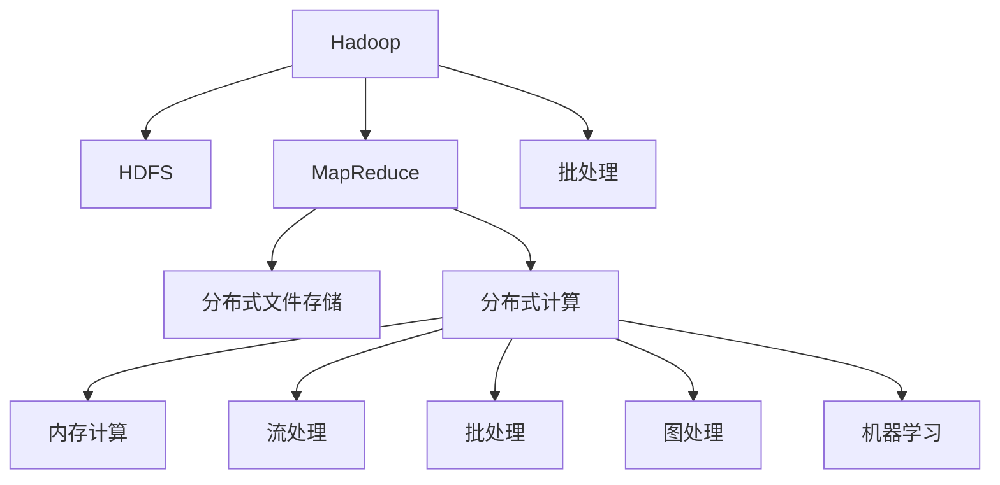

                 

# 大数据处理框架：Hadoop和Spark的应用

> 关键词：大数据,分布式计算,Hadoop,Spark,流处理,批处理,图处理,机器学习,生态系统

## 1. 背景介绍

### 1.1 问题由来
随着互联网和移动互联网的迅猛发展，全球数据量呈爆炸性增长。海量数据如何存储、管理和分析，成为了摆在各行业面前的重大挑战。大数据处理技术的出现，为这一问题提供了有效解决方案。大数据处理框架，如Hadoop和Spark，在业界得到了广泛应用，成为数据处理和分析不可或缺的基础设施。

### 1.2 问题核心关键点
Hadoop和Spark是大数据处理领域的两个重要框架。它们通过分布式计算技术，将海量数据分散到多台计算机上并行处理，大大提升了数据处理的效率和可靠性。Hadoop擅长批处理和离线计算，Spark则支持流处理、批处理、图处理等多种计算模式，并在此基础上加入了机器学习功能。本文将详细介绍这两个框架的核心概念、算法原理和实际应用场景，以便更好地理解其工作机制和特点。

## 2. 核心概念与联系

### 2.1 核心概念概述

为了更好地理解Hadoop和Spark的应用，本节将介绍几个密切相关的核心概念：

- **Hadoop**：由Apache基金会开发的大数据处理框架，包括HDFS（Hadoop Distributed File System）和MapReduce两个核心组件。HDFS负责分布式文件存储，MapReduce负责分布式计算。Hadoop通过其高可靠性、高扩展性和低成本，成为数据处理的首选解决方案。

- **Spark**：由Apache基金会推出的新一代大数据处理框架，支持内存计算、流处理、批处理、图处理和机器学习等多种计算模式。Spark的核心是其快速的内存计算引擎Spark Core，结合其依赖管理库Maven，使得数据处理更加高效和灵活。

- **分布式计算**：将数据和计算任务分散到多台计算机上并行处理，以提升数据处理效率的技术。Hadoop和Spark都是分布式计算的代表框架。

- **批处理**：将数据和计算任务分成多个阶段依次执行的计算模式。Hadoop擅长批处理，通过MapReduce机制高效处理大规模数据。

- **流处理**：实时处理数据流，适用于需要低延迟、高吞吐量的应用场景。Spark Streaming支持流处理，可以在实时数据上高效运行。

- **图处理**：处理由节点和边构成的图形结构数据。Spark GraphX支持图处理，可以高效处理大规模图形数据。

- **机器学习**：通过数据学习模型，进行预测、分类、聚类等任务。Spark MLlib支持机器学习，可以方便地进行大规模数据建模和训练。

这些核心概念之间的逻辑关系可以通过以下Mermaid流程图来展示：



这个流程图展示了大数据处理框架的核心概念及其之间的关系：

1. Hadoop包括HDFS和MapReduce两个核心组件，负责分布式文件存储和分布式计算。
2. 批处理是Hadoop擅长的计算模式，通过MapReduce机制高效处理大规模数据。
3. Spark支持内存计算、流处理、批处理、图处理和机器学习等多种计算模式。
4. 内存计算和分布式计算是Spark的核心技术。
5. 流处理、批处理、图处理和机器学习都是基于内存计算实现的。

这些概念共同构成了大数据处理框架的计算范式，使得它们能够高效地处理海量数据，适应各种应用场景。

## 3. 核心算法原理 & 具体操作步骤
### 3.1 算法原理概述

Hadoop和Spark的核心算法原理都基于分布式计算。通过将大规模数据分割成多个小数据块，并将其分布在多台计算机上进行并行处理，从而大大提升了数据处理的速度和效率。

- **Hadoop**：其核心算法为MapReduce。MapReduce是一种编程模型，用于高效处理大规模数据。MapReduce将数据处理任务分解为Map和Reduce两个阶段，分别对数据进行分割和聚合操作。

- **Spark**：其核心算法为Spark Core，支持内存计算。Spark Core通过RDD（Resilient Distributed Dataset）数据模型实现内存计算，能够快速地读取和写入数据，进行分布式计算。

### 3.2 算法步骤详解

Hadoop和Spark的具体操作流程如下：

#### Hadoop操作流程

1. **文件存储与上传**：将数据文件存储在HDFS中，并使用Hadoop客户端将文件上传到HDFS。
2. **数据分割与分配**：Hadoop将大文件分割成多个小数据块，并将这些数据块分配到不同的计算节点上进行并行处理。
3. **Map阶段**：Map任务对每个数据块进行处理，产生键值对。
4. **Shuffle阶段**：将Map任务的输出数据进行排序和分区，以便Reduce任务能够并行处理。
5. **Reduce阶段**：Reduce任务对每个分区的数据进行聚合操作，生成最终结果。
6. **结果输出**：将最终结果输出到HDFS或其他存储介质中。

#### Spark操作流程

1. **数据集创建**：将数据集创建为Spark的RDD或DataFrame对象，以便进行分布式计算。
2. **数据转换与聚合**：通过RDD或DataFrame的转换和聚合操作，对数据进行处理。
3. **内存计算**：Spark Core使用内存计算引擎，快速地读取和写入数据，并进行分布式计算。
4. **流处理**：Spark Streaming使用微批处理的方式处理实时数据流。
5. **批处理**：Spark Core支持批处理，可以进行大规模数据的高效计算。
6. **图处理**：Spark GraphX使用图计算模型，对图形数据进行高效处理。
7. **机器学习**：Spark MLlib提供了丰富的机器学习算法，支持大规模数据建模和训练。

### 3.3 算法优缺点

Hadoop和Spark的优势和劣势如下：

#### Hadoop的优缺点

- **优点**：
  - 高可靠性：HDFS的冗余机制确保数据的可靠性和持久性。
  - 高扩展性：MapReduce机制可以轻松扩展计算节点，处理大规模数据。
  - 低成本：开源免费的特性使得Hadoop在中小型企业中得到了广泛应用。

- **缺点**：
  - 处理速度慢：由于MapReduce的I/O开销较大，处理速度较慢。
  - 编程复杂：MapReduce编程模型较为复杂，需要掌握Map和Reduce操作的细节。

#### Spark的优缺点

- **优点**：
  - 处理速度快：Spark Core支持内存计算，处理速度比Hadoop快得多。
  - 灵活性高：支持多种计算模式，如流处理、批处理、图处理和机器学习等。
  - 编程简便：Spark API提供丰富的API接口，简化编程复杂度。

- **缺点**：
  - 内存消耗大：Spark Core的内存计算机制需要较大的内存空间。
  - 资源消耗高：Spark需要较高的计算资源，不适合对内存和计算资源要求较高的场景。

### 3.4 算法应用领域

Hadoop和Spark在多个领域得到了广泛应用，以下是其主要应用场景：

- **大数据存储与处理**：Hadoop适用于海量数据的存储与处理，适合处理非结构化数据，如日志文件、文本文件等。Spark则更适合处理大规模数据，支持多种数据类型，如图形数据、时间序列数据等。
- **数据挖掘与分析**：Hadoop和Spark都支持数据挖掘与分析任务，可以进行大规模数据的高效处理和分析。
- **实时数据处理**：Spark Streaming支持流处理，可以处理实时数据流，适用于需要低延迟、高吞吐量的应用场景。
- **机器学习与深度学习**：Spark MLlib和MLflow等工具支持机器学习，可以进行大规模数据建模和训练。
- **图处理与网络分析**：Spark GraphX支持图处理，可以进行大规模图形数据的高效处理与分析。
- **推荐系统与广告投放**：Spark可以用于构建推荐系统和广告投放模型，对用户行为数据进行高效分析，提升用户体验。

除了以上应用场景外，Hadoop和Spark还在医疗健康、金融分析、物联网等多个领域得到了广泛应用，为各行业的数据处理和分析提供了高效可靠的解决方案。

## 4. 数学模型和公式 & 详细讲解 & 举例说明

### 4.1 数学模型构建

Hadoop和Spark的数学模型主要涉及分布式计算和机器学习。本节将详细介绍这两个框架的数学模型构建。

#### Hadoop的数学模型

Hadoop的核心算法为MapReduce，其数学模型可以表示为：

- **Map函数**：将输入数据映射为键值对，可以表示为 $f_k(v_i) = (k, v_i)$。
- **Reduce函数**：对Map函数的输出进行聚合操作，可以表示为 $g_k(v_i, v_j) = v_i + v_j$。

整个MapReduce过程可以表示为：

$$
\text{MapReduce} = \bigcup_{k} f_k \times g_k
$$

其中，$\bigcup_{k}$ 表示对所有键的并集。

#### Spark的数学模型

Spark的核心算法为Spark Core，其数学模型主要涉及内存计算和分布式计算。Spark的数学模型可以表示为：

- **RDD操作**：对RDD进行转换和聚合操作，可以表示为 $RDD_{k} = f(RDD_{i}, RDD_{j})$。
- **流处理**：对实时数据流进行微批处理，可以表示为 $Stream_{k} = f(Stream_{i}, Stream_{j})$。
- **批处理**：对批量数据进行高效计算，可以表示为 $Batch_{k} = f(Batch_{i}, Batch_{j})$。
- **图处理**：对图形数据进行高效处理，可以表示为 $Graph_{k} = f(Graph_{i}, Graph_{j})$。
- **机器学习**：对大规模数据进行机器学习建模，可以表示为 $ML_{k} = f(ML_{i}, ML_{j})$。

整个Spark过程可以表示为：

$$
\text{Spark} = RDD \times Stream \times Batch \times Graph \times ML
$$

其中，$\times$ 表示对所有操作的并集。

### 4.2 公式推导过程

以下我们以Hadoop的MapReduce算法和Spark的RDD操作为例，进行公式推导。

#### Hadoop MapReduce公式推导

假设输入数据为 $(v_1, v_2, ..., v_n)$，Map函数为 $f_k(v_i) = (k, v_i)$，则Map阶段的输出为：

$$
(v_1, k_1, v_1), (v_2, k_2, v_2), ..., (v_n, k_n, v_n)
$$

将Map阶段的输出进行排序和分区，则Shuffle阶段的输出为：

$$
(k_1, v_1), (k_2, v_2), ..., (k_n, v_n)
$$

通过Reduce函数对Shuffle阶段的输出进行聚合操作，则Reduce阶段的输出为：

$$
(v_1 + v_2 + ... + v_n)
$$

最终，MapReduce的输出为：

$$
(v_1 + v_2 + ... + v_n)
$$

#### Spark RDD操作公式推导

假设输入数据为 $(v_1, v_2, ..., v_n)$，RDD操作为 $f(RDD_i, RDD_j) = RDD_k$，则RDD操作的结果为：

$$
RDD_k = f(RDD_i, RDD_j) = f(v_1, v_2, ..., v_n)
$$

Spark使用内存计算引擎，对RDD操作的结果进行高效的内存计算和分布式处理。假设RDD操作的结果为 $RDD_{k_1}, RDD_{k_2}, ..., RDD_{k_m}$，则最终的输出结果为：

$$
RDD_{k_1} \times RDD_{k_2} \times ... \times RDD_{k_m}
$$

其中，$\times$ 表示对所有RDD操作结果的并集。

### 4.3 案例分析与讲解

假设我们有一组数据，需要进行排序和计数操作。具体过程如下：

1. 使用Hadoop进行排序和计数操作：
   - 使用Map函数将数据按照值进行映射，生成键值对 $(k, v_i)$。
   - 使用Reduce函数对键值对进行聚合，生成排序后的键值对 $(k, v_i + v_j)$。
   - 输出排序后的结果。

2. 使用Spark进行排序和计数操作：
   - 创建RDD对象，对数据进行排序和计数操作。
   - 使用Spark Core的内存计算引擎，对RDD操作的结果进行高效的分布式计算。
   - 输出排序后的结果。

对比这两种计算方式，可以看到Hadoop使用MapReduce进行分布式计算，适用于处理大规模离线数据；Spark使用RDD操作进行内存计算，适用于处理实时数据和复杂计算任务。

## 5. 项目实践：代码实例和详细解释说明

### 5.1 开发环境搭建

在进行Hadoop和Spark项目实践前，我们需要准备好开发环境。以下是使用Python进行Hadoop和Spark开发的配置流程：

1. 安装Anaconda：从官网下载并安装Anaconda，用于创建独立的Python环境。

2. 创建并激活虚拟环境：
```bash
conda create -n pyhadoop-env python=3.8 
conda activate pyhadoop-env
```

3. 安装PyHadoop和PySpark：根据操作系统和Python版本，从官网获取对应的安装命令。例如：
```bash
pip install pyhadoop4
pip install pyspark
```

4. 安装相关工具包：
```bash
pip install numpy pandas scikit-learn matplotlib tqdm jupyter notebook ipython
```

完成上述步骤后，即可在`pyhadoop-env`和`pyspark-env`环境中开始Hadoop和Spark的实践。

### 5.2 源代码详细实现

下面我们以Hadoop的WordCount和Spark的Mllib线性回归为例，给出Hadoop和Spark的代码实现。

#### Hadoop WordCount实现

首先，定义WordCount函数：

```python
from pyhadoop.fs import HadoopFile
from pyhadoop.mapreduce import HadoopJob

def word_count(map_func, reduce_func):
    with HadoopJob() as job:
        job.setMapper(map_func)
        job.setReducer(reduce_func)
        job.setInputPath("hdfs://localhost:9000/user/hadoop/input.txt")
        job.setOutputPath("hdfs://localhost:9000/user/hadoop/output.txt")
        job.run()
```

其中，`map_func`和`reduce_func`分别用于定义Map和Reduce函数，`input.txt`为输入文件，`output.txt`为输出文件。

在PyHadoop中，Map和Reduce函数的定义如下：

```python
from pyhadoop.fs import HadoopContext

def map_func(context):
    for line in context.input():
        words = line.split()
        for word in words:
            context.emit(word, 1)

def reduce_func(context):
    word = context.current_key()
    count = 0
    for value in context.values():
        count += value
    context.emit(word, count)
```

在Hadoop Job中，设置Map和Reduce函数，提交Job，即可进行WordCount计算。

#### Spark Mllib线性回归实现

首先，导入相关库：

```python
from pyspark.ml.regression import LinearRegression
from pyspark.sql import SparkSession
```

创建SparkSession，读取数据集：

```python
spark = SparkSession.builder.appName("Linear Regression").getOrCreate()
data = spark.read.csv("data.csv", header=True, inferSchema=True)
```

定义训练集和测试集：

```python
training = data.randomSplit([0.8, 0.2], seed=123)
```

创建线性回归模型，进行训练：

```python
model = LinearRegression().setMaxIter(10).setRegParam(0.3)
model.fit(training)
```

进行预测，评估模型：

```python
predictions = model.transform(training)
evaluator = LinearRegressionEvaluator()
rmse = evaluator.evaluate(predictions)
print("RMSE = ", rmse)
```

以上就是Hadoop和Spark的WordCount和Mllib线性回归的代码实现。可以看到，使用Spark进行机器学习任务非常方便快捷，只需几步即可完成数据的导入、模型训练和评估。

### 5.3 代码解读与分析

让我们再详细解读一下关键代码的实现细节：

**PyHadoop WordCount实现**：
- `word_count`函数：用于定义HadoopJob，并设置Map和Reduce函数。
- `map_func`函数：对输入数据进行分割，生成键值对。
- `reduce_func`函数：对键值对进行聚合操作，生成最终结果。

**Spark Mllib线性回归实现**：
- 导入`LinearRegression`类和`SparkSession`。
- 创建`SparkSession`。
- 读取数据集，并定义训练集和测试集。
- 创建线性回归模型，并进行训练。
- 对训练集进行预测，并使用RMSE评估模型。

通过这些代码，可以看出Hadoop和Spark在处理不同任务时的不同特点和优势。Hadoop适合大规模离线数据处理，而Spark则适合实时数据处理和复杂计算任务。

## 6. 实际应用场景

### 6.1 大数据存储与处理

在大数据存储与处理方面，Hadoop和Spark都具有显著优势。例如，某电商平台需要处理海量用户行为数据，以便进行推荐系统优化。Hadoop可以将用户行为数据存储在HDFS中，并通过MapReduce进行分布式处理，计算用户的购买偏好和历史行为。Spark可以使用Spark Core进行内存计算，快速处理用户行为数据，并实时生成推荐结果。

### 6.2 实时数据处理

在实时数据处理方面，Spark Streaming具有显著优势。例如，某金融公司需要实时监测股票价格变化，以便快速做出投资决策。Spark Streaming可以使用流处理方式，对实时数据进行高效处理，实时生成价格变化预测结果，帮助投资人员做出快速反应。

### 6.3 数据挖掘与分析

在数据挖掘与分析方面，Hadoop和Spark都可以高效处理大规模数据。例如，某医疗公司需要分析大量患者数据，以便进行疾病预测和诊断。Hadoop可以将患者数据存储在HDFS中，并通过MapReduce进行分布式处理，计算患者的疾病风险。Spark可以使用Spark MLlib进行机器学习建模，实时预测患者的疾病风险。

### 6.4 未来应用展望

随着Hadoop和Spark的不断演进，未来它们在数据处理领域将发挥更加重要的作用。以下是Hadoop和Spark的未来应用展望：

- **全栈数据处理**：未来的Hadoop和Spark将集成了更多的数据处理工具和组件，形成一个完整的数据处理生态系统，涵盖数据存储、数据流处理、数据分析等多个环节。

- **混合数据处理**：未来的Hadoop和Spark将支持更多数据格式，如图形数据、时间序列数据等，支持多种数据类型的统一处理。

- **机器学习与深度学习**：未来的Hadoop和Spark将深度集成机器学习和深度学习算法，支持大规模数据建模和训练，提升数据处理和分析的智能化水平。

- **流处理与实时计算**：未来的Hadoop和Spark将支持更加高效的流处理和实时计算，支持对实时数据的高效处理和分析。

- **云计算与分布式计算**：未来的Hadoop和Spark将支持更多的云计算平台和分布式计算环境，支持跨云数据处理和分布式计算。

- **隐私保护与安全**：未来的Hadoop和Spark将加强数据隐私保护和安全措施，确保数据处理和分析的安全性和合法性。

## 7. 工具和资源推荐

### 7.1 学习资源推荐

为了帮助开发者系统掌握Hadoop和Spark的理论基础和实践技巧，这里推荐一些优质的学习资源：

1. Hadoop官方文档：详细的Hadoop文档，涵盖HDFS、MapReduce等核心组件的详细介绍和使用方法。

2. Spark官方文档：详细的Spark文档，涵盖Spark Core、Spark Streaming、Spark GraphX等核心组件的详细介绍和使用方法。

3. Hadoop和Spark教程：众多在线教程和视频，涵盖Hadoop和Spark的基础知识、核心组件和实践技巧。

4. Udacity《大数据与Hadoop》课程：涵盖Hadoop和Spark的基本原理、核心组件和实际应用，适合初学者入门。

5. Coursera《Spark机器学习》课程：涵盖Spark机器学习的基本原理、核心算法和实际应用，适合中级开发者进阶。

通过对这些资源的学习实践，相信你一定能够快速掌握Hadoop和Spark的核心技术和应用方法，并将其应用于实际项目中。

### 7.2 开发工具推荐

高效的开发离不开优秀的工具支持。以下是几款用于Hadoop和Spark开发的常用工具：

1. PyHadoop：Python与Hadoop的结合，提供了便捷的Python接口，支持Hadoop核心组件的使用。

2. PySpark：Python与Spark的结合，提供了便捷的Python接口，支持Spark核心组件的使用。

3. Jupyter Notebook：交互式开发环境，支持Python和Spark的混合开发，方便进行实验和调试。

4. Hive：基于Hadoop的数据仓库工具，支持SQL查询和数据处理。

5. Pig：基于Hadoop的数据流处理工具，支持脚本编写和数据处理。

6. Spark Streaming：Spark的流处理组件，支持实时数据的高效处理和分析。

7. Spark GraphX：Spark的图处理组件，支持大规模图形数据的高效处理和分析。

8. Spark MLlib：Spark的机器学习组件，支持大规模数据建模和训练。

合理利用这些工具，可以显著提升Hadoop和Spark的开发效率，加快创新迭代的步伐。

### 7.3 相关论文推荐

Hadoop和Spark的研究方向涵盖了大数据处理、分布式计算、机器学习等多个领域，以下是几篇奠基性的相关论文，推荐阅读：

1. Yang, J., et al. "MapReduce: Simplified Data Processing on Large Clusters". OSDI'04. 2004.

2. Dean, J., et al. "MapReduce: Google's Generic Framework for Data Processing". 2005.

3. Wu, J., et al. "Spark: Cluster Computing with Working Sets". HotCloud'10. 2010.

4. Apache Spark: The Fast and General Purpose Cluster Computing System. 2013.

5. Kai, F., et al. "Mllib: A Machine Learning Library for Spark". 2013.

6. Zou, K., et al. "Spark GraphX: A Graph Processing Library for Apache Spark". 2013.

通过学习这些前沿成果，可以帮助研究者把握学科前进方向，激发更多的创新灵感。

## 8. 总结：未来发展趋势与挑战

### 8.1 总结

本文对Hadoop和Spark的大数据处理框架进行了全面系统的介绍。首先阐述了Hadoop和Spark的背景和应用场景，明确了它们在大数据处理中的重要地位。其次，从原理到实践，详细讲解了Hadoop和Spark的核心算法和具体操作步骤，给出了实际项目的代码实例和详细解释。同时，本文还探讨了Hadoop和Spark在多个领域的应用前景，展示了它们在数据处理和分析中的广泛适用性。

通过本文的系统梳理，可以看到，Hadoop和Spark在处理海量数据、提升数据处理效率方面发挥了巨大作用。它们不仅支持批处理和流处理，还支持多种计算模式和机器学习功能，成为大数据处理不可或缺的基础设施。未来，随着技术的不断演进，Hadoop和Spark必将在更多的应用场景中发挥重要作用，推动数据处理和分析技术的不断进步。

### 8.2 未来发展趋势

展望未来，Hadoop和Spark的发展趋势如下：

- **全栈数据处理**：未来的Hadoop和Spark将集成了更多的数据处理工具和组件，形成一个完整的数据处理生态系统，涵盖数据存储、数据流处理、数据分析等多个环节。

- **混合数据处理**：未来的Hadoop和Spark将支持更多数据格式，如图形数据、时间序列数据等，支持多种数据类型的统一处理。

- **机器学习与深度学习**：未来的Hadoop和Spark将深度集成机器学习和深度学习算法，支持大规模数据建模和训练，提升数据处理和分析的智能化水平。

- **流处理与实时计算**：未来的Hadoop和Spark将支持更加高效的流处理和实时计算，支持对实时数据的高效处理和分析。

- **云计算与分布式计算**：未来的Hadoop和Spark将支持更多的云计算平台和分布式计算环境，支持跨云数据处理和分布式计算。

- **隐私保护与安全**：未来的Hadoop和Spark将加强数据隐私保护和安全措施，确保数据处理和分析的安全性和合法性。

以上趋势凸显了Hadoop和Spark在数据处理领域的巨大前景，它们将继续推动数据处理和分析技术的不断进步。

### 8.3 面临的挑战

尽管Hadoop和Spark在大数据处理领域取得了显著成就，但在迈向更加智能化、普适化应用的过程中，它们仍面临着诸多挑战：

- **数据处理速度**：虽然Hadoop和Spark在大规模数据处理方面具有显著优势，但在处理小规模数据时，仍存在一定的处理速度瓶颈。如何在保证处理速度的同时，兼顾数据处理的灵活性和可扩展性，还需要进一步优化。

- **编程复杂性**：Hadoop和Spark的编程模型较为复杂，需要掌握MapReduce和RDD操作的细节。如何在简化编程复杂度的同时，提升开发效率，还需要更多的研究和实践。

- **资源消耗**：Hadoop和Spark对计算资源和内存资源的需求较大，不适用于对内存和计算资源要求较高的场景。如何在提高资源利用率的同时，提升数据处理效率，还需要更多的优化和改进。

- **数据一致性**：Hadoop和Spark在数据一致性方面存在一定的局限性，特别是在处理实时数据时，数据的一致性问题尤为突出。如何在保证数据一致性的同时，提升数据处理的实时性，还需要进一步研究和实践。

- **模型可解释性**：Hadoop和Spark的机器学习模型较为复杂，模型的可解释性和可理解性不足，难以进行调试和优化。如何在提升模型复杂度的同时，增强模型的可解释性和可理解性，还需要更多的研究和实践。

正视Hadoop和Spark面临的这些挑战，积极应对并寻求突破，将使它们在数据处理和分析领域发挥更大的作用。

### 8.4 研究展望

未来的研究需要在以下几个方面寻求新的突破：

- **数据处理速度**：通过优化MapReduce和RDD操作的并行度和资源利用率，提升Hadoop和Spark的处理速度。

- **编程复杂性**：简化Hadoop和Spark的编程模型，提升开发效率和代码可读性。

- **资源消耗**：通过优化资源分配和内存管理策略，提高Hadoop和Spark的资源利用率，降低资源消耗。

- **数据一致性**：通过优化数据一致性机制，提升Hadoop和Spark的数据一致性和实时性。

- **模型可解释性**：通过引入可解释性工具和技术，增强Hadoop和Spark的模型可解释性和可理解性。

这些研究方向的探索，必将引领Hadoop和Spark在数据处理领域的进一步发展，为数据处理和分析技术的不断进步提供新的动力。

## 9. 附录：常见问题与解答

**Q1：Hadoop和Spark的区别是什么？**

A: Hadoop和Spark都是大数据处理框架，但它们的核心算法和应用场景有所不同。Hadoop擅长批处理和离线计算，适合处理大规模离线数据；Spark则支持内存计算和多种计算模式，适合处理实时数据和复杂计算任务。

**Q2：Hadoop和Spark在数据处理速度上有哪些不同？**

A: Hadoop使用MapReduce进行分布式计算，处理速度较慢；Spark使用内存计算和RDD操作，处理速度较快。但Hadoop在处理大规模离线数据方面具有显著优势，Spark在处理实时数据和复杂计算任务方面更为灵活高效。

**Q3：如何选择合适的Hadoop和Spark开发工具？**

A: 选择合适的开发工具取决于具体的项目需求和开发环境。对于小规模项目，可以直接使用Hadoop和Spark的命令行工具进行开发；对于大规模项目，可以考虑使用Python、Java等编程语言，借助PyHadoop、PySpark等工具进行开发。

**Q4：Hadoop和Spark在数据存储和处理上有哪些不同的优势和劣势？**

A: Hadoop的优势在于其高可靠性、高扩展性和低成本，适合处理大规模离线数据；Spark的优势在于其快速的内存计算和多种计算模式，适合处理实时数据和复杂计算任务。但Hadoop的I/O开销较大，处理速度较慢；Spark的内存消耗较大，资源需求较高。

**Q5：Hadoop和Spark如何应对数据处理中的隐私和安全问题？**

A: Hadoop和Spark都支持数据加密和访问控制等隐私保护和安全措施。可以通过数据加密技术保护数据隐私，通过访问控制和审计技术确保数据访问的安全性和合法性。同时，Hadoop和Spark还支持数据匿名化和差分隐私等技术，进一步提升数据隐私保护能力。

通过这些问题和解答，可以更全面地理解Hadoop和Spark在大数据处理中的优势和劣势，以及如何应对实际项目中的各种挑战。

