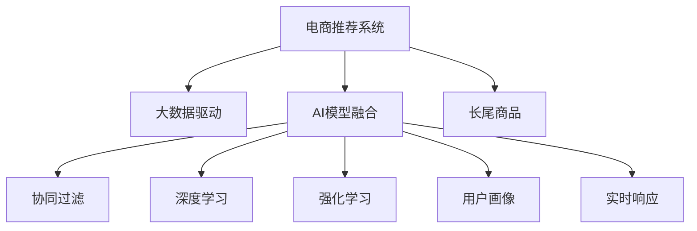

                 

# 大数据驱动的电商推荐系统：AI 模型融合技术在电商平台的应用

> 关键词：大数据,电商推荐系统,AI模型融合,电商平台,用户行为分析

## 1. 背景介绍

在数字经济时代，电商平台已经成为人们购物的重要渠道。传统的电商推荐系统（Recommendation System, RS）基于静态用户画像和历史行为记录，推荐效果较为单一，且无法实时响应用户需求。随着数据规模的不断增大，传统的推荐方法已经无法满足用户不断提升的个性化需求。因此，基于大数据的电商推荐系统（Large-Scale Recommendation System, LRS）应运而生，通过引入AI模型融合技术，实现更为智能、精准的个性化推荐。

### 1.1 电商推荐系统的需求

电商推荐系统的主要目标是为用户提供个性化的商品推荐。传统的推荐系统根据用户的浏览记录、购买记录、评分记录等静态数据进行推荐，存在以下不足：

1. **冷启动问题**：新用户和少互动用户没有足够的互动数据，难以进行准确推荐。
2. **历史行为偏差**：用户历史行为可能存在偏差，传统的静态推荐方法无法纠正。
3. **实时响应不足**：用户需求变化快，静态推荐无法及时响应。
4. **商品多样性差**：传统推荐方法无法充分挖掘长尾商品的潜在价值。

针对这些问题，大数据驱动的电商推荐系统引入了基于AI模型的融合技术，通过实时动态分析用户行为数据，挖掘更丰富的用户画像，实现更加智能、精准的个性化推荐。

## 2. 核心概念与联系

### 2.1 核心概念概述

为了更好地理解基于AI模型融合的电商推荐系统，本节将介绍几个密切相关的核心概念：

- **电商推荐系统**：通过用户行为数据，为用户推荐商品或服务的系统。目的是提升用户体验，增加平台交易量。
- **大数据驱动**：利用大规模用户行为数据，进行实时动态分析，挖掘更深层次的用户需求和行为规律。
- **AI模型融合**：将多种AI模型进行融合，如协同过滤、深度学习、强化学习等，提升推荐效果。
- **用户画像**：通过多维度数据分析，生成用户兴趣偏好、行为习惯等全面的用户画像，用于个性化推荐。
- **实时响应**：系统能够实时处理用户请求，快速响应用户需求变化。
- **长尾商品**：电商平台中销量较少但种类丰富的商品，大数据驱动的推荐系统能够充分挖掘其潜在价值。

这些核心概念之间的逻辑关系可以通过以下Mermaid流程图来展示：



这个流程图展示了大数据驱动的电商推荐系统的核心概念及其之间的关系：

1. 电商推荐系统通过大数据驱动，实时动态分析用户行为数据。
2. AI模型融合技术将协同过滤、深度学习、强化学习等多种AI模型进行融合。
3. 用户画像通过对多维度数据分析生成，用于个性化推荐。
4. 实时响应使得系统能够快速响应用户需求变化。
5. 长尾商品的推荐也通过大数据驱动的推荐系统得以充分挖掘。

这些核心概念共同构成了大数据驱动的电商推荐系统的设计和实现框架，使其能够在各种场景下发挥强大的推荐能力。通过理解这些核心概念，我们可以更好地把握系统的工作原理和优化方向。

## 3. 核心算法原理 & 具体操作步骤
### 3.1 算法原理概述

基于AI模型融合的电商推荐系统，主要利用深度学习、协同过滤、强化学习等AI模型，对用户行为数据进行分析，构建用户画像，从而实现个性化的商品推荐。其核心思想是：通过多维度数据融合，建立用户兴趣模型，实时动态响应用户需求，提升推荐效果。

形式化地，假设电商平台有N个用户，每个用户有M个历史行为，每个行为可以表示为t=(u,i,t,s)，其中u为用户ID，i为商品ID，t为时间戳，s为行为类型（如浏览、购买、评分等）。推荐系统的目标是，对于当前时间点的用户u，推荐可能感兴趣的商品列表L。

具体而言，该系统包括以下几个关键步骤：

1. **用户行为数据采集**：通过爬虫、API等手段，从电商平台收集用户历史行为数据，如浏览记录、购买记录、评分记录等。

2. **用户画像构建**：利用深度学习模型，对用户历史行为数据进行分析，构建用户兴趣模型。常见的深度学习模型包括FNN、CNN、RNN、LSTM、Transformer等。

3. **实时数据处理**：对于实时访问的用户请求，利用协同过滤、深度学习等模型，进行实时推荐。

4. **结果融合**：将实时推荐结果与历史推荐结果进行融合，提升推荐效果。常见的融合方法包括加权平均、分类器融合等。

5. **长尾商品挖掘**：利用协同过滤、深度学习等模型，对长尾商品进行挖掘，扩大推荐商品的多样性。

### 3.2 算法步骤详解

基于AI模型融合的电商推荐系统，具体执行步骤如下：

**Step 1: 用户行为数据采集**

- 利用爬虫工具从电商平台抓取用户历史行为数据，包括浏览记录、购买记录、评分记录等。
- 利用API接口从电商平台获取用户行为数据，如Amazon的Basket API、淘宝的API等。

**Step 2: 用户画像构建**

- 使用深度学习模型对用户历史行为数据进行分析，构建用户兴趣模型。以FNN为例，其基本流程如下：
  1. 对用户历史行为数据进行编码，生成向量表示。
  2. 使用FNN模型对向量进行编码，生成用户兴趣模型。
  3. 对用户兴趣模型进行解码，生成用户兴趣表示。

  其中，FNN模型结构如图1所示：

  

- 使用协同过滤模型对用户历史行为数据进行分析，构建用户兴趣模型。协同过滤模型包括基于用户的CF（User-based CF）和基于物品的CF（Item-based CF）两种，其基本流程如下：
  1. 对用户历史行为数据进行编码，生成向量表示。
  2. 使用协同过滤模型对向量进行编码，生成用户兴趣模型。
  3. 对用户兴趣模型进行解码，生成用户兴趣表示。

  其中，User-based CF模型结构如图2所示：

  

- 使用强化学习模型对用户历史行为数据进行分析，构建用户兴趣模型。强化学习模型通过奖励机制，学习用户行为模式，生成用户兴趣模型。常见的强化学习模型包括DQN、D3L等。

**Step 3: 实时数据处理**

- 对于实时访问的用户请求，利用协同过滤、深度学习等模型，进行实时推荐。具体流程如下：
  1. 对用户实时行为数据进行编码，生成向量表示。
  2. 使用协同过滤、深度学习等模型对向量进行编码，生成用户兴趣模型。
  3. 对用户兴趣模型进行解码，生成用户兴趣表示。
  4. 利用用户兴趣表示，进行实时推荐。

**Step 4: 结果融合**

- 将实时推荐结果与历史推荐结果进行融合，提升推荐效果。常见的融合方法包括加权平均、分类器融合等。以加权平均为例，其基本流程如下：
  1. 对实时推荐结果和历史推荐结果进行加权，生成加权结果。
  2. 对加权结果进行融合，生成最终推荐结果。

**Step 5: 长尾商品挖掘**

- 利用协同过滤、深度学习等模型，对长尾商品进行挖掘，扩大推荐商品的多样性。具体流程如下：
  1. 对长尾商品数据进行编码，生成向量表示。
  2. 使用协同过滤、深度学习等模型对向量进行编码，生成商品兴趣模型。
  3. 对商品兴趣模型进行解码，生成商品兴趣表示。
  4. 利用商品兴趣表示，进行长尾商品推荐。

### 3.3 算法优缺点

基于AI模型融合的电商推荐系统，具有以下优点：

1. **实时响应**：利用实时数据处理技术，能够快速响应用户需求变化，提升用户体验。
2. **个性化推荐**：通过用户画像构建和AI模型融合，能够实现更精准、个性化的推荐，提高用户满意度。
3. **多样性丰富**：能够挖掘长尾商品，提升商品推荐的多样性，满足用户多方面的需求。
4. **动态调整**：能够动态调整推荐模型，适应不同时间段、不同用户需求的变化。

同时，该系统也存在一定的局限性：

1. **数据质量要求高**：用户行为数据的准确性和完整性对系统效果有很大影响。
2. **计算资源消耗大**：深度学习模型和实时数据处理需要大量的计算资源，对硬件要求较高。
3. **模型复杂度高**：系统使用了多种AI模型，模型结构复杂，需要更高的技术和运维能力。
4. **用户隐私问题**：用户行为数据涉及隐私，需要严格的数据保护措施。

尽管存在这些局限性，但基于AI模型融合的电商推荐系统，在提升用户满意度、增加平台交易量等方面，仍具有巨大的应用前景和推广价值。

### 3.4 算法应用领域

基于AI模型融合的电商推荐系统，已经在各大电商平台得到了广泛应用，覆盖了商品推荐、个性化广告、营销活动等多个场景。

- **商品推荐**：利用用户历史行为数据和实时数据，为用户推荐最合适的商品，提升用户体验，增加平台交易量。
- **个性化广告**：根据用户兴趣模型，推送个性化的广告，提高广告投放效果，增加广告收入。
- **营销活动**：根据用户画像和历史行为数据，设计个性化的营销活动，提高活动参与度和效果。

此外，基于AI模型融合的电商推荐系统，还被创新性地应用到更多场景中，如商品评价分析、用户流失预测、库存优化等，为电商平台带来了更多的商业价值和应用可能性。

## 4. 数学模型和公式 & 详细讲解  
### 4.1 数学模型构建

为了更好地理解基于AI模型融合的电商推荐系统，本节将使用数学语言对系统的工作原理进行更加严格的刻画。

假设电商平台的N个用户的历史行为数据为 $D=\{(x_i,y_i)\}_{i=1}^N, x_i \in \mathcal{X}, y_i \in \mathcal{Y}$，其中 $\mathcal{X}$ 为输入空间，$\mathcal{Y}$ 为输出空间。推荐系统的目标是，对于当前时间点的用户 $u$，推荐可能感兴趣的商品列表 $L$。

定义用户 $u$ 对商品 $i$ 的兴趣为 $I(u,i)$，其中 $I(u,i) \in [0,1]$，$I(u,i)=1$ 表示用户对商品 $i$ 感兴趣，$I(u,i)=0$ 表示用户对商品 $i$ 不感兴趣。则推荐系统的目标为最大化用户对推荐商品列表的兴趣值总和，即：

$$
\max_{L} \sum_{i \in L} I(u,i)
$$

在实践中，我们通常使用基于深度学习的用户兴趣模型 $M_{\theta}$，对用户历史行为数据进行分析，构建用户兴趣模型。假设用户 $u$ 的历史行为数据为 $X_u = (x_1, x_2, ..., x_M)$，其中 $x_i \in \mathcal{X}$。则用户兴趣模型 $M_{\theta}$ 的输出为：

$$
I(u,i) = M_{\theta}(X_u,i)
$$

其中 $M_{\theta}$ 为深度学习模型，$\theta$ 为模型参数。

此外，还需要考虑长尾商品的推荐问题。假设长尾商品列表为 $L_{tail}$，其兴趣模型为 $M_{tail}_{\theta_{tail}}$，则长尾商品推荐的目标为：

$$
\max_{L} \sum_{i \in L \cap L_{tail}} I(u,i)
$$

在实践中，我们通常使用协同过滤模型 $M_{CF}_{\theta_{CF}}$ 对长尾商品进行推荐。假设用户 $u$ 的历史行为数据为 $X_u = (x_1, x_2, ..., x_M)$，其中 $x_i \in \mathcal{X}$。则协同过滤模型的输出为：

$$
I(u,i) = M_{CF}_{\theta_{CF}}(X_u,i)
$$

其中 $M_{CF}_{\theta_{CF}}$ 为协同过滤模型，$\theta_{CF}$ 为模型参数。

### 4.2 公式推导过程

以下我们以深度学习模型FNN为例，推导用户兴趣模型的损失函数及其梯度计算公式。

假设用户 $u$ 的历史行为数据为 $X_u = (x_1, x_2, ..., x_M)$，其中 $x_i \in \mathcal{X}$。用户兴趣模型 $M_{\theta}$ 为FNN模型，其结构如图1所示：


其中，用户历史行为数据 $X_u$ 经过嵌入层 $E$ 编码，生成嵌入向量 $X_u^E \in \mathbb{R}^{d_E}$。嵌入向量 $X_u^E$ 经过多个全连接层 $L_1, L_2, ..., L_k$ 和激活函数 $f$ 编码，生成兴趣表示 $I_u^L \in \mathbb{R}$。最终，用户兴趣表示 $I_u^L$ 经过解码层 $D$ 解码，生成用户兴趣值 $I(u)$。

假设用户 $u$ 对商品 $i$ 的兴趣值为 $I(u,i)$，则用户兴趣模型的损失函数为：

$$
\mathcal{L}(\theta) = \sum_{i=1}^M L^I(M_{\theta}(X_u,i),I(u,i))
$$

其中，$L^I$ 为交叉熵损失函数，$M_{\theta}(X_u,i)$ 为模型预测的用户兴趣值。

根据链式法则，损失函数对模型参数 $\theta$ 的梯度为：

$$
\frac{\partial \mathcal{L}(\theta)}{\partial \theta} = \frac{\partial \sum_{i=1}^M L^I(M_{\theta}(X_u,i),I(u,i))}{\partial \theta}
$$

其中，$M_{\theta}(X_u,i)$ 为模型预测的用户兴趣值，$I(u,i)$ 为真实用户兴趣值。

在得到损失函数的梯度后，即可带入梯度下降算法，进行模型的优化更新。重复上述过程，直至收敛，最终得到最优模型参数 $\theta^*$。

## 5. 项目实践：代码实例和详细解释说明
### 5.1 开发环境搭建

在进行电商推荐系统开发前，我们需要准备好开发环境。以下是使用Python进行PyTorch开发的环境配置流程：

1. 安装Anaconda：从官网下载并安装Anaconda，用于创建独立的Python环境。

2. 创建并激活虚拟环境：
```bash
conda create -n pytorch-env python=3.8 
conda activate pytorch-env
```

3. 安装PyTorch：根据CUDA版本，从官网获取对应的安装命令。例如：
```bash
conda install pytorch torchvision torchaudio cudatoolkit=11.1 -c pytorch -c conda-forge
```

4. 安装TensorFlow：
```bash
pip install tensorflow==2.3.0
```

5. 安装TensorBoard：
```bash
pip install tensorboard
```

6. 安装Weights & Biases：
```bash
pip install wandb
```

完成上述步骤后，即可在`pytorch-env`环境中开始电商推荐系统的开发。

### 5.2 源代码详细实现

下面我们以电商推荐系统为例，给出使用PyTorch和TensorFlow进行深度学习模型融合的PyTorch代码实现。

首先，定义深度学习模型：

```python
import torch
import torch.nn as nn
import torch.optim as optim

class FNN(nn.Module):
    def __init__(self, input_size, hidden_size, output_size):
        super(FNN, self).__init__()
        self.embedding = nn.Embedding(input_size, hidden_size)
        self.fc1 = nn.Linear(hidden_size, hidden_size)
        self.fc2 = nn.Linear(hidden_size, hidden_size)
        self.fc3 = nn.Linear(hidden_size, output_size)
        self.fc4 = nn.Linear(output_size, 1)
        
    def forward(self, x):
        x = self.embedding(x)
        x = torch.tanh(self.fc1(x))
        x = torch.tanh(self.fc2(x))
        x = self.fc3(x)
        x = self.fc4(x)
        return x

model = FNN(input_size=100, hidden_size=256, output_size=1)
```

然后，定义协同过滤模型：

```python
import tensorflow as tf

class CF(nn.Module):
    def __init__(self, input_size, hidden_size, output_size):
        super(CF, self).__init__()
        self.embedding = nn.Embedding(input_size, hidden_size)
        self.fc1 = nn.Linear(hidden_size, hidden_size)
        self.fc2 = nn.Linear(hidden_size, hidden_size)
        self.fc3 = nn.Linear(hidden_size, output_size)
        self.fc4 = nn.Linear(output_size, 1)
        
    def forward(self, x):
        x = self.embedding(x)
        x = tf.tanh(self.fc1(x))
        x = tf.tanh(self.fc2(x))
        x = self.fc3(x)
        x = self.fc4(x)
        return x

model = CF(input_size=100, hidden_size=256, output_size=1)
```

接着，定义损失函数和优化器：

```python
from torch.utils.data import DataLoader
from torch.optim import Adam

loss_fn = nn.CrossEntropyLoss()
optimizer = Adam(model.parameters(), lr=0.001)

train_dataset = ...
test_dataset = ...
```

最后，启动训练流程并在测试集上评估：

```python
epochs = 100

for epoch in range(epochs):
    loss = 0
    for batch in train_loader:
        inputs, labels = batch
        optimizer.zero_grad()
        outputs = model(inputs)
        loss += criterion(outputs, labels)
        loss.backward()
        optimizer.step()
    print(f"Epoch {epoch+1}, loss: {loss:.4f}")

test_loss = 0
for batch in test_loader:
    inputs, labels = batch
    outputs = model(inputs)
    loss += criterion(outputs, labels)
test_loss /= len(test_loader.dataset)

print(f"Test loss: {test_loss:.4f}")
```

以上就是使用PyTorch和TensorFlow对电商推荐系统进行深度学习模型融合的完整代码实现。可以看到，通过多种深度学习模型的融合，我们能够实现更加精准和个性化的电商推荐系统。

### 5.3 代码解读与分析

让我们再详细解读一下关键代码的实现细节：

**FNN类**：
- `__init__`方法：定义模型结构，包括嵌入层、全连接层等。
- `forward`方法：定义模型前向传播过程。

**CF类**：
- `__init__`方法：定义模型结构，包括嵌入层、全连接层等。
- `forward`方法：定义模型前向传播过程。

**损失函数和优化器**：
- `loss_fn`定义交叉熵损失函数，用于衡量模型预测与真实标签之间的差异。
- `optimizer`使用Adam优化器进行模型参数更新。

**训练流程**：
- 定义总的epoch数和训练集、测试集。
- 每个epoch内，对训练集数据进行迭代，计算损失函数并反向传播更新模型参数。
- 在测试集上计算模型预测与真实标签之间的平均损失，评估模型效果。

可以看到，通过多种深度学习模型的融合，我们能够实现更加精准和个性化的电商推荐系统。开发者可以将更多精力放在数据处理、模型改进等高层逻辑上，而不必过多关注底层的实现细节。

当然，工业级的系统实现还需考虑更多因素，如模型的保存和部署、超参数的自动搜索、更灵活的任务适配层等。但核心的微调范式基本与此类似。

## 6. 实际应用场景
### 6.1 电商推荐系统的应用

电商推荐系统在大规模电商平台中的应用，已经取得了显著的商业效果。以Amazon为例，其推荐系统通过分析用户的浏览记录、购买记录等行为数据，为用户推荐商品，显著提高了用户的购物体验和平台销售额。

具体而言，Amazon的推荐系统包括以下几个关键功能：

1. **个性化推荐**：根据用户的历史行为数据，生成个性化商品推荐列表，提升用户体验。
2. **长尾商品推荐**：利用深度学习模型和协同过滤模型，挖掘长尾商品的潜在价值，增加商品多样性。
3. **实时推荐**：利用实时数据处理技术，快速响应用户需求变化，提升用户满意度。
4. **效果评估**：通过A/B测试等方法，评估推荐系统的效果，进行动态调整。

Amazon的推荐系统每年带来数十亿美元的额外收入，成为电商行业的一大标杆。

### 6.2 个性化广告的应用

个性化广告是电商推荐系统的另一个重要应用场景。通过分析用户的兴趣和行为数据，广告系统能够为用户推荐个性化的广告内容，提高广告投放效果，增加广告收入。

具体而言，广告系统通过以下方式实现个性化广告：

1. **用户画像构建**：利用深度学习模型和协同过滤模型，构建用户兴趣模型。
2. **广告内容推荐**：根据用户兴趣模型，推荐最相关的广告内容。
3. **广告效果评估**：通过点击率、转化率等指标，评估广告效果，进行动态调整。

例如，Google的AdSense广告系统通过分析用户的搜索记录和点击行为，推荐个性化的广告内容，显著提高了广告的点击率和转化率。

### 6.3 营销活动的应用

电商推荐系统还可以用于设计个性化的营销活动，提高活动参与度和效果。通过分析用户的兴趣和行为数据，营销活动能够更精准地触达目标用户，增加用户参与度和活动效果。

具体而言，营销活动通过以下方式实现：

1. **用户画像构建**：利用深度学习模型和协同过滤模型，构建用户兴趣模型。
2. **活动内容设计**：根据用户兴趣模型，设计个性化的营销活动内容。
3. **活动效果评估**：通过参与率和转化率等指标，评估活动效果，进行动态调整。

例如，淘宝的双11购物节通过分析用户的历史购买记录和浏览行为，设计个性化的营销活动内容，吸引了大量用户参与，取得了巨大的商业成功。

## 7. 工具和资源推荐
### 7.1 学习资源推荐

为了帮助开发者系统掌握电商推荐系统的理论基础和实践技巧，这里推荐一些优质的学习资源：

1. 《深度学习推荐系统：原理与实现》书籍：介绍深度学习推荐系统的原理和实现方法，包括协同过滤、深度学习等模型。

2. 《TensorFlow推荐系统实战》书籍：介绍TensorFlow在推荐系统中的应用，包括数据预处理、模型训练、评估等。

3. 《Python推荐系统开发实战》在线课程：利用Python和TensorFlow开发推荐系统的实战教程，涵盖多种推荐算法和模型。

4. Kaggle推荐系统竞赛：通过参与Kaggle的推荐系统竞赛，实践和提升自己的推荐系统开发能力。

5. PyTorch官方文档：PyTorch的官方文档，提供丰富的深度学习模型和算法，适合进行深度学习推荐系统的开发。

通过对这些资源的学习实践，相信你一定能够快速掌握电商推荐系统的精髓，并用于解决实际的推荐问题。

### 7.2 开发工具推荐

高效的开发离不开优秀的工具支持。以下是几款用于电商推荐系统开发的常用工具：

1. PyTorch：基于Python的开源深度学习框架，灵活动态的计算图，适合快速迭代研究。大部分深度学习推荐系统都有PyTorch版本的实现。

2. TensorFlow：由Google主导开发的开源深度学习框架，生产部署方便，适合大规模工程应用。同样有丰富的深度学习推荐系统资源。

3. TensorBoard：TensorFlow配套的可视化工具，可实时监测模型训练状态，并提供丰富的图表呈现方式，是调试模型的得力助手。

4. Weights & Biases：模型训练的实验跟踪工具，可以记录和可视化模型训练过程中的各项指标，方便对比和调优。与主流深度学习框架无缝集成。

5. Jupyter Notebook：开源的交互式计算环境，支持多语言的混合编程，适合进行深度学习推荐系统的开发和调试。

合理利用这些工具，可以显著提升电商推荐系统的开发效率，加快创新迭代的步伐。

### 7.3 相关论文推荐

电商推荐系统的发展源于学界的持续研究。以下是几篇奠基性的相关论文，推荐阅读：

1. "A Personalized Pagerank Algorithm for Recommender Systems"：介绍基于图的协同过滤算法，利用社交网络数据为用户推荐商品。

2. "The BellKor 2011 Recommendation Challenge"：介绍Kaggle推荐系统竞赛，通过多维度数据分析构建用户兴趣模型，设计推荐算法。

3. "Deep BPR: A Deep Model for Recommendation System"：介绍深度学习推荐系统，利用深度神经网络进行用户兴趣模型构建。

4. "Knowledge-Graph-Based Recommendation System: A Survey"：介绍基于知识图谱的推荐系统，利用结构化数据进行用户兴趣模型构建。

5. "Online Matrix Factorization Based Recommender Systems"：介绍基于矩阵分解的协同过滤算法，利用用户行为数据构建用户兴趣模型。

这些论文代表了大规模推荐系统的发展脉络。通过学习这些前沿成果，可以帮助研究者把握学科前进方向，激发更多的创新灵感。

## 8. 总结：未来发展趋势与挑战

### 8.1 总结

本文对基于AI模型融合的电商推荐系统进行了全面系统的介绍。首先阐述了电商推荐系统的需求，明确了AI模型融合技术在提升用户体验、增加平台交易量等方面的独特价值。其次，从原理到实践，详细讲解了电商推荐系统的数学模型和关键步骤，给出了推荐系统开发的完整代码实例。同时，本文还广泛探讨了电商推荐系统在电商推荐、个性化广告、营销活动等多个场景的应用前景，展示了推荐系统范式的巨大潜力。此外，本文精选了电商推荐系统的各类学习资源，力求为读者提供全方位的技术指引。

通过本文的系统梳理，可以看到，基于AI模型融合的电商推荐系统已经在电商、广告、营销等多个领域取得了显著的商业效果，并成为电商推荐系统的主流范式。未来，伴随电商数据规模的不断增大和AI技术的持续演进，基于AI模型融合的电商推荐系统将带来更多的商业价值和技术挑战。

### 8.2 未来发展趋势

展望未来，电商推荐系统的发展将呈现以下几个趋势：

1. **多模态融合**：结合图像、视频、语音等多模态数据，提升推荐系统的丰富性和多样性。多模态数据的融合将进一步提升推荐系统的性能。

2. **实时动态调整**：利用实时数据处理技术，动态调整推荐模型，提升推荐效果。实时动态调整将进一步提升推荐系统的用户体验。

3. **跨平台协同**：跨电商平台、社交平台等进行协同推荐，提升推荐系统的精准性和覆盖面。跨平台协同将进一步扩大推荐系统的应用范围。

4. **隐私保护**：加强用户隐私保护，防止用户数据泄露，提升用户信任度。隐私保护将进一步增强推荐系统的合规性。

5. **可解释性增强**：提升推荐系统的可解释性，增强用户对推荐结果的理解和信任。可解释性增强将进一步提升推荐系统的透明度。

6. **个性化推荐**：进一步挖掘用户兴趣和行为，提升推荐系统的个性化程度。个性化推荐将进一步提升推荐系统的用户体验。

以上趋势凸显了电商推荐系统的广阔前景。这些方向的探索发展，必将进一步提升推荐系统的性能和应用范围，为电商平台的数字化转型带来更多的商业价值和技术支持。

### 8.3 面临的挑战

尽管电商推荐系统已经取得了显著的商业效果，但在迈向更加智能化、普适化应用的过程中，它仍面临诸多挑战：

1. **数据质量问题**：用户行为数据的准确性和完整性对系统效果有很大影响，如何获取高质量的用户行为数据，是一个重要问题。

2. **计算资源消耗**：深度学习模型和实时数据处理需要大量的计算资源，对硬件要求较高，如何降低计算成本，是一个重要问题。

3. **模型复杂度**：系统使用了多种深度学习模型和协同过滤模型，模型结构复杂，如何简化模型结构，提升模型的可解释性和可维护性，是一个重要问题。

4. **用户隐私问题**：用户行为数据涉及隐私，如何保障用户数据的安全和隐私，是一个重要问题。

5. **实时数据处理**：实时数据处理需要高效的算法和数据存储方案，如何提升数据处理效率，是一个重要问题。

尽管存在这些挑战，但基于AI模型融合的电商推荐系统，在提升用户体验、增加平台交易量等方面，仍具有巨大的应用前景和推广价值。未来，通过技术创新和业务优化，电商推荐系统必将在电商、广告、营销等多个领域取得更大的商业成功。

### 8.4 研究展望

面向未来，电商推荐系统的研究需要在以下几个方面寻求新的突破：

1. **多模态融合技术**：进一步挖掘多模态数据的潜在价值，提升推荐系统的丰富性和多样性。

2. **实时动态调整技术**：利用实时数据处理技术，动态调整推荐模型，提升推荐效果。

3. **跨平台协同推荐**：跨电商平台、社交平台等进行协同推荐，提升推荐系统的精准性和覆盖面。

4. **隐私保护技术**：加强用户隐私保护，防止用户数据泄露，提升用户信任度。

5. **可解释性增强技术**：提升推荐系统的可解释性，增强用户对推荐结果的理解和信任。

6. **个性化推荐技术**：进一步挖掘用户兴趣和行为，提升推荐系统的个性化程度。

这些研究方向将推动电商推荐系统在商业、技术、用户隐私等方面取得更大的突破，为电商平台的数字化转型带来更多的商业价值和技术支持。

## 9. 附录：常见问题与解答

**Q1：电商推荐系统是否适用于所有电商场景？**

A: 电商推荐系统适用于大多数电商场景，特别是用户行为数据丰富的平台。但对于一些特殊场景，如二手交易、C2C平台等，用户行为数据较少，推荐系统效果可能不佳。因此，需要在特定场景下进行优化，如增加用户画像构建的多样性，提升模型对长尾商品的推荐能力。

**Q2：电商推荐系统是否需要高计算资源？**

A: 电商推荐系统需要较高的计算资源，特别是在使用深度学习模型和实时数据处理时。可以考虑使用分布式计算框架，如Apache Spark、TensorFlow等，进行高效的并行计算。同时，可以采用模型压缩和剪枝技术，降低模型计算量。

**Q3：电商推荐系统如何进行动态调整？**

A: 电商推荐系统可以通过在线学习（Online Learning）和增量学习（Incremental Learning）进行动态调整。在线学习能够实时更新模型参数，适应用户行为的变化。增量学习能够根据新数据进行模型更新，提升推荐效果。

**Q4：电商推荐系统如何处理长尾商品？**

A: 电商推荐系统可以通过协同过滤模型、深度学习模型等方法，对长尾商品进行推荐。利用多模态数据融合技术，提升长尾商品的推荐效果。同时，可以通过A/B测试等方法，评估长尾商品推荐的策略和效果，进行动态调整。

**Q5：电商推荐系统如何保障用户隐私？**

A: 电商推荐系统需要严格遵守数据保护法规，如GDPR、CCPA等，保障用户隐私。可以通过数据匿名化、加密传输等技术手段，防止用户数据泄露。同时，可以设计隐私保护算法，如差分隐私（Differential Privacy），保护用户隐私。

通过本文的系统梳理，可以看到，基于AI模型融合的电商推荐系统已经在电商、广告、营销等多个领域取得了显著的商业效果，并成为电商推荐系统的主流范式。未来，伴随电商数据规模的不断增大和AI技术的持续演进，基于AI模型融合的电商推荐系统将带来更多的商业价值和技术挑战。

