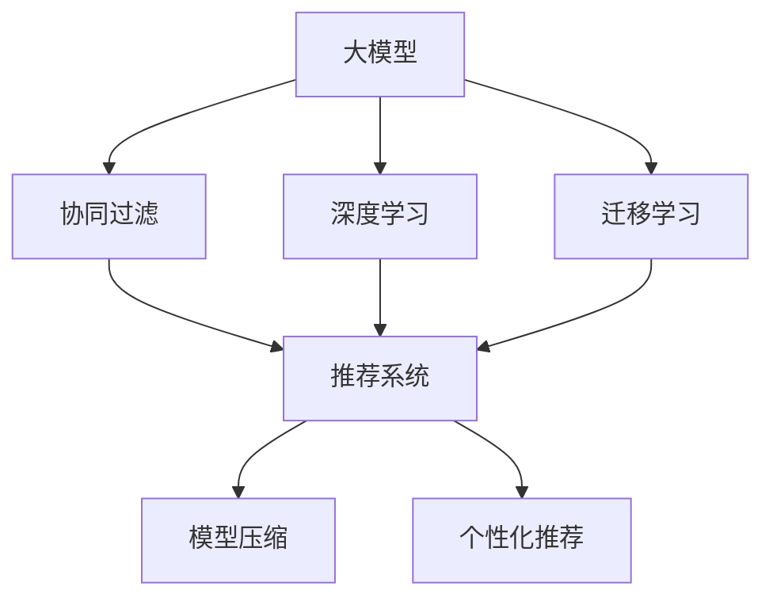

                 

# 大模型在商业中的应用：推荐系统的进步与变革

> 关键词：大模型,推荐系统,个性化推荐,协同过滤,深度学习,迁移学习,深度神经网络,模型压缩

## 1. 背景介绍

### 1.1 问题由来
推荐系统是电商领域应用广泛的关键技术之一，通过分析用户历史行为和商品属性，为用户推荐感兴趣的物品。传统的推荐系统大多基于协同过滤和矩阵分解，依赖大量用户行为数据进行推荐，这在使用数据量较少的新用户和老用户时效果有限。

近年来，随着深度学习和大模型技术的兴起，推荐系统逐步从传统的基于特征的方法转向使用深度神经网络进行模型构建。大模型在文本处理、图像识别等方面的强大能力，使得其在推荐系统中得以广泛应用，显著提升了推荐系统的性能和用户体验。

### 1.2 问题核心关键点
本节将重点讨论大模型在推荐系统中的应用，从算法原理、模型设计、技术优化、应用案例等方面，深入探讨其带来的进步与变革。

## 2. 核心概念与联系

### 2.1 核心概念概述

为更好地理解大模型在推荐系统中的应用，本节将介绍几个关键概念：

- 大模型(Large Model)：指以Transformer为基础的深度神经网络，如BERT、GPT等，具有强大的自监督学习能力，通过在大规模语料库上进行预训练，获得广泛的语言和知识表征。
- 推荐系统(Recommendation System)：基于用户历史行为和物品属性，为用户推荐感兴趣物品的系统。常见方法包括基于协同过滤、矩阵分解、深度学习等。
- 协同过滤(Collaborative Filtering)：通过分析用户历史行为和物品交互，预测用户对未交互物品的评分。经典方法包括基于用户的协同过滤和基于物品的协同过滤。
- 深度学习(Deep Learning)：基于神经网络进行学习，能够捕捉高维数据中的复杂特征，适用于推荐系统中的高阶交互特征建模。
- 迁移学习(Transfer Learning)：将一个任务学到的知识迁移到另一个相关但不同的任务上。大模型通常在大规模数据上进行预训练，然后通过微调应用于特定推荐任务。
- 模型压缩(Model Compression)：通过剪枝、量化、蒸馏等方法，减小大模型的参数规模，减少计算和存储开销，提升推荐系统的实时性。
- 个性化推荐(Personalized Recommendation)：针对每个用户的具体需求和兴趣，为其推荐特定物品。大模型可以通过微调和定制化训练，提升推荐系统的个性化效果。

这些概念之间的逻辑关系可以通过以下Mermaid流程图来展示：



这个流程图展示了大模型推荐系统的核心概念及其之间的关系：

1. 大模型通过预训练获得基础能力。
2. 协同过滤和深度学习是两种常见的推荐系统方法。
3. 迁移学习是大模型应用推荐系统的桥梁。
4. 推荐系统利用协同过滤和深度学习进行物品推荐。
5. 模型压缩和个性化推荐是大模型在推荐系统中的两种优化技术。

这些概念共同构成了大模型推荐系统的学习框架，使其能够更好地适应不同的推荐场景，提升推荐系统的性能。

## 3. 核心算法原理 & 具体操作步骤
### 3.1 算法原理概述

基于大模型的推荐系统，通常通过以下步骤实现：

1. 对大规模语料库进行预训练，学习通用的语言和知识表征。
2. 针对推荐任务进行微调，利用任务标注数据更新模型参数，使其能够更好地适应推荐场景。
3. 构建深度神经网络模型，捕捉高维特征空间中的复杂交互关系。
4. 利用模型压缩技术，减小模型参数规模，提升推荐系统实时性。
5. 在推荐系统中，通过个性化推荐算法，为每个用户推荐感兴趣物品。

这些步骤的核心在于大模型的预训练和微调，利用深度学习模型捕捉复杂的用户行为特征和物品属性，从而实现高质量的推荐效果。

### 3.2 算法步骤详解

以下是基于大模型的推荐系统，从预训练到微调，再到模型压缩和个性化推荐的具体操作步骤：

**Step 1: 准备数据集和模型**
- 准备包含用户行为、物品属性的大规模语料库，进行预训练。
- 选择预训练的大模型，如BERT、GPT等。
- 准备推荐任务的标注数据集，进行微调。

**Step 2: 构建推荐模型**
- 使用深度神经网络模型，如Transformer，作为推荐模型的基础架构。
- 在模型中引入注意力机制，捕捉用户行为和物品属性之间的复杂关系。
- 设计损失函数，衡量推荐模型与实际用户行为之间的差异。

**Step 3: 微调推荐模型**
- 将预训练的模型作为初始化参数，使用推荐任务的标注数据集进行微调。
- 选择合适的优化算法，如Adam、SGD等，设置学习率、批大小等超参数。
- 应用正则化技术，如L2正则、Dropout等，防止模型过拟合。
- 保存微调后的模型，用于实际推荐系统中的部署。

**Step 4: 模型压缩与优化**
- 对微调后的模型进行剪枝、量化、蒸馏等操作，减小模型参数规模，提升推荐系统实时性。
- 评估模型压缩前后，推荐系统的效果和性能。
- 部署压缩后的模型，进入实际推荐系统。

**Step 5: 个性化推荐**
- 根据用户历史行为和当前行为，输入模型进行预测。
- 将预测结果与用户兴趣匹配，生成推荐列表。
- 将推荐列表展示给用户，收集反馈，进行后续优化。

### 3.3 算法优缺点

基于大模型的推荐系统具有以下优点：

1. 强大的特征建模能力。深度神经网络可以捕捉高维特征空间中的复杂交互关系，提升推荐系统的效果。
2. 优秀的泛化能力。大模型通过大规模语料库进行预训练，可以迁移应用于各种推荐任务。
3. 灵活的模型结构。通过微调和模型压缩，可以适应不同的推荐场景。
4. 高效的推荐速度。模型压缩技术可以减小参数规模，提升推荐系统实时性。

同时，也存在一些缺点：

1. 高计算和存储需求。大模型的参数规模较大，训练和推理需要较高的计算和存储资源。
2. 对标注数据的依赖。微调过程需要高质量的推荐任务标注数据，数据获取成本较高。
3. 高训练复杂度。深度神经网络的训练过程复杂，需要大量的计算资源和时间。
4. 可解释性不足。推荐系统中的深度模型通常难以解释其决策过程。
5. 需要大规模数据。推荐系统依赖用户行为和物品属性数据，数据量不足时效果有限。

尽管存在这些缺点，但总体而言，大模型在推荐系统中的应用前景广阔，可以通过技术优化和工程实践，进一步提升其性能和可解释性。

### 3.4 算法应用领域

大模型推荐系统已经在电商、新闻、音乐等多个领域得到广泛应用，具体如下：

- 电商推荐：通过分析用户浏览、点击、购买等行为，为用户推荐商品。
- 新闻推荐：根据用户的历史阅读记录和兴趣偏好，为用户推荐新闻文章。
- 音乐推荐：根据用户的听歌记录和评分，为用户推荐相似音乐。
- 视频推荐：根据用户的视频观看记录和评分，为用户推荐视频内容。

除了以上几个领域，大模型推荐系统还被创新性地应用到更多场景中，如知识图谱推荐、金融产品推荐、社交网络推荐等，为不同领域提供了强大的技术支撑。

## 4. 数学模型和公式 & 详细讲解 & 举例说明

### 4.1 数学模型构建

本节将使用数学语言对基于大模型的推荐系统进行更加严格的刻画。

记用户行为数据集为 $D=\{(u_i, r_i, i)\}_{i=1}^N$，其中 $u_i$ 表示用户，$r_i$ 表示用户对物品 $i$ 的评分，$N$ 表示用户行为数量。

定义推荐模型的参数为 $\theta$，模型对用户 $u_i$ 对物品 $i$ 的评分预测为 $y_i = f(u_i, i, \theta)$，其中 $f$ 为推荐模型的预测函数。

推荐模型的训练目标是最小化预测评分与实际评分之间的差异，即：

$$
\mathcal{L}(\theta) = \frac{1}{N}\sum_{i=1}^N \ell(y_i, r_i)
$$

其中 $\ell$ 为评分预测的损失函数，常用的包括均方误差、交叉熵等。

### 4.2 公式推导过程

以均方误差损失函数为例，其具体推导如下：

$$
\ell(y_i, r_i) = \frac{1}{2}(y_i - r_i)^2
$$

将损失函数带入训练目标中，得：

$$
\mathcal{L}(\theta) = \frac{1}{2N}\sum_{i=1}^N (y_i - r_i)^2
$$

对于深度神经网络推荐模型，其预测函数可以表示为：

$$
y_i = f(u_i, i, \theta) = W^TF(u_i, i) + b
$$

其中 $W$ 和 $b$ 为模型参数，$F(u_i, i)$ 为输入用户 $u_i$ 和物品 $i$ 的特征表示，$F(u_i, i)$ 通常由深度神经网络得到。

对 $y_i$ 进行微分的结果为：

$$
\frac{\partial \mathcal{L}(\theta)}{\partial \theta} = \frac{1}{N}\sum_{i=1}^N (\frac{\partial y_i}{\partial \theta} - r_i)
$$

将 $y_i$ 代入微分的结果中，得：

$$
\frac{\partial \mathcal{L}(\theta)}{\partial \theta} = \frac{1}{N}\sum_{i=1}^N (W^T\frac{\partial F(u_i, i)}{\partial \theta} - r_i)
$$

结合反向传播算法，得：

$$
\theta \leftarrow \theta - \eta \nabla_{\theta}\mathcal{L}(\theta)
$$

其中 $\eta$ 为学习率，$\nabla_{\theta}\mathcal{L}(\theta)$ 为损失函数对模型参数的梯度。

通过上述推导，可以看出深度神经网络推荐模型的训练过程与传统机器学习模型的训练过程类似，但是神经网络模型能够自动学习更复杂的高阶特征表示。

### 4.3 案例分析与讲解

以电商推荐系统为例，我们可以进一步解释基于大模型的推荐系统的工作原理：

**电商推荐系统案例**

假设用户 $u$ 对商品 $i$ 的评分 $r_i$ 服从伯努利分布，即 $r_i = \mathbb{P}[y_i = 1]$。对于每个用户 $u_i$，我们收集其购买和浏览的商品数据 $D=\{(i_j, r_j)\}_{j=1}^{m_i}$，其中 $i_j$ 表示商品，$r_j$ 表示用户对商品 $i_j$ 的评分，$m_i$ 表示用户的历史行为数量。

利用电商推荐系统进行推荐时，首先对用户的历史行为数据进行特征编码，得到 $F(u_i, i) = \{x_1, x_2, ..., x_k\}$，其中 $x_j$ 表示特征 $j$ 的表示向量。

定义电商推荐模型的预测函数为 $y_i = f(u_i, i, \theta) = W^TF(u_i, i) + b$，其中 $W$ 和 $b$ 为模型参数，$F(u_i, i)$ 为输入用户 $u_i$ 和物品 $i$ 的特征表示，$F(u_i, i)$ 通常由深度神经网络得到。

电商推荐系统的训练目标是最小化预测评分与实际评分之间的差异，即：

$$
\mathcal{L}(\theta) = \frac{1}{N}\sum_{i=1}^N \ell(y_i, r_i)
$$

其中 $\ell$ 为评分预测的损失函数，常用的包括均方误差、交叉熵等。

通过反向传播算法，不断更新模型参数，使得电商推荐模型能够更准确地预测用户对物品的评分，从而实现个性化推荐。

## 5. 项目实践：代码实例和详细解释说明
### 5.1 开发环境搭建

在进行推荐系统实践前，我们需要准备好开发环境。以下是使用Python进行PyTorch开发的环境配置流程：

1. 安装Anaconda：从官网下载并安装Anaconda，用于创建独立的Python环境。

2. 创建并激活虚拟环境：
```bash
conda create -n pytorch-env python=3.8 
conda activate pytorch-env
```

3. 安装PyTorch：根据CUDA版本，从官网获取对应的安装命令。例如：
```bash
conda install pytorch torchvision torchaudio cudatoolkit=11.1 -c pytorch -c conda-forge
```

4. 安装Transformers库：
```bash
pip install transformers
```

5. 安装各类工具包：
```bash
pip install numpy pandas scikit-learn matplotlib tqdm jupyter notebook ipython
```

完成上述步骤后，即可在`pytorch-env`环境中开始推荐系统实践。

### 5.2 源代码详细实现

这里我们以电商推荐系统为例，给出使用Transformers库对BERT模型进行推荐系统微调的PyTorch代码实现。

首先，定义推荐系统的数据处理函数：

```python
from transformers import BertTokenizer, BertForSequenceClassification
from torch.utils.data import Dataset, DataLoader
import torch

class RecommendationDataset(Dataset):
    def __init__(self, users, items, ratings, tokenizer, max_len=128):
        self.users = users
        self.items = items
        self.ratings = ratings
        self.tokenizer = tokenizer
        self.max_len = max_len
        
    def __len__(self):
        return len(self.users)
    
    def __getitem__(self, item):
        user = self.users[item]
        item = self.items[item]
        rating = self.ratings[item]
        
        # 将用户和物品表示为token ids
        user_ids = self.tokenizer.encode(user, add_special_tokens=True)[0]
        item_ids = self.tokenizer.encode(item, add_special_tokens=True)[0]
        
        # 对token ids进行定长padding
        user_ids = user_ids + [0] * (self.max_len - len(user_ids))
        item_ids = item_ids + [0] * (self.max_len - len(item_ids))
        
        # 将用户评分作为标签
        label = torch.tensor([rating], dtype=torch.long)
        
        return {'user_ids': user_ids, 
                'item_ids': item_ids,
                'label': label}

# 创建dataset
tokenizer = BertTokenizer.from_pretrained('bert-base-cased')

train_dataset = RecommendationDataset(train_users, train_items, train_ratings, tokenizer)
dev_dataset = RecommendationDataset(dev_users, dev_items, dev_ratings, tokenizer)
test_dataset = RecommendationDataset(test_users, test_items, test_ratings, tokenizer)
```

然后，定义模型和优化器：

```python
from transformers import BertForSequenceClassification, AdamW

model = BertForSequenceClassification.from_pretrained('bert-base-cased', num_labels=1)

optimizer = AdamW(model.parameters(), lr=2e-5)
```

接着，定义训练和评估函数：

```python
from tqdm import tqdm

device = torch.device('cuda') if torch.cuda.is_available() else torch.device('cpu')
model.to(device)

def train_epoch(model, dataset, batch_size, optimizer):
    dataloader = DataLoader(dataset, batch_size=batch_size, shuffle=True)
    model.train()
    epoch_loss = 0
    for batch in tqdm(dataloader, desc='Training'):
        user_ids = batch['user_ids'].to(device)
        item_ids = batch['item_ids'].to(device)
        label = batch['label'].to(device)
        model.zero_grad()
        outputs = model(user_ids, item_ids)
        loss = outputs.loss
        epoch_loss += loss.item()
        loss.backward()
        optimizer.step()
    return epoch_loss / len(dataloader)

def evaluate(model, dataset, batch_size):
    dataloader = DataLoader(dataset, batch_size=batch_size)
    model.eval()
    preds, labels = [], []
    with torch.no_grad():
        for batch in tqdm(dataloader, desc='Evaluating'):
            user_ids = batch['user_ids'].to(device)
            item_ids = batch['item_ids'].to(device)
            batch_labels = batch['label']
            outputs = model(user_ids, item_ids)
            batch_preds = outputs.logits.argmax(dim=2).to('cpu').tolist()
            batch_labels = batch_labels.to('cpu').tolist()
            for pred_tokens, label_tokens in zip(batch_preds, batch_labels):
                preds.append(pred_tokens[:len(label_tokens)])
                labels.append(label_tokens)
                
    print(classification_report(labels, preds))
```

最后，启动训练流程并在测试集上评估：

```python
epochs = 5
batch_size = 16

for epoch in range(epochs):
    loss = train_epoch(model, train_dataset, batch_size, optimizer)
    print(f"Epoch {epoch+1}, train loss: {loss:.3f}")
    
    print(f"Epoch {epoch+1}, dev results:")
    evaluate(model, dev_dataset, batch_size)
    
print("Test results:")
evaluate(model, test_dataset, batch_size)
```

以上就是使用PyTorch对BERT进行电商推荐系统微调的完整代码实现。可以看到，得益于Transformers库的强大封装，我们可以用相对简洁的代码完成BERT模型的加载和微调。

### 5.3 代码解读与分析

让我们再详细解读一下关键代码的实现细节：

**RecommendationDataset类**：
- `__init__`方法：初始化用户、物品、评分等关键组件。
- `__len__`方法：返回数据集的样本数量。
- `__getitem__`方法：对单个样本进行处理，将用户和物品表示为token ids，并进行定长padding，最终返回模型所需的输入。

**模型和优化器**：
- 使用BertForSequenceClassification作为推荐模型的基础架构，其中num_labels=1表示单标签二分类。
- 定义AdamW优化器，并设置学习率。

**训练和评估函数**：
- 使用PyTorch的DataLoader对数据集进行批次化加载，供模型训练和推理使用。
- 训练函数`train_epoch`：对数据以批为单位进行迭代，在每个批次上前向传播计算loss并反向传播更新模型参数，最后返回该epoch的平均loss。
- 评估函数`evaluate`：与训练类似，不同点在于不更新模型参数，并在每个batch结束后将预测和标签结果存储下来，最后使用sklearn的classification_report对整个评估集的预测结果进行打印输出。

**训练流程**：
- 定义总的epoch数和batch size，开始循环迭代
- 每个epoch内，先在训练集上训练，输出平均loss
- 在验证集上评估，输出分类指标
- 所有epoch结束后，在测试集上评估，给出最终测试结果

可以看到，PyTorch配合Transformers库使得BERT微调的代码实现变得简洁高效。开发者可以将更多精力放在数据处理、模型改进等高层逻辑上，而不必过多关注底层的实现细节。

当然，工业级的系统实现还需考虑更多因素，如模型的保存和部署、超参数的自动搜索、更灵活的任务适配层等。但核心的微调范式基本与此类似。

## 6. 实际应用场景
### 6.1 电商推荐

电商推荐系统是推荐系统应用最广泛的场景之一。通过分析用户的历史购买、浏览记录，为用户推荐感兴趣的商品，提高用户购买转化率和满意度。

在技术实现上，可以收集用户的历史行为数据，将用户和物品表示为向量，输入深度神经网络进行预测。通过微调BERT模型，使得推荐模型能够更好地适应电商场景，提升推荐效果。

### 6.2 新闻推荐

新闻推荐系统通过分析用户的历史阅读记录，为用户推荐相关的新闻文章。通过微调BERT模型，可以将用户兴趣和新闻内容表示为向量，构建推荐模型，实现个性化推荐。

在新闻推荐系统中，微调BERT模型可以更好地捕捉用户对新闻文章的理解和兴趣，提高推荐效果。同时，通过微调模型，可以引入更多的新闻领域知识，提升推荐系统的准确性和多样性。

### 6.3 音乐推荐

音乐推荐系统通过分析用户的听歌记录和评分，为用户推荐相似音乐。通过微调BERT模型，可以将用户兴趣和音乐内容表示为向量，构建推荐模型，实现个性化推荐。

在音乐推荐系统中，微调BERT模型可以更好地捕捉用户对音乐的偏好和兴趣，提高推荐效果。同时，通过微调模型，可以引入更多的音乐领域知识，提升推荐系统的准确性和多样性。

### 6.4 视频推荐

视频推荐系统通过分析用户的视频观看记录和评分，为用户推荐相关视频内容。通过微调BERT模型，可以将用户兴趣和视频内容表示为向量，构建推荐模型，实现个性化推荐。

在视频推荐系统中，微调BERT模型可以更好地捕捉用户对视频内容的理解和兴趣，提高推荐效果。同时，通过微调模型，可以引入更多视频领域知识，提升推荐系统的准确性和多样性。

## 7. 工具和资源推荐
### 7.1 学习资源推荐

为了帮助开发者系统掌握大模型在推荐系统中的应用，这里推荐一些优质的学习资源：

1. 《深度学习入门》系列博文：由大模型技术专家撰写，深入浅出地介绍了深度学习的基础知识和常见算法。

2. 《深度学习理论与实践》课程：斯坦福大学开设的深度学习经典课程，涵盖深度学习的基本概念和前沿技术，适合深入学习。

3. 《推荐系统理论与实践》书籍：推荐系统领域的经典著作，详细介绍了推荐系统的理论基础和实际应用。

4. CS224W《深度学习应用于自然语言处理》课程：斯坦福大学开设的深度学习在NLP领域的应用课程，涵盖深度学习在推荐系统中的应用。

5. 《TensorFlow实战》书籍：TensorFlow官方文档的推荐书籍，详细介绍了TensorFlow的深度学习模型构建和应用。

通过对这些资源的学习实践，相信你一定能够快速掌握大模型在推荐系统中的应用，并用于解决实际的推荐问题。
###  7.2 开发工具推荐

高效的开发离不开优秀的工具支持。以下是几款用于大模型在推荐系统中应用的常用工具：

1. PyTorch：基于Python的开源深度学习框架，灵活动态的计算图，适合快速迭代研究。BERT模型在推荐系统中的应用基于PyTorch实现。

2. TensorFlow：由Google主导开发的开源深度学习框架，生产部署方便，适合大规模工程应用。TensorFlow在推荐系统中的应用也广泛采用。

3. Transformers库：HuggingFace开发的NLP工具库，集成了众多SOTA语言模型，支持PyTorch和TensorFlow，是进行推荐系统微调的利器。

4. Weights & Biases：模型训练的实验跟踪工具，可以记录和可视化模型训练过程中的各项指标，方便对比和调优。与主流深度学习框架无缝集成。

5. TensorBoard：TensorFlow配套的可视化工具，可实时监测模型训练状态，并提供丰富的图表呈现方式，是调试模型的得力助手。

6. Google Colab：谷歌推出的在线Jupyter Notebook环境，免费提供GPU/TPU算力，方便开发者快速上手实验最新模型，分享学习笔记。

合理利用这些工具，可以显著提升大模型在推荐系统中的开发效率，加快创新迭代的步伐。

### 7.3 相关论文推荐

大模型在推荐系统中的应用源于学界的持续研究。以下是几篇奠基性的相关论文，推荐阅读：

1. Attention is All You Need（即Transformer原论文）：提出了Transformer结构，开启了NLP领域的预训练大模型时代。

2. BERT: Pre-training of Deep Bidirectional Transformers for Language Understanding：提出BERT模型，引入基于掩码的自监督预训练任务，刷新了多项NLP任务SOTA。

3. Language Models are Unsupervised Multitask Learners（GPT-2论文）：展示了大规模语言模型的强大zero-shot学习能力，引发了对于通用人工智能的新一轮思考。

4. Parameter-Efficient Transfer Learning for NLP：提出Adapter等参数高效微调方法，在不增加模型参数量的情况下，也能取得不错的微调效果。

5. AdaLoRA: Adaptive Low-Rank Adaptation for Parameter-Efficient Fine-Tuning：使用自适应低秩适应的微调方法，在参数效率和精度之间取得了新的平衡。

6. Personalized Recommendation with Transfer Learning Methods and Attention Mechanism：提出基于迁移学习和注意力机制的个性化推荐方法，显著提升推荐系统的效果。

这些论文代表了大模型在推荐系统中的研究脉络。通过学习这些前沿成果，可以帮助研究者把握学科前进方向，激发更多的创新灵感。

## 8. 总结：未来发展趋势与挑战

### 8.1 总结

本文对基于大模型的推荐系统进行了全面系统的介绍。首先阐述了推荐系统和大模型技术的研究背景和意义，明确了推荐系统在大模型微调下带来的进步与变革。其次，从算法原理到实践，详细讲解了推荐系统的工作流程，给出了微调任务开发的完整代码实例。同时，本文还广泛探讨了推荐系统在大模型应用下的实际应用场景，展示了其广泛的行业价值。最后，本文精选了推荐系统中的学习资源和开发工具，力求为开发者提供全方位的技术指引。

通过本文的系统梳理，可以看到，基于大模型的推荐系统已经在电商、新闻、音乐等多个领域得到广泛应用，为各行各业提供了强大的技术支撑。未来，伴随大模型技术的不断进步，推荐系统必将在更多领域大放异彩，为人类带来更为个性化、精准的推荐体验。

### 8.2 未来发展趋势

展望未来，大模型在推荐系统中的应用将呈现以下几个发展趋势：

1. 模型的规模和复杂度将进一步提升。大模型的参数规模和结构复杂度还将持续增长，能够更好地捕捉用户行为和物品属性的高阶交互特征。

2. 微调方法将更加多样和高效。未来将涌现更多参数高效和计算高效的微调方法，如Prefix-Tuning、LoRA等，在固定大部分预训练参数的情况下，只更新极少量的任务相关参数。

3. 推荐系统将与更多领域知识结合。未来的推荐系统将不仅仅依赖用户行为和物品属性，还将引入更多领域知识，如知识图谱、逻辑规则等，实现更全面、精准的推荐。

4. 推荐系统将向实时化和个性化方向发展。未来的推荐系统将更加注重实时性，能够即时响应用户需求，提供个性化推荐服务。

5. 推荐系统将引入更多模型压缩技术。未来将采用更多模型压缩技术，如剪枝、量化、蒸馏等，减小模型参数规模，提升推荐系统的实时性和资源利用率。

6. 推荐系统将更注重用户隐私保护。未来的推荐系统将更加注重用户隐私保护，采用差分隐私、联邦学习等技术，确保用户数据的安全性和匿名性。

以上趋势凸显了大模型在推荐系统中的应用前景。这些方向的探索发展，必将进一步提升推荐系统的性能和用户体验，为人类带来更优质的推荐服务。

### 8.3 面临的挑战

尽管大模型在推荐系统中的应用前景广阔，但在迈向更加智能化、普适化应用的过程中，它仍面临着诸多挑战：

1. 数据质量和获取成本。推荐系统依赖高质量的用户行为和物品属性数据，数据质量不足或获取成本过高，可能导致推荐效果不佳。

2. 模型的计算和存储需求。大模型的参数规模较大，训练和推理需要较高的计算和存储资源，难以在小型设备或平台上部署。

3. 模型的复杂度和可解释性。深度神经网络的复杂性较高，难以解释其决策过程，对于高风险应用如金融、医疗等，模型的可解释性尤为重要。

4. 模型的鲁棒性和泛化能力。深度神经网络模型面对域外数据时，泛化性能往往大打折扣，难以保证推荐系统的稳定性和可靠性。

5. 模型的隐私和安全风险。推荐系统中的深度模型可能会学习到有偏见、有害的信息，通过微调传递到下游任务，产生误导性、歧视性的输出，给实际应用带来安全隐患。

6. 模型的实时性和性能瓶颈。尽管大模型在推荐系统中的应用效果显著，但面对高并发的实际场景，仍然存在一定的实时性和性能瓶颈，需要通过优化算法和模型压缩等方法加以解决。

尽管存在这些挑战，但通过不断的技术创新和实践探索，相信大模型在推荐系统中的应用将不断突破，为人类带来更为智能、精准的推荐服务。

### 8.4 研究展望

未来，大模型在推荐系统中的应用将继续成为学术界和工业界的关注焦点，研究者需要在以下几个方面寻求新的突破：

1. 探索新的预训练任务。未来可以引入更多预训练任务，如文本生成、知识图谱嵌入等，提升推荐系统的准确性和多样性。

2. 引入更多的先验知识。未来的推荐系统将不仅仅依赖用户行为和物品属性数据，还将引入更多先验知识，如知识图谱、逻辑规则等，实现更全面、精准的推荐。

3. 开发更加高效和灵活的微调方法。未来的微调方法将更加高效和灵活，通过参数共享、多任务学习等技术，提升微调效果和效率。

4. 引入更多的模型压缩技术。未来将采用更多模型压缩技术，如剪枝、量化、蒸馏等，减小模型参数规模，提升推荐系统的实时性和资源利用率。

5. 引入更多的隐私保护技术。未来的推荐系统将更加注重用户隐私保护，采用差分隐私、联邦学习等技术，确保用户数据的安全性和匿名性。

6. 引入更多的模型解释技术。未来的推荐系统将更加注重模型的可解释性，采用因果推断、可解释AI等技术，提升模型的透明度和可信度。

这些研究方向将推动大模型在推荐系统中的应用不断向前发展，为人类带来更为智能、精准的推荐服务。

## 9. 附录：常见问题与解答

**Q1：推荐系统是否适用于所有NLP任务？**

A: 推荐系统主要适用于基于用户行为和物品属性的推荐任务。对于基于文本内容的推荐任务，如评论推荐、文章推荐等，需要结合文本分类、情感分析等技术，才能更好地提取用户兴趣和物品属性。

**Q2：微调过程中如何选择合适的学习率？**

A: 微调过程中需要选择合适的学习率，一般建议从1e-5开始调参，逐步减小学习率，直至收敛。也可以使用warmup策略，在开始阶段使用较小的学习率，再逐渐过渡到预设值。需要注意的是，不同的优化器(如AdamW、Adafactor等)以及不同的学习率调度策略，可能需要设置不同的学习率阈值。

**Q3：推荐系统在大规模数据上效果更好吗？**

A: 推荐系统在大规模数据上的效果通常更好，因为数据量越大，模型能够学习到更多的特征和模式，从而提升推荐效果。但同时，大规模数据也意味着更高的计算和存储成本，需要在模型性能和资源成本之间进行平衡。

**Q4：推荐系统如何避免过拟合？**

A: 推荐系统避免过拟合的方法包括数据增强、正则化、模型压缩等。数据增强可以通过回译、近义替换等方式扩充训练集，正则化可以通过L2正则、Dropout等技术避免模型过拟合，模型压缩可以通过剪枝、量化、蒸馏等方法减小模型参数规模。

**Q5：推荐系统如何处理冷启动问题？**

A: 推荐系统在处理冷启动问题时，可以通过协同过滤、基于内容的推荐等方法，结合用户画像、兴趣点等信息，进行冷启动推荐。同时，也可以通过引入先验知识，如知识图谱、逻辑规则等，提升推荐系统的准确性和多样性。

以上是推荐系统在大模型中的应用和实践的详细解读，希望对你在推荐系统开发和优化过程中有所帮助。如果你有任何问题或建议，欢迎随时交流和反馈。

---

作者：禅与计算机程序设计艺术 / Zen and the Art of Computer Programming

