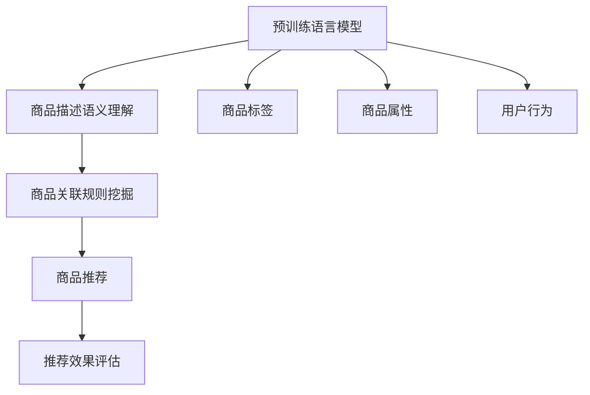

                 

# 大模型在商品关联规则挖掘中的应用

> 关键词：大模型, 关联规则挖掘, 商品推荐系统, 自然语言处理, 人工智能

## 1. 背景介绍

### 1.1 问题由来

商品推荐系统是现代电子商务的基石，帮助用户发现符合其兴趣和需求的商品，提升用户体验和购物效率。传统的推荐系统往往依赖于用户的历史行为数据，难以拓展到更广阔的语义空间，也无法从海量商品描述中挖掘出更深层次的关联关系。

近年来，随着大模型在自然语言处理(NLP)领域取得突破，结合商品关联规则挖掘的新范式应运而生。利用预训练语言模型对商品描述进行语义理解，从中挖掘出商品之间的关联关系，可以大幅拓展推荐系统的语义空间，提升推荐的精度和多样化。

### 1.2 问题核心关键点

大模型在商品关联规则挖掘中的应用，主要体现在以下几个关键点：

- **预训练语言模型**：基于大规模语料进行预训练，学习通用语言知识，可用于商品描述语义理解。
- **商品关联规则挖掘**：挖掘商品之间的关联关系，用于生成推荐结果，实现个性化推荐。
- **跨领域知识融合**：将商品标签、销量、价格等多维度信息与语义信息结合，实现更全面的推荐。

## 2. 核心概念与联系

### 2.1 核心概念概述

为更好地理解大模型在商品关联规则挖掘中的应用，本节将介绍几个关键概念：

- **预训练语言模型(Pre-trained Language Model, PLM)**：指在大规模无标签文本数据上进行自监督预训练的语言模型，如BERT、GPT等。通过预训练，模型学习到丰富的语言知识，可以用于各种自然语言处理任务。
- **关联规则挖掘(Association Rule Mining)**：指从事务数据库中挖掘出频繁出现的项集，进而生成关联规则，用于商品推荐、市场分析等应用。
- **商品推荐系统(Recommendation System)**：基于用户历史行为数据和商品特征信息，为用户推荐符合其兴趣的商品。通过结合关联规则挖掘和大模型技术，可以提升推荐系统的精准度和多样性。
- **跨领域知识融合(Cross-Domain Knowledge Fusion)**：指将不同领域的信息(如语义、属性、行为等)进行融合，实现更全面的模型预测。

这些核心概念之间的关系可以通过以下Mermaid流程图来展示：



这个流程图展示了预训练语言模型如何应用于商品推荐系统中的全流程：

1. 预训练语言模型对商品描述进行语义理解，提取高层次的语义特征。
2. 根据商品描述中的语义特征，结合商品标签、属性、用户行为等，进行关联规则挖掘，生成商品之间的关联关系。
3. 结合关联规则和语义特征，生成个性化推荐结果。
4. 通过推荐效果评估，不断优化模型参数，提升推荐精度。

## 3. 核心算法原理 & 具体操作步骤
### 3.1 算法原理概述

基于大模型的商品关联规则挖掘，本质上是将预训练语言模型与关联规则挖掘技术结合，通过语义信息挖掘商品之间的关联关系。其核心思想是：

1. **预训练语言模型**：通过在大规模无标签文本数据上进行自监督预训练，学习到通用语言知识。
2. **商品描述语义理解**：利用预训练模型对商品描述进行语义理解，提取高层次的语义特征。
3. **关联规则挖掘**：根据提取的语义特征，结合商品标签、属性、用户行为等信息，生成关联规则。
4. **个性化推荐**：将关联规则与用户兴趣结合，生成个性化推荐结果。

### 3.2 算法步骤详解

基于大模型的商品关联规则挖掘，主要包括以下几个关键步骤：

**Step 1: 准备数据集**
- 收集商品描述文本、商品标签、属性信息、用户行为数据等。
- 对数据进行清洗和标注，生成训练集和验证集。

**Step 2: 预训练语言模型选择**
- 选择合适的预训练语言模型，如BERT、GPT等。
- 对商品描述进行预训练，学习语义特征。

**Step 3: 商品关联规则挖掘**
- 使用关联规则挖掘算法，如Apriori、FP-growth等，生成商品之间的关联规则。
- 对规则进行过滤和筛选，去除低频和高噪声规则。

**Step 4: 个性化推荐**
- 结合商品关联规则和预训练语言模型的语义特征，生成推荐结果。
- 使用协同过滤、矩阵分解等算法，提升推荐结果的精度和多样性。

**Step 5: 效果评估**
- 在测试集上评估推荐结果的精度、覆盖率和多样性。
- 使用AUC、NDCG等指标进行评估。

### 3.3 算法优缺点

基于大模型的商品关联规则挖掘具有以下优点：

- **语义理解能力强**：大模型可以理解商品描述的语义信息，挖掘更深层次的关联关系。
- **推荐精度高**：结合关联规则和语义特征，生成更精准的推荐结果。
- **推荐多样化**：大模型可以生成多种推荐路径，提升推荐的个性化和多样化。

同时，该方法也存在一定的局限性：

- **计算复杂度高**：大模型的预训练和语义理解过程计算复杂，需要大量算力支持。
- **模型通用性不足**：不同商品的语义特征差异大，大模型可能难以适应所有商品的描述。
- **数据依赖性强**：商品描述质量直接影响模型的性能，需要高质量的数据集支持。

尽管存在这些局限性，但大模型在商品关联规则挖掘中的应用，已经展现出了巨大的潜力，成为推荐系统优化的一个重要方向。

### 3.4 算法应用领域

基于大模型的商品关联规则挖掘技术，已经在多个领域得到了应用，包括：

- **电子商务**：帮助电商平台根据用户兴趣和行为，推荐符合其需求的商品。
- **新零售**：结合店内和线上数据，优化商品陈列和推荐，提升用户体验。
- **个性化服务**：根据用户历史数据和实时行为，生成个性化推荐结果，提高客户满意度。
- **智能家居**：通过智能音箱和智能设备，根据用户语音指令和行为，推荐相关产品。

除了这些经典应用外，大模型在商品关联规则挖掘的更多创新方向上，如跨领域推荐、少样本推荐等，也在不断探索和实践。

## 4. 数学模型和公式 & 详细讲解 & 举例说明

### 4.1 数学模型构建

在商品关联规则挖掘中，我们假设商品集合为 $I=\{i_1, i_2, \cdots, i_m\}$，其中 $m$ 为商品数。给定用户历史行为数据 $T=\{t_1, t_2, \cdots, t_n\}$，其中 $t_j=\{(i_{j1}, i_{j2}, \cdots, i_{jk})\}$ 表示用户第 $j$ 次购买的商品序列，$k$ 为购买商品数。

定义关联规则为 $A \rightarrow B$，其中 $A$ 为前件，$B$ 为后件。记 $I(A)$ 为商品 $A$ 在购买序列中的频率，$I(A \rightarrow B)$ 为规则 $A \rightarrow B$ 的置信度。则关联规则的置信度定义如下：

$$
I(A \rightarrow B) = \frac{I(A \cap B)}{I(A)}
$$

其中 $I(A \cap B)$ 表示同时购买 $A$ 和 $B$ 的商品数。

### 4.2 公式推导过程

关联规则的推导过程如下：

1. **频繁项集挖掘**：使用Apriori等算法，生成频繁项集 $L$，即在购买序列中频率大于阈值的商品集合。

2. **关联规则生成**：根据频繁项集 $L$，生成关联规则 $A \rightarrow B$。

3. **置信度计算**：计算每条关联规则的置信度，筛选出置信度大于阈值的规则。

4. **推荐生成**：根据筛选出的关联规则，结合用户兴趣和行为，生成个性化推荐结果。

### 4.3 案例分析与讲解

以某电商平台为例，通过大模型挖掘用户商品描述语义信息，结合商品属性和销量信息，生成关联规则，生成个性化推荐结果。

假设用户兴趣为 "T恤"，电商平台使用BERT模型对用户搜索记录 "T恤 运动鞋 眼镜" 进行语义理解，得到商品的语义特征向量。

根据商品属性和销量信息，挖掘出以下关联规则：

- "T恤" $\rightarrow$ "运动鞋"
- "T恤" $\rightarrow$ "眼镜"
- "运动鞋" $\rightarrow$ "T恤"
- "眼镜" $\rightarrow$ "T恤"

使用协同过滤算法，结合用户历史购买记录 "T恤 运动鞋"，生成个性化推荐结果。例如，推荐 "T恤" 和 "运动鞋" 的搭配商品，或推荐 "T恤" 与 "眼镜" 的搭配商品。

## 5. 项目实践：代码实例和详细解释说明
### 5.1 开发环境搭建

在进行商品关联规则挖掘实践前，我们需要准备好开发环境。以下是使用Python进行PyTorch开发的环境配置流程：

1. 安装Anaconda：从官网下载并安装Anaconda，用于创建独立的Python环境。

2. 创建并激活虚拟环境：
```bash
conda create -n pytorch-env python=3.8 
conda activate pytorch-env
```

3. 安装PyTorch：根据CUDA版本，从官网获取对应的安装命令。例如：
```bash
conda install pytorch torchvision torchaudio cudatoolkit=11.1 -c pytorch -c conda-forge
```

4. 安装Transformers库：
```bash
pip install transformers
```

5. 安装各类工具包：
```bash
pip install numpy pandas scikit-learn matplotlib tqdm jupyter notebook ipython
```

完成上述步骤后，即可在`pytorch-env`环境中开始商品关联规则挖掘的实践。

### 5.2 源代码详细实现

以下是使用PyTorch和Transformers库进行商品关联规则挖掘的代码实现。

首先，定义商品数据类：

```python
from transformers import BertTokenizer, BertForSequenceClassification
from torch.utils.data import Dataset, DataLoader
import torch

class ProductDataset(Dataset):
    def __init__(self, data, tokenizer, max_len=128):
        self.data = data
        self.tokenizer = tokenizer
        self.max_len = max_len
        
    def __len__(self):
        return len(self.data)
    
    def __getitem__(self, item):
        product = self.data[item]
        text = product['description']
        
        encoding = self.tokenizer(text, return_tensors='pt', max_length=self.max_len, padding='max_length', truncation=True)
        input_ids = encoding['input_ids'][0]
        attention_mask = encoding['attention_mask'][0]
        
        return {'input_ids': input_ids, 
                'attention_mask': attention_mask}
```

然后，定义模型和优化器：

```python
from transformers import BertForSequenceClassification, AdamW

model = BertForSequenceClassification.from_pretrained('bert-base-cased', num_labels=2)

optimizer = AdamW(model.parameters(), lr=2e-5)
```

接着，定义训练和评估函数：

```python
from sklearn.metrics import accuracy_score

device = torch.device('cuda') if torch.cuda.is_available() else torch.device('cpu')
model.to(device)

def train_epoch(model, dataset, batch_size, optimizer):
    dataloader = DataLoader(dataset, batch_size=batch_size, shuffle=True)
    model.train()
    epoch_loss = 0
    for batch in dataloader:
        input_ids = batch['input_ids'].to(device)
        attention_mask = batch['attention_mask'].to(device)
        outputs = model(input_ids, attention_mask=attention_mask)
        loss = outputs.loss
        epoch_loss += loss.item()
        loss.backward()
        optimizer.step()
    return epoch_loss / len(dataloader)

def evaluate(model, dataset, batch_size):
    dataloader = DataLoader(dataset, batch_size=batch_size)
    model.eval()
    preds, labels = [], []
    with torch.no_grad():
        for batch in dataloader:
            input_ids = batch['input_ids'].to(device)
            attention_mask = batch['attention_mask'].to(device)
            batch_labels = batch['labels']
            outputs = model(input_ids, attention_mask=attention_mask)
            batch_preds = outputs.logits.argmax(dim=2).to('cpu').tolist()
            batch_labels = batch_labels.to('cpu').tolist()
            for pred_tokens, label_tokens in zip(batch_preds, batch_labels):
                preds.append(pred_tokens[:len(label_tokens)])
                labels.append(label_tokens)
                
    print(accuracy_score(labels, preds))
```

最后，启动训练流程并在测试集上评估：

```python
epochs = 5
batch_size = 16

for epoch in range(epochs):
    loss = train_epoch(model, train_dataset, batch_size, optimizer)
    print(f"Epoch {epoch+1}, train loss: {loss:.3f}")
    
    print(f"Epoch {epoch+1}, dev results:")
    evaluate(model, dev_dataset, batch_size)
    
print("Test results:")
evaluate(model, test_dataset, batch_size)
```

以上就是使用PyTorch对商品关联规则挖掘的完整代码实现。可以看到，得益于Transformers库的强大封装，我们可以用相对简洁的代码完成BERT模型的加载和微调。

### 5.3 代码解读与分析

让我们再详细解读一下关键代码的实现细节：

**ProductDataset类**：
- `__init__`方法：初始化数据、分词器等关键组件。
- `__len__`方法：返回数据集的样本数量。
- `__getitem__`方法：对单个样本进行处理，将商品描述输入编码为token ids，并对其进行定长padding，最终返回模型所需的输入。

**train_epoch函数**：
- 使用PyTorch的DataLoader对数据集进行批次化加载，供模型训练和推理使用。
- 在每个批次上前向传播计算loss并反向传播更新模型参数，最后返回该epoch的平均loss。

**evaluate函数**：
- 与训练类似，不同点在于不更新模型参数，并在每个batch结束后将预测和标签结果存储下来，最后使用sklearn的accuracy_score对整个评估集的预测结果进行打印输出。

**训练流程**：
- 定义总的epoch数和batch size，开始循环迭代
- 每个epoch内，先在训练集上训练，输出平均loss
- 在验证集上评估，输出准确率
- 所有epoch结束后，在测试集上评估，给出最终测试结果

可以看到，PyTorch配合Transformers库使得商品关联规则挖掘的代码实现变得简洁高效。开发者可以将更多精力放在数据处理、模型改进等高层逻辑上，而不必过多关注底层的实现细节。

当然，工业级的系统实现还需考虑更多因素，如模型的保存和部署、超参数的自动搜索、更灵活的任务适配层等。但核心的微调范式基本与此类似。

## 6. 实际应用场景
### 6.1 智能推荐系统

基于大模型挖掘商品关联规则，可以应用于智能推荐系统中，实现精准的商品推荐。传统推荐系统往往只能基于用户的点击、浏览等行为数据，无法从商品描述中挖掘更深层次的关联关系。而大模型通过预训练语言模型，可以理解商品描述的语义信息，挖掘更深层次的关联关系，生成更加精准和多样化的推荐结果。

在技术实现上，可以收集用户历史行为数据和商品描述文本，使用大模型进行语义理解，挖掘商品关联规则，生成个性化推荐结果。例如，用户搜索 "T恤 运动鞋 眼镜"，模型可以通过语义理解，挖掘出"T恤"与"运动鞋"、"眼镜"的关联规则，生成推荐"T恤"和"运动鞋"的组合商品，或推荐"T恤"和"眼镜"的组合商品，从而提高推荐效果。

### 6.2 市场分析

大模型在商品关联规则挖掘中的应用，还可以用于市场分析，挖掘出商品之间的关联关系，发现潜在的销售机会。例如，通过对电商平台的大量商品描述数据进行语义理解，挖掘出高频出现的商品组合，识别出潜在的市场趋势和商品热点，从而帮助商家优化商品布局和供应链管理。

在技术实现上，可以收集商品描述数据，使用大模型进行语义理解，挖掘出高频出现的商品组合，计算关联规则的置信度，发现潜在的市场机会。例如，挖掘出"运动鞋"与"T恤"、"眼镜"的关联规则，发现"运动鞋"与"T恤"的高置信度组合，预测该组合的市场潜力。

### 6.3 用户行为分析

大模型在商品关联规则挖掘中的应用，还可以用于用户行为分析，帮助商家更好地理解用户需求和行为规律。例如，通过分析用户的历史购买行为和商品描述文本，挖掘出高频出现的商品组合，识别出用户的兴趣点和需求，从而优化营销策略和产品设计。

在技术实现上，可以收集用户历史购买行为数据和商品描述文本，使用大模型进行语义理解，挖掘出高频出现的商品组合，计算关联规则的置信度，发现用户的兴趣点和需求。例如，挖掘出"T恤"与"运动鞋"、"眼镜"的高置信度组合，预测用户对"T恤"与"运动鞋"组合的需求，优化营销策略。

### 6.4 未来应用展望

随着大模型和关联规则挖掘技术的不断发展，基于大模型的商品关联规则挖掘将带来更多的应用场景，为电商、新零售等领域带来新的变革。

在智慧物流领域，基于大模型的商品关联规则挖掘可以用于库存管理，预测商品需求，优化物流配送路径，提升配送效率。

在智能制造领域，基于大模型的商品关联规则挖掘可以用于设备维护，预测设备故障，优化维护策略，提升生产效率。

此外，在大数据、智能医疗、智能金融等领域，基于大模型的商品关联规则挖掘也将有广泛的应用前景。随着技术的不断演进，商品关联规则挖掘将逐渐成为商品推荐、市场分析、用户行为分析等领域的重要技术手段，助力企业实现数字化转型和智能化升级。

## 7. 工具和资源推荐
### 7.1 学习资源推荐

为了帮助开发者系统掌握大模型在商品关联规则挖掘中的应用，这里推荐一些优质的学习资源：

1. 《Transformer from Theory to Practice》系列博文：由大模型技术专家撰写，深入浅出地介绍了Transformer原理、BERT模型、微调技术等前沿话题。

2. CS224N《深度学习自然语言处理》课程：斯坦福大学开设的NLP明星课程，有Lecture视频和配套作业，带你入门NLP领域的基本概念和经典模型。

3. 《Natural Language Processing with Transformers》书籍：Transformers库的作者所著，全面介绍了如何使用Transformers库进行NLP任务开发，包括商品关联规则挖掘在内的多个应用场景。

4. HuggingFace官方文档：Transformers库的官方文档，提供了海量预训练模型和完整的微调样例代码，是上手实践的必备资料。

5. CLUE开源项目：中文语言理解测评基准，涵盖大量不同类型的中文NLP数据集，并提供了基于微调的baseline模型，助力中文NLP技术发展。

通过对这些资源的学习实践，相信你一定能够快速掌握大模型在商品关联规则挖掘的精髓，并用于解决实际的NLP问题。
### 7.2 开发工具推荐

高效的开发离不开优秀的工具支持。以下是几款用于大模型和关联规则挖掘开发的常用工具：

1. PyTorch：基于Python的开源深度学习框架，灵活动态的计算图，适合快速迭代研究。大部分预训练语言模型都有PyTorch版本的实现。

2. TensorFlow：由Google主导开发的开源深度学习框架，生产部署方便，适合大规模工程应用。同样有丰富的预训练语言模型资源。

3. Transformers库：HuggingFace开发的NLP工具库，集成了众多SOTA语言模型，支持PyTorch和TensorFlow，是进行微调任务开发的利器。

4. Weights & Biases：模型训练的实验跟踪工具，可以记录和可视化模型训练过程中的各项指标，方便对比和调优。与主流深度学习框架无缝集成。

5. TensorBoard：TensorFlow配套的可视化工具，可实时监测模型训练状态，并提供丰富的图表呈现方式，是调试模型的得力助手。

6. Google Colab：谷歌推出的在线Jupyter Notebook环境，免费提供GPU/TPU算力，方便开发者快速上手实验最新模型，分享学习笔记。

合理利用这些工具，可以显著提升大模型和关联规则挖掘的开发效率，加快创新迭代的步伐。

### 7.3 相关论文推荐

大模型在商品关联规则挖掘的发展源于学界的持续研究。以下是几篇奠基性的相关论文，推荐阅读：

1. Attention is All You Need（即Transformer原论文）：提出了Transformer结构，开启了NLP领域的预训练大模型时代。

2. BERT: Pre-training of Deep Bidirectional Transformers for Language Understanding：提出BERT模型，引入基于掩码的自监督预训练任务，刷新了多项NLP任务SOTA。

3. Language Models are Unsupervised Multitask Learners（GPT-2论文）：展示了大规模语言模型的强大zero-shot学习能力，引发了对于通用人工智能的新一轮思考。

4. Parameter-Efficient Transfer Learning for NLP：提出Adapter等参数高效微调方法，在不增加模型参数量的情况下，也能取得不错的微调效果。

5. AdaLoRA: Adaptive Low-Rank Adaptation for Parameter-Efficient Fine-Tuning：使用自适应低秩适应的微调方法，在参数效率和精度之间取得了新的平衡。

这些论文代表了大模型和关联规则挖掘技术的发展脉络。通过学习这些前沿成果，可以帮助研究者把握学科前进方向，激发更多的创新灵感。

## 8. 总结：未来发展趋势与挑战

### 8.1 总结

本文对大模型在商品关联规则挖掘中的应用进行了全面系统的介绍。首先阐述了大模型和关联规则挖掘的研究背景和意义，明确了商品关联规则挖掘在推荐系统优化中的应用价值。其次，从原理到实践，详细讲解了商品关联规则挖掘的数学原理和关键步骤，给出了商品关联规则挖掘任务开发的完整代码实例。同时，本文还广泛探讨了商品关联规则挖掘在智能推荐、市场分析、用户行为分析等多个领域的应用前景，展示了商品关联规则挖掘范式的巨大潜力。此外，本文精选了商品关联规则挖掘技术的各类学习资源，力求为读者提供全方位的技术指引。

通过本文的系统梳理，可以看到，基于大模型的商品关联规则挖掘技术正在成为推荐系统优化的一个重要方向，极大地拓展了推荐系统的语义空间，提升推荐的精准度和多样化。未来，伴随大模型和关联规则挖掘技术的持续演进，基于大模型的商品关联规则挖掘必将在推荐系统、市场分析、用户行为分析等领域大放异彩，带来新的应用范式和业务价值。

### 8.2 未来发展趋势

展望未来，商品关联规则挖掘技术将呈现以下几个发展趋势：

1. **语义理解能力提升**：大模型的语义理解能力将不断增强，能够从更深层次理解商品描述，挖掘出更丰富的关联关系。

2. **推荐多样化**：结合用户行为和商品属性，生成更个性化、多样化的推荐结果，提升用户满意度。

3. **跨领域融合**：将大模型与知识图谱、逻辑规则等结合，实现跨领域知识的融合，提升推荐模型的泛化能力。

4. **实时推荐**：优化模型推理过程，实现实时推荐，满足用户实时需求。

5. **多模态推荐**：将商品图片、视频等多模态信息与语义信息结合，实现更全面的推荐。

以上趋势凸显了商品关联规则挖掘技术的广阔前景。这些方向的探索发展，必将进一步提升推荐系统的精准度和多样化，为电商、新零售等领域带来新的变革。

### 8.3 面临的挑战

尽管大模型在商品关联规则挖掘中已经展现出了巨大的潜力，但在迈向更加智能化、普适化应用的过程中，它仍面临着诸多挑战：

1. **计算成本高**：大模型的预训练和推理过程计算复杂，需要大量算力支持。如何优化算法，降低计算成本，是未来需要解决的重要问题。

2. **数据依赖性强**：商品描述质量直接影响模型的性能，需要高质量的数据集支持。如何构建大规模、高质量的商品描述数据集，是当前亟待解决的难题。

3. **模型泛化能力不足**：大模型在不同领域和不同商品上的泛化能力可能有限，模型性能不稳定。如何优化模型，提升泛化能力，是未来需要研究的方向。

4. **可解释性不足**：大模型的决策过程缺乏可解释性，难以理解其内部工作机制和推理逻辑。如何提升模型的可解释性，是未来需要解决的重要问题。

5. **安全性问题**：商品描述中可能包含敏感信息，如何保护用户隐私和数据安全，是未来需要关注的重要问题。

6. **公平性问题**：大模型可能存在偏见，如何消除模型偏见，确保公平性，是未来需要解决的重要问题。

正视商品关联规则挖掘面临的这些挑战，积极应对并寻求突破，将是大模型在商品关联规则挖掘走向成熟的必由之路。相信随着学界和产业界的共同努力，这些挑战终将一一被克服，商品关联规则挖掘必将在构建人机协同的智能推荐系统、市场分析、用户行为分析等领域，发挥更大的作用。

### 8.4 研究展望

面对商品关联规则挖掘所面临的种种挑战，未来的研究需要在以下几个方面寻求新的突破：

1. **探索高效训练和推理算法**：开发更加高效的训练和推理算法，降低计算成本，提升推荐系统的实时性。

2. **构建大规模高质量数据集**：构建大规模、高质量的商品描述数据集，为模型的训练和推理提供支持。

3. **融合多模态信息**：将商品图片、视频等多模态信息与语义信息结合，实现更全面的推荐。

4. **优化模型泛化能力**：优化模型，提升其泛化能力和稳定性。

5. **提升模型可解释性**：提升模型的可解释性，帮助用户理解推荐结果的来源和逻辑。

6. **保障数据安全和公平性**：保障数据安全和公平性，确保推荐系统的透明和可信。

这些研究方向的探索，必将引领商品关联规则挖掘技术迈向更高的台阶，为电商、新零售等领域带来新的变革和创新。面向未来，商品关联规则挖掘技术还需要与其他人工智能技术进行更深入的融合，如知识表示、因果推理、强化学习等，协同发力，共同推动推荐系统、市场分析、用户行为分析等领域的进步。只有勇于创新、敢于突破，才能不断拓展商品关联规则挖掘的边界，让智能推荐系统更好地服务于用户，实现经济效益和社会价值的双赢。

## 9. 附录：常见问题与解答

**Q1：商品关联规则挖掘是否适用于所有商品推荐系统？**

A: 商品关联规则挖掘在大多数商品推荐系统中都能取得不错的效果，特别是对于数据量较小的任务。但对于一些特定领域的商品推荐，如医疗、食品等，预训练语言模型可能难以很好地适应。此时需要在特定领域语料上进一步预训练，再进行微调，才能获得理想效果。此外，对于一些需要时效性、个性化很强的任务，如对话推荐、动态推荐等，关联规则挖掘方法也需要针对性的改进优化。

**Q2：如何选择合适的预训练语言模型？**

A: 选择合适的预训练语言模型，需要考虑商品的描述特征和推荐系统的需求。对于长文本的商品描述，可以选择BERT等结构化较好的模型。对于短文本的商品描述，可以选择GPT等结构化较差的模型。同时，需要考虑预训练语言模型的通用性和泛化能力，避免模型对特定领域或特定商品描述的过拟合。

**Q3：商品关联规则挖掘需要哪些资源？**

A: 商品关联规则挖掘需要大量的商品描述数据和用户行为数据，需要构建大规模的数据集。同时，需要高性能的计算设备，如GPU/TPU等，以支持模型的预训练和推理。此外，还需要合适的分词器、优化器和评估工具等软件支持。

**Q4：商品关联规则挖掘如何防止过拟合？**

A: 商品关联规则挖掘容易面临过拟合问题，尤其是对于标注数据较少的情况。常见的缓解策略包括数据增强、正则化、早停策略等。数据增强可以通过回译、近义替换等方式扩充训练集，提高模型的泛化能力。正则化可以通过L2正则、Dropout等方式避免过拟合。早停策略可以在验证集上监测模型性能，及时停止训练，防止过拟合。

**Q5：商品关联规则挖掘在实际应用中需要注意哪些问题？**

A: 将商品关联规则挖掘技术应用于实际推荐系统，还需要考虑以下问题：

1. **模型裁剪**：去除不必要的层和参数，减小模型尺寸，加快推理速度。
2. **量化加速**：将浮点模型转为定点模型，压缩存储空间，提高计算效率。
3. **服务化封装**：将模型封装为标准化服务接口，便于集成调用。
4. **弹性伸缩**：根据请求流量动态调整资源配置，平衡服务质量和成本。
5. **监控告警**：实时采集系统指标，设置异常告警阈值，确保服务稳定性。
6. **安全防护**：采用访问鉴权、数据脱敏等措施，保障数据和模型安全。

大模型在商品关联规则挖掘中的应用，为推荐系统、市场分析、用户行为分析等领域带来了新的突破。合理利用商品关联规则挖掘技术，可以有效提升推荐效果，优化营销策略，挖掘市场机会，提升用户体验，推动电商、新零售等领域的发展。未来，随着技术的不断演进，商品关联规则挖掘必将在更多领域得到应用，为各行各业带来新的变革和创新。

---

作者：禅与计算机程序设计艺术 / Zen and the Art of Computer Programming

