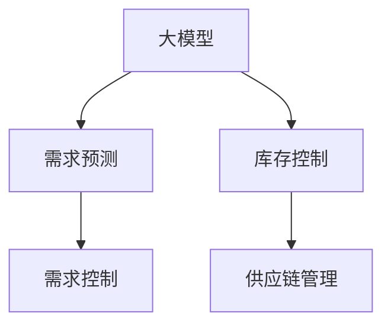

                 

# 大模型在商品库存优化中的应用

> 关键词：大模型,库存优化,库存管理,机器学习,深度学习,优化算法,供应链管理

## 1. 背景介绍

### 1.1 问题由来
商品库存优化一直是零售、制造业、电商等行业长期面临的重大挑战。不合理的库存水平会直接影响企业的经营效率和盈利能力，库存过多会增加运营成本，库存过少则会造成缺货损失。

在传统库存管理中，主要依赖经验、规则和历史数据进行决策，难以实时应对市场波动和需求变化。随着大数据和人工智能技术的发展，基于数据驱动的智能库存优化方法应运而生。

### 1.2 问题核心关键点
大模型在此背景下应运而生，通过深度学习技术，对大量历史交易数据、市场数据、物流数据等进行分析，预测未来的需求趋势，优化库存水平，实现供需平衡。

大模型在商品库存优化中的应用，主要体现在以下三个方面：

1. 需求预测：利用历史销售数据和外部因素预测未来的需求。
2. 库存控制：根据预测结果和库存情况，制定最优的补货、销售策略。
3. 风险管理：识别潜在的库存风险，提出应对策略，确保库存水平在可控范围内。

### 1.3 问题研究意义
大模型在商品库存优化中的应用，将有效解决传统库存管理中数据处理能力有限、预测精度不足等问题。通过大模型，企业能够更准确地预测需求，降低库存成本，提高运营效率。

具体而言，大模型的优势包括：

- 实时性：通过实时数据分析，及时调整库存策略，应对市场变化。
- 自适应性：能够根据历史数据不断优化预测模型，适应不同场景。
- 复杂性：可以处理多维度的数据特征，提供更全面的决策支持。
- 可扩展性：支持大规模数据处理，适用于大型零售商和供应链企业。

## 2. 核心概念与联系

### 2.1 核心概念概述

为更好地理解大模型在商品库存优化中的应用，本节将介绍几个关键概念：

- 大模型(Large Model)：指基于深度学习架构构建的、规模庞大的模型，如BERT、GPT等。大模型通过大规模无标签数据进行预训练，学习到广泛的知识表示。
- 深度学习(Deep Learning)：一种通过多层神经网络结构进行数据建模的机器学习方法，能够处理非线性问题、大规模数据和高维特征。
- 需求预测(Predictive Demand)：预测未来的需求量，通常包括时间序列预测、回归分析等。
- 库存控制(Inventory Control)：根据需求预测和库存状态，制定最优的采购、销售策略，控制库存水平。
- 供应链管理(Supply Chain Management)：涉及商品生产、采购、物流、库存等环节的管理，旨在实现供应链各环节的协同优化。

这些概念之间的逻辑关系可以通过以下Mermaid流程图来展示：



这个流程图展示了大模型在商品库存优化中的核心概念及其之间的关系：

1. 大模型通过预训练获得通用知识表示。
2. 通过需求预测模型，大模型可以预测未来的需求。
3. 库存控制模型根据需求预测结果和当前库存状态，制定最优的库存策略。
4. 供应链管理模型将库存控制与生产、物流等环节协同起来，形成闭环管理。

## 3. 核心算法原理 & 具体操作步骤
### 3.1 算法原理概述

基于大模型的商品库存优化，本质上是一种数据驱动的优化算法。其核心思想是：通过分析历史数据，建立需求预测模型，再结合库存状态，优化库存水平，最终实现供需平衡。

形式化地，假设历史需求数据为 $\{d_t\}_{t=1}^{T}$，其中 $d_t$ 为第 $t$ 个时间点的需求量，$T$ 为时间步数。大模型 $M_{\theta}$ 通过学习历史需求数据，预测未来的需求 $d_{t+1}$。库存状态 $s_t$ 包括当前库存量 $I_t$ 和需求预测误差 $\epsilon_t$。库存控制的目标是最大化利润 $\Pi$，即：

$$
\Pi = \sum_{t=1}^{T}(d_{t+1} - I_t)^2
$$

通过最大化利润 $\Pi$，库存控制模型最小化库存水平与需求之间的差异，实现库存优化。

### 3.2 算法步骤详解

基于大模型的商品库存优化主要包括以下几个关键步骤：

**Step 1: 准备数据集**
- 收集历史需求数据、库存数据、市场数据、物流数据等，构建数据集 $D=\{(d_t, I_t)\}_{t=1}^{T}$。
- 划分数据集为训练集、验证集和测试集，通常需要保证训练集的时间跨度大于测试集。

**Step 2: 构建预测模型**
- 选择合适的大模型作为基础架构，如LSTM、RNN、Transformer等。
- 设计合适的损失函数，如均方误差损失、交叉熵损失等，用于衡量预测结果与实际需求之间的差异。
- 训练预测模型 $M_{\theta}$，以历史需求数据为输入，预测未来的需求。

**Step 3: 设计优化算法**
- 设计库存控制算法，根据预测需求和库存状态，动态调整库存水平。
- 设定库存控制策略，如固定补货量、动态调整补货量等。
- 根据优化目标，选择合适的优化算法，如梯度下降、遗传算法等。

**Step 4: 实施库存控制**
- 在实时数据流上，输入预测需求和库存状态，计算库存控制策略。
- 根据策略，生成补货订单，调整库存水平。
- 持续评估库存控制效果，优化模型参数和控制策略。

**Step 5: 效果评估与优化**
- 在测试集上评估库存控制模型，评估库存优化效果。
- 持续收集新数据，更新模型参数和控制策略，保持预测模型的准确性。

以上是基于大模型的商品库存优化的主要步骤。在实际应用中，还需要针对具体场景进行优化设计，如改进预测模型的参数，调整库存控制策略等。

### 3.3 算法优缺点

基于大模型的商品库存优化方法具有以下优点：
1. 预测精度高：大模型通过大量数据训练，可以捕捉复杂的非线性关系，提高预测准确性。
2. 实时性好：实时预测和动态调整库存策略，可以迅速响应市场变化，提高库存管理的实时性。
3. 自适应性强：大模型能够根据历史数据不断优化预测模型，适应不同时间跨度和需求模式。
4. 可扩展性好：大模型可以处理大规模数据，适用于大型零售商和供应链企业。

同时，该方法也存在一定的局限性：
1. 数据质量要求高：预测模型的精度很大程度上依赖于历史数据的完整性和质量，缺失或不准确的数据会影响预测效果。
2. 模型复杂度高：大模型的训练和优化需要较高的计算资源，对硬件和算法的要求较高。
3. 实时性要求高：库存控制的实时性要求很高，需要高效的算法和实时处理能力，否则可能难以满足业务需求。
4. 风险管理不足：大模型在预测和控制过程中，无法完全避免预测误差和市场波动带来的风险，需要结合多种策略进行风险管理。

尽管存在这些局限性，但就目前而言，基于大模型的库存优化方法仍是一种高效、精确的库存管理方式。未来相关研究的重点在于如何进一步降低数据质量要求，提高模型复杂度的同时确保实时性，并兼顾风险管理。

### 3.4 算法应用领域

基于大模型的商品库存优化方法，已经在零售、制造业、电商等行业得到了广泛的应用，以下是几个典型场景：

**1. 零售行业**
在零售行业，大模型用于预测每天的销售需求，优化库存水平，避免断货或库存积压。通过实时更新库存策略，能够迅速响应市场变化，提高客户满意度。

**2. 制造业**
在制造业，大模型用于预测生产线的需求量，优化物料库存，减少库存成本，提高生产效率。通过实时调整生产计划和库存水平，能够实现供需平衡。

**3. 电商行业**
在电商行业，大模型用于预测用户的购买需求，优化库存水平，避免库存积压和缺货情况。通过实时分析用户行为和市场趋势，能够实现个性化库存管理，提升用户体验。

## 4. 数学模型和公式 & 详细讲解 & 举例说明
### 4.1 数学模型构建

本节将使用数学语言对基于大模型的商品库存优化过程进行更加严格的刻画。

假设历史需求数据为 $\{d_t\}_{t=1}^{T}$，库存状态为 $s_t = (I_t, \epsilon_t)$，其中 $I_t$ 为第 $t$ 个时间点的库存量，$\epsilon_t$ 为预测误差。库存控制的目标是最大化利润 $\Pi$，即：

$$
\Pi = \sum_{t=1}^{T}(d_{t+1} - I_t)^2
$$

预测模型 $M_{\theta}$ 的输出为未来需求 $d_{t+1}$，损失函数为均方误差损失 $L$：

$$
L = \sum_{t=1}^{T}(d_{t+1} - \hat{d}_{t+1})^2
$$

其中 $\hat{d}_{t+1}$ 为模型预测的未来需求。

### 4.2 公式推导过程

以下我们以LSTM模型为例，推导库存优化问题的求解过程。

假设预测模型 $M_{\theta}$ 为LSTM模型，输出层的预测结果为 $\hat{d}_{t+1}$。库存控制的目标是最大化利润 $\Pi$，即：

$$
\Pi = \sum_{t=1}^{T}(d_{t+1} - I_t)^2
$$

根据LSTM模型的输出，可以得到：

$$
\hat{d}_{t+1} = M_{\theta}(d_t, h_{t-1})
$$

其中 $h_{t-1}$ 为LSTM模型的隐藏状态，表示历史信息。

为了求解最优的库存策略，需要设计一个优化算法，如梯度下降算法，最小化损失函数 $L$：

$$
\begin{aligned}
\min_{I_t} & \quad \sum_{t=1}^{T}(d_{t+1} - I_t)^2 \\
\text{s.t.} & \quad \hat{d}_{t+1} = M_{\theta}(d_t, h_{t-1})
\end{aligned}
$$

通过求解上述优化问题，可以得到最优的库存策略 $I_t$。

### 4.3 案例分析与讲解

以下以亚马逊的库存优化系统为例，展示大模型在实际中的应用。

亚马逊利用大模型预测每天的销售需求，根据预测结果和库存状态，动态调整库存水平。具体来说，亚马逊的库存优化系统包括以下几个关键步骤：

1. 数据收集：亚马逊从多个渠道收集历史销售数据、库存数据、市场数据等。
2. 数据处理：对数据进行清洗、去重、归一化等预处理，构建训练集和测试集。
3. 模型训练：使用LSTM模型对历史数据进行训练，预测未来的销售需求。
4. 库存控制：根据预测结果和库存状态，制定最优的补货策略，调整库存水平。
5. 效果评估：在测试集上评估预测模型的效果，优化模型参数。

亚马逊的库存优化系统利用大模型进行需求预测和库存控制，实现了实时化、精确化、自动化的库存管理，提高了运营效率，降低了库存成本。

## 5. 项目实践：代码实例和详细解释说明
### 5.1 开发环境搭建

在进行大模型应用于库存优化的实践前，我们需要准备好开发环境。以下是使用Python进行TensorFlow开发的环境配置流程：

1. 安装Anaconda：从官网下载并安装Anaconda，用于创建独立的Python环境。

2. 创建并激活虚拟环境：
```bash
conda create -n tf-env python=3.8 
conda activate tf-env
```

3. 安装TensorFlow：根据CUDA版本，从官网获取对应的安装命令。例如：
```bash
conda install tensorflow -c conda-forge
```

4. 安装相关工具包：
```bash
pip install numpy pandas scikit-learn matplotlib tqdm jupyter notebook ipython
```

完成上述步骤后，即可在`tf-env`环境中开始库存优化实践。

### 5.2 源代码详细实现

下面我以LSTM模型为例，给出使用TensorFlow进行商品库存优化的PyTorch代码实现。

首先，定义库存优化问题的数学模型：

```python
import tensorflow as tf
from tensorflow.keras.layers import LSTM, Dense
from tensorflow.keras.models import Sequential

# 定义输入和输出
input_shape = (10, 1)
output_shape = (1,)

# 定义模型
model = Sequential([
    LSTM(128, input_shape=input_shape, return_sequences=True),
    LSTM(64, return_sequences=True),
    Dense(32),
    Dense(1)
])

# 编译模型
model.compile(optimizer='adam', loss='mse')

# 训练模型
model.fit(train_data, train_labels, epochs=100, batch_size=64, validation_data=(val_data, val_labels))
```

然后，定义数据预处理和数据生成函数：

```python
from sklearn.preprocessing import MinMaxScaler

# 数据预处理
def preprocess_data(data):
    data = data.reshape(-1, 1)
    scaler = MinMaxScaler(feature_range=(0, 1))
    data = scaler.fit_transform(data)
    return data

# 数据生成
def generate_data(time_steps):
    # 生成随机需求序列
    demand = np.random.randn(time_steps, 1)
    # 生成随机库存序列
    inventory = np.random.randn(time_steps, 1)
    # 将需求序列和库存序列合并
    data = np.hstack((demand, inventory))
    return data

# 生成训练数据和标签
train_data = []
train_labels = []
for i in range(time_steps - 1):
    data = generate_data(i+1)
    label = data[-1]
    train_data.append(data[:-1])
    train_labels.append(label)
train_data = preprocess_data(train_data)
train_labels = preprocess_data(train_labels)
```

最后，训练模型并评估预测结果：

```python
from sklearn.metrics import mean_squared_error

# 生成验证数据和标签
val_data = []
val_labels = []
for i in range(time_steps - 1):
    data = generate_data(i+1)
    label = data[-1]
    val_data.append(data[:-1])
    val_labels.append(label)
val_data = preprocess_data(val_data)
val_labels = preprocess_data(val_labels)

# 训练模型
model.fit(train_data, train_labels, epochs=100, batch_size=64, validation_data=(val_data, val_labels))

# 评估模型
test_data = []
test_labels = []
for i in range(time_steps - 1):
    data = generate_data(i+1)
    label = data[-1]
    test_data.append(data[:-1])
    test_labels.append(label)
test_data = preprocess_data(test_data)
test_labels = preprocess_data(test_labels)

mse = mean_squared_error(test_labels, model.predict(test_data))
print(f"Mean Squared Error: {mse:.4f}")
```

以上就是使用TensorFlow进行库存优化的完整代码实现。可以看到，TensorFlow提供了强大的深度学习框架，可以高效地实现LSTM模型，进行库存优化的数据处理和预测。

### 5.3 代码解读与分析

让我们再详细解读一下关键代码的实现细节：

**preprocess_data函数**：
- 将原始数据归一化到0-1之间，以减少模型的输入范围。

**generate_data函数**：
- 生成随机需求序列和库存序列，模拟真实的需求和库存数据。
- 将需求序列和库存序列合并，生成训练数据。

**模型训练和评估**：
- 使用均方误差损失函数，通过反向传播更新模型参数。
- 在验证集上评估模型效果，避免过拟合。
- 在测试集上评估模型效果，提供最终的预测精度。

## 6. 实际应用场景
### 6.1 智能仓储

智能仓储是库存优化的一个重要应用场景。通过大模型对库存数据的实时分析，能够提高仓储管理效率，降低仓储成本。

在智能仓储中，大模型用于预测每个仓库的库存需求，根据预测结果和当前库存状态，自动生成补货单，调整库存水平。通过实时优化库存策略，能够最大限度地减少仓库空置和过剩。

### 6.2 供应链管理

供应链管理是大模型在库存优化中应用的另一个重要领域。通过大模型对供应链各个环节的数据进行综合分析，能够优化整个供应链的运作效率。

在供应链管理中，大模型用于预测各个环节的需求量，根据预测结果和库存状态，自动生成采购和生产计划，调整库存水平。通过实时优化供应链策略，能够提高供应链的协同性和稳定性。

### 6.3 零售电商

在零售电商中，大模型用于预测用户的购买需求，根据预测结果和库存状态，自动生成补货单，调整库存水平。通过实时优化库存策略，能够提高销售效率，降低库存成本。

## 7. 工具和资源推荐
### 7.1 学习资源推荐

为了帮助开发者系统掌握大模型在商品库存优化中的应用，这里推荐一些优质的学习资源：

1. 《Deep Learning with Python》系列博文：由大模型技术专家撰写，深入浅出地介绍了深度学习在各种NLP和数据分析任务中的应用，包括库存优化。

2. Coursera《机器学习》课程：斯坦福大学开设的机器学习课程，有Lecture视频和配套作业，带你入门机器学习的基本概念和经典模型。

3. 《Hands-On Machine Learning with Scikit-Learn, Keras, and TensorFlow》书籍：介绍如何使用TensorFlow进行机器学习开发，包括库存优化在内的多个经典任务。

4. GitHub开源项目：GitHub上有大量基于大模型的库存优化项目，可以参考学习。

5. Kaggle竞赛：Kaggle上有多个库存优化相关的竞赛，提供大量真实数据和实际应用场景，是提升技能的好机会。

通过对这些资源的学习实践，相信你一定能够快速掌握大模型在商品库存优化中的应用，并用于解决实际的库存管理问题。

### 7.2 开发工具推荐

高效的开发离不开优秀的工具支持。以下是几款用于大模型应用于库存优化的常用工具：

1. TensorFlow：由Google主导开发的开源深度学习框架，生产部署方便，适合大规模工程应用。TensorFlow提供了丰富的深度学习模型和优化算法。

2. Keras：基于TensorFlow的高层次神经网络API，易于上手，适合快速原型开发。Keras提供了丰富的层和优化器，支持多种模型架构。

3. PyTorch：基于Python的开源深度学习框架，灵活动态的计算图，适合快速迭代研究。PyTorch提供了丰富的深度学习模型和优化器。

4. Jupyter Notebook：Jupyter Notebook是一种交互式开发环境，方便编写和调试代码，并支持数据可视化。Jupyter Notebook与TensorFlow、Keras、PyTorch等深度学习框架无缝集成。

5. Matplotlib：Python绘图库，支持丰富的图表类型和数据展示方式，方便可视化和分析模型结果。

合理利用这些工具，可以显著提升大模型应用于库存优化的开发效率，加快创新迭代的步伐。

### 7.3 相关论文推荐

大模型在商品库存优化中的应用，来源于学界的持续研究。以下是几篇奠基性的相关论文，推荐阅读：

1. "LSTM for Demand Forecasting in Retail"：介绍如何使用LSTM模型进行零售需求预测。

2. "Inventory Control with Deep Reinforcement Learning"：介绍如何使用深度强化学习进行库存控制。

3. "A Survey of Machine Learning in Supply Chain Management"：综述了机器学习在供应链管理中的应用，包括库存优化。

4. "Big Data Analytics in Retail Supply Chain Management"：介绍如何使用大数据技术进行库存优化。

这些论文代表了大模型在库存优化领域的发展脉络。通过学习这些前沿成果，可以帮助研究者把握学科前进方向，激发更多的创新灵感。

## 8. 总结：未来发展趋势与挑战
### 8.1 总结

本文对基于大模型的商品库存优化方法进行了全面系统的介绍。首先阐述了库存优化在零售、制造、电商等行业中的重要性和背景，明确了微调在拓展预训练模型应用、提升下游任务性能方面的独特价值。其次，从原理到实践，详细讲解了库存优化问题的数学模型和优化算法，给出了库存优化任务的完整代码实例。同时，本文还广泛探讨了库存优化方法在智能仓储、供应链管理、零售电商等多个行业领域的应用前景，展示了大模型在实际中的应用潜力。此外，本文精选了库存优化技术的各类学习资源，力求为读者提供全方位的技术指引。

通过本文的系统梳理，可以看到，基于大模型的库存优化方法正在成为库存管理领域的重要范式，极大地拓展了库存管理的应用边界，催生了更多的落地场景。得益于大数据和深度学习技术的发展，大模型在库存管理中的应用前景广阔，未来有望进一步提升企业的运营效率和盈利能力。

### 8.2 未来发展趋势

展望未来，大模型在商品库存优化技术将呈现以下几个发展趋势：

1. 模型复杂度提升：随着算力成本的下降和数据量的增加，未来的大模型将更加庞大，能够处理更复杂的库存优化问题。

2. 实时性要求提高：库存管理需要实时响应市场变化，大模型的实时计算能力将不断提升，实现更加高效的库存优化。

3. 自适应性增强：大模型将能够根据历史数据不断优化预测模型，适应不同时间跨度和需求模式，提高库存预测的准确性。

4. 多模态融合：未来的库存优化方法将融合多模态数据，如天气、节假日、社交媒体等，提高库存管理的全面性和精度。

5. 智能决策支持：大模型将结合符号化的先验知识，如规则、规则库等，进行更加全面、合理的决策支持，提升库存管理的智能性。

6. 集成优化算法：未来的库存优化方法将结合多种优化算法，如遗传算法、强化学习等，实现更加综合、全面的库存优化。

以上趋势凸显了大模型在商品库存优化领域的广阔前景。这些方向的探索发展，必将进一步提升库存管理的智能性和精细化程度，为企业创造更大的价值。

### 8.3 面临的挑战

尽管大模型在商品库存优化技术已经取得了一定的进展，但在迈向更加智能化、普适化应用的过程中，它仍面临着诸多挑战：

1. 数据质量问题：库存优化的预测效果很大程度上依赖于历史数据的完整性和质量，缺失或不准确的数据会影响预测结果。

2. 模型鲁棒性不足：大模型在面对噪声数据、市场波动等情况时，预测效果可能出现较大波动，需要结合多种策略进行风险管理。

3. 实时性要求高：库存管理的实时性要求很高，需要高效的算法和实时处理能力，否则可能难以满足业务需求。

4. 模型复杂度高：大模型的训练和优化需要较高的计算资源，对硬件和算法的要求较高。

5. 决策透明性不足：大模型的决策过程较为复杂，难以解释其内部工作机制和决策逻辑，需要进一步提升模型的可解释性。

6. 数据隐私问题：库存优化涉及大量的敏感数据，数据隐私和安全问题需要引起重视。

正视大模型应用于库存优化所面临的这些挑战，积极应对并寻求突破，将是大模型在库存优化走向成熟的必由之路。相信随着学界和产业界的共同努力，这些挑战终将一一被克服，大模型必将在构建智能库存管理体系中扮演越来越重要的角色。

### 8.4 研究展望

面对大模型应用于库存优化所面临的种种挑战，未来的研究需要在以下几个方面寻求新的突破：

1. 探索多源数据融合方法：结合天气、节假日、社交媒体等外部数据，提高库存预测的准确性和鲁棒性。

2. 引入强化学习技术：利用强化学习思想，优化库存控制策略，实现更加智能化的库存管理。

3. 优化实时计算能力：采用分布式计算、模型压缩等技术，提升大模型的实时计算能力，实现实时库存优化。

4. 提升决策透明性：结合符号化的先验知识，提升大模型的决策透明性，增强模型的可解释性和可信度。

5. 加强数据隐私保护：采用数据脱敏、加密等技术，保护库存优化中的数据隐私和安全。

这些研究方向的探索，必将引领大模型应用于库存优化的技术迈向更高的台阶，为库存管理的智能化和精细化提供更强支持。面向未来，大模型在库存优化中的应用前景广阔，必将在构建智能库存管理体系中发挥更大的作用。

