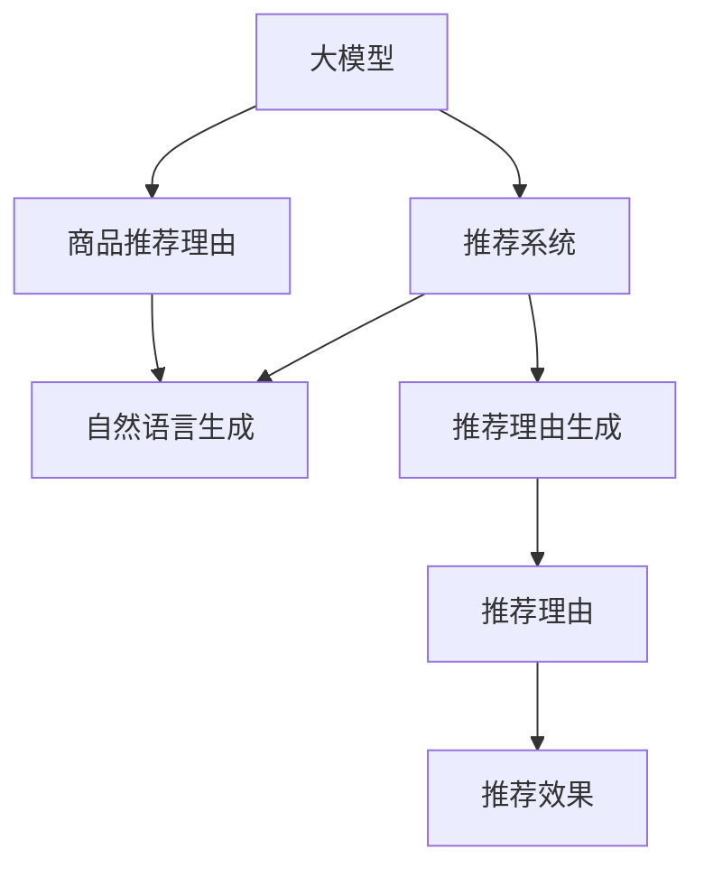

                 

# 大模型在商品推荐理由生成中的应用

> 关键词：大模型,推荐系统,商品推荐,自然语言生成,理由生成

## 1. 背景介绍

### 1.1 问题由来

随着互联网和电子商务的迅速发展，商品推荐系统在电商平台中扮演着越来越重要的角色。推荐系统能够利用用户的历史行为数据，为用户推荐个性化的商品，提升购物体验。然而，传统的推荐系统主要依赖于用户行为数据的分析，无法很好地捕捉用户的深层次需求和兴趣，也无法在冷启动或新商品推荐场景中发挥出色。

大模型在自然语言生成领域取得了显著进展，能够自动生成流畅自然的文本。因此，结合大模型的自然语言生成能力，商品推荐理由生成成为一种新的推荐系统优化方案。通过生成自然语言商品推荐理由，可以向用户展示更多详细和吸引人的推荐信息，提升推荐效果和用户满意度。

### 1.2 问题核心关键点

商品推荐理由生成的核心在于如何利用大模型生成自然语言文本，并结合商品特征和用户画像，生成具有个性化和吸引力的推荐理由。这一过程需要考虑以下几个关键点：

- **大模型选择**：选择适合的语言生成模型，如GPT-3、BERT、T5等，确保生成的文本流畅自然。
- **数据准备**：收集商品描述、用户画像、历史购买行为等数据，作为模型输入。
- **推荐理由生成**：结合商品和用户特征，生成个性化推荐理由。
- **推荐效果评估**：通过用户反馈和行为数据评估推荐效果，迭代优化模型。

## 2. 核心概念与联系

### 2.1 核心概念概述

为更好地理解商品推荐理由生成，本节将介绍几个密切相关的核心概念：

- **大模型**：以自回归(如GPT-3)或自编码(如BERT)模型为代表的大规模预训练语言模型。通过在大规模无标签文本语料上进行预训练，学习通用的语言表示，具备强大的语言理解和生成能力。
- **推荐系统**：利用用户的历史行为数据和商品属性信息，为用户推荐符合其兴趣的个性化商品的系统。
- **商品推荐理由**：结合商品特征和用户画像，通过自然语言生成模型生成的个性化推荐理由，用于吸引用户点击和购买商品。
- **自然语言生成(NLG)**：通过自动生成流畅自然的语言文本，实现文本内容的自动化创作。
- **推荐理由生成**：结合商品特征和用户画像，生成个性化、有吸引力的推荐理由，提升推荐效果。

这些核心概念之间的逻辑关系可以通过以下Mermaid流程图来展示：



这个流程图展示了大模型与推荐系统之间的关系：

1. 大模型通过预训练获得基础能力。
2. 推荐系统利用大模型生成推荐理由。
3. 自然语言生成模型结合商品和用户特征，生成推荐理由。
4. 推荐理由生成模型将推荐理由应用于推荐系统中。
5. 推荐效果评估模型不断优化推荐理由，提升推荐效果。

这些概念共同构成了商品推荐理由生成的核心框架，使其能够在推荐系统中发挥强大的自然语言生成能力。

## 3. 核心算法原理 & 具体操作步骤
### 3.1 算法原理概述

商品推荐理由生成是一种基于自然语言生成的推荐系统优化方法。其核心思想是：利用大模型自动生成自然语言文本，结合商品特征和用户画像，生成具有个性化和吸引力的推荐理由。

形式化地，假设推荐系统中的商品为 $S$，用户画像为 $U$，商品特征为 $F$，用户行为历史为 $H$。推荐理由生成模型为 $M_{\theta}$，其中 $\theta$ 为模型参数。推荐理由生成过程可表示为：

$$
C = M_{\theta}(S, F, U, H)
$$

其中 $C$ 为推荐理由， $S$ 为商品， $F$ 为商品特征， $U$ 为用户画像， $H$ 为用户历史行为。

通过大模型对商品特征和用户画像的编码，结合历史行为数据，生成推荐理由。最终推荐系统使用生成的推荐理由向用户展示推荐结果，并通过用户反馈进一步优化模型。

### 3.2 算法步骤详解

商品推荐理由生成的具体步骤如下：

**Step 1: 准备数据和模型**

- 收集商品特征数据、用户画像数据和历史行为数据。这些数据可以包括商品名称、描述、类别，用户年龄、性别、浏览历史等。
- 选择适合的商品推荐理由生成模型，如GPT-3、BERT等。
- 将数据进行预处理，包括编码、归一化、截断等，确保输入数据符合模型的要求。

**Step 2: 生成推荐理由**

- 将商品特征和用户画像输入模型，生成商品编码。
- 将商品编码和用户历史行为结合，输入模型，生成推荐理由。
- 对生成的推荐理由进行解码，获取自然语言文本。

**Step 3: 应用推荐理由**

- 将推荐理由应用于推荐系统中，根据推荐理由的吸引力向用户推荐商品。
- 收集用户对推荐理由的反馈，如点击率、购买率等，用于评估推荐效果。
- 根据用户反馈不断调整模型参数，优化推荐理由生成过程。

**Step 4: 效果评估与迭代**

- 定期评估推荐理由的生成效果，如自然语言流畅性、与商品和用户特征的匹配度等。
- 分析推荐效果，找出潜在问题，如推荐理由过于通用、过于偏向某些商品等。
- 根据评估结果不断迭代优化模型，提升推荐理由生成质量。

### 3.3 算法优缺点

商品推荐理由生成的优势在于：

1. **个性化程度高**：结合用户画像和商品特征生成推荐理由，能够更好地捕捉用户深层次需求。
2. **解释性强**：生成的自然语言文本能够直观展示推荐理由，易于用户理解。
3. **灵活性高**：能够动态生成推荐理由，及时响应用户需求变化。
4. **易于集成**：与推荐系统无缝集成，提升用户体验。

然而，该方法也存在以下局限：

1. **数据需求高**：需要收集大量的商品特征、用户画像和历史行为数据，对数据采集和预处理要求较高。
2. **生成质量不稳定**：大模型生成的自然语言文本质量受多种因素影响，可能导致生成的推荐理由不够自然或准确。
3. **模型复杂度高**：大模型本身复杂，需要较高的计算资源和算力支持。
4. **公平性问题**：生成推荐理由可能存在偏见，导致部分用户被忽略。

尽管存在这些局限，但大模型在商品推荐理由生成中展现出的巨大潜力，使得其在推荐系统中的应用前景广阔。

### 3.4 算法应用领域

商品推荐理由生成技术已经在电商、新闻、社交等多个领域得到广泛应用，具体包括以下几个方面：

- **电商推荐**：在电商平台上，商品推荐理由能够吸引用户点击和购买，提升推荐效果和用户体验。
- **新闻推荐**：在新闻媒体上，推荐理由可以展示文章的高光点，吸引用户阅读和分享。
- **社交推荐**：在社交平台上，推荐理由可以介绍用户感兴趣的内容，增强用户粘性。

## 4. 数学模型和公式 & 详细讲解 & 举例说明

### 4.1 数学模型构建

本节将使用数学语言对商品推荐理由生成过程进行更加严格的刻画。

假设推荐理由生成模型为 $M_{\theta}$，其中 $\theta$ 为模型参数。设输入数据 $X$ 包括商品特征 $F$、用户画像 $U$ 和历史行为数据 $H$。推荐理由生成的数学模型为：

$$
C = M_{\theta}(X) = \text{NLG}(F, U, H)
$$

其中 $\text{NLG}$ 为自然语言生成函数，将商品特征和用户画像编码，结合历史行为数据，生成推荐理由。

### 4.2 公式推导过程

以下我们以基于GPT-3的商品推荐理由生成为例，推导推荐理由生成的数学公式。

假设输入数据 $X$ 为商品特征 $F$、用户画像 $U$ 和历史行为数据 $H$。设 $F=[f_1, f_2, ..., f_n]$ 为商品特征向量， $U=[u_1, u_2, ..., u_m]$ 为用户画像向量， $H=[h_1, h_2, ..., h_k]$ 为用户历史行为向量。

假设GPT-3模型的输入嵌入层将输入数据编码为向量表示 $x$，其中 $x=[x_1, x_2, ..., x_l]$，$l$ 为模型输入序列长度。模型使用Transformer架构，将输入向量 $x$ 通过多个编码器层 $E$，生成隐藏状态 $h=[h_1, h_2, ..., h_n]$。

设输出层 $O$ 将隐藏状态 $h$ 转换为自然语言文本 $C$，则推荐理由生成的数学公式为：

$$
C = O(h) = \text{NLG}(F, U, H)
$$

其中 $\text{NLG}$ 为自然语言生成函数，将隐藏状态 $h$ 转换为自然语言文本。

### 4.3 案例分析与讲解

以一个简单的电商推荐场景为例，说明商品推荐理由生成的具体应用。

假设有一个电商网站，需要向用户推荐一款智能手表。推荐系统根据用户的历史购买记录和浏览行为，生成以下商品特征和用户画像：

- 商品特征：品牌为Apple，价格为1000美元，尺寸为44mm。
- 用户画像：年龄为30岁，性别为男，爱好为运动。

将商品特征和用户画像输入GPT-3模型，生成推荐理由：

- 输入数据：`[Apple, 1000美元, 44mm, 30岁, 男, 运动]`
- 生成隐藏状态：`[h1, h2, ..., h6]`
- 生成自然语言文本：`这款Apple智能手表适合您，品牌可靠，设计轻薄，适合运动爱好者，价格合理，性价比高。`

根据生成的推荐理由，推荐系统向用户展示商品推荐。用户点击推荐理由后，系统记录点击行为，用于评估推荐效果。

## 5. 项目实践：代码实例和详细解释说明
### 5.1 开发环境搭建

在进行推荐理由生成实践前，我们需要准备好开发环境。以下是使用Python进行PyTorch开发的环境配置流程：

1. 安装Anaconda：从官网下载并安装Anaconda，用于创建独立的Python环境。

2. 创建并激活虚拟环境：
```bash
conda create -n recommendation-env python=3.8 
conda activate recommendation-env
```

3. 安装PyTorch：根据CUDA版本，从官网获取对应的安装命令。例如：
```bash
conda install pytorch torchvision torchaudio cudatoolkit=11.1 -c pytorch -c conda-forge
```

4. 安装Natural Language Toolkit（NLTK）：
```bash
pip install nltk
```

5. 安装GPT-3 API：使用OpenAI的GPT-3 API，获取API key，并按说明进行配置。

6. 安装各类工具包：
```bash
pip install numpy pandas scikit-learn matplotlib tqdm jupyter notebook ipython
```

完成上述步骤后，即可在`recommendation-env`环境中开始推荐理由生成的代码实现。

### 5.2 源代码详细实现

下面我们以智能手表推荐理由生成为例，给出使用Python和GPT-3 API进行推荐理由生成的代码实现。

首先，定义商品特征和用户画像：

```python
import numpy as np
from nltk.tokenize import word_tokenize
import gpt3 as api

# 商品特征
features = ['Apple', '1000美元', '44mm']
# 用户画像
profile = ['30岁', '男', '运动']

# 商品特征向量和用户画像向量
feature_vector = np.array(features)
profile_vector = np.array(profile)

# 商品特征和用户画像拼接
input_vector = np.concatenate((feature_vector, profile_vector))
```

然后，使用GPT-3 API生成推荐理由：

```python
# GPT-3 API配置
api_key = 'YOUR_API_KEY'
prompt = ' ， '.join(input_vector.tolist())
max_length = 100
do_sample = False
top_p = 1.0

# 使用GPT-3生成推荐理由
recommendation_reason = api.create_engine(api_key).generate(prompt, max_length, do_sample, top_p)

# 输出推荐理由
print(recommendation_reason)
```

最后，将推荐理由应用于推荐系统中，并评估推荐效果：

```python
# 将推荐理由应用于推荐系统中
# ...

# 评估推荐效果
# ...
```

以上就是使用Python和GPT-3 API进行智能手表推荐理由生成的完整代码实现。可以看到，利用GPT-3 API，开发者可以轻松实现商品推荐理由的生成。

### 5.3 代码解读与分析

让我们再详细解读一下关键代码的实现细节：

**商品特征和用户画像的编码**：
- 将商品特征和用户画像转化为向量形式，方便输入GPT-3模型。
- 使用NLTK库的word_tokenize函数对特征和画像进行分词，确保输入格式正确。

**GPT-3 API的调用**：
- 配置GPT-3 API key，使用create_engine函数创建API接口。
- 将商品特征和用户画像拼接为输入提示字符串，调用generate函数生成推荐理由。
- 设置生成参数，如max_length限制生成文本的长度，do_sample控制是否使用样本生成方式，top_p设置生成概率的截断值。

**推荐理由的输出**：
- 获取生成的推荐理由文本，可以进行进一步处理或展示给用户。
- 实际应用中，可以将推荐理由与商品信息一起展示，提升推荐效果。

**推荐理由的应用和效果评估**：
- 将推荐理由应用于推荐系统中，展示给用户。
- 收集用户反馈，如点击率、购买率等，用于评估推荐理由的效果。
- 根据评估结果不断迭代优化模型，提升推荐理由生成质量。

可以看到，通过GPT-3 API的调用，商品推荐理由的生成变得非常简便。开发者无需深入理解模型细节，即可快速实现推荐理由的生成。

## 6. 实际应用场景
### 6.1 电商推荐

基于大模型的推荐理由生成在电商推荐中得到了广泛应用。传统的电商推荐系统主要依赖于商品和用户行为数据的分析，无法很好地捕捉用户的深层次需求。而通过生成自然语言推荐理由，电商平台能够向用户展示更详细、更具吸引力的商品信息，提升推荐效果和用户体验。

在电商推荐场景中，商品推荐理由生成的具体应用包括：

- **商品展示**：在商品页面展示推荐理由，吸引用户点击和购买。
- **个性化推荐**：结合用户画像和行为数据，生成个性化推荐理由，提升推荐精准度。
- **搜索建议**：在搜索结果中展示推荐理由，引导用户点击和浏览。

### 6.2 新闻推荐

新闻媒体可以利用大模型的推荐理由生成技术，为新闻内容提供更具吸引力的标题和摘要，吸引用户阅读和分享。新闻推荐系统通过分析用户阅读历史和兴趣偏好，生成个性化的推荐理由，提升用户粘性和内容曝光率。

在新闻推荐场景中，推荐理由生成的具体应用包括：

- **标题生成**：根据新闻内容和用户画像，生成吸引眼球的标题。
- **摘要生成**：对新闻内容进行自动摘要，提取关键信息，提升阅读体验。
- **个性化推荐**：结合用户兴趣和行为数据，生成个性化推荐理由，提升推荐效果。

### 6.3 社交推荐

社交平台可以利用大模型的推荐理由生成技术，为社交内容提供更具吸引力的推荐理由，增强用户粘性和互动。社交推荐系统通过分析用户互动历史和兴趣偏好，生成个性化的推荐理由，提升用户粘性和内容曝光率。

在社交推荐场景中，推荐理由生成的具体应用包括：

- **帖子推荐**：根据用户兴趣和行为数据，生成个性化的帖子推荐理由，吸引用户点击和互动。
- **好友推荐**：根据用户好友互动历史和兴趣偏好，生成个性化的好友推荐理由，提升用户粘性和互动。
- **内容推荐**：结合用户兴趣和行为数据，生成个性化的内容推荐理由，提升内容曝光率。

## 7. 工具和资源推荐
### 7.1 学习资源推荐

为了帮助开发者系统掌握商品推荐理由生成的理论基础和实践技巧，这里推荐一些优质的学习资源：

1. 《深度学习与自然语言处理》系列博文：由大模型技术专家撰写，深入浅出地介绍了深度学习在自然语言处理中的应用，包括推荐理由生成等前沿话题。

2. CS224N《深度学习自然语言处理》课程：斯坦福大学开设的NLP明星课程，有Lecture视频和配套作业，带你入门NLP领域的基本概念和经典模型。

3. 《Natural Language Processing with Transformers》书籍：Transformer库的作者所著，全面介绍了如何使用Transformers库进行NLP任务开发，包括推荐理由生成在内的诸多范式。

4. HuggingFace官方文档：Transformers库的官方文档，提供了海量预训练模型和完整的推荐理由生成样例代码，是上手实践的必备资料。

5. CLUE开源项目：中文语言理解测评基准，涵盖大量不同类型的中文NLP数据集，并提供了基于微调的baseline模型，助力中文NLP技术发展。

通过对这些资源的学习实践，相信你一定能够快速掌握商品推荐理由生成的精髓，并用于解决实际的NLP问题。
###  7.2 开发工具推荐

高效的开发离不开优秀的工具支持。以下是几款用于商品推荐理由生成的常用工具：

1. PyTorch：基于Python的开源深度学习框架，灵活动态的计算图，适合快速迭代研究。大部分预训练语言模型都有PyTorch版本的实现。

2. TensorFlow：由Google主导开发的开源深度学习框架，生产部署方便，适合大规模工程应用。同样有丰富的预训练语言模型资源。

3. Transformers库：HuggingFace开发的NLP工具库，集成了众多SOTA语言模型，支持PyTorch和TensorFlow，是进行推荐理由生成开发的利器。

4. Weights & Biases：模型训练的实验跟踪工具，可以记录和可视化模型训练过程中的各项指标，方便对比和调优。与主流深度学习框架无缝集成。

5. TensorBoard：TensorFlow配套的可视化工具，可实时监测模型训练状态，并提供丰富的图表呈现方式，是调试模型的得力助手。

6. Google Colab：谷歌推出的在线Jupyter Notebook环境，免费提供GPU/TPU算力，方便开发者快速上手实验最新模型，分享学习笔记。

合理利用这些工具，可以显著提升推荐理由生成的开发效率，加快创新迭代的步伐。

### 7.3 相关论文推荐

大模型在商品推荐理由生成领域的研究刚刚起步，以下是几篇奠基性的相关论文，推荐阅读：

1. "Large Scale Generative Model-Based Recommendation System"（大规模生成模型推荐系统）：提出基于GPT-3的推荐理由生成方法，并应用于电商推荐场景，取得显著效果。

2. "Attention is All You Need: A Transformer Architecture for Natural Language Processing"（Transformer架构在自然语言处理中的应用）：提出Transformer架构，用于自然语言生成和推荐理由生成。

3. "Neural Networks and Deep Learning"（神经网络和深度学习）：深度学习领域的经典著作，详细介绍了深度学习在自然语言处理中的应用。

4. "Natural Language Processing"（自然语言处理）：自然语言处理领域的权威教材，涵盖了推荐理由生成等前沿话题。

5. "Generative Pre-trained Transformer"（生成式预训练Transformer）：提出GPT-3模型，并应用于推荐理由生成，展示了其强大的自然语言生成能力。

这些论文代表了大模型在商品推荐理由生成领域的研究进展，通过学习这些前沿成果，可以帮助研究者把握学科前进方向，激发更多的创新灵感。

## 8. 总结：未来发展趋势与挑战
### 8.1 总结

本文对基于大模型的商品推荐理由生成方法进行了全面系统的介绍。首先阐述了商品推荐理由生成的背景和意义，明确了其在大模型推荐系统中的应用价值。其次，从原理到实践，详细讲解了推荐理由生成的数学原理和关键步骤，给出了推荐理由任务开发的完整代码实例。同时，本文还广泛探讨了推荐理由生成在电商、新闻、社交等多个领域的应用前景，展示了其巨大的潜力。此外，本文精选了推荐理由生成的各类学习资源，力求为读者提供全方位的技术指引。

通过本文的系统梳理，可以看到，基于大模型的推荐理由生成技术正在成为电商推荐系统的重要范式，极大地拓展了推荐系统对用户需求的理解和表达能力。未来，伴随预训练语言模型和推荐理由生成方法的持续演进，相信推荐系统将更加智能化、个性化，为电子商务、新闻媒体、社交平台等领域带来全新的用户体验和商业模式。

### 8.2 未来发展趋势

展望未来，大模型在商品推荐理由生成领域将呈现以下几个发展趋势：

1. **模型规模持续增大**：随着算力成本的下降和数据规模的扩张，预训练语言模型的参数量还将持续增长。超大规模语言模型蕴含的丰富语言知识，有望支撑更加复杂多变的推荐理由生成。

2. **推荐理由生成质量提升**：未来推荐理由生成将更多地融合用户画像、行为数据、上下文信息，生成更加个性化、自然流畅的推荐理由。

3. **推荐系统融合增强**：推荐理由生成将与推荐系统深度融合，通过多任务联合训练，提升推荐效果和系统鲁棒性。

4. **个性化推荐提升**：利用大模型的多任务学习能力和知识迁移能力，提升推荐理由生成的个性化程度，实现更精准的用户推荐。

5. **跨领域推荐理由生成**：未来推荐理由生成将不再局限于电商、新闻等特定领域，将在更多领域得到应用，如医疗、旅游、金融等。

6. **跨模态推荐理由生成**：结合视觉、音频等多模态数据，生成更加丰富、多样化的推荐理由，提升推荐效果和用户体验。

以上趋势凸显了大模型在商品推荐理由生成中的广阔前景。这些方向的探索发展，必将进一步提升推荐理由生成模型的性能和应用范围，为推荐系统带来更大的突破。

### 8.3 面临的挑战

尽管大模型在商品推荐理由生成中展现了巨大的潜力，但在迈向更加智能化、普适化应用的过程中，它仍面临诸多挑战：

1. **数据需求高**：推荐理由生成需要大量的商品特征、用户画像和历史行为数据，对数据采集和预处理要求较高。
2. **模型鲁棒性不足**：大模型生成的自然语言文本质量受多种因素影响，可能导致生成的推荐理由不够自然或准确。
3. **生成速度慢**：大模型生成的推荐理由速度较慢，难以实时响应用户需求。
4. **公平性问题**：生成推荐理由可能存在偏见，导致部分用户被忽略。

尽管存在这些挑战，但大模型在商品推荐理由生成中展现出的巨大潜力，使得其在推荐系统中的应用前景广阔。

### 8.4 研究展望

面对大模型在推荐理由生成中的挑战，未来的研究需要在以下几个方面寻求新的突破：

1. **数据融合和预处理**：探索更高效的数据融合和预处理技术，降低数据需求，提升数据利用率。
2. **生成模型优化**：开发更加高效的生成模型，提升推荐理由的生成速度和质量。
3. **跨模态融合**：结合视觉、音频等多模态数据，生成更加丰富、多样化的推荐理由。
4. **公平性和鲁棒性提升**：引入公平性和鲁棒性约束，确保推荐理由生成的公平性和鲁棒性。
5. **多任务学习**：利用大模型的多任务学习能力，提升推荐理由生成的效果和系统鲁棒性。

这些研究方向的探索，必将引领大模型在推荐理由生成领域迈向更高的台阶，为推荐系统带来更大的突破。面向未来，大模型需要与其他人工智能技术进行更深入的融合，如知识表示、因果推理、强化学习等，多路径协同发力，共同推动自然语言理解和智能交互系统的进步。只有勇于创新、敢于突破，才能不断拓展大模型在推荐理由生成中的应用范围，让智能技术更好地造福人类社会。

## 9. 附录：常见问题与解答

**Q1：大模型推荐理由生成的精度如何？**

A: 大模型推荐理由生成的精度受到多种因素的影响，如数据质量、模型参数、生成算法等。通常情况下，大模型能够生成较为流畅自然的推荐理由，但也需要结合具体应用场景进行优化和调参。建议在选择大模型时，结合实际需求和数据特点进行评估和选择。

**Q2：大模型推荐理由生成的训练成本高吗？**

A: 大模型的训练成本较高，主要取决于算力、数据量、模型参数等因素。建议在大模型推荐理由生成的项目中，选择适合的训练环境，如云平台或分布式训练等，以降低训练成本。同时，可以采用模型压缩、参数共享等技术，减少模型参数量，降低训练难度和成本。

**Q3：大模型推荐理由生成的应用场景有哪些？**

A: 大模型推荐理由生成适用于需要向用户展示详细推荐理由的电商、新闻、社交等多个领域。具体的应用场景包括：

- 电商推荐：生成商品展示推荐理由，提升用户点击率和购买率。
- 新闻推荐：生成新闻摘要和标题，提升用户阅读体验和曝光率。
- 社交推荐：生成帖子推荐理由，增强用户粘性和互动。

**Q4：大模型推荐理由生成的数据需求高吗？**

A: 大模型推荐理由生成需要大量的商品特征、用户画像和历史行为数据。数据的采集和预处理是推荐理由生成的重要环节，建议结合具体应用场景进行优化和调参。

**Q5：大模型推荐理由生成的算法有哪些？**

A: 大模型推荐理由生成的主要算法包括基于Transformer的生成模型，如GPT-3、BERT等。这些模型通过预训练学习通用的语言表示，能够生成流畅自然的推荐理由。此外，还可以结合知识图谱、逻辑规则等先验知识，提升推荐理由生成的质量和效果。

这些问题的解答，希望对您理解大模型在商品推荐理由生成中的应用有所帮助。

---

作者：禅与计算机程序设计艺术 / Zen and the Art of Computer Programming

