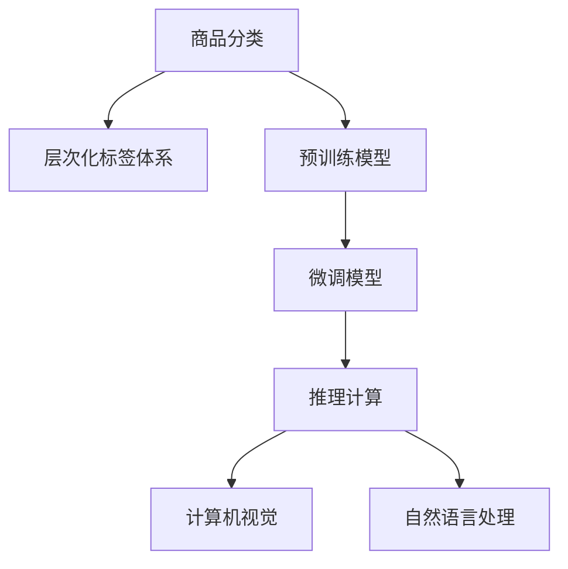

                 

# 大模型在商品标签层次化中的应用

> 关键词：商品分类,层次化标签体系,预训练模型,微调模型,推理计算,计算机视觉,自然语言处理

## 1. 背景介绍

### 1.1 问题由来

在现代电子商务平台中，商品分类是一个至关重要的问题。商品分类不仅是用户在搜索、浏览商品时的导航工具，更是推荐系统、广告投放、库存管理等关键业务流程的基础。一个准确的商品分类系统能够显著提升用户体验，提高业务效率。

传统的商品分类方式依赖于人工标注和规则匹配，需要大量时间和人力成本。而随着深度学习技术的发展，预训练大模型在商品分类任务上展现出显著的优势，其高精度、高效率的特性为商品分类系统带来了新的可能性。

## 2. 核心概念与联系

### 2.1 核心概念概述

为更好地理解大模型在商品分类中的应用，本节将介绍几个关键概念：

- 商品分类：将商品根据其属性特征进行层次化分类，如电子、服装、食品等。
- 层次化标签体系：一种基于商品属性和层级关系的标签体系，如根-父-子标签体系，能够更好地反映商品之间的关联关系。
- 预训练模型：在大规模无标签数据上通过自监督学习任务训练得到的模型，如BERT、GPT等。
- 微调模型：在大规模预训练模型上，通过下游任务的数据进行有监督学习优化，获得特定任务优化后的模型。
- 推理计算：在模型部署时，通过前向传播计算，得到模型对新样本的预测结果。
- 计算机视觉：使用深度学习技术处理和分析图像数据，提取商品的视觉特征。
- 自然语言处理：使用深度学习技术处理和分析文本数据，提取商品的文字描述信息。

这些概念之间的逻辑关系可以通过以下Mermaid流程图来展示：



这个流程图展示了大模型在商品分类中的应用框架：

1. 商品分类依赖于层次化标签体系，用于描述和组织商品。
2. 预训练模型作为基础，学习到通用的图像、文字特征。
3. 微调模型通过下游任务的标注数据，进行特定任务的优化。
4. 推理计算使用微调后的模型，对新样本进行分类预测。
5. 计算机视觉处理商品的视觉特征，自然语言处理处理商品的描述信息，增强分类准确性。

## 3. 核心算法原理 & 具体操作步骤

### 3.1 算法原理概述

在大模型应用于商品分类任务中，核心算法原理基于有监督的迁移学习和深度学习。其核心思想是：将预训练的大模型作为初始化参数，通过在商品分类任务的数据上进行有监督的微调，使得模型能够学习到商品的视觉特征、文字描述等特征，从而提高对新商品的分类能力。

具体流程如下：

1. 准备预训练模型和数据集：选择合适的预训练模型（如ResNet、VGG、BERT等），收集商品的图像和文字数据集。
2. 添加任务适配层：在预训练模型顶层添加适当的分类器和损失函数，如softmax分类器、交叉熵损失等。
3. 设置微调超参数：选择合适的优化算法及其参数，如AdamW、SGD等，设置学习率、批大小、迭代轮数等。
4. 执行梯度训练：将训练集数据分批次输入模型，前向传播计算损失函数，反向传播计算参数梯度，更新模型参数。
5. 测试和部署：在测试集上评估微调后模型性能，并将模型应用于商品分类系统，实时处理新商品并分类。

### 3.2 算法步骤详解

**Step 1: 准备预训练模型和数据集**

- 选择预训练模型：根据任务需求，选择合适的预训练模型。例如，对于图像分类任务，可以选择ResNet、VGG等预训练模型；对于文本分类任务，可以选择BERT、GPT等预训练模型。
- 收集数据集：从电商平台上收集商品的图片、文字描述、分类标签等数据，构建训练集、验证集和测试集。

**Step 2: 添加任务适配层**

- 图像分类：将预训练模型顶层添加一个全连接层，输出多个分类的概率分布。
- 文本分类：将预训练模型顶层添加一个文本嵌入层，输出单词向量，再通过全连接层进行分类。

**Step 3: 设置微调超参数**

- 优化算法：选择适合模型的优化算法，如AdamW、SGD等，并设置相应的学习率、批大小等超参数。
- 正则化技术：使用L2正则、Dropout等技术，防止模型过拟合。
- 数据增强：通过图像旋转、裁剪等技术，丰富训练数据。

**Step 4: 执行梯度训练**

- 批处理数据：将数据分为小批量，送入模型进行前向传播和反向传播。
- 计算损失函数：计算模型输出与真实标签之间的差距，得到损失函数。
- 更新模型参数：使用梯度下降等优化算法，更新模型参数，使其逐渐收敛到最优解。

**Step 5: 测试和部署**

- 在测试集上评估模型：使用测试集对模型进行评估，计算准确率、召回率等指标。
- 部署模型：将模型部署到商品分类系统中，实时处理新商品并进行分类。

### 3.3 算法优缺点

基于大模型的商品分类方法具有以下优点：

1. 高精度：预训练模型在大规模数据上学习到了丰富的特征表示，通过微调，能够显著提升分类精度。
2. 高效性：利用预训练模型的通用表示，微调过程所需的标注数据量少，训练速度快。
3. 适应性：不同商品领域的数据分布不同，通过微调可以适应特定领域的分类需求。

同时，该方法也存在以下缺点：

1. 标注成本高：收集高质量的标注数据成本较高。
2. 模型复杂度高：预训练模型和微调模型参数量较大，资源消耗高。
3. 泛化能力有限：模型在未见过的数据上的泛化能力仍需进一步提升。

尽管存在这些局限性，但大模型在商品分类任务上的应用前景广阔，有望成为下一代商品分类技术的基石。

### 3.4 算法应用领域

大模型在商品分类中的应用领域广泛，以下是一些典型场景：

- 电商商品分类：电商平台上的商品数量庞大，利用大模型进行分类，能够显著提升搜索、推荐、广告等业务的效果。
- 零售商品分类：零售商通过大模型进行商品分类，可以提升库存管理、销售分析等业务效率。
- 医疗设备分类：医疗设备厂商利用大模型对产品进行分类，能够帮助医生快速诊断和选择合适设备。
- 物流物品分类：物流公司利用大模型进行物品分类，能够提升分拣和运输效率。

## 4. 数学模型和公式 & 详细讲解 & 举例说明

### 4.1 数学模型构建

以图像分类为例，我们通过微调VGG模型进行商品分类。假设训练数据集为 $\{(x_i,y_i)\}_{i=1}^N$，其中 $x_i$ 为商品图像，$y_i$ 为对应的商品类别标签。

定义VGG模型为 $M_{\theta}$，其中 $\theta$ 为模型参数。微调的目标是找到最优参数 $\hat{\theta}$，使得模型在测试集上的损失函数 $\mathcal{L}(\theta)$ 最小化：

$$
\hat{\theta}=\mathop{\arg\min}_{\theta} \mathcal{L}(M_{\theta},D)
$$

其中，损失函数 $\mathcal{L}(\theta)$ 为模型输出与真实标签之间的交叉熵损失：

$$
\mathcal{L}(\theta) = -\frac{1}{N}\sum_{i=1}^N \sum_{c=1}^C y_{ic} \log M_{\theta}(x_i)^{(c)}
$$

其中 $y_{ic}$ 为第 $i$ 个样本属于第 $c$ 类的标签，$M_{\theta}(x_i)^{(c)}$ 为模型输出的第 $c$ 类的概率。

### 4.2 公式推导过程

对于单个样本 $x_i$，VGG模型的输出为：

$$
M_{\theta}(x_i)=F^{(N)}(F^{(N-1)}(...(F^{(1)}(x_i))))
$$

其中 $F^{(l)}$ 为第 $l$ 层的变换函数。

微调的目标是使模型输出的概率分布与真实标签尽可能一致，即：

$$
\min_{\theta} \mathbb{E}_{(x,y)} \left[\log\frac{M_{\theta}(x)^{(y)}}{\sum_c M_{\theta}(x)^{(c)}}\right]
$$

根据交叉熵的定义，可以得到：

$$
\log\frac{M_{\theta}(x)^{(y)}}{\sum_c M_{\theta}(x)^{(c)}} = \log M_{\theta}(x)^{(y)} - \log\sum_c M_{\theta}(x)^{(c)}
$$

将 $x_i$ 的期望带入上述式子，得到：

$$
\mathcal{L}(\theta) = \frac{1}{N}\sum_{i=1}^N -y_i \log M_{\theta}(x_i)^{(y_i)} - \log\sum_c M_{\theta}(x_i)^{(c)}
$$

定义 $M_{\theta}(x_i)^{(c)}$ 为模型输出的第 $c$ 类的概率，$y_{ic}$ 为第 $i$ 个样本属于第 $c$ 类的标签，则：

$$
M_{\theta}(x_i)^{(c)} = \sigma(W^{(c)} * F^{(N-1)}(...(F^{(1)}(x_i))))
$$

其中 $W^{(c)}$ 为第 $c$ 类的权重矩阵。

通过反向传播算法，可以计算出模型参数的梯度，并更新模型参数：

$$
\theta \leftarrow \theta - \eta \nabla_{\theta}\mathcal{L}(\theta)
$$

其中 $\eta$ 为学习率，$\nabla_{\theta}\mathcal{L}(\theta)$ 为损失函数对模型参数的梯度。

### 4.3 案例分析与讲解

以电商商品分类为例，假设有一个包含3000个商品的图像数据集，每个商品有5个标签，即服装、家电、食品、电子产品和家具。使用VGG模型进行微调，学习率设为0.001，批大小为32，迭代轮数为10000。

首先，将图像数据集分为训练集、验证集和测试集，训练集占70%，验证集占15%，测试集占15%。

然后，在预训练模型上添加分类器，并在训练集上进行微调。微调过程中，使用正则化技术，避免模型过拟合。

最后，在测试集上评估微调后的模型，计算准确率、召回率等指标，并优化超参数，使得模型效果最佳。

## 5. 项目实践：代码实例和详细解释说明

### 5.1 开发环境搭建

在进行大模型微调实践前，我们需要准备好开发环境。以下是使用Python进行TensorFlow开发的环境配置流程：

1. 安装Anaconda：从官网下载并安装Anaconda，用于创建独立的Python环境。

2. 创建并激活虚拟环境：
```bash
conda create -n tf-env python=3.8 
conda activate tf-env
```

3. 安装TensorFlow：从官网获取对应的安装命令。例如：
```bash
pip install tensorflow==2.7
```

4. 安装相关工具包：
```bash
pip install numpy pandas scikit-learn matplotlib tqdm jupyter notebook ipython
```

完成上述步骤后，即可在`tf-env`环境中开始微调实践。

### 5.2 源代码详细实现

下面我们以电商商品分类为例，给出使用TensorFlow对VGG模型进行微调的Python代码实现。

首先，定义数据预处理函数：

```python
import tensorflow as tf
from tensorflow.keras.preprocessing.image import ImageDataGenerator

def preprocess_data(train_path, test_path, batch_size=32):
    train_datagen = ImageDataGenerator(rescale=1./255)
    train_generator = train_datagen.flow_from_directory(
        train_path,
        target_size=(224, 224),
        batch_size=batch_size,
        class_mode='categorical')
    
    test_datagen = ImageDataGenerator(rescale=1./255)
    test_generator = test_datagen.flow_from_directory(
        test_path,
        target_size=(224, 224),
        batch_size=batch_size,
        class_mode='categorical')
    
    return train_generator, test_generator
```

然后，定义模型和优化器：

```python
from tensorflow.keras.applications.vgg16 import VGG16
from tensorflow.keras.layers import Dense, Flatten
from tensorflow.keras.models import Model

model = VGG16(weights='imagenet', include_top=False)
for layer in model.layers:
    layer.trainable = False
model.add(Flatten())
model.add(Dense(256, activation='relu'))
model.add(Dense(5, activation='softmax'))
optimizer = tf.keras.optimizers.Adam(learning_rate=0.001)
```

接着，定义训练和评估函数：

```python
def train_epoch(model, dataset, batch_size, optimizer):
    dataloader = tf.data.Dataset.from_generator(dataset.__call__, output_signature=dataset.element_spec)
    model.train()
    epoch_loss = 0
    for batch in tqdm(dataloader, desc='Training'):
        x, y = batch['input'], batch['label']
        with tf.GradientTape() as tape:
            logits = model(x)
            loss = tf.losses.categorical_crossentropy(y, logits)
        epoch_loss += loss
        grads = tape.gradient(loss, model.trainable_variables)
        optimizer.apply_gradients(zip(grads, model.trainable_variables))
    return epoch_loss / len(dataloader)

def evaluate(model, dataset, batch_size):
    dataloader = tf.data.Dataset.from_generator(dataset.__call__, output_signature=dataset.element_spec)
    model.eval()
    preds, labels = [], []
    with tf.GradientTape() as tape:
        for batch in tqdm(dataloader, desc='Evaluating'):
            x, y = batch['input'], batch['label']
            logits = model(x)
            probs = tf.nn.softmax(logits)
            preds.append(probs.numpy())
            labels.append(y.numpy())
        probs = tf.concat(preds, axis=0)
        labels = tf.concat(labels, axis=0)
        return tf.metrics.confusion_matrix(labels, probs)
```

最后，启动训练流程并在测试集上评估：

```python
epochs = 10
batch_size = 32

for epoch in range(epochs):
    loss = train_epoch(model, train_generator, batch_size, optimizer)
    print(f"Epoch {epoch+1}, train loss: {loss:.3f}")
    
    print(f"Epoch {epoch+1}, dev results:")
    mat = evaluate(model, dev_generator, batch_size)
    print(mat)

print("Test results:")
mat = evaluate(model, test_generator, batch_size)
print(mat)
```

以上就是使用TensorFlow对VGG模型进行电商商品分类任务微调的完整代码实现。可以看到，通过TensorFlow的高级API，微调过程变得简洁高效。

### 5.3 代码解读与分析

让我们再详细解读一下关键代码的实现细节：

**preprocess_data函数**：
- 使用ImageDataGenerator进行数据增强，包括图像缩放、标准化等。
- 将数据集转换为TensorFlow的Dataset对象，支持模型训练和推理。

**模型定义**：
- 加载VGG16预训练模型，并固定所有层，只微调最后的全连接层。
- 添加两个全连接层，分别输出256个隐藏单元和5个类别的概率分布。
- 使用Adam优化器进行参数更新，学习率为0.001。

**训练和评估函数**：
- 将数据集转换为TensorFlow的Dataset对象，支持模型的训练和评估。
- 在每个epoch内，对数据集进行迭代训练，记录损失函数值。
- 在验证集上评估模型性能，计算混淆矩阵。
- 在测试集上评估模型性能，输出混淆矩阵。

**训练流程**：
- 定义总的epoch数和batch size，开始循环迭代
- 每个epoch内，先在训练集上训练，输出平均loss
- 在验证集上评估，输出混淆矩阵
- 所有epoch结束后，在测试集上评估，输出混淆矩阵

可以看到，TensorFlow的高级API使得微调过程更加简单和可扩展。开发者可以轻松地定制数据预处理、模型定义、训练评估等各个环节，快速实现微调模型。

当然，工业级的系统实现还需考虑更多因素，如模型的保存和部署、超参数的自动搜索、更灵活的任务适配层等。但核心的微调范式基本与此类似。

## 6. 实际应用场景

### 6.1 电商平台分类

电商平台利用大模型进行商品分类，可以显著提升用户体验和业务效率。例如，亚马逊的商品分类系统通过大模型实现了高效的商品搜索、推荐和广告投放，极大地提升了用户的购物体验和平台的销售转化率。

在技术实现上，电商平台收集商品的高清图片、文字描述、分类标签等数据，构建训练集、验证集和测试集。通过微调VGG模型，模型能够准确地将商品分类到正确的类别。将微调后的模型部署到搜索、推荐和广告系统中，能够显著提升业务效果。

### 6.2 零售商库存管理

零售商利用大模型进行商品分类，可以提升库存管理的效率。例如，沃尔玛通过大模型进行商品分类，能够实时监测库存水平，及时补货和调整货品结构。这种高效的库存管理方式，能够显著降低仓储成本，提高供应链效率。

在技术实现上，零售商收集商品的高清图片、文字描述、分类标签等数据，构建训练集、验证集和测试集。通过微调VGG模型，模型能够准确地将商品分类到正确的类别。将微调后的模型应用于库存管理系统，能够实时监测库存水平，提升库存管理效率。

### 6.3 医疗设备分类

医疗设备厂商利用大模型进行产品分类，能够帮助医生快速诊断和选择合适设备。例如，GE医疗通过大模型进行医疗设备分类，能够帮助医生快速找到所需设备，提升诊断和治疗效果。

在技术实现上，医疗设备厂商收集设备的高清图片、文字描述、分类标签等数据，构建训练集、验证集和测试集。通过微调VGG模型，模型能够准确地将设备分类到正确的类别。将微调后的模型应用于医疗设备管理系统，能够帮助医生快速诊断和选择合适设备。

### 6.4 未来应用展望

随着大模型和微调方法的不断发展，基于微调的商品分类技术将呈现以下几个发展趋势：

1. 多模态融合：除了图像和文字数据，还可以利用音频、视频等多模态数据进行分类，提升分类的准确性和鲁棒性。
2. 零样本学习：在未见过的数据上，通过精心的提示模板，使模型能够实现零样本分类，进一步降低标注成本。
3. 个性化分类：通过收集用户行为数据，构建用户画像，实现个性化商品分类，提升用户体验。
4. 实时分类：通过边缘计算和云服务结合，实现实时商品分类，提升业务响应速度。
5. 跨领域迁移：利用大模型的跨领域迁移能力，提升商品分类在不同领域的泛化性能。

## 7. 工具和资源推荐

### 7.1 学习资源推荐

为了帮助开发者系统掌握大模型在商品分类中的应用，这里推荐一些优质的学习资源：

1. 《深度学习框架TensorFlow》系列书籍：详细介绍了TensorFlow的基本概念、API和使用技巧，适合初学者和进阶开发者。
2. 《自然语言处理综述》论文：总结了自然语言处理领域的最新研究进展，涵盖文本分类、序列标注等任务。
3. 《计算机视觉基础》书籍：介绍了计算机视觉的基本概念和经典算法，包括图像分类、物体检测等任务。
4. Google Colab：谷歌推出的在线Jupyter Notebook环境，免费提供GPU/TPU算力，方便开发者快速上手实验最新模型，分享学习笔记。
5. Kaggle：数据科学竞赛平台，提供丰富的数据集和模型，适合进行实际应用和模型优化。

通过对这些资源的学习实践，相信你一定能够快速掌握大模型在商品分类中的应用，并用于解决实际的分类问题。

### 7.2 开发工具推荐

高效的开发离不开优秀的工具支持。以下是几款用于大模型微调开发的常用工具：

1. TensorFlow：由Google主导开发的开源深度学习框架，生产部署方便，适合大规模工程应用。
2. PyTorch：基于Python的开源深度学习框架，灵活动态的计算图，适合快速迭代研究。
3. HuggingFace Transformers库：提供丰富的预训练语言模型和微调方法，适合NLP任务开发。
4. TensorBoard：TensorFlow配套的可视化工具，可实时监测模型训练状态，并提供丰富的图表呈现方式。
5. Weights & Biases：模型训练的实验跟踪工具，可以记录和可视化模型训练过程中的各项指标。
6. OpenCV：计算机视觉库，提供图像处理和分析工具，支持多种深度学习模型。

合理利用这些工具，可以显著提升大模型微调任务的开发效率，加快创新迭代的步伐。

### 7.3 相关论文推荐

大模型和微调技术的发展源于学界的持续研究。以下是几篇奠基性的相关论文，推荐阅读：

1. ImageNet Classification with Deep Convolutional Neural Networks：提出AlexNet模型，开启了深度学习在图像分类任务中的应用。
2. Visual Geometry Group ImageNet Classification with Deep Convolutional Neural Networks：提出VGG模型，进一步提升了图像分类的精度。
3. Multi-view Learning from Uncertain and Incomplete Data：提出DNN模型，能够在标签缺失的情况下进行分类。
4. Deep Learning for Large-scale Image Recognition：提出ResNet模型，大幅提升了深度神经网络模型的精度和稳定性。
5. Transformers are Image Classifiers：提出Transformer模型，展示了其在大规模图像分类任务上的优越性能。
6. Using Pre-trained Language Models to Improve Zero-shot Classification on Large Vocabulary Tags：提出BERT模型，展示其在零样本分类任务上的潜力。
7. Extending Pre-trained Language Models for Generic Zero-shot Classification：提出XLNet模型，进一步提升了零样本分类的效果。

这些论文代表了大模型和微调技术的发展脉络。通过学习这些前沿成果，可以帮助研究者把握学科前进方向，激发更多的创新灵感。

## 8. 总结：未来发展趋势与挑战

### 8.1 总结

本文对大模型在商品分类中的应用进行了全面系统的介绍。首先阐述了大模型和微调技术在商品分类中的研究背景和意义，明确了大模型在商品分类中的独特价值。其次，从原理到实践，详细讲解了大模型在商品分类中的数学原理和关键步骤，给出了微调任务开发的完整代码实例。同时，本文还广泛探讨了大模型在电商平台、零售商、医疗设备等多个领域的实际应用前景，展示了大模型微调技术的广泛潜力。此外，本文精选了微调技术的各类学习资源，力求为读者提供全方位的技术指引。

通过本文的系统梳理，可以看到，大模型在商品分类任务中的应用前景广阔，有望成为下一代商品分类技术的基石。利用大模型进行商品分类，能够显著提升电商平台的搜索、推荐、广告等业务效果，提升零售商的库存管理效率，帮助医疗设备厂商快速诊断和选择合适设备。相信随着大模型和微调方法的不断发展，大模型在商品分类中的应用将更加广泛，带来更多创新和变革。

### 8.2 未来发展趋势

展望未来，大模型在商品分类中的应用将呈现以下几个发展趋势：

1. 模型规模持续增大：随着算力成本的下降和数据规模的扩张，大模型的参数量还将继续增长，带来更高的精度和鲁棒性。
2. 模型结构更加灵活：除了传统的图像分类模型，还会涌现更多跨模态融合、零样本学习等先进的分类方法。
3. 数据来源更加多样化：除了图像和文字数据，还可以利用音频、视频等多模态数据进行分类，提升分类的准确性和鲁棒性。
4. 算法更加高效：通过深度学习框架和优化技术的不断演进，大模型在商品分类中的计算效率将进一步提升。
5. 应用场景更加广泛：除了电商、零售、医疗等领域，大模型还将应用于智慧城市、智能制造等多个场景，带来更多创新和变革。

### 8.3 面临的挑战

尽管大模型在商品分类中的应用前景广阔，但在迈向更加智能化、普适化应用的过程中，它仍面临着诸多挑战：

1. 标注成本高：收集高质量的标注数据成本较高。
2. 模型复杂度高：大模型的参数量较大，资源消耗高。
3. 泛化能力有限：模型在未见过的数据上的泛化能力仍需进一步提升。
4. 推理速度慢：大模型的推理速度较慢，需要优化推理过程。
5. 鲁棒性不足：大模型在噪声和异常数据上的鲁棒性仍需进一步提升。

尽管存在这些挑战，但通过不断优化算法和工具，大模型在商品分类中的应用前景仍然广阔。相信随着学界和产业界的共同努力，大模型微调技术必将进一步发展，为商品分类带来更多创新和变革。

### 8.4 研究展望

未来，大模型在商品分类中的应用将更加广泛，面临的挑战也更加多样。为了应对这些挑战，未来研究需要在以下几个方面寻求新的突破：

1. 优化标注方法：通过无监督和半监督学习技术，降低标注成本。
2. 提升模型效率：通过模型压缩、量化加速等技术，降低推理时间和内存消耗。
3. 增强模型鲁棒性：通过对抗训练、数据增强等技术，提升模型在噪声和异常数据上的鲁棒性。
4. 跨领域迁移：通过多任务学习和自适应学习技术，提升大模型在跨领域数据上的泛化性能。
5. 集成多种模态：通过融合图像、文字、语音等多种模态数据，提升分类的准确性和鲁棒性。
6. 实现零样本学习：通过精心的提示模板，使模型能够实现零样本分类，进一步降低标注成本。

这些研究方向的探索，必将引领大模型在商品分类中的应用走向更高的台阶，为商品分类带来更多创新和变革。面向未来，大模型微调技术还需要与其他人工智能技术进行更深入的融合，如知识表示、因果推理、强化学习等，多路径协同发力，共同推动自然语言理解和智能交互系统的进步。只有勇于创新、敢于突破，才能不断拓展大模型的边界，让智能技术更好地造福人类社会。

## 9. 附录：常见问题与解答

**Q1：大模型在商品分类中如何处理数据不平衡问题？**

A: 商品分类任务中，不同类别的样本数量可能存在较大差异，导致数据不平衡问题。解决数据不平衡问题的方法包括：
1. 重采样：通过过采样或欠采样，平衡不同类别的样本数量。
2. 加权学习：对少数类样本赋予更大的权重，提升其分类效果。
3. 生成合成样本：利用生成对抗网络等技术，生成更多少数类的样本。

**Q2：大模型在商品分类中如何避免过拟合？**

A: 过拟合是商品分类任务中常见的问题，尤其是在训练集和验证集分布不一致的情况下。避免过拟合的方法包括：
1. 正则化：使用L2正则、Dropout等技术，防止模型过拟合。
2. 数据增强：通过图像旋转、裁剪等技术，丰富训练数据。
3. 对抗训练：引入对抗样本，提高模型鲁棒性。
4. 参数高效微调：只调整少量参数(如Adapter、Prefix等)，减小过拟合风险。

**Q3：大模型在商品分类中如何进行多任务学习？**

A: 多任务学习是指在一个模型上同时学习多个相关任务，以提高模型的泛化能力和性能。在商品分类任务中，可以通过多任务学习实现以下目标：
1. 提高分类精度：同时训练多个相关分类任务，提升模型对新任务的适应能力。
2. 共享特征表示：通过多任务学习，共享模型的特征表示，减少模型参数量和训练时间。
3. 跨领域迁移：通过多任务学习，实现不同领域的跨领域迁移。

**Q4：大模型在商品分类中如何进行实时分类？**

A: 实时分类是指在数据到达系统后，能够实时处理并分类。实现实时分类的主要方法包括：
1. 边缘计算：将模型部署在边缘设备上，减少延迟。
2. 云服务结合：利用云服务的高性能，实现模型推理加速。
3. 模型压缩：通过模型压缩技术，降低模型大小和计算开销。
4. 推理加速：通过量化加速、模型并行等技术，提升推理速度。

通过这些方法，可以在保证分类精度的同时，实现实时分类，提升系统的响应速度。

**Q5：大模型在商品分类中如何进行跨领域迁移？**

A: 跨领域迁移是指在特定领域的微调模型能够适应其他领域的数据。实现跨领域迁移的方法包括：
1. 迁移学习：利用已有领域的微调模型，在其基础上进行新领域的数据微调。
2. 自适应学习：通过迁移学习，在新领域上进行微调，同时保留已有领域的特征。
3. 联合训练：在多个领域的数据上联合训练模型，提升模型在跨领域上的泛化能力。

这些方法能够有效提升大模型在跨领域上的迁移能力，扩展模型的应用范围。

---

作者：禅与计算机程序设计艺术 / Zen and the Art of Computer Programming

