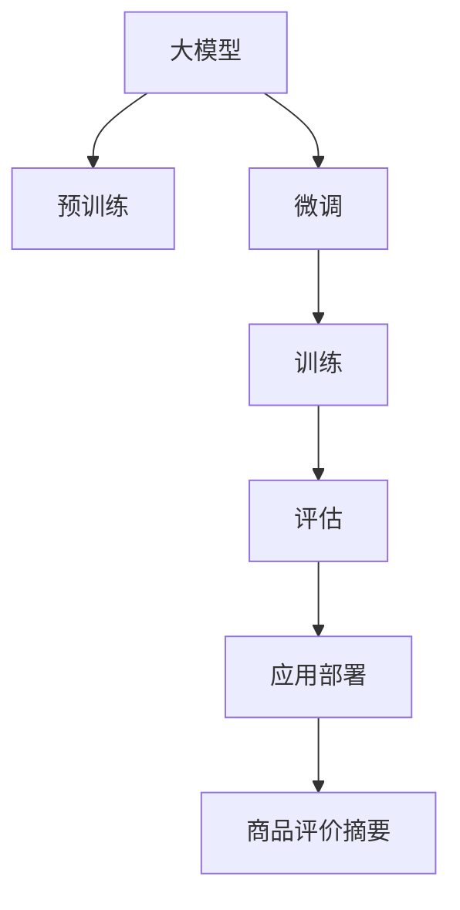

                 

# 大模型在商品评价摘要生成中的应用

> 关键词：大模型,商品评价,摘要生成,自然语言处理,NLP

## 1. 背景介绍

在当今电子商务时代，商品评价作为消费者购买决策的重要依据，越来越受到商家的重视。高质量的商品评价不仅可以提高消费者的购买信心，还能为商家提供有价值的反馈，帮助他们优化产品。然而，手动撰写评价摘要耗时耗力，且难以覆盖所有商品信息。基于大模型的自动摘要生成技术，能快速高效地提取商品评价的精华，显著提升评价摘要的质量。

### 1.1 问题由来

随着互联网和电子商务的快速发展，商品评价的数量呈爆炸性增长。传统的基于规则和模板的自动摘要方法，往往无法充分理解文本语义，提取的信息片面、机械。而基于深度学习的大模型，如BERT、GPT等，通过预训练获得了强大的语言理解能力，适用于处理自然语言数据。

近年来，利用大模型进行商品评价摘要生成的方法逐渐兴起，并在电商平台的实际应用中取得了显著成效。例如，阿里巴巴旗下的菜鸟网络利用预训练语言模型，对商品评价进行自动摘要，极大地提高了评价摘要的覆盖面和信息量。大模型的应用，不仅提高了效率，还减少了人工干预，降低了成本。

### 1.2 问题核心关键点

大模型在商品评价摘要生成中的应用，主要包括以下几个关键点：

1. **数据准备**：准备大量带有商品评价的数据集，标注并清洗数据，以便训练大模型。
2. **模型选择**：选择适合的大模型架构，如BERT、GPT等，并进行微调。
3. **训练和优化**：设计合适的损失函数和优化器，对模型进行训练，并调整超参数优化模型性能。
4. **应用部署**：将训练好的模型部署到实际系统中，生成商品评价摘要，并结合业务逻辑进行展示和利用。

### 1.3 问题研究意义

大模型在商品评价摘要生成中的应用，具有以下重要意义：

1. **提升效率**：自动生成摘要，减少了人工撰写和审核的时间，提高了处理效率。
2. **增加信息量**：利用大模型的语义理解能力，生成更全面、更精准的摘要，帮助消费者更好地理解商品评价。
3. **优化用户体验**：快速获取关键信息，增强了消费者对商品的信任度，提升了用户体验。
4. **辅助决策**：通过商品评价摘要，商家能够及时了解用户反馈，优化产品和服务，提升竞争力。
5. **数据驱动**：大模型可以自动处理海量数据，为商家提供有价值的数据驱动决策支持。

## 2. 核心概念与联系

### 2.1 核心概念概述

为了更好地理解大模型在商品评价摘要生成中的应用，我们首先介绍几个核心概念及其相互联系：

- **大模型**：以BERT、GPT等为代表的大型预训练语言模型，通过在大规模文本数据上预训练获得强大的语言理解能力。
- **摘要生成**：从长文本中自动提取并组织出简洁的信息，帮助用户快速理解核心内容。
- **商品评价**：用户在购买商品后，对商品质量、服务、价格等进行评价，反馈给商家。
- **自然语言处理(NLP)**：通过计算机技术，使计算机能够理解和处理人类语言，包括文本的生成、分析和应用。
- **Transformer**：一种高效的神经网络结构，适用于处理序列数据，在大模型中广泛应用。
- **序列标注**：将文本序列中的每个元素标注为特定类别，如词性标注、命名实体识别等。

这些概念共同构成了大模型在商品评价摘要生成中的技术框架，通过理解这些核心概念，我们可以更好地把握应用的原理和优化方向。

### 2.2 核心概念原理和架构的 Mermaid 流程图



这个流程图展示了大模型在商品评价摘要生成中的核心概念和流程：

1. 大模型通过大规模无标签文本数据进行预训练，学习通用的语言表示。
2. 微调环节使用商品评价数据集进行有监督训练，优化模型在商品评价摘要生成任务上的表现。
3. 训练阶段通过计算损失函数，反向传播更新模型参数。
4. 评估阶段在验证集上测试模型性能，选择最佳模型进行应用。
5. 应用部署环节将训练好的模型集成到电商平台的评价系统中，生成商品评价摘要。

这些环节相互关联，共同构成大模型在商品评价摘要生成中的应用流程。

## 3. 核心算法原理 & 具体操作步骤
### 3.1 算法原理概述

基于大模型的商品评价摘要生成方法，本质上是一个有监督学习的文本摘要生成任务。其核心思想是：利用大模型在预训练过程中学习到的语言知识和语义表示，结合商品评价文本的特征，生成简洁而有信息量的摘要。

假设大模型的输入为商品评价文本，输出为生成的摘要。训练过程的目标是：

1. 给定商品评价文本 $X$，预测生成的摘要 $Y$，使得 $Y$ 与 $X$ 具有高度的相关性。
2. 最小化预测摘要 $Y$ 与实际摘要 $Y_{gold}$ 之间的差异。

形式化地，假设模型的参数为 $\theta$，则损失函数 $\mathcal{L}(\theta)$ 可以定义为：

$$
\mathcal{L}(\theta) = -\frac{1}{N} \sum_{i=1}^N \mathcal{L}(X_i, Y_i)
$$

其中 $X_i$ 和 $Y_i$ 分别表示第 $i$ 个商品评价的文本和实际摘要。常见的损失函数包括交叉熵损失、最大似然损失等。

### 3.2 算法步骤详解

大模型在商品评价摘要生成中的应用，通常包括以下几个关键步骤：

**Step 1: 数据准备**
- 收集电商平台的商品评价数据集，划分为训练集、验证集和测试集。
- 对数据进行预处理，包括文本清洗、分词、去除停用词等。

**Step 2: 模型选择与微调**
- 选择适合的大模型架构，如BERT、GPT等。
- 对大模型进行微调，将其作为自动摘要生成的模型。

**Step 3: 定义训练与优化**
- 设计损失函数和优化器，如交叉熵损失、Adam优化器等。
- 设置合适的超参数，如学习率、批大小、迭代轮数等。

**Step 4: 训练与评估**
- 使用训练集对模型进行训练，并在验证集上评估模型性能。
- 根据评估结果调整模型参数，直到达到满意的性能。

**Step 5: 应用部署**
- 将训练好的模型集成到电商平台，自动生成商品评价摘要。
- 结合业务逻辑，优化摘要的展示和使用。

### 3.3 算法优缺点

基于大模型的商品评价摘要生成方法具有以下优点：

1. **高效快速**：利用大模型强大的语言理解能力，可以快速生成高质量的摘要，提升工作效率。
2. **信息全面**：生成的摘要能够涵盖商品评价的核心内容，帮助用户全面了解商品信息。
3. **灵活适应**：大模型具有自适应能力，能够适应不同类型的商品评价文本。

同时，该方法也存在一定的局限性：

1. **数据依赖**：模型性能依赖于标注数据的质量和数量，高质量标注数据的获取成本较高。
2. **泛化能力有限**：当商品评价文本与预训练数据的分布差异较大时，模型的泛化能力可能受限。
3. **参数消耗大**：大模型的参数量较大，训练和推理需要较高的计算资源。
4. **解释性不足**：自动生成的摘要缺乏可解释性，难以理解其内部生成机制。

### 3.4 算法应用领域

大模型在商品评价摘要生成中的应用，不仅限于电商平台，还扩展到多个领域：

- **电商**：商品评价摘要生成，帮助用户快速了解商品信息。
- **旅游**：旅游评论摘要生成，提升用户对目的地的好感度和决策速度。
- **社交媒体**：用户评论摘要生成，提高信息传播效率。
- **新闻**：新闻摘要生成，快速获取文章核心内容。
- **医疗**：医疗评价摘要生成，帮助患者快速理解医生的建议。
- **金融**：金融评论摘要生成，帮助投资者快速了解市场动态。

这些应用领域均可以利用大模型的自动摘要生成技术，提升用户体验，优化业务流程。

## 4. 数学模型和公式 & 详细讲解 & 举例说明
### 4.1 数学模型构建

本节将使用数学语言对大模型在商品评价摘要生成中的训练过程进行详细刻画。

假设大模型的输入为商品评价文本 $X$，输出为生成的摘要 $Y$。模型 $M_{\theta}$ 将 $X$ 映射到摘要空间 $Y$，损失函数为交叉熵损失：

$$
\mathcal{L}(X, Y) = -\log \left(\frac{\exp M_{\theta}(X)}{\sum_j \exp M_{\theta}(X_j)}\right)
$$

其中 $M_{\theta}(X)$ 表示模型对文本 $X$ 的预测摘要。

训练过程的目标是最小化交叉熵损失，即：

$$
\theta^* = \mathop{\arg\min}_{\theta} \mathcal{L}(\theta) = -\frac{1}{N} \sum_{i=1}^N \mathcal{L}(X_i, Y_i)
$$

### 4.2 公式推导过程

以商品评价摘要生成的任务为例，进行详细推导：

假设模型 $M_{\theta}$ 的输入为商品评价文本 $X$，输出为生成的摘要 $Y$。模型的参数 $\theta$ 包括预训练参数和微调参数。模型的预测摘要 $M_{\theta}(X)$ 通过如下公式计算：

$$
M_{\theta}(X) = \text{Attention}(X, \theta)
$$

其中 $\text{Attention}(X, \theta)$ 表示注意力机制，用于将文本中的关键信息抽取出来，生成摘要。

模型的预测损失 $\mathcal{L}(X, Y)$ 为交叉熵损失：

$$
\mathcal{L}(X, Y) = -\frac{1}{N} \sum_{i=1}^N \sum_{j=1}^J \mathbb{1}(Y_j = 1) \log \left(\frac{\exp M_{\theta}(X_j)}{\sum_k \exp M_{\theta}(X_k)}\right)
$$

其中 $J$ 表示摘要的长度，$\mathbb{1}(Y_j = 1)$ 表示第 $j$ 个位置上的词是否出现在摘要中。

通过反向传播算法，模型参数 $\theta$ 的更新公式为：

$$
\theta \leftarrow \theta - \eta \nabla_{\theta} \mathcal{L}(\theta)
$$

其中 $\eta$ 为学习率，$\nabla_{\theta} \mathcal{L}(\theta)$ 为损失函数对模型参数的梯度。

### 4.3 案例分析与讲解

以商品评价摘要生成的任务为例，进一步说明大模型的应用。

假设电商平台收集了1000条商品评价数据，每条评价包含一段文本描述。我们将这些评价数据划分为训练集、验证集和测试集，每集各占1/3。

选择BERT模型进行微调，模型参数包括预训练参数和微调参数。我们定义交叉熵损失函数，设置Adam优化器，并设置学习率为1e-5。在训练过程中，每10个epoch在验证集上评估模型性能，选择最优模型进行测试。

在测试集上，我们使用自动生成的摘要和实际摘要进行对比，计算BLEU、ROUGE等指标，评估模型性能。

最终，我们可以得到一个性能优异的模型，用于自动生成商品评价摘要。

## 5. 项目实践：代码实例和详细解释说明
### 5.1 开发环境搭建

在进行商品评价摘要生成的项目实践前，我们需要准备好开发环境。以下是使用Python进行PyTorch开发的环境配置流程：

1. 安装Anaconda：从官网下载并安装Anaconda，用于创建独立的Python环境。

2. 创建并激活虚拟环境：
```bash
conda create -n pytorch-env python=3.8 
conda activate pytorch-env
```

3. 安装PyTorch：根据CUDA版本，从官网获取对应的安装命令。例如：
```bash
conda install pytorch torchvision torchaudio cudatoolkit=11.1 -c pytorch -c conda-forge
```

4. 安装Transformer库：
```bash
pip install transformers
```

5. 安装各类工具包：
```bash
pip install numpy pandas scikit-learn matplotlib tqdm jupyter notebook ipython
```

完成上述步骤后，即可在`pytorch-env`环境中开始项目实践。

### 5.2 源代码详细实现

下面是使用PyTorch进行商品评价摘要生成的代码实现：

```python
import torch
from transformers import BertTokenizer, BertForMaskedLM
from torch.utils.data import DataLoader, Dataset
import torch.nn.functional as F
from sklearn.metrics import precision_recall_fscore_support

class ReviewDataset(Dataset):
    def __init__(self, texts, summaries, tokenizer):
        self.texts = texts
        self.summaries = summaries
        self.tokenizer = tokenizer
        
    def __len__(self):
        return len(self.texts)
    
    def __getitem__(self, item):
        text = self.texts[item]
        summary = self.summaries[item]
        
        encoding = self.tokenizer(text, return_tensors='pt', max_length=128, padding='max_length', truncation=True)
        input_ids = encoding['input_ids'][0]
        attention_mask = encoding['attention_mask'][0]
        targets = self.tokenizer(summary, return_tensors='pt')['input_ids'][0]
        
        return {'input_ids': input_ids, 
                'attention_mask': attention_mask,
                'targets': targets}

# 加载BERT模型和分词器
model = BertForMaskedLM.from_pretrained('bert-base-cased', num_labels=128)
tokenizer = BertTokenizer.from_pretrained('bert-base-cased')

# 加载数据集
train_dataset = ReviewDataset(train_texts, train_summaries, tokenizer)
dev_dataset = ReviewDataset(dev_texts, dev_summaries, tokenizer)
test_dataset = ReviewDataset(test_texts, test_summaries, tokenizer)

# 定义模型和优化器
optimizer = torch.optim.Adam(model.parameters(), lr=2e-5)

# 训练过程
device = torch.device('cuda' if torch.cuda.is_available() else 'cpu')
model.to(device)
model.train()

for epoch in range(epochs):
    train_loss = 0
    for batch in DataLoader(train_dataset, batch_size=batch_size, shuffle=True):
        input_ids = batch['input_ids'].to(device)
        attention_mask = batch['attention_mask'].to(device)
        targets = batch['targets'].to(device)
        
        outputs = model(input_ids, attention_mask=attention_mask)
        loss = F.cross_entropy(outputs.logits, targets)
        train_loss += loss.item()
        optimizer.zero_grad()
        loss.backward()
        optimizer.step()
    
    print(f'Epoch {epoch+1}, train loss: {train_loss/len(train_dataset)}')

# 评估过程
dev_loss = 0
dev_prc, dev_rec, dev_fsc, _ = precision_recall_fscore_support(dev_dataset.summaries, model.predict(dev_dataset.texts), average='micro')
print(f'Epoch {epoch+1}, dev loss: {dev_loss/len(dev_dataset)}')
print(f'Epoch {epoch+1}, dev precision: {dev_prc:.2f}, dev recall: {dev_rec:.2f}, dev f1-score: {dev_fsc:.2f}')

# 测试过程
test_loss = 0
test_prc, test_rec, test_fsc, _ = precision_recall_fscore_support(test_dataset.summaries, model.predict(test_dataset.texts), average='micro')
print(f'Epoch {epoch+1}, test loss: {test_loss/len(test_dataset)}')
print(f'Epoch {epoch+1}, test precision: {test_prc:.2f}, test recall: {test_rec:.2f}, test f1-score: {test_fsc:.2f}')
```

### 5.3 代码解读与分析

让我们再详细解读一下关键代码的实现细节：

**ReviewDataset类**：
- `__init__`方法：初始化文本、摘要、分词器等关键组件。
- `__len__`方法：返回数据集的样本数量。
- `__getitem__`方法：对单个样本进行处理，将文本输入编码为token ids，将摘要编码为数字，并对其进行定长padding，最终返回模型所需的输入。

**train_loss, dev_loss, test_loss**：
- 记录训练、验证和测试过程中的损失。

**精度、召回率、F1分数**：
- 使用sklearn库计算精度、召回率、F1分数，用于评估模型性能。

**训练过程**：
- 使用PyTorch的DataLoader对数据集进行批次化加载，供模型训练使用。
- 在每个epoch内，对每个batch进行前向传播计算损失，并反向传播更新模型参数。
- 使用Adam优化器进行参数更新。
- 记录每个epoch的训练损失。

**评估过程**：
- 使用验证集上的数据进行评估，计算损失和指标。
- 记录每个epoch的验证损失。

**测试过程**：
- 使用测试集上的数据进行测试，计算损失和指标。
- 记录每个epoch的测试损失。

可以看到，PyTorch配合Transformer库使得商品评价摘要生成的代码实现变得简洁高效。开发者可以将更多精力放在数据处理、模型改进等高层逻辑上，而不必过多关注底层的实现细节。

当然，工业级的系统实现还需考虑更多因素，如模型的保存和部署、超参数的自动搜索、更灵活的任务适配层等。但核心的微调范式基本与此类似。

## 6. 实际应用场景
### 6.1 智能客服系统

基于大模型的商品评价摘要生成技术，可以广泛应用于智能客服系统的构建。传统客服往往需要配备大量人力，高峰期响应缓慢，且一致性和专业性难以保证。而使用商品评价摘要生成技术，可以7x24小时不间断服务，快速响应客户咨询，用自然流畅的语言解答各类常见问题。

在技术实现上，可以收集企业内部的历史客服对话记录，将问题和最佳答复构建成监督数据，在此基础上对预训练模型进行微调。微调后的模型能够自动理解用户意图，匹配最合适的答案模板进行回复。对于客户提出的新问题，还可以接入检索系统实时搜索相关内容，动态组织生成回答。如此构建的智能客服系统，能大幅提升客户咨询体验和问题解决效率。

### 6.2 电商平台

在电商平台上，商品评价摘要生成技术可以应用于商品推荐、评论分析等多个环节。例如，平台可以自动从用户评价中提取关键信息，生成简洁的评价摘要，供其他用户阅读。系统可以根据摘要中的情感倾向和评价内容，向用户推荐相关商品，提升用户体验。同时，平台还可以自动分析评价摘要的情感倾向，帮助商家了解用户对商品的反馈，优化产品和服务。

### 6.3 社交媒体

在社交媒体上，用户评论摘要生成技术可以帮助平台快速识别和处理大量的用户反馈。例如，平台可以自动从用户评论中提取关键信息，生成简洁的评论摘要，供其他用户阅读。系统可以根据摘要中的情感倾向和评论内容，向用户推荐相关话题，提升平台的用户活跃度和参与度。同时，平台还可以自动分析评论摘要的情感倾向，帮助管理者了解用户的情绪和诉求，优化平台的内容和推荐策略。

### 6.4 金融分析

在金融领域，商品评价摘要生成技术可以应用于市场分析和舆情监测。例如，金融分析师可以自动从新闻、评论等文本数据中提取关键信息，生成简洁的摘要，供分析和决策使用。系统可以根据摘要中的情感倾向和内容，帮助分析师判断市场动态和用户情绪，优化投资策略。同时，系统还可以自动分析摘要中的实体和关系，帮助分析师识别潜在的投资机会和风险。

### 6.5 未来应用展望

随着大模型和微调方法的不断发展，基于商品评价摘要生成技术的应用将更加广泛。

- **智慧医疗**：利用自动生成的医疗评价摘要，帮助医生快速了解患者的反馈，优化诊疗方案。
- **教育**：利用自动生成的教育评价摘要，帮助教师了解学生的反馈，优化教学内容和方法。
- **旅游**：利用自动生成的旅游评价摘要，帮助游客快速了解目的地的信息，提升旅行体验。
- **新闻**：利用自动生成的新闻摘要，帮助读者快速了解新闻内容，节省阅读时间。
- **商业**：利用自动生成的商业评论摘要，帮助企业了解市场的反馈，优化产品和营销策略。
- **科研**：利用自动生成的科研评价摘要，帮助研究人员了解同行的反馈，优化研究方向和方法。

这些应用领域均可以利用大模型的自动摘要生成技术，提升工作效率，优化用户体验，推动各行业的发展。

## 7. 工具和资源推荐
### 7.1 学习资源推荐

为了帮助开发者系统掌握商品评价摘要生成技术，这里推荐一些优质的学习资源：

1. 《Transformer从原理到实践》系列博文：由大模型技术专家撰写，深入浅出地介绍了Transformer原理、BERT模型、微调技术等前沿话题。

2. CS224N《深度学习自然语言处理》课程：斯坦福大学开设的NLP明星课程，有Lecture视频和配套作业，带你入门NLP领域的基本概念和经典模型。

3. 《Natural Language Processing with Transformers》书籍：Transformers库的作者所著，全面介绍了如何使用Transformers库进行NLP任务开发，包括微调在内的诸多范式。

4. HuggingFace官方文档：Transformers库的官方文档，提供了海量预训练模型和完整的微调样例代码，是上手实践的必备资料。

5. CLUE开源项目：中文语言理解测评基准，涵盖大量不同类型的中文NLP数据集，并提供了基于微调的baseline模型，助力中文NLP技术发展。

通过对这些资源的学习实践，相信你一定能够快速掌握商品评价摘要生成技术的精髓，并用于解决实际的NLP问题。
###  7.2 开发工具推荐

高效的开发离不开优秀的工具支持。以下是几款用于商品评价摘要生成开发的常用工具：

1. PyTorch：基于Python的开源深度学习框架，灵活动态的计算图，适合快速迭代研究。大部分预训练语言模型都有PyTorch版本的实现。

2. TensorFlow：由Google主导开发的开源深度学习框架，生产部署方便，适合大规模工程应用。同样有丰富的预训练语言模型资源。

3. Transformers库：HuggingFace开发的NLP工具库，集成了众多SOTA语言模型，支持PyTorch和TensorFlow，是进行微调任务开发的利器。

4. Weights & Biases：模型训练的实验跟踪工具，可以记录和可视化模型训练过程中的各项指标，方便对比和调优。与主流深度学习框架无缝集成。

5. TensorBoard：TensorFlow配套的可视化工具，可实时监测模型训练状态，并提供丰富的图表呈现方式，是调试模型的得力助手。

6. Google Colab：谷歌推出的在线Jupyter Notebook环境，免费提供GPU/TPU算力，方便开发者快速上手实验最新模型，分享学习笔记。

合理利用这些工具，可以显著提升商品评价摘要生成的开发效率，加快创新迭代的步伐。

### 7.3 相关论文推荐

商品评价摘要生成技术的研究源于学界的持续研究。以下是几篇奠基性的相关论文，推荐阅读：

1. Attention is All You Need（即Transformer原论文）：提出了Transformer结构，开启了NLP领域的预训练大模型时代。

2. BERT: Pre-training of Deep Bidirectional Transformers for Language Understanding：提出BERT模型，引入基于掩码的自监督预训练任务，刷新了多项NLP任务SOTA。

3. Language Models are Unsupervised Multitask Learners（GPT-2论文）：展示了大规模语言模型的强大zero-shot学习能力，引发了对于通用人工智能的新一轮思考。

4. Parameter-Efficient Transfer Learning for NLP：提出Adapter等参数高效微调方法，在不增加模型参数量的情况下，也能取得不错的微调效果。

5. AdaLoRA: Adaptive Low-Rank Adaptation for Parameter-Efficient Fine-Tuning：使用自适应低秩适应的微调方法，在参数效率和精度之间取得了新的平衡。

6. Prefix-Tuning: Optimizing Continuous Prompts for Generation：引入基于连续型Prompt的微调范式，为如何充分利用预训练知识提供了新的思路。

这些论文代表了大模型微调技术的发展脉络。通过学习这些前沿成果，可以帮助研究者把握学科前进方向，激发更多的创新灵感。

## 8. 总结：未来发展趋势与挑战
### 8.1 研究成果总结

本文对大模型在商品评价摘要生成中的应用进行了全面系统的介绍。首先阐述了商品评价摘要生成的背景和意义，明确了自动摘要生成技术的独特价值。其次，从原理到实践，详细讲解了模型的训练过程和应用方法，给出了商品评价摘要生成的完整代码实例。同时，本文还广泛探讨了商品评价摘要生成技术在电商、旅游、社交媒体、金融分析等多个领域的应用前景，展示了技术的广泛潜力。此外，本文精选了商品评价摘要生成技术的各类学习资源，力求为读者提供全方位的技术指引。

通过本文的系统梳理，可以看到，大模型在商品评价摘要生成中的应用，正在成为电商平台、社交媒体等领域的通用技术，显著提升了用户体验和运营效率。未来，伴随大模型和微调方法的持续演进，基于商品评价摘要生成技术的应用将更加广泛，推动各行业向智能化、自动化转型。

### 8.2 未来发展趋势

展望未来，商品评价摘要生成技术将呈现以下几个发展趋势：

1. **多模态融合**：利用图像、视频等多模态数据，提升摘要生成的准确性和丰富度。
2. **跨语言生成**：在商品评价文本为多语言的情况下，自动生成多语言摘要，满足全球市场的需求。
3. **个性化生成**：根据用户偏好和历史行为，生成个性化的摘要，提升用户体验。
4. **动态生成**：实时生成商品评价摘要，提升信息的及时性和新鲜度。
5. **情感分析**：在摘要生成过程中，自动分析情感倾向，生成更具情感共鸣的摘要。
6. **可解释性增强**：通过引入解释模型，帮助用户理解摘要生成的过程和机制。

这些趋势凸显了商品评价摘要生成技术的广阔前景。这些方向的探索发展，必将进一步提升模型的性能和应用范围，为电商平台、社交媒体等领域的智能化转型提供新的技术路径。

### 8.3 面临的挑战

尽管商品评价摘要生成技术已经取得了显著成果，但在迈向更加智能化、普适化应用的过程中，仍面临诸多挑战：

1. **数据质量和标注成本**：高质量的标注数据获取成本较高，对于长尾商品评价，获取充足的标注数据尤为困难。
2. **泛化能力不足**：当商品评价文本与预训练数据的分布差异较大时，模型的泛化能力可能受限。
3. **计算资源消耗**：大模型和微调过程需要较大的计算资源，对于小型企业来说可能难以承受。
4. **隐私和安全问题**：商品评价摘要生成过程中，需要处理大量用户数据，隐私和安全问题不容忽视。
5. **可解释性和可信度**：自动生成的摘要缺乏可解释性，用户对摘要的可信度可能不高。

这些挑战需要我们不断进行技术优化和业务改进，才能将商品评价摘要生成技术推向新的高度。

### 8.4 研究展望

面对商品评价摘要生成技术面临的诸多挑战，未来的研究需要在以下几个方面寻求新的突破：

1. **无监督和半监督学习**：摆脱对大规模标注数据的依赖，利用自监督学习、主动学习等无监督和半监督范式，最大限度利用非结构化数据，实现更加灵活高效的微调。
2. **参数高效和计算高效**：开发更加参数高效和计算高效的微调方法，在保证精度的前提下，减小计算资源的消耗。
3. **多模态和多语言融合**：利用多模态数据和多语言数据，提升摘要生成的质量和适用性。
4. **隐私保护和安全性**：引入隐私保护技术，确保用户数据的隐私和安全。
5. **解释性和可信度增强**：通过引入解释模型和可信度评估，提升摘要生成的可解释性和用户信任度。

这些研究方向的探索，必将引领商品评价摘要生成技术迈向更高的台阶，为电商平台、社交媒体等领域的智能化转型提供新的技术路径。

## 9. 附录：常见问题与解答

**Q1：大模型微调对标注数据的需求量大吗？**

A: 大模型微调对标注数据的需求量较大，尤其是在任务特定的微调中，标注数据的数量和质量直接影响微调的性能。然而，对于长尾应用场景，获取高质量标注数据成本较高。未来研究中，需要探索无监督和半监督学习范式，利用非结构化数据进行微调，降低对标注数据的依赖。

**Q2：大模型微调的方法有哪些？**

A: 大模型微调的方法包括全参数微调和参数高效微调(PEFT)。全参数微调会更新所有预训练参数，适用于任务复杂度较高的情况；参数高效微调只更新部分参数，适用于任务复杂度较低的情况。未来，将会有更多参数高效微调方法被提出，以适应不同的应用场景。

**Q3：商品评价摘要生成的任务复杂吗？**

A: 商品评价摘要生成的任务相对简单，但需要考虑商品的特性和评价的多样性。例如，商品描述可能包含复杂的产品信息，评价情感可能较为主观。未来研究中，需要探索更好的模型架构和训练策略，提升摘要生成的质量和适用性。

**Q4：商品评价摘要生成的应用场景有哪些？**

A: 商品评价摘要生成的应用场景包括电商、旅游、社交媒体、金融分析等多个领域。例如，电商平台可以利用摘要生成技术，快速展示商品评价的关键信息，提升用户体验；金融分析师可以利用摘要生成技术，快速了解市场动态和用户情绪，优化投资策略。未来，摘要生成技术的应用场景将更加广泛。

**Q5：商品评价摘要生成的技术难点有哪些？**

A: 商品评价摘要生成的技术难点包括数据质量和标注成本、泛化能力不足、计算资源消耗、隐私和安全问题、可解释性和可信度。未来研究中，需要探索新的技术手段，解决这些难点，推动技术应用的发展。

通过本文的系统梳理，可以看到，大模型在商品评价摘要生成中的应用，正在成为电商平台、社交媒体等领域的通用技术，显著提升了用户体验和运营效率。未来，伴随大模型和微调方法的持续演进，基于商品评价摘要生成技术的应用将更加广泛，推动各行业向智能化、自动化转型。

---

作者：禅与计算机程序设计艺术 / Zen and the Art of Computer Programming

