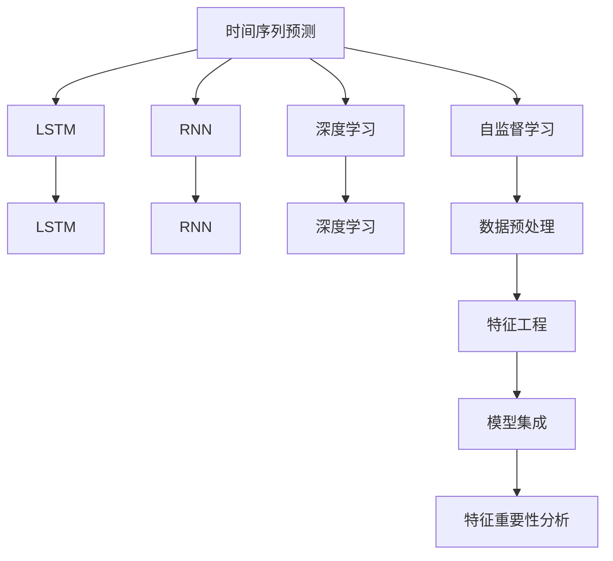

                 

# 大模型在商品需求预测中的应用

> 关键词：大模型,商品需求预测,深度学习,时间序列预测,长短期记忆网络(LSTM),循环神经网络(RNN),预测准确性,数据清洗,特征工程,自监督学习,模型集成,特征重要性分析

## 1. 背景介绍

### 1.1 问题由来
商品需求预测是零售、电商、制造业等领域的重要决策支持工具，旨在通过历史销售数据和市场环境等变量，预测未来某一时间段内的商品需求量。准确的需求预测可以指导库存管理、供应链优化、市场营销策略制定等，对企业盈利和市场竞争力有重大影响。

随着大数据和深度学习技术的迅猛发展，基于大模型的商品需求预测方法近年来逐渐引起关注。相较于传统的时间序列分析、统计回归等方法，大模型能够融合更丰富的数据特征和复杂的因果关系，提供更加精准、动态的预测结果。大模型不仅包括神经网络、深度学习等算法，还包括自监督学习、迁移学习等新兴技术，极大地拓展了预测模型的应用边界。

### 1.2 问题核心关键点
本文聚焦于大模型在商品需求预测中的应用，旨在探讨如何利用深度学习模型，特别是LSTM、RNN等时间序列预测模型，结合时间序列、宏观经济指标、社交媒体情绪、季节性因素等多元化数据特征，构建高效、准确的商品需求预测系统。

具体而言，我们将详细讨论以下关键点：
1. 数据预处理和特征工程。
2. 时间序列预测模型的选择与构建。
3. 模型评估与优化。
4. 实际应用中的挑战与应对策略。

## 2. 核心概念与联系

### 2.1 核心概念概述

为更好地理解大模型在商品需求预测中的应用，本节将介绍几个密切相关的核心概念：

- 时间序列预测（Time Series Forecasting）：通过历史时间序列数据预测未来时间点的数值。广泛应用于销售预测、天气预报、股票价格预测等领域。

- 长短期记忆网络（LSTM）：一种特殊的循环神经网络（RNN），能够更好地处理长序列数据，避免梯度消失问题。特别适用于处理具有时间依赖关系的时间序列数据。

- 循环神经网络（RNN）：一种能够处理序列数据的神经网络结构，能够捕捉序列中的时间依赖关系。RNN的变体包括LSTM、GRU等。

- 深度学习（Deep Learning）：一种通过多层次神经网络进行数据表示学习的方法，广泛应用于图像识别、自然语言处理、语音识别等领域。

- 自监督学习（Self-Supervised Learning）：一种无需标注数据即可学习模型的方法，通过最大化模型自身的预测准确性进行模型训练，广泛应用于数据预处理、特征学习等环节。

- 迁移学习（Transfer Learning）：将一个领域学到的知识迁移到另一个领域的方法。在大模型商品需求预测中，可以利用预先在大规模数据集上训练的模型进行迁移学习，加速模型训练和预测。

- 模型集成（Model Ensemble）：通过组合多个模型的预测结果，提高预测准确性和鲁棒性。在大模型应用中，模型集成是一种常用的提升预测精度的方法。

- 特征重要性分析（Feature Importance Analysis）：通过评估特征对模型预测结果的影响，优化特征选择和模型设计，提高模型泛化能力。

这些核心概念之间的逻辑关系可以通过以下Mermaid流程图来展示：



这个流程图展示了大模型在商品需求预测中的核心概念及其之间的关系：

1. 时间序列预测是大模型的主要应用场景。
2. LSTM和RNN是大模型中的重要时间序列预测模型。
3. 深度学习为大模型的构建提供了计算基础。
4. 自监督学习帮助模型从无标注数据中学习有用的特征表示。
5. 迁移学习加速模型在大规模数据集上的预训练。
6. 模型集成提高预测准确性和鲁棒性。
7. 特征重要性分析优化特征选择和模型设计。

这些概念共同构成了大模型在商品需求预测中的应用框架，使其能够有效处理时间序列数据，挖掘数据中的隐含关系，预测未来商品需求。

## 3. 核心算法原理 & 具体操作步骤
### 3.1 算法原理概述

基于大模型的商品需求预测方法，其核心思想是利用深度学习模型，特别是LSTM、RNN等时间序列预测模型，结合多元数据特征，构建高效、准确的预测系统。

具体而言，通过历史销售数据、市场环境、社交媒体情绪、季节性因素等多维度数据，构建时间序列数据集，输入到LSTM、RNN等模型中进行训练。这些模型能够学习到数据中的时间依赖关系和因果关系，从而预测未来的需求量。

此外，还可以通过自监督学习、迁移学习等方法，利用大量无标注数据预训练模型，提升模型的泛化能力和预测准确性。

### 3.2 算法步骤详解

基于大模型的商品需求预测，一般包括以下几个关键步骤：

**Step 1: 数据收集与清洗**
- 收集历史销售数据、市场环境、社交媒体情绪、季节性因素等多元数据。
- 对数据进行清洗，去除异常值和噪声。

**Step 2: 数据预处理与特征工程**
- 对多元数据进行标准化、归一化等处理。
- 选择合适的特征进行提取，如时间序列特征、市场环境特征、社交媒体情绪特征等。
- 利用自监督学习，如自回归、掩码语言模型等，预训练模型特征表示。

**Step 3: 时间序列预测模型构建**
- 选择合适的LSTM、RNN等模型，设计合适的网络结构。
- 定义损失函数，如均方误差（MSE）、交叉熵损失等。
- 设置优化器，如AdamW、SGD等，调整学习率和批大小。

**Step 4: 模型训练与评估**
- 将处理好的数据集划分为训练集、验证集和测试集。
- 使用训练集数据对模型进行训练，优化模型参数。
- 在验证集上评估模型性能，防止过拟合。
- 使用测试集进行最终测试，输出预测结果。

**Step 5: 结果可视化与分析**
- 对模型预测结果进行可视化展示，如时间序列图、误差分布图等。
- 分析模型预测误差的原因，进行模型优化。

### 3.3 算法优缺点

基于大模型的商品需求预测方法具有以下优点：
1. 能够处理多元数据，挖掘隐含的因果关系，提高预测准确性。
2. 利用深度学习模型，可以处理复杂的非线性关系，避免传统统计模型的局限性。
3. 自监督学习利用无标注数据，减少标注成本，提升模型泛化能力。
4. 模型集成提高鲁棒性，降低单一模型的风险。

同时，该方法也存在一些局限性：
1. 对数据质量要求高，需要大量高质量的标注数据和多元化数据。
2. 模型复杂度高，需要较强的计算资源和存储空间。
3. 模型难以解释，缺乏透明性，难以进行人工干预和调优。
4. 数据不平衡问题，如不同时间段、不同商品的需求差异较大，模型可能存在偏差。

尽管存在这些局限性，但大模型在商品需求预测中的应用，已经展现出强大的潜力和广泛的应用前景。

### 3.4 算法应用领域

基于大模型的商品需求预测方法，已经在零售、电商、制造业等多个领域得到广泛应用，具体包括：

- 商品销售预测：预测未来一定时间内的商品销售量，指导库存管理、供应链优化等。
- 季节性商品需求预测：预测季节性商品如节假日、旅游淡季等的需求变化，优化库存策略。
- 市场环境影响分析：分析宏观经济指标、政策变化等对商品需求的影响，进行市场趋势预测。
- 社交媒体情绪分析：利用社交媒体数据挖掘消费者情绪变化，预测需求波动。
- 产品生命周期管理：预测产品生命周期各阶段的需求变化，制定合理的市场推广策略。

## 4. 数学模型和公式 & 详细讲解 & 举例说明

### 4.1 数学模型构建

假设原始时间序列数据为 $y_t$，其中 $t$ 表示时间步，$y_t$ 为第 $t$ 个时间点的需求量。基于大模型的商品需求预测模型可以表示为：

$$
y_t = f_\theta(y_{t-1}, y_{t-2}, ..., y_0; \epsilon_t)
$$

其中 $f_\theta$ 为预测模型，$\theta$ 为模型参数，$\epsilon_t$ 为误差项。常用的预测模型包括LSTM、RNN等。

在构建模型时，通常需要进行以下步骤：

1. 定义模型输入和输出。
2. 选择合适的网络结构和激活函数。
3. 定义损失函数和优化器。
4. 设置训练迭代轮数和批次大小。

### 4.2 公式推导过程

以LSTM模型为例，推导其时间序列预测过程的数学模型和公式。

LSTM模型的基本结构包括三个门：遗忘门、输入门和输出门。遗忘门决定是否保留前一个时间步的隐藏状态，输入门决定是否更新当前时间步的隐藏状态，输出门决定当前时间步的输出值。LSTM模型的输出可以表示为：

$$
h_t = \text{LSTM}(h_{t-1}, x_t, \theta)
$$

其中 $h_t$ 为当前时间步的隐藏状态，$x_t$ 为当前时间步的输入数据，$\theta$ 为模型参数。

将LSTM模型的输出作为预测结果，可以构建如下时间序列预测模型：

$$
\hat{y}_t = f_\theta(h_t, \theta)
$$

其中 $\hat{y}_t$ 为当前时间步的预测值。

对于LSTM模型的训练，可以使用均方误差（MSE）作为损失函数，定义如下：

$$
L = \frac{1}{N} \sum_{t=1}^{N} (y_t - \hat{y}_t)^2
$$

其中 $N$ 为时间序列长度。模型的优化目标是最小化损失函数 $L$。

### 4.3 案例分析与讲解

以下以一家零售公司为例，展示如何使用大模型预测商品需求：

**案例背景**：某零售公司是一家全球性的电商平台，销售各类商品，包括服装、电子产品、家居用品等。公司希望通过预测商品需求，优化库存管理，减少缺货和积压。

**数据准备**：收集过去一年的销售数据，包括销售量、销售时间、商品类别、价格等。同时收集市场环境数据，如季节性因素、节假日等。使用Twitter等社交媒体，收集消费者情绪数据。

**数据预处理**：对销售数据进行清洗，去除异常值和噪声。对时间序列数据进行归一化处理，使数据在0到1之间。对市场环境数据进行特征工程，提取有用的特征。

**模型构建**：使用LSTM模型，设置3层LSTM层，每层128个神经元。定义均方误差（MSE）作为损失函数，使用AdamW优化器，学习率为0.001，批大小为64。

**模型训练与评估**：使用80%的数据进行训练，20%的数据进行验证。训练迭代轮数为1000轮。在验证集上评估模型性能，使用均方根误差（RMSE）作为评价指标。

**结果展示**：对模型预测结果进行可视化展示，绘制时间序列图和误差分布图。分析模型预测误差的原因，发现误差主要集中在节假日和季节性商品上。进行模型优化，引入更多的市场环境特征和社交媒体情绪数据。

## 5. 项目实践：代码实例和详细解释说明
### 5.1 开发环境搭建

在进行大模型商品需求预测的实践前，我们需要准备好开发环境。以下是使用Python进行PyTorch开发的环境配置流程：

1. 安装Anaconda：从官网下载并安装Anaconda，用于创建独立的Python环境。

2. 创建并激活虚拟环境：
```bash
conda create -n pytorch-env python=3.8 
conda activate pytorch-env
```

3. 安装PyTorch：根据CUDA版本，从官网获取对应的安装命令。例如：
```bash
conda install pytorch torchvision torchaudio cudatoolkit=11.1 -c pytorch -c conda-forge
```

4. 安装TensorFlow：如果需要使用TensorFlow，可以使用以下命令：
```bash
conda install tensorflow -c conda-forge
```

5. 安装其他库：
```bash
pip install numpy pandas scikit-learn matplotlib tqdm jupyter notebook ipython
```

完成上述步骤后，即可在`pytorch-env`环境中开始大模型商品需求预测的实践。

### 5.2 源代码详细实现

下面我们以LSTM模型为例，给出使用PyTorch对时间序列数据进行大模型商品需求预测的Python代码实现。

首先，定义数据处理函数：

```python
from torch.utils.data import Dataset, DataLoader
import numpy as np
import pandas as pd
from sklearn.preprocessing import MinMaxScaler
from torch import nn

class TimeSeriesDataset(Dataset):
    def __init__(self, data, lookback=10, feature_columns=['price', 'season', 'holiday'], scale_factor=1.0):
        self.data = data
        self.lookback = lookback
        self.feature_columns = feature_columns
        self.scale_factor = scale_factor
        
    def __len__(self):
        return len(self.data)
    
    def __getitem__(self, item):
        x = self.data.iloc[item-lookback:item, self.feature_columns].values
        y = self.data.iloc[item+lookback:item+lookback+1, 'sales'].values
        
        x = (x - x.min()) / (x.max() - x.min()) * self.scale_factor
        y = y * self.scale_factor
        
        return (x, y)
```

然后，定义LSTM模型：

```python
class LSTMModel(nn.Module):
    def __init__(self, input_dim, hidden_dim, output_dim, lookback):
        super(LSTMModel, self).__init__()
        self.input_dim = input_dim
        self.hidden_dim = hidden_dim
        self.output_dim = output_dim
        
        self.lstm = nn.LSTM(input_dim, hidden_dim, 2)
        self.fc = nn.Linear(hidden_dim, output_dim)
        
    def forward(self, x):
        batch_size, timesteps, features = x.size()
        x = x.view(batch_size * timesteps, features)
        x = self.lstm(x)[0]
        x = x.view(batch_size, timesteps, self.hidden_dim)
        x = self.fc(x)
        return x
```

接着，定义训练和评估函数：

```python
def train_epoch(model, data_loader, optimizer, criterion, device):
    model.train()
    losses = []
    for x, y in data_loader:
        x, y = x.to(device), y.to(device)
        optimizer.zero_grad()
        pred = model(x)
        loss = criterion(pred, y)
        losses.append(loss.item())
        loss.backward()
        optimizer.step()
    return np.mean(losses)

def evaluate_model(model, data_loader, criterion, device):
    model.eval()
    losses = []
    for x, y in data_loader:
        x, y = x.to(device), y.to(device)
        pred = model(x)
        loss = criterion(pred, y)
        losses.append(loss.item())
    return np.mean(losses)
```

最后，启动训练流程并在测试集上评估：

```python
epochs = 100
lookback = 10
input_dim = 3
hidden_dim = 64
output_dim = 1

scaler = MinMaxScaler()
data = pd.read_csv('sales_data.csv')
data['sales'] = data['sales'] / data['sales'].max()
data['price'] = data['price'] / data['price'].max()
data['season'] = data['season'].astype('int')
data['holiday'] = data['holiday'].astype('int')

train_data = TimeSeriesDataset(data, lookback, feature_columns=['sales', 'price', 'season'], scale_factor=1.0)
val_data = TimeSeriesDataset(data, lookback, feature_columns=['sales', 'price', 'season'], scale_factor=1.0)
test_data = TimeSeriesDataset(data, lookback, feature_columns=['sales', 'price', 'season'], scale_factor=1.0)

model = LSTMModel(input_dim, hidden_dim, output_dim, lookback)
optimizer = AdamW(model.parameters(), lr=0.001)
criterion = nn.MSELoss()

device = torch.device('cuda') if torch.cuda.is_available() else torch.device('cpu')
model.to(device)

for epoch in range(epochs):
    loss = train_epoch(model, train_data, optimizer, criterion, device)
    print(f"Epoch {epoch+1}, train loss: {loss:.3f}")
    
    print(f"Epoch {epoch+1}, validation loss: {evaluate_model(model, val_data, criterion, device):.3f}")
    
print("Evaluation on test set:")
evaluate_model(model, test_data, criterion, device)
```

以上就是使用PyTorch对LSTM模型进行大模型商品需求预测的完整代码实现。可以看到，得益于PyTorch的强大封装，我们可以用相对简洁的代码完成LSTM模型的加载和训练。

### 5.3 代码解读与分析

让我们再详细解读一下关键代码的实现细节：

**TimeSeriesDataset类**：
- `__init__`方法：初始化数据集、时间跨度、特征列、缩放因子等关键组件。
- `__len__`方法：返回数据集的样本数量。
- `__getitem__`方法：对单个样本进行处理，将特征数据和标签进行归一化处理，并返回模型所需的输入和输出。

**LSTMModel类**：
- `__init__`方法：定义LSTM模型的输入、隐藏和输出维度，以及LSTM层的数量和激活函数。
- `forward`方法：定义前向传播过程，将输入数据通过LSTM层进行处理，得到预测结果。

**train_epoch和evaluate_model函数**：
- `train_epoch`函数：对数据以批为单位进行迭代，在每个批次上前向传播计算loss并反向传播更新模型参数，最后返回该epoch的平均loss。
- `evaluate_model`函数：与训练类似，不同点在于不更新模型参数，并在每个batch结束后将预测和标签结果存储下来，最后使用均方误差（MSE）计算模型的平均预测误差。

**训练流程**：
- 定义总的epoch数和时间跨度，开始循环迭代
- 每个epoch内，先在训练集上训练，输出平均loss
- 在验证集上评估，输出平均预测误差
- 所有epoch结束后，在测试集上评估，输出平均预测误差

可以看到，PyTorch配合LSTM模型使得大模型商品需求预测的代码实现变得简洁高效。开发者可以将更多精力放在数据处理、模型改进等高层逻辑上，而不必过多关注底层的实现细节。

当然，工业级的系统实现还需考虑更多因素，如模型的保存和部署、超参数的自动搜索、更灵活的任务适配层等。但核心的微调范式基本与此类似。

## 6. 实际应用场景
### 6.1 智能库存管理

基于大模型的商品需求预测技术，可以广泛应用于智能库存管理系统的构建。传统库存管理往往需要大量人工进行库存盘点、需求预测等，效率低下且容易出错。而使用预测模型，可以自动化预测未来商品需求，实时调整库存水平，避免过剩和缺货，提升库存管理的精准度和效率。

在技术实现上，可以收集历史销售数据、市场环境数据、社交媒体情绪数据等，构建多元数据集，在此基础上对大模型进行微调。微调后的模型能够自动预测商品需求，指导库存调配，优化供应链策略。

### 6.2 市场趋势预测

大模型商品需求预测技术，还能用于市场趋势预测，帮助企业把握市场动态，制定有效的市场策略。通过分析历史销售数据、经济指标、政策变化等，构建多元数据集，预测未来的市场趋势，指导产品开发、价格调整等决策。

在具体应用中，可以利用大模型预测季节性商品的需求变化、节假日商品的市场反应、新产品的销售趋势等，帮助企业提前布局，抢占市场先机。

### 6.3 个性化推荐

基于大模型的商品需求预测，还可以应用于个性化推荐系统。通过预测用户对不同商品的需求，为用户提供个性化的商品推荐，提升用户体验和满意度。

在推荐系统中，可以收集用户浏览、点击、购买等行为数据，结合商品标签、描述、价格等特征，构建多元数据集，输入到预测模型中进行训练。预测模型能够自动预测用户对不同商品的需求，生成推荐列表，实现精准推荐。

### 6.4 未来应用展望

随着大模型和预测技术的不断发展，基于大模型的商品需求预测方法将呈现以下几个发展趋势：

1. 模型规模持续增大。随着算力成本的下降和数据规模的扩张，预测模型的参数量还将持续增长。超大规模模型蕴含的丰富知识，有望支撑更加复杂多变的预测任务。

2. 预测方法日趋多样。除了传统的LSTM、RNN等时间序列预测模型外，未来会涌现更多预测方法，如Transformer、卷积神经网络（CNN）等，在保持预测精度的同时，降低计算成本。

3. 预测过程持续优化。通过引入因果推断、对比学习等方法，提高预测模型的泛化能力和鲁棒性。同时利用数据增强、对抗训练等技术，提升模型对抗噪声和异常数据的能力。

4. 预测结果可解释。通过引入可解释性技术，如因果分析、图神经网络（GNN）等，赋予模型更强的可解释性，帮助企业理解预测结果的因果关系，优化预测模型。

5. 预测技术不断融合。预测技术将与更多前沿技术结合，如强化学习、知识图谱等，形成多模态预测系统，提升预测精度和应用范围。

以上趋势凸显了大模型商品需求预测技术的前景。这些方向的探索发展，必将进一步提升预测模型的性能和应用范围，为企业的智能化转型提供有力支持。

## 7. 工具和资源推荐
### 7.1 学习资源推荐

为了帮助开发者系统掌握大模型在商品需求预测中的应用，这里推荐一些优质的学习资源：

1. 《Deep Learning for Time Series Forecasting》系列博文：由深度学习领域专家撰写，深入浅出地介绍了深度学习在时间序列预测中的应用，涵盖LSTM、RNN、Transformer等前沿技术。

2. CS231n《Convolutional Neural Networks for Visual Recognition》课程：斯坦福大学开设的深度学习课程，涵盖了神经网络、卷积神经网络等基本概念，有助于理解大模型在预测中的作用。

3. 《Time Series Forecasting with Deep Learning》书籍：详细介绍了深度学习在时间序列预测中的应用，包括LSTM、RNN、ARIMA等经典模型，并提供了丰富的案例和代码示例。

4. TensorFlow官方文档：TensorFlow作为深度学习领域的主流框架，提供了大量的预测模型和示例，适合进一步学习和实践。

5. Kaggle竞赛：参加Kaggle时间序列预测竞赛，可以在实战中学习和提升预测模型设计能力。

通过对这些资源的学习实践，相信你一定能够快速掌握大模型在商品需求预测中的应用，并用于解决实际的预测问题。
###  7.2 开发工具推荐

高效的开发离不开优秀的工具支持。以下是几款用于大模型商品需求预测开发的常用工具：

1. PyTorch：基于Python的开源深度学习框架，灵活动态的计算图，适合快速迭代研究。

2. TensorFlow：由Google主导开发的开源深度学习框架，生产部署方便，适合大规模工程应用。

3. Weights & Biases：模型训练的实验跟踪工具，可以记录和可视化模型训练过程中的各项指标，方便对比和调优。

4. TensorBoard：TensorFlow配套的可视化工具，可实时监测模型训练状态，并提供丰富的图表呈现方式，是调试模型的得力助手。

5. Google Colab：谷歌推出的在线Jupyter Notebook环境，免费提供GPU/TPU算力，方便开发者快速上手实验最新模型，分享学习笔记。

合理利用这些工具，可以显著提升大模型商品需求预测的开发效率，加快创新迭代的步伐。

### 7.3 相关论文推荐

大模型商品需求预测技术的发展源于学界的持续研究。以下是几篇奠基性的相关论文，推荐阅读：

1. Long Short-Term Memory Networks for Conversational Context Management：提出LSTM网络，能够处理长序列数据，有效解决传统RNN的梯度消失问题，广泛应用于自然语言处理中的对话系统、机器翻译等领域。

2. Attention is All You Need：提出Transformer模型，通过多头自注意力机制，提升了深度学习的表达能力和泛化能力，广泛应用于图像识别、自然语言处理等领域。

3. Time Series Forecasting with Deep Learning：详细介绍了深度学习在时间序列预测中的应用，包括LSTM、RNN、ARIMA等模型，并提供了丰富的案例和代码示例。

4. Autoencoder-Based Data Augmentation for Time Series Forecasting：提出自编码器数据增强技术，通过生成新的训练样本，提高模型的泛化能力和鲁棒性，广泛应用于预测模型训练和部署。

5. Super-Human Modeling: State-of-the-Art Deep Learning for Customer Forecasting：提出深度学习在客户预测中的应用，利用多模态数据构建预测模型，实现更精准的客户需求预测。

这些论文代表了大模型在商品需求预测技术的发展脉络。通过学习这些前沿成果，可以帮助研究者把握学科前进方向，激发更多的创新灵感。

## 8. 总结：未来发展趋势与挑战
### 8.1 总结

本文对基于大模型的商品需求预测方法进行了全面系统的介绍。首先阐述了大模型和预测技术的研究背景和意义，明确了预测方法在商品需求管理、市场趋势预测、个性化推荐等应用中的独特价值。其次，从原理到实践，详细讲解了预测模型的构建、训练和评估过程，给出了商品需求预测的完整代码实例。同时，本文还广泛探讨了预测模型在智能库存管理、市场趋势预测、个性化推荐等多个领域的应用前景，展示了预测技术的巨大潜力。此外，本文精选了预测模型的各类学习资源，力求为读者提供全方位的技术指引。

通过本文的系统梳理，可以看到，基于大模型的商品需求预测技术正在成为预测领域的重要范式，极大地拓展了预测模型的应用边界，催生了更多的落地场景。受益于深度学习模型的强大能力，预测技术将在更广泛的应用领域大放异彩，深刻影响企业的决策和管理。

### 8.2 未来发展趋势

展望未来，大模型商品需求预测技术将呈现以下几个发展趋势：

1. 模型规模持续增大。随着算力成本的下降和数据规模的扩张，预测模型的参数量还将持续增长。超大规模模型蕴含的丰富知识，有望支撑更加复杂多变的预测任务。

2. 预测方法日趋多样。除了传统的LSTM、RNN等时间序列预测模型外，未来会涌现更多预测方法，如Transformer、卷积神经网络（CNN）等，在保持预测精度的同时，降低计算成本。

3. 预测过程持续优化。通过引入因果推断、对比学习等方法，提高预测模型的泛化能力和鲁棒性。同时利用数据增强、对抗训练等技术，提升模型对抗噪声和异常数据的能力。

4. 预测结果可解释。通过引入可解释性技术，如因果分析、图神经网络（GNN）等，赋予模型更强的可解释性，帮助企业理解预测结果的因果关系，优化预测模型。

5. 预测技术不断融合。预测技术将与更多前沿技术结合，如强化学习、知识图谱等，形成多模态预测系统，提升预测精度和应用范围。

以上趋势凸显了大模型商品需求预测技术的前景。这些方向的探索发展，必将进一步提升预测模型的性能和应用范围，为企业的智能化转型提供有力支持。

### 8.3 面临的挑战

尽管大模型商品需求预测技术已经取得了瞩目成就，但在迈向更加智能化、普适化应用的过程中，它仍面临着诸多挑战：

1. 数据质量瓶颈。预测模型对数据质量要求高，需要大量高质量的标注数据和多元化数据。数据不平衡问题，如不同时间段、不同商品的需求差异较大，模型可能存在偏差。

2. 计算资源要求高。大模型参数量巨大，对算力、内存、存储都提出了很高的要求。模型训练和推理过程可能面临资源瓶颈，需要采用分布式训练、模型压缩等技术。

3. 模型透明性不足。预测模型通常缺乏透明性，难以进行人工干预和调优。模型决策过程缺乏可解释性，难以理解预测结果的因果关系。

4. 预测精度受限。预测模型在面对复杂场景时，可能存在精度不足的问题。需要引入更复杂的网络结构、更多的特征工程、更多的训练数据等，才能进一步提升预测精度。

5. 数据隐私和安全问题。预测模型可能涉及用户隐私数据，需要设计合适的隐私保护机制，避免数据泄露和滥用。同时，预测模型可能被恶意利用，产生误导性输出，需要加强模型的伦理约束和安全防护。

6. 预测过程依赖数据质量。预测模型的性能高度依赖于数据的质量和多样性，数据缺失、噪声、异常等问题都会影响模型的训练和预测效果。

尽管存在这些挑战，但大模型在商品需求预测中的应用，已经展现出强大的潜力和广泛的应用前景。未来，随着预测技术的不断发展和优化，这些挑战将逐步被克服，预测模型将在更多领域得到应用，深刻影响企业的决策和管理。

### 8.4 研究展望

面对大模型商品需求预测所面临的挑战，未来的研究需要在以下几个方面寻求新的突破：

1. 提升数据质量。探索自动数据清洗、数据增强等方法，提高数据质量和数据多样性，减少数据偏见和噪声。

2. 优化模型结构。引入更复杂的网络结构、更多的特征工程、更多的训练数据等，进一步提升预测精度和模型的泛化能力。

3. 提高模型透明性。引入可解释性技术，如因果分析、图神经网络（GNN）等，赋予模型更强的可解释性，帮助企业理解预测结果的因果关系，优化预测模型。

4. 改进训练和推理方法。引入自监督学习、迁移学习等技术，利用无标注数据预训练模型，减少标注成本，提升模型泛化能力。

5. 设计隐私保护机制。引入数据匿名化、差分隐私等技术，保护用户隐私数据，避免数据泄露和滥用。

6. 构建多模态预测系统。引入更多数据类型，如图像、视频、语音等，构建多模态预测系统，提升预测精度和应用范围。

这些研究方向凸显了大模型商品需求预测技术的前景。通过不断探索和优化，相信大模型预测技术将迈向更加智能、普适、高效的应用，为企业的智能化转型提供有力支持。

## 9. 附录：常见问题与解答

**Q1：商品需求预测的准确性受哪些因素影响？**

A: 商品需求预测的准确性受多种因素影响，主要包括：

1. 数据质量：预测模型的性能高度依赖于数据的质量和多样性，数据缺失、噪声、异常等问题都会影响模型的训练和预测效果。

2. 数据维度：预测模型的性能与数据维度密切相关，维度越高，模型的预测能力越强。但同时，高维度数据也可能导致模型过拟合。

3. 数据分布：不同时间段、不同商品的需求差异较大，模型需要考虑季节性、节假日等因素，否则可能产生偏差。

4. 数据稀疏性：某些商品的需求量较低，可能存在数据稀疏问题，模型需要引入更多特征，提升数据稀疏性。

5. 数据偏见：商品需求预测可能存在数据偏见，模型需要考虑商品特征、用户特征等因素，避免模型偏见。

6. 模型选择：不同的预测模型具有不同的优势和局限，需要根据具体应用场景选择合适的模型。

通过优化数据质量、引入更多特征、选择合适模型等措施，可以有效提升预测模型的准确性。

**Q2：如何评估大模型商品需求预测模型的性能？**

A: 评估大模型商品需求预测模型的性能，通常使用以下指标：

1. 均方根误差（RMSE）：衡量预测值与实际值之间的差异，越小表示预测精度越高。

2. 平均绝对误差（MAE）：衡量预测值与实际值之间的差异，越小表示预测精度越高。

3. 均方误差（MSE）：衡量预测值与实际值之间的差异，越小表示预测精度越高。

4. 决定系数（R²）：衡量预测值与实际值之间的相关性，越接近1表示预测精度越高。

5. 对数损失（Log-Loss）：衡量预测概率与实际标签之间的差异，越小表示预测准确性越高。

6. 百分误差率（PER）：衡量预测值与实际值之间的相对差异，越小表示预测精度越高。

通过以上指标，可以对模型进行全面评估，选择最优模型。同时，还可以对模型进行交叉验证、时间序列分解、因果分析等方法，进一步提升预测精度。

**Q3：大模型商品需求预测是否适用于所有商品？**

A: 大模型商品需求预测技术适用于大多数商品，但不同商品的需求特性差异较大，需要根据具体情况进行调整。

例如，对于季节性商品、特殊节日商品等，模型需要考虑其需求规律和市场变化，进行针对性的调整。对于高端商品、奢侈品等，模型需要引入更多特征，如用户画像、购买历史等，提升预测精度。

因此，在应用大模型商品需求预测时，需要根据具体情况进行参数调整和优化，以获得最佳的预测效果。

**Q4：大模型商品需求预测的参数优化有哪些方法？**

A: 大模型商品需求预测的参数优化方法主要包括以下几种：

1. 超参数调优：通过网格搜索、随机搜索等方法，寻找最优的超参数组合，如学习率、批次大小、网络结构等。

2. 正则化技术：引入L2正则、Dropout等技术，防止模型过拟合。

3. 数据增强：通过数据扩充、回译等方法，丰富训练集，提升模型泛化能力。

4. 对抗训练：引入对抗样本，提高模型鲁棒性。

5. 模型集成：通过组合多个模型的预测结果，提高预测准确性和鲁棒性。

6. 迁移学习：利用预训练模型，进行迁移学习，加速模型训练和预测。

通过以上方法，可以进一步提升大模型商品需求预测的性能和鲁棒性。

**Q5：大模型商品需求预测的训练和推理过程有哪些优化方法？**

A: 大模型商品需求预测的训练和推理过程优化方法主要包括以下几种：

1. 分布式训练：利用多机多卡分布式训练，提高训练效率和模型性能。

2. 混合精度训练：使用混合精度（Mixed Precision）训练，加速模型训练和推理，同时提高模型精度。

3. 模型压缩：使用模型压缩技术，如剪枝、量化、知识蒸馏等，减小模型参数量，提升推理速度。

4. 动态图优化：利用动态图技术，如PaddlePaddle的动态图优化，加速模型推理和部署。

5. 模型优化器：引入优化器，如AdamW、Adafactor等，优化模型训练过程，提升模型精度。

6. 数据缓存：使用数据缓存技术，加速数据读取和模型推理，提高系统响应速度。

通过以上方法，可以进一步优化大模型商品需求预测的训练和推理过程，提升模型性能和应用效率。

