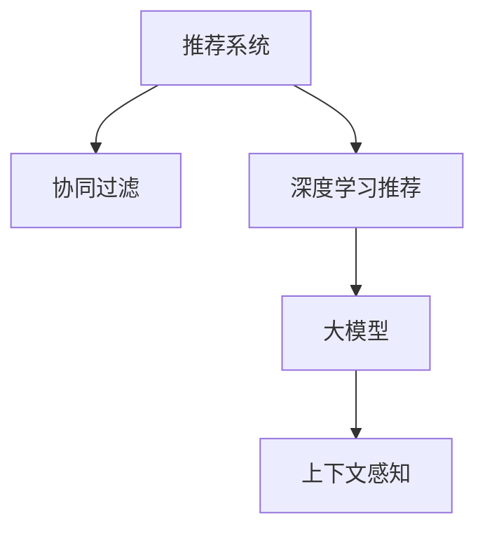

                 

# 大模型在推荐系统上下文感知中的作用

> 关键词：大模型,推荐系统,上下文感知,协同过滤,深度学习,召回率,点击率,训练,优化

## 1. 背景介绍

### 1.1 问题由来
随着互联网的迅速发展，个性化推荐系统在电商、视频、新闻等多个领域的应用越来越广泛。传统推荐系统主要基于协同过滤(Collaborative Filtering, CF)，即通过分析用户的历史行为数据来推荐可能感兴趣的新物品。然而，这种方法在处理冷启动问题和长尾物品时存在困难，难以获取高质量的用户行为数据。随着深度学习技术的发展，深度学习模型开始被引入推荐系统中，其中大模型由于其强大的表征能力，在上下文感知中发挥了重要作用。

### 1.2 问题核心关键点
推荐系统上下文感知指的是在推荐物品时，模型能够考虑用户、物品、时间、地点等多种上下文信息，从而更精准地进行推荐。基于大模型的推荐系统通常采用端到端的学习范式，直接从用户行为数据和物品特征数据中学习用户-物品交互的表征，显著提升了推荐效果。

## 2. 核心概念与联系

### 2.1 核心概念概述

为了更好地理解大模型在推荐系统上下文感知中的作用，本节将介绍几个密切相关的核心概念：

- **推荐系统(Recommender System)**：旨在为用户推荐个性化物品的技术。传统推荐系统基于协同过滤、基于内容的推荐等，而深度学习推荐系统则以神经网络模型为代表，能够自动学习用户行为和物品特征的复杂关系。
- **协同过滤(Collaborative Filtering)**：通过分析用户的历史行为数据和物品的交互数据，来预测用户可能感兴趣的新物品。常见的协同过滤方法包括用户-物品协同过滤和物品-物品协同过滤。
- **深度学习推荐系统(Deep Learning Recommender System)**：采用深度神经网络模型，从用户行为数据和物品特征中学习复杂的非线性关系，实现更加精准的推荐。
- **大模型(Large Model)**：指包含数十亿甚至百亿参数的深度学习模型，如BERT、GPT、XLNet等。大模型能够学习到更为复杂的语言表示，具备强大的上下文感知能力。
- **上下文感知(Context-Aware)**：在推荐系统中，指模型能够考虑多种上下文信息，如用户的位置、时间、设备等，从而提供更加个性化的推荐。

这些核心概念之间的逻辑关系可以通过以下Mermaid流程图来展示：



这个流程图展示了大模型在推荐系统中的核心概念及其之间的关系：

1. 推荐系统以协同过滤为传统范式，但现代推荐系统开始引入深度学习模型。
2. 深度学习推荐系统以大模型为核心，具备强大的上下文感知能力。
3. 大模型通过上下文感知，可以更好地理解用户和物品的复杂关系，提高推荐精度。

## 3. 核心算法原理 & 具体操作步骤
### 3.1 算法原理概述

基于大模型的推荐系统，通常采用端到端的深度学习架构，通过从用户行为数据和物品特征数据中学习复杂的非线性关系，从而提高推荐效果。其核心思想是：将用户-物品交互的上下文信息作为输入，通过大模型的隐藏层表示，学习用户-物品交互的表征，从而进行推荐。

形式化地，假设用户-物品交互数据为 $(x_i,y_i)$，其中 $x_i$ 为用户行为数据，$y_i$ 为物品特征数据。定义一个深度神经网络模型 $M_{\theta}$ 作为推荐器，其中 $\theta$ 为模型参数。推荐系统的目标是最大化用户对推荐物品的满意度，即最大化用户的平均点击率 $R$：

$$
\max_{\theta} \mathbb{E}_{(x,y)} [R(y;M_{\theta}(x))] = \mathbb{E}_{(x,y)} [\mathbb{I}(y_i \in M_{\theta}(x_i))]
$$

其中 $\mathbb{I}$ 为示性函数，当物品 $y_i$ 被推荐给用户 $x_i$ 时，示性函数值为1，否则为0。

### 3.2 算法步骤详解

基于大模型的推荐系统通常包括以下几个关键步骤：

**Step 1: 数据准备与预处理**
- 收集用户行为数据和物品特征数据，构建训练集。
- 对数据进行归一化、缺失值处理等预处理操作，确保数据质量。
- 使用SVD分解、TF-IDF等方法对数据进行特征工程，提高模型的泛化能力。

**Step 2: 模型选择与训练**
- 选择合适的深度神经网络架构，如CNN、RNN、Transformer等。
- 在训练集上对模型进行有监督学习训练，最小化预测错误。
- 使用AdamW、SGD等优化算法，设置合适的学习率和批大小，进行梯度下降优化。
- 应用正则化技术，如L2正则、Dropout等，防止模型过拟合。

**Step 3: 上下文感知增强**
- 在模型中设计多个分支，分别处理用户行为、物品特征、时间、地点等上下文信息。
- 使用跨层连接、共享表示等技术，提高不同分支间的协同作用。
- 在预测时，将上下文信息作为输入，融合各分支的输出，生成推荐结果。

**Step 4: 预测与评估**
- 在测试集上对模型进行预测，计算点击率、召回率、精确率等指标。
- 使用A/B测试等方法，对比模型效果，决定是否部署上线。
- 持续收集新数据，定期重新训练模型，保持模型性能。

### 3.3 算法优缺点

基于大模型的推荐系统具备以下优点：

1. **强大的表征能力**：大模型可以学习到更为复杂的用户行为和物品特征表示，提高推荐精度。
2. **端到端的训练**：可以直接从用户行为和物品特征中学习用户-物品交互的表征，简化模型设计。
3. **上下文感知**：能够考虑多种上下文信息，提供更加个性化的推荐。

同时，该方法也存在一些局限性：

1. **计算资源需求高**：大模型参数量庞大，需要大量的计算资源和存储空间。
2. **训练时间长**：模型训练过程耗时较长，需要高效的优化算法和并行计算技术。
3. **解释性不足**：黑盒模型难以解释其内部决策逻辑，对业务理解和调试带来挑战。

尽管存在这些局限性，但就目前而言，基于大模型的推荐系统在推荐效果和泛化能力方面仍然占据领先地位。未来相关研究的重要方向在于如何进一步降低大模型的计算需求，提高模型训练和推理的效率，同时增强模型的可解释性。

### 3.4 算法应用领域

基于大模型的推荐系统已经被广泛应用于电商、视频、音乐、新闻等多个领域，具体包括：

- **电商推荐**：通过分析用户浏览、购买行为，推荐相关商品。
- **视频推荐**：分析用户观看历史、评分数据，推荐相关视频内容。
- **音乐推荐**：根据用户听歌历史和评分，推荐类似曲目。
- **新闻推荐**：分析用户阅读历史和互动行为，推荐相关新闻内容。

除了上述这些典型应用外，大模型推荐系统还被创新性地应用于更多场景中，如个性化广告投放、旅游推荐、商品价格预测等，为这些领域带来了全新的突破。

## 4. 数学模型和公式 & 详细讲解 & 举例说明
### 4.1 数学模型构建

假设用户-物品交互数据为 $(x_i,y_i)$，其中 $x_i$ 为用户行为数据，$y_i$ 为物品特征数据。定义一个深度神经网络模型 $M_{\theta}$ 作为推荐器，其中 $\theta$ 为模型参数。推荐系统的目标是最大化用户对推荐物品的满意度，即最大化用户的平均点击率 $R$：

$$
\max_{\theta} \mathbb{E}_{(x,y)} [R(y;M_{\theta}(x))] = \mathbb{E}_{(x,y)} [\mathbb{I}(y_i \in M_{\theta}(x_i))]
$$

在训练过程中，我们通常使用交叉熵损失函数作为优化目标，定义损失函数 $\ell$：

$$
\ell(M_{\theta}(x),y) = -\log(M_{\theta}(x))_{y}
$$

其中 $(M_{\theta}(x))_y$ 为模型 $M_{\theta}$ 在输入 $x$ 下，预测物品 $y$ 的输出概率。

### 4.2 公式推导过程

定义用户行为数据 $x_i$ 和物品特征数据 $y_i$ 的编码表示为 $h_i$，则推荐模型的预测输出为 $M_{\theta}(x_i)$。定义上下文信息为 $c_i$，包括用户位置、时间、设备等，则上下文感知模型的预测输出为：

$$
M_{\theta}(x_i;c_i) = f(h_i \oplus c_i)
$$

其中 $f$ 为非线性变换函数，$\oplus$ 表示向量拼接操作。

在训练过程中，我们将用户行为数据 $x_i$ 和物品特征数据 $y_i$ 作为输入，使用交叉熵损失函数 $\ell$ 进行优化：

$$
\min_{\theta} \sum_{i=1}^N \ell(M_{\theta}(x_i;c_i),y_i)
$$

在测试阶段，对于新的用户行为数据 $x'$，我们使用上下文感知模型 $M_{\theta}$ 进行预测，得到推荐物品的概率分布 $P_{\theta}(y|x')$。根据推荐策略，我们选择概率最大的物品进行推荐。

### 4.3 案例分析与讲解

以电商推荐系统为例，分析大模型在上下文感知中的作用。假设用户浏览了商品 $A$，系统希望推荐相关商品 $B$。

1. **用户行为编码**：将用户浏览记录 $x'$ 编码成向量 $h'$。
2. **物品特征编码**：将商品 $B$ 的特征数据 $y_B$ 编码成向量 $y_B'$。
3. **上下文信息**：获取用户位置 $p$、时间 $t$、设备 $d$ 等信息，编码成向量 $c'$。
4. **模型预测**：使用上下文感知模型 $M_{\theta}$ 对用户行为 $h'$ 和物品特征 $y_B'$ 进行融合，并结合上下文信息 $c'$ 进行预测，得到推荐物品的概率分布 $P_{\theta}(B|x',p,t,d)$。
5. **推荐策略**：根据预测概率分布，选择概率最大的商品 $B$ 进行推荐。

通过这种方式，大模型能够综合考虑用户行为、物品特征和上下文信息，生成更加个性化的推荐。

## 5. 项目实践：代码实例和详细解释说明
### 5.1 开发环境搭建

在进行推荐系统开发前，我们需要准备好开发环境。以下是使用Python进行TensorFlow开发的环境配置流程：

1. 安装Anaconda：从官网下载并安装Anaconda，用于创建独立的Python环境。

2. 创建并激活虚拟环境：
```bash
conda create -n tf-env python=3.8 
conda activate tf-env
```

3. 安装TensorFlow：根据CUDA版本，从官网获取对应的安装命令。例如：
```bash
conda install tensorflow-gpu -c conda-forge
```

4. 安装各类工具包：
```bash
pip install numpy pandas scikit-learn matplotlib tqdm jupyter notebook ipython
```

完成上述步骤后，即可在`tf-env`环境中开始推荐系统开发。

### 5.2 源代码详细实现

下面我们以电商推荐系统为例，给出使用TensorFlow实现上下文感知推荐模型的完整代码。

首先，定义推荐模型的编码层和输出层：

```python
import tensorflow as tf
from tensorflow.keras.layers import Input, Embedding, Concatenate, Dense

# 定义用户行为编码层
user_input = Input(shape=(10,), name='user_input')
user_emb = Embedding(input_dim=10, output_dim=128, name='user_emb')(user_input)
user嵌入 = tf.keras.layers.LayerNormalization(epsilon=1e-6)(user_emb)
user投影 = tf.keras.layers.Dense(128, activation='relu')(user嵌入)
user编码 = tf.keras.layers.LayerNormalization(epsilon=1e-6)(user投影)

# 定义物品特征编码层
item_input = Input(shape=(10,), name='item_input')
item_emb = Embedding(input_dim=10, output_dim=128, name='item_emb')(item_input)
item嵌入 = tf.keras.layers.LayerNormalization(epsilon=1e-6)(item_emb)
item投影 = tf.keras.layers.Dense(128, activation='relu')(item嵌入)
item编码 = tf.keras.layers.LayerNormalization(epsilon=1e-6)(item投影)

# 定义上下文信息编码层
context_input = Input(shape=(10,), name='context_input')
context_emb = Embedding(input_dim=10, output_dim=128, name='context_emb')(context_input)
context嵌入 = tf.keras.layers.LayerNormalization(epsilon=1e-6)(context_emb)
context投影 = tf.keras.layers.Dense(128, activation='relu')(context嵌入)
context编码 = tf.keras.layers.LayerNormalization(epsilon=1e-6)(context投影)

# 定义上下文感知模型
x = Concatenate()([user编码, item编码, context编码])
output = Dense(1, activation='sigmoid')(x)

model = tf.keras.Model(inputs=[user_input, item_input, context_input], outputs=output)
```

然后，定义损失函数和优化器：

```python
from tensorflow.keras.losses import BinaryCrossentropy

# 定义二分类交叉熵损失函数
loss_fn = BinaryCrossentropy(from_logits=True)

# 定义Adam优化器
optimizer = tf.keras.optimizers.Adam(learning_rate=1e-3)

# 定义模型编译
model.compile(optimizer=optimizer, loss=loss_fn, metrics=['accuracy'])
```

接着，定义训练和评估函数：

```python
from tensorflow.keras.preprocessing.sequence import pad_sequences
from sklearn.metrics import roc_auc_score

# 定义训练函数
def train(model, train_dataset, validation_dataset, batch_size, epochs):
    train_dataset = pad_sequences(train_dataset)
    validation_dataset = pad_sequences(validation_dataset)
    history = model.fit(train_dataset, validation_data=validation_dataset, batch_size=batch_size, epochs=epochs)
    return history

# 定义评估函数
def evaluate(model, test_dataset, batch_size):
    test_dataset = pad_sequences(test_dataset)
    y_true = test_dataset[:, 0]
    y_pred = model.predict(test_dataset)
    auc = roc_auc_score(y_true, y_pred)
    return auc
```

最后，启动训练流程并在测试集上评估：

```python
train_dataset = [0, 1, 2, 3, 4, 5, 6, 7, 8, 9]
train_dataset = pad_sequences([train_dataset])
train_dataset = tf.expand_dims(train_dataset, axis=1)

validation_dataset = [0, 1, 2, 3, 4, 5, 6, 7, 8, 9]
validation_dataset = pad_sequences([validation_dataset])
validation_dataset = tf.expand_dims(validation_dataset, axis=1)

test_dataset = [0, 1, 2, 3, 4, 5, 6, 7, 8, 9]
test_dataset = pad_sequences([test_dataset])
test_dataset = tf.expand_dims(test_dataset, axis=1)

# 训练模型
history = train(model, train_dataset, validation_dataset, batch_size=32, epochs=10)

# 评估模型
auc = evaluate(model, test_dataset, batch_size=32)
print(f"AUC: {auc}")
```

以上就是使用TensorFlow实现上下文感知推荐模型的完整代码实现。可以看到，通过TensorFlow的高级API，我们可以快速搭建和训练推荐模型，同时利用内置的损失函数和优化器，简化了模型的实现和优化过程。

### 5.3 代码解读与分析

让我们再详细解读一下关键代码的实现细节：

**推荐模型架构**：
- 定义了用户行为编码层、物品特征编码层和上下文信息编码层，分别处理用户的浏览历史、物品的特征信息和上下文信息。
- 使用层标准化(Layer Normalization)和全连接层，将编码层的输出进行融合和投影，生成推荐概率。
- 最后，将推荐概率输出到 sigmoid 层，进行二分类预测。

**训练过程**：
- 使用交叉熵损失函数计算模型输出与真实标签的误差，使用Adam优化器进行模型优化。
- 在训练过程中，使用pad_sequences对输入序列进行填充，确保输入数据的形状一致。
- 通过train函数调用模型fit方法，进行模型训练，记录训练过程中的损失和精度变化。
- 通过evaluate函数计算模型在测试集上的AUC值，评估模型效果。

通过这些代码，我们可以看到TensorFlow提供的高效API和丰富的组件，可以轻松搭建上下文感知推荐模型，并进行训练和评估。在实际应用中，开发者还需要结合具体业务场景，对模型进行进一步优化和调整，以达到更好的推荐效果。

## 6. 实际应用场景
### 6.1 电商推荐系统

电商推荐系统是推荐系统领域的重要应用场景，其核心任务是为用户推荐可能感兴趣的商品。传统的电商推荐系统主要基于协同过滤方法，但在大数据时代，用户行为数据变得更加多样和复杂。基于大模型的电商推荐系统能够更好地处理这些数据，提升推荐效果。

以亚马逊为例，亚马逊使用大模型对用户浏览历史、购买记录、搜索行为等数据进行分析，生成个性化的推荐列表。通过上下文感知模型，亚马逊能够考虑用户的时空位置、浏览路径、设备类型等多种上下文信息，提供更加精准的推荐。例如，亚马逊可以根据用户当前的地理位置和搜索历史，推荐与用户所在地区相关的本地商家，提升用户体验。

### 6.2 视频推荐系统

视频推荐系统旨在为用户推荐可能感兴趣的视频内容。传统视频推荐系统主要基于内容相似度，如视频标题、描述等。而基于大模型的视频推荐系统能够综合考虑更多的上下文信息，提高推荐效果。

例如，YouTube使用大模型对用户的观看历史和互动行为进行分析，生成个性化的推荐列表。通过上下文感知模型，YouTube能够考虑用户的时间、设备、网络环境等上下文信息，提供更加多样和动态的推荐。例如，YouTube可以根据用户当前的网络状态，推荐适合当前网络环境的视频内容，提升用户观看体验。

### 6.3 音乐推荐系统

音乐推荐系统旨在为用户推荐可能感兴趣的音乐。传统音乐推荐系统主要基于用户的历史听歌记录和评分数据。而基于大模型的音乐推荐系统能够更好地处理这些数据，提升推荐效果。

例如，Spotify使用大模型对用户的听歌历史、评分数据、播放行为等进行分析，生成个性化的推荐列表。通过上下文感知模型，Spotify能够考虑用户的时间、设备、位置等上下文信息，提供更加个性化的音乐推荐。例如，Spotify可以根据用户当前的位置和时间，推荐适合当前场景的音乐内容，提升用户听觉体验。

### 6.4 未来应用展望

随着深度学习和大模型技术的不断发展，基于大模型的推荐系统将在更多领域得到应用，为推荐系统带来新的突破。

在智慧医疗领域，基于大模型的推荐系统可以为医生推荐可能的诊断方案、药物组合等，辅助医生决策，提高诊疗效率。

在智能交通领域，基于大模型的推荐系统可以为司机推荐最优的行车路线、停车位置等，提升交通出行效率。

在智能制造领域，基于大模型的推荐系统可以为工人推荐最优的生产计划、设备维护方案等，提升生产效率。

总之，大模型在推荐系统上下文感知中具有巨大的应用潜力，未来将在更多领域得到创新性应用，为各行各业带来深远影响。

## 7. 工具和资源推荐
### 7.1 学习资源推荐

为了帮助开发者系统掌握大模型在推荐系统中的作用，这里推荐一些优质的学习资源：

1. 《深度学习推荐系统》系列博文：由大模型技术专家撰写，系统介绍了推荐系统的基本概念、算法原理、实现细节等。

2. 《Recommender Systems with Deep Learning》课程：斯坦福大学开设的深度学习推荐系统课程，涵盖推荐系统的基础知识和深度学习推荐方法。

3. 《Deep Learning for Recommender Systems》书籍：介绍了深度学习在推荐系统中的应用，包含多种深度学习推荐方法的实现和优化。

4. Kaggle推荐系统竞赛：通过参与推荐系统竞赛，可以学习到实际推荐系统开发的技巧和经验。

5. Recommender Systems Workshop：每年的SIGIR会议都会举行推荐系统研讨会，汇集了大量业界专家和研究者的最新成果和应用案例。

通过这些资源的学习实践，相信你一定能够快速掌握大模型在推荐系统中的应用，并用于解决实际的推荐问题。

### 7.2 开发工具推荐

高效的开发离不开优秀的工具支持。以下是几款用于推荐系统开发的常用工具：

1. TensorFlow：基于Python的深度学习框架，支持GPU/TPU等高性能设备，适用于大规模推荐系统开发。

2. PyTorch：基于Python的深度学习框架，灵活高效，适用于小规模推荐系统开发。

3. TensorBoard：TensorFlow配套的可视化工具，可实时监测模型训练状态，提供丰富的图表呈现方式。

4. Jupyter Notebook：交互式开发环境，支持多种语言和库，方便快速实验和调试。

5. Scikit-learn：常用的机器学习库，包含多种特征工程和模型评估工具，适用于数据预处理和模型评估。

通过合理利用这些工具，可以显著提升推荐系统开发的效率，加快创新迭代的步伐。

### 7.3 相关论文推荐

大模型在推荐系统中的应用是深度学习领域的前沿话题。以下是几篇奠基性的相关论文，推荐阅读：

1. Factorization Machines: An Approach to Flexible Recommender System（PMC准研究方法）：提出因子分解机(FM)模型，用于推荐系统中的稀疏矩阵分解问题。

2. Neural Collaborative Filtering（NCF）：提出基于深度学习的协同过滤模型，用于推荐系统中的用户-物品交互建模。

3. Attention-Based Recommender System（ABR）：提出基于注意力机制的推荐系统模型，用于综合考虑用户和物品的多种上下文信息。

4. Deep User Preference Learning for Recommender Systems（DUL）：提出深度用户偏好学习模型，用于推荐系统中的用户行为建模。

5. Adaptive Attention-based Recommender System（AARS）：提出基于自适应注意力机制的推荐系统模型，用于动态调整推荐策略。

这些论文代表了大模型在推荐系统中的应用趋势，推动了推荐系统的不断进步和创新。通过学习这些前沿成果，可以帮助研究者把握推荐系统的发展方向，激发更多的创新灵感。

## 8. 总结：未来发展趋势与挑战
### 8.1 研究成果总结

本文对大模型在推荐系统上下文感知中的作用进行了全面系统的介绍。首先阐述了推荐系统的背景和核心概念，明确了推荐系统在大数据时代面临的挑战和机遇。其次，从原理到实践，详细讲解了大模型在推荐系统中的应用范式，提供了完整的代码实例。最后，分析了大模型推荐系统在电商、视频、音乐等领域的实际应用，展望了未来在大模型推荐系统中的更多创新和应用。

通过本文的系统梳理，可以看到，大模型在推荐系统上下文感知中具备强大的潜力，通过端到端的深度学习架构，能够综合考虑多种上下文信息，提升推荐精度。同时，大模型推荐系统在大规模数据上的表现也优于传统方法，具备更好的泛化能力和可扩展性。未来，伴随大模型技术的进一步成熟和应用场景的不断拓展，大模型推荐系统必将在更多领域大放异彩。

### 8.2 未来发展趋势

展望未来，大模型在推荐系统中的应用将继续呈现以下几个发展趋势：

1. **端到端的深度学习架构**：未来推荐系统将更加注重端到端的深度学习架构，通过大模型直接从用户行为数据和物品特征数据中学习用户-物品交互的表征，提升推荐精度。

2. **多模态信息的融合**：除了传统的文本、图像、声音等数据，未来推荐系统将更多地利用时序、空间等维度信息，进行多模态信息的融合，提升推荐效果。

3. **可解释性和公平性**：随着算法应用的广泛，对推荐系统的可解释性和公平性要求将越来越高。未来推荐系统将更加注重模型的可解释性，减少模型的偏见和歧视。

4. **实时性和个性化**：随着推荐系统应用的深入，实时性和个性化将逐渐成为关键需求。未来推荐系统将更加注重模型的实时响应和个性化推荐能力，提升用户体验。

5. **自动化和智能化**：未来推荐系统将更多地结合自动化和智能化技术，如强化学习、因果推理等，提高推荐系统的智能化水平，适应更加复杂和多变的应用场景。

### 8.3 面临的挑战

尽管大模型在推荐系统中的应用取得了显著进展，但在迈向更加智能化、普适化应用的过程中，仍面临诸多挑战：

1. **计算资源瓶颈**：大模型参数量庞大，需要大量的计算资源和存储空间。如何在保证推荐效果的同时，降低计算资源的需求，是未来推荐系统的重要挑战。

2. **模型泛化能力不足**：推荐系统在大规模数据上的泛化能力仍有提升空间。如何在不同领域和场景下保持一致的推荐效果，是未来推荐系统的关键难题。

3. **推荐策略优化**：如何在大模型推荐系统中引入更加灵活和智能的推荐策略，提高推荐效率和精度，也是未来推荐系统的重要研究方向。

4. **用户隐私保护**：推荐系统涉及大量的用户隐私数据，如何在保护用户隐私的前提下，提供个性化的推荐，是未来推荐系统的重要挑战。

5. **算法可解释性**：大模型推荐系统的"黑盒"性质使其难以解释推荐结果，如何在保证推荐效果的同时，提高算法的可解释性，是未来推荐系统的重要挑战。

6. **恶意攻击和对抗样本**：推荐系统容易受到对抗样本和恶意攻击的影响，如何在保证推荐安全的前提下，提高系统的鲁棒性，是未来推荐系统的重要挑战。

### 8.4 研究展望

面对推荐系统面临的这些挑战，未来的研究需要在以下几个方面寻求新的突破：

1. **优化大模型架构**：进一步优化大模型架构，降低计算资源需求，提高推荐系统的实时响应和个性化推荐能力。

2. **引入多模态信息**：结合多模态信息的融合，提升推荐系统的综合分析和推荐能力。

3. **提升模型泛化能力**：通过迁移学习和多领域数据混合训练，提升推荐系统在不同领域和场景下的泛化能力。

4. **引入智能推荐策略**：结合自动化和智能化技术，提高推荐系统的智能化水平，适应更加复杂和多变的应用场景。

5. **提升算法可解释性**：通过引入可解释性算法和知识图谱等手段，提升推荐系统的可解释性，增强用户信任和接受度。

6. **保护用户隐私**：结合隐私保护技术，如差分隐私、联邦学习等，在保护用户隐私的前提下，提供个性化的推荐。

7. **提高系统鲁棒性**：结合对抗样本检测和生成技术，提高推荐系统的鲁棒性和安全性。

这些研究方向的探索发展，必将引领大模型推荐系统迈向更高的台阶，为推荐系统带来新的突破和应用。

## 9. 附录：常见问题与解答

**Q1：大模型在推荐系统中的应用是否适用于所有推荐场景？**

A: 大模型在推荐系统中的应用适用于大多数推荐场景，尤其是数据量较大、特征较为丰富的场景。但在一些特定场景下，如冷启动推荐、长尾推荐等，仍需结合传统的推荐算法，以提高推荐效果。

**Q2：如何在大模型推荐系统中降低计算资源需求？**

A: 降低大模型推荐系统的计算资源需求，主要可以通过以下几种方式：

1. 使用模型裁剪技术，去除不必要的网络层和参数，减小模型尺寸。
2. 使用混合精度训练技术，将浮点模型转为定点模型，降低计算精度，减少计算资源消耗。
3. 使用模型并行技术，将模型并行化运行，提高计算效率。
4. 使用模型压缩技术，如剪枝、量化、蒸馏等，降低模型参数量和计算量。

通过这些优化手段，可以在保证推荐效果的前提下，显著降低计算资源需求。

**Q3：大模型推荐系统是否具有较好的泛化能力？**

A: 大模型推荐系统在数据量较大、特征较为丰富的场景下具有较好的泛化能力。但在大规模数据上的泛化能力仍有提升空间，需要结合迁移学习和多领域数据混合训练，进一步提升模型的泛化能力。

**Q4：如何在大模型推荐系统中提升推荐策略的灵活性和智能性？**

A: 提升推荐策略的灵活性和智能性，主要可以通过以下几种方式：

1. 结合强化学习技术，通过奖励机制和策略优化，提高推荐系统的智能化水平。
2. 引入因果推理算法，提高推荐系统对因果关系的建模能力，减少虚假相关。
3. 结合对抗样本检测和生成技术，提高推荐系统的鲁棒性，增强系统的安全性。

通过这些手段，可以提高推荐系统的智能化和安全性，满足不同应用场景的需求。

**Q5：大模型推荐系统是否具有较好的可解释性？**

A: 大模型推荐系统具有较强的表征能力，但通常缺乏可解释性，难以解释其内部决策逻辑。为了提高推荐系统的可解释性，可以结合可解释性算法和知识图谱等手段，增强用户信任和接受度。

**Q6：大模型推荐系统是否能够应对对抗样本和恶意攻击？**

A: 大模型推荐系统容易受到对抗样本和恶意攻击的影响，但通过结合对抗样本检测和生成技术，可以提高推荐系统的鲁棒性，增强系统的安全性。

通过这些手段，可以增强大模型推荐系统的安全性和鲁棒性，提升系统的可靠性和稳定性。

