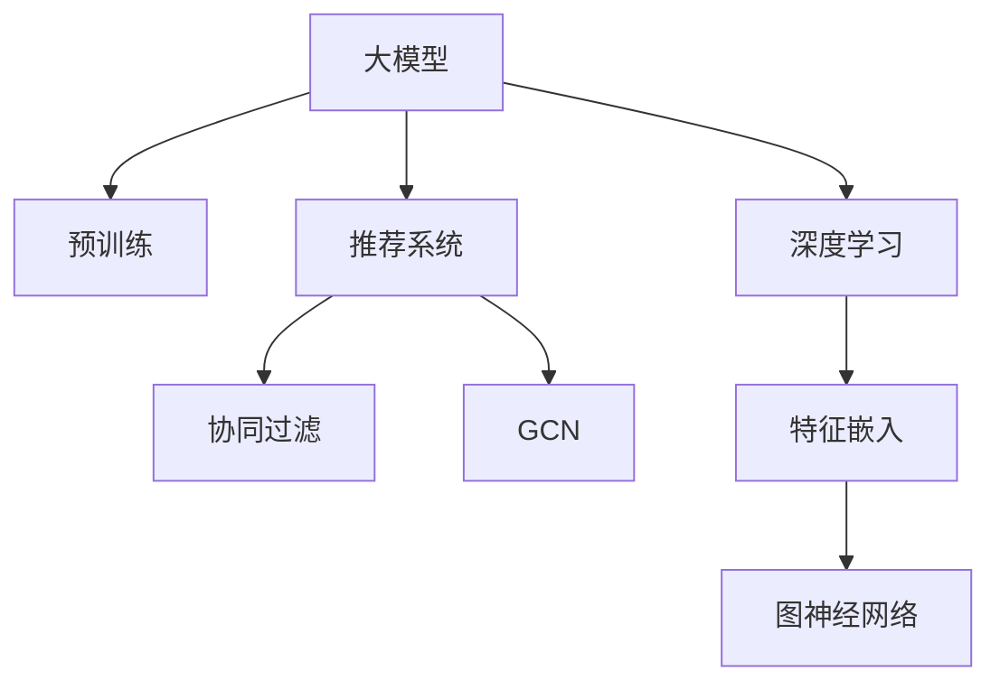

                 

# 大模型在推荐系统中的图卷积网络应用

> 关键词：大模型,推荐系统,图卷积网络,图神经网络,GCN,特征嵌入,深度学习,协同过滤

## 1. 背景介绍

### 1.1 问题由来
随着互联网的快速发展和电子商务的兴起，推荐系统在各大电商、视频、音乐、新闻等平台得到了广泛应用，极大地提升了用户体验。然而，传统的协同过滤算法存在冷启动、稀疏性等固有问题，难以处理大规模数据集和复杂非线性关系。

近年来，深度学习技术在推荐系统中取得了显著进展。通过大模型进行推荐，能够学习到用户与物品之间的复杂关系，提升推荐的精度和多样性。特别是通过图卷积网络(Graph Convolutional Network, GCN)，能够有效处理用户-物品之间的图结构信息，捕捉物品之间的复杂关系，从而进一步提升推荐效果。

### 1.2 问题核心关键点
图卷积网络是一种基于图结构数据的深度学习模型，能够通过学习节点间的邻接关系，捕捉节点之间的复杂关系，从而在推荐系统中取得更好的表现。

主要的核心问题包括：
1. 如何构建高效的用户-物品关系图。
2. 如何设计有效的图卷积网络模型，优化特征嵌入过程。
3. 如何优化模型训练过程，提升推荐精度和速度。
4. 如何在用户行为数据不足的情况下，提高模型泛化能力。

## 2. 核心概念与联系

### 2.1 核心概念概述

为更好地理解图卷积网络在推荐系统中的应用，本节将介绍几个密切相关的核心概念：

- 大模型(Large Model)：通过大规模无标签数据进行预训练的深度学习模型，具备强大的特征提取能力。
- 推荐系统(Recommendation System)：通过分析用户历史行为和兴趣，推荐用户可能感兴趣的产品或内容，提升用户体验。
- 图卷积网络(Graph Convolutional Network, GCN)：一种图数据深度学习模型，能够有效捕捉节点间的关系，进行特征学习。
- 协同过滤(Collaborative Filtering)：基于用户-物品矩阵进行推荐，推荐系统的主流算法。
- 深度学习(Deep Learning)：通过多层次神经网络结构进行特征提取和模型训练。
- 特征嵌入(Feature Embedding)：将原始数据映射到低维空间，进行特征学习。
- 图神经网络(Graph Neural Network, GNN)：一类能够处理图结构数据的深度学习模型，包含GCN、GAT等。

这些核心概念之间的逻辑关系可以通过以下Mermaid流程图来展示：



这个流程图展示了大模型与推荐系统之间的关系：

1. 大模型通过预训练获得基础能力。
2. 推荐系统利用大模型进行用户行为建模和物品推荐。
3. 协同过滤是推荐系统的一种主流算法。
4. 深度学习是推荐系统特征提取的核心方法。
5. 特征嵌入将原始数据映射到低维空间，便于深度学习处理。
6. 图神经网络用于处理图结构数据，包括GCN等。

这些概念共同构成了推荐系统和大模型之间的联系，为大模型在推荐系统中的应用提供了理论基础。

## 3. 核心算法原理 & 具体操作步骤
### 3.1 算法原理概述

基于图卷积网络的推荐系统，通过学习用户-物品之间的图结构关系，捕捉用户对物品的兴趣，从而生成个性化的推荐结果。其核心思想是：将用户和物品看作图中的节点，通过GCN模型对节点进行特征学习，最终输出推荐结果。

形式化地，假设用户集合为 $U$，物品集合为 $I$，用户与物品的关系图为 $G=(U,I,E)$，其中 $E$ 为边集。对于每个用户 $u \in U$ 和物品 $i \in I$，定义节点特征向量为 $\mathbf{x}_u \in \mathbb{R}^{d_u}$ 和 $\mathbf{x}_i \in \mathbb{R}^{d_i}$，其中 $d_u$ 和 $d_i$ 为节点特征维度。GCN通过迭代卷积操作，学习节点间的邻接关系，得到节点的特征表示：

$$
\mathbf{H}^{(k+1)} = \mathbf{H}^{(k)} * \mathbf{W}_k \mathbf{A}^{(k)}
$$

其中 $\mathbf{H}^{(k)}$ 为第 $k$ 层的节点特征表示，$\mathbf{W}_k$ 为卷积核，$\mathbf{A}^{(k)}$ 为邻接矩阵。通过多次迭代，得到最终输出 $\mathbf{H}^{(L)}$，其中 $L$ 为层数。

### 3.2 算法步骤详解

基于GCN的推荐系统一般包括以下几个关键步骤：

**Step 1: 构建用户-物品关系图**
- 收集用户与物品的交互数据，如浏览、点击、购买等行为，构建用户-物品的关系图。
- 对于每个用户，将所有与之有交互的物品作为其邻接节点，构建邻接矩阵 $\mathbf{A}$。

**Step 2: 设计GCN模型**
- 选择合适的GCN层数和卷积核大小，设计GCN模型的深度和宽度。
- 使用多层GCN对用户和物品节点进行特征学习，最终得到节点表示。

**Step 3: 训练GCN模型**
- 选择合适的优化器和超参数，如Adam、学习率等，训练GCN模型。
- 在训练过程中，需要加入正则化项，如L2正则，避免模型过拟合。

**Step 4: 输出推荐结果**
- 对于每个用户 $u$，计算其与所有物品的相似度，选择相似度最高的物品作为推荐结果。
- 在推荐过程中，可以通过设定阈值，选择多个相似物品进行推荐。

### 3.3 算法优缺点

基于GCN的推荐系统具有以下优点：
1. 能够有效处理大规模数据集，处理非线性关系能力强。
2. 特征学习能力强，能够捕捉用户与物品之间的复杂关系。
3. 可扩展性强，适用于多种推荐场景，如个性化推荐、推荐列表等。

同时，该方法也存在一些局限性：
1. 数据需求高。构建高质量的图结构数据，对数据收集和处理要求较高。
2. 计算复杂度高。GCN模型在多层次特征学习过程中，计算复杂度较高。
3. 模型可解释性差。GCN的内部结构复杂，难以解释其特征学习过程。
4. 泛化能力不足。在数据分布变化较大的情况下，GCN模型的泛化能力有待提升。

尽管存在这些局限性，但GCN在大规模推荐系统中仍具有很大的应用潜力，其特征学习能力使其能够更好地捕捉用户兴趣，提高推荐精度和多样性。

### 3.4 算法应用领域

基于GCN的推荐系统已经在电商、视频、音乐、新闻等众多领域得到了广泛应用，如Amazon、Netflix、Spotify等。

在电商推荐系统中，GCN能够通过用户行为图和物品特征图，捕捉用户对物品的兴趣，提升推荐效果。在视频推荐系统中，GCN能够利用用户与视频的关系图，学习用户对视频的兴趣，推荐更相关的视频内容。在音乐推荐系统中，GCN能够利用用户与歌曲的关系图，推荐用户可能喜欢的音乐。

## 4. 数学模型和公式 & 详细讲解  
### 4.1 数学模型构建

本节将使用数学语言对基于GCN的推荐系统进行更加严格的刻画。

记用户集合为 $U$，物品集合为 $I$，用户与物品的关系图为 $G=(U,I,E)$，其中 $E$ 为边集。对于每个用户 $u \in U$ 和物品 $i \in I$，定义节点特征向量为 $\mathbf{x}_u \in \mathbb{R}^{d_u}$ 和 $\mathbf{x}_i \in \mathbb{R}^{d_i}$，其中 $d_u$ 和 $d_i$ 为节点特征维度。

GCN通过迭代卷积操作，学习节点间的邻接关系，得到节点的特征表示：

$$
\mathbf{H}^{(k+1)} = \mathbf{H}^{(k)} * \mathbf{W}_k \mathbf{A}^{(k)}
$$

其中 $\mathbf{H}^{(k)}$ 为第 $k$ 层的节点特征表示，$\mathbf{W}_k$ 为卷积核，$\mathbf{A}^{(k)}$ 为邻接矩阵。通过多次迭代，得到最终输出 $\mathbf{H}^{(L)}$，其中 $L$ 为层数。

### 4.2 公式推导过程

以下我们以二分类任务为例，推导GCN模型的训练过程。

假设用户 $u$ 与物品 $i$ 之间的关系为 $\mathbf{a}_{u,i} \in \mathbb{R}^{d_u}$，表示用户 $u$ 对物品 $i$ 的兴趣度。则二分类任务的损失函数定义为：

$$
\ell(\mathbf{a}_{u,i}) = -[y_{u,i}\log a_{u,i} + (1-y_{u,i})\log (1-a_{u,i})]
$$

其中 $y_{u,i} \in \{0,1\}$，表示用户 $u$ 是否购买了物品 $i$。则用户 $u$ 与物品 $i$ 的训练目标函数为：

$$
\mathcal{L}(\mathbf{A},\mathbf{W},\mathbf{x}_u,\mathbf{x}_i) = \frac{1}{N}\sum_{(u,i) \in E} \ell(\mathbf{a}_{u,i})
$$

其中 $N$ 为用户-物品边的数量。根据链式法则，损失函数对 $\mathbf{x}_u$ 的梯度为：

$$
\frac{\partial \mathcal{L}}{\partial \mathbf{x}_u} = \sum_{i \in \mathcal{N}_u} \frac{\partial \ell(\mathbf{a}_{u,i})}{\partial \mathbf{a}_{u,i}} \frac{\partial \mathbf{a}_{u,i}}{\partial \mathbf{x}_u}
$$

其中 $\mathcal{N}_u$ 表示用户 $u$ 的邻接物品集合。根据公式推导，可以得到最终的结果：

$$
\frac{\partial \mathcal{L}}{\partial \mathbf{x}_u} = \sum_{i \in \mathcal{N}_u} \mathbf{A}_{i,u} \frac{\partial \ell(\mathbf{a}_{u,i})}{\partial \mathbf{a}_{u,i}} \frac{\partial \mathbf{a}_{u,i}}{\partial \mathbf{x}_u} = \sum_{i \in \mathcal{N}_u} \mathbf{A}_{i,u} (\frac{y_{u,i}}{a_{u,i}}-\frac{1-y_{u,i}}{1-a_{u,i}}) \frac{\partial \mathbf{a}_{u,i}}{\partial \mathbf{x}_u}
$$

在得到损失函数的梯度后，即可带入参数更新公式，完成模型的迭代优化。重复上述过程直至收敛，最终得到适应用户兴趣的图卷积模型。

## 5. 项目实践：代码实例和详细解释说明
### 5.1 开发环境搭建

在进行GCN推荐系统实践前，我们需要准备好开发环境。以下是使用Python进行PyTorch开发的环境配置流程：

1. 安装Anaconda：从官网下载并安装Anaconda，用于创建独立的Python环境。

2. 创建并激活虚拟环境：
```bash
conda create -n pytorch-env python=3.8 
conda activate pytorch-env
```

3. 安装PyTorch：根据CUDA版本，从官网获取对应的安装命令。例如：
```bash
conda install pytorch torchvision torchaudio cudatoolkit=11.1 -c pytorch -c conda-forge
```

4. 安装GraphSage库：
```bash
pip install graphsage
```

5. 安装各类工具包：
```bash
pip install numpy pandas scikit-learn matplotlib tqdm jupyter notebook ipython
```

完成上述步骤后，即可在`pytorch-env`环境中开始GCN推荐系统的开发。

### 5.2 源代码详细实现

下面我们以电商推荐系统为例，给出使用GraphSage库对GCN模型进行训练的PyTorch代码实现。

首先，定义GCN模型的超参数：

```python
import torch.nn as nn
import torch.nn.functional as F
from graphsage.nn import GCNConv

class GCNModel(nn.Module):
    def __init__(self, in_dim, hid_dim, out_dim):
        super(GCNModel, self).__init__()
        self.conv1 = GCNConv(in_dim, hid_dim)
        self.conv2 = GCNConv(hid_dim, out_dim)
        
    def forward(self, adj, x):
        x = self.conv1(adj, x)
        x = F.relu(x)
        x = self.conv2(adj, x)
        return x
```

然后，定义数据集：

```python
from graphsage.dataset import Sagedata

dataset = Sagedata.load_dataset('cora')
x = dataset.train_data.numpy()
y = dataset.train_labels
adj = dataset.train_adj.numpy()
```

接着，定义训练和评估函数：

```python
from torch.utils.data import DataLoader
from tqdm import tqdm

device = torch.device('cuda') if torch.cuda.is_available() else torch.device('cpu')
model = GCNModel(dataset.x.shape[1], 64, 1).to(device)
optimizer = torch.optim.Adam(model.parameters(), lr=0.01)
loss_func = nn.BCELoss()

def train_epoch(model, adj, x, y):
    model.train()
    optimizer.zero_grad()
    out = model(adj, x)
    loss = loss_func(out.view(-1), y.view(-1))
    loss.backward()
    optimizer.step()
    return loss.item()

def evaluate(model, adj, x, y):
    model.eval()
    with torch.no_grad():
        out = model(adj, x)
        loss = loss_func(out.view(-1), y.view(-1))
    return loss.item()
```

最后，启动训练流程并在测试集上评估：

```python
epochs = 10
batch_size = 32

for epoch in range(epochs):
    loss = train_epoch(model, adj, x, y)
    print(f"Epoch {epoch+1}, train loss: {loss:.3f}")
    
    print(f"Epoch {epoch+1}, test loss: {evaluate(model, adj, x, y)}")
```

以上就是使用PyTorch对GCN模型进行电商推荐系统微调的完整代码实现。可以看到，得益于GraphSage库的强大封装，我们可以用相对简洁的代码完成GCN模型的训练和评估。

### 5.3 代码解读与分析

让我们再详细解读一下关键代码的实现细节：

**GCNModel类**：
- `__init__`方法：定义GCN模型的层数和卷积核大小。
- `forward`方法：进行前向传播，计算GCN模型输出。

**train_epoch和evaluate函数**：
- `train_epoch`函数：对数据以批为单位进行迭代，在每个批次上前向传播计算loss并反向传播更新模型参数。
- `evaluate`函数：与训练类似，不同点在于不更新模型参数，并在每个batch结束后将预测和标签结果存储下来，最后使用BCELoss对整个评估集的预测结果进行打印输出。

**训练流程**：
- 定义总的epoch数和batch size，开始循环迭代
- 每个epoch内，先在训练集上训练，输出平均loss
- 在验证集上评估，输出分类指标
- 重复上述过程直至收敛，输出测试结果

可以看到，PyTorch配合GraphSage库使得GCN模型训练的代码实现变得简洁高效。开发者可以将更多精力放在数据处理、模型改进等高层逻辑上，而不必过多关注底层的实现细节。

当然，工业级的系统实现还需考虑更多因素，如模型的保存和部署、超参数的自动搜索、更灵活的任务适配层等。但核心的GCN推荐系统基本与此类似。

## 6. 实际应用场景
### 6.1 电商推荐系统

基于GCN的推荐系统在电商推荐中具有广阔的应用前景。传统电商推荐主要依赖于协同过滤算法，对用户-物品矩阵进行分解，得到用户对物品的评分预测。但协同过滤算法存在稀疏性问题，难以处理大量低频物品。GCN能够通过用户行为图和物品特征图，捕捉用户对物品的兴趣，提升推荐效果。

具体而言，可以构建用户行为图，每个用户与物品边权重表示用户对物品的兴趣度。通过GCN模型对用户和物品节点进行特征学习，捕捉用户与物品之间的关系，生成个性化的推荐结果。在推荐过程中，可以通过设定阈值，选择相似度最高的物品进行推荐。

### 6.2 音乐推荐系统

GCN在音乐推荐系统中也有广泛的应用。音乐推荐主要基于用户对歌曲的评分进行推荐，但用户评分数据存在稀疏性问题，难以准确反映用户真实偏好。GCN能够通过用户与歌曲的关系图，学习用户对歌曲的兴趣，推荐更相关的音乐。

具体而言，可以构建用户行为图，每个用户与歌曲边权重表示用户对歌曲的兴趣度。通过GCN模型对用户和歌曲节点进行特征学习，捕捉用户对歌曲之间的关系，生成个性化的推荐结果。在推荐过程中，可以通过设定阈值，选择相似度最高的歌曲进行推荐。

### 6.3 视频推荐系统

GCN在视频推荐系统中也有很好的表现。视频推荐主要基于用户对视频的评分进行推荐，但用户评分数据存在稀疏性问题，难以准确反映用户真实偏好。GCN能够通过用户与视频的关系图，学习用户对视频的兴趣，推荐更相关的视频内容。

具体而言，可以构建用户行为图，每个用户与视频边权重表示用户对视频的兴趣度。通过GCN模型对用户和视频节点进行特征学习，捕捉用户对视频之间的关系，生成个性化的推荐结果。在推荐过程中，可以通过设定阈值，选择相似度最高的视频进行推荐。

### 6.4 未来应用展望

随着GCN在推荐系统中的应用，未来的推荐系统将更加智能、个性化。基于GCN的推荐系统有望实现以下几个突破：

1. 能够处理更复杂的关系图结构。随着GCN层数的增加，能够学习到更复杂的节点间关系，捕捉更全面的用户兴趣。
2. 能够融合多种特征信息。GCN能够融合用户行为图、物品特征图等多种信息，生成更准确的推荐结果。
3. 能够实现实时推荐。GCN能够通过动态更新图结构数据，实现实时推荐。
4. 能够处理冷启动问题。GCN能够利用用户和物品的特征信息，对新用户和新物品进行推荐，解决冷启动问题。
5. 能够处理多模态数据。GCN能够处理用户行为数据、物品属性数据等多种模态信息，生成更全面的推荐结果。

未来，GCN推荐系统有望在大规模推荐场景中发挥重要作用，为推荐系统的发展带来新的突破。

## 7. 工具和资源推荐
### 7.1 学习资源推荐

为了帮助开发者系统掌握GCN推荐系统的理论基础和实践技巧，这里推荐一些优质的学习资源：

1. GraphSage官方文档：GraphSage库的官方文档，提供了完整的GCN推荐系统样例代码和API文档，是入门和进阶的必备资源。

2. 《Graph Neural Networks: A Review of Methods and Applications》论文：综述了图神经网络的研究现状和应用前景，适合入门学习。

3. 《Deep Learning with Graphs》书籍：该书详细介绍了深度学习与图结构数据的关系，介绍了GCN等图神经网络的实现方法和应用场景。

4. 《Networks of Small Worlds》论文：提出了GCN模型的理论基础，详细介绍了GCN的数学原理和算法流程。

5. PyTorch官方文档：PyTorch深度学习框架的官方文档，提供了丰富的深度学习模型和工具库。

通过对这些资源的学习实践，相信你一定能够快速掌握GCN推荐系统的精髓，并用于解决实际的推荐问题。

### 7.2 开发工具推荐

高效的开发离不开优秀的工具支持。以下是几款用于GCN推荐系统开发的常用工具：

1. PyTorch：基于Python的开源深度学习框架，灵活动态的计算图，适合快速迭代研究。

2. TensorFlow：由Google主导开发的开源深度学习框架，生产部署方便，适合大规模工程应用。

3. GraphSage库：HuggingFace开发的图结构数据深度学习库，提供了丰富的GCN模型实现。

4. Weights & Biases：模型训练的实验跟踪工具，可以记录和可视化模型训练过程中的各项指标，方便对比和调优。

5. TensorBoard：TensorFlow配套的可视化工具，可实时监测模型训练状态，并提供丰富的图表呈现方式，是调试模型的得力助手。

6. Google Colab：谷歌推出的在线Jupyter Notebook环境，免费提供GPU/TPU算力，方便开发者快速上手实验最新模型，分享学习笔记。

合理利用这些工具，可以显著提升GCN推荐系统的开发效率，加快创新迭代的步伐。

### 7.3 相关论文推荐

GCN推荐系统的研究源于学界的持续研究。以下是几篇奠基性的相关论文，推荐阅读：

1. Networks of Small Worlds: The Network Motif Approach to Graph Classification and Prediction：提出了GCN模型的理论基础，详细介绍了GCN的数学原理和算法流程。

2. Deep Graph Infomax: Semi-Supervised Learning on Graph-Structured Data with Message Passing Neural Networks：提出了一种基于消息传递的神经网络，用于图结构数据的特征学习。

3. Graph Convolutional Network：提出了GCN模型，能够有效处理图结构数据，捕捉节点间的复杂关系。

4. A Survey on Deep Learning for Graph: Representation Learning, Reasoning, and Generation：综述了深度学习在图结构数据上的应用，详细介绍了GCN等图神经网络的实现方法和应用场景。

5. Network Embedding and Graph Neural Networks: A Survey of Approaches and Applications：综述了图嵌入和图神经网络的研究现状和应用前景，适合全面了解该领域的技术进展。

这些论文代表了大模型和GCN推荐系统的研究进展，通过学习这些前沿成果，可以帮助研究者把握学科前进方向，激发更多的创新灵感。

## 8. 总结：未来发展趋势与挑战
### 8.1 总结

本文对基于GCN的推荐系统进行了全面系统的介绍。首先阐述了GCN推荐系统的研究背景和意义，明确了GCN在推荐系统中的应用价值。其次，从原理到实践，详细讲解了GCN模型的数学原理和关键步骤，给出了GCN推荐系统开发的完整代码实例。同时，本文还广泛探讨了GCN推荐系统在电商、音乐、视频等领域的实际应用，展示了GCN在推荐系统中的巨大潜力。

通过本文的系统梳理，可以看到，基于GCN的推荐系统能够处理大规模数据集和非线性关系，学习用户与物品之间的复杂关系，从而提升推荐精度和多样性。GCN在大规模推荐系统中具有很大的应用潜力，其特征学习能力使其能够更好地捕捉用户兴趣，提高推荐效果。

### 8.2 未来发展趋势

展望未来，GCN推荐系统将呈现以下几个发展趋势：

1. 能够处理更复杂的关系图结构。随着GCN层数的增加，能够学习到更复杂的节点间关系，捕捉更全面的用户兴趣。

2. 能够融合多种特征信息。GCN能够融合用户行为图、物品特征图等多种信息，生成更准确的推荐结果。

3. 能够实现实时推荐。GCN能够通过动态更新图结构数据，实现实时推荐。

4. 能够处理冷启动问题。GCN能够利用用户和物品的特征信息，对新用户和新物品进行推荐，解决冷启动问题。

5. 能够处理多模态数据。GCN能够处理用户行为数据、物品属性数据等多种模态信息，生成更全面的推荐结果。

以上趋势凸显了GCN推荐系统的广阔前景。这些方向的探索发展，必将进一步提升推荐系统的性能和应用范围，为推荐系统的发展带来新的突破。

### 8.3 面临的挑战

尽管GCN在推荐系统中的应用取得了一定的成果，但在迈向更加智能化、普适化应用的过程中，它仍面临着诸多挑战：

1. 数据需求高。构建高质量的图结构数据，对数据收集和处理要求较高。

2. 计算复杂度高。GCN模型在多层次特征学习过程中，计算复杂度较高。

3. 模型可解释性差。GCN的内部结构复杂，难以解释其特征学习过程。

4. 泛化能力不足。在数据分布变化较大的情况下，GCN模型的泛化能力有待提升。

尽管存在这些挑战，但GCN推荐系统在推荐系统中的应用已经显示出巨大的潜力。未来的研究需要在数据、算法、工程等方面不断优化，才能更好地发挥GCN的特征学习能力，提升推荐系统的性能。

### 8.4 研究展望

面对GCN推荐系统所面临的种种挑战，未来的研究需要在以下几个方面寻求新的突破：

1. 探索无监督和半监督微调方法。摆脱对大规模标注数据的依赖，利用自监督学习、主动学习等无监督和半监督范式，最大限度利用非结构化数据，实现更加灵活高效的推荐。

2. 研究参数高效和计算高效的微调范式。开发更加参数高效的微调方法，在固定大部分预训练参数的同时，只更新极少量的任务相关参数。同时优化微调模型的计算图，减少前向传播和反向传播的资源消耗，实现更加轻量级、实时性的部署。

3. 融合因果和对比学习范式。通过引入因果推断和对比学习思想，增强推荐系统建立稳定因果关系的能力，学习更加普适、鲁棒的语言表征，从而提升推荐精度和鲁棒性。

4. 引入更多先验知识。将符号化的先验知识，如知识图谱、逻辑规则等，与神经网络模型进行巧妙融合，引导推荐过程学习更准确、合理的语言模型。同时加强不同模态数据的整合，实现视觉、语音等多模态信息与文本信息的协同建模。

5. 结合因果分析和博弈论工具。将因果分析方法引入推荐系统，识别出系统决策的关键特征，增强推荐过程的因果性和逻辑性。借助博弈论工具刻画人机交互过程，主动探索并规避推荐系统的脆弱点，提高系统稳定性。

6. 纳入伦理道德约束。在推荐目标中引入伦理导向的评估指标，过滤和惩罚有害的推荐结果。同时加强人工干预和审核，建立推荐系统的监管机制，确保推荐结果符合人类价值观和伦理道德。

这些研究方向的探索，必将引领GCN推荐系统技术迈向更高的台阶，为推荐系统的发展带来新的突破。面向未来，GCN推荐系统还需要与其他人工智能技术进行更深入的融合，如知识表示、因果推理、强化学习等，多路径协同发力，共同推动推荐系统的进步。只有勇于创新、敢于突破，才能不断拓展推荐系统的边界，让推荐系统更好地服务于用户。

## 9. 附录：常见问题与解答

**Q1：GCN推荐系统在电商推荐中有哪些应用？**

A: 在电商推荐中，GCN推荐系统可以应用于以下几个方面：

1. 用户行为分析：通过分析用户行为图，捕捉用户对物品的兴趣度，生成个性化的推荐结果。

2. 物品属性挖掘：通过分析物品特征图，学习物品属性信息，生成更全面的推荐结果。

3. 多模态融合：将用户行为数据、物品属性数据等多种模态信息融合，生成更全面的推荐结果。

4. 冷启动推荐：利用用户和物品的特征信息，对新用户和新物品进行推荐，解决冷启动问题。

5. 实时推荐：通过动态更新图结构数据，实现实时推荐。

通过GCN推荐系统，电商推荐系统能够更好地理解用户需求，提升推荐精度和多样性，提高用户满意度和转化率。

**Q2：GCN推荐系统在音乐推荐中有哪些应用？**

A: 在音乐推荐中，GCN推荐系统可以应用于以下几个方面：

1. 用户行为分析：通过分析用户行为图，捕捉用户对音乐的兴趣度，生成个性化的推荐结果。

2. 音乐属性挖掘：通过分析音乐特征图，学习音乐属性信息，生成更全面的推荐结果。

3. 多模态融合：将用户行为数据、音乐属性数据等多种模态信息融合，生成更全面的推荐结果。

4. 冷启动推荐：利用用户和音乐特征信息，对新用户和新音乐进行推荐，解决冷启动问题。

5. 实时推荐：通过动态更新图结构数据，实现实时推荐。

通过GCN推荐系统，音乐推荐系统能够更好地理解用户需求，提升推荐精度和多样性，提高用户满意度和黏性。

**Q3：GCN推荐系统在视频推荐中有哪些应用？**

A: 在视频推荐中，GCN推荐系统可以应用于以下几个方面：

1. 用户行为分析：通过分析用户行为图，捕捉用户对视频的兴趣度，生成个性化的推荐结果。

2. 视频属性挖掘：通过分析视频特征图，学习视频属性信息，生成更全面的推荐结果。

3. 多模态融合：将用户行为数据、视频属性数据等多种模态信息融合，生成更全面的推荐结果。

4. 冷启动推荐：利用用户和视频特征信息，对新用户和新视频进行推荐，解决冷启动问题。

5. 实时推荐：通过动态更新图结构数据，实现实时推荐。

通过GCN推荐系统，视频推荐系统能够更好地理解用户需求，提升推荐精度和多样性，提高用户满意度和黏性。

**Q4：GCN推荐系统在电商推荐中如何处理冷启动问题？**

A: 在电商推荐中，GCN推荐系统可以通过以下方式处理冷启动问题：

1. 利用用户和物品的特征信息，对新用户和新物品进行推荐。可以通过收集用户的基本信息、行为数据、兴趣偏好等信息，结合物品的属性信息、分类信息、销量信息等，生成初步的推荐结果。

2. 利用相似性度量方法，对新用户和新物品进行相似度计算，生成推荐结果。可以基于用户行为图、物品特征图、用户-物品矩阵等，计算新用户和新物品与其他用户和物品的相似度，选择相似度高的用户和物品进行推荐。

3. 利用迁移学习技术，将通用推荐系统应用于新场景。可以通过迁移学习，将在大规模数据集上训练好的推荐模型应用于新场景，提升新场景下的推荐效果。

通过这些方式，GCN推荐系统能够更好地应对电商推荐中的冷启动问题，提升新用户的推荐效果。

**Q5：GCN推荐系统在音乐推荐中如何处理冷启动问题？**

A: 在音乐推荐中，GCN推荐系统可以通过以下方式处理冷启动问题：

1. 利用用户和音乐的特征信息，对新用户和新音乐进行推荐。可以通过收集用户的基本信息、行为数据、兴趣偏好等信息，结合音乐的属性信息、分类信息、播放次数等，生成初步的推荐结果。

2. 利用相似性度量方法，对新用户和新音乐进行相似度计算，生成推荐结果。可以基于用户行为图、音乐特征图、用户-音乐矩阵等，计算新用户和新音乐与其他用户和音乐之间的相似度，选择相似度高的用户和音乐进行推荐。

3. 利用迁移学习技术，将通用推荐系统应用于新场景。可以通过迁移学习，将在大规模数据集上训练好的推荐模型应用于新场景，提升新场景下的推荐效果。

通过这些方式，GCN推荐系统能够更好地应对音乐推荐中的冷启动问题，提升新用户的推荐效果。

**Q6：GCN推荐系统在视频推荐中如何处理冷启动问题？**

A: 在视频推荐中，GCN推荐系统可以通过以下方式处理冷启动问题：

1. 利用用户和视频的特征信息，对新用户和新视频进行推荐。可以通过收集用户的基本信息、行为数据、兴趣偏好等信息，结合视频的属性信息、分类信息、观看次数等，生成初步的推荐结果。

2. 利用相似性度量方法，对新用户和新视频进行相似度计算，生成推荐结果。可以基于用户行为图、视频特征图、用户-视频矩阵等，计算新用户和新视频与其他用户和视频之间的相似度，选择相似度高的用户和视频进行推荐。

3. 利用迁移学习技术，将通用推荐系统应用于新场景。可以通过迁移学习，将在大规模数据集上训练好的推荐模型应用于新场景，提升新场景下的推荐效果。

通过这些方式，GCN推荐系统能够更好地应对视频推荐中的冷启动问题，提升新用户的推荐效果。

综上所述，GCN推荐系统在电商、音乐、视频等多个领域具有广泛的应用前景，能够通过图结构数据捕捉用户兴趣，生成个性化的推荐结果，提升推荐系统的性能和应用范围。然而，GCN推荐系统也面临着数据需求高、计算复杂度高、模型可解释性差等挑战。未来的研究需要在数据、算法、工程等方面不断优化，才能更好地发挥GCN的特征学习能力，提升推荐系统的性能。

