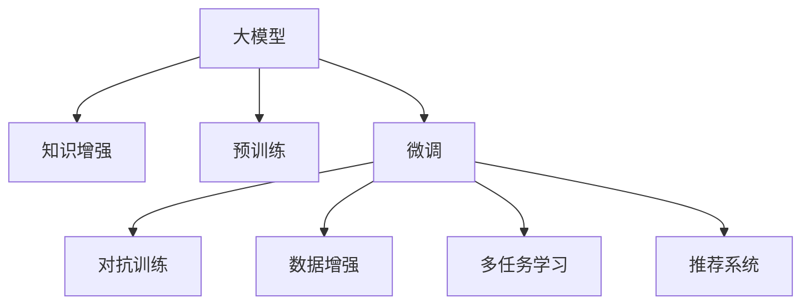

                 

# 大模型在推荐系统中的知识增强应用

> 关键词：大模型,推荐系统,知识增强,预训练,微调,对抗训练,数据增强,Recommender System,Knowledge-Enhanced,Pre-training & Fine-tuning,Adversarial Training,Data Augmentation

## 1. 背景介绍

随着互联网和数字技术的迅猛发展，推荐系统已成为各行各业中不可或缺的一部分，极大提升了用户体验和业务价值。推荐系统主要通过数据分析和机器学习算法，为用户推荐符合其兴趣和需求的内容，如电商推荐、内容推荐、新闻推荐等。传统的推荐系统多依赖用户行为数据，存在数据稀疏性、用户偏好变化等问题，难以精准捕捉用户真实需求。近年来，大模型在推荐系统中的应用逐渐兴起，通过大规模语料和预训练技术，在个性化推荐中展现了巨大的潜力。

### 1.1 问题由来
推荐系统面临的最大挑战之一是数据稀疏性和用户偏好动态变化。传统基于协同过滤、矩阵分解等算法的推荐系统，依赖用户行为数据进行推荐，但用户行为数据往往存在缺失、低频等问题，难以覆盖长尾用户。而用户偏好也并非一成不变，会受到各种因素的影响。因此，传统的推荐算法难以全面、准确地把握用户需求。

大模型通过大规模预训练数据获取丰富语言知识，在自然语言处理(NLP)和推荐系统等领域展现出了巨大优势。在推荐系统中，大模型不仅能够通过预训练学习通用的用户行为模式，还可以通过微调学习特定领域的知识，更好地适应不同任务和用户需求。

### 1.2 问题核心关键点
大模型在推荐系统中的应用，主要集中在以下几个方面：

- **知识增强**：利用预训练和微调技术，学习通用和特定领域的知识，提升推荐系统的准确性和个性化程度。
- **对抗训练**：引入对抗样本，提高模型的鲁棒性和泛化能力，避免因新数据输入导致的预测波动。
- **数据增强**：通过对用户行为数据进行扩充和改写，提升训练集的多样性和泛化能力，缓解过拟合问题。
- **多任务学习**：将推荐系统任务与其他任务相结合，通过联合训练学习更多领域知识，进一步提升推荐效果。
- **模型可解释性**：引入因果分析和对比学习等方法，增强模型的可解释性，帮助用户理解推荐结果。

这些关键点共同构成了大模型在推荐系统中的应用框架，使得推荐系统具备了更强的学习能力和适应性。

### 1.3 问题研究意义
大模型在推荐系统中的应用，对于提升推荐系统的性能、用户体验和业务价值具有重要意义：

1. **精准推荐**：大模型通过学习丰富的语言知识，能够捕捉到用户需求中的深层次含义，提升推荐结果的精准度。
2. **长尾覆盖**：大模型能够对长尾用户进行推荐，覆盖更多的需求场景，提升系统覆盖度。
3. **鲁棒性增强**：通过对抗训练和数据增强技术，提升模型的泛化能力和鲁棒性，应对新数据和新用户的挑战。
4. **可解释性提升**：通过可解释性技术，帮助用户理解推荐过程，提升用户信任和满意度。
5. **多领域融合**：通过多任务学习，将推荐系统与其他领域知识相结合，如知识图谱、用户画像等，实现更全面、准确的用户需求建模。

## 2. 核心概念与联系

### 2.1 核心概念概述

为更好地理解大模型在推荐系统中的应用，本节将介绍几个密切相关的核心概念：

- **大模型(Large Model)**：以Transformer为代表的深度神经网络模型，通过大规模预训练获取丰富的语言知识，能够对自然语言进行复杂理解与生成。
- **知识增强(Knowledge-Enhanced)**：通过预训练和微调学习领域知识，提升推荐系统的准确性和个性化程度。
- **预训练(Pre-training)**：在大规模无标签数据上，通过自监督学习任务训练模型，学习通用的语言表示。
- **微调(Fine-tuning)**：在预训练模型的基础上，使用下游任务的少量标注数据，通过有监督学习优化模型在特定任务上的性能。
- **对抗训练(Adversarial Training)**：通过引入对抗样本，增强模型的鲁棒性和泛化能力，避免因新数据输入导致的预测波动。
- **数据增强(Data Augmentation)**：通过对用户行为数据进行扩充和改写，提升训练集的多样性和泛化能力。
- **多任务学习(Multi-task Learning)**：通过联合训练多个相关任务，学习更全面的领域知识，提升推荐效果。
- **推荐系统(Recommender System)**：通过数据分析和机器学习算法，为用户推荐符合其兴趣和需求的内容，提升用户体验和业务价值。

这些核心概念之间的逻辑关系可以通过以下Mermaid流程图来展示：



这个流程图展示了大模型的核心概念及其与推荐系统的联系：

1. 大模型通过预训练获取基础能力。
2. 微调使得通用大模型更好地适应特定任务。
3. 知识增强提升模型在推荐系统中的性能。
4. 对抗训练提高模型的鲁棒性。
5. 数据增强缓解过拟合问题。
6. 多任务学习获取更多领域知识。
7. 推荐系统利用大模型微调结果进行推荐。

这些概念共同构成了大模型在推荐系统中的学习框架，使其能够更好地理解和推荐用户需求。

## 3. 核心算法原理 & 具体操作步骤
### 3.1 算法原理概述

大模型在推荐系统中的应用，主要通过预训练和微调技术进行知识增强。具体来说，步骤如下：

1. **预训练**：在大规模无标签数据上，使用自监督学习任务（如语言建模、掩码预测等）训练大模型，学习通用的语言表示。
2. **微调**：在预训练模型的基础上，使用下游任务的少量标注数据，通过有监督学习优化模型在特定任务上的性能。
3. **知识增强**：通过微调，学习领域特定的知识，提升推荐系统的精准度和个性化程度。

### 3.2 算法步骤详解

基于大模型的推荐系统知识增强主要包括以下几个关键步骤：

**Step 1: 准备预训练模型和数据集**
- 选择合适的预训练模型（如BERT、GPT等）作为初始化参数。
- 准备推荐任务的数据集，通常包含用户行为数据和商品/内容描述。

**Step 2: 定义推荐模型**
- 在预训练模型的基础上，定义推荐模型的结构。推荐模型的输入为用户的兴趣表示和商品/内容的表示，输出为用户对该商品/内容的评分或概率。
- 使用多层Transformer结构，将用户和商品的表示映射到同一空间，再通过一个线性层得到最终评分或概率。

**Step 3: 设置微调超参数**
- 选择合适的优化算法（如AdamW、SGD等）及其参数，如学习率、批大小、迭代轮数等。
- 设置正则化技术及强度，包括权重衰减、Dropout、Early Stopping等。
- 确定冻结预训练参数的策略，如仅微调顶层，或全部参数都参与微调。

**Step 4: 执行梯度训练**
- 将用户行为数据和商品/内容描述作为输入，前向传播计算损失函数。
- 反向传播计算参数梯度，根据设定的优化算法和学习率更新模型参数。
- 周期性在验证集上评估模型性能，根据性能指标决定是否触发Early Stopping。
- 重复上述步骤直到满足预设的迭代轮数或Early Stopping条件。

**Step 5: 测试和部署**
- 在测试集上评估微调后模型的性能，对比微调前后的评分精度提升。
- 使用微调后的模型对新用户进行推荐，集成到实际的应用系统中。
- 持续收集新的数据，定期重新微调模型，以适应数据分布的变化。

以上是基于大模型的推荐系统知识增强的一般流程。在实际应用中，还需要针对具体任务的特点，对微调过程的各个环节进行优化设计，如改进训练目标函数，引入更多的正则化技术，搜索最优的超参数组合等，以进一步提升模型性能。

### 3.3 算法优缺点

基于大模型的推荐系统知识增强方法具有以下优点：
1. 提升推荐精度：大模型能够学习丰富的语言知识，提升推荐系统的精准度和个性化程度。
2. 长尾覆盖：大模型能够对长尾用户进行推荐，覆盖更多的需求场景，提升系统覆盖度。
3. 泛化能力强：通过对抗训练和数据增强技术，提升模型的泛化能力和鲁棒性，应对新数据和新用户的挑战。
4. 多任务学习：通过联合训练多个相关任务，学习更全面的领域知识，提升推荐效果。
5. 可解释性提升：通过可解释性技术，帮助用户理解推荐过程，提升用户信任和满意度。

同时，该方法也存在一定的局限性：
1. 依赖标注数据：微调的效果很大程度上取决于标注数据的质量和数量，获取高质量标注数据的成本较高。
2. 计算资源需求大：大模型需要大量计算资源进行预训练和微调，对硬件要求较高。
3. 模型复杂度高：大模型结构复杂，推理速度较慢，对实时性要求较高的场景可能不适用。
4. 知识融合难度大：大模型学习领域知识需要充分的数据和任务定义，有时难以融入复杂的业务场景。

尽管存在这些局限性，但就目前而言，基于大模型的推荐系统知识增强方法仍然是推荐系统研究的热点方向，其强大的学习和适应能力使其在推荐系统中展现出巨大的潜力。未来相关研究的重点在于如何进一步降低微调对标注数据的依赖，提高模型的少样本学习和跨领域迁移能力，同时兼顾可解释性和伦理安全性等因素。

### 3.4 算法应用领域

基于大模型的推荐系统知识增强方法已经在多个领域得到了应用，包括电商推荐、内容推荐、新闻推荐等，以下是一些典型应用场景：

- **电商推荐**：通过预训练和微调学习用户行为模式和商品特征，推荐符合用户兴趣的商品，提升用户购物体验。
- **内容推荐**：使用预训练和微调模型学习用户对不同内容的兴趣和情感倾向，推荐用户可能感兴趣的文章、视频等。
- **新闻推荐**：利用预训练和微调模型学习用户阅读习惯和新闻内容特征，推荐用户可能感兴趣的新闻文章，提高新闻平台的阅读量。
- **社交推荐**：通过预训练和微调模型学习用户社交行为和关系特征，推荐用户可能感兴趣的朋友、群组等，提升用户社交体验。
- **个性化广告推荐**：使用预训练和微调模型学习用户兴趣和行为特征，推荐符合用户偏好的广告内容，提升广告点击率和转化率。

除了上述这些典型应用外，大模型在推荐系统中的应用还在不断扩展，如视频推荐、音乐推荐、游戏推荐等，为推荐系统带来了新的突破。随着预训练模型和微调方法的不断进步，相信推荐系统必将在更多领域得到应用，为各行各业带来全新的变革。

## 4. 数学模型和公式 & 详细讲解 & 举例说明

### 4.1 数学模型构建

本节将使用数学语言对基于大模型的推荐系统知识增强过程进行更加严格的刻画。

记推荐系统中的用户行为数据为 $D=\{(x_i,y_i)\}_{i=1}^N$，其中 $x_i$ 为用户的行为特征， $y_i$ 为商品/内容的评分或概率。假设推荐系统任务为二分类任务，即判断用户是否会对商品/内容产生兴趣。

定义推荐模型 $M_{\theta}$ 为：

$$
M_{\theta}(x) = \text{softmax}(A_{\theta} \cdot x)
$$

其中 $A_{\theta}$ 为推荐模型的权重矩阵， $x$ 为用户行为特征的表示。模型的预测输出为 $M_{\theta}(x) \in [0,1]$，表示用户对商品/内容的兴趣概率。

假设模型的损失函数为二分类交叉熵损失，即：

$$
\ell(y, \hat{y}) = -(y \log \hat{y} + (1-y) \log (1-\hat{y}))
$$

在训练过程中，模型的优化目标是最小化损失函数：

$$
\mathcal{L}(\theta) = \frac{1}{N} \sum_{i=1}^N \ell(y_i, M_{\theta}(x_i))
$$

通过梯度下降等优化算法，微调过程不断更新模型参数 $\theta$，最小化损失函数 $\mathcal{L}$，使得模型输出逼近真实标签。由于 $\theta$ 已经通过预训练获得了较好的初始化，因此即便在小规模数据集上，也能较快收敛到理想的模型参数 $\hat{\theta}$。

### 4.2 公式推导过程

以电商推荐为例，推导交叉熵损失函数及其梯度的计算公式。

假设模型 $M_{\theta}$ 在用户行为特征 $x$ 上的输出为 $\hat{y}=M_{\theta}(x) \in [0,1]$，表示用户对商品/内容的兴趣概率。真实标签 $y \in \{0,1\}$。则二分类交叉熵损失函数定义为：

$$
\ell(M_{\theta}(x),y) = -[y\log \hat{y} + (1-y)\log (1-\hat{y})]
$$

将其代入经验风险公式，得：

$$
\mathcal{L}(\theta) = -\frac{1}{N}\sum_{i=1}^N [y_i\log M_{\theta}(x_i)+(1-y_i)\log(1-M_{\theta}(x_i))]
$$

根据链式法则，损失函数对参数 $\theta_k$ 的梯度为：

$$
\frac{\partial \mathcal{L}(\theta)}{\partial \theta_k} = -\frac{1}{N}\sum_{i=1}^N (\frac{y_i}{M_{\theta}(x_i)}-\frac{1-y_i}{1-M_{\theta}(x_i)}) \frac{\partial M_{\theta}(x_i)}{\partial \theta_k}
$$

其中 $\frac{\partial M_{\theta}(x_i)}{\partial \theta_k}$ 可进一步递归展开，利用自动微分技术完成计算。

在得到损失函数的梯度后，即可带入参数更新公式，完成模型的迭代优化。重复上述过程直至收敛，最终得到适应推荐任务的最优模型参数 $\theta^*$。

### 4.3 案例分析与讲解

以下以电商推荐为例，分析大模型在推荐系统中的知识增强应用：

**数据准备**：
- 收集用户的历史浏览、点击、购买等行为数据，提取用户兴趣特征和商品特征。
- 将用户行为数据划分为训练集、验证集和测试集。

**预训练模型选择**：
- 选择Transformer结构的大语言模型（如BERT、GPT等）作为初始化参数，利用大规模无标签数据进行预训练。

**微调模型设计**：
- 在预训练模型的基础上，定义电商推荐模型的结构。推荐模型的输入为用户兴趣特征和商品特征，输出为用户对该商品的兴趣概率。
- 使用多层Transformer结构，将用户兴趣特征和商品特征映射到同一空间，再通过一个线性层得到最终兴趣概率。

**超参数设置**：
- 选择合适的优化算法（如AdamW、SGD等）及其参数，如学习率、批大小、迭代轮数等。
- 设置正则化技术及强度，包括权重衰减、Dropout、Early Stopping等。
- 确定冻结预训练参数的策略，如仅微调顶层，或全部参数都参与微调。

**训练与评估**：
- 将训练集数据分批次输入模型，前向传播计算损失函数。
- 反向传播计算参数梯度，根据设定的优化算法和学习率更新模型参数。
- 周期性在验证集上评估模型性能，根据性能指标决定是否触发Early Stopping。
- 重复上述步骤直到满足预设的迭代轮数或Early Stopping条件。

**测试与部署**：
- 在测试集上评估微调后模型 $M_{\hat{\theta}}$ 的性能，对比微调前后的评分精度提升。
- 使用微调后的模型对新用户进行推荐，集成到电商推荐系统中。
- 持续收集新的数据，定期重新微调模型，以适应数据分布的变化。

## 5. 项目实践：代码实例和详细解释说明
### 5.1 开发环境搭建

在进行推荐系统知识增强实践前，我们需要准备好开发环境。以下是使用Python进行PyTorch开发的环境配置流程：

1. 安装Anaconda：从官网下载并安装Anaconda，用于创建独立的Python环境。

2. 创建并激活虚拟环境：
```bash
conda create -n pytorch-env python=3.8 
conda activate pytorch-env
```

3. 安装PyTorch：根据CUDA版本，从官网获取对应的安装命令。例如：
```bash
conda install pytorch torchvision torchaudio cudatoolkit=11.1 -c pytorch -c conda-forge
```

4. 安装Transformers库：
```bash
pip install transformers
```

5. 安装各类工具包：
```bash
pip install numpy pandas scikit-learn matplotlib tqdm jupyter notebook ipython
```

完成上述步骤后，即可在`pytorch-env`环境中开始推荐系统知识增强实践。

### 5.2 源代码详细实现

下面我们以电商推荐为例，给出使用Transformers库对BERT模型进行推荐系统知识增强的PyTorch代码实现。

首先，定义推荐任务的数据处理函数：

```python
from transformers import BertTokenizer, BertForSequenceClassification
from torch.utils.data import Dataset
import torch

class RecDataset(Dataset):
    def __init__(self, texts, labels, tokenizer, max_len=128):
        self.texts = texts
        self.labels = labels
        self.tokenizer = tokenizer
        self.max_len = max_len
        
    def __len__(self):
        return len(self.texts)
    
    def __getitem__(self, item):
        text = self.texts[item]
        label = self.labels[item]
        
        encoding = self.tokenizer(text, return_tensors='pt', max_length=self.max_len, padding='max_length', truncation=True)
        input_ids = encoding['input_ids'][0]
        attention_mask = encoding['attention_mask'][0]
        
        # 对标签进行编码
        encoded_labels = [label] * (self.max_len - 1) + [0]
        labels = torch.tensor(encoded_labels, dtype=torch.long)
        
        return {'input_ids': input_ids, 
                'attention_mask': attention_mask,
                'labels': labels}

# 标签和id的映射
label2id = {'positive': 1, 'negative': 0}
id2label = {v: k for k, v in label2id.items()}

# 创建dataset
tokenizer = BertTokenizer.from_pretrained('bert-base-cased')

train_dataset = RecDataset(train_texts, train_labels, tokenizer)
dev_dataset = RecDataset(dev_texts, dev_labels, tokenizer)
test_dataset = RecDataset(test_texts, test_labels, tokenizer)
```

然后，定义模型和优化器：

```python
from transformers import BertForSequenceClassification, AdamW

model = BertForSequenceClassification.from_pretrained('bert-base-cased', num_labels=len(label2id))

optimizer = AdamW(model.parameters(), lr=2e-5)
```

接着，定义训练和评估函数：

```python
from torch.utils.data import DataLoader
from tqdm import tqdm
from sklearn.metrics import accuracy_score

device = torch.device('cuda') if torch.cuda.is_available() else torch.device('cpu')
model.to(device)

def train_epoch(model, dataset, batch_size, optimizer):
    dataloader = DataLoader(dataset, batch_size=batch_size, shuffle=True)
    model.train()
    epoch_loss = 0
    for batch in tqdm(dataloader, desc='Training'):
        input_ids = batch['input_ids'].to(device)
        attention_mask = batch['attention_mask'].to(device)
        labels = batch['labels'].to(device)
        model.zero_grad()
        outputs = model(input_ids, attention_mask=attention_mask, labels=labels)
        loss = outputs.loss
        epoch_loss += loss.item()
        loss.backward()
        optimizer.step()
    return epoch_loss / len(dataloader)

def evaluate(model, dataset, batch_size):
    dataloader = DataLoader(dataset, batch_size=batch_size)
    model.eval()
    preds, labels = [], []
    with torch.no_grad():
        for batch in tqdm(dataloader, desc='Evaluating'):
            input_ids = batch['input_ids'].to(device)
            attention_mask = batch['attention_mask'].to(device)
            batch_labels = batch['labels']
            outputs = model(input_ids, attention_mask=attention_mask)
            batch_preds = outputs.logits.argmax(dim=2).to('cpu').tolist()
            batch_labels = batch_labels.to('cpu').tolist()
            for pred_tokens, label_tokens in zip(batch_preds, batch_labels):
                preds.append(pred_tokens[:len(label_tokens)])
                labels.append(label_tokens)
                
    print(f"Accuracy: {accuracy_score(labels, preds)}")
```

最后，启动训练流程并在测试集上评估：

```python
epochs = 5
batch_size = 16

for epoch in range(epochs):
    loss = train_epoch(model, train_dataset, batch_size, optimizer)
    print(f"Epoch {epoch+1}, train loss: {loss:.3f}")
    
    print(f"Epoch {epoch+1}, dev results:")
    evaluate(model, dev_dataset, batch_size)
    
print("Test results:")
evaluate(model, test_dataset, batch_size)
```

以上就是使用PyTorch对BERT进行电商推荐系统知识增强的完整代码实现。可以看到，得益于Transformers库的强大封装，我们可以用相对简洁的代码完成BERT模型的加载和推荐系统知识增强。

### 5.3 代码解读与分析

让我们再详细解读一下关键代码的实现细节：

**RecDataset类**：
- `__init__`方法：初始化文本、标签、分词器等关键组件。
- `__len__`方法：返回数据集的样本数量。
- `__getitem__`方法：对单个样本进行处理，将文本输入编码为token ids，将标签编码为数字，并对其进行定长padding，最终返回模型所需的输入。

**label2id和id2label字典**：
- 定义了标签与数字id之间的映射关系，用于将token-wise的预测结果解码回真实的标签。

**训练和评估函数**：
- 使用PyTorch的DataLoader对数据集进行批次化加载，供模型训练和推理使用。
- 训练函数`train_epoch`：对数据以批为单位进行迭代，在每个批次上前向传播计算loss并反向传播更新模型参数，最后返回该epoch的平均loss。
- 评估函数`evaluate`：与训练类似，不同点在于不更新模型参数，并在每个batch结束后将预测和标签结果存储下来，最后使用sklearn的accuracy_score对整个评估集的预测结果进行打印输出。

**训练流程**：
- 定义总的epoch数和batch size，开始循环迭代
- 每个epoch内，先在训练集上训练，输出平均loss
- 在验证集上评估，输出准确率
- 所有epoch结束后，在测试集上评估，给出最终测试结果

可以看到，PyTorch配合Transformers库使得BERT知识增强的代码实现变得简洁高效。开发者可以将更多精力放在数据处理、模型改进等高层逻辑上，而不必过多关注底层的实现细节。

当然，工业级的系统实现还需考虑更多因素，如模型的保存和部署、超参数的自动搜索、更灵活的任务适配层等。但核心的知识增强范式基本与此类似。

## 6. 实际应用场景
### 6.1 智能推荐广告

在广告推荐中，大模型可以基于用户的历史行为数据和浏览记录，通过预训练和微调学习用户兴趣和行为模式。结合用户画像和上下文信息，智能推荐广告内容，提升广告点击率和转化率。

在技术实现上，可以收集用户的历史行为数据、浏览记录、兴趣爱好等信息，作为预训练数据集。在预训练模型基础上，微调广告推荐模型，学习用户对不同广告内容的兴趣。将微调后的模型应用到实时广告投放，能够动态调整广告内容，实现精准推荐。

### 6.2 个性化内容推荐

大模型在个性化内容推荐中同样表现出色。内容推荐系统通过学习用户对不同内容（如文章、视频、音乐等）的兴趣，推荐符合用户口味的内容。大模型通过预训练和微调，能够捕捉用户深层次的需求和偏好，提升推荐结果的精准度和个性化程度。

在实现上，可以收集用户的历史点击、收藏、评论等行为数据，提取用户兴趣特征和内容特征，构建推荐模型的输入和输出。通过预训练和微调，学习用户兴趣和内容特征，实现精准推荐。

### 6.3 游戏推荐

游戏推荐系统通过学习用户对不同游戏的兴趣和评价，推荐符合用户喜好的游戏。大模型在预训练和微调过程中，能够获取丰富的游戏知识，提升推荐系统的性能和覆盖度。

在实现上，可以收集用户的游戏行为数据（如游戏时间、通关等级、装备等），提取用户兴趣特征和游戏特征。通过预训练和微调，学习用户对不同游戏的兴趣，推荐符合用户喜好的游戏。

### 6.4 金融推荐

金融领域中的推荐系统，通过学习用户对不同金融产品的兴趣和评价，推荐符合用户需求的金融产品。大模型在预训练和微调过程中，能够获取金融领域的知识，提升推荐系统的精准度和个性化程度。

在实现上，可以收集用户的历史交易记录、偏好设置、交易行为等数据，提取用户兴趣特征和金融产品特征。通过预训练和微调，学习用户对不同金融产品的兴趣，推荐符合用户需求的金融产品。

### 6.5 视频推荐

视频推荐系统通过学习用户对不同视频的兴趣和评价，推荐符合用户喜好的视频内容。大模型在预训练和微调过程中，能够获取视频领域的知识，提升推荐系统的性能和覆盖度。

在实现上，可以收集用户的历史观看记录、评价、点赞等数据，提取用户兴趣特征和视频特征。通过预训练和微调，学习用户对不同视频的兴趣，推荐符合用户喜好的视频内容。

## 7. 工具和资源推荐
### 7.1 学习资源推荐

为了帮助开发者系统掌握大模型在推荐系统中的应用，这里推荐一些优质的学习资源：

1. 《Recommender Systems: Text Mining and Statistical Learning》书籍：全面介绍了推荐系统的发展历程、主要算法和应用实例，适合系统学习推荐系统基础。
2. CS391《Data Mining and Statistical Learning》课程：斯坦福大学开设的推荐系统相关课程，涵盖推荐系统的主要算法和应用场景，是深入推荐系统学习的必选资源。
3. 《KDD Cup 2021 Industry Track: Recommendation Challenge》竞赛：该竞赛涵盖了推荐系统中的常见问题和创新算法，是学习和实践推荐系统的绝佳平台。
4. Kaggle上的推荐系统竞赛：Kaggle平台上有多个推荐系统竞赛项目，涵盖电商推荐、内容推荐等多个场景，提供丰富的实践机会。
5. 《Knowledge Graph-Based Recommendation Systems》书籍：介绍了基于知识图谱的推荐系统，深入讲解了知识图谱在推荐系统中的应用。

通过对这些资源的学习实践，相信你一定能够快速掌握大模型在推荐系统中的知识增强方法，并用于解决实际的推荐系统问题。
###  7.2 开发工具推荐

高效的开发离不开优秀的工具支持。以下是几款用于大模型推荐系统知识增强开发的常用工具：

1. PyTorch：基于Python的开源深度学习框架，灵活动态的计算图，适合快速迭代研究。大部分预训练语言模型都有PyTorch版本的实现。
2. TensorFlow：由Google主导开发的开源深度学习框架，生产部署方便，适合大规模工程应用。同样有丰富的预训练语言模型资源。
3. Transformers库：HuggingFace开发的NLP工具库，集成了众多SOTA语言模型，支持PyTorch和TensorFlow，是进行推荐系统知识增强开发的利器。
4. Weights & Biases：模型训练的实验跟踪工具，可以记录和可视化模型训练过程中的各项指标，方便对比和调优。与主流深度学习框架无缝集成。
5. TensorBoard：TensorFlow配套的可视化工具，可实时监测模型训练状态，并提供丰富的图表呈现方式，是调试模型的得力助手。
6. Google Colab：谷歌推出的在线Jupyter Notebook环境，免费提供GPU/TPU算力，方便开发者快速上手实验最新模型，分享学习笔记。

合理利用这些工具，可以显著提升大模型推荐系统知识增强的开发效率，加快创新迭代的步伐。

### 7.3 相关论文推荐

大模型在推荐系统中的应用源于学界的持续研究。以下是几篇奠基性的相关论文，推荐阅读：

1. Pre-training of Deep Bidirectional Transformers for Language Understanding and Generation（BERT原论文）：提出了BERT模型，引入掩码预测等自监督学习任务，刷新了多项推荐系统任务的SOTA。
2. Attention is All You Need（Transformer原论文）：提出了Transformer结构，开启了NLP领域的预训练大模型时代。
3. Transfer Learning for Recommendation System with Knowledge Graphs：提出了基于知识图谱的推荐系统，通过联合训练学习用户和商品/内容的知识，提升推荐效果。
4. Mining and Summarizing Recommendations for Personalized Marketing：提出了基于深度学习的内容推荐系统，通过学习用户行为和内容特征，实现精准推荐。
5. Learning Deep Architectures for Recommender Systems：介绍了基于深度学习的推荐系统，探讨了不同神经网络结构在推荐系统中的应用。

这些论文代表了大模型在推荐系统中的应用进展。通过学习这些前沿成果，可以帮助研究者把握学科前进方向，激发更多的创新灵感。

## 8. 总结：未来发展趋势与挑战

### 8.1 总结

本文对基于大模型的推荐系统知识增强方法进行了全面系统的介绍。首先阐述了大模型和推荐系统的发展背景和意义，明确了知识增强在提升推荐系统性能、用户体验和业务价值方面的独特价值。其次，从原理到实践，详细讲解了知识增强的数学原理和关键步骤，给出了推荐系统知识增强的完整代码实例。同时，本文还广泛探讨了知识增强方法在智能广告、个性化内容推荐、游戏推荐等多个领域的应用前景，展示了知识增强范式的巨大潜力。

通过本文的系统梳理，可以看到，基于大模型的推荐系统知识增强方法正在成为推荐系统研究的热点方向，极大地提升了推荐系统的性能和用户体验。未来，伴随大模型和微调方法的不断进步，相信推荐系统必将在更多领域得到应用，为各行各业带来全新的变革。

### 8.2 未来发展趋势

展望未来，大模型在推荐系统中的应用将呈现以下几个发展趋势：

1. **模型规模持续增大**：随着算力成本的下降和数据规模的扩张，预训练语言模型的参数量还将持续增长。超大规模语言模型蕴含的丰富知识，有望进一步提升推荐系统的精准度和个性化程度。
2. **知识增强方法多样化**：除了传统的微调外，未来将涌现更多知识增强方法，如对抗训练、数据增强、多任务学习等，在保持模型泛化能力的同时，提升推荐效果。
3. **多模态融合**：推荐系统将越来越多地结合多模态信息，如视觉、语音、文本等，提升推荐系统的感知能力和表现力。
4. **因果推理增强**：引入因果推理技术，分析用户行为背后的因果关系，提升推荐系统的稳定性和鲁棒性。
5. **分布式训练**：推荐系统的数据规模越来越大，分布式训练技术将进一步提升模型的训练效率和性能。
6. **实时推荐**：推荐系统将越来越多地结合实时数据，实现动态调整和实时推荐，提升用户体验。

以上趋势凸显了大模型在推荐系统中的应用前景。这些方向的探索发展，必将进一步提升推荐系统的性能和用户体验，为各行各业带来更深层次的变革。

### 8.3 面临的挑战

尽管大模型在推荐系统中的应用取得了显著进展，但在迈向更加智能化、普适化应用的过程中，仍面临诸多挑战：

1. **数据稀疏性**：用户行为数据往往存在缺失、低频等问题，难以覆盖长尾用户，推荐系统难以全面覆盖需求场景。
2. **模型复杂度高**：大模型结构复杂，推理速度较慢，对实时性要求较高的场景可能不适用。
3. **知识整合难度大**：大模型学习领域知识需要充分的数据和任务定义，有时难以融入复杂的业务场景。
4. **安全性有待保障**：大模型可能学习到有偏见、有害的信息，传递到推荐系统中，产生误导性、歧视性的输出，给实际应用带来安全隐患。
5. **可解释性不足**：当前推荐系统多为"黑盒"系统，难以解释其内部工作机制和决策逻辑，对一些高风险应用（如医疗、金融等）来说，缺乏可解释性。
6. **算力成本高**：大模型需要大量计算资源进行预训练和微调，对硬件要求较高，可能导致较高的开发和运营成本。

尽管存在这些挑战，但通过不断的技术进步和应用探索，相信大模型在推荐系统中的应用前景将更加广阔，带来更多创新和突破。

### 8.4 研究展望

面对推荐系统知识增强所面临的挑战，未来的研究需要在以下几个方面寻求新的突破：

1. **探索无监督和半监督学习**：摆脱对大规模标注数据的依赖，利用自监督学习、主动学习等无监督和半监督范式，最大限度利用非结构化数据，实现更加灵活高效的推荐系统。
2. **开发更加参数高效的推荐方法**：开发更加参数高效的推荐算法，在固定大部分预训练参数的同时，只更新极少量的任务相关参数。同时优化推荐模型的计算图，减少前向传播和反向传播的资源消耗，实现更加轻量级、实时性的部署。
3. **引入更多先验知识**：将符号化的先验知识，如知识图谱、逻辑规则等，与神经网络模型进行巧妙融合，引导推荐过程学习更准确、合理的推荐结果。同时加强不同模态数据的整合，实现视觉、语音等多模态信息与文本信息的协同建模。
4. **结合因果分析和博弈论工具**：将因果分析方法引入推荐系统，识别出推荐决策的关键特征，增强推荐结果的因果性和逻辑性。借助博弈论工具刻画人机交互过程，主动探索并规避推荐系统的脆弱点，提高系统稳定性。
5. **纳入伦理道德约束**：在推荐系统训练目标中引入伦理导向的评估指标，过滤和惩罚有偏见、有害的输出倾向。同时加强人工干预和审核，建立推荐系统行为的监管机制，确保输出符合人类价值观和伦理道德。

这些研究方向将引领大模型推荐系统知识增强技术的不断进步，为构建安全、可靠、可解释、可控的推荐系统铺平道路。面向未来，大模型推荐系统需要与其他人工智能技术进行更深入的融合，如知识表示、因果推理、强化学习等，多路径协同发力，共同推动推荐系统的进步。只有勇于创新、敢于突破，才能不断拓展大模型的应用边界，让智能推荐系统更好地服务于各行各业。

## 9. 附录：常见问题与解答

**Q1：大模型在推荐系统中面临哪些挑战？**

A: 大模型在推荐系统中面临的主要挑战包括：

1. 数据稀疏性：用户行为数据往往存在缺失、低频等问题，难以覆盖长尾用户，推荐系统难以全面覆盖需求场景。
2. 模型复杂度高：大模型结构复杂，推理速度较慢，对实时性要求较高的场景可能不适用。
3. 知识整合难度大：大模型学习领域知识需要充分的数据和任务定义，有时难以融入复杂的业务场景。
4. 安全性有待保障：大模型可能学习到有偏见、有害的信息，传递到推荐系统中，产生误导性、歧视性的输出，给实际应用带来安全隐患。
5. 可解释性不足：当前推荐系统多为"黑盒"系统，难以解释其内部工作机制和决策逻辑，对一些高风险应用（如医疗、金融等）来说，缺乏可解释性。
6. 算力成本高：大模型需要大量计算资源进行预训练和微调，对硬件要求较高，可能导致较高的开发和运营成本。

这些挑战需要我们在实际应用中不断优化和改进，才能充分发挥大模型在推荐系统中的优势。

**Q2：如何缓解大模型在推荐系统中的过拟合问题？**

A: 缓解大模型在推荐系统中的过拟合问题，可以采取以下策略：

1. 数据增强：通过对用户行为数据进行扩充和改写，提升训练集的多样性和泛化能力。
2. 正则化技术：使用L2正则、Dropout等技术，防止模型过度适应小规模训练集。
3. 对抗训练：引入对抗样本，提高模型的鲁棒性和泛化能力，避免因新数据输入导致的预测波动。
4. 参数高效微调：只调整少量参数，固定大部分预训练权重不变，减少过拟合风险。
5. 多模型集成：训练多个微调模型，取平均输出，抑制过拟合。

这些策略需要根据具体任务和数据特点进行灵活组合，只有在数据、模型、训练、推理等各环节进行全面优化，才能最大限度地发挥大模型在推荐系统中的作用。

**Q3：大模型在推荐系统中的应用如何确保安全性？**

A: 确保大模型在推荐系统中的安全性，可以从以下几个方面进行：

1. 数据筛选：在使用用户数据进行预训练和微调时，确保数据来源合法，避免使用非法或有害数据。
2. 数据匿名化：在处理用户数据时，进行必要的匿名化处理，保护用户隐私。
3. 模型监控：实时监测模型的输出结果，识别并过滤有偏见、有害的输出倾向。
4. 多模型集成：使用多个微调模型进行联合推荐，减少单一模型的不稳定性。
5. 人工审核：定期进行人工审核和复核，确保推荐系统的输出符合人类价值观和伦理道德。

通过这些措施，可以在保证推荐系统性能的同时，确保其安全性，避免对用户造成潜在威胁。

**Q4：如何提高大模型推荐系统的可解释性？**

A: 提高大模型推荐系统的可解释性，可以从以下几个方面进行：

1. 引入因果分析：分析用户行为背后的因果关系，增强推荐结果的因果性和逻辑性。
2. 使用可解释性算法：如LIME、SHAP等，解释推荐模型的决策过程，帮助用户理解推荐结果。
3. 多模型融合：使用多个模型进行联合推荐，提供多样化的推荐结果，提升系统的可解释性。
4. 用户反馈：收集用户对推荐结果的反馈，不断优化和改进推荐系统。
5. 透明规则：制定和公布推荐系统的规则和算法，增加系统的透明度和可解释性。

通过这些措施，可以提升大模型推荐系统的可解释性，帮助用户理解推荐过程，提升用户信任和满意度。

**Q5：大模型在推荐系统中的应用如何提高实时性？**

A: 提高大模型推荐系统的实时性，可以从以下几个方面进行：

1. 分布式训练：使用分布式训练技术，加速模型训练过程，提升推荐系统的响应速度。
2. 模型压缩：使用模型压缩技术，如剪枝、量化等，减小模型规模，提升推理速度。
3. 数据缓存：对常用数据进行缓存，减少实时查询的计算量和延迟。
4. 增量更新：在实时数据到来时，仅更新模型的小部分参数，避免全量更新带来的延迟。
5. 异步计算：使用异步计算技术，如GPU加速、异步读写等，提升系统的并发处理能力。

通过这些措施，可以在保证推荐系统性能的同时，提升实时性，实现动态调整和实时推荐。

