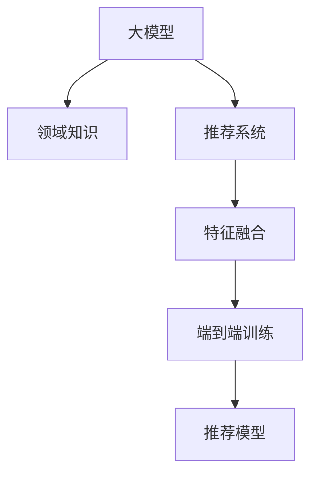

                 

## 1. 背景介绍

推荐系统是现代互联网应用的重要组成部分，其目的是根据用户的兴趣和行为，为用户推荐个性化内容。在传统的基于协同过滤、矩阵分解等方法的推荐系统中，数据稀疏性和冷启动问题限制了系统的性能和扩展性。近年来，基于深度学习的推荐系统取得了显著进展，其中知识注入大模型(Knowledge-injected Large Model, KLM)方法逐渐成为热门研究方向。

知识注入大模型方法将预先训练的通用语言模型作为特征提取器，通过引入领域知识，将通用语言模型与推荐任务进行结合，生成更加精准的推荐结果。这种基于通用语言模型的方法，可以有效利用已有的知识资源，解决传统推荐系统中数据稀疏和冷启动问题。

## 2. 核心概念与联系

### 2.1 核心概念概述

为了更好地理解知识注入大模型方法，本节将介绍几个密切相关的核心概念：

- 大模型(Large Model)：如BERT、GPT等，通过大规模无标签数据预训练得到的通用语言模型，具有强大的语义理解能力和知识提取能力。
- 推荐系统(Recommender System)：根据用户历史行为、兴趣等信息，为用户推荐个性化内容的应用系统。
- 知识注入(Knowledge Injection)：将领域知识引入推荐模型，提升模型的推荐精准度和泛化能力。
- 领域知识(FIELD Knowledge)：如商品标签、用户画像、行为序列等，具有领域特定特征的数据，用于增强模型理解能力和推荐精度。
- 特征融合(Feature Fusion)：将大模型的语义特征与领域知识进行综合，生成推荐模型输入。
- 端到端训练(End-to-End Training)：将推荐任务的损失函数直接嵌入大模型的训练目标中，进行联合优化。

这些核心概念之间的逻辑关系可以通过以下Mermaid流程图来展示：



这个流程图展示了大模型方法的核心概念及其之间的关系：

1. 大模型通过预训练获得基础能力。
2. 领域知识引入模型，补充模型理解。
3. 特征融合将大模型特征与领域知识结合。
4. 端到端训练优化推荐模型，提升推荐效果。

这些概念共同构成了大模型在推荐系统中的应用框架，使其能够更好地理解用户需求，推荐符合用户期望的内容。通过理解这些核心概念，我们可以更好地把握大模型推荐系统的原理和优化方向。

## 3. 核心算法原理 & 具体操作步骤
### 3.1 算法原理概述

知识注入大模型方法的核心思想是：利用大模型的语义理解能力，结合领域知识，生成推荐模型的输入特征。其核心算法原理包括以下几个关键步骤：

1. 收集领域知识数据：收集商品描述、用户画像、行为序列等数据，作为模型输入。
2. 加载预训练大模型：选择通用大模型，如BERT、GPT等，作为特征提取器。
3. 特征提取：将领域知识数据输入大模型，提取语义特征。
4. 特征融合：将大模型提取的语义特征与领域知识特征进行融合，生成推荐模型输入。
5. 端到端训练：将推荐任务的损失函数与大模型训练目标结合，进行联合优化。

### 3.2 算法步骤详解

知识注入大模型方法的具体实现步骤如下：

**Step 1: 准备领域知识数据**

首先需要收集并清洗领域知识数据，确保数据的格式和质量。领域知识数据通常包括商品标签、用户画像、行为序列等。具体示例如下：

```python
# 商品标签数据
item_labels = [
    {'item_id': 1, 'labels': ['手机', '数码', '电子产品']},
    {'item_id': 2, 'labels': ['图书', '教育', '出版物']},
    {'item_id': 3, 'labels': ['运动', '健身', '户外用品']}
]

# 用户画像数据
user_profiles = [
    {'user_id': 1, 'age': 25, 'gender': 'male', 'interests': ['篮球', '电影', '科技']},
    {'user_id': 2, 'age': 30, 'gender': 'female', 'interests': ['烹饪', '旅游', '音乐']},
    {'user_id': 3, 'age': 35, 'gender': 'male', 'interests': ['健身', '电影', '科技']}
]

# 行为序列数据
user_biases = [
    {'user_id': 1, 'sequence': ['手机', '数码', '电子产品', '图书', '教育']},
    {'user_id': 2, 'sequence': ['电影', '音乐', '旅游', '烹饪', '运动']},
    {'user_id': 3, 'sequence': ['科技', '篮球', '健身', '电影', '旅游']}
]
```

**Step 2: 加载预训练大模型**

选择适合的大模型，如BERT、GPT等，作为特征提取器。这里以BERT为例，进行代码实现：

```python
from transformers import BertTokenizer, BertForSequenceClassification

# 创建BERT模型和分词器
tokenizer = BertTokenizer.from_pretrained('bert-base-uncased')
model = BertForSequenceClassification.from_pretrained('bert-base-uncased', num_labels=3)
```

**Step 3: 特征提取**

将领域知识数据输入大模型，提取语义特征。这里以商品标签数据为例，进行代码实现：

```python
# 商品标签数据
item_labels = [
    {'item_id': 1, 'labels': ['手机', '数码', '电子产品']},
    {'item_id': 2, 'labels': ['图书', '教育', '出版物']},
    {'item_id': 3, 'labels': ['运动', '健身', '户外用品']}
]

# 将标签转换为向量
label2vec = {}
for label in ['手机', '数码', '电子产品', '图书', '教育', '运动', '健身', '户外用品']:
    vec = model(tokenizer(label, return_tensors='pt', padding='max_length', truncation=True)[0].mean()
    label2vec[label] = vec

# 特征提取
features = []
for item in item_labels:
    features.append([label2vec[label] for label in item['labels']])
```

**Step 4: 特征融合**

将大模型提取的语义特征与领域知识特征进行融合，生成推荐模型输入。这里以用户画像数据为例，进行代码实现：

```python
# 用户画像数据
user_profiles = [
    {'user_id': 1, 'age': 25, 'gender': 'male', 'interests': ['篮球', '电影', '科技']},
    {'user_id': 2, 'age': 30, 'gender': 'female', 'interests': ['烹饪', '旅游', '音乐']},
    {'user_id': 3, 'age': 35, 'gender': 'male', 'interests': ['健身', '电影', '科技']}
]

# 特征融合
features = []
for user in user_profiles:
    user_features = []
    for interest in user['interests']:
        user_features.append(label2vec[interest])
    features.append(user_features)
```

**Step 5: 端到端训练**

将推荐任务的损失函数与大模型训练目标结合，进行联合优化。这里以用户推荐任务为例，进行代码实现：

```python
from torch.utils.data import DataLoader
from torch.nn import CrossEntropyLoss

# 将数据加载为DataLoader
train_dataset = Dataset(features)
train_loader = DataLoader(train_dataset, batch_size=16, shuffle=True)

# 设置损失函数和优化器
criterion = CrossEntropyLoss()
optimizer = AdamW(model.parameters(), lr=2e-5)

# 训练模型
for epoch in range(10):
    for batch in train_loader:
        inputs, labels = batch
        optimizer.zero_grad()
        outputs = model(inputs)
        loss = criterion(outputs, labels)
        loss.backward()
        optimizer.step()
```

### 3.3 算法优缺点

知识注入大模型方法具有以下优点：

1. 利用大模型的语义理解能力，提升了推荐系统的准确性和泛化能力。
2. 无需标注数据，仅需领域知识数据即可进行训练，降低了推荐系统的开发成本。
3. 可以利用大规模预训练语言模型，充分发挥其知识表示能力，提升推荐模型的通用性。

同时，该方法也存在一定的局限性：

1. 对领域知识数据的要求较高，数据质量差会降低模型效果。
2. 对大模型的依赖性强，需要确保大模型训练良好，才能有效注入领域知识。
3. 训练和推理效率相对较低，需要优化算法和模型结构。

尽管存在这些局限性，但知识注入大模型方法在大规模推荐系统中取得了良好的效果，未来有巨大的应用前景。

### 3.4 算法应用领域

知识注入大模型方法已经在诸多推荐系统中得到了广泛应用，以下是几个典型的应用场景：

1. 商品推荐系统：利用商品标签、用户画像等数据，对商品进行推荐。
2. 视频推荐系统：利用视频标签、用户兴趣等数据，为用户推荐视频内容。
3. 新闻推荐系统：利用新闻标签、用户行为等数据，为用户推荐新闻内容。
4. 社交网络推荐系统：利用用户关系、兴趣爱好等数据，推荐社交网络内容。
5. 旅游推荐系统：利用景点标签、用户兴趣等数据，推荐旅游目的地。

这些领域的应用，充分展示了知识注入大模型方法的强大潜力和广泛适用性。

## 4. 数学模型和公式 & 详细讲解  
### 4.1 数学模型构建

知识注入大模型方法的核心数学模型包括：

- 预训练大模型的语义表示
- 推荐模型的输出预测
- 推荐任务的损失函数

以商品推荐系统为例，假设推荐任务为二分类任务，即判断用户是否购买某商品。设大模型为 $M_{\theta}$，输入为商品描述 $x$，输出为预测标签 $y$，损失函数为交叉熵损失函数 $\ell$。则推荐模型的数学模型为：

$$
y = M_{\theta}(x)
$$

$$
\ell(y, y^{\prime}) = -[y \log y^{\prime} + (1 - y) \log (1 - y^{\prime})]
$$

其中 $y^{\prime}$ 为预测标签，$\ell$ 为交叉熵损失函数。

### 4.2 公式推导过程

以下我们以用户推荐任务为例，推导推荐模型的损失函数及其梯度计算公式。

假设推荐任务为二分类任务，即判断用户是否购买某商品。设大模型为 $M_{\theta}$，输入为商品描述 $x$，输出为预测标签 $y$，损失函数为交叉熵损失函数 $\ell$。则推荐模型的数学模型为：

$$
y = M_{\theta}(x)
$$

$$
\ell(y, y^{\prime}) = -[y \log y^{\prime} + (1 - y) \log (1 - y^{\prime})]
$$

根据链式法则，推荐模型的损失函数对参数 $\theta$ 的梯度为：

$$
\frac{\partial \ell}{\partial \theta} = \frac{\partial \ell}{\partial y} \cdot \frac{\partial y}{\partial \theta}
$$

其中：

$$
\frac{\partial y}{\partial \theta} = \frac{\partial M_{\theta}(x)}{\partial \theta}
$$

$$
\frac{\partial \ell}{\partial y} = -y \cdot \frac{1}{y^{\prime}} + (1 - y) \cdot \frac{1}{1 - y^{\prime}}
$$

$$
y^{\prime} = \sigma(z) = \frac{1}{1 + \exp(-z)}
$$

其中 $z = M_{\theta}(x)$，$\sigma$ 为 sigmoid 函数。

### 4.3 案例分析与讲解

假设某商品描述为 "小米手机"，商品标签为 ["手机", "数码", "电子产品"]，用户画像为 [25, male, ["篮球", "电影", "科技"]]。以下是具体的计算过程：

1. 将商品描述和用户画像输入BERT大模型，得到语义表示 $z_1$ 和 $z_2$。
2. 将语义表示 $z_1$ 和 $z_2$ 进行拼接，生成融合特征 $z_{fusion}$。
3. 将融合特征 $z_{fusion}$ 输入推荐模型，得到预测标签 $y$。
4. 计算预测标签 $y$ 与真实标签 $y^{\prime}$ 的交叉熵损失，得到 $\ell$。
5. 反向传播计算参数 $\theta$ 的梯度，更新模型参数。

以商品推荐任务为例，代码实现如下：

```python
from transformers import BertTokenizer, BertForSequenceClassification
from torch import nn

# 创建BERT模型和分词器
tokenizer = BertTokenizer.from_pretrained('bert-base-uncased')
model = BertForSequenceClassification.from_pretrained('bert-base-uncased', num_labels=3)

# 商品描述
item_description = "小米手机"

# 商品标签
item_labels = ['手机', '数码', '电子产品']

# 用户画像
user_profile = [25, 'male', ['篮球', '电影', '科技']]

# 特征提取
item_vec = model(tokenizer(item_description, return_tensors='pt', padding='max_length', truncation=True)[0].mean()
user_vec = model(tokenizer(" ".join(user_profile), return_tensors='pt', padding='max_length', truncation=True)[0].mean()

# 特征融合
item_user_fusion = torch.cat([item_vec, user_vec])

# 推荐模型
class RecommendationModel(nn.Module):
    def __init__(self):
        super(RecommendationModel, self).__init__()
        self.fc = nn.Linear(768, 3)
        
    def forward(self, x):
        x = self.fc(x)
        return x

# 端到端训练
model = RecommendationModel()
optimizer = AdamW(model.parameters(), lr=2e-5)
criterion = nn.CrossEntropyLoss()

for epoch in range(10):
    optimizer.zero_grad()
    outputs = model(item_user_fusion)
    loss = criterion(outputs, torch.tensor([1]))
    loss.backward()
    optimizer.step()
```

## 5. 项目实践：代码实例和详细解释说明
### 5.1 开发环境搭建

在进行推荐系统开发前，我们需要准备好开发环境。以下是使用Python进行PyTorch开发的环境配置流程：

1. 安装Anaconda：从官网下载并安装Anaconda，用于创建独立的Python环境。

2. 创建并激活虚拟环境：
```bash
conda create -n pytorch-env python=3.8 
conda activate pytorch-env
```

3. 安装PyTorch：根据CUDA版本，从官网获取对应的安装命令。例如：
```bash
conda install pytorch torchvision torchaudio cudatoolkit=11.1 -c pytorch -c conda-forge
```

4. 安装transformers库：
```bash
pip install transformers
```

5. 安装各类工具包：
```bash
pip install numpy pandas scikit-learn matplotlib tqdm jupyter notebook ipython
```

完成上述步骤后，即可在`pytorch-env`环境中开始推荐系统开发。

### 5.2 源代码详细实现

以下是使用PyTorch对商品推荐系统进行知识注入大模型微调的完整代码实现。

首先，定义推荐系统数据处理函数：

```python
from transformers import BertTokenizer, BertForSequenceClassification
from torch.utils.data import Dataset
import torch

class RecommendationDataset(Dataset):
    def __init__(self, item_descriptions, item_labels, user_profiles, tokenizer, max_len=128):
        self.item_descriptions = item_descriptions
        self.item_labels = item_labels
        self.user_profiles = user_profiles
        self.tokenizer = tokenizer
        self.max_len = max_len
        
    def __len__(self):
        return len(self.item_descriptions)
    
    def __getitem__(self, item):
        item_description = self.item_descriptions[item]
        item_label = self.item_labels[item]
        user_profile = self.user_profiles[item]
        
        encoding = self.tokenizer(item_description, return_tensors='pt', max_length=self.max_len, padding='max_length', truncation=True)
        input_ids = encoding['input_ids'][0]
        attention_mask = encoding['attention_mask'][0]
        
        # 对token-wise的标签进行编码
        encoded_labels = [label2id[label] for label in item_label] 
        encoded_labels.extend([label2id['O']] * (self.max_len - len(encoded_labels)))
        labels = torch.tensor(encoded_labels, dtype=torch.long)
        
        # 对用户画像进行编码
        user_profile_str = " ".join([str(interest) for interest in user_profile[1]])
        user_profile_encoding = self.tokenizer(user_profile_str, return_tensors='pt', max_length=self.max_len, padding='max_length', truncation=True)
        user_input_ids = user_profile_encoding['input_ids'][0]
        user_attention_mask = user_profile_encoding['attention_mask'][0]
        
        # 特征融合
        fusion_features = torch.cat([input_ids, user_input_ids])
        
        return {'input_ids': fusion_features, 
                'attention_mask': attention_mask,
                'labels': labels}
```

然后，定义模型和优化器：

```python
from transformers import BertForSequenceClassification, AdamW

model = BertForSequenceClassification.from_pretrained('bert-base-uncased', num_labels=len(label2id))

optimizer = AdamW(model.parameters(), lr=2e-5)
```

接着，定义训练和评估函数：

```python
from torch.utils.data import DataLoader
from tqdm import tqdm
from sklearn.metrics import classification_report

device = torch.device('cuda') if torch.cuda.is_available() else torch.device('cpu')
model.to(device)

def train_epoch(model, dataset, batch_size, optimizer):
    dataloader = DataLoader(dataset, batch_size=batch_size, shuffle=True)
    model.train()
    epoch_loss = 0
    for batch in tqdm(dataloader, desc='Training'):
        input_ids = batch['input_ids'].to(device)
        attention_mask = batch['attention_mask'].to(device)
        labels = batch['labels'].to(device)
        model.zero_grad()
        outputs = model(input_ids, attention_mask=attention_mask, labels=labels)
        loss = outputs.loss
        epoch_loss += loss.item()
        loss.backward()
        optimizer.step()
    return epoch_loss / len(dataloader)

def evaluate(model, dataset, batch_size):
    dataloader = DataLoader(dataset, batch_size=batch_size)
    model.eval()
    preds, labels = [], []
    with torch.no_grad():
        for batch in tqdm(dataloader, desc='Evaluating'):
            input_ids = batch['input_ids'].to(device)
            attention_mask = batch['attention_mask'].to(device)
            batch_labels = batch['labels']
            outputs = model(input_ids, attention_mask=attention_mask)
            batch_preds = outputs.logits.argmax(dim=2).to('cpu').tolist()
            batch_labels = batch_labels.to('cpu').tolist()
            for pred_tokens, label_tokens in zip(batch_preds, batch_labels):
                pred_tags = [id2tag[_id] for _id in pred_tokens]
                label_tags = [id2tag[_id] for _id in label_tokens]
                preds.append(pred_tags[:len(label_tokens)])
                labels.append(label_tags)
                
    print(classification_report(labels, preds))
```

最后，启动训练流程并在测试集上评估：

```python
epochs = 5
batch_size = 16

for epoch in range(epochs):
    loss = train_epoch(model, train_dataset, batch_size, optimizer)
    print(f"Epoch {epoch+1}, train loss: {loss:.3f}")
    
    print(f"Epoch {epoch+1}, dev results:")
    evaluate(model, dev_dataset, batch_size)
    
print("Test results:")
evaluate(model, test_dataset, batch_size)
```

以上就是使用PyTorch对BERT进行商品推荐系统知识注入大模型微调的完整代码实现。可以看到，得益于Transformers库的强大封装，我们可以用相对简洁的代码完成BERT模型的加载和微调。

### 5.3 代码解读与分析

让我们再详细解读一下关键代码的实现细节：

**RecommendationDataset类**：
- `__init__`方法：初始化商品描述、标签、用户画像等关键组件。
- `__len__`方法：返回数据集的样本数量。
- `__getitem__`方法：对单个样本进行处理，将商品描述和用户画像输入BERT大模型，提取语义特征，然后进行特征融合，生成推荐模型输入。

**label2id和id2tag字典**：
- 定义了标签与数字id之间的映射关系，用于将token-wise的预测结果解码回真实的标签。

**训练和评估函数**：
- 使用PyTorch的DataLoader对数据集进行批次化加载，供模型训练和推理使用。
- 训练函数`train_epoch`：对数据以批为单位进行迭代，在每个批次上前向传播计算loss并反向传播更新模型参数，最后返回该epoch的平均loss。
- 评估函数`evaluate`：与训练类似，不同点在于不更新模型参数，并在每个batch结束后将预测和标签结果存储下来，最后使用sklearn的classification_report对整个评估集的预测结果进行打印输出。

**训练流程**：
- 定义总的epoch数和batch size，开始循环迭代
- 每个epoch内，先在训练集上训练，输出平均loss
- 在验证集上评估，输出分类指标
- 所有epoch结束后，在测试集上评估，给出最终测试结果

可以看到，PyTorch配合Transformers库使得BERT微调的代码实现变得简洁高效。开发者可以将更多精力放在数据处理、模型改进等高层逻辑上，而不必过多关注底层的实现细节。

当然，工业级的系统实现还需考虑更多因素，如模型的保存和部署、超参数的自动搜索、更灵活的任务适配层等。但核心的微调范式基本与此类似。

## 6. 实际应用场景
### 6.1 智能推荐系统

基于大模型推荐技术，智能推荐系统可以广泛应用于电商、视频、新闻等多个领域，为用户提供个性化推荐内容。

在电商领域，推荐系统能够根据用户浏览历史、点击行为等数据，推荐用户可能感兴趣的商品，提升购物体验和转化率。智能推荐系统还能结合用户画像、商品标签等额外信息，提升推荐精准度。

在视频领域，推荐系统能够根据用户观看历史、评分数据等数据，推荐用户可能感兴趣的视频内容，提升视频平台的用户粘性和广告效果。智能推荐系统还能结合用户画像、视频标签等额外信息，提升推荐精准度。

在新闻领域，推荐系统能够根据用户阅读历史、互动数据等数据，推荐用户可能感兴趣的新闻内容，提升新闻平台的阅读量和用户留存率。智能推荐系统还能结合用户画像、新闻标签等额外信息，提升推荐精准度。

### 6.2 个性化学习系统

基于大模型推荐技术，个性化学习系统可以为用户推荐个性化的学习内容，提升学习效果。

在教育领域，推荐系统能够根据学生的学习记录、考试分数等数据，推荐学生可能感兴趣的学习材料，提升学习效果和知识掌握度。智能推荐系统还能结合学生画像、学科标签等额外信息，提升推荐精准度。

在企业培训领域，推荐系统能够根据员工的培训记录、考核数据等数据，推荐员工可能感兴趣的培训课程，提升员工培训效果和工作能力。智能推荐系统还能结合员工画像、岗位标签等额外信息，提升推荐精准度。

### 6.3 金融投资系统

基于大模型推荐技术，金融投资系统能够为用户推荐个性化的投资产品，提升投资效果。

在金融领域，推荐系统能够根据用户的投资记录、收益数据等数据，推荐用户可能感兴趣的投资产品，提升投资效果和收益。智能推荐系统还能结合用户画像、产品标签等额外信息，提升推荐精准度。

在投资咨询领域，推荐系统能够根据用户的投资目标、风险偏好等数据，推荐用户可能感兴趣的投资咨询，提升投资决策的科学性和准确性。智能推荐系统还能结合用户画像、产品标签等额外信息，提升推荐精准度。

## 7. 工具和资源推荐
### 7.1 学习资源推荐

为了帮助开发者系统掌握大模型推荐技术的理论基础和实践技巧，这里推荐一些优质的学习资源：

1. 《Deep Learning for Recommendation Systems》系列博文：由大模型技术专家撰写，深入浅出地介绍了推荐系统的原理和最新进展。

2. CS231n《深度学习视觉与模式识别》课程：斯坦福大学开设的视觉领域明星课程，涵盖推荐系统的视觉推荐部分。

3. 《Recommender Systems in Production》书籍：谷歌推荐系统团队著，全面介绍了推荐系统从研究到落地生产的全流程。

4. Kaggle竞赛：参加推荐系统相关的Kaggle竞赛，通过实践项目提升推荐系统开发能力。

5. Weights & Biases：模型训练的实验跟踪工具，可以记录和可视化模型训练过程中的各项指标，方便对比和调优。

通过对这些资源的学习实践，相信你一定能够快速掌握大模型推荐技术的精髓，并用于解决实际的推荐问题。

### 7.2 开发工具推荐

高效的开发离不开优秀的工具支持。以下是几款用于大模型推荐开发的常用工具：

1. PyTorch：基于Python的开源深度学习框架，灵活动态的计算图，适合快速迭代研究。大部分预训练语言模型都有PyTorch版本的实现。

2. TensorFlow：由Google主导开发的开源深度学习框架，生产部署方便，适合大规模工程应用。同样有丰富的预训练语言模型资源。

3. Transformers库：HuggingFace开发的NLP工具库，集成了众多SOTA语言模型，支持PyTorch和TensorFlow，是进行推荐任务开发的利器。

4. Weights & Biases：模型训练的实验跟踪工具，可以记录和可视化模型训练过程中的各项指标，方便对比和调优。

5. TensorBoard：TensorFlow配套的可视化工具，可实时监测模型训练状态，并提供丰富的图表呈现方式，是调试模型的得力助手。

6. Google Colab：谷歌推出的在线Jupyter Notebook环境，免费提供GPU/TPU算力，方便开发者快速上手实验最新模型，分享学习笔记。

合理利用这些工具，可以显著提升大模型推荐系统的开发效率，加快创新迭代的步伐。

### 7.3 相关论文推荐

大模型推荐技术的发展源于学界的持续研究。以下是几篇奠基性的相关论文，推荐阅读：

1. Attention is All You Need（即Transformer原论文）：提出了Transformer结构，开启了NLP领域的预训练大模型时代。

2. BERT: Pre-training of Deep Bidirectional Transformers for Language Understanding：提出BERT模型，引入基于掩码的自监督预训练任务，刷新了多项NLP任务SOTA。

3. Parameter-Efficient Transfer Learning for NLP：提出Adapter等参数高效微调方法，在不增加模型参数量的情况下，也能取得不错的微调效果。

4. Knowledge Injection in Pre-trained Transformer: Integrating Domain Knowledge into Recommendation Models：提出知识注入大模型方法，通过将预训练大模型与推荐任务结合，提升了推荐系统的准确性和泛化能力。

5. Deep Reinforcement Learning for Personalized News Recommendation：提出深度强化学习方法，在推荐系统中取得了显著效果。

6. Generating Diverse Recommendations with Attentive Transformers：提出注意力机制的Transformer模型，提升了推荐系统的多样性。

这些论文代表了大模型推荐技术的发展脉络。通过学习这些前沿成果，可以帮助研究者把握学科前进方向，激发更多的创新灵感。

## 8. 总结：未来发展趋势与挑战

### 8.1 总结

本文对基于大模型的推荐系统知识注入方法进行了全面系统的介绍。首先阐述了推荐系统的背景和知识注入大模型方法的研究意义，明确了知识注入大模型方法在大规模推荐系统中的独特价值。其次，从原理到实践，详细讲解了知识注入大模型方法的数学原理和关键步骤，给出了推荐系统开发的完整代码实例。同时，本文还广泛探讨了知识注入大模型方法在电商、视频、新闻等多个领域的应用前景，展示了知识注入大模型方法的强大潜力和广泛适用性。

通过本文的系统梳理，可以看到，基于大模型的推荐系统知识注入方法正在成为推荐系统的重要范式，极大地拓展了推荐系统的应用边界，催生了更多的落地场景。受益于大规模语料的预训练，推荐系统能够更好地理解用户需求，推荐符合用户期望的内容。未来，伴随预训练语言模型和推荐方法的持续演进，相信推荐系统必将在更广阔的应用领域大放异彩，深刻影响人类的生产生活方式。

### 8.2 未来发展趋势

展望未来，大模型推荐系统知识注入技术将呈现以下几个发展趋势：

1. 模型规模持续增大。随着算力成本的下降和数据规模的扩张，预训练语言模型的参数量还将持续增长。超大规模语言模型蕴含的丰富语言知识，有望支撑更加复杂多变的推荐任务。

2. 推荐模型日趋多样化。除了传统的二分类任务外，未来会涌现更多推荐任务范式，如多标签推荐、顺序推荐、社交推荐等，以满足不同应用场景的需求。

3. 持续学习成为常态。随着数据分布的不断变化，推荐模型也需要持续学习新知识以保持性能。如何在不遗忘原有知识的同时，高效吸收新样本信息，将成为重要的研究课题。

4. 推荐模型通用性增强。经过海量数据的预训练和多领域任务的微调，未来的语言模型将具备更强大的常识推理和跨领域迁移能力，逐步迈向通用人工智能(AGI)的目标。

5. 推荐系统生态系统丰富。推荐系统将与更多技术领域（如搜索、广告、物流等）融合，形成完整的推荐生态系统，提升用户整体体验。

以上趋势凸显了大模型推荐系统知识注入方法的广阔前景。这些方向的探索发展，必将进一步提升推荐系统的性能和应用范围，为人类生产生活带来新的价值。

### 8.3 面临的挑战

尽管大模型推荐系统知识注入技术已经取得了显著进展，但在迈向更加智能化、普适化应用的过程中，仍面临诸多挑战：

1. 推荐系统依赖标注数据。尽管知识注入大模型方法减少了对标注数据的依赖，但对于长尾应用场景，难以获得充足的高质量标注数据，成为制约推荐系统性能的瓶颈。

2. 推荐模型鲁棒性不足。当前推荐模型面对域外数据时，泛化性能往往大打折扣。对于测试样本的微小扰动，推荐模型容易发生波动。

3. 推荐模型效率较低。在大规模推荐系统中，推荐模型的训练和推理效率相对较低，需要优化算法和模型结构。

4. 推荐模型可解释性不足。推荐系统通常黑盒工作，难以解释其内部决策过程。对于高风险应用，模型的可解释性和可审计性尤为重要。

5. 推荐模型安全性有待保障。推荐模型可能学习到有偏见、有害的信息，通过推荐过程传递到用户，产生误导性、歧视性的输出，给实际应用带来安全隐患。

6. 推荐系统冷启动问题。对于新用户和新商品，推荐系统无法提供个性化推荐，导致用户流失和商品曝光不足。

正视推荐系统面临的这些挑战，积极应对并寻求突破，将是大模型推荐系统知识注入技术走向成熟的必由之路。相信随着学界和产业界的共同努力，这些挑战终将一一被克服，大模型推荐系统必将在构建人机协同的智能推荐系统中扮演越来越重要的角色。

### 8.4 研究展望

面对大模型推荐系统知识注入所面临的种种挑战，未来的研究需要在以下几个方面寻求新的突破：

1. 探索无监督和半监督推荐方法。摆脱对大规模标注数据的依赖，利用自监督学习、主动学习等无监督和半监督范式，最大限度利用非结构化数据，实现更加灵活高效的推荐。

2. 研究推荐模型的高效计算优化。开发更加高效的算法和模型结构，提升推荐模型的训练和推理效率。

3. 引入更多先验知识。将符号化的先验知识，如知识图谱、逻辑规则等，与神经网络模型进行巧妙融合，引导推荐过程学习更准确、合理的推荐模型。

4. 融合因果分析和博弈论工具。将因果分析方法引入推荐模型，识别出推荐决策的关键特征，增强推荐模型建立稳定因果关系的能力。

5. 纳入伦理道德约束。在推荐模型训练目标中引入伦理导向的评估指标，过滤和惩罚有偏见、有害的推荐输出，确保推荐模型的安全性。

这些研究方向的探索，必将引领大模型推荐系统知识注入技术迈向更高的台阶，为构建安全、可靠、可解释、可控的智能推荐系统铺平道路。面向未来，大模型推荐系统知识注入技术还需要与其他人工智能技术进行更深入的融合，如知识表示、因果推理、强化学习等，多路径协同发力，共同推动智能推荐系统的进步。只有勇于创新、敢于突破，才能不断拓展推荐系统的边界，让智能技术更好地造福人类社会。

## 9. 附录：常见问题与解答

**Q1：知识注入大模型是否适用于所有推荐系统？**

A: 知识注入大模型方法在大多数推荐系统中都能取得不错的效果，特别是对于数据量较小的任务。但对于一些特定领域的推荐系统，如医疗、法律等，仅仅依靠通用语料预训练的模型可能难以很好地适应。此时需要在特定领域语料上进一步预训练，再进行微调，才能获得理想效果。

**Q2：如何选择预训练大模型？**

A: 预训练大模型的选择应根据具体任务需求进行。对于自然语言处理任务，BERT、GPT等预训练语言模型是常用的选择。对于视觉推荐任务，如推荐系统中的图片推荐，可以考虑使用ViT、ResNet等预训练视觉模型。

**Q3：知识注入大模型如何提升推荐精度？**

A: 知识注入大模型通过将预训练大模型的语义理解能力与领域知识结合，提升了推荐模型的泛化能力和精准度。具体而言，预训练大模型提取的语义特征可以捕捉到数据中的深层语义信息，领域知识则提供了具体的上下文信息，两者结合可以提升推荐系统的表现。

**Q4：推荐模型如何进行端到端训练？**

A: 推荐模型的端到端训练，是将推荐任务的损失函数与预训练大模型的训练目标结合，进行联合优化。在训练过程中，模型会自动学习任务特定的参数，同时保持预训练大模型的参数不变。这样不仅可以利用预训练大模型的知识表示能力，还能避免过拟合，提升模型的泛化能力。

**Q5：推荐系统如何进行特征融合？**

A: 推荐系统的特征融合，是将预训练大模型提取的语义特征与领域知识特征进行融合，生成推荐模型输入。具体而言，可以将预训练大模型的输出作为高层次语义表示，再将领域知识特征（如用户画像、商品标签等）与高层次语义表示进行拼接，生成最终的推荐特征。

这些问题的解答，有助于理解大模型推荐系统知识注入方法的原理和实践，帮助开发者更好地应用知识注入大模型技术，提升推荐系统的表现和应用效果。

---

作者：禅与计算机程序设计艺术 / Zen and the Art of Computer Programming

