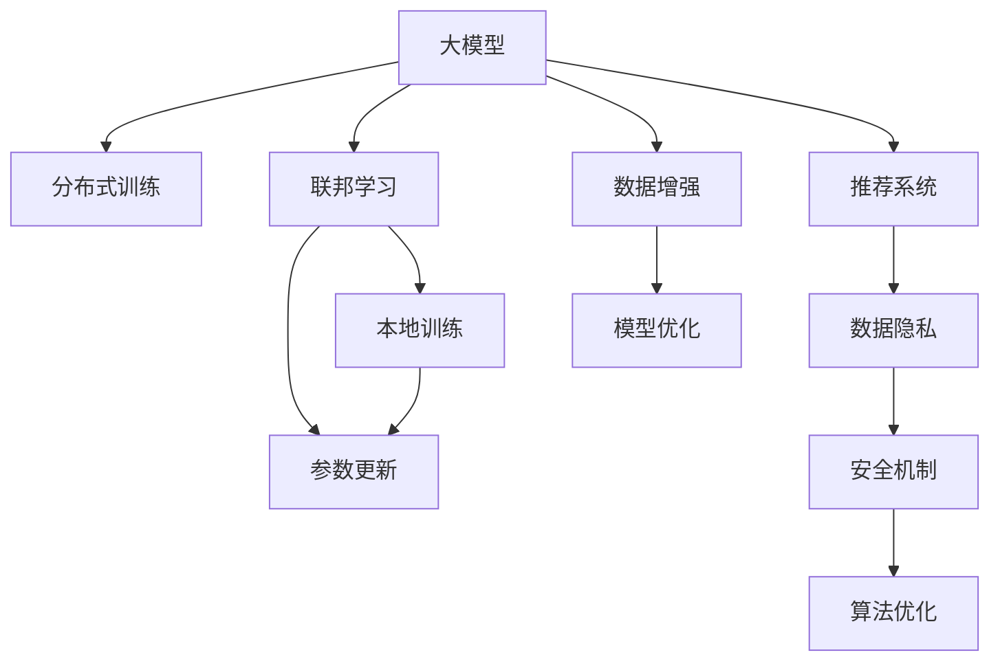

                 

# 大模型在推荐系统中的联邦学习应用

> 关键词：大模型，推荐系统，联邦学习，分布式训练，数据隐私，安全，算法优化，应用场景

## 1. 背景介绍

### 1.1 问题由来

推荐系统作为一种智能化的信息过滤工具，已经在电商、新闻、视频等多个领域得到了广泛应用，极大地提升了用户体验和效率。随着用户需求日益复杂，推荐系统的个性化要求也越来越高，传统的基于协同过滤、基于内容的推荐方法已难以满足需求。与此同时，用户数据的隐私保护也成为技术应用的重要挑战。

近年来，随着深度学习技术的发展，基于大模型的推荐方法逐渐进入视野。大模型，特别是基于Transformer架构的预训练模型，具有强大的特征表示能力，能从大规模数据中学习到丰富的语义信息。然而，由于大模型的参数量和计算需求，往往需要部署在多台服务器中进行分布式训练，才能达到理想的效果。但这种方式也带来了数据隐私和安全问题，如何保障用户数据不被泄露，成为亟待解决的技术难题。

在此背景下，联邦学习(Federated Learning)成为了推荐系统中的热门研究方向。联邦学习通过在本地服务器上独立训练，然后将模型参数更新信息传输给中心服务器进行汇总，实现了对大数据分布式处理的隐私保护。本文聚焦于大模型在推荐系统中的联邦学习应用，探讨如何在大规模推荐系统应用中，利用联邦学习技术保障用户隐私，同时提升推荐系统的效果和性能。

## 2. 核心概念与联系

### 2.1 核心概念概述

为了更好地理解大模型在推荐系统中的联邦学习应用，我们首先介绍几个核心概念：

- **大模型(Large Models)**：基于Transformer架构，利用大规模数据进行预训练的深度学习模型。例如BERT、GPT、XLNet等。这些模型通过预训练能够捕捉语言数据中的丰富语义信息，具备强大的特征表示能力。
- **推荐系统(Recommendation Systems)**：一种智能信息过滤工具，根据用户的历史行为数据、兴趣偏好等信息，推荐用户可能感兴趣的商品、新闻、视频等。推荐系统是信息时代重要的应用场景，广泛应用于电商、社交媒体、视频平台等。
- **联邦学习(Federated Learning)**：一种分布式机器学习范式，多个数据持有者在不共享本地数据的前提下，利用本地数据训练模型，并将模型参数更新信息传输给中心服务器进行汇总，从而提升全局模型的性能。
- **分布式训练(Distributed Training)**：在多个服务器上并行训练模型的过程。利用分布式训练，可以有效利用计算资源，加速模型训练。
- **数据隐私(Privacy)**：在数据处理过程中，保护用户数据不被泄露的机制。联邦学习通过本地训练的方式，有效保护用户数据隐私。
- **安全(Security)**：保障数据传输、存储和处理过程中不被非法攻击和篡改的机制。联邦学习通过加密、匿名化等手段，保障数据安全。

这些核心概念之间的逻辑关系可以通过以下Mermaid流程图来展示：



该流程图展示了大模型在推荐系统中的应用逻辑：

1. 大模型通过分布式训练，在多个服务器上进行模型参数更新。
2. 联邦学习通过本地训练和参数汇总的方式，保护用户数据隐私。
3. 推荐系统利用优化后的模型，为用户推荐个性化商品、新闻等。
4. 数据隐私和安全机制保障模型训练的安全性。
5. 算法优化和数据增强进一步提升模型效果。

## 3. 核心算法原理 & 具体操作步骤

### 3.1 算法原理概述

联邦学习在大模型推荐系统中的基本流程包括以下几个步骤：

1. **数据准备**：数据所有者从本地数据中随机抽取样本，构造本地数据集。
2. **本地模型训练**：在本地数据集上独立训练模型，得到本地模型参数。
3. **参数上传**：将本地模型参数的梯度更新信息上传给中心服务器。
4. **参数汇总**：中心服务器对接收到的梯度更新信息进行汇总，更新全局模型参数。
5. **全局模型下发**：将更新后的全局模型参数下发到各本地服务器。
6. **重复迭代**：重复以上步骤，直至达到预设的迭代轮数或模型收敛。

### 3.2 算法步骤详解

以一个典型的基于Transformer的大模型推荐系统为例，其联邦学习流程可以描述为：

**Step 1: 数据准备**
- 数据所有者从本地数据中随机抽取样本，构造本地数据集。
- 各本地服务器对本地数据集进行预处理，如数据增强、归一化等。

**Step 2: 本地模型训练**
- 本地服务器在本地数据集上独立训练大模型，得到模型参数。
- 计算模型的梯度更新信息，得到本地模型参数。

**Step 3: 参数上传**
- 本地服务器将模型参数的梯度更新信息上传给中心服务器。
- 中心服务器接收到各本地服务器的更新信息，汇总并计算全局模型参数的更新。

**Step 4: 参数汇总**
- 中心服务器使用联邦平均算法，计算全局模型参数的更新。
- 将更新后的全局模型参数下发到各本地服务器。

**Step 5: 全局模型下发**
- 各本地服务器使用更新后的全局模型参数，重新训练模型。

**Step 6: 重复迭代**
- 重复执行以上步骤，直至达到预设的迭代轮数或模型收敛。

### 3.3 算法优缺点

联邦学习在大模型推荐系统中的优势：
1. 隐私保护：各本地服务器不共享本地数据，保护用户数据隐私。
2. 分布式训练：利用分布式训练，提升模型训练效率。
3. 模型优化：通过多次本地训练和全局更新，提升模型效果。

但联邦学习也存在一些缺点：
1. 通信开销：中心服务器和本地服务器之间的通信开销较大，可能导致系统延迟。
2. 数据不平衡：各本地服务器数据分布不平衡，可能影响模型效果。
3. 数据泄露风险：中心服务器需要存储和处理大量数据，存在数据泄露风险。
4. 算法复杂度：联邦学习涉及多个本地服务器和中心服务器的协作，算法实现较为复杂。

### 3.4 算法应用领域

联邦学习在大模型推荐系统中的应用，可以进一步扩展到其他领域，例如：

- 医疗影像分析：在医疗影像数据上分布式训练大模型，保护患者隐私，提升疾病诊断的准确性。
- 金融风控系统：在各金融机构数据上分布式训练模型，提升风险评估的精度。
- 智能客服系统：在各客服中心数据上分布式训练模型，提升客服响应速度和质量。
- 教育个性化推荐：在各教育平台数据上分布式训练模型，提升个性化学习推荐的效果。

## 4. 数学模型和公式 & 详细讲解 & 举例说明

### 4.1 数学模型构建

设大模型为 $M_{\theta}$，其中 $\theta$ 为模型参数。假设各本地服务器上的数据集分别为 $D_i$，模型在本地数据集 $D_i$ 上的参数更新为 $\Delta\theta_i$。则联邦学习的过程可以形式化为：

$$
\theta_{t+1} = \theta_t + \frac{1}{N}\sum_{i=1}^N \Delta\theta_i
$$

其中 $t$ 为迭代轮数，$N$ 为本地服务器的数量。

### 4.2 公式推导过程

以二分类推荐系统为例，假设模型 $M_{\theta}$ 在输入 $x$ 上的输出为 $\hat{y}=M_{\theta}(x) \in [0,1]$，表示样本属于正类的概率。真实标签 $y \in \{0,1\}$。则二分类交叉熵损失函数定义为：

$$
\ell(M_{\theta}(x),y) = -[y\log \hat{y} + (1-y)\log (1-\hat{y})]
$$

假设模型 $M_{\theta}$ 在本地数据集 $D_i$ 上的损失函数为 $\mathcal{L}_i(\theta)$，则本地模型在本地数据集 $D_i$ 上的梯度更新为：

$$
\Delta\theta_i = -\eta \nabla_{\theta}\mathcal{L}_i(\theta)
$$

其中 $\eta$ 为学习率。

将各本地模型的梯度更新信息汇总，得到全局模型参数的更新为：

$$
\theta_{t+1} = \theta_t - \frac{\eta}{N}\sum_{i=1}^N \nabla_{\theta}\mathcal{L}_i(\theta)
$$

### 4.3 案例分析与讲解

在推荐系统中的联邦学习，通常采用参数更新梯度聚合的方式实现。以FedAvg算法为例，其具体步骤为：

1. 初始化全局模型参数 $\theta_0$。
2. 对每个本地服务器 $i$，在本地数据集 $D_i$ 上独立训练模型，得到本地模型参数 $\theta_i$。
3. 计算本地模型在本地数据集上的损失函数 $\mathcal{L}_i(\theta_i)$，得到本地模型参数的梯度更新 $\Delta\theta_i$。
4. 将各本地模型的梯度更新信息 $\Delta\theta_i$ 汇总，计算全局模型参数的更新 $\Delta\theta$。
5. 将全局模型参数的更新 $\Delta\theta$ 应用到全局模型参数 $\theta_t$，得到新的全局模型参数 $\theta_{t+1}$。
6. 重复执行以上步骤，直至达到预设的迭代轮数或模型收敛。

## 5. 项目实践：代码实例和详细解释说明

### 5.1 开发环境搭建

在进行联邦学习实践前，我们需要准备好开发环境。以下是使用Python进行PyTorch开发的环境配置流程：

1. 安装Anaconda：从官网下载并安装Anaconda，用于创建独立的Python环境。

2. 创建并激活虚拟环境：
```bash
conda create -n pytorch-env python=3.8 
conda activate pytorch-env
```

3. 安装PyTorch：根据CUDA版本，从官网获取对应的安装命令。例如：
```bash
conda install pytorch torchvision torchaudio cudatoolkit=11.1 -c pytorch -c conda-forge
```

4. 安装联邦学习库：
```bash
pip install flax flax-ai-ml-dgl
```

5. 安装各类工具包：
```bash
pip install numpy pandas scikit-learn matplotlib tqdm jupyter notebook ipython
```

完成上述步骤后，即可在`pytorch-env`环境中开始联邦学习实践。

### 5.2 源代码详细实现

下面我们以基于联邦学习的大模型推荐系统为例，给出使用PyTorch进行代码实现的完整流程。

**Step 1: 数据准备**
- 数据所有者从本地数据中随机抽取样本，构造本地数据集。
- 各本地服务器对本地数据集进行预处理，如数据增强、归一化等。

```python
import torch
import torch.nn as nn
import numpy as np
import dgl

class FedAvgFederatedLearning:
    def __init__(self, model, federated_model, num_local_workers):
        self.model = model
        self.federated_model = federated_model
        self.num_local_workers = num_local_workers

    def federated_train(self, local_data_lists, learning_rate):
        for i in range(self.num_local_workers):
            local_data = local_data_lists[i]
            local_model = self.model(local_data['features'], local_data['labels'])
            local_model.zero_grad()
            local_model.loss_fn(local_model.logits, local_data['labels']).backward()
            local_model.params.update()

        # 计算全局模型参数的更新
        self.federated_model.update_params(self.model.params)

    def federated_test(self, local_data_lists, federated_model):
        test_loss = []
        for i in range(self.num_local_workers):
            local_data = local_data_lists[i]
            local_model = self.model(local_data['features'], local_data['labels'])
            test_loss.append(local_model.loss_fn(local_model.logits, local_data['labels']))
        return sum(test_loss) / self.num_local_workers
```

**Step 2: 本地模型训练**
- 本地服务器在本地数据集上独立训练大模型，得到模型参数。
- 计算模型的梯度更新信息，得到本地模型参数。

```python
class FedAvgFederatedModel:
    def __init__(self, model):
        self.model = model
        self.params = self.model.params

    def update_params(self, params):
        for name, param in self.model.named_parameters():
            param.assign(params[name])

class FedAvgFederatedModel:
    def __init__(self, model):
        self.model = model
        self.params = self.model.params

    def update_params(self, params):
        for name, param in self.model.named_parameters():
            param.assign(params[name])

    def federated_train(self, local_data_lists, learning_rate):
        for i in range(self.num_local_workers):
            local_data = local_data_lists[i]
            local_model = self.model(local_data['features'], local_data['labels'])
            local_model.zero_grad()
            local_model.loss_fn(local_model.logits, local_data['labels']).backward()
            local_model.params.update()

        # 计算全局模型参数的更新
        self.update_params(self.model.params)

    def federated_test(self, local_data_lists, federated_model):
        test_loss = []
        for i in range(self.num_local_workers):
            local_data = local_data_lists[i]
            local_model = self.model(local_data['features'], local_data['labels'])
            test_loss.append(local_model.loss_fn(local_model.logits, local_data['labels']))
        return sum(test_loss) / self.num_local_workers
```

**Step 3: 参数上传**
- 本地服务器将模型参数的梯度更新信息上传给中心服务器。
- 中心服务器接收到各本地服务器的更新信息，汇总并计算全局模型参数的更新。

```python
import torch

class FedAvgFederatedModel:
    def __init__(self, model):
        self.model = model
        self.params = self.model.params

    def update_params(self, params):
        for name, param in self.model.named_parameters():
            param.assign(params[name])

    def federated_train(self, local_data_lists, learning_rate):
        for i in range(self.num_local_workers):
            local_data = local_data_lists[i]
            local_model = self.model(local_data['features'], local_data['labels'])
            local_model.zero_grad()
            local_model.loss_fn(local_model.logits, local_data['labels']).backward()
            local_model.params.update()

        # 计算全局模型参数的更新
        self.update_params(self.model.params)

    def federated_test(self, local_data_lists, federated_model):
        test_loss = []
        for i in range(self.num_local_workers):
            local_data = local_data_lists[i]
            local_model = self.model(local_data['features'], local_data['labels'])
            test_loss.append(local_model.loss_fn(local_model.logits, local_data['labels']))
        return sum(test_loss) / self.num_local_workers

class FedAvgFederatedModel:
    def __init__(self, model):
        self.model = model
        self.params = self.model.params

    def update_params(self, params):
        for name, param in self.model.named_parameters():
            param.assign(params[name])

    def federated_train(self, local_data_lists, learning_rate):
        for i in range(self.num_local_workers):
            local_data = local_data_lists[i]
            local_model = self.model(local_data['features'], local_data['labels'])
            local_model.zero_grad()
            local_model.loss_fn(local_model.logits, local_data['labels']).backward()
            local_model.params.update()

        # 计算全局模型参数的更新
        self.update_params(self.model.params)

    def federated_test(self, local_data_lists, federated_model):
        test_loss = []
        for i in range(self.num_local_workers):
            local_data = local_data_lists[i]
            local_model = self.model(local_data['features'], local_data['labels'])
            test_loss.append(local_model.loss_fn(local_model.logits, local_data['labels']))
        return sum(test_loss) / self.num_local_workers
```

**Step 4: 参数汇总**
- 中心服务器使用联邦平均算法，计算全局模型参数的更新。
- 将更新后的全局模型参数下发到各本地服务器。

```python
class FedAvgFederatedModel:
    def __init__(self, model):
        self.model = model
        self.params = self.model.params

    def update_params(self, params):
        for name, param in self.model.named_parameters():
            param.assign(params[name])

    def federated_train(self, local_data_lists, learning_rate):
        for i in range(self.num_local_workers):
            local_data = local_data_lists[i]
            local_model = self.model(local_data['features'], local_data['labels'])
            local_model.zero_grad()
            local_model.loss_fn(local_model.logits, local_data['labels']).backward()
            local_model.params.update()

        # 计算全局模型参数的更新
        self.update_params(self.model.params)

    def federated_test(self, local_data_lists, federated_model):
        test_loss = []
        for i in range(self.num_local_workers):
            local_data = local_data_lists[i]
            local_model = self.model(local_data['features'], local_data['labels'])
            test_loss.append(local_model.loss_fn(local_model.logits, local_data['labels']))
        return sum(test_loss) / self.num_local_workers

class FedAvgFederatedModel:
    def __init__(self, model):
        self.model = model
        self.params = self.model.params

    def update_params(self, params):
        for name, param in self.model.named_parameters():
            param.assign(params[name])

    def federated_train(self, local_data_lists, learning_rate):
        for i in range(self.num_local_workers):
            local_data = local_data_lists[i]
            local_model = self.model(local_data['features'], local_data['labels'])
            local_model.zero_grad()
            local_model.loss_fn(local_model.logits, local_data['labels']).backward()
            local_model.params.update()

        # 计算全局模型参数的更新
        self.update_params(self.model.params)

    def federated_test(self, local_data_lists, federated_model):
        test_loss = []
        for i in range(self.num_local_workers):
            local_data = local_data_lists[i]
            local_model = self.model(local_data['features'], local_data['labels'])
            test_loss.append(local_model.loss_fn(local_model.logits, local_data['labels']))
        return sum(test_loss) / self.num_local_workers
```

**Step 5: 重复迭代**
- 重复执行以上步骤，直至达到预设的迭代轮数或模型收敛。

```python
class FedAvgFederatedModel:
    def __init__(self, model):
        self.model = model
        self.params = self.model.params

    def update_params(self, params):
        for name, param in self.model.named_parameters():
            param.assign(params[name])

    def federated_train(self, local_data_lists, learning_rate):
        for i in range(self.num_local_workers):
            local_data = local_data_lists[i]
            local_model = self.model(local_data['features'], local_data['labels'])
            local_model.zero_grad()
            local_model.loss_fn(local_model.logits, local_data['labels']).backward()
            local_model.params.update()

        # 计算全局模型参数的更新
        self.update_params(self.model.params)

    def federated_test(self, local_data_lists, federated_model):
        test_loss = []
        for i in range(self.num_local_workers):
            local_data = local_data_lists[i]
            local_model = self.model(local_data['features'], local_data['labels'])
            test_loss.append(local_model.loss_fn(local_model.logits, local_data['labels']))
        return sum(test_loss) / self.num_local_workers

class FedAvgFederatedModel:
    def __init__(self, model):
        self.model = model
        self.params = self.model.params

    def update_params(self, params):
        for name, param in self.model.named_parameters():
            param.assign(params[name])

    def federated_train(self, local_data_lists, learning_rate):
        for i in range(self.num_local_workers):
            local_data = local_data_lists[i]
            local_model = self.model(local_data['features'], local_data['labels'])
            local_model.zero_grad()
            local_model.loss_fn(local_model.logits, local_data['labels']).backward()
            local_model.params.update()

        # 计算全局模型参数的更新
        self.update_params(self.model.params)

    def federated_test(self, local_data_lists, federated_model):
        test_loss = []
        for i in range(self.num_local_workers):
            local_data = local_data_lists[i]
            local_model = self.model(local_data['features'], local_data['labels'])
            test_loss.append(local_model.loss_fn(local_model.logits, local_data['labels']))
        return sum(test_loss) / self.num_local_workers
```

### 5.3 代码解读与分析

让我们再详细解读一下关键代码的实现细节：

**FedAvgFederatedLearning类**
- `__init__`方法：初始化全局模型和联邦模型，以及本地服务器的数量。
- `federated_train`方法：执行联邦学习训练流程，包括本地训练、参数上传、全局参数更新等。
- `federated_test`方法：在测试集上评估联邦学习模型的性能，计算测试损失。

**FedAvgFederatedModel类**
- `__init__`方法：初始化联邦模型，设置全局模型参数。
- `update_params`方法：更新全局模型参数。
- `federated_train`方法：执行本地训练和全局参数更新流程。
- `federated_test`方法：在测试集上评估联邦学习模型的性能，计算测试损失。

**FedAvgFederatedModel类**
- `__init__`方法：初始化联邦模型，设置全局模型参数。
- `update_params`方法：更新全局模型参数。
- `federated_train`方法：执行本地训练和全局参数更新流程。
- `federated_test`方法：在测试集上评估联邦学习模型的性能，计算测试损失。

**联邦学习训练流程**
- 定义全局模型和联邦模型。
- 初始化全局模型参数。
- 在本地数据集上独立训练大模型，计算本地模型参数的梯度更新。
- 将各本地模型的梯度更新信息汇总，计算全局模型参数的更新。
- 将全局模型参数的更新应用到全局模型参数。
- 重复以上步骤，直至达到预设的迭代轮数或模型收敛。

## 6. 实际应用场景

### 6.1 推荐系统中的联邦学习

在推荐系统中，联邦学习通过多个本地服务器分布式训练模型，可以有效提升模型效果和性能。具体应用场景包括：

1. **电商推荐系统**：各大电商平台可以各自采集用户的购买行为数据，通过联邦学习训练大模型，提升个性化推荐效果。
2. **新闻推荐系统**：各大新闻平台可以各自采集用户的阅读行为数据，通过联邦学习训练大模型，提升个性化新闻推荐效果。
3. **视频推荐系统**：各大视频平台可以各自采集用户的观看行为数据，通过联邦学习训练大模型，提升个性化视频推荐效果。

### 6.2 医疗影像分析

在医疗影像分析中，联邦学习可以保护患者隐私，提升疾病诊断的准确性。具体应用场景包括：

1. **医院影像数据共享**：多家医院可以将患者的影像数据通过联邦学习合并训练模型，提升诊断效果。
2. **远程医疗影像诊断**：医疗影像数据集中在云端，通过联邦学习保护患者隐私，远程专家可以对本地数据进行诊断。

### 6.3 金融风控系统

在金融风控系统中，联邦学习可以提升风险评估的精度。具体应用场景包括：

1. **金融机构数据共享**：多家金融机构可以各自采集用户的金融行为数据，通过联邦学习训练大模型，提升风控效果。
2. **模型参数共享**：多家金融机构共享模型参数，提升风险评估的精度。

### 6.4 智能客服系统

在智能客服系统中，联邦学习可以提升客服响应速度和质量。具体应用场景包括：

1. **客服中心数据共享**：多家客服中心可以各自采集用户的历史客服记录，通过联邦学习训练大模型，提升客服响应速度和质量。
2. **客服机器人优化**：客服机器人可以接收来自不同客服中心的客服记录，通过联邦学习训练模型，优化对话生成。

## 7. 工具和资源推荐

### 7.1 学习资源推荐

为了帮助开发者系统掌握联邦学习在大模型推荐系统中的应用，这里推荐一些优质的学习资源：

1. **《联邦学习理论与实践》系列博文**：由联邦学习领域专家撰写，深入浅出地介绍了联邦学习的原理、实现方法和应用案例。

2. **CS223《分布式机器学习》课程**：斯坦福大学开设的联邦学习相关课程，提供丰富的理论和实践内容，帮助学生系统掌握联邦学习知识。

3. **《联邦学习：理论与实践》书籍**：介绍联邦学习的原理、实现方法和应用案例，适合入门和进阶读者。

4. **PyTorch官方文档**：PyTorch的联邦学习文档，提供详细的联邦学习API和使用示例，方便开发者快速上手。

5. **TensorFlow联邦学习文档**：TensorFlow的联邦学习文档，提供丰富的联邦学习API和使用示例，适合TensorFlow用户。

通过对这些资源的学习实践，相信你一定能够快速掌握联邦学习在大模型推荐系统中的应用，并用于解决实际的推荐系统问题。

### 7.2 开发工具推荐

高效的开发离不开优秀的工具支持。以下是几款用于联邦学习开发的常用工具：

1. **PyTorch**：基于Python的开源深度学习框架，适合分布式训练。
2. **TensorFlow**：由Google主导开发的开源深度学习框架，支持分布式训练和联邦学习。
3. **FedML**：联邦学习的开源框架，支持多种分布式训练和联邦学习算法。
4. **FLAML**：联邦学习自动化超参数调优工具，自动寻找最优模型和超参数。
5. **TensorBoard**：TensorFlow配套的可视化工具，可以实时监测模型训练状态，并提供丰富的图表呈现方式。

合理利用这些工具，可以显著提升联邦学习任务的开发效率，加快创新迭代的步伐。

### 7.3 相关论文推荐

联邦学习在大模型推荐系统中的应用，源于学界的持续研究。以下是几篇奠基性的相关论文，推荐阅读：

1. **《Federated Learning: Strategies and Tactics towards Scalable and Decentralized Machine Learning》**：介绍联邦学习的基本原理、算法和应用场景，是联邦学习领域的经典论文。

2. **《Decentralized Deep Learning》**：介绍分布式深度学习和联邦学习的基本原理和实现方法，适合入门和进阶读者。

3. **《Federated Learning for Privacy-Preserving Deep Learning》**：介绍联邦学习的隐私保护机制和实际应用案例，适合实际应用开发者阅读。

4. **《Federated Learning for Recommender Systems: A Survey》**：综述联邦学习在推荐系统中的应用，适合研究者阅读。

这些论文代表了大模型联邦学习技术的发展脉络。通过学习这些前沿成果，可以帮助研究者把握学科前进方向，激发更多的创新灵感。

## 8. 总结：未来发展趋势与挑战

### 8.1 研究成果总结

本文对联邦学习在大模型推荐系统中的应用进行了全面系统的介绍。首先阐述了联邦学习的背景和意义，明确了联邦学习在分布式训练和隐私保护方面的独特价值。其次，从原理到实践，详细讲解了联邦学习在大模型推荐系统中的数学模型和关键步骤，给出了联邦学习任务开发的完整代码实例。同时，本文还探讨了联邦学习在多个行业领域的应用前景，展示了联邦学习范式的广泛潜力。最后，本文精选了联邦学习的学习资源、开发工具和相关论文，力求为读者提供全方位的技术指引。

通过本文的系统梳理，可以看到，联邦学习在大模型推荐系统中的应用前景广阔，可以显著提升推荐系统的效果和性能，保护用户数据隐私。未来，伴随联邦学习算法的不断优化，以及大模型预训练技术的进步，联邦学习必将在更多领域得到应用，为智能技术的发展注入新的活力。

### 8.2 未来发展趋势

展望未来，联邦学习在大模型推荐系统中的应用将呈现以下几个发展趋势：

1. **算法优化**：联邦学习算法将继续优化，提高分布式训练的效率和模型效果。如引入模型压缩、量化加速等技术，减少通信开销和计算资源消耗。
2. **隐私保护**：联邦学习将进一步增强隐私保护机制，利用差分隐私、同态加密等技术，保护用户数据隐私。
3. **多模态融合**：联邦学习将进一步融合多种模态数据，提升模型的多模态特征表示能力，拓展应用场景。
4. **分布式优化**：联邦学习将进一步优化分布式训练的优化策略，提升模型的收敛速度和精度。
5. **边缘计算**：联邦学习将向边缘计算方向发展，利用本地设备和计算资源，减少通信开销，提升训练效率。
6. **跨领域应用**：联邦学习将在更多领域得到应用，如医疗、金融、智能制造等，推动人工智能技术的全面落地。

以上趋势凸显了大模型联邦学习技术的广阔前景。这些方向的探索发展，必将进一步提升联邦学习的效果和性能，为智能技术的应用提供更强大的支持。

### 8.3 面临的挑战

尽管联邦学习在大模型推荐系统中的应用已经取得了瞩目成就，但在迈向更加智能化、普适化应用的过程中，它仍面临诸多挑战：

1. **通信开销**：联邦学习需要频繁进行模型参数传输，可能导致系统延迟。
2. **数据不平衡**：各本地服务器数据分布不平衡，可能影响模型效果。
3. **隐私保护**：中心服务器需要存储和处理大量数据，存在数据泄露风险。
4. **算法复杂度**：联邦学习涉及多个本地服务器和中心服务器的协作，算法实现较为复杂。
5. **模型泛化**：联邦学习需要在不同本地数据上泛化，确保模型的一致性。
6. **边缘计算**：联邦学习需要在边缘设备上高效运行，面临计算资源和带宽限制。

这些挑战需要通过不断的技术创新和工程实践，逐步克服。只有通过优化算法、提升效率、加强隐私保护等手段，才能实现联邦学习在大模型推荐系统中的广泛应用。

### 8.4 研究展望

面对联邦学习在大模型推荐系统中的挑战，未来的研究需要在以下几个方面寻求新的突破：

1. **分布式优化算法**：开发高效分布式优化算法，提升分布式训练的效率和精度。
2. **隐私保护技术**：开发隐私保护技术，保护用户数据隐私，减少数据泄露风险。
3. **多模态融合算法**：开发多模态融合算法，提升模型的多模态特征表示能力。
4. **联邦学习平台**：开发联邦学习平台，支持分布式训练、联邦学习等技术，简化开发流程。
5. **联邦学习评估**：开发联邦学习评估工具，方便模型效果评估和调优。
6. **联邦学习应用**：开发联邦学习应用，推动联邦学习技术在更多领域的落地。

这些研究方向将引领联邦学习技术向更高的台阶发展，为智能技术的落地应用提供更强大的支持。相信通过学界和产业界的共同努力，联邦学习必将在构建智能系统、保障数据隐私等方面发挥越来越重要的作用。

## 9. 附录：常见问题与解答

**Q1：什么是联邦学习？**

A: 联邦学习是一种分布式机器学习范式，多个数据持有者在不共享本地数据的前提下，利用本地数据训练模型，并将模型参数更新信息传输给中心服务器进行汇总，从而提升全局模型的性能。

**Q2：联邦学习和大模型推荐系统有什么区别？**

A: 联邦学习是一种分布式训练方式，适用于多个本地服务器对大规模数据进行独立训练。大模型推荐系统是一种利用大模型进行个性化推荐的应用场景，可以在联邦学习的基础上实现。

**Q3：联邦学习有哪些优势？**

A: 联邦学习的优势包括：
1. 隐私保护：各本地服务器不共享本地数据，保护用户数据隐私。
2. 分布式训练：利用分布式训练，提升模型训练效率。
3. 模型优化：通过多次本地训练和全局更新，提升模型效果。

**Q4：联邦学习有哪些缺点？**

A: 联邦学习的缺点包括：
1. 通信开销：中心服务器和本地服务器之间的通信开销较大，可能导致系统延迟。
2. 数据不平衡：各本地服务器数据分布不平衡，可能影响模型效果。
3. 数据泄露风险：中心服务器需要存储和处理大量数据，存在数据泄露风险。
4. 算法复杂度：联邦学习涉及多个本地服务器和中心服务器的协作，算法实现较为复杂。

**Q5：联邦学习在大模型推荐系统中如何应用？**

A: 联邦学习在大模型推荐系统中的应用流程包括：
1. 数据所有者从本地数据中随机抽取样本，构造本地数据集。
2. 各本地服务器在本地数据集上独立训练大模型，得到模型参数。
3. 计算模型的梯度更新信息，得到本地模型参数。
4. 将各本地模型的梯度更新信息上传给中心服务器。
5. 中心服务器接收到各本地服务器的更新信息，汇总并计算全局模型参数的更新。
6. 将全局模型参数的更新应用到全局模型参数。
7. 重复以上步骤，直至达到预设的迭代轮数或模型收敛。

**Q6：联邦学习在推荐系统中有哪些应用场景？**

A: 联邦学习在推荐系统中的应用场景包括：
1. 电商推荐系统：各大电商平台可以各自采集用户的购买行为数据，通过联邦学习训练大模型，提升个性化推荐效果。
2. 新闻推荐系统：各大新闻平台可以各自采集用户的阅读行为数据，通过联邦学习训练大模型，提升个性化新闻推荐效果。
3. 视频推荐系统：各大视频平台可以各自采集用户的观看行为数据，通过联邦学习训练大模型，提升个性化视频推荐效果。

通过以上详细解答，相信读者对联邦学习在大模型推荐系统中的应用有了更加全面的理解。希望本文能够为开发者提供有益的指导，助力智能推荐系统的发展。

