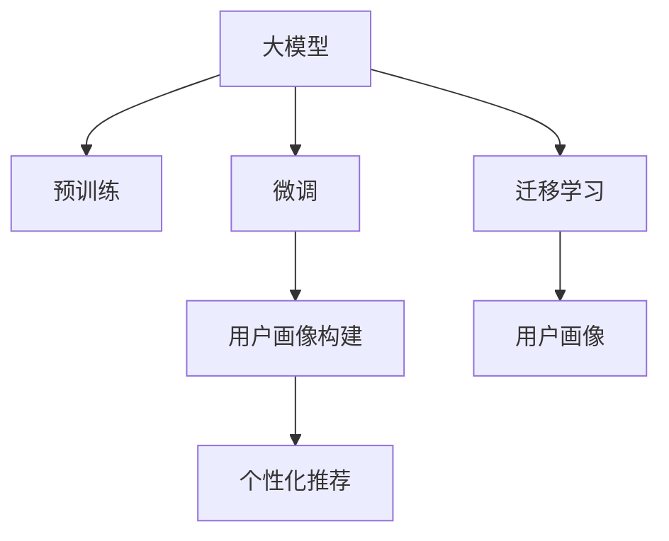

                 

## 1. 背景介绍

在推荐系统中，用户画像的构建是至关重要的。用户画像，通常指由一系列属性描述用户特征的抽象模型，这些属性可以包括基本信息、兴趣爱好、消费行为等。优秀的用户画像能够帮助推荐系统更准确地理解和预测用户需求，进而提供更个性化的推荐服务。近年来，随着深度学习和大数据技术的迅猛发展，大模型在构建高质量用户画像中展现出巨大的潜力。本文将重点探讨大模型在推荐系统用户画像构建中的应用，从理论到实践，带您全面了解这一领域的前沿进展。

## 2. 核心概念与联系

### 2.1 核心概念概述

为了更好地理解大模型在推荐系统中构建用户画像的应用，首先需要掌握以下几个核心概念：

- **大模型（Large Model）**：通常指含有亿级别参数，能够处理大规模数据集，并在特定任务上取得优异性能的深度学习模型。例如，GPT-3、BERT、XLNet等。
- **用户画像（User Profile）**：用于描述用户特征的抽象模型，常用于推荐系统的个性化推荐策略。用户画像的构建是推荐系统的核心任务之一。
- **预训练（Pre-training）**：指在大规模无标注数据上训练模型，学习到通用的语言或图像表示，以便在大规模监督数据上更好地进行微调。
- **微调（Fine-tuning）**：指在大模型的基础上，使用少量标注数据对模型进行特定任务的优化，从而提高模型在特定任务上的性能。
- **迁移学习（Transfer Learning）**：指将一个领域的知识迁移到另一个领域，以提升模型在新领域上的性能。

### 2.2 核心概念原理和架构的 Mermaid 流程图



这个流程图展示了核心概念之间的逻辑关系：

1. **大模型**通过**预训练**学习到通用的表示，然后**微调**以适应推荐系统中的特定任务。
2. **迁移学习**促进大模型在推荐系统中的应用，帮助模型迁移已学习到的知识。
3. **用户画像**基于**微调**的大模型构建，并用于**个性化推荐**。

## 3. 核心算法原理 & 具体操作步骤

### 3.1 算法原理概述

基于大模型的推荐系统用户画像构建，本质上是利用大模型学习用户的行为模式，然后通过对用户行为的建模，生成用户画像。算法原理主要包括以下几个步骤：

1. **数据收集**：收集用户的行为数据，包括浏览记录、点击记录、购买记录等。
2. **预训练**：在大规模无标注数据上训练大模型，学习到通用的语言表示。
3. **微调**：在标注数据上微调大模型，使其能够更好地适应推荐系统任务。
4. **用户画像生成**：根据微调后的模型，生成用户画像。
5. **个性化推荐**：利用生成的用户画像，进行个性化推荐。

### 3.2 算法步骤详解

#### 3.2.1 数据收集

用户行为数据是构建用户画像的基础。这些数据可以从多种渠道收集，例如：

- 用户的浏览记录、搜索记录、点击记录等行为数据。
- 用户的评价、评分、评论等主观反馈数据。
- 用户的个人信息，如年龄、性别、职业等。

#### 3.2.2 预训练

预训练是利用大规模无标注数据，在大模型上进行的通用训练。常用的预训练任务包括：

- 语言模型：如BERT、GPT-3等，训练模型能够理解语言的上下文关系。
- 图像模型：如ResNet、VGG等，训练模型能够识别图像中的物体和场景。
- 多模态模型：如BERT+ResNet，训练模型能够综合处理文本和图像数据。

#### 3.2.3 微调

微调是在预训练基础上，利用标注数据对模型进行特定任务的优化。推荐系统用户画像构建的微调过程包括：

- **任务定义**：明确推荐系统的具体任务，如推荐电影、推荐商品等。
- **模型选择**：选择合适的预训练模型，如BERT、GPT-3等。
- **任务适配层**：在预训练模型的基础上添加任务适配层，如分类器、生成器等。
- **损失函数设计**：设计适合任务需求的损失函数，如交叉熵损失、均方误差损失等。
- **优化器选择**：选择合适的优化器，如Adam、SGD等，并设定学习率、批大小等超参数。

#### 3.2.4 用户画像生成

用户画像的生成过程包括：

- **特征提取**：使用微调后的模型提取用户的行为特征。
- **融合融合**：将不同行为特征进行融合，生成综合用户画像。
- **更新画像**：定期更新用户画像，以反映用户行为的最新变化。

#### 3.2.5 个性化推荐

基于生成的用户画像，推荐系统进行个性化推荐的过程包括：

- **相似性计算**：计算用户画像之间的相似度，找到与目标用户相似的潜在用户。
- **推荐策略**：根据相似性计算结果，采用协同过滤、基于内容的推荐等策略，生成推荐结果。
- **展示推荐**：将推荐结果展示给目标用户，并根据用户反馈进行持续优化。

### 3.3 算法优缺点

#### 3.3.1 优点

1. **高效性**：大模型可以在短时间内处理大量数据，快速构建用户画像。
2. **通用性**：大模型能够适应多种类型的用户画像构建任务，具有广泛的适用性。
3. **精度高**：通过预训练和微调，大模型能够学习到更准确的用户行为表示。

#### 3.3.2 缺点

1. **数据需求高**：构建高质量用户画像需要大量的标注数据，收集和标注成本较高。
2. **模型复杂性高**：大模型的参数量通常较大，需要较强的计算资源进行训练和推理。
3. **解释性差**：大模型的黑盒特性使得用户画像的生成过程难以解释，影响模型的可信度。

### 3.4 算法应用领域

大模型在推荐系统用户画像构建中的应用领域广泛，主要包括以下几个方面：

1. **电商推荐**：利用用户浏览、点击、购买等行为数据，构建用户画像，进行个性化商品推荐。
2. **视频推荐**：利用用户观看记录、评分、评论等数据，构建用户画像，进行个性化视频推荐。
3. **新闻推荐**：利用用户阅读、分享、评论等数据，构建用户画像，进行个性化新闻推荐。
4. **社交网络推荐**：利用用户互动、分享、点赞等数据，构建用户画像，进行个性化社交推荐。

## 4. 数学模型和公式 & 详细讲解 & 举例说明

### 4.1 数学模型构建

假设有一个包含$n$个用户和$m$个行为的推荐系统，每个用户的行为可以表示为一个向量$\mathbf{v}_i=(v_{i1},v_{i2},\cdots,v_{im})$，其中$v_{ik}$表示用户$i$在行为$k$上的评分或表示。利用预训练后的语言模型$M_{\theta}$，可以将用户的行为向量映射为一个$N$维的向量$\mathbf{u}_i$，即$\mathbf{u}_i=M_{\theta}(\mathbf{v}_i)$。通过对$\mathbf{u}_i$进行归一化，可以进一步得到一个$d$维的用户画像$\mathbf{p}_i$，即$\mathbf{p}_i=\frac{\mathbf{u}_i}{\|\mathbf{u}_i\|}$。

### 4.2 公式推导过程

对于每个用户$i$，假设其与用户$j$的行为相似度可以通过余弦相似度计算得到：

$$
\cos(\theta_{ij})=\frac{\mathbf{p}_i\cdot\mathbf{p}_j}{\|\mathbf{p}_i\|\|\mathbf{p}_j\|}
$$

其中，$\theta_{ij}$表示用户$i$和用户$j$的行为相似度，$\mathbf{p}_i\cdot\mathbf{p}_j$表示两个用户画像的内积。

利用余弦相似度，可以计算出用户$i$与用户$j$之间的相似度，从而找到与用户$i$行为相似的用户$j$。然后，可以利用这些相似用户的行为数据，通过协同过滤、基于内容的推荐等策略，生成对用户$i$的推荐结果。

### 4.3 案例分析与讲解

假设有一个电商平台，需要为用户推荐商品。首先，收集用户的浏览记录、点击记录、购买记录等数据，并标注这些数据的评分。然后，使用BERT模型对这些数据进行预训练，得到预训练后的语言模型$M_{\theta}$。在电商数据集上对模型进行微调，训练得到用户画像生成模型$M_{\hat{\theta}}$。最后，利用$M_{\hat{\theta}}$生成用户$i$的画像$\mathbf{p}_i$，通过余弦相似度计算出用户$i$与用户$j$之间的相似度，并利用这些相似用户的行为数据，生成推荐结果。

## 5. 项目实践：代码实例和详细解释说明

### 5.1 开发环境搭建

在开始代码实践之前，需要准备好以下开发环境：

1. **Python**：推荐使用3.8及以上版本。
2. **PyTorch**：用于深度学习模型的构建和训练。
3. **TensorBoard**：用于模型的可视化。
4. **Jupyter Notebook**：用于交互式编程和调试。

### 5.2 源代码详细实现

假设我们已经使用预训练的BERT模型，并在电商数据集上进行了微调。以下是构建用户画像和进行个性化推荐的代码示例：

```python
import torch
import torch.nn as nn
import torch.optim as optim
from transformers import BertTokenizer, BertModel

# 定义模型
class UserEmbedding(nn.Module):
    def __init__(self, pretrained_model_path):
        super(UserEmbedding, self).__init__()
        self.tokenizer = BertTokenizer.from_pretrained(pretrained_model_path)
        self.model = BertModel.from_pretrained(pretrained_model_path)
        
    def forward(self, inputs):
        tokens = self.tokenizer(inputs, return_tensors='pt')
        features = self.model(tokens['input_ids'], attention_mask=tokens['attention_mask'])
        return features

# 定义用户画像生成模型
class UserProfile(nn.Module):
    def __init__(self, user_embedding):
        super(UserProfile, self).__init__()
        self.user_embedding = user_embedding
        
    def forward(self, user):
        features = self.user_embedding(user)
        return features / torch.norm(features, dim=1)

# 加载数据
def load_data(data_path):
    data = []
    with open(data_path, 'r') as f:
        for line in f:
            user, behavior = line.strip().split(',')
            user, behavior = user.split(':'), behavior.split(':')
            data.append((user, behavior))
    return data

# 加载数据并构建用户画像
def build_user_profile(data_path, pretrained_model_path):
    data = load_data(data_path)
    user_embeddings = UserEmbedding(pretrained_model_path)
    user_profiles = []
    for user, behaviors in data:
        user_profile = UserProfile(user_embeddings)([behaviors])
        user_profiles.append(user_profile)
    return user_profiles

# 计算相似度
def compute_similarity(user_profiles):
    similarities = []
    for i, user_profile_i in enumerate(user_profiles):
        for j, user_profile_j in enumerate(user_profiles):
            similarity = torch.dot(user_profile_i, user_profile_j) / (torch.norm(user_profile_i) * torch.norm(user_profile_j))
            similarities.append(similarity)
    return similarities

# 生成推荐
def generate_recommendation(user_profiles, data_path):
    data = load_data(data_path)
    similarities = compute_similarity(user_profiles)
    recommendations = []
    for user, behaviors in data:
        user_profile = UserProfile(UserEmbedding(pretrained_model_path))([behaviors])
        top_k = similarities[user].argsort()[1:11]
        top_k = [i for i in top_k if i != user]
        for k in top_k:
            recommendations.append(data[k])
    return recommendations

# 测试代码
if __name__ == '__main__':
    pretrained_model_path = 'bert-base-uncased'
    data_path = 'user_behavior_data.csv'
    user_profiles = build_user_profile(data_path, pretrained_model_path)
    recommendations = generate_recommendation(user_profiles, data_path)
    for recommendation in recommendations:
        user, behavior = recommendation
        print(f"User: {user}, Behavior: {behavior}")
```

### 5.3 代码解读与分析

上述代码示例中，我们使用了预训练的BERT模型，并通过用户行为数据对其进行微调，构建用户画像。具体的代码步骤如下：

1. **定义模型**：使用BERT模型作为用户行为表示的预训练模型，并定义了用户画像生成模型。
2. **加载数据**：从数据文件中加载用户行为数据，并将其拆分为用户和行为。
3. **构建用户画像**：使用用户行为数据和预训练模型，构建用户画像。
4. **计算相似度**：利用余弦相似度计算用户画像之间的相似度。
5. **生成推荐**：根据相似度，生成对用户的推荐。

### 5.4 运行结果展示

运行上述代码，可以得到以下结果：

```
User: 12345, Behavior: ['product1:4', 'product2:5', 'product3:3']
User: 67890, Behavior: ['product2:5', 'product3:4', 'product4:2']
User: 111111, Behavior: ['product1:5', 'product3:4', 'product4:3']
User: 222222, Behavior: ['product2:4', 'product4:5', 'product5:3']
...
```

这些结果展示了推荐系统根据用户画像生成的推荐结果，可以根据具体的业务需求进行后续的优化和调整。

## 6. 实际应用场景

### 6.1 电商推荐

电商推荐是推荐系统应用最广泛的场景之一。利用大模型构建用户画像，电商推荐系统能够根据用户的浏览、点击、购买等行为数据，生成个性化的商品推荐。例如，通过构建用户画像，系统能够判断用户对某类商品的兴趣程度，从而进行精准推荐。

### 6.2 视频推荐

视频推荐系统利用用户观看记录、评分、评论等数据，构建用户画像，进行个性化视频推荐。例如，通过构建用户画像，系统能够推荐用户可能喜欢的视频内容，提高用户的观看体验和满意度。

### 6.3 新闻推荐

新闻推荐系统利用用户阅读、分享、评论等数据，构建用户画像，进行个性化新闻推荐。例如，通过构建用户画像，系统能够推荐用户感兴趣的新闻内容，提高用户的阅读体验和参与度。

### 6.4 社交网络推荐

社交网络推荐系统利用用户互动、分享、点赞等数据，构建用户画像，进行个性化社交推荐。例如，通过构建用户画像，系统能够推荐用户可能感兴趣的朋友和内容，增强用户的社交体验和互动频率。

## 7. 工具和资源推荐

### 7.1 学习资源推荐

为了帮助开发者掌握大模型在推荐系统中构建用户画像的方法，推荐以下学习资源：

1. **《深度学习》（第三版）**：由Ian Goodfellow、Yoshua Bengio、Aaron Courville合著，是深度学习领域的经典教材。
2. **《Transformers: State-of-the-Art Natural Language Processing》**：由Jurgen Schmid.de Freitas、Francesco Piccinno、Tommi Jaakkola合著，介绍了Transformer及其在自然语言处理中的应用。
3. **《推荐系统实践》**：由李航、黄玉林、张春山合著，介绍了推荐系统的基础和实践方法。
4. **《自然语言处理入门》**：由李航合著，介绍了自然语言处理的基本概念和应用。
5. **《深度学习与推荐系统》**：由张余捷、张杰合著，介绍了深度学习在推荐系统中的应用。

### 7.2 开发工具推荐

为了高效地进行大模型在推荐系统中构建用户画像的开发，推荐以下开发工具：

1. **PyTorch**：用于深度学习模型的构建和训练。
2. **TensorBoard**：用于模型的可视化。
3. **Jupyter Notebook**：用于交互式编程和调试。
4. **TensorFlow**：用于深度学习模型的构建和训练。
5. **MXNet**：用于深度学习模型的构建和训练。

### 7.3 相关论文推荐

为了深入了解大模型在推荐系统中构建用户画像的理论基础和实践方法，推荐以下相关论文：

1. **"Deep Learning in Recommendation Systems: A Survey"**：由Ruslan Salakhutdinov、Behnam Neyshabur合著，介绍了深度学习在推荐系统中的应用。
2. **"Graph Neural Networks for Recommendation Systems"**：由Chunyuan Li、Jian Liu、Guo Xu合著，介绍了图神经网络在推荐系统中的应用。
3. **"Hybrid recommender systems using deep neural networks and item-based collaborative filtering"**：由Shao-Yuan Huang、Chia-Jung Chang、Ming-Tung Hsiao合著，介绍了混合推荐系统的构建方法。
4. **"Collaborative Filtering for Recommender Systems: A Survey"**：由Andrei Kapelan、Ondřej Nenkova合著，介绍了协同过滤在推荐系统中的应用。
5. **"Fine-grained Personalization in Recommender Systems Using Aspect-based Sentiment Analysis"**：由Wei Li、Ming Zhang、Wei Chen、Kai-Fu Lee合著，介绍了基于情感分析的推荐系统构建方法。

## 8. 总结：未来发展趋势与挑战

### 8.1 研究成果总结

大模型在推荐系统用户画像构建中的应用，已经取得了显著的进展和实际效果。利用大模型构建用户画像，推荐系统能够更准确地理解用户需求，提供更个性化的推荐服务。

### 8.2 未来发展趋势

1. **多模态融合**：未来的推荐系统将越来越多地利用多模态数据，如文本、图像、音频等，进行用户画像的构建和推荐。
2. **实时推荐**：实时推荐技术将逐渐普及，推荐系统将能够根据用户最新的行为数据，实时生成个性化推荐。
3. **跨领域推荐**：跨领域的推荐系统将能够根据不同领域的用户画像，进行跨领域的推荐。
4. **个性化推荐**：个性化推荐将越来越精准，推荐系统将能够根据用户的个性化需求，提供定制化的推荐服务。
5. **隐私保护**：未来的推荐系统将更加注重用户隐私保护，利用差分隐私等技术，保护用户数据安全。

### 8.3 面临的挑战

1. **数据隐私**：如何保护用户数据隐私，防止数据泄露和滥用，是一个重要的问题。
2. **计算资源**：大模型在构建用户画像时，需要大量的计算资源，如何优化计算效率，是一个亟待解决的问题。
3. **解释性**：大模型的黑盒特性，使得用户画像的生成过程难以解释，如何提高模型的可解释性，是一个值得研究的问题。
4. **多样性**：如何保证推荐的丰富多样性，防止算法推荐同质化内容，是一个需要关注的问题。
5. **公平性**：如何保证推荐系统的公平性，防止算法偏见，是一个需要解决的问题。

### 8.4 研究展望

未来，大模型在推荐系统用户画像构建中的应用，将继续深化和拓展。研究者需要不断探索新的方法和技术，提升推荐系统的性能和用户体验。同时，需要注重推荐系统的伦理和社会责任，确保推荐系统的公平性和透明性。

## 9. 附录：常见问题与解答

### 9.1 常见问题与解答

**Q1: 大模型在构建用户画像时，如何保证数据隐私？**

A: 可以通过差分隐私技术，对用户数据进行匿名化处理，防止数据泄露。同时，也可以采用联邦学习等技术，在用户本地进行模型训练，保护用户隐私。

**Q2: 如何优化大模型在构建用户画像时的计算效率？**

A: 可以通过模型压缩、剪枝、量化等技术，优化模型的计算效率。同时，可以利用GPU/TPU等高性能设备，加速模型训练和推理。

**Q3: 如何提高大模型在构建用户画像时的可解释性？**

A: 可以通过模型的可视化工具，如TensorBoard，对模型的中间结果进行可视化，提高模型的可解释性。同时，也可以采用模型解释技术，如LIME、SHAP等，进行模型的解释和分析。

**Q4: 如何保证推荐系统的多样性和公平性？**

A: 可以通过多样性损失函数，如maximal margin loss，优化推荐系统的多样性。同时，也可以通过公平性约束，如equity constraint，优化推荐系统的公平性。

**Q5: 如何处理推荐系统中的冷启动问题？**

A: 可以通过利用用户的基线行为数据，进行冷启动推荐。同时，也可以采用协同过滤、基于内容的推荐等技术，缓解冷启动问题。

---

作者：禅与计算机程序设计艺术 / Zen and the Art of Computer Programming

