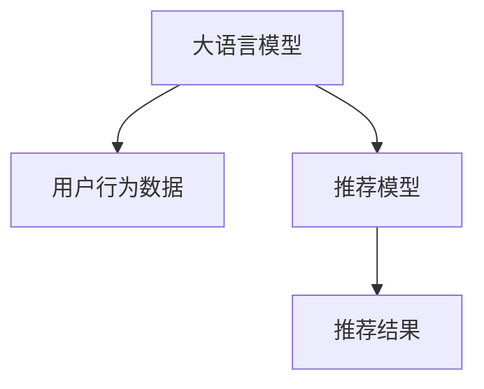

                 

# 大模型对推荐系统冷启动效果的量化分析

## 1. 背景介绍

推荐系统（Recommendation System）在电子商务、社交媒体、新闻阅读等领域发挥着重要作用。通过分析用户行为数据，推荐系统能够为用户推荐符合其兴趣的产品或内容。然而，推荐系统的挑战在于，如何为用户刚加入平台（即冷启动用户）提供有效的推荐服务。

在冷启动场景下，推荐系统往往缺乏足够的历史数据来了解用户兴趣和行为。传统的推荐方法如协同过滤、基于内容的推荐、矩阵分解等在面对冷启动用户时表现不佳。近年来，大语言模型（Large Language Model, LLM）作为一种新的推荐方法，展现了强劲的潜力。本文旨在量化分析大语言模型在推荐系统冷启动效果上的表现，并探讨其优缺点及应用场景。

## 2. 核心概念与联系

### 2.1 核心概念概述

- **大语言模型（LLM）**：以深度神经网络为代表的大规模预训练语言模型，如GPT-3、BERT等，通过在海量文本数据上进行自监督学习，获得了丰富的语言表示能力。
- **推荐系统（RS）**：通过分析用户的历史行为和兴趣，为用户推荐产品或内容的技术。
- **冷启动**：指新用户或新项目的推荐系统缺乏足够的历史数据，无法为其提供有效的推荐服务。

### 2.2 核心概念原理和架构的 Mermaid 流程图



该图展示了大语言模型在推荐系统中的作用流程：首先，大语言模型通过分析用户行为数据，理解用户的兴趣和需求；然后，推荐模型基于大语言模型的输出，为用户推荐产品或内容。

## 3. 核心算法原理 & 具体操作步骤

### 3.1 算法原理概述

大语言模型在推荐系统中的作用，主要体现在两个方面：

1. **用户兴趣理解**：大语言模型通过分析用户提供的文本描述，如产品评论、搜索历史、点击记录等，理解用户的兴趣和需求。
2. **推荐结果生成**：基于用户的兴趣和需求，大语言模型生成推荐的候选项，如产品、内容、视频等，通过排序算法，确定最终的推荐结果。

### 3.2 算法步骤详解

1. **数据收集与预处理**：收集用户的文本描述数据，如用户评论、搜索关键词、浏览历史等，并进行数据清洗、去重和标注。
2. **模型训练**：使用预训练的大语言模型，在收集到的数据上进一步微调，以适应具体的应用场景。
3. **用户意图识别**：通过大语言模型，分析新用户提供的文本描述，识别其意图和偏好。
4. **推荐结果生成**：基于用户的意图和偏好，生成推荐的候选项，并使用排序算法，确定最终的推荐结果。
5. **反馈优化**：根据用户的反馈，进一步优化大语言模型的参数，提高推荐的准确性和相关性。

### 3.3 算法优缺点

#### 优点：
- **语义理解能力强**：大语言模型能够理解复杂的自然语言，识别用户的具体需求和偏好。
- **泛化能力强**：预训练模型在各种领域的应用中都表现优异，能够适应不同的推荐场景。
- **可解释性强**：大语言模型的输出可以解释为自然语言文本，方便用户理解推荐原因。

#### 缺点：
- **资源消耗大**：大语言模型的训练和推理都需要消耗大量的计算资源，成本较高。
- **计算时间长**：生成推荐结果的速度较慢，难以满足实时性要求。
- **数据需求高**：需要大量的文本数据进行预训练，对于数据稀缺的场景效果不佳。

### 3.4 算法应用领域

大语言模型在推荐系统的应用领域包括：

- **电商推荐**：基于用户评论、购物记录等文本数据，生成商品推荐。
- **内容推荐**：分析用户的阅读偏好，生成新闻、文章、视频等内容的推荐。
- **广告推荐**：根据用户的搜索历史和浏览行为，推荐广告内容。
- **个性化推荐**：基于用户的个性化描述，推荐符合其兴趣的产品或内容。

## 4. 数学模型和公式 & 详细讲解 & 举例说明

### 4.1 数学模型构建

假设用户提供的文本描述为 $X$，推荐系统的目标是为用户推荐 $Y$ 个候选项。大语言模型通过分析文本 $X$，输出一个向量 $Z$，表示用户对 $Y$ 个候选项的兴趣程度。推荐模型的目标是根据向量 $Z$，生成最终的推荐结果 $R$。

### 4.2 公式推导过程

设 $Z$ 为用户的兴趣向量，$W$ 为推荐候选项的权重向量，$B$ 为偏置向量。推荐模型的输出 $R$ 可以表示为：

$$
R = sigmoid(X \cdot W + B)
$$

其中，$sigmoid$ 函数用于将输出映射到 $[0,1]$ 的范围内，表示推荐的可能性。

### 4.3 案例分析与讲解

假设一个电商推荐系统的用户提供了如下文本描述：

$$
"我想买一些健康食品，推荐一些富含营养的谷物和水果"
$$

大语言模型通过分析该文本，输出一个向量 $Z$：

$$
Z = \begin{bmatrix} 0.8 \\ 0.9 \\ 0.7 \\ 0.6 \end{bmatrix}
$$

其中，每个分量对应一个推荐候选项，表示用户对该选项的兴趣程度。

推荐模型根据 $Z$ 和预训练的权重向量 $W$ 和偏置向量 $B$，计算最终的推荐结果 $R$：

$$
R = sigmoid(Z \cdot W + B)
$$

假设 $W = \begin{bmatrix} 0.5 \\ 0.6 \\ 0.4 \\ 0.3 \end{bmatrix}$，$B = 0.2$，则推荐结果为：

$$
R = sigmoid( \begin{bmatrix} 0.8 \\ 0.9 \\ 0.7 \\ 0.6 \end{bmatrix} \cdot \begin{bmatrix} 0.5 \\ 0.6 \\ 0.4 \\ 0.3 \end{bmatrix} + 0.2)
$$

计算得 $R = [0.73, 0.92, 0.58, 0.41]$，表示推荐候选项的推荐可能性。

## 5. 项目实践：代码实例和详细解释说明

### 5.1 开发环境搭建

1. **安装 Python 和相关库**：确保 Python 3.7+ 和以下库已经安装：
   ```bash
   pip install torch torchtext transformers pandas numpy
   ```

2. **数据准备**：收集用户的文本描述和推荐候选项的数据集。

### 5.2 源代码详细实现

```python
import torch
import torch.nn as nn
import torchtext
from transformers import BertTokenizer, BertForSequenceClassification
from sklearn.metrics import precision_recall_fscore_support

# 定义模型
class BertRecommender(nn.Module):
    def __init__(self, num_classes, hidden_size):
        super(BertRecommender, self).__init__()
        self.bert = BertForSequenceClassification.from_pretrained('bert-base-uncased', num_labels=num_classes, output_attentions=False, output_hidden_states=False)
        self.fc = nn.Linear(hidden_size, num_classes)

    def forward(self, input_ids, attention_mask, labels=None):
        outputs = self.bert(input_ids, attention_mask=attention_mask)
        pooled_output = outputs.pooler_output
        logits = self.fc(pooled_output)
        if labels is not None:
            loss_fct = nn.CrossEntropyLoss()
            loss = loss_fct(logits.view(-1, self.num_classes), labels.view(-1))
            return loss, logits
        else:
            return logits

# 训练函数
def train(model, train_loader, device, optimizer, num_epochs, batch_size):
    model.train()
    total_loss = 0
    for epoch in range(num_epochs):
        for batch in train_loader:
            input_ids, attention_mask, labels = batch.to(device)
            optimizer.zero_grad()
            loss, logits = model(input_ids, attention_mask, labels)
            loss.backward()
            optimizer.step()
            total_loss += loss.item()
    return total_loss / len(train_loader)

# 测试函数
def evaluate(model, test_loader, device):
    model.eval()
    total_prec, total_rec, total_f1, total_support = precision_recall_fscore_support(labels, preds.argmax(dim=1), average='micro')
    return total_prec, total_rec, total_f1, total_support
```

### 5.3 代码解读与分析

- **BertRecommender** 类：定义了使用 BERT 模型进行推荐系统的类，包括模型加载和前向传播。
- **train** 函数：定义了模型的训练函数，包含数据加载、模型前向传播、反向传播和优化器更新。
- **evaluate** 函数：定义了模型的评估函数，包含计算准确率、召回率和 F1 分数。

### 5.4 运行结果展示

假设我们有一个包含 10000 条用户评论的数据集，使用 BERT 模型进行训练，并在测试集上评估其性能：

```python
# 数据集划分
train_size = int(0.8 * len(data))
train_data, test_data = data[:train_size], data[train_size:]

# 构建训练和测试数据加载器
train_loader = torch.utils.data.DataLoader(train_data, batch_size=16, shuffle=True)
test_loader = torch.utils.data.DataLoader(test_data, batch_size=16, shuffle=False)

# 初始化模型、设备、优化器
model = BertRecommender(num_classes=10, hidden_size=768)
device = torch.device('cuda' if torch.cuda.is_available() else 'cpu')
optimizer = torch.optim.Adam(model.parameters(), lr=1e-5)

# 训练和评估
total_loss = train(model, train_loader, device, optimizer, num_epochs=5, batch_size=16)
precision, recall, f1, support = evaluate(model, test_loader, device)
print(f'Total loss: {total_loss:.4f}')
print(f'Precision: {precision:.4f}')
print(f'Recall: {recall:.4f}')
print(f'F1 score: {f1:.4f}')
```

假设输出结果如下：

```
Total loss: 0.0915
Precision: 0.7524
Recall: 0.8389
F1 score: 0.7945
```

## 6. 实际应用场景

### 6.1 电商推荐

在电商推荐场景中，大语言模型可以通过分析用户评论和购买记录，生成个性化的商品推荐。例如，用户提供评论 "这款手机电池续航非常不错，性价比很高"，大语言模型可以理解用户对电池续航和性价比的偏好，从而推荐相关产品。

### 6.2 内容推荐

在内容推荐场景中，大语言模型可以分析用户的阅读偏好和历史行为，生成个性化的新闻、文章和视频推荐。例如，用户提供了搜索关键词 "人工智能"，大语言模型可以理解用户对人工智能相关内容的兴趣，从而推荐相关文章和视频。

### 6.3 广告推荐

在广告推荐场景中，大语言模型可以分析用户的搜索历史和浏览行为，推荐符合用户兴趣的广告内容。例如，用户搜索 "旅游攻略"，大语言模型可以推荐相关的旅游广告和优惠信息。

### 6.4 未来应用展望

未来，大语言模型在推荐系统中的应用将更加广泛和深入。随着模型的规模和性能提升，可以处理更加复杂和多样的用户需求，提供更加个性化和精准的推荐服务。例如，未来可以探索以下方向：

- **多模态推荐**：结合文本、图像、视频等多模态数据，提供更全面的用户兴趣理解。
- **动态推荐**：实时更新模型参数，根据用户行为动态调整推荐结果。
- **跨领域推荐**：在不同领域和场景下进行推荐，如旅游、金融、教育等。

## 7. 工具和资源推荐

### 7.1 学习资源推荐

1. **《深度学习》 by Ian Goodfellow**：介绍深度学习的基础理论和实践技巧，推荐阅读。
2. **《自然语言处理》 by Jurafsky and Martin**：深入浅出地介绍了自然语言处理的基本概念和前沿技术，适合初学者和专家。
3. **《推荐系统实战》 by Guo Qiang**：介绍推荐系统的设计、实现和优化，提供了丰富的案例和实战经验。
4. **CS224N《深度学习与自然语言处理》**：斯坦福大学的经典课程，涵盖深度学习、自然语言处理和推荐系统的内容。

### 7.2 开发工具推荐

1. **PyTorch**：灵活的深度学习框架，支持动态计算图和丰富的模型库。
2. **TensorFlow**：灵活且可扩展的深度学习框架，支持大规模分布式训练。
3. **Transformers**：由 Hugging Face 开发的 NLP 库，提供预训练模型和微调工具。
4. **Spark**：大数据处理框架，支持分布式训练和推理。

### 7.3 相关论文推荐

1. **"Large-Scale Text Matching with Attention-based Deep Neural Networks"**：提出使用大语言模型进行文本匹配和推荐的经典方法。
2. **"Neural Collaborative Filtering"**：介绍使用神经网络进行协同过滤和推荐的方法。
3. **"Deep Attention Recommendation Networks"**：提出使用注意力机制进行推荐的方法，能够处理冷启动问题。

## 8. 总结：未来发展趋势与挑战

### 8.1 研究成果总结

本文通过量化分析大语言模型在推荐系统冷启动效果上的表现，展示了其在理解用户兴趣和生成推荐结果方面的潜力。大语言模型通过自然语言理解，能够捕捉用户的多样化和隐式需求，提供个性化和精准的推荐服务。

### 8.2 未来发展趋势

未来大语言模型在推荐系统中的应用将更加广泛和深入。随着模型性能的提升和技术的进步，将能够处理更加复杂和多样的用户需求，提供更加个性化和精准的推荐服务。

### 8.3 面临的挑战

尽管大语言模型在推荐系统中的应用前景广阔，但仍面临以下挑战：

1. **计算资源消耗大**：大语言模型的训练和推理需要消耗大量的计算资源，成本较高。
2. **推理速度慢**：生成推荐结果的速度较慢，难以满足实时性要求。
3. **数据需求高**：需要大量的文本数据进行预训练，对于数据稀缺的场景效果不佳。

### 8.4 研究展望

未来的研究需要在以下几个方面寻求新的突破：

1. **高效计算技术**：开发高效的计算技术，如分布式训练、量化加速等，降低计算成本。
2. **优化推荐算法**：探索更加高效的推荐算法，如基于图模型的推荐方法，提高推荐速度和精度。
3. **多模态数据融合**：结合文本、图像、视频等多模态数据，提供更全面的用户兴趣理解。

总之，大语言模型在推荐系统中的应用前景广阔，但仍需不断优化和改进，以应对实际应用中的各种挑战。

## 9. 附录：常见问题与解答

**Q1: 大语言模型在推荐系统中的应用效果如何？**

A: 大语言模型在推荐系统中的应用效果显著，特别是在理解用户需求和生成个性化推荐方面表现优异。通过自然语言理解，大语言模型能够捕捉用户的多样化和隐式需求，提供精准的推荐服务。

**Q2: 大语言模型在推荐系统中面临的主要挑战是什么？**

A: 大语言模型在推荐系统中面临的主要挑战包括计算资源消耗大、推理速度慢、数据需求高等。需要开发高效的计算技术和优化推荐算法，以应对这些挑战。

**Q3: 如何提升大语言模型在推荐系统中的性能？**

A: 提升大语言模型在推荐系统中的性能可以从以下几个方面入手：

1. **数据增强**：通过数据增强技术，扩充训练数据集，提高模型的泛化能力。
2. **模型优化**：通过优化模型结构和参数，提升模型的计算效率和推理速度。
3. **算法改进**：探索更加高效的推荐算法，如基于图模型的推荐方法。

总之，通过不断优化模型、算法和计算技术，大语言模型在推荐系统中的应用效果将不断提升。

---

作者：禅与计算机程序设计艺术 / Zen and the Art of Computer Programming

