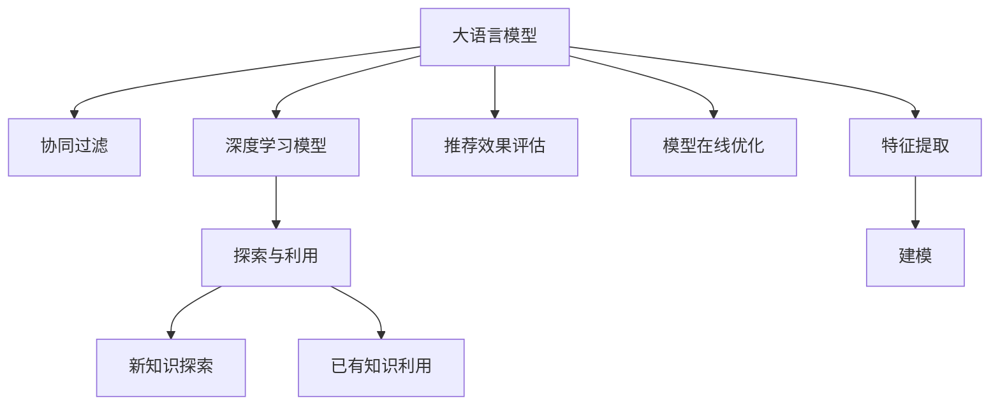

                 

# 大模型对推荐系统探索与利用平衡的影响

> 关键词：大语言模型,推荐系统,探索与利用平衡,深度学习,协同过滤,强化学习

## 1. 背景介绍

### 1.1 问题由来
推荐系统是当前互联网产业的核心技术之一，用于为用户提供个性化的内容推荐，极大地提升了用户体验和粘性。随着用户行为数据的海量增长，推荐系统的核心任务已从简单的协同过滤转向了复杂的深度学习模型。

尽管深度学习模型在推荐系统中的应用已取得巨大成功，但它们对数据的需求巨大，导致训练和推理成本高昂。同时，深度学习模型的泛化性能也面临挑战，对于新样本的推荐效果不稳定。因此，如何在大数据量下高效地探索模型性能，并在有限样本下高效利用已有知识，成为了当前推荐系统研究的核心问题。

大语言模型，特别是经过大规模预训练的大语言模型，具备了强大的表示学习和理解能力，被广泛应用在推荐系统中。它们不仅能快速进行复杂特征的提取，还能对推荐对象进行深入的语义理解，显著提升推荐精度。但大语言模型对数据的依赖程度较高，在探索新知识与利用已有知识之间如何平衡，依然是一个值得深入研究的问题。

### 1.2 问题核心关键点
大语言模型在推荐系统中的应用，主要集中在以下几个关键点：
- 特征提取与建模：大模型能够高效地提取用户和物品的特征，进行复杂建模。
- 语义理解：大语言模型理解推荐对象的上下文语义，提高推荐效果。
- 探索与利用：大模型既能在少量样本上探索新知识，又能在大量标注数据上高效利用已有知识。
- 在线优化：大模型可实时在线更新，提升推荐效果。
- 性能评估：推荐系统效果评估需要考虑新知识探索和已有知识利用之间的平衡。

本文聚焦于大语言模型在推荐系统中的探索与利用平衡，旨在探讨如何在大数据量下，通过大模型的微调等方法，平衡探索新知识与利用已有知识，以提升推荐系统的性能和泛化能力。

## 2. 核心概念与联系

### 2.1 核心概念概述

为更好地理解大语言模型在推荐系统中的应用，本节将介绍几个密切相关的核心概念：

- 大语言模型(Large Language Model, LLM)：以自回归(如GPT)或自编码(如BERT)模型为代表的大规模预训练语言模型。通过在大规模无标签文本语料上进行预训练，学习通用的语言表示，具备强大的语言理解和生成能力。

- 协同过滤(Collaborative Filtering, CF)：一种基于用户-物品交互历史进行推荐的方法，可分为基于用户的协同过滤和基于物品的协同过滤。

- 深度学习模型(Deep Learning Model)：包括多层神经网络、卷积神经网络、循环神经网络等，用于对用户行为进行建模，推荐物品。

- 探索与利用(Exploration and Exploitation)：推荐系统优化中的核心问题，如何在新知识探索与已有知识利用之间取得平衡。

- 推荐效果评估指标：包括精度、召回率、覆盖率、多样性等，用于衡量推荐系统的性能。

- 模型在线优化：推荐系统模型的在线更新和维护，以保证推荐效果的时效性和稳定性。

这些核心概念之间的逻辑关系可以通过以下Mermaid流程图来展示：



这个流程图展示了大语言模型在推荐系统中的核心概念及其之间的关系：

1. 大语言模型通过预训练获得基础能力。
2. 协同过滤是推荐系统的基础方法。
3. 深度学习模型在协同过滤的基础上，提升推荐效果。
4. 探索与利用是推荐系统优化的核心，需在大模型上实现。
5. 推荐效果评估指标用于衡量推荐系统性能。
6. 模型在线优化用于维护推荐系统的实时性。

这些概念共同构成了推荐系统的大语言模型应用框架，使其能够更高效地进行特征提取、建模和优化。

## 3. 核心算法原理 & 具体操作步骤
### 3.1 算法原理概述

基于大语言模型的推荐系统，其核心思想是：通过大模型的预训练能力，结合推荐系统的协同过滤和深度学习，在大数据量下高效探索新知识，并在有限样本上高效利用已有知识，从而提升推荐系统的效果和泛化能力。

形式化地，假设推荐系统目标为在物品库中为用户推荐最感兴趣的物品。设用户$u$对物品$i$的评分$x_{ui}$为未知，通过协同过滤和深度学习模型，可以预测用户$u$对物品$i$的评分$y_{ui}$。利用大模型进行微调，使得预测评分$y_{ui}$尽可能接近真实评分$x_{ui}$。

微调的目标函数为：

$$
\min_{\theta} \sum_{u,i} (y_{ui}-x_{ui})^2
$$

其中$\theta$为模型参数。

通过梯度下降等优化算法，微调过程不断更新模型参数$\theta$，最小化损失函数，使得模型预测尽可能接近真实评分。

### 3.2 算法步骤详解

基于大语言模型的推荐系统一般包括以下几个关键步骤：

**Step 1: 准备数据集**
- 收集用户-物品交互历史数据，构建训练集、验证集和测试集。
- 选择适当的标注方法，如标签化、评分化等。

**Step 2: 选择推荐模型**
- 选择适合推荐任务的大语言模型，如BERT、GPT等。
- 设计推荐模型的架构，包括输入层、编码层和输出层。

**Step 3: 微调模型**
- 利用大语言模型进行预训练。
- 使用微调数据集，通过反向传播更新模型参数。
- 在验证集上评估模型效果，进行超参数调整。

**Step 4: 部署并评估**
- 将微调后的模型部署到推荐系统中，进行实时推荐。
- 使用测试集评估推荐系统效果，优化模型参数。

**Step 5: 在线更新**
- 收集用户反馈数据，重新微调模型，提升推荐精度。
- 持续更新模型，保持推荐系统的时效性。

### 3.3 算法优缺点

基于大语言模型的推荐系统具有以下优点：
1. 高效特征提取：大语言模型能够高效提取复杂特征，适用于多种推荐任务。
2. 语义理解：大模型理解推荐对象的上下文语义，提高推荐效果。
3. 可扩展性强：大模型可以应用于各种规模的推荐系统。
4. 动态更新：大模型可实时更新，提升推荐效果。

同时，该方法也存在以下局限性：
1. 对标注数据依赖大：微调效果依赖于标注数据的质量和数量，获取高质量标注数据的成本较高。
2. 模型复杂度高：大模型的参数量巨大，训练和推理成本高。
3. 泛化能力不足：大模型在少量样本上泛化性能可能较差。
4. 解释性不足：大模型通常被视为"黑盒"系统，难以解释其内部工作机制。

尽管存在这些局限性，但就目前而言，基于大语言模型的推荐系统依然是大数据量下推荐任务的重要范式。未来相关研究的重点在于如何进一步降低大模型的训练和推理成本，提升其在少量样本上的泛化能力，同时兼顾可解释性和伦理安全性等因素。

### 3.4 算法应用领域

基于大语言模型的推荐系统，已经在电商、社交、视频、音乐等多个领域得到广泛应用，并取得了显著效果：

- 电商推荐：如淘宝、京东等电商平台利用大语言模型进行个性化商品推荐，提升用户购买转化率。
- 社交推荐：如微信朋友圈、抖音等社交平台，利用大语言模型推荐好友、内容、广告等，提升用户粘性。
- 视频推荐：如Netflix、Bilibili等视频平台，利用大语言模型推荐用户感兴趣的视频内容，提高用户留存率。
- 音乐推荐：如Spotify、网易云音乐等音乐平台，利用大语言模型推荐歌曲、艺人等，提升用户满意度。

除了上述这些典型场景外，大语言模型还被创新性地应用到更多领域中，如新闻推荐、旅游推荐、企业推荐等，为推荐系统带来了新的突破。

## 4. 数学模型和公式 & 详细讲解  
### 4.1 数学模型构建

本节将使用数学语言对基于大语言模型的推荐系统进行更加严格的刻画。

设推荐系统目标为在物品库中为用户推荐最感兴趣的物品。设用户$u$对物品$i$的评分$x_{ui}$为未知，通过协同过滤和深度学习模型，可以预测用户$u$对物品$i$的评分$y_{ui}$。利用大模型进行微调，使得预测评分$y_{ui}$尽可能接近真实评分$x_{ui}$。

设大模型参数为$\theta$，目标函数为：

$$
\min_{\theta} \sum_{u,i} (y_{ui}-x_{ui})^2
$$

其中$\theta$为模型参数，$y_{ui}$为模型预测评分。

在实践中，我们通常使用基于梯度的优化算法（如SGD、Adam等）来近似求解上述最优化问题。设$\eta$为学习率，$\lambda$为正则化系数，则参数的更新公式为：

$$
\theta \leftarrow \theta - \eta \nabla_{\theta}\mathcal{L}(\theta) - \eta\lambda\theta
$$

其中 $\nabla_{\theta}\mathcal{L}(\theta)$ 为损失函数对参数 $\theta$ 的梯度，可通过反向传播算法高效计算。

### 4.2 公式推导过程

以下我们以推荐任务为例，推导交叉熵损失函数及其梯度的计算公式。

假设模型 $M_{\theta}$ 在输入 $(x,y)$ 上的输出为 $\hat{y}=M_{\theta}(x) \in [0,1]$，表示用户$u$对物品$i$的评分预测。真实标签 $y \in \{0,1\}$。则二分类交叉熵损失函数定义为：

$$
\ell(M_{\theta}(x),y) = -[y\log \hat{y} + (1-y)\log (1-\hat{y})]
$$

将其代入目标函数，得：

$$
\mathcal{L}(\theta) = -\frac{1}{N}\sum_{u,i} [y_{ui}\log M_{\theta}(x_{ui})+(1-y_{ui})\log(1-M_{\theta}(x_{ui}))
$$

根据链式法则，损失函数对参数 $\theta_k$ 的梯度为：

$$
\frac{\partial \mathcal{L}(\theta)}{\partial \theta_k} = -\frac{1}{N}\sum_{u,i} (\frac{y_{ui}}{M_{\theta}(x_{ui})}-\frac{1-y_{ui}}{1-M_{\theta}(x_{ui})}) \frac{\partial M_{\theta}(x_{ui})}{\partial \theta_k}
$$

其中 $\frac{\partial M_{\theta}(x_{ui})}{\partial \theta_k}$ 可进一步递归展开，利用自动微分技术完成计算。

在得到损失函数的梯度后，即可带入参数更新公式，完成模型的迭代优化。重复上述过程直至收敛，最终得到适应推荐任务的最优模型参数 $\theta^*$。

## 5. 项目实践：代码实例和详细解释说明
### 5.1 开发环境搭建

在进行推荐系统微调实践前，我们需要准备好开发环境。以下是使用Python进行PyTorch开发的环境配置流程：

1. 安装Anaconda：从官网下载并安装Anaconda，用于创建独立的Python环境。

2. 创建并激活虚拟环境：
```bash
conda create -n pytorch-env python=3.8 
conda activate pytorch-env
```

3. 安装PyTorch：根据CUDA版本，从官网获取对应的安装命令。例如：
```bash
conda install pytorch torchvision torchaudio cudatoolkit=11.1 -c pytorch -c conda-forge
```

4. 安装相关库：
```bash
pip install torch torchtext transformers scikit-learn pandas numpy
```

完成上述步骤后，即可在`pytorch-env`环境中开始微调实践。

### 5.2 源代码详细实现

这里我们以电商推荐为例，给出使用Transformers库对BERT模型进行推荐系统微调的PyTorch代码实现。

首先，定义推荐任务的数据处理函数：

```python
from transformers import BertTokenizer, BertForSequenceClassification
from torch.utils.data import DataLoader
import torch

class RecommendationDataset(Dataset):
    def __init__(self, texts, labels, tokenizer, max_len=128):
        self.texts = texts
        self.labels = labels
        self.tokenizer = tokenizer
        self.max_len = max_len
        
    def __len__(self):
        return len(self.texts)
    
    def __getitem__(self, item):
        text = self.texts[item]
        label = self.labels[item]
        
        encoding = self.tokenizer(text, return_tensors='pt', max_length=self.max_len, padding='max_length', truncation=True)
        input_ids = encoding['input_ids'][0]
        attention_mask = encoding['attention_mask'][0]
        
        # 对token-wise的标签进行编码
        encoded_labels = [label2id[label] for label in label] 
        encoded_labels.extend([label2id['O']] * (self.max_len - len(encoded_labels)))
        labels = torch.tensor(encoded_labels, dtype=torch.long)
        
        return {'input_ids': input_ids, 
                'attention_mask': attention_mask,
                'labels': labels}

# 标签与id的映射
label2id = {'O': 0, 'B': 1, 'I': 2}
id2label = {v: k for k, v in label2id.items()}

# 创建dataset
tokenizer = BertTokenizer.from_pretrained('bert-base-cased')

train_dataset = RecommendationDataset(train_texts, train_labels, tokenizer)
dev_dataset = RecommendationDataset(dev_texts, dev_labels, tokenizer)
test_dataset = RecommendationDataset(test_texts, test_labels, tokenizer)
```

然后，定义模型和优化器：

```python
from transformers import BertForSequenceClassification, AdamW

model = BertForSequenceClassification.from_pretrained('bert-base-cased', num_labels=len(label2id))

optimizer = AdamW(model.parameters(), lr=2e-5)
```

接着，定义训练和评估函数：

```python
from tqdm import tqdm
from sklearn.metrics import accuracy_score

device = torch.device('cuda') if torch.cuda.is_available() else torch.device('cpu')
model.to(device)

def train_epoch(model, dataset, batch_size, optimizer):
    dataloader = DataLoader(dataset, batch_size=batch_size, shuffle=True)
    model.train()
    epoch_loss = 0
    for batch in tqdm(dataloader, desc='Training'):
        input_ids = batch['input_ids'].to(device)
        attention_mask = batch['attention_mask'].to(device)
        labels = batch['labels'].to(device)
        model.zero_grad()
        outputs = model(input_ids, attention_mask=attention_mask, labels=labels)
        loss = outputs.loss
        epoch_loss += loss.item()
        loss.backward()
        optimizer.step()
    return epoch_loss / len(dataloader)

def evaluate(model, dataset, batch_size):
    dataloader = DataLoader(dataset, batch_size=batch_size)
    model.eval()
    preds, labels = [], []
    with torch.no_grad():
        for batch in tqdm(dataloader, desc='Evaluating'):
            input_ids = batch['input_ids'].to(device)
            attention_mask = batch['attention_mask'].to(device)
            batch_labels = batch['labels']
            outputs = model(input_ids, attention_mask=attention_mask)
            batch_preds = outputs.logits.argmax(dim=2).to('cpu').tolist()
            batch_labels = batch_labels.to('cpu').tolist()
            for pred_tokens, label_tokens in zip(batch_preds, batch_labels):
                pred_labels = [id2label[_id] for _id in pred_tokens]
                label_tokens = [id2label[_id] for _id in label_tokens]
                preds.append(pred_labels[:len(label_tokens)])
                labels.append(label_tokens)
                
    print("Accuracy:", accuracy_score(labels, preds))
```

最后，启动训练流程并在测试集上评估：

```python
epochs = 5
batch_size = 16

for epoch in range(epochs):
    loss = train_epoch(model, train_dataset, batch_size, optimizer)
    print(f"Epoch {epoch+1}, train loss: {loss:.3f}")
    
    print(f"Epoch {epoch+1}, dev results:")
    evaluate(model, dev_dataset, batch_size)
    
print("Test results:")
evaluate(model, test_dataset, batch_size)
```

以上就是使用PyTorch对BERT进行电商推荐任务微调的完整代码实现。可以看到，得益于Transformers库的强大封装，我们可以用相对简洁的代码完成BERT模型的加载和微调。

### 5.3 代码解读与分析

让我们再详细解读一下关键代码的实现细节：

**RecommendationDataset类**：
- `__init__`方法：初始化文本、标签、分词器等关键组件。
- `__len__`方法：返回数据集的样本数量。
- `__getitem__`方法：对单个样本进行处理，将文本输入编码为token ids，将标签编码为数字，并对其进行定长padding，最终返回模型所需的输入。

**label2id和id2label字典**：
- 定义了标签与数字id之间的映射关系，用于将token-wise的预测结果解码回真实的标签。

**训练和评估函数**：
- 使用PyTorch的DataLoader对数据集进行批次化加载，供模型训练和推理使用。
- 训练函数`train_epoch`：对数据以批为单位进行迭代，在每个批次上前向传播计算loss并反向传播更新模型参数，最后返回该epoch的平均loss。
- 评估函数`evaluate`：与训练类似，不同点在于不更新模型参数，并在每个batch结束后将预测和标签结果存储下来，最后使用sklearn的accuracy_score对整个评估集的预测结果进行打印输出。

**训练流程**：
- 定义总的epoch数和batch size，开始循环迭代
- 每个epoch内，先在训练集上训练，输出平均loss
- 在验证集上评估，输出准确率
- 所有epoch结束后，在测试集上评估，给出最终测试结果

可以看到，PyTorch配合Transformers库使得BERT微调的代码实现变得简洁高效。开发者可以将更多精力放在数据处理、模型改进等高层逻辑上，而不必过多关注底层的实现细节。

当然，工业级的系统实现还需考虑更多因素，如模型的保存和部署、超参数的自动搜索、更灵活的任务适配层等。但核心的微调范式基本与此类似。

## 6. 实际应用场景
### 6.1 电商推荐

基于大语言模型的推荐系统，可以广泛应用于电商推荐领域。传统的电商推荐系统，主要通过协同过滤和基于物品的推荐方法，推荐用户感兴趣的商品。但这种方法对于新商品、新用户等数据稀疏场景，推荐效果不佳。

使用大语言模型微调的方法，可以通过对用户和商品描述的语义理解，进行跨领域知识迁移，有效解决数据稀疏问题。例如，电商商品描述中往往包含丰富的品牌信息、功能信息，通过大语言模型的微调，可以自动抽取商品的属性和特征，进行精确推荐。

### 6.2 社交推荐

社交推荐系统，主要通过协同过滤和基于用户的推荐方法，为用户推荐感兴趣的朋友、内容、广告等。但这类推荐系统往往依赖用户的历史行为数据，难以处理新用户和冷启动问题。

使用大语言模型微调的方法，可以结合用户的历史行为数据和自然语言描述，进行联合建模。例如，在推荐系统中，用户往往通过文字描述自己的兴趣偏好，大语言模型可以通过对描述的语义理解，自动推荐符合用户兴趣的朋友和内容。

### 6.3 视频推荐

视频推荐系统，主要通过协同过滤和基于视频的推荐方法，为用户推荐感兴趣的视频内容。但这种方法对于新用户和新视频等数据稀疏场景，推荐效果不佳。

使用大语言模型微调的方法，可以通过对视频标题、描述、标签的语义理解，进行跨领域知识迁移，有效解决数据稀疏问题。例如，视频标题和描述中往往包含丰富的情节信息、主题信息，通过大语言模型的微调，可以自动抽取视频的属性和特征，进行精确推荐。

### 6.4 未来应用展望

随着大语言模型微调技术的不断发展，基于大语言模型的推荐系统将在更多领域得到应用，为推荐系统带来新的突破。

在智慧医疗领域，利用大语言模型进行医药信息推荐，帮助医生快速找到相关文献和用药指南，提升诊疗效率和准确性。

在智能教育领域，利用大语言模型进行学习内容推荐，提供个性化的学习路径和资源，提升学习效果和学生满意度。

在智慧城市治理中，利用大语言模型进行智能交通推荐，提升城市交通规划和调度效率，缓解交通拥堵。

此外，在企业推荐、金融推荐、游戏推荐等众多领域，基于大语言模型的推荐系统也将不断涌现，为推荐系统带来新的应用场景和业务价值。相信随着大语言模型微调技术的进一步发展，推荐系统必将在各个领域大放异彩，为人工智能技术带来新的突破。

## 7. 工具和资源推荐
### 7.1 学习资源推荐

为了帮助开发者系统掌握大语言模型在推荐系统中的应用，这里推荐一些优质的学习资源：

1. 《深度学习推荐系统》系列博文：由大模型技术专家撰写，深入浅出地介绍了深度学习推荐系统的核心算法和前沿话题。

2. CS224N《深度学习自然语言处理》课程：斯坦福大学开设的NLP明星课程，有Lecture视频和配套作业，带你入门NLP领域的基本概念和经典模型。

3. 《自然语言处理与深度学习》书籍：一本经典之作，全面介绍了自然语言处理和深度学习的理论基础和应用实践，是推荐系统开发的必备参考资料。

4. 《Recommender Systems in Python》书籍：详细介绍了基于Python的推荐系统开发流程，包括数据预处理、模型训练、效果评估等，适合实际项目开发。

5. Kaggle推荐系统竞赛：参加Kaggle的推荐系统竞赛，学习业界大牛的最佳实践，掌握推荐系统的最佳开发方法和优化技巧。

通过对这些资源的学习实践，相信你一定能够快速掌握大语言模型在推荐系统中的应用，并用于解决实际的推荐问题。
###  7.2 开发工具推荐

高效的开发离不开优秀的工具支持。以下是几款用于大语言模型推荐系统开发的常用工具：

1. PyTorch：基于Python的开源深度学习框架，灵活动态的计算图，适合快速迭代研究。大部分预训练语言模型都有PyTorch版本的实现。

2. TensorFlow：由Google主导开发的开源深度学习框架，生产部署方便，适合大规模工程应用。同样有丰富的预训练语言模型资源。

3. Transformers库：HuggingFace开发的NLP工具库，集成了众多SOTA语言模型，支持PyTorch和TensorFlow，是进行推荐系统微调的重要工具。

4. Weights & Biases：模型训练的实验跟踪工具，可以记录和可视化模型训练过程中的各项指标，方便对比和调优。与主流深度学习框架无缝集成。

5. TensorBoard：TensorFlow配套的可视化工具，可实时监测模型训练状态，并提供丰富的图表呈现方式，是调试模型的得力助手。

6. Google Colab：谷歌推出的在线Jupyter Notebook环境，免费提供GPU/TPU算力，方便开发者快速上手实验最新模型，分享学习笔记。

合理利用这些工具，可以显著提升大语言模型推荐系统的开发效率，加快创新迭代的步伐。

### 7.3 相关论文推荐

大语言模型在推荐系统中的应用，源于学界的持续研究。以下是几篇奠基性的相关论文，推荐阅读：

1. Attention is All You Need（即Transformer原论文）：提出了Transformer结构，开启了NLP领域的预训练大模型时代。

2. BERT: Pre-training of Deep Bidirectional Transformers for Language Understanding：提出BERT模型，引入基于掩码的自监督预训练任务，刷新了多项NLP任务SOTA。

3. Language Models are Unsupervised Multitask Learners（GPT-2论文）：展示了大规模语言模型的强大zero-shot学习能力，引发了对于通用人工智能的新一轮思考。

4. Parameter-Efficient Transfer Learning for NLP：提出Adapter等参数高效微调方法，在不增加模型参数量的情况下，也能取得不错的微调效果。

5. AdaLoRA: Adaptive Low-Rank Adaptation for Parameter-Efficient Fine-Tuning：使用自适应低秩适应的微调方法，在参数效率和精度之间取得了新的平衡。

这些论文代表了大语言模型在推荐系统中的发展脉络。通过学习这些前沿成果，可以帮助研究者把握学科前进方向，激发更多的创新灵感。

## 8. 总结：未来发展趋势与挑战
### 8.1 总结

本文对基于大语言模型的推荐系统进行了全面系统的介绍。首先阐述了推荐系统和大语言模型的研究背景和意义，明确了微调在推荐系统中的重要性和应用场景。其次，从原理到实践，详细讲解了推荐系统的数学模型和关键步骤，给出了微调任务开发的完整代码实例。同时，本文还探讨了微调方法在电商、社交、视频等多个推荐场景中的应用前景，展示了微调范式的巨大潜力。

通过本文的系统梳理，可以看到，基于大语言模型的推荐系统正在成为推荐系统中的重要范式，极大地拓展了推荐模型的应用边界，提升了推荐系统的效果和泛化能力。未来，伴随大语言模型微调方法的持续演进，推荐系统必将在更多领域得到应用，为人工智能技术带来新的突破。

### 8.2 未来发展趋势

展望未来，大语言模型在推荐系统中的应用，将呈现以下几个发展趋势：

1. 特征提取能力提升。随着预训练语言模型参数量的增加，其特征提取能力将进一步增强，适用于更多复杂推荐场景。

2. 知识迁移能力增强。通过大语言模型的微调，推荐系统能够更好地迁移和整合跨领域的知识，提升推荐效果。

3. 模型高效优化。通过优化算法、数据增强等方法，大语言模型推荐系统的训练和推理效率将进一步提升。

4. 个性化推荐提升。通过大语言模型微调，推荐系统能够更好地理解用户偏好，进行个性化推荐。

5. 多模态推荐发展。结合视觉、语音等多模态信息，大语言模型推荐系统将能够处理更多维度的数据，提升推荐效果。

6. 实时推荐提升。通过在线更新和微调，大语言模型推荐系统能够实时响应用户需求，提升用户体验。

以上趋势凸显了大语言模型在推荐系统中的重要地位和广阔前景。这些方向的探索发展，必将进一步提升推荐系统的性能和用户体验，为人工智能技术带来新的突破。

### 8.3 面临的挑战

尽管大语言模型在推荐系统中的应用已取得显著成功，但在迈向更加智能化、普适化应用的过程中，它仍面临着诸多挑战：

1. 数据依赖问题。尽管微调方法可以显著降低对标注数据的需求，但对于新用户和新商品等数据稀疏场景，仍然依赖于用户行为数据，难以完全解决。

2. 模型鲁棒性问题。在大规模数据训练中，模型可能学到过拟合的特征，导致推荐效果不稳定。

3. 推理效率问题。大语言模型推荐系统通常参数量巨大，训练和推理成本高昂。

4. 模型泛化能力问题。在推荐系统中，模型的泛化能力对于新用户和新商品等数据稀疏场景至关重要。

5. 可解释性问题。大语言模型推荐系统通常被视为"黑盒"系统，难以解释其内部工作机制和决策逻辑。

6. 隐私和安全问题。推荐系统需要处理大量敏感用户数据，模型可能泄露用户隐私，带来安全风险。

这些挑战凸显了大语言模型在推荐系统中的应用复杂性和局限性。未来研究需要在数据、算法、工程、业务等多个维度协同发力，才能进一步提升推荐系统的性能和用户体验。

### 8.4 研究展望

面对大语言模型在推荐系统中的应用挑战，未来的研究需要在以下几个方面寻求新的突破：

1. 探索基于无监督学习的推荐系统。摆脱对标注数据的依赖，利用自监督学习、主动学习等无监督方法，最大化利用非结构化数据，提升推荐系统性能。

2. 研究参数高效的推荐系统。开发更加参数高效的推荐方法，如Prefix-Tuning、LoRA等，在固定大部分预训练参数的情况下，只更新少量任务相关参数，减小资源消耗。

3. 引入因果推理技术。通过引入因果推断和对比学习思想，增强推荐系统建立稳定因果关系的能力，学习更加普适、鲁棒的语言表征，提升模型泛化能力。

4. 结合知识图谱。将知识图谱、逻辑规则等专家知识与神经网络模型进行融合，引导推荐系统学习更准确、合理的推荐逻辑。

5. 开发多模态推荐系统。结合视觉、语音等多模态信息，大语言模型推荐系统将能够处理更多维度的数据，提升推荐效果。

6. 实现实时推荐系统。利用在线更新和微调，大语言模型推荐系统能够实时响应用户需求，提升用户体验。

这些研究方向的探索，必将引领大语言模型在推荐系统中的应用进入新的发展阶段，为推荐系统带来新的突破。通过不断创新、突破，我们相信大语言模型必将在推荐系统中大放异彩，为人机交互带来新的革命。

## 9. 附录：常见问题与解答

**Q1：大语言模型在推荐系统中如何处理数据稀疏问题？**

A: 大语言模型在推荐系统中，可以通过对用户和物品描述的语义理解，进行跨领域知识迁移，有效解决数据稀疏问题。例如，在电商推荐系统中，商品描述中往往包含丰富的品牌信息、功能信息，通过大语言模型的微调，可以自动抽取商品的属性和特征，进行精确推荐。

**Q2：微调大语言模型推荐系统的关键参数有哪些？**

A: 微调大语言模型推荐系统的关键参数包括：
1. 学习率：通常为预训练学习率的1/10左右。
2. 批大小：通常在16-32之间，取决于硬件资源。
3. 优化器：Adam、AdamW等自适应优化算法。
4. 正则化参数：L2正则、Dropout等。
5. 模型冻结策略：通常只微调顶层，固定底层参数。
6. 数据增强：如回译、近义替换等，增强数据多样性。

**Q3：大语言模型推荐系统在推荐过程中如何进行上下文语义理解？**

A: 大语言模型推荐系统在进行推荐过程中，可以通过对用户描述和物品描述的语义理解，自动提取特征。例如，在电商推荐系统中，商品描述中往往包含丰富的品牌信息、功能信息，通过大语言模型的微调，可以自动抽取商品的属性和特征，进行精确推荐。

**Q4：如何评估大语言模型推荐系统的性能？**

A: 大语言模型推荐系统的性能评估，主要通过以下指标：
1. 准确率：推荐系统的准确率，即推荐正确的商品数量与总推荐数量的比值。
2. 召回率：推荐系统的召回率，即推荐正确的商品数量与真实商品的比值。
3. 覆盖率：推荐系统的覆盖率，即推荐系统的推荐范围，即推荐商品数量与总商品数量的比值。
4. 多样性：推荐系统的多样性，即推荐商品的多样性程度。

通过这些指标，可以全面评估推荐系统的性能，优化推荐策略。

**Q5：大语言模型推荐系统的在线优化策略有哪些？**

A: 大语言模型推荐系统的在线优化策略包括：
1. 持续微调：定期重新微调模型，保持推荐系统的效果。
2. 数据采集：实时采集用户反馈数据，用于模型微调。
3. 模型压缩：通过模型压缩技术，减小模型大小，提高推理速度。
4. 特征更新：定期更新用户行为数据，重新计算用户特征。
5. 动态学习：利用增量学习算法，动态更新模型参数。

这些策略可以保证推荐系统实时响应用户需求，提升推荐效果。

通过本文的系统梳理，可以看到，基于大语言模型的推荐系统正在成为推荐系统中的重要范式，极大地拓展了推荐模型的应用边界，提升了推荐系统的效果和泛化能力。未来，伴随大语言模型微调方法的持续演进，推荐系统必将在更多领域得到应用，为人工智能技术带来新的突破。通过不断创新、突破，我们相信大语言模型必将在推荐系统中大放异彩，为人机交互带来新的革命。

---

作者：禅与计算机程序设计艺术 / Zen and the Art of Computer Programming

