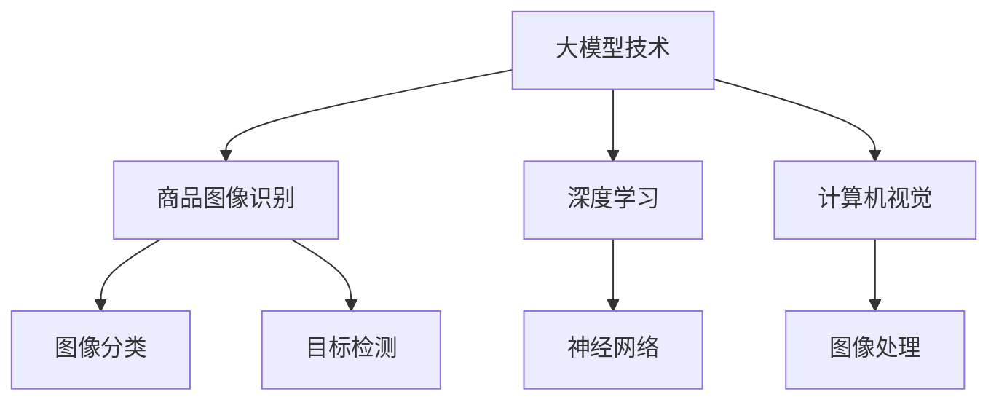

                 

# 大模型技术在电商平台商品图像识别中的应用

> 关键词：大模型技术,商品图像识别,电商,深度学习,计算机视觉,图像分类,目标检测

## 1. 背景介绍

随着电商行业的快速发展，商品图像识别成为了一个重要的应用场景。电商平台需要能够自动识别商品图片，快速完成商品信息的提取、分类和搜索，从而提升用户体验和运营效率。传统的图像识别方法依赖于手工设计的特征提取器和分类器，容易出现过拟合、泛化能力弱等问题。近年来，随着深度学习技术的兴起，基于大模型的图像识别方法逐步崭露头角，取得了显著的进步。

大模型，尤其是预训练的大型计算机视觉模型（如ResNet、VGG、Inception、EfficientNet等），通过在大规模图像数据上进行自监督预训练，学习到了丰富的图像特征和语义信息。这些模型可以在少量标注数据上进行微调，快速适应新的图像识别任务。相比于传统的手工特征提取和分类器，基于大模型的图像识别方法具有更强的泛化能力和鲁棒性，可以处理更复杂的识别任务。

基于大模型技术在图像识别领域的成功应用，电商平台开始大规模部署这些技术，以提升商品图像识别的精度和效率。本文将详细探讨大模型技术在电商平台商品图像识别中的应用，包括其核心算法原理、具体操作步骤、应用场景、优缺点及未来展望。

## 2. 核心概念与联系

### 2.1 核心概念概述

为更好地理解大模型技术在商品图像识别中的应用，本节将介绍几个密切相关的核心概念：

- **大模型技术**：指基于深度学习模型，通过在大规模数据集上进行自监督预训练，学习通用的图像特征和语义表示，从而提升模型在特定任务上的性能。
- **商品图像识别**：电商平台利用图像识别技术自动识别商品图片，完成商品信息的提取、分类和搜索，提升用户体验和运营效率。
- **深度学习**：一类基于神经网络结构的机器学习算法，通过多层非线性变换提取数据特征，广泛应用于图像识别、自然语言处理等领域。
- **计算机视觉**：研究如何使计算机“看”的能力，包括图像分类、目标检测、语义分割等任务，是人工智能的重要分支。
- **图像分类**：将图像分为不同的类别，是计算机视觉中最为基础且广泛应用的任务。
- **目标检测**：识别图像中的物体并定位其位置，常用于实时监控、自动驾驶等领域。

这些核心概念之间的逻辑关系可以通过以下Mermaid流程图来展示：



这个流程图展示了大模型技术的核心概念及其之间的关系：

1. 大模型技术通过深度学习网络进行自监督预训练，学习图像特征。
2. 深度学习网络包括卷积神经网络(CNN)、循环神经网络(RNN)等，在图像分类和目标检测等任务中具有卓越性能。
3. 计算机视觉利用深度学习进行图像处理和理解，目标检测是其中的重要分支。
4. 商品图像识别包括图像分类和目标检测，是计算机视觉在电商中的应用。

## 3. 核心算法原理 & 具体操作步骤
### 3.1 算法原理概述

基于大模型的商品图像识别，本质上是一个有监督的细粒度迁移学习过程。其核心思想是：将大模型视作一个强大的“特征提取器”，通过在商品图像数据集上进行有监督的微调，使得模型输出能够匹配商品类别标签，从而获得针对特定任务优化的模型。

形式化地，假设大模型为 $M_{\theta}$，其中 $\theta$ 为预训练得到的模型参数。给定商品图像数据集 $D=\{(x_i, y_i)\}_{i=1}^N$，其中 $x_i$ 为商品图片，$y_i$ 为商品类别标签，微调的目标是找到新的模型参数 $\hat{\theta}$，使得：

$$
\hat{\theta}=\mathop{\arg\min}_{\theta} \mathcal{L}(M_{\theta},D)
$$

其中 $\mathcal{L}$ 为针对商品分类任务的损失函数，用于衡量模型预测输出与真实标签之间的差异。常见的损失函数包括交叉熵损失、均方误差损失等。

通过梯度下降等优化算法，微调过程不断更新模型参数 $\theta$，最小化损失函数 $\mathcal{L}$，使得模型输出逼近真实标签。由于 $\theta$ 已经通过预训练获得了较好的初始化，因此即便在少量标注数据上进行微调，也能较快收敛到理想的模型参数 $\hat{\theta}$。

### 3.2 算法步骤详解

基于大模型的商品图像识别一般包括以下几个关键步骤：

**Step 1: 准备预训练模型和数据集**
- 选择合适的预训练图像模型 $M_{\theta}$ 作为初始化参数，如 ResNet、VGG、EfficientNet 等。
- 准备商品图像数据集 $D$，划分为训练集、验证集和测试集。一般要求标注数据与预训练数据的分布不要差异过大。

**Step 2: 添加任务适配层**
- 根据任务类型，在预训练模型顶层设计合适的输出层和损失函数。
- 对于分类任务，通常在顶层添加线性分类器和交叉熵损失函数。
- 对于检测任务，通常使用区域提议网络(RPN)、Faster R-CNN等检测框架，以YOLO、SSD等方法为候选检测器，并以均方误差损失或交叉熵损失为检测任务的目标函数。

**Step 3: 设置微调超参数**
- 选择合适的优化算法及其参数，如 AdamW、SGD 等，设置学习率、批大小、迭代轮数等。
- 设置正则化技术及强度，包括权重衰减、Dropout、Early Stopping等。
- 确定冻结预训练参数的策略，如仅微调顶层，或全部参数都参与微调。

**Step 4: 执行梯度训练**
- 将训练集数据分批次输入模型，前向传播计算损失函数。
- 反向传播计算参数梯度，根据设定的优化算法和学习率更新模型参数。
- 周期性在验证集上评估模型性能，根据性能指标决定是否触发 Early Stopping。
- 重复上述步骤直到满足预设的迭代轮数或 Early Stopping 条件。

**Step 5: 测试和部署**
- 在测试集上评估微调后模型 $M_{\hat{\theta}}$ 的性能，对比微调前后的精度提升。
- 使用微调后的模型对新样本进行推理预测，集成到实际的应用系统中。
- 持续收集新的数据，定期重新微调模型，以适应数据分布的变化。

以上是基于大模型的商品图像识别的微调过程的一般流程。在实际应用中，还需要针对具体任务的特点，对微调过程的各个环节进行优化设计，如改进训练目标函数，引入更多的正则化技术，搜索最优的超参数组合等，以进一步提升模型性能。

### 3.3 算法优缺点

基于大模型的商品图像识别方法具有以下优点：
1. 简单高效。只需准备少量标注数据，即可对预训练模型进行快速适配，获得较大的性能提升。
2. 通用适用。适用于各种电商商品图像分类和目标检测任务，设计简单的任务适配层即可实现微调。
3. 参数高效。利用参数高效微调技术，在固定大部分预训练参数的情况下，仍可取得不错的提升。
4. 效果显著。在学术界和工业界的诸多商品图像识别任务上，基于微调的方法已经刷新了最先进的性能指标。

同时，该方法也存在一定的局限性：
1. 依赖标注数据。微调的效果很大程度上取决于标注数据的质量和数量，获取高质量标注数据的成本较高。
2. 迁移能力有限。当目标任务与预训练数据的分布差异较大时，微调的性能提升有限。
3. 负面效果传递。预训练模型的固有偏见、有害信息等，可能通过微调传递到下游任务，造成负面影响。
4. 可解释性不足。微调模型的决策过程通常缺乏可解释性，难以对其推理逻辑进行分析和调试。

尽管存在这些局限性，但就目前而言，基于大模型的微调方法仍是大规模图像识别应用的主流范式。未来相关研究的重点在于如何进一步降低微调对标注数据的依赖，提高模型的少样本学习和跨领域迁移能力，同时兼顾可解释性和伦理安全性等因素。

### 3.4 算法应用领域

基于大模型的商品图像识别方法在电商平台中已经得到了广泛的应用，覆盖了商品分类、商品布局、智能推荐等多个环节，为电商平台的运营带来了显著的提升。

具体而言，大模型技术可以应用于：

- **商品分类**：自动识别商品图片，并进行分类。电商平台可以利用此功能进行商品搜索、自动补货等。
- **商品布局识别**：识别货架上的商品布局，帮助顾客更快找到商品。例如，检测并记录商品陈列情况，用于优化货架布局。
- **智能推荐**：根据用户浏览和购买历史，推荐相关商品。大模型可以从图像中提取用户的兴趣信息，提升推荐效果。

除了上述这些经典任务外，大模型技术还被创新性地应用于更多场景中，如安全监控、库存管理、机器人导购等，为电商平台的数字化转型提供了新的动力。

## 4. 数学模型和公式 & 详细讲解  
### 4.1 数学模型构建

本节将使用数学语言对基于大模型的商品图像识别过程进行更加严格的刻画。

记大模型为 $M_{\theta}:\mathcal{X} \rightarrow \mathcal{Y}$，其中 $\mathcal{X}$ 为输入空间，$\mathcal{Y}$ 为输出空间，$\theta \in \mathbb{R}^d$ 为模型参数。假设微调任务的训练集为 $D=\{(x_i,y_i)\}_{i=1}^N, x_i \in \mathcal{X}, y_i \in \mathcal{Y}$。

定义模型 $M_{\theta}$ 在输入 $x$ 上的损失函数为 $\ell(M_{\theta}(x),y)$，则在数据集 $D$ 上的经验风险为：

$$
\mathcal{L}(\theta) = \frac{1}{N} \sum_{i=1}^N \ell(M_{\theta}(x_i),y_i)
$$

微调的优化目标是最小化经验风险，即找到最优参数：

$$
\theta^* = \mathop{\arg\min}_{\theta} \mathcal{L}(\theta)
$$

在实践中，我们通常使用基于梯度的优化算法（如SGD、Adam等）来近似求解上述最优化问题。设 $\eta$ 为学习率，$\lambda$ 为正则化系数，则参数的更新公式为：

$$
\theta \leftarrow \theta - \eta \nabla_{\theta}\mathcal{L}(\theta) - \eta\lambda\theta
$$

其中 $\nabla_{\theta}\mathcal{L}(\theta)$ 为损失函数对参数 $\theta$ 的梯度，可通过反向传播算法高效计算。

### 4.2 公式推导过程

以下我们以图像分类任务为例，推导交叉熵损失函数及其梯度的计算公式。

假设模型 $M_{\theta}$ 在输入 $x$ 上的输出为 $\hat{y}=M_{\theta}(x) \in [0,1]$，表示样本属于类别 $y$ 的概率。真实标签 $y \in \{1,0\}$。则二分类交叉熵损失函数定义为：

$$
\ell(M_{\theta}(x),y) = -[y\log \hat{y} + (1-y)\log (1-\hat{y})]
$$

将其代入经验风险公式，得：

$$
\mathcal{L}(\theta) = -\frac{1}{N}\sum_{i=1}^N [y_i\log M_{\theta}(x_i)+(1-y_i)\log(1-M_{\theta}(x_i))]
$$

根据链式法则，损失函数对参数 $\theta_k$ 的梯度为：

$$
\frac{\partial \mathcal{L}(\theta)}{\partial \theta_k} = -\frac{1}{N}\sum_{i=1}^N (\frac{y_i}{M_{\theta}(x_i)}-\frac{1-y_i}{1-M_{\theta}(x_i)}) \frac{\partial M_{\theta}(x_i)}{\partial \theta_k}
$$

其中 $\frac{\partial M_{\theta}(x_i)}{\partial \theta_k}$ 可进一步递归展开，利用自动微分技术完成计算。

在得到损失函数的梯度后，即可带入参数更新公式，完成模型的迭代优化。重复上述过程直至收敛，最终得到适应商品分类任务的最优模型参数 $\theta^*$。

## 5. 项目实践：代码实例和详细解释说明
### 5.1 开发环境搭建

在进行商品图像识别微调实践前，我们需要准备好开发环境。以下是使用Python进行PyTorch开发的环境配置流程：

1. 安装Anaconda：从官网下载并安装Anaconda，用于创建独立的Python环境。

2. 创建并激活虚拟环境：
```bash
conda create -n pytorch-env python=3.8 
conda activate pytorch-env
```

3. 安装PyTorch：根据CUDA版本，从官网获取对应的安装命令。例如：
```bash
conda install pytorch torchvision torchaudio cudatoolkit=11.1 -c pytorch -c conda-forge
```

4. 安装Transformers库：
```bash
pip install transformers
```

5. 安装各类工具包：
```bash
pip install numpy pandas scikit-learn matplotlib tqdm jupyter notebook ipython
```

完成上述步骤后，即可在`pytorch-env`环境中开始微调实践。

### 5.2 源代码详细实现

这里我们以商品分类任务为例，给出使用Transformers库对ResNet模型进行微调的PyTorch代码实现。

首先，定义商品分类任务的数据处理函数：

```python
from transformers import ResNetForImageClassification, ResNetFeatureExtractor
from torch.utils.data import Dataset
import torch

class ImageDataset(Dataset):
    def __init__(self, images, labels, feature_extractor):
        self.images = images
        self.labels = labels
        self.feature_extractor = feature_extractor
        
    def __len__(self):
        return len(self.images)
    
    def __getitem__(self, item):
        image = self.images[item]
        label = self.labels[item]
        
        encoding = self.feature_extractor(image, return_tensors='pt')
        image_tensor = encoding['pixel_values']
        label_tensor = torch.tensor(label, dtype=torch.long)
        
        return {'pixel_values': image_tensor, 
                'labels': label_tensor}
        
# 定义特征提取器
feature_extractor = ResNetFeatureExtractor.from_pretrained('resnet50')
```

然后，定义模型和优化器：

```python
from transformers import AdamW

model = ResNetForImageClassification.from_pretrained('resnet50', num_labels=1000)

optimizer = AdamW(model.parameters(), lr=2e-5)
```

接着，定义训练和评估函数：

```python
from torch.utils.data import DataLoader
from tqdm import tqdm
from sklearn.metrics import classification_report

device = torch.device('cuda') if torch.cuda.is_available() else torch.device('cpu')
model.to(device)

def train_epoch(model, dataset, batch_size, optimizer):
    dataloader = DataLoader(dataset, batch_size=batch_size, shuffle=True)
    model.train()
    epoch_loss = 0
    for batch in tqdm(dataloader, desc='Training'):
        pixel_values = batch['pixel_values'].to(device)
        labels = batch['labels'].to(device)
        model.zero_grad()
        outputs = model(pixel_values)
        loss = outputs.loss
        epoch_loss += loss.item()
        loss.backward()
        optimizer.step()
    return epoch_loss / len(dataloader)

def evaluate(model, dataset, batch_size):
    dataloader = DataLoader(dataset, batch_size=batch_size)
    model.eval()
    preds, labels = [], []
    with torch.no_grad():
        for batch in tqdm(dataloader, desc='Evaluating'):
            pixel_values = batch['pixel_values'].to(device)
            labels = batch['labels'].to(device)
            batch_logits = model(pixel_values).logits
            preds.append(batch_logits.argmax(dim=1).to('cpu').tolist())
            labels.append(labels.to('cpu').tolist())
                
    print(classification_report(labels, preds))
```

最后，启动训练流程并在测试集上评估：

```python
epochs = 5
batch_size = 16

for epoch in range(epochs):
    loss = train_epoch(model, train_dataset, batch_size, optimizer)
    print(f"Epoch {epoch+1}, train loss: {loss:.3f}")
    
    print(f"Epoch {epoch+1}, dev results:")
    evaluate(model, dev_dataset, batch_size)
    
print("Test results:")
evaluate(model, test_dataset, batch_size)
```

以上就是使用PyTorch对ResNet进行商品分类任务微调的完整代码实现。可以看到，得益于Transformers库的强大封装，我们可以用相对简洁的代码完成ResNet模型的加载和微调。

### 5.3 代码解读与分析

让我们再详细解读一下关键代码的实现细节：

**ImageDataset类**：
- `__init__`方法：初始化图像、标签、特征提取器等关键组件。
- `__len__`方法：返回数据集的样本数量。
- `__getitem__`方法：对单个样本进行处理，将图像输入转换为特征向量，标签转换为Tensor，并对其进行定长padding，最终返回模型所需的输入。

**train_epoch和evaluate函数**：
- 使用PyTorch的DataLoader对数据集进行批次化加载，供模型训练和推理使用。
- 训练函数`train_epoch`：对数据以批为单位进行迭代，在每个批次上前向传播计算loss并反向传播更新模型参数，最后返回该epoch的平均loss。
- 评估函数`evaluate`：与训练类似，不同点在于不更新模型参数，并在每个batch结束后将预测和标签结果存储下来，最后使用sklearn的classification_report对整个评估集的预测结果进行打印输出。

**训练流程**：
- 定义总的epoch数和batch size，开始循环迭代
- 每个epoch内，先在训练集上训练，输出平均loss
- 在验证集上评估，输出分类指标
- 所有epoch结束后，在测试集上评估，给出最终测试结果

可以看到，PyTorch配合Transformers库使得ResNet微调的商品分类任务代码实现变得简洁高效。开发者可以将更多精力放在数据处理、模型改进等高层逻辑上，而不必过多关注底层的实现细节。

当然，工业级的系统实现还需考虑更多因素，如模型的保存和部署、超参数的自动搜索、更灵活的任务适配层等。但核心的微调范式基本与此类似。

## 6. 实际应用场景
### 6.1 智能货架管理

智能货架管理系统通过实时监控和分析货架上的商品布局，可以显著提高仓储和物流效率。传统人工记录和监控方式不仅耗时耗力，且容易出错。基于大模型的图像识别技术，可以自动识别和记录商品位置信息，帮助企业快速发现库存空缺、滞销商品等，优化货架布局。

具体而言，电商企业可以通过摄像头监控货架，拍摄商品图片。利用大模型进行图像识别，实时更新商品位置数据库。同时，根据历史销售数据和用户购买行为，预测商品需求量，提前补充商品，减少库存积压和缺货情况。

### 6.2 智能客服推荐

电商平台的智能客服系统可以根据用户的历史浏览和购买行为，推荐相关商品。基于大模型的图像识别技术可以从用户浏览的商品图片中提取视觉特征，帮助智能客服系统更准确地理解用户的兴趣偏好。

在实现上，智能客服系统可以记录用户浏览的商品图片，使用大模型进行视觉特征提取和分类，建立用户兴趣画像。根据用户画像，实时推荐相关商品，提升用户体验和购买转化率。

### 6.3 供应链管理

大模型的图像识别技术可以应用于供应链管理，提高库存管理和物流效率。例如，通过实时监控仓库中的商品库存，可以动态调整采购计划，减少库存积压和缺货情况。

在具体应用中，电商企业可以在仓库中使用摄像头监控商品库存，拍摄商品图片。利用大模型进行图像识别，实时更新库存数据库。同时，根据历史销售数据和库存情况，优化采购计划，提高供应链管理效率。

### 6.4 未来应用展望

随着大模型技术的发展，基于商品图像识别的应用场景将更加广泛。未来，大模型技术将进一步提升电商平台的运营效率，推动智能货架、智能客服、供应链管理等多个环节的数字化升级。

此外，大模型技术还将在其他行业得到应用，如零售、制造、医疗等。例如，在医疗领域，大模型可以从X光片、CT扫描中自动识别和分类疾病类型，提高医疗诊断效率和准确性。在制造领域，大模型可以识别零件质量，提高生产效率和产品质量。

总之，大模型技术在商品图像识别中的应用前景广阔，未来将为更多行业带来数字化转型的新机遇。

## 7. 工具和资源推荐
### 7.1 学习资源推荐

为了帮助开发者系统掌握大模型技术在商品图像识别中的应用，这里推荐一些优质的学习资源：

1. **《Deep Learning with PyTorch》**：由Ian Goodfellow、Yoshua Bengio和Aaron Courville所著，全面介绍了深度学习的基本概念和PyTorch框架的使用。适合入门者阅读。
2. **CS231n《Convolutional Neural Networks for Visual Recognition》**：斯坦福大学开设的计算机视觉课程，涵盖了CNN网络的结构、训练、应用等多个方面，是计算机视觉领域的经典教材。
3. **Transformers官方文档**：HuggingFace官方文档，提供了大量预训练模型和微调样例代码，是使用大模型技术进行商品图像识别的重要资源。
4. **Kaggle竞赛**：Kaggle平台上有许多与商品图像识别相关的竞赛，通过参与竞赛可以学习到最新的技术和实践经验。
5. **论文阅读**：阅读前沿论文，了解大模型技术在商品图像识别中的最新进展。例如，ICCV、CVPR等顶级会议的论文，可以提供最新研究思路和方法。

通过对这些资源的学习实践，相信你一定能够快速掌握大模型技术在商品图像识别中的应用，并用于解决实际的电商问题。
###  7.2 开发工具推荐

高效的开发离不开优秀的工具支持。以下是几款用于大模型技术商品图像识别开发的常用工具：

1. **PyTorch**：基于Python的开源深度学习框架，灵活动态的计算图，适合快速迭代研究。
2. **TensorFlow**：由Google主导开发的开源深度学习框架，生产部署方便，适合大规模工程应用。
3. **Transformers库**：HuggingFace开发的NLP工具库，集成了大量SOTA模型，支持PyTorch和TensorFlow，是进行商品图像识别微调任务开发的利器。
4. **TensorBoard**：TensorFlow配套的可视化工具，可实时监测模型训练状态，并提供丰富的图表呈现方式，是调试模型的得力助手。
5. **Weights & Biases**：模型训练的实验跟踪工具，可以记录和可视化模型训练过程中的各项指标，方便对比和调优。

合理利用这些工具，可以显著提升大模型技术商品图像识别的开发效率，加快创新迭代的步伐。

### 7.3 相关论文推荐

大模型技术在商品图像识别领域的成功应用，得益于学界的持续研究。以下是几篇奠基性的相关论文，推荐阅读：

1. **ResNet：Deep Residual Learning for Image Recognition**：提出ResNet结构，通过残差连接解决深度网络的退化问题，提升了深度网络在图像分类任务上的性能。
2. **VGG：Very Deep Convolutional Networks for Large-Scale Image Recognition**：提出VGG网络，通过多层堆叠卷积层，提升了深度网络在图像分类任务上的精度。
3. **EfficientNet：Rethinking Model Scaling for Convolutional Neural Networks**：提出EfficientNet网络，通过综合网络深度、宽度、分辨率的自动缩放策略，实现了在参数量不变的情况下，显著提升网络性能。
4. **ImageNet Large Scale Visual Recognition Challenge (ILSVRC)**：每年举办的大型图像识别竞赛，推动了深度学习在图像识别领域的发展，催生了多个经典模型。
5. **Semantic Image Segmentation with Deep Convolutional Nets, Atrous Convolutions and Fully Connected CRFs**：提出Atrous卷积和CRF模型，提升了语义分割任务的精度。

这些论文代表了大模型技术在商品图像识别领域的进步。通过学习这些前沿成果，可以帮助研究者把握学科前进方向，激发更多的创新灵感。

## 8. 总结：未来发展趋势与挑战

### 8.1 总结

本文对大模型技术在电商平台商品图像识别中的应用进行了全面系统的介绍。首先阐述了大模型技术在图像识别领域的成功应用，明确了其简单高效、通用适用、参数高效、效果显著等优点。其次，从原理到实践，详细讲解了微调的过程和操作步骤，给出了商品分类任务的代码实现。同时，本文还探讨了大模型技术在智能货架、智能客服、供应链管理等实际应用场景中的应用，展示了其广泛的应用前景。

通过本文的系统梳理，可以看到，大模型技术在商品图像识别中的应用前景广阔，其高效、灵活、泛化能力强等优点，使其在电商平台中取得了显著的成效。未来，随着大模型技术的进一步发展和优化，其应用范围将更加广泛，推动更多行业实现数字化转型。

### 8.2 未来发展趋势

展望未来，大模型技术在商品图像识别领域的发展将呈现以下几个趋势：

1. **模型规模持续增大**：随着算力成本的下降和数据规模的扩张，预训练大模型的参数量还将持续增长。超大模型的语言和视觉特征能力更强，有望进一步提升商品图像识别的精度和效率。
2. **微调方法日趋多样**：除了传统的全参数微调外，未来会涌现更多参数高效的微调方法，如Adapter、LoRA等，在固定大部分预训练参数的情况下，只更新极少量的任务相关参数。
3. **持续学习成为常态**：随着数据分布的不断变化，微调模型也需要持续学习新知识以保持性能。如何在不遗忘原有知识的同时，高效吸收新样本信息，将成为重要的研究课题。
4. **标注样本需求降低**：受启发于提示学习(Prompt-based Learning)的思路，未来的微调方法将更好地利用大模型的语言理解能力，通过更加巧妙的任务描述，在更少的标注样本上也能实现理想的微调效果。
5. **跨模态融合**：将视觉、文本等多模态信息进行融合，可以提升商品图像识别的精度和鲁棒性。例如，结合用户评论、产品标签等文本信息，进一步提升商品识别的准确性。

这些趋势凸显了大模型技术在商品图像识别领域的广阔前景。这些方向的探索发展，必将进一步提升商品图像识别的精度和效率，为电商平台带来更大的商业价值。

### 8.3 面临的挑战

尽管大模型技术在商品图像识别领域取得了显著的进展，但在迈向更加智能化、普适化应用的过程中，它仍面临着诸多挑战：

1. **标注成本瓶颈**：尽管微调方法可以大大降低标注数据的需求，但对于长尾应用场景，难以获得充足的高质量标注数据，成为制约微调性能的瓶颈。如何进一步降低微调对标注样本的依赖，将是一大难题。
2. **模型鲁棒性不足**：当前微调模型面对域外数据时，泛化性能往往大打折扣。对于测试样本的微小扰动，微调模型的预测也容易发生波动。如何提高微调模型的鲁棒性，避免灾难性遗忘，还需要更多理论和实践的积累。
3. **推理效率有待提高**：大规模语言模型虽然精度高，但在实际部署时往往面临推理速度慢、内存占用大等效率问题。如何在保证性能的同时，简化模型结构，提升推理速度，优化资源占用，将是重要的优化方向。
4. **可解释性亟需加强**：当前微调模型更像是"黑盒"系统，难以解释其内部工作机制和决策逻辑。对于医疗、金融等高风险应用，算法的可解释性和可审计性尤为重要。如何赋予微调模型更强的可解释性，将是亟待攻克的难题。
5. **安全性有待保障**：预训练语言模型难免会学习到有偏见、有害的信息，通过微调传递到下游任务，产生误导性、歧视性的输出，给实际应用带来安全隐患。如何从数据和算法层面消除模型偏见，避免恶意用途，确保输出的安全性，也将是重要的研究课题。

尽管存在这些挑战，但大模型技术在商品图像识别领域的应用前景依然广阔。相信随着学界和产业界的共同努力，这些挑战终将一一被克服，大模型技术必将在商品图像识别中发挥更大的作用。

### 8.4 研究展望

面对大模型技术在商品图像识别领域面临的挑战，未来的研究需要在以下几个方面寻求新的突破：

1. **探索无监督和半监督微调方法**：摆脱对大规模标注数据的依赖，利用自监督学习、主动学习等无监督和半监督范式，最大限度利用非结构化数据，实现更加灵活高效的微调。
2. **研究参数高效和计算高效的微调范式**：开发更加参数高效的微调方法，在固定大部分预训练参数的情况下，只更新极少量的任务相关参数。同时优化微调模型的计算图，减少前向传播和反向传播的资源消耗，实现更加轻量级、实时性的部署。
3. **引入因果推断和对比学习范式**：通过引入因果推断和对比学习思想，增强微调模型建立稳定因果关系的能力，学习更加普适、鲁棒的语言表征，从而提升模型泛化性和抗干扰能力。
4. **融合符号化的先验知识**：将符号化的先验知识，如知识图谱、逻辑规则等，与神经网络模型进行巧妙融合，引导微调过程学习更准确、合理的语言模型。同时加强不同模态数据的整合，实现视觉、文本信息的协同建模。
5. **结合因果分析和博弈论工具**：将因果分析方法引入微调模型，识别出模型决策的关键特征，增强输出解释的因果性和逻辑性。借助博弈论工具刻画人机交互过程，主动探索并规避模型的脆弱点，提高系统稳定性。
6. **纳入伦理道德约束**：在模型训练目标中引入伦理导向的评估指标，过滤和惩罚有偏见、有害的输出倾向。同时加强人工干预和审核，建立模型行为的监管机制，确保输出符合人类价值观和伦理道德。

这些研究方向将推动大模型技术在商品图像识别领域的进一步发展，为电商平台带来更大的商业价值，同时也为其他行业带来新的应用前景。通过不断创新和突破，相信大模型技术必将在构建人机协同的智能时代中扮演越来越重要的角色。

## 9. 附录：常见问题与解答

**Q1：大模型技术在商品图像识别中是否适用于所有电商场景？**

A: 大模型技术在商品图像识别中具有广泛的应用前景，但不同电商场景对商品图像的需求和特点差异较大。例如，时尚电商商品类别多样，特征复杂，需要更为精细化的图像处理和分类；而B2B电商则更注重商品的尺寸、材质、功能等属性信息，需要更准确的目标检测。因此，大模型技术在具体应用时，需要根据不同的电商场景，选择和优化相应的预训练模型和微调方法。

**Q2：如何选择合适的预训练模型？**

A: 选择预训练模型应考虑以下几个因素：
1. **数据分布**：预训练数据与目标任务的分布越相似，模型的泛化能力越强。因此，应尽量选择与目标任务相似的数据集预训练的模型。
2. **任务复杂度**：对于复杂任务，应选择参数量较大、结构较为复杂的模型，以提高模型的表达能力。
3. **训练资源**：对于资源有限的场景，应选择参数量较小、计算速度较快的模型，以节省计算资源。

例如，对于商品分类任务，可以选择参数量较大的ResNet、EfficientNet等模型，而对于目标检测任务，可以选择结构更为复杂、速度较快的Faster R-CNN、YOLO等模型。

**Q3：微调过程中如何进行数据增强？**

A: 数据增强是提高模型泛化能力的重要手段，常见的数据增强方法包括：
1. **随机裁剪**：对图像进行随机裁剪，生成多个不同尺寸的图像。
2. **随机翻转**：对图像进行水平或垂直翻转，增加数据多样性。
3. **随机旋转**：对图像进行随机旋转，增加数据的多角度信息。
4. **随机亮度、对比度调节**：对图像进行亮度、对比度等调节，增加数据的光照变化。

通过这些方法，可以在训练集中生成更多的样本，提高模型的泛化能力。

**Q4：微调过程中如何进行超参数调优？**

A: 超参数调优是微调过程中的重要环节，常见的超参数包括学习率、批大小、迭代轮数、正则化系数等。超参数调优方法包括：
1. **网格搜索**：在预设的超参数范围内，通过网格搜索找到最优的超参数组合。
2. **随机搜索**：在预设的超参数范围内，通过随机采样找到最优的超参数组合。
3. **贝叶斯优化**：利用贝叶斯优化方法，在较少的迭代次数内找到最优的超参数组合。
4. **学习率调度**：在训练过程中动态调整学习率，避免过拟合或梯度消失等问题。

通过这些方法，可以在较少的训练样本上找到最优的超参数组合，提升模型的性能。

**Q5：微调后的模型如何部署？**

A: 微调后的模型可以部署到各种计算平台，包括GPU、TPU、CPU等。常见的部署方式包括：
1. **单机部署**：在单台服务器上部署模型，适用于小规模应用。
2. **分布式部署**：在多台服务器上分布式部署模型，适用于大规模应用。
3. **云服务部署**：将模型部署到云服务平台上，如AWS、Google Cloud等，实现灵活的资源管理和扩展。

在部署过程中，应考虑模型的推理速度、内存占用、计算资源等问题，选择适合的计算平台和部署方式。

**Q6：微调后的模型如何优化？**

A: 微调后的模型优化主要包括以下几个方面：
1. **模型压缩**：通过剪枝、量化等方法，减小模型的参数量和计算资源消耗，提高模型的推理速度。
2. **模型加速**：通过模型并行、硬件加速等方法，提高模型的计算速度和资源利用率。
3. **模型融合**：将多个模型进行融合，提升模型的泛化能力和鲁棒性。
4. **模型微调**：在新的数据上进行微调，提升模型的实时更新能力。

通过这些优化方法，可以在保证模型性能的同时，提升模型的效率和可维护性。

**Q7：微调后的模型如何测试和验证？**

A: 微调后的模型测试和验证主要包括以下几个步骤：
1. **数据划分**：将数据集划分为训练集、验证集和测试集，确保各集之间互不重叠。
2. **性能评估**：在测试集上评估模型的性能，包括准确率、召回率、F1分数等指标。
3. **异常检测**：在测试集上检测模型的异常表现，如过拟合、欠拟合等，及时进行调整。
4. **对比实验**：与未微调的模型进行对比实验，评估微调的效果。

通过这些步骤，可以全面评估微调模型的性能和效果，确保其在实际应用中的稳定性。

---

作者：禅与计算机程序设计艺术 / Zen and the Art of Computer Programming

