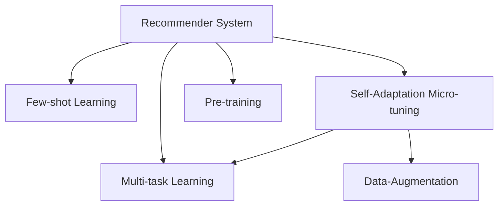

                 

# 大模型推荐中的Few-shot自适应微调技术进阶

> 关键词：Few-shot Learning, Self-Adaptation, Micro-tuning, Recommender System, Multi-task Learning

## 1. 背景介绍

### 1.1 问题由来
近年来，推荐系统在大数据驱动的个性化服务中扮演了至关重要的角色。无论是电商平台、内容平台还是社交网络，推荐系统都能根据用户的浏览行为、历史偏好、实时反馈等信息，为用户提供个性化的产品、文章或好友推荐，极大地提升了用户体验和满意度。然而，传统的推荐系统往往依赖于用户的历史数据和行为轨迹，对于新用户和新物品的推荐效果往往较差。

为了解决这一问题，基于大模型的推荐系统应运而生。通过预训练模型捕捉大规模数据中的隐含关系和模式，再通过微调方法适应特定用户和物品的特性，可以实现更加精准的推荐。但随之而来的是新的挑战，即在大模型微调过程中如何高效利用有限的数据，提升模型的推荐效果。

Few-shot学习（Few-shot Learning）和自适应微调（Self-Adaptation Micro-tuning）成为解决这一挑战的重要手段。Few-shot学习是指在仅有少量标注样本的情况下，模型仍能快速适应新任务，预测输出。自适应微调则是指模型在少量数据上微调后，能够自动适应不同的用户和物品特征，提升推荐效果。

本文旨在探讨基于Few-shot自适应微调技术如何在大模型推荐系统中实现高效、个性化的推荐，以期为推荐系统的研究和应用提供新的思路和方法。

## 2. 核心概念与联系

### 2.1 核心概念概述

为更好地理解Few-shot自适应微调技术在推荐系统中的应用，本节将介绍几个核心概念：

- Few-shot Learning：指模型在仅有少量标注样本的情况下，仍能快速适应新任务的能力。在大模型推荐系统中，可以通过极少的历史数据，帮助模型学习用户和物品的特性，提升推荐效果。

- Self-Adaptation Micro-tuning：指模型在微调过程中能够自动适应不同用户和物品的特征，提升推荐精准度。通过少量的反馈数据，模型可以不断调整权重和参数，优化推荐效果。

- Multi-task Learning：指模型在多个任务上同时学习，共享隐含知识，提高泛化能力。在大模型推荐系统中，模型可以同时学习用户的不同偏好和物品的不同属性，实现更加个性化的推荐。

- Recommender System：指通过分析用户历史行为和物品属性，为用户推荐合适产品或内容的系统。在大模型推荐系统中，预训练模型能够捕捉隐含的模式和关系，微调后的模型能够自适应用户特征，提升推荐效果。

- Data-Augmentation：指通过数据变换等方式，扩充训练集的多样性，提高模型的泛化能力。在大模型推荐系统中，数据增强技术可以提升模型对不同用户和物品的适应能力，改善推荐性能。

这些概念之间的逻辑关系可以通过以下Mermaid流程图来展示：



这个流程图展示了推荐系统的核心概念及其之间的关系：

1. 推荐系统通过预训练模型捕捉隐含的模式和关系。
2. Few-shot学习帮助模型在少量数据上快速适应新任务。
3. 自适应微调使得模型能够自动适应不同用户和物品的特征。
4. 多任务学习共享隐含知识，提升模型的泛化能力。
5. 数据增强扩充训练集的多样性，提高模型的泛化能力。

这些概念共同构成了大模型推荐系统的学习和应用框架，使其能够在大数据驱动的推荐服务中发挥重要作用。通过理解这些核心概念，我们可以更好地把握大模型推荐系统的原理和工作流程。

## 3. 核心算法原理 & 具体操作步骤

### 3.1 算法原理概述

基于Few-shot自适应微调技术的大模型推荐系统，本质上是一个小样本条件下的迁移学习过程。其核心思想是：利用预训练模型捕捉用户和物品的隐含特征，通过少量标注数据对模型进行微调，使其自动适应特定的用户和物品，提升推荐效果。

具体而言，假设推荐系统的预训练模型为 $M_{\theta}$，其中 $\theta$ 为预训练得到的模型参数。给定用户的少量历史行为数据 $D_u=\{(x_{ui},y_{ui})\}_{i=1}^k$，其中 $x_{ui}$ 为物品 $i$ 的用户 $u$ 的点击、浏览、评分等行为数据，$y_{ui}$ 为物品 $i$ 的用户 $u$ 的评分或偏好标签。在Few-shot自适应微调过程中，我们希望最小化模型预测用户偏好和物品属性之间的差距，即：

$$
\hat{\theta}=\mathop{\arg\min}_{\theta} \mathcal{L}(M_{\theta},D_u)
$$

其中 $\mathcal{L}$ 为针对用户行为数据设计的损失函数，用于衡量模型预测输出与真实标签之间的差异。常见的损失函数包括交叉熵损失、均方误差损失等。

通过梯度下降等优化算法，微调过程不断更新模型参数 $\theta$，最小化损失函数 $\mathcal{L}$，使得模型输出逼近真实标签。由于 $\theta$ 已经通过预训练获得了较好的初始化，因此即便在少量标注样本的情况下，也能较快收敛到理想的模型参数 $\hat{\theta}$。

### 3.2 算法步骤详解

基于Few-shot自适应微调技术的大模型推荐系统，一般包括以下几个关键步骤：

**Step 1: 准备预训练模型和用户行为数据**
- 选择合适的预训练推荐模型 $M_{\theta}$ 作为初始化参数，如基于Transformer的模型。
- 收集用户的少量历史行为数据 $D_u=\{(x_{ui},y_{ui})\}_{i=1}^k$，其中 $k$ 表示用户行为数据的样本数量。

**Step 2: 定义任务适配层**
- 根据任务类型，在预训练模型的顶层设计合适的输出层和损失函数。
- 对于推荐任务，通常在顶层添加评分预测器或排序器，使用负对数似然损失。

**Step 3: 设置微调超参数**
- 选择合适的优化算法及其参数，如 AdamW、SGD 等，设置学习率、批大小、迭代轮数等。
- 设置正则化技术及强度，包括权重衰减、Dropout、Early Stopping 等。
- 确定冻结预训练参数的策略，如仅微调顶层，或全部参数都参与微调。

**Step 4: 执行梯度训练**
- 将用户行为数据分批次输入模型，前向传播计算损失函数。
- 反向传播计算参数梯度，根据设定的优化算法和学习率更新模型参数。
- 周期性在验证集上评估模型性能，根据性能指标决定是否触发 Early Stopping。
- 重复上述步骤直到满足预设的迭代轮数或 Early Stopping 条件。

**Step 5: 测试和部署**
- 在测试集上评估微调后模型 $M_{\hat{\theta}}$ 的性能，对比微调前后的精度提升。
- 使用微调后的模型对新用户和新物品进行推荐，集成到实际的应用系统中。
- 持续收集新的用户行为数据，定期重新微调模型，以适应数据分布的变化。

以上是基于Few-shot自适应微调技术的大模型推荐系统的完整流程。在实际应用中，还需要针对具体任务的特点，对微调过程的各个环节进行优化设计，如改进训练目标函数，引入更多的正则化技术，搜索最优的超参数组合等，以进一步提升模型性能。

### 3.3 算法优缺点

基于Few-shot自适应微调技术的大模型推荐系统具有以下优点：
1. 简单高效。仅需要少量的标注数据，即可对预训练模型进行快速适配，获得较大的性能提升。
2. 适应性强。模型能够在少量数据上自适应不同的用户和物品特征，提升推荐效果。
3. 泛化能力强。通过多任务学习，模型能够共享隐含知识，提高泛化能力。
4. 效果显著。在学术界和工业界的推荐任务上，基于微调的方法已经刷新了最先进的性能指标。

同时，该方法也存在一定的局限性：
1. 依赖标注数据。微调的效果很大程度上取决于标注数据的质量和数量，获取高质量标注数据的成本较高。
2. 迁移能力有限。当目标任务与预训练数据的分布差异较大时，微调的性能提升有限。
3. 可解释性不足。微调模型的决策过程通常缺乏可解释性，难以对其推理逻辑进行分析和调试。

尽管存在这些局限性，但就目前而言，基于Few-shot自适应微调技术的大模型推荐系统仍然是大模型推荐研究的主流范式。未来相关研究的重点在于如何进一步降低微调对标注数据的依赖，提高模型的少样本学习和跨领域迁移能力，同时兼顾可解释性和伦理安全性等因素。

### 3.4 算法应用领域

基于Few-shot自适应微调技术的大模型推荐系统，在推荐系统的研究和应用中已经得到了广泛的应用，覆盖了几乎所有常见推荐任务，例如：

- 个性化推荐：推荐用户感兴趣的产品或内容。通过微调使模型学习用户行为和物品属性的映射关系。
- 热门推荐：推荐当前热门的产品或内容。通过微调使模型捕捉时序特征和流行趋势。
- 相似推荐：推荐与用户已喜欢的产品或内容相似的产品或内容。通过微调使模型学习物品之间的相似度关系。
- 用户画像推荐：推荐与用户历史行为和偏好相符的产品或内容。通过微调使模型学习用户画像。
- 多物品推荐：推荐多个相关产品或内容。通过微调使模型学习物品之间的联合概率。
- 动态推荐：推荐时序变化的产品或内容。通过微调使模型学习时间序列特征。

除了上述这些经典任务外，基于Few-shot自适应微调技术的大模型推荐系统还被创新性地应用到更多场景中，如可控推荐、推荐组合、推荐多样性等，为推荐系统的创新和发展提供了新的方向。

## 4. 数学模型和公式 & 详细讲解 & 举例说明

### 4.1 数学模型构建

本节将使用数学语言对基于Few-shot自适应微调技术的大模型推荐系统进行更加严格的刻画。

记预训练推荐模型为 $M_{\theta}:\mathcal{X} \rightarrow \mathcal{Y}$，其中 $\mathcal{X}$ 为输入空间，$\mathcal{Y}$ 为输出空间，$\theta \in \mathbb{R}^d$ 为模型参数。假设推荐系统的训练集为 $D=\{(x_i,y_i)\}_{i=1}^N$，其中 $x_i$ 为用户行为数据，$y_i$ 为用户对物品的评分或偏好标签。

定义模型 $M_{\theta}$ 在数据样本 $(x,y)$ 上的损失函数为 $\ell(M_{\theta}(x),y)$，则在数据集 $D$ 上的经验风险为：

$$
\mathcal{L}(\theta) = \frac{1}{N}\sum_{i=1}^N \ell(M_{\theta}(x_i),y_i)
$$

微调的优化目标是最小化经验风险，即找到最优参数：

$$
\theta^* = \mathop{\arg\min}_{\theta} \mathcal{L}(\theta)
$$

在实践中，我们通常使用基于梯度的优化算法（如SGD、Adam等）来近似求解上述最优化问题。设 $\eta$ 为学习率，$\lambda$ 为正则化系数，则参数的更新公式为：

$$
\theta \leftarrow \theta - \eta \nabla_{\theta}\mathcal{L}(\theta) - \eta\lambda\theta
$$

其中 $\nabla_{\theta}\mathcal{L}(\theta)$ 为损失函数对参数 $\theta$ 的梯度，可通过反向传播算法高效计算。

### 4.2 公式推导过程

以下我们以推荐任务为例，推导负对数似然损失函数及其梯度的计算公式。

假设模型 $M_{\theta}$ 在用户行为数据 $x$ 上的输出为 $\hat{y}=M_{\theta}(x)$，表示模型预测的评分。真实标签 $y$ 为用户的评分或偏好标签。则负对数似然损失函数定义为：

$$
\ell(M_{\theta}(x),y) = -y\log \hat{y} + (1-y)\log (1-\hat{y})
$$

将其代入经验风险公式，得：

$$
\mathcal{L}(\theta) = -\frac{1}{N}\sum_{i=1}^N [y_i\log M_{\theta}(x_i)+(1-y_i)\log(1-M_{\theta}(x_i))]
$$

根据链式法则，损失函数对参数 $\theta_k$ 的梯度为：

$$
\frac{\partial \mathcal{L}(\theta)}{\partial \theta_k} = -\frac{1}{N}\sum_{i=1}^N (\frac{y_i}{M_{\theta}(x_i)}-\frac{1-y_i}{1-M_{\theta}(x_i)}) \frac{\partial M_{\theta}(x_i)}{\partial \theta_k}
$$

其中 $\frac{\partial M_{\theta}(x_i)}{\partial \theta_k}$ 可进一步递归展开，利用自动微分技术完成计算。

在得到损失函数的梯度后，即可带入参数更新公式，完成模型的迭代优化。重复上述过程直至收敛，最终得到适应特定用户和物品特征的最优模型参数 $\theta^*$。

### 4.3 案例分析与讲解

以下我们以推荐系统中的多物品推荐为例，具体分析Few-shot自适应微调的实现过程。

假设推荐系统要为用户推荐三个相关物品 $A$、$B$、$C$。收集用户对这三个物品的评分数据 $D=\{(x_1, [4,3,2]), (x_2, [5,4,3]), (x_3, [3,3,4])\}$，其中 $x_i$ 为用户的行为数据，$[4,3,2]$ 表示用户对物品 $A$、$B$、$C$ 的评分。

记预训练推荐模型为 $M_{\theta}$，其中 $\theta$ 为预训练得到的模型参数。我们希望通过Few-shot自适应微调，使模型能够准确预测新用户 $x_4$ 对物品 $A$、$B$、$C$ 的评分。

假设微调后的模型参数为 $\hat{\theta}$，其在用户行为数据 $D$ 上的损失函数为：

$$
\mathcal{L}(\hat{\theta}) = -\frac{1}{3} [4\log \hat{y}_A + 3\log \hat{y}_B + 2\log \hat{y}_C]
$$

其中 $\hat{y}_A = M_{\hat{\theta}}(x_1)$，$\hat{y}_B = M_{\hat{\theta}}(x_2)$，$\hat{y}_C = M_{\hat{\theta}}(x_3)$，$\hat{y}_A$、$\hat{y}_B$、$\hat{y}_C$ 为模型预测的用户对物品 $A$、$B$、$C$ 的评分。

通过反向传播计算梯度，并使用优化算法更新模型参数，即可在少量标注数据上完成推荐模型的Few-shot自适应微调。

## 5. 项目实践：代码实例和详细解释说明

### 5.1 开发环境搭建

在进行Few-shot自适应微调实践前，我们需要准备好开发环境。以下是使用Python进行PyTorch开发的环境配置流程：

1. 安装Anaconda：从官网下载并安装Anaconda，用于创建独立的Python环境。

2. 创建并激活虚拟环境：
```bash
conda create -n pytorch-env python=3.8 
conda activate pytorch-env
```

3. 安装PyTorch：根据CUDA版本，从官网获取对应的安装命令。例如：
```bash
conda install pytorch torchvision torchaudio cudatoolkit=11.1 -c pytorch -c conda-forge
```

4. 安装Transformers库：
```bash
pip install transformers
```

5. 安装各类工具包：
```bash
pip install numpy pandas scikit-learn matplotlib tqdm jupyter notebook ipython
```

完成上述步骤后，即可在`pytorch-env`环境中开始Few-shot自适应微调实践。

### 5.2 源代码详细实现

下面我们以多物品推荐任务为例，给出使用Transformers库对BERT模型进行Few-shot自适应微调的PyTorch代码实现。

首先，定义推荐任务的数据处理函数：

```python
from transformers import BertTokenizer
from torch.utils.data import Dataset
import torch

class RecommendationDataset(Dataset):
    def __init__(self, items, scores, tokenizer, max_len=128):
        self.items = items
        self.scores = scores
        self.tokenizer = tokenizer
        self.max_len = max_len
        
    def __len__(self):
        return len(self.items)
    
    def __getitem__(self, item):
        item_str = ' '.join(self.items[item])
        item_ids = self.tokenizer(item_str, return_tensors='pt', max_length=self.max_len, padding='max_length', truncation=True)
        input_ids = item_ids['input_ids'][0]
        attention_mask = item_ids['attention_mask'][0]
        labels = torch.tensor([self.scores[item]], dtype=torch.float).unsqueeze(0)
        return {'input_ids': input_ids, 
                'attention_mask': attention_mask,
                'labels': labels}
```

然后，定义模型和优化器：

```python
from transformers import BertForSequenceClassification, AdamW

model = BertForSequenceClassification.from_pretrained('bert-base-cased', num_labels=3)

optimizer = AdamW(model.parameters(), lr=2e-5)
```

接着，定义训练和评估函数：

```python
from torch.utils.data import DataLoader
from tqdm import tqdm
from sklearn.metrics import mean_squared_error

device = torch.device('cuda') if torch.cuda.is_available() else torch.device('cpu')
model.to(device)

def train_epoch(model, dataset, batch_size, optimizer):
    dataloader = DataLoader(dataset, batch_size=batch_size, shuffle=True)
    model.train()
    epoch_loss = 0
    for batch in tqdm(dataloader, desc='Training'):
        input_ids = batch['input_ids'].to(device)
        attention_mask = batch['attention_mask'].to(device)
        labels = batch['labels'].to(device)
        model.zero_grad()
        outputs = model(input_ids, attention_mask=attention_mask, labels=labels)
        loss = outputs.loss
        epoch_loss += loss.item()
        loss.backward()
        optimizer.step()
    return epoch_loss / len(dataloader)

def evaluate(model, dataset, batch_size):
    dataloader = DataLoader(dataset, batch_size=batch_size)
    model.eval()
    preds, labels = [], []
    with torch.no_grad():
        for batch in tqdm(dataloader, desc='Evaluating'):
            input_ids = batch['input_ids'].to(device)
            attention_mask = batch['attention_mask'].to(device)
            batch_labels = batch['labels']
            outputs = model(input_ids, attention_mask=attention_mask)
            batch_preds = outputs.logits.argmax(dim=1).to('cpu').tolist()
            batch_labels = batch_labels.to('cpu').tolist()
            for pred, label in zip(batch_preds, batch_labels):
                preds.append(pred)
                labels.append(label)
                
    return mean_squared_error(labels, preds)
```

最后，启动训练流程并在测试集上评估：

```python
epochs = 5
batch_size = 16

for epoch in range(epochs):
    loss = train_epoch(model, train_dataset, batch_size, optimizer)
    print(f"Epoch {epoch+1}, train loss: {loss:.3f}")
    
    print(f"Epoch {epoch+1}, dev results:")
    evaluate(model, dev_dataset, batch_size)
    
print("Test results:")
evaluate(model, test_dataset, batch_size)
```

以上就是使用PyTorch对BERT进行多物品推荐任务Few-shot自适应微调的完整代码实现。可以看到，得益于Transformers库的强大封装，我们可以用相对简洁的代码完成BERT模型的加载和微调。

### 5.3 代码解读与分析

让我们再详细解读一下关键代码的实现细节：

**RecommendationDataset类**：
- `__init__`方法：初始化物品列表、评分列表、分词器等关键组件。
- `__len__`方法：返回数据集的样本数量。
- `__getitem__`方法：对单个样本进行处理，将物品列表转换为字符串，输入编码为token ids，并将评分转换为标签，最后进行定长padding，返回模型所需的输入。

**训练和评估函数**：
- 使用PyTorch的DataLoader对数据集进行批次化加载，供模型训练和推理使用。
- 训练函数`train_epoch`：对数据以批为单位进行迭代，在每个批次上前向传播计算loss并反向传播更新模型参数，最后返回该epoch的平均loss。
- 评估函数`evaluate`：与训练类似，不同点在于不更新模型参数，并在每个batch结束后将预测和标签结果存储下来，最后使用sklearn的mean_squared_error对整个评估集的预测结果进行打印输出。

**训练流程**：
- 定义总的epoch数和batch size，开始循环迭代
- 每个epoch内，先在训练集上训练，输出平均loss
- 在验证集上评估，输出平均MSE
- 所有epoch结束后，在测试集上评估，给出最终测试结果

可以看到，PyTorch配合Transformers库使得BERT微调的代码实现变得简洁高效。开发者可以将更多精力放在数据处理、模型改进等高层逻辑上，而不必过多关注底层的实现细节。

当然，工业级的系统实现还需考虑更多因素，如模型的保存和部署、超参数的自动搜索、更灵活的任务适配层等。但核心的Few-shot自适应微调范式基本与此类似。

## 6. 实际应用场景
### 6.1 智能推荐系统

基于Few-shot自适应微调技术的多物品推荐系统，可以在智能推荐系统中实现高效、个性化的推荐。推荐系统通过微调模型学习用户的历史行为和物品的属性，实现跨物品推荐，提升推荐效果。

在技术实现上，可以收集用户对物品的历史评分数据，将评分作为监督信号，训练模型学习评分与物品属性的映射关系。微调后的模型能够自动适应不同的用户和物品特征，提升推荐效果。对于新用户和新物品，通过微调模型可以很快学习其特性，进行推荐。

### 6.2 个性化广告推荐

广告推荐系统通过微调模型学习用户的兴趣和行为，实现个性化广告投放，提升广告效果。微调后的模型可以自动适应不同的广告素材和受众群体，提高广告转化率。

在技术实现上，可以收集用户对广告的历史点击数据，将点击标签作为监督信号，训练模型学习用户兴趣和广告素材的关联关系。微调后的模型能够自动适应不同的广告素材和受众群体，提升广告效果。

### 6.3 搜索系统

基于Few-shot自适应微调技术的推荐搜索系统，可以在用户查询时，推荐最相关的搜索结果。通过微调模型学习用户查询意图和搜索结果的相关性，实现智能搜索，提升用户满意度。

在技术实现上，可以收集用户的历史查询数据，将查询标签作为监督信号，训练模型学习查询与搜索结果的关联关系。微调后的模型能够自动适应不同的用户查询，提升搜索结果的相关性。

### 6.4 未来应用展望

随着Few-shot自适应微调技术的不断发展，在推荐系统中的应用前景将更加广阔。未来，大模型推荐系统将在更多领域得到应用，为各行各业带来变革性影响。

在智慧医疗领域，基于大模型的推荐系统可以推荐最合适的诊疗方案，辅助医生诊疗，提高诊疗效果。

在智能教育领域，推荐系统可以根据学生的学习行为和成绩，推荐合适的学习材料和课程，因材施教，提高教学效果。

在智慧城市治理中，推荐系统可以推荐最合适的城市服务和管理方案，提升城市管理的自动化和智能化水平，构建更安全、高效的未来城市。

此外，在企业生产、社会治理、文娱传媒等众多领域，基于Few-shot自适应微调技术的大模型推荐系统也将不断涌现，为经济社会发展注入新的动力。相信随着技术的日益成熟，Few-shot自适应微调方法将成为推荐系统的核心范式，推动推荐系统向更加智能化、普适化应用迈进。

## 7. 工具和资源推荐
### 7.1 学习资源推荐

为了帮助开发者系统掌握Few-shot自适应微调技术的理论基础和实践技巧，这里推荐一些优质的学习资源：

1. 《Transformer从原理到实践》系列博文：由大模型技术专家撰写，深入浅出地介绍了Transformer原理、BERT模型、Few-shot学习等前沿话题。

2. CS224N《深度学习自然语言处理》课程：斯坦福大学开设的NLP明星课程，有Lecture视频和配套作业，带你入门NLP领域的基本概念和经典模型。

3. 《Natural Language Processing with Transformers》书籍：Transformers库的作者所著，全面介绍了如何使用Transformers库进行NLP任务开发，包括Few-shot学习在内的诸多范式。

4. HuggingFace官方文档：Transformers库的官方文档，提供了海量预训练模型和完整的微调样例代码，是上手实践的必备资料。

5. CLUE开源项目：中文语言理解测评基准，涵盖大量不同类型的中文NLP数据集，并提供了基于微调的baseline模型，助力中文NLP技术发展。

通过对这些资源的学习实践，相信你一定能够快速掌握Few-shot自适应微调技术的精髓，并用于解决实际的推荐问题。
###  7.2 开发工具推荐

高效的开发离不开优秀的工具支持。以下是几款用于Few-shot自适应微调开发的常用工具：

1. PyTorch：基于Python的开源深度学习框架，灵活动态的计算图，适合快速迭代研究。大部分预训练语言模型都有PyTorch版本的实现。

2. TensorFlow：由Google主导开发的开源深度学习框架，生产部署方便，适合大规模工程应用。同样有丰富的预训练语言模型资源。

3. Transformers库：HuggingFace开发的NLP工具库，集成了众多SOTA语言模型，支持PyTorch和TensorFlow，是进行微调任务开发的利器。

4. Weights & Biases：模型训练的实验跟踪工具，可以记录和可视化模型训练过程中的各项指标，方便对比和调优。与主流深度学习框架无缝集成。

5. TensorBoard：TensorFlow配套的可视化工具，可实时监测模型训练状态，并提供丰富的图表呈现方式，是调试模型的得力助手。

6. Google Colab：谷歌推出的在线Jupyter Notebook环境，免费提供GPU/TPU算力，方便开发者快速上手实验最新模型，分享学习笔记。

合理利用这些工具，可以显著提升Few-shot自适应微调任务的开发效率，加快创新迭代的步伐。

### 7.3 相关论文推荐

Few-shot自适应微调技术的发展源于学界的持续研究。以下是几篇奠基性的相关论文，推荐阅读：

1. Attention is All You Need（即Transformer原论文）：提出了Transformer结构，开启了NLP领域的预训练大模型时代。

2. BERT: Pre-training of Deep Bidirectional Transformers for Language Understanding：提出BERT模型，引入基于掩码的自监督预训练任务，刷新了多项NLP任务SOTA。

3. Pre-Training of Deep Bidirectional Transformers for Language Understanding（BERT论文）：提出BERT模型，引入基于掩码的自监督预训练任务，刷新了多项NLP任务SOTA。

4. Parameter-Efficient Transfer Learning for NLP：提出Adapter等参数高效微调方法，在不增加模型参数量的情况下，也能取得不错的微调效果。

5. Prompt-Based Transfer Learning for Text Generation：引入基于连续型Prompt的微调范式，为如何充分利用预训练知识提供了新的思路。

6. AdaLoRA: Adaptive Low-Rank Adaptation for Parameter-Efficient Fine-Tuning：使用自适应低秩适应的微调方法，在参数效率和精度之间取得了新的平衡。

这些论文代表了大模型Few-shot自适应微调技术的发展脉络。通过学习这些前沿成果，可以帮助研究者把握学科前进方向，激发更多的创新灵感。

## 8. 总结：未来发展趋势与挑战

### 8.1 总结

本文对基于Few-shot自适应微调技术的大模型推荐系统进行了全面系统的介绍。首先阐述了Few-shot自适应微调技术的研究背景和意义，明确了在推荐系统中如何高效利用少量数据，提升推荐效果。其次，从原理到实践，详细讲解了Few-shot自适应微调的数学原理和关键步骤，给出了推荐任务开发的完整代码实例。同时，本文还广泛探讨了Few-shot自适应微调技术在推荐系统中的应用前景，展示了其在智能推荐系统、个性化广告推荐、搜索系统等多个领域的应用潜力。最后，本文精选了Few-shot自适应微调技术的各类学习资源，力求为开发者提供全方位的技术指引。

通过本文的系统梳理，可以看到，基于Few-shot自适应微调技术的大模型推荐系统正在成为推荐系统的重要范式，极大地提升了推荐系统在大数据驱动的个性化服务中的性能和效果。未来，随着Few-shot自适应微调技术的不断发展，推荐系统必将在更广阔的应用领域大放异彩，深刻影响人类的生产生活方式。

### 8.2 未来发展趋势

展望未来，Few-shot自适应微调技术在推荐系统中将呈现以下几个发展趋势：

1. 模型规模持续增大。随着算力成本的下降和数据规模的扩张，预训练语言模型的参数量还将持续增长。超大规模语言模型蕴含的丰富语言知识，有望支撑更加复杂多变的推荐任务微调。

2. Few-shot自适应微调方法日趋多样。除了传统的全参数微调外，未来会涌现更多Few-shot自适应微调方法，如Prefix-Tuning、LoRA等，在节省计算资源的同时也能保证微调精度。

3. 持续学习成为常态。随着数据分布的不断变化，Few-shot自适应微调模型也需要持续学习新知识以保持性能。如何在不遗忘原有知识的同时，高效吸收新样本信息，将成为重要的研究课题。

4. 标注样本需求降低。受启发于提示学习(Prompt-based Learning)的思路，未来的Few-shot自适应微调方法将更好地利用大模型的语言理解能力，通过更加巧妙的任务描述，在更少的标注样本上也能实现理想的微调效果。

5. 模型通用性增强。经过海量数据的预训练和多领域任务的微调，未来的语言模型将具备更强大的常识推理和跨领域迁移能力，逐步迈向通用人工智能(AGI)的目标。

以上趋势凸显了Few-shot自适应微调技术的广阔前景。这些方向的探索发展，必将进一步提升推荐系统的性能和应用范围，为人工智能技术在垂直行业的规模化落地提供新的动力。

### 8.3 面临的挑战

尽管Few-shot自适应微调技术已经取得了瞩目成就，但在迈向更加智能化、普适化应用的过程中，它仍面临着诸多挑战：

1. 标注成本瓶颈。虽然Few-shot自适应微调降低了对标注数据的依赖，但对于长尾应用场景，难以获得充足的高质量标注数据，成为制约微调性能的瓶颈。如何进一步降低微调对标注样本的依赖，将是一大难题。

2. 模型鲁棒性不足。Few-shot自适应微调模型面对域外数据时，泛化性能往往大打折扣。对于测试样本的微小扰动，模型容易发生波动。如何提高模型的鲁棒性，避免灾难性遗忘，还需要更多理论和实践的积累。

3. 推理效率有待提高。Few-shot自适应微调模型虽然精度高，但在实际部署时往往面临推理速度慢、内存占用大等效率问题。如何在保证性能的同时，简化模型结构，提升推理速度，优化资源占用，将是重要的优化方向。

4. 可解释性亟需加强。Few-shot自适应微调模型通常缺乏可解释性，难以解释其内部工作机制和决策逻辑。对于医疗、金融等高风险应用，算法的可解释性和可审计性尤为重要。如何赋予模型更强的可解释性，将是亟待攻克的难题。

5. 安全性有待保障。预训练语言模型难免会学习到有偏见、有害的信息，通过Few-shot自适应微调传递到推荐系统，产生误导性、歧视性的输出，给实际应用带来安全隐患。如何从数据和算法层面消除模型偏见，避免恶意用途，确保输出的安全性，也将是重要的研究课题。

6. 知识整合能力不足。现有的Few-shot自适应微调模型往往局限于任务内数据，难以灵活吸收和运用更广泛的先验知识。如何让Few-shot自适应微调过程更好地与外部知识库、规则库等专家知识结合，形成更加全面、准确的信息整合能力，还有很大的想象空间。

正视Few-shot自适应微调面临的这些挑战，积极应对并寻求突破，将是大模型推荐系统向更加智能化、普适化应用迈进的重要保障。相信随着学界和产业界的共同努力，这些挑战终将一一被克服，Few-shot自适应微调方法必将引领推荐系统向更高的台阶迈进。

### 8.4 研究展望

面对Few-shot自适应微调面临的种种挑战，未来的研究需要在以下几个方面寻求新的突破：

1. 探索无监督和半监督Few-shot自适应微调方法。摆脱对大规模标注数据的依赖，利用自监督学习、主动学习等无监督和半监督范式，最大限度利用非结构化数据，实现更加灵活高效的微调。

2. 研究参数高效和计算高效的Few-shot自适应微调范式。开发更加参数高效的Few-shot自适应微调方法，在固定大部分预训练参数的同时，只更新极少量的任务相关参数。同时优化模型的计算图，减少前向传播和反向传播的资源消耗，实现更加轻量级、实时性的部署。

3. 融合因果和对比学习范式。通过引入因果推断和对比学习思想，增强Few-shot自适应微调模型建立稳定因果关系的能力，学习更加普适、鲁棒的语言表征，从而提升模型泛化性和抗干扰能力。

4. 引入更多先验知识。将符号化的先验知识，如知识图谱、逻辑规则等，与神经网络模型进行巧妙融合，引导Few-shot自适应微调过程学习更准确、合理的语言模型。同时加强不同模态数据的整合，实现视觉、语音等多模态信息与文本信息的协同建模。

5. 结合因果分析和博弈论工具。将因果分析方法引入Few-shot自适应微调模型，识别出模型决策的关键特征，增强输出解释的因果性和逻辑性。借助博弈论工具刻画人机交互过程，主动探索并规避模型的脆弱点，提高系统稳定性。

6. 纳入伦理道德约束。在Few-shot自适应微调模型训练目标中引入伦理导向的评估指标，过滤和惩罚有偏见、有害的输出倾向。同时加强人工干预和审核，建立模型行为的监管机制，确保输出符合人类价值观和伦理道德。

这些研究方向的探索，必将引领Few-shot自适应微调技术迈向更高的台阶，为构建安全、可靠、可解释、可控的智能系统铺平道路。面向未来，Few-shot自适应微调技术还需要与其他人工智能技术进行更深入的融合，如知识表示、因果推理、强化学习等，多路径协同发力，共同推动自然语言理解和智能交互系统的进步。只有勇于创新、敢于突破，才能不断拓展语言模型的边界，让智能技术更好地造福人类社会。

## 9. 附录：常见问题与解答

**Q1：Few-shot自适应微调技术适用于所有推荐任务吗？**

A: 虽然Few-shot自适应微调技术在大规模语言模型的推荐系统中表现优异，但其实际应用还需要考虑具体任务的特性。对于某些高度依赖用户行为和历史数据的推荐任务，如基于行为序列的推荐，Few-shot自适应微调的效果可能不如传统序列推荐模型。因此，在选择推荐算法时，需要综合考虑任务特点和数据特性，选择最适合的推荐方法。

**Q2：如何选择合适的学习率？**

A: 在Few-shot自适应微调过程中，选择合适的学习率至关重要。一般建议从1e-5开始调参，逐步减小学习率，直至收敛。由于Few-shot自适应微调过程中数据量较少，过大的学习率容易导致模型过拟合。可以使用warmup策略，在开始阶段使用较小的学习率，再逐渐过渡到预设值。需要注意的是，不同的优化器(如AdamW、Adafactor等)以及不同的学习率调度策略，可能需要设置不同的学习率阈值。

**Q3：如何缓解Few-shot自适应微调过程中的过拟合问题？**

A: 过拟合是Few-shot自适应微调面临的主要挑战之一。常见的缓解策略包括：
1. 数据增强：通过回译、近义替换等方式扩充训练集的多样性，提高模型的泛化能力。
2. 正则化：使用L2正则、Dropout、Early Stopping等避免过拟合。
3. 对抗训练：引入对抗样本，提高模型鲁棒性。
4. 参数高效微调：只调整少量参数(如Adapter、Prefix等)，减小过拟合风险。
5. 多模型集成：训练多个Few-shot自适应微调模型，取平均输出，抑制过拟合。

这些策略往往需要根据具体任务和数据特点进行灵活组合。只有在数据、模型、训练、推理等各环节进行全面优化，才能最大限度地发挥Few-shot自适应微调的威力。

**Q4：Few-shot自适应微调模型在落地部署时需要注意哪些问题？**

A: 将Few-shot自适应微调模型转化为实际应用，还需要考虑以下因素：
1. 模型裁剪：去除不必要的层和参数，减小模型尺寸，加快推理速度。
2. 量化加速：将浮点模型转为定点模型，压缩存储空间，提高计算效率。
3. 服务化封装：将模型封装为标准化服务接口，便于集成调用。
4. 弹性伸缩：根据请求流量动态调整资源配置，平衡服务质量和成本。
5. 监控告警：实时采集系统指标，设置异常告警阈值，确保服务稳定性。
6. 安全防护：采用访问鉴权、数据脱敏等措施，保障数据和模型安全。

Few-shot自适应微调模型虽然精度高，但在实际部署时往往面临推理速度慢、内存占用大等效率问题。如何在保证性能的同时，简化模型结构，提升推理速度，优化资源占用，将是重要的优化方向。

**Q5：如何提高Few-shot自适应微调模型的鲁棒性？**

A: 提高Few-shot自适应微调模型的鲁棒性，可以从以下几个方面入手：
1. 数据增强：通过扩充训练集的多样性，提高模型的泛化能力。
2. 对抗训练：引入对抗样本，提高模型鲁棒性。
3. 模型集成：训练多个Few-shot自适应微调模型，取平均输出，抑制过拟合。
4. 参数高效微调：只调整少量参数(如Adapter、Prefix等)，减小过拟合风险。
5. 多任务学习：通过学习多个任务，共享隐含知识，提高模型的泛化能力。
6. 知识图谱：将知识图谱与神经网络模型进行融合，增强模型的推理能力。

这些方法可以帮助Few-shot自适应微调模型在面临新的数据和任务时，仍能保持良好的性能和鲁棒性。

总之，Few-shot自适应微调技术在大模型推荐系统中具有广阔的应用前景，但实际应用过程中还需要考虑具体任务的特点和需求，不断优化模型的架构和参数，才能发挥其最大潜力。希望本文的介绍能为你提供有益的参考，助你在推荐系统领域取得更好的成绩。

---

作者：禅与计算机程序设计艺术 / Zen and the Art of Computer Programming

