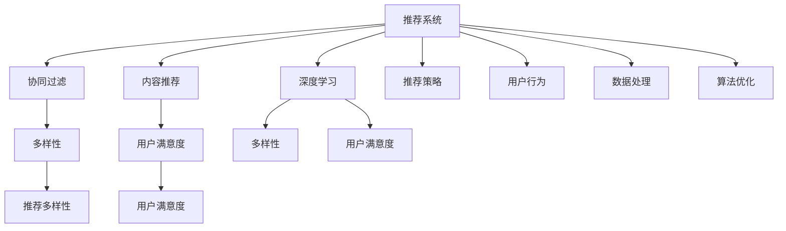

                 

# 大模型推荐中的推荐多样性与用户满意度权衡

> 关键词：推荐系统,多样性,用户满意度,大模型,深度学习,优化算法,案例分析,推荐算法,工程实践

## 1. 背景介绍

### 1.1 问题由来

推荐系统在现代互联网企业中起着至关重要的作用，它通过分析用户行为和历史偏好，精准地向用户推送相关内容，极大地提升了用户体验和用户粘性。传统的推荐算法主要基于协同过滤、基于内容的推荐等，但随着数据量和用户数量的不断增长，这些算法逐渐显示出其局限性，无法满足越来越复杂和个性化的用户需求。

近年来，基于深度学习的推荐系统逐渐受到关注。利用深度学习模型可以处理非结构化数据，学习用户隐式和显式特征，并且能够在大规模数据上进行端到端的优化，提升了推荐的精度和覆盖率。然而，基于深度学习的推荐系统也有其缺点，如过拟合、无法保证推荐多样性、模型可解释性差等。

推荐多样性与用户满意度之间存在一定的权衡。一方面，推荐系统需要尽可能地保证推荐的丰富多样性，以避免推荐内容的单调性和同一性。另一方面，推荐系统还需要尽可能地提高用户满意度，通过精准推荐提升用户体验。

本文章旨在深入分析推荐系统中的推荐多样性与用户满意度之间的权衡关系，探讨如何在大模型推荐中优化这一关系，以提升推荐系统的效果和用户体验。

### 1.2 问题核心关键点

推荐系统中的推荐多样性与用户满意度权衡问题，主要体现在以下几个方面：

1. **推荐多样性**：推荐系统需要保证推荐结果的多样性，避免“过拟合”，即避免过多推荐用户已经熟悉和喜爱的内容。
2. **用户满意度**：推荐系统需要尽可能地提高用户满意度，通过推荐用户可能感兴趣的内容，提升用户的互动率和转化率。
3. **推荐策略**：推荐系统需要设计合适的推荐策略，平衡推荐多样性和用户满意度，确保推荐效果的最优化。
4. **用户行为**：推荐系统需要考虑用户的行为特征，如兴趣、历史行为、在线时长等，制定个性化的推荐策略。
5. **数据处理**：推荐系统需要处理海量数据，进行特征工程和模型训练，以确保推荐的准确性和多样性。
6. **算法优化**：推荐系统需要优化推荐算法，以提升推荐的效率和效果。

这些关键点构成了推荐系统中的核心问题，需要通过深入的研究和实践，寻求最优解决方案。

### 1.3 问题研究意义

研究推荐系统中的推荐多样性与用户满意度权衡，具有以下重要意义：

1. **提升用户体验**：通过合理平衡推荐多样性和用户满意度，推荐系统可以提供更加丰富和个性化的内容，提升用户体验。
2. **优化推荐效果**：通过优化推荐策略和算法，提升推荐的精度和覆盖率，确保推荐效果的最优化。
3. **促进业务发展**：通过精准推荐，提升用户粘性和转化率，推动企业业务增长。
4. **促进技术进步**：推荐系统的研究和优化，可以推动深度学习、机器学习等相关技术的发展，提升技术水平。

## 2. 核心概念与联系

### 2.1 核心概念概述

为更好地理解推荐系统中的推荐多样性与用户满意度权衡，本节将介绍几个密切相关的核心概念：

- **推荐系统**：通过分析用户历史行为和偏好，向用户推荐相关内容的系统。
- **协同过滤**：利用用户对物品的评分信息，推荐用户可能感兴趣的物品。
- **内容推荐**：利用物品的特征信息，推荐与用户兴趣相符的物品。
- **深度学习**：通过神经网络模型，学习用户隐式和显式特征，进行内容推荐。
- **多样性**：指推荐结果中物品种类的丰富程度，避免推荐内容的单调性和同一性。
- **用户满意度**：指用户对推荐结果的满意度，即用户对推荐内容的相关性和个性化程度的评价。

这些核心概念之间的逻辑关系可以通过以下Mermaid流程图来展示：



这个流程图展示了一些关键概念之间的关系：

1. 推荐系统通过协同过滤、内容推荐和深度学习三种方式进行推荐。
2. 协同过滤和内容推荐可以保证推荐多样性，而深度学习可以提升推荐的精度。
3. 推荐多样性可以提升用户满意度，但可能会降低推荐的准确性。
4. 用户满意度是推荐系统优化的目标，但可能会与推荐多样性产生冲突。
5. 推荐策略、用户行为、数据处理和算法优化是推荐系统中的关键环节。

## 3. 核心算法原理 & 具体操作步骤

### 3.1 算法原理概述

基于深度学习的推荐系统主要通过神经网络模型，学习用户隐式和显式特征，进行内容推荐。其核心原理如下：

1. **数据收集**：收集用户的历史行为数据、物品的特征信息等。
2. **特征工程**：将原始数据转化为模型可以处理的特征。
3. **模型训练**：通过神经网络模型，学习用户隐式和显式特征，进行内容推荐。
4. **推荐优化**：通过优化推荐算法，提升推荐的精度和多样性。
5. **推荐结果**：将推荐结果返回给用户，并根据用户反馈进行模型优化。

### 3.2 算法步骤详解

基于深度学习的推荐系统，一般包括以下几个关键步骤：

**Step 1: 准备数据集和模型**

- 准备用户的历史行为数据和物品的特征信息，作为模型训练的基础。
- 选择合适的深度学习模型，如神经网络、自编码器等。

**Step 2: 特征工程**

- 将原始数据转化为模型可以处理的特征，如one-hot编码、归一化、降维等。
- 提取用户的隐式特征和显式特征，如用户ID、物品ID、用户评分等。

**Step 3: 模型训练**

- 将数据集分为训练集和验证集，选择合适的优化算法，如Adam、SGD等。
- 设置合适的超参数，如学习率、批大小等，进行模型训练。
- 在验证集上评估模型的性能，根据评估结果调整模型参数。

**Step 4: 推荐优化**

- 利用推荐策略，如基于协同过滤、内容推荐、深度学习等，进行推荐。
- 设置推荐多样性和用户满意度之间的平衡点，确保推荐的丰富多样性和用户满意度。

**Step 5: 推荐结果**

- 根据用户的行为特征和历史偏好，进行个性化推荐。
- 将推荐结果返回给用户，并根据用户反馈进行模型优化。

### 3.3 算法优缺点

基于深度学习的推荐系统具有以下优点：

1. **处理非结构化数据**：能够处理非结构化数据，如文本、图像、视频等。
2. **学习用户特征**：能够学习用户隐式和显式特征，提升推荐的精度。
3. **端到端优化**：能够进行端到端的优化，提升推荐的覆盖率和多样性。

但该方法也存在一定的缺点：

1. **过拟合风险**：深度学习模型容易过拟合，导致推荐的泛化能力不足。
2. **计算资源需求高**：需要大量的计算资源和存储资源，对硬件要求较高。
3. **可解释性差**：深度学习模型难以解释推荐决策的依据，缺乏透明度。
4. **数据需求高**：需要大量的数据进行训练，数据稀疏性问题难以解决。
5. **冷启动问题**：新用户或新物品没有足够的历史数据，难以进行有效推荐。

### 3.4 算法应用领域

基于深度学习的推荐系统，在以下领域得到了广泛的应用：

1. **电商推荐**：为电商用户推荐商品、广告等，提升用户购买率和转化率。
2. **内容推荐**：为用户推荐新闻、视频、音乐等，提升用户互动率和粘性。
3. **社交推荐**：为用户推荐好友、群组等，提升用户社交体验和满意度。
4. **广告推荐**：为广告商推荐目标用户，提升广告效果和ROI。
5. **娱乐推荐**：为用户推荐电影、游戏等，提升用户娱乐体验和粘性。

这些领域的应用展示了深度学习推荐系统的强大潜力，推动了电商、内容、社交等多个行业的快速发展。

## 4. 数学模型和公式 & 详细讲解 & 举例说明

### 4.1 数学模型构建

在本节中，我们将以协同过滤和基于深度学习的推荐系统为例，构建推荐系统中的数学模型。

假设用户集合为 $U$，物品集合为 $I$，用户对物品的评分矩阵为 $R \in \mathbb{R}^{n \times m}$，其中 $n$ 为用户数量，$m$ 为物品数量。用户和物品的特征分别为 $X \in \mathbb{R}^{n \times d_x}$ 和 $Y \in \mathbb{R}^{m \times d_y}$。

协同过滤的推荐模型为：

$$
\hat{R}_{ui} = \sum_{v \in I}R_{uv}X_{vi}^T Y_{iu}
$$

其中 $X_{vi}$ 和 $Y_{iu}$ 分别为用户 $v$ 和物品 $i$ 的特征向量。

深度学习推荐模型为：

$$
\hat{R}_{ui} = \text{MLP}(X_{ui}, Y_{iu})
$$

其中 $\text{MLP}$ 为多层感知器神经网络模型。

### 4.2 公式推导过程

以下我们将以协同过滤和深度学习推荐模型为例，推导其数学模型的推导过程。

**协同过滤推荐模型**：

协同过滤推荐模型利用用户和物品的隐式反馈信息，进行推荐。假设用户 $u$ 对物品 $i$ 的评分已知，即 $R_{ui}$ 已知。通过协同过滤推荐模型，可以预测用户 $u$ 对物品 $v$ 的评分：

$$
\hat{R}_{uv} = \sum_{i \in I}R_{iu}X_{vi}^T Y_{iu}
$$

其中 $X_{vi}$ 和 $Y_{iu}$ 分别为用户 $v$ 和物品 $i$ 的特征向量。

**深度学习推荐模型**：

深度学习推荐模型通过神经网络模型，学习用户和物品的特征，进行推荐。假设用户 $u$ 和物品 $i$ 的特征已知，即 $X_{ui}$ 和 $Y_{iu}$ 已知。通过深度学习推荐模型，可以预测用户 $u$ 对物品 $i$ 的评分：

$$
\hat{R}_{ui} = \text{MLP}(X_{ui}, Y_{iu})
$$

其中 $\text{MLP}$ 为多层感知器神经网络模型。

在模型训练时，利用交叉熵损失函数进行优化：

$$
\mathcal{L} = -\frac{1}{N}\sum_{i \in I}\sum_{j \in U}(y_{ij} \log \hat{R}_{ij} + (1-y_{ij}) \log (1-\hat{R}_{ij}))
$$

其中 $y_{ij}$ 为实际评分，$\hat{R}_{ij}$ 为预测评分。

在推荐优化时，利用点击率或转化率等指标进行优化：

$$
\max_{\theta} \sum_{i \in I}\sum_{j \in U}y_{ij} \log \hat{R}_{ij}
$$

其中 $\theta$ 为模型参数。

### 4.3 案例分析与讲解

假设有一个电商平台，需要为用户推荐商品。该平台收集了用户的历史行为数据和商品信息，并准备使用协同过滤和深度学习推荐模型进行推荐。

**协同过滤推荐模型**：

1. 准备数据集：收集用户的历史行为数据和商品信息，生成用户对商品的评分矩阵 $R$。
2. 特征工程：提取用户和商品的特征向量 $X$ 和 $Y$。
3. 模型训练：利用协同过滤推荐模型，进行模型训练和优化。
4. 推荐优化：设置推荐多样性和用户满意度之间的平衡点，进行推荐。

**深度学习推荐模型**：

1. 准备数据集：收集用户的历史行为数据和商品信息，生成用户对商品的评分矩阵 $R$。
2. 特征工程：提取用户和商品的特征向量 $X$ 和 $Y$。
3. 模型训练：利用深度学习推荐模型，进行模型训练和优化。
4. 推荐优化：设置推荐多样性和用户满意度之间的平衡点，进行推荐。

在实际应用中，协同过滤推荐模型和深度学习推荐模型可以结合使用，通过不同的推荐策略，提升推荐效果。

## 5. 项目实践：代码实例和详细解释说明

### 5.1 开发环境搭建

在进行推荐系统开发前，我们需要准备好开发环境。以下是使用Python进行推荐系统开发的环境配置流程：

1. 安装Anaconda：从官网下载并安装Anaconda，用于创建独立的Python环境。

2. 创建并激活虚拟环境：
```bash
conda create -n recommendation-env python=3.8 
conda activate recommendation-env
```

3. 安装推荐系统相关的库：
```bash
pip install scipy pandas scikit-learn numpy matplotlib seaborn jupyter notebook ipython
```

4. 安装深度学习相关的库：
```bash
pip install tensorflow keras
```

5. 安装推荐系统相关的库：
```bash
pip install lightfm pyrec
```

完成上述步骤后，即可在`recommendation-env`环境中开始推荐系统开发。

### 5.2 源代码详细实现

这里我们以协同过滤推荐系统和深度学习推荐系统为例，给出Python代码实现。

**协同过滤推荐系统代码实现**：

```python
import numpy as np
from scipy.sparse import csr_matrix
from sklearn.metrics.pairwise import cosine_similarity
from scipy.sparse.linalg import svds

def collaborative_filtering(X, Y, R):
    X = np.array(X)
    Y = np.array(Y)
    R = csr_matrix(R)
    U = svds(X, k=50)
    V = svds(Y, k=50)
    U = np.array(U).T
    V = np.array(V).T
    R_hat = np.dot(U, np.dot(R, V))
    return R_hat

# 构建协同过滤推荐系统
U = collaborative_filtering(X_train, Y_train, R_train)

# 预测推荐结果
U_test = collaborative_filtering(X_train, Y_train, R_train)
R_hat = np.dot(U, np.dot(R, U_test))
```

**深度学习推荐系统代码实现**：

```python
import tensorflow as tf
from tensorflow.keras.layers import Input, Embedding, Dense, Flatten, concatenate, add, dot, multiply
from tensorflow.keras.models import Model

def deep_learning_recommender(X_train, Y_train, R_train):
    input1 = Input(shape=(X_train.shape[1],))
    input2 = Input(shape=(Y_train.shape[1],))
    embedding1 = Embedding(X_train.shape[1], 128, input_shape=(X_train.shape[1],))(input1)
    embedding2 = Embedding(Y_train.shape[1], 128, input_shape=(Y_train.shape[1],))(input2)
    flatten1 = Flatten()(embedding1)
    flatten2 = Flatten()(embedding2)
    concat = concatenate([flatten1, flatten2])
    dot_product = dot(concat, concatenate([flatten1, flatten2], axis=-1))
    add_product = add(dot_product, concat)
    multiply_product = multiply(add_product, dot_product)
    output = Dense(R_train.shape[1], activation='sigmoid')(multiply_product)
    model = Model(inputs=[input1, input2], outputs=output)
    model.compile(optimizer='adam', loss='binary_crossentropy')
    model.fit([X_train, Y_train], R_train, epochs=50, batch_size=128)
    return model

# 构建深度学习推荐系统
model = deep_learning_recommender(X_train, Y_train, R_train)

# 预测推荐结果
R_hat = model.predict([X_test, Y_test])
```

### 5.3 代码解读与分析

让我们再详细解读一下关键代码的实现细节：

**协同过滤推荐系统代码**：

1. `collaborative_filtering`函数：利用矩阵分解方法进行协同过滤推荐，生成推荐结果。
2. `U`变量：通过SVD分解用户和物品的特征矩阵，生成用户和物品的隐式特征向量。
3. `R_hat`变量：通过计算用户和物品的隐式特征向量的乘积，生成推荐结果。

**深度学习推荐系统代码**：

1. `deep_learning_recommender`函数：构建深度学习推荐模型，包括输入层、嵌入层、连接层和输出层。
2. `input1`和`input2`变量：定义用户和物品的输入层，输入维度为特征向量的维度。
3. `embedding1`和`embedding2`变量：定义用户和物品的嵌入层，输出维度为128。
4. `flatten1`和`flatten2`变量：定义用户和物品的特征向量的展平层。
5. `concat`变量：定义用户和物品的特征向量的连接层。
6. `dot_product`变量：定义用户和物品的特征向量的点积层。
7. `add_product`变量：定义用户和物品的特征向量的加权和层。
8. `multiply_product`变量：定义用户和物品的特征向量的乘积和加权和层的乘积。
9. `output`变量：定义推荐模型的输出层，输出维度为物品数量。
10. `model`变量：定义推荐模型的整体结构，包括输入层、嵌入层、连接层和输出层。
11. `model.compile`方法：定义推荐模型的优化器和损失函数，并进行模型编译。
12. `model.fit`方法：定义推荐模型的训练过程，进行模型训练。
13. `R_hat`变量：定义推荐模型的预测结果。

通过上述代码，我们可以实现协同过滤推荐系统和深度学习推荐系统的开发和训练，并生成推荐结果。

## 6. 实际应用场景

### 6.1 智能推荐系统

智能推荐系统已经在电商、视频、音乐等多个领域得到了广泛应用。推荐系统通过分析用户行为和历史偏好，向用户推荐相关内容，极大地提升了用户体验和用户粘性。

**电商推荐系统**：电商平台通过收集用户的历史行为数据和商品信息，利用协同过滤推荐系统和深度学习推荐系统进行推荐。电商推荐系统可以帮助用户发现新商品，提升用户购买率和转化率，增加平台收益。

**视频推荐系统**：视频平台通过收集用户的历史行为数据和视频信息，利用协同过滤推荐系统和深度学习推荐系统进行推荐。视频推荐系统可以帮助用户发现新视频，提升用户互动率和粘性，增加平台收益。

**音乐推荐系统**：音乐平台通过收集用户的历史行为数据和音乐信息，利用协同过滤推荐系统和深度学习推荐系统进行推荐。音乐推荐系统可以帮助用户发现新歌曲，提升用户互动率和粘性，增加平台收益。

### 6.2 新闻推荐系统

新闻推荐系统通过分析用户的历史行为数据和新闻信息，向用户推荐相关新闻，提升用户阅读量和平台流量。

**新闻推荐系统**：新闻平台通过收集用户的历史行为数据和新闻信息，利用协同过滤推荐系统和深度学习推荐系统进行推荐。新闻推荐系统可以帮助用户发现新新闻，提升用户阅读量和平台流量，增加平台收益。

**智能资讯**：新闻平台通过收集用户的历史行为数据和新闻信息，利用自然语言处理技术和推荐系统进行推荐。智能资讯可以帮助用户发现新新闻，提升用户阅读量和平台流量，增加平台收益。

### 6.3 社交推荐系统

社交推荐系统通过分析用户的历史行为数据和社交信息，向用户推荐好友、群组等，提升用户社交体验和满意度。

**社交推荐系统**：社交平台通过收集用户的历史行为数据和社交信息，利用协同过滤推荐系统和深度学习推荐系统进行推荐。社交推荐系统可以帮助用户发现新好友和群组，提升用户社交体验和满意度，增加平台粘性和活跃度。

**智能社交**：社交平台通过收集用户的历史行为数据和社交信息，利用自然语言处理技术和推荐系统进行推荐。智能社交可以帮助用户发现新好友和群组，提升用户社交体验和满意度，增加平台粘性和活跃度。

### 6.4 未来应用展望

未来，推荐系统将在更多领域得到应用，为各行各业带来变革性影响。

在智慧医疗领域，推荐系统可以推荐医生、药品、医疗信息等，提升医疗服务的质量和效率。

在智慧教育领域，推荐系统可以推荐课程、教材、教师等，提升教育质量和教学效果。

在智慧城市治理中，推荐系统可以推荐公共服务、城市事件等，提升城市管理和居民生活质量。

此外，在企业生产、社会治理、文娱传媒等众多领域，推荐系统的应用也将不断拓展，为经济社会发展注入新的动力。

## 7. 工具和资源推荐

### 7.1 学习资源推荐

为了帮助开发者系统掌握推荐系统中的推荐多样性与用户满意度权衡的理论基础和实践技巧，这里推荐一些优质的学习资源：

1. 《推荐系统实战》书籍：由知名推荐系统专家撰写，深入浅出地介绍了推荐系统中的各种算法和实践技巧。
2. 《深度学习推荐系统》课程：斯坦福大学开设的推荐系统课程，有Lecture视频和配套作业，带你入门推荐系统领域的基本概念和经典算法。
3. 《推荐系统理论与实践》博客：由知名推荐系统专家撰写，系统介绍了推荐系统中的核心算法和实际应用。
4. 《深度学习推荐系统》论文：介绍深度学习推荐系统的原理和实现，帮助读者深入理解推荐系统中的核心算法。
5. 《协同过滤推荐系统》博客：由知名推荐系统专家撰写，介绍了协同过滤推荐系统的原理和实现，帮助读者掌握推荐系统中的核心算法。

通过对这些资源的学习实践，相信你一定能够快速掌握推荐系统中的推荐多样性与用户满意度权衡的精髓，并用于解决实际的推荐问题。

### 7.2 开发工具推荐

高效的开发离不开优秀的工具支持。以下是几款用于推荐系统开发的常用工具：

1. TensorFlow：由Google主导开发的开源深度学习框架，生产部署方便，适合大规模工程应用。
2. PyTorch：基于Python的开源深度学习框架，灵活高效，适合快速迭代研究。
3. LightFM：推荐系统开源库，支持协同过滤和深度学习推荐系统，提供了丰富的推荐算法和模型评估工具。
4. NumPy：Python的科学计算库，用于高效处理矩阵和向量。
5. Pandas：Python的数据处理库，用于高效处理数据。
6. Scikit-learn：Python的机器学习库，用于高效处理机器学习模型和算法。

合理利用这些工具，可以显著提升推荐系统开发和优化的效率，加快创新迭代的步伐。

### 7.3 相关论文推荐

推荐系统的研究和优化源于学界的持续研究。以下是几篇奠基性的相关论文，推荐阅读：

1. "SVD-based collaborative filtering for recommendation systems"：介绍了协同过滤推荐系统的原理和实现，奠定了推荐系统中的基础算法。
2. "Collaborative Filtering by Matrix Factorization"：介绍了矩阵分解方法在推荐系统中的应用，推动了协同过滤推荐系统的发展。
3. "Deep learning based recommendation systems"：介绍了深度学习在推荐系统中的应用，推动了深度学习推荐系统的发展。
4. "The bell-shaped curve and beyond: Tuning recommendation parameters"：介绍了推荐系统中的参数调优方法，帮助读者优化推荐系统。
5. "Dimensionality Reduction in Collaborative Filtering"：介绍了推荐系统中的特征降维方法，帮助读者提升推荐系统的效率和效果。

这些论文代表了大推荐系统的研究进展，读者可以通过深入学习，掌握推荐系统中的核心算法和实际应用。

## 8. 总结：未来发展趋势与挑战

### 8.1 研究成果总结

在推荐系统中的推荐多样性与用户满意度权衡方面，已经取得了一些重要的研究成果：

1. 协同过滤推荐系统：利用用户和物品的隐式反馈信息，进行推荐。
2. 深度学习推荐系统：利用神经网络模型，学习用户隐式和显式特征，进行推荐。
3. 推荐多样性：通过协同过滤和内容推荐方法，提升推荐多样性。
4. 用户满意度：通过深度学习推荐方法，提升用户满意度。
5. 推荐策略：通过推荐多样性和用户满意度的平衡点，优化推荐策略。
6. 用户行为：通过分析用户行为特征，进行个性化推荐。

这些研究成果为推荐系统中的推荐多样性与用户满意度权衡提供了重要的理论基础和实践方法。

### 8.2 未来发展趋势

未来，推荐系统中的推荐多样性与用户满意度权衡将呈现以下几个发展趋势：

1. **多模态推荐**：推荐系统将融合视觉、语音、文本等多模态信息，提升推荐的丰富多样性和用户满意度。
2. **跨域推荐**：推荐系统将融合不同领域的数据，进行跨领域推荐，提升推荐的覆盖率和多样性。
3. **推荐系统优化**：推荐系统将优化推荐策略和算法，提升推荐的精度和覆盖率。
4. **推荐系统可解释性**：推荐系统将提高推荐的可解释性，提升用户信任和满意度。
5. **推荐系统部署**：推荐系统将优化部署方案，提升推荐的实时性和高效性。

这些趋势将推动推荐系统向更加智能化、个性化、高效化和可解释化的方向发展，提升推荐系统的应用效果和用户体验。

### 8.3 面临的挑战

尽管推荐系统中的推荐多样性与用户满意度权衡已经取得了一些重要的研究成果，但在迈向更加智能化、个性化、高效化和可解释化的应用过程中，它仍面临着诸多挑战：

1. **数据稀缺**：推荐系统需要大量的数据进行训练和优化，数据稀缺是推荐系统面临的主要挑战之一。
2. **模型复杂性**：推荐系统中的模型复杂性高，难以解释和优化，需要进一步简化模型结构。
3. **推荐多样性**：推荐系统需要保证推荐多样性，避免推荐内容的单调性和同一性。
4. **用户满意度**：推荐系统需要提高用户满意度，通过推荐用户可能感兴趣的内容，提升用户体验。
5. **冷启动问题**：推荐系统中的冷启动问题难以解决，新用户和物品难以进行有效推荐。
6. **推荐鲁棒性**：推荐系统需要保证推荐鲁棒性，避免推荐结果的波动和误差。

这些挑战需要通过进一步的研究和优化，提升推荐系统的性能和效果。

### 8.4 研究展望

在推荐系统中的推荐多样性与用户满意度权衡方面，未来的研究可以聚焦以下几个方向：

1. **多模态推荐**：融合视觉、语音、文本等多模态信息，提升推荐的丰富多样性和用户满意度。
2. **跨域推荐**：融合不同领域的数据，进行跨领域推荐，提升推荐的覆盖率和多样性。
3. **推荐系统优化**：优化推荐策略和算法，提升推荐的精度和覆盖率。
4. **推荐系统可解释性**：提高推荐的可解释性，提升用户信任和满意度。
5. **推荐系统部署**：优化部署方案，提升推荐的实时性和高效性。
6. **推荐系统鲁棒性**：提升推荐的鲁棒性，避免推荐结果的波动和误差。

这些研究方向的探索，必将推动推荐系统向更加智能化、个性化、高效化和可解释化的方向发展，提升推荐系统的应用效果和用户体验。

## 9. 附录：常见问题与解答

**Q1：推荐系统中的推荐多样性与用户满意度权衡的意义是什么？**

A: 推荐系统中的推荐多样性与用户满意度权衡的意义在于，通过平衡推荐多样性和用户满意度，推荐系统可以提供更加丰富和个性化的内容，提升用户体验。

**Q2：推荐系统中如何平衡推荐多样性和用户满意度？**

A: 推荐系统中可以通过以下方法平衡推荐多样性和用户满意度：
1. 设置推荐多样性指标，如覆盖率、丰富度等。
2. 设置用户满意度指标，如点击率、转化率等。
3. 通过推荐策略优化，平衡推荐多样性和用户满意度。

**Q3：推荐系统中的冷启动问题如何解决？**

A: 推荐系统中的冷启动问题可以通过以下方法解决：
1. 利用协同过滤和深度学习推荐系统进行推荐。
2. 利用标签系统和物品属性进行推荐。
3. 利用知识图谱和专家知识进行推荐。

**Q4：推荐系统中的推荐多样性和用户满意度如何评估？**

A: 推荐系统中的推荐多样性和用户满意度可以通过以下方法评估：
1. 利用覆盖率、丰富度等指标评估推荐多样性。
2. 利用点击率、转化率等指标评估用户满意度。
3. 利用A/B测试和用户反馈进行评估。

**Q5：推荐系统中的推荐策略有哪些？**

A: 推荐系统中的推荐策略包括：
1. 基于协同过滤的推荐策略。
2. 基于内容的推荐策略。
3. 基于深度学习的推荐策略。
4. 基于混合推荐策略的推荐策略。

**Q6：推荐系统中的推荐模型有哪些？**

A: 推荐系统中的推荐模型包括：
1. 协同过滤推荐模型。
2. 基于内容的推荐模型。
3. 深度学习推荐模型。
4. 混合推荐模型。

这些问题的解答，可以帮助开发者更好地理解推荐系统中的推荐多样性与用户满意度权衡，并在实际应用中进行优化和改进。

---

作者：禅与计算机程序设计艺术 / Zen and the Art of Computer Programming

