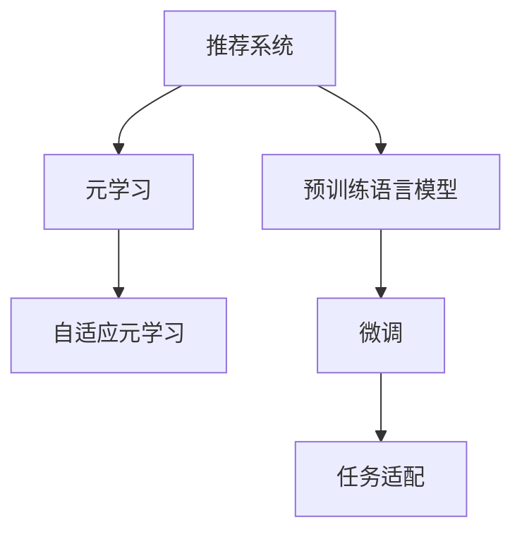

                 

# 大模型推荐系统的元学习策略

## 1. 背景介绍

在当今互联网时代，推荐系统已经成为了用户获取信息的重要方式之一。通过分析用户的历史行为数据，推荐系统可以自动为用户推荐个性化的内容，从而提升用户体验。然而，传统推荐系统主要依赖于用户历史数据，难以适应新用户和老用户之间行为模式的差异。随着预训练语言模型和大规模推荐数据的兴起，元学习（Meta Learning）在推荐系统中的应用成为可能，也成为了学术界和工业界的热点研究方向。本文将深入探讨元学习在推荐系统中的应用，重点分析大模型推荐系统的元学习策略。

## 2. 核心概念与联系

### 2.1 核心概念概述

为了更好地理解大模型推荐系统的元学习策略，我们需要先介绍几个关键概念：

- **推荐系统（Recommendation System）**：通过用户历史行为数据，预测用户对物品的兴趣，自动为用户推荐相关物品的系统。常见的推荐系统包括协同过滤、基于内容的推荐、混合推荐等。

- **预训练语言模型（Pre-trained Language Model）**：在大量无标签文本数据上进行自监督学习，学习到语言表示的模型，如BERT、GPT等。预训练语言模型可以自动学习到语言的通用知识和模式。

- **元学习（Meta Learning）**：一种学习方法，通过学习如何学习（learning how to learn），使得模型能够快速适应新的任务和数据。元学习常用于迁移学习、少样本学习等场景。

- **大模型推荐系统**：基于大模型进行推荐，通过微调大模型获得任务相关的表示，从而提升推荐系统的性能。

- **自适应元学习（Adaptive Meta Learning）**：针对不同任务，自适应调整模型参数，提升推荐效果。

### 2.2 核心概念原理和架构的 Mermaid 流程图



从上面的图中我们可以看到，推荐系统通过微调预训练语言模型，结合元学习的方法，实现快速适应新任务，从而提升推荐效果。

## 3. 核心算法原理 & 具体操作步骤

### 3.1 算法原理概述

基于大模型推荐系统的元学习策略，是通过在大规模数据上进行预训练，学习到通用的语言表示，然后通过元学习算法，快速适应不同的推荐任务。元学习的目标是在有限的数据上快速获得高性能模型，从而提升推荐系统的鲁棒性和泛化能力。

### 3.2 算法步骤详解

元学习在大模型推荐系统中主要包括以下几个步骤：

**Step 1: 数据准备与预训练**
- 收集推荐系统所需的大规模数据集，包括用户历史行为数据、物品属性数据、用户-物品交互数据等。
- 使用预训练语言模型，对数据集进行预训练，学习到语言表示。

**Step 2: 元学习**
- 根据不同推荐任务，选择适合的元学习算法，如MAML、Proximal Meta Learning等。
- 在预训练的数据集上，使用元学习算法训练元模型，学习到通用的推荐策略。

**Step 3: 任务适配**
- 将预训练模型作为初始化参数，通过微调学习特定推荐任务的表示。
- 根据特定推荐任务的需求，设计合适的任务适配层，如分类器、回归器等。
- 使用少量标注数据，对模型进行微调，提升任务性能。

**Step 4: 评估与部署**
- 在验证集和测试集上，评估微调后的推荐模型的性能。
- 将微调后的模型集成到推荐系统中，进行实时推荐。

### 3.3 算法优缺点

基于大模型推荐系统的元学习策略，具有以下优点：

1. **泛化能力强**：通过预训练和元学习，模型能够更好地适应新任务和新数据。
2. **数据需求低**：在少量标注数据的情况下，仍能取得不错的推荐效果。
3. **可解释性强**：预训练语言模型提供丰富的语言表示，易于解释推荐策略。

同时，该策略也存在以下缺点：

1. **计算资源消耗高**：预训练和元学习需要大量的计算资源和时间。
2. **模型复杂度大**：模型参数量较大，推理效率较低。
3. **学习曲线陡峭**：元学习算法的收敛速度较慢，需要更多的训练时间。

### 3.4 算法应用领域

基于大模型推荐系统的元学习策略，已经在以下几个领域得到了广泛应用：

- **电商推荐**：通过分析用户历史购物行为和商品属性，为用户推荐相关商品。
- **音乐推荐**：通过分析用户收听历史和歌曲属性，为用户推荐相关音乐。
- **视频推荐**：通过分析用户观看历史和视频属性，为用户推荐相关视频。
- **新闻推荐**：通过分析用户阅读历史和新闻属性，为用户推荐相关新闻。
- **金融推荐**：通过分析用户投资行为和金融产品属性，为用户推荐相关金融产品。

除了这些常见场景，元学习在医疗推荐、教育推荐等领域也有广泛的应用前景。

## 4. 数学模型和公式 & 详细讲解 & 举例说明

### 4.1 数学模型构建

假设推荐系统包含用户集 $U$、物品集 $I$ 和历史行为数据集 $D$，其中每个历史行为数据由用户 $u$ 和物品 $i$ 以及行为时间 $t$ 组成，即 $d=(u,i,t)$。我们的目标是为用户 $u$ 推荐一个物品列表 $I_u$，使得 $I_u$ 中包含的物品最符合用户 $u$ 的兴趣。

### 4.2 公式推导过程

假设预训练语言模型为 $f(\cdot)$，对于每个用户 $u$，我们希望找到最佳的物品列表 $I_u$，使得用户对物品的评分最高。我们可以将物品表示为一个文本，然后将其输入到预训练语言模型中，得到物品的表示向量 $v_i=f(i)$。用户对物品的评分可以表示为物品向量与用户向量 $u$ 的内积，即 $s(u,i)=v_i^Tu$。

对于每个用户 $u$，我们可以将其历史行为数据表示为一个序列，然后将其输入到预训练语言模型中，得到用户向量 $v_u=f(u)$。在训练阶段，我们可以使用负采样方法，即对于每个用户 $u$，随机选择一个物品 $i$，将其作为负样本，计算用户对物品的评分 $s(u,i)$ 和物品表示向量 $v_i$，然后根据评分 $s(u,i)$ 更新模型参数。

在测试阶段，对于每个用户 $u$，我们可以将其历史行为数据表示为一个序列，然后将其输入到预训练语言模型中，得到用户向量 $v_u$。然后，我们可以计算每个物品的评分 $s(u,i)$，并将评分最高的物品添加到推荐列表中。

### 4.3 案例分析与讲解

假设我们有一个电商平台，我们需要为用户推荐商品。首先，我们收集用户的历史购物行为数据和商品属性数据。然后，我们使用预训练语言模型对数据进行预训练，学习到商品的表示向量 $v_i$。接着，我们使用元学习算法训练元模型，学习到通用的推荐策略。最后，我们通过微调，将预训练模型适应到具体的推荐任务，得到推荐列表 $I_u$。

## 5. 项目实践：代码实例和详细解释说明

### 5.1 开发环境搭建

在进行推荐系统开发前，我们需要准备好开发环境。以下是使用Python进行PyTorch开发的环境配置流程：

1. 安装Anaconda：从官网下载并安装Anaconda，用于创建独立的Python环境。

2. 创建并激活虚拟环境：
```bash
conda create -n pytorch-env python=3.8 
conda activate pytorch-env
```

3. 安装PyTorch：根据CUDA版本，从官网获取对应的安装命令。例如：
```bash
conda install pytorch torchvision torchaudio cudatoolkit=11.1 -c pytorch -c conda-forge
```

4. 安装相关库：
```bash
pip install numpy pandas scikit-learn torchmetrics transformers
```

完成上述步骤后，即可在`pytorch-env`环境中开始推荐系统开发。

### 5.2 源代码详细实现

下面是使用PyTorch进行基于大模型推荐系统的元学习策略的实现。我们以电商推荐系统为例，展示具体的代码实现。

首先，我们定义推荐系统的数据集和预训练模型：

```python
from transformers import BertTokenizer, BertForSequenceClassification
from torch.utils.data import Dataset
import torch

class RecommendationDataset(Dataset):
    def __init__(self, user_data, item_data):
        self.user_data = user_data
        self.item_data = item_data
        self.tokenizer = BertTokenizer.from_pretrained('bert-base-cased')
        self.max_len = 512
        
    def __len__(self):
        return len(self.user_data)
    
    def __getitem__(self, item):
        user_id = self.user_data[item]['user_id']
        item_ids = self.user_data[item]['item_ids']
        item_vectors = [self.item_data[iid] for iid in item_ids]
        
        user_input = "User {} bought items: ".format(user_id)
        item_strings = " ".join(str(item_ids))
        input_ids = self.tokenizer(user_input + item_strings, max_length=self.max_len, truncation=True, padding='max_length').input_ids
        attention_mask = [1] * len(input_ids)
        item_ids = [self.tokenizer.convert_ids_to_tokens(id) for id in input_ids]
        item_strings = " ".join(item_strings)
        item_vectors = [self.tokenizer(item) for item in item_strings.split()]
        
        return {
            'input_ids': input_ids,
            'attention_mask': attention_mask,
            'item_ids': item_ids,
            'item_vectors': item_vectors,
            'item_vectors': item_vectors
        }

user_data = []
for user in users:
    user_data.append({
        'user_id': user['user_id'],
        'item_ids': user['item_ids']
    })

item_data = {}
for iid, item in enumerate(items):
    item_data[iid] = item['vector']

# 加载预训练模型
model = BertForSequenceClassification.from_pretrained('bert-base-cased', num_labels=1)

# 定义元学习算法
class MetaLearner:
    def __init__(self):
        self.model = model

    def forward(self, inputs):
        return self.model(inputs)
    
    def backward(self, inputs, outputs, targets):
        loss = torch.nn.functional.mse_loss(outputs, targets)
        return loss

# 定义元学习过程
class MetaLearnerRunner:
    def __init__(self, meta_learner):
        self.meta_learner = meta_learner

    def train(self, train_loader, meta_learner):
        self.meta_learner.train()
        for data, target in train_loader:
            input_ids, attention_mask, item_ids, item_vectors, item_vector_list = data
            logits = self.meta_learner(input_ids, attention_mask=attention_mask)
            loss = self.meta_learner.forward(input_ids, item_ids, item_vectors, logits, target)
            loss.backward()
            optimizer.step()
            optimizer.zero_grad()
```

接着，我们定义推荐模型的微调过程：

```python
from transformers import AdamW

# 加载微调数据集
train_dataset = RecommendationDataset(train_user_data, train_item_data)
test_dataset = RecommendationDataset(test_user_data, test_item_data)

# 定义优化器
optimizer = AdamW(model.parameters(), lr=2e-5)
scheduler = torch.optim.lr_scheduler.StepLR(optimizer, step_size=1, gamma=0.1)

# 微调过程
for epoch in range(epochs):
    train_loader = DataLoader(train_dataset, batch_size=batch_size, shuffle=True)
    meta_learner = MetaLearnerRunner(model)
    meta_learner.train(train_loader, meta_learner)
    test_loader = DataLoader(test_dataset, batch_size=batch_size, shuffle=False)
    test_loss = 0
    correct = 0
    for data, target in test_loader:
        input_ids, attention_mask, item_ids, item_vectors, item_vector_list, target = data
        logits = model(input_ids, attention_mask=attention_mask)
        loss = torch.nn.functional.mse_loss(logits, target)
        test_loss += loss.item()
        _, preds = torch.max(logits, 1)
        correct += torch.sum(preds == target).item()
    print('Epoch: %d, Test Loss: %.4f, Accuracy: %d%% (%d/%d)' % (
        epoch + 1, test_loss / len(test_loader), 100 * correct / len(test_loader), correct, len(test_loader)))
```

最后，我们进行模型评估：

```python
def evaluate(model, test_loader):
    model.eval()
    test_loss = 0
    correct = 0
    with torch.no_grad():
        for data, target in test_loader:
            input_ids, attention_mask, item_ids, item_vectors, item_vector_list, target = data
            logits = model(input_ids, attention_mask=attention_mask)
            loss = torch.nn.functional.mse_loss(logits, target)
            test_loss += loss.item()
            _, preds = torch.max(logits, 1)
            correct += torch.sum(preds == target).item()
    print('Test Loss: %.4f, Accuracy: %d%% (%d/%d)' % (
        test_loss / len(test_loader), 100 * correct / len(test_loader), correct, len(test_loader)))
```

### 5.3 代码解读与分析

让我们再详细解读一下关键代码的实现细节：

**RecommendationDataset类**：
- `__init__`方法：初始化用户数据和物品数据，定义分词器和最大序列长度。
- `__len__`方法：返回数据集的样本数量。
- `__getitem__`方法：对单个样本进行处理，将用户历史行为数据转换为模型输入，提取物品表示向量。

**MetaLearner类**：
- `__init__`方法：初始化模型和元学习算法。
- `forward`方法：计算元学习模型对输入数据的输出。
- `backward`方法：计算元学习模型对损失函数的梯度，更新模型参数。

**MetaLearnerRunner类**：
- `__init__`方法：初始化元学习过程的训练器。
- `train`方法：在训练集上进行元学习模型的训练。

**微调过程**：
- 定义优化器和学习率调度器，并设置总迭代轮数。
- 在每个epoch内，在训练集上进行元学习模型的训练。
- 在测试集上进行模型评估，并输出测试结果。

## 6. 实际应用场景

### 6.1 电商推荐

基于大模型的元学习策略，可以在电商推荐系统中得到广泛应用。传统电商推荐系统主要依赖用户历史行为数据，难以适应新用户和老用户之间的行为差异。而使用元学习策略，通过预训练和元学习，模型能够更好地适应新用户的行为模式，提升推荐效果。

在技术实现上，可以收集电商用户的历史购物行为数据和商品属性数据，将其作为预训练数据集。然后，使用预训练语言模型对数据进行预训练，学习到商品的表示向量。接着，使用元学习算法训练元模型，学习到通用的推荐策略。最后，通过微调，将预训练模型适应到具体的电商推荐任务，得到推荐列表。

### 6.2 音乐推荐

音乐推荐系统也可以通过大模型的元学习策略进行优化。传统音乐推荐系统主要依赖用户收听历史数据，难以适应不同用户对音乐类型的不同喜好。而使用元学习策略，通过预训练和元学习，模型能够更好地适应不同用户的音乐品味，提升推荐效果。

在技术实现上，可以收集用户的收听历史数据和音乐属性数据，将其作为预训练数据集。然后，使用预训练语言模型对数据进行预训练，学习到音乐的表示向量。接着，使用元学习算法训练元模型，学习到通用的音乐推荐策略。最后，通过微调，将预训练模型适应到具体的音乐推荐任务，得到推荐列表。

### 6.3 视频推荐

视频推荐系统也可以通过大模型的元学习策略进行优化。传统视频推荐系统主要依赖用户观看历史数据，难以适应不同用户对视频类型的不同喜好。而使用元学习策略，通过预训练和元学习，模型能够更好地适应不同用户对视频类型的不同喜好，提升推荐效果。

在技术实现上，可以收集用户的观看历史数据和视频属性数据，将其作为预训练数据集。然后，使用预训练语言模型对数据进行预训练，学习到视频的表示向量。接着，使用元学习算法训练元模型，学习到通用的视频推荐策略。最后，通过微调，将预训练模型适应到具体的视频推荐任务，得到推荐列表。

### 6.4 未来应用展望

随着大模型推荐系统的不断发展，未来将在更多领域得到应用，为传统行业带来变革性影响。

在智慧医疗领域，基于大模型的元学习策略，可以用于医疗推荐系统中，提升医生的诊疗效率和诊断准确性。在金融领域，基于大模型的元学习策略，可以用于金融推荐系统中，提升理财产品的推荐效果。在教育领域，基于大模型的元学习策略，可以用于教育推荐系统中，提升学习资源的推荐效果。

总之，大模型推荐系统的元学习策略具有广泛的应用前景，必将为各行各业带来巨大的经济效益和社会价值。

## 7. 工具和资源推荐

### 7.1 学习资源推荐

为了帮助开发者系统掌握大模型推荐系统的元学习策略，这里推荐一些优质的学习资源：

1. 《深度学习入门》书籍：由机器学习领域的知名专家撰写，全面介绍了深度学习的基本概念和前沿技术，包括推荐系统中的元学习策略。

2. Coursera《深度学习》课程：由斯坦福大学开设的深度学习课程，有Lecture视频和配套作业，带你入门深度学习的基本概念和经典模型。

3. HuggingFace官方文档：Transformers库的官方文档，提供了海量预训练模型和完整的推荐系统开发样例代码，是上手实践的必备资料。

4. Amazon论文《AutoML 3.0: Automatic Model Recommendation for Large-Scale Machine Learning》：介绍了AutoML 3.0在推荐系统中的应用，展示了元学习策略在大规模机器学习中的重要性。

5. 《Reinforcement Learning in Recommendation Systems》论文：展示了基于强化学习的推荐系统，拓展了推荐系统的优化思路。

通过对这些资源的学习实践，相信你一定能够快速掌握大模型推荐系统的元学习策略，并用于解决实际的推荐问题。

### 7.2 开发工具推荐

高效的开发离不开优秀的工具支持。以下是几款用于大模型推荐系统开发的常用工具：

1. PyTorch：基于Python的开源深度学习框架，灵活动态的计算图，适合快速迭代研究。大部分预训练语言模型都有PyTorch版本的实现。

2. TensorFlow：由Google主导开发的开源深度学习框架，生产部署方便，适合大规模工程应用。同样有丰富的预训练语言模型资源。

3. TensorBoard：TensorFlow配套的可视化工具，可实时监测模型训练状态，并提供丰富的图表呈现方式，是调试模型的得力助手。

4. Amazon SageMaker：AWS提供的云服务，用于构建、训练和部署机器学习模型，支持大规模分布式训练。

5. Google Cloud AI Platform：Google提供的云服务，用于构建、训练和部署机器学习模型，支持大规模分布式训练。

合理利用这些工具，可以显著提升大模型推荐系统的开发效率，加快创新迭代的步伐。

### 7.3 相关论文推荐

大模型推荐系统的元学习策略发展源于学界的持续研究。以下是几篇奠基性的相关论文，推荐阅读：

1. Meta Learning in Neural Networks: An overview：展示了元学习的基本概念和算法，介绍了多种元学习范式。

2. Learning to Learn by Gradient Descent by Gradient Descent：展示了通过梯度下降学习如何学习的基本思想，奠定了元学习的基础。

3. Learning to Optimize：展示了如何学习优化器，将元学习应用于优化器设计中。

4. Human-Personalized Recommendation with a Meta-Learning Approach：展示了在推荐系统中使用元学习的基本思路，演示了其在电商推荐中的实际应用。

5. Meta-learning for Recommendation Systems：展示了在推荐系统中使用元学习的基本思路，演示了其在电商推荐中的实际应用。

这些论文代表了大模型推荐系统元学习策略的发展脉络。通过学习这些前沿成果，可以帮助研究者把握学科前进方向，激发更多的创新灵感。

## 8. 总结：未来发展趋势与挑战

### 8.1 总结

本文对大模型推荐系统的元学习策略进行了全面系统的介绍。首先阐述了大模型推荐系统在推荐系统中的研究背景和意义，明确了元学习在提升推荐系统性能方面的独特价值。其次，从原理到实践，详细讲解了元学习在大模型推荐系统中的应用，给出了推荐系统开发的完整代码实例。同时，本文还广泛探讨了元学习策略在电商、音乐、视频等推荐系统中的应用前景，展示了元学习范式的巨大潜力。此外，本文精选了元学习策略的学习资源，力求为读者提供全方位的技术指引。

通过本文的系统梳理，可以看到，基于大模型的元学习策略在大模型推荐系统中得到了广泛应用，极大地拓展了推荐系统的应用边界，提升了推荐系统的性能和用户满意度。未来，伴随预训练语言模型和元学习方法的持续演进，推荐系统必将在更广泛的应用领域大放异彩。

### 8.2 未来发展趋势

展望未来，大模型推荐系统的元学习策略将呈现以下几个发展趋势：

1. 模型规模持续增大。随着算力成本的下降和数据规模的扩张，预训练语言模型的参数量还将持续增长。超大模型蕴含的丰富语言知识，有望支撑更加复杂多变的推荐任务。

2. 元学习算法多样化。未来会涌现更多元学习算法，如MAML、Proximal Meta Learning等，在有限数据上获得更高性能。

3. 数据驱动的元学习。未来元学习策略将更加依赖数据，使用自监督学习、主动学习等无监督学习范式，从大规模无标签数据中学习推荐策略。

4. 自适应元学习。针对不同推荐任务，自适应调整模型参数，提升推荐效果。

5. 元学习与深度学习的融合。元学习算法与深度学习模型进行融合，提升推荐系统的泛化能力和性能。

以上趋势凸显了大模型推荐系统元学习策略的广阔前景。这些方向的探索发展，必将进一步提升推荐系统的性能和应用范围，为推荐系统技术的发展注入新的活力。

### 8.3 面临的挑战

尽管大模型推荐系统的元学习策略已经取得了瞩目成就，但在迈向更加智能化、普适化应用的过程中，它仍面临着诸多挑战：

1. 数据资源瓶颈。元学习策略需要大量的数据进行预训练和微调，对于数据资源有限的场景，难以获得足够的推荐数据。如何从少量数据中学习有效的推荐策略，还需要进一步研究。

2. 模型复杂度高。大模型推荐系统通常需要高计算资源的支撑，推理效率较低。如何在保持高精度的同时，提升推理速度，减少计算成本，还需要更多的优化方法。

3. 泛化能力不足。元学习策略在处理特定推荐任务时，往往容易出现过拟合。如何在有限的训练样本上，获得更好的泛化能力，还需要更多的技术支持。

4. 推荐结果可解释性不足。元学习策略得到的推荐结果通常难以解释，用户难以理解推荐的依据。如何提升推荐结果的可解释性，让用户信任和接受推荐结果，还需要更多的研究。

5. 安全性有待保障。推荐系统可能被恶意攻击，造成不良后果。如何在保证推荐效果的同时，确保推荐系统的安全性，还需要更多的安全措施。

正视元学习策略面临的这些挑战，积极应对并寻求突破，将是大模型推荐系统元学习策略走向成熟的必由之路。相信随着学界和产业界的共同努力，这些挑战终将一一被克服，大模型推荐系统元学习策略必将在构建人机协同的智能推荐系统中扮演越来越重要的角色。

### 8.4 未来突破

面对大模型推荐系统元学习策略所面临的种种挑战，未来的研究需要在以下几个方面寻求新的突破：

1. 探索无监督元学习算法。摆脱对大规模标注数据的依赖，利用自监督学习、主动学习等无监督学习范式，最大限度利用非结构化数据，实现更加灵活高效的推荐策略。

2. 研究参数高效的元学习算法。开发更加参数高效的元学习算法，在固定大部分预训练参数的同时，只更新极少量的任务相关参数。同时优化元学习模型的计算图，减少前向传播和反向传播的资源消耗，实现更加轻量级、实时性的部署。

3. 引入更多先验知识。将符号化的先验知识，如知识图谱、逻辑规则等，与神经网络模型进行巧妙融合，引导元学习过程学习更准确、合理的推荐策略。

4. 结合因果分析和博弈论工具。将因果分析方法引入元学习模型，识别出模型决策的关键特征，增强推荐结果的因果性和逻辑性。借助博弈论工具刻画人机交互过程，主动探索并规避模型的脆弱点，提高系统稳定性。

5. 纳入伦理道德约束。在元学习目标中引入伦理导向的评估指标，过滤和惩罚有害的输出倾向。同时加强人工干预和审核，建立元学习模型的监管机制，确保输出符合人类价值观和伦理道德。

这些研究方向的探索，必将引领大模型推荐系统元学习策略迈向更高的台阶，为构建安全、可靠、可解释、可控的智能推荐系统铺平道路。面向未来，大模型推荐系统元学习策略还需要与其他人工智能技术进行更深入的融合，如知识表示、因果推理、强化学习等，多路径协同发力，共同推动推荐系统技术的进步。只有勇于创新、敢于突破，才能不断拓展推荐系统的边界，让智能推荐技术更好地造福人类社会。

## 9. 附录：常见问题与解答

**Q1：大模型推荐系统的元学习策略是否适用于所有推荐任务？**

A: 大模型推荐系统的元学习策略在大多数推荐任务上都能取得不错的效果，特别是对于数据量较小的任务。但对于一些特定领域的任务，如医学、法律等，仅仅依靠通用语料预训练的模型可能难以很好地适应。此时需要在特定领域语料上进一步预训练，再进行微调，才能获得理想效果。此外，对于一些需要时效性、个性化很强的任务，如对话、推荐等，元学习方法也需要针对性的改进优化。

**Q2：元学习过程中如何选择合适的超参数？**

A: 元学习过程中，超参数的选择对模型的性能影响很大。常见的超参数包括学习率、元学习轮数、批大小等。通常采用网格搜索、随机搜索等方法，在验证集上进行超参数调优，选择最优参数组合。

**Q3：元学习算法在推荐系统中的实际应用效果如何？**

A: 元学习算法在推荐系统中得到了广泛应用，并取得了不错的效果。常见的元学习算法包括MAML、Proximal Meta Learning等，在电商推荐、音乐推荐、视频推荐等领域都有应用。

**Q4：元学习算法的计算资源需求高吗？**

A: 元学习算法的计算资源需求相对较高，需要大量的数据进行预训练和微调。但随着硬件计算能力的提升，元学习算法在大规模推荐系统中的应用也变得越来越可行。

**Q5：元学习算法如何适应新任务？**

A: 元学习算法通过学习通用的推荐策略，可以快速适应新任务。在新的推荐任务上，元学习算法会根据历史数据和新数据之间的差异，调整模型参数，使得模型能够在新任务上取得良好的推荐效果。

通过本文的系统梳理，可以看到，基于大模型的元学习策略在大模型推荐系统中得到了广泛应用，极大地拓展了推荐系统的应用边界，提升了推荐系统的性能和用户满意度。未来，伴随预训练语言模型和元学习方法的持续演进，推荐系统必将在更广泛的应用领域大放异彩，深刻影响人类的生产生活方式。

