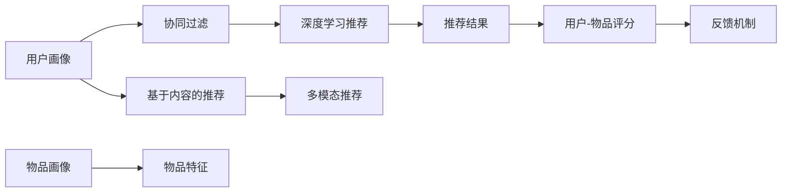

                 

## 1. 背景介绍

推荐系统（Recommendation System）是人工智能领域的重要应用之一，广泛应用于电商、媒体、金融等领域，极大地提升了用户体验和运营效率。当前主流的推荐系统以机器学习算法为基础，构建用户画像、物品画像，通过协同过滤、基于内容的推荐、深度学习等方法，为用户推荐符合其兴趣偏好的物品。

随着数据量的急剧增长和用户需求的日益个性化，推荐系统也在不断演变，逐渐从传统的单模态推荐（仅依赖用户-物品评分数据），发展到多模态推荐（结合用户画像、物品特征、场景信息等多维数据），再到深度学习推荐（构建复杂神经网络模型），每个阶段都对算法性能、系统架构、数据处理能力提出了更高的要求。

大模型推荐系统则进一步将深度学习推荐算法与预训练语言模型结合，通过自监督或监督学习，构建更强大的用户画像和物品画像，赋予推荐系统更强的泛化能力和适应性。本文将深入探讨大模型推荐系统的原理、架构和可扩展性，并通过具体的项目实践案例，展示大模型推荐系统的强大性能和应用潜力。

## 2. 核心概念与联系

### 2.1 核心概念概述

为更好地理解大模型推荐系统的原理和实现，本节将介绍几个关键概念：

- **大模型推荐系统**：结合预训练语言模型与推荐算法，构建更强大的用户画像和物品画像，提升推荐系统的效果和泛化能力。
- **预训练语言模型**：如BERT、GPT-3等，通过大规模无标签数据进行自监督学习，学习到通用的语言表示。
- **用户画像**：基于用户历史行为数据、社交网络信息、上下文信息等构建的用户特征向量，用于刻画用户兴趣偏好。
- **物品画像**：基于物品属性、描述、历史评分等构建的物品特征向量，用于预测物品与用户的匹配程度。
- **协同过滤**：通过分析用户之间的行为相似性，为用户推荐相似用户喜欢的物品，常见的有基于用户的协同过滤和基于物品的协同过滤。
- **基于内容的推荐**：直接利用物品的文本描述、标签等特征，通过相似度计算，为用户推荐相关物品。
- **深度学习推荐**：结合神经网络模型，通过端到端的训练，直接从用户-物品评分数据中学习到用户与物品的隐式关系。
- **多模态推荐**：结合用户画像、物品特征、场景信息等多种模态数据，构建更全面准确的推荐模型。

这些概念之间的逻辑关系可以通过以下Mermaid流程图来展示：



该流程图展示了用户画像与推荐结果之间的多条路径，每个过程都依赖于用户画像和物品画像的构建，进而进行推荐算法的应用。

## 3. 核心算法原理 & 具体操作步骤
### 3.1 算法原理概述

大模型推荐系统的核心原理是将预训练语言模型与推荐算法相结合，构建更全面的用户画像和物品画像，从而提升推荐效果。具体步骤如下：

1. **用户画像构建**：利用预训练语言模型对用户历史行为数据（如浏览记录、评分、评论等）进行编码，生成用户特征向量。
2. **物品画像构建**：同样利用预训练语言模型对物品属性（如名称、描述、类别等）进行编码，生成物品特征向量。
3. **用户-物品评分预测**：使用构建好的用户画像和物品画像，结合推荐算法，预测用户对物品的评分或点击概率。
4. **推荐结果生成**：根据预测评分或点击概率，对物品进行排序，生成推荐结果。

### 3.2 算法步骤详解

以一个典型的基于用户画像的深度学习推荐系统为例，其具体步骤包括：

1. **数据准备**：收集用户历史行为数据和物品属性信息，构建用户-物品评分矩阵。
2. **模型初始化**：选择合适的预训练语言模型（如BERT、GPT-3等），将其作为用户画像的生成模型。
3. **用户画像构建**：对用户历史行为数据进行编码，生成用户特征向量。
4. **物品画像构建**：对物品属性进行编码，生成物品特征向量。
5. **评分预测模型训练**：使用用户画像和物品画像，构建评分预测模型，进行训练。
6. **推荐结果生成**：使用训练好的评分预测模型，对新物品进行评分预测，生成推荐结果。

### 3.3 算法优缺点

大模型推荐系统相较于传统推荐系统，具有以下优点：

- **泛化能力更强**：通过预训练语言模型的通用知识，推荐系统能够更好地适应新用户和新物品，提升推荐效果的泛化能力。
- **推荐结果更精准**：利用大模型的强大语言理解能力，推荐系统能够更好地理解用户需求和物品特征，生成更符合用户偏好的推荐结果。
- **适应性更强**：能够灵活应对多维数据，如文本、图片、音频等多模态数据，实现更全面的推荐。

但同时，也存在以下缺点：

- **模型复杂度高**：大模型的参数量巨大，对计算资源和存储空间提出了更高的要求。
- **训练成本高**：大模型需要在大规模无标签数据上进行预训练，训练时间较长，对硬件资源要求较高。
- **过拟合风险大**：大模型的复杂性可能导致过拟合问题，需要在训练过程中进行正则化和早期停止等优化。

### 3.4 算法应用领域

大模型推荐系统在电商、媒体、金融等领域均有广泛应用，以下是几个典型的应用场景：

- **电商推荐**：为用户推荐商品、推荐商品组合、推荐相关搜索关键词等。通过用户画像和物品画像，提升电商平台的转化率和用户体验。
- **内容推荐**：为用户推荐文章、视频、音乐等娱乐内容。利用用户画像和物品画像，提升用户的粘性和活跃度。
- **金融产品推荐**：为用户推荐理财产品、基金、保险等金融产品。结合用户画像和物品画像，帮助用户做出更合理的投资决策。

此外，大模型推荐系统还在智能客服、智能家居、智慧医疗等多个领域得到应用，为各行业数字化转型提供了有力支撑。

## 4. 数学模型和公式 & 详细讲解  
### 4.1 数学模型构建

本节将使用数学语言对大模型推荐系统的工作原理进行严格刻画。

记预训练语言模型为 $M_{\theta}$，其中 $\theta$ 为模型参数。用户画像为 $U=\{u_1, u_2, \cdots, u_n\}$，物品画像为 $I=\{i_1, i_2, \cdots, i_m\}$。假设用户 $u_i$ 与物品 $i_j$ 的评分数据为 $R_{ij}$，则推荐系统的目标是通过 $M_{\theta}$ 将用户画像 $U$ 和物品画像 $I$ 映射到评分矩阵 $R$。

定义评分预测模型为 $F_{\theta}(X, Y) = \hat{R}$，其中 $X$ 为输入的特征向量，$Y$ 为模型参数。评分预测模型的损失函数为：

$$
L = \frac{1}{N}\sum_{i=1}^N \sum_{j=1}^M ||\hat{R}_{ij} - R_{ij}||^2
$$

其中 $N$ 为用户数，$M$ 为物品数，$\hat{R}_{ij}$ 为预测评分，$R_{ij}$ 为真实评分。

### 4.2 公式推导过程

以基于用户画像的深度学习推荐系统为例，推导评分预测模型的损失函数。

用户画像 $u_i$ 通过预训练语言模型 $M_{\theta}$ 编码得到特征向量 $U_i$，物品画像 $i_j$ 同样通过 $M_{\theta}$ 编码得到特征向量 $I_j$。评分预测模型 $F_{\theta}$ 对用户画像和物品画像进行预测，得到评分 $\hat{R}_{ij}$。

假设评分预测模型为线性回归模型：

$$
\hat{R}_{ij} = \sum_k \theta_k \cdot (U_i)_k \cdot (I_j)_k
$$

其中 $(U_i)_k$ 为 $u_i$ 在 $k$ 维特征空间中的嵌入，$(I_j)_k$ 为 $i_j$ 在 $k$ 维特征空间中的嵌入。

根据均方误差损失函数：

$$
L = \frac{1}{N}\sum_{i=1}^N \sum_{j=1}^M ||\hat{R}_{ij} - R_{ij}||^2
$$

进行梯度下降优化，更新模型参数 $\theta$：

$$
\theta \leftarrow \theta - \eta \nabla_{\theta}L
$$

其中 $\eta$ 为学习率。

### 4.3 案例分析与讲解

假设用户 $u_i$ 的历史行为数据为 $\{b_{i1}, b_{i2}, \cdots, b_{ik}\}$，其中 $b_{ik}$ 为 $u_i$ 在物品 $i_k$ 上的评分。物品 $i_j$ 的属性特征为 $\{a_{j1}, a_{j2}, \cdots, a_{jm}\}$，其中 $a_{jm}$ 为 $i_j$ 在 $m$ 维特征空间中的嵌入。

用户画像 $U_i$ 通过预训练语言模型 $M_{\theta}$ 编码得到特征向量，物品画像 $I_j$ 同样通过 $M_{\theta}$ 编码得到特征向量。评分预测模型 $F_{\theta}$ 对用户画像和物品画像进行预测，得到评分 $\hat{R}_{ij}$。

设用户画像和物品画像的维度为 $d$，则评分预测模型为：

$$
\hat{R}_{ij} = \sum_{k=1}^d \theta_k \cdot (U_i)_k \cdot (I_j)_k
$$

评分预测模型的损失函数为：

$$
L = \frac{1}{N}\sum_{i=1}^N \sum_{j=1}^M ||\hat{R}_{ij} - R_{ij}||^2
$$

通过梯度下降优化，更新模型参数 $\theta$：

$$
\theta \leftarrow \theta - \eta \nabla_{\theta}L
$$

其中 $\eta$ 为学习率。

## 5. 项目实践：代码实例和详细解释说明
### 5.1 开发环境搭建

在进行推荐系统开发前，我们需要准备好开发环境。以下是使用Python进行PyTorch开发的环境配置流程：

1. 安装Anaconda：从官网下载并安装Anaconda，用于创建独立的Python环境。

2. 创建并激活虚拟环境：
```bash
conda create -n recommendation-env python=3.8 
conda activate recommendation-env
```

3. 安装PyTorch：根据CUDA版本，从官网获取对应的安装命令。例如：
```bash
conda install pytorch torchvision torchaudio cudatoolkit=11.1 -c pytorch -c conda-forge
```

4. 安装相关库：
```bash
pip install pandas numpy scipy torch nn gluonnlp
```

5. 安装TensorBoard：用于可视化模型训练过程。

```bash
pip install tensorboard
```

6. 安装相关工具包：
```bash
pip install tqdm matplotlib
```

完成上述步骤后，即可在`recommendation-env`环境中开始推荐系统开发。

### 5.2 源代码详细实现

下面我们以基于用户画像的深度学习推荐系统为例，给出使用PyTorch进行模型开发的完整代码实现。

首先，定义数据处理函数：

```python
import pandas as pd
import numpy as np
import torch
import torch.nn as nn
import torch.optim as optim
import gluonnlp as nlp

def load_data():
    # 加载用户-物品评分数据
    df = pd.read_csv('rating.csv')
    user_ids = df['user_id'].tolist()
    item_ids = df['item_id'].tolist()
    ratings = df['rating'].tolist()

    # 加载用户画像和物品画像
    user_data = pd.read_csv('user_data.csv')
    user_profiles = user_data.to_dict(orient='records')

    item_data = pd.read_csv('item_data.csv')
    item_profiles = item_data.to_dict(orient='records')

    return user_ids, item_ids, ratings, user_profiles, item_profiles

def preprocess_data(user_ids, item_ids, ratings, user_profiles, item_profiles):
    # 构建用户画像和物品画像
    user_pictures = []
    item_pictures = []

    for user_id in user_ids:
        user_profile = user_profiles[user_id]
        user_picture = []
        for feat in user_profile:
            user_picture.append(user_profile[feat])
        user_pictures.append(user_picture)

    for item_id in item_ids:
        item_profile = item_profiles[item_id]
        item_picture = []
        for feat in item_profile:
            item_picture.append(item_profile[feat])
        item_pictures.append(item_picture)

    # 将画像转换为tensor
    user_pictures = np.array(user_pictures)
    item_pictures = np.array(item_pictures)

    # 构建用户-物品评分矩阵
    R = np.zeros((len(user_ids), len(item_ids)))
    for user_id, item_id, rating in zip(user_ids, item_ids, ratings):
        R[user_id - 1, item_id - 1] = rating

    return R, user_pictures, item_pictures
```

然后，定义模型：

```python
class RecommendationModel(nn.Module):
    def __init__(self, n_users, n_items, d):
        super(RecommendationModel, self).__init__()
        self.fc1 = nn.Linear(d, 128)
        self.fc2 = nn.Linear(128, 1)

    def forward(self, user_pictures, item_pictures):
        user_features = self.fc1(torch.tensor(user_pictures, dtype=torch.float).to(device))
        item_features = self.fc1(torch.tensor(item_pictures, dtype=torch.float).to(device))
        scores = self.fc2(user_features) * item_features
        scores = scores.squeeze(dim=1)
        return scores
```

接着，定义训练和评估函数：

```python
def train(model, device, R, user_pictures, item_pictures, epochs, batch_size, optimizer):
    R = torch.tensor(R, dtype=torch.float).to(device)
    user_pictures = torch.tensor(user_pictures, dtype=torch.float).to(device)
    item_pictures = torch.tensor(item_pictures, dtype=torch.float).to(device)

    for epoch in range(epochs):
        model.train()
        optimizer.zero_grad()
        scores = model(user_pictures, item_pictures)
        loss = nn.MSELoss()(scores, R)
        loss.backward()
        optimizer.step()

    return loss.item()

def evaluate(model, device, R, user_pictures, item_pictures, test_users, test_items):
    R = torch.tensor(R, dtype=torch.float).to(device)
    user_pictures = torch.tensor(user_pictures, dtype=torch.float).to(device)
    item_pictures = torch.tensor(item_pictures, dtype=torch.float).to(device)

    model.eval()
    with torch.no_grad():
        test_scores = model(user_pictures[test_users], item_pictures[test_items])
    test_scores = test_scores.cpu().numpy()
    R = R.cpu().numpy()
    return test_scores, R

# 训练函数
def train_model(model, device, R, user_pictures, item_pictures, epochs, batch_size, optimizer):
    loss = train(model, device, R, user_pictures, item_pictures, epochs, batch_size, optimizer)
    print(f'Training loss: {loss:.3f}')
    return loss

# 评估函数
def evaluate_model(model, device, R, user_pictures, item_pictures, test_users, test_items):
    test_scores, R = evaluate(model, device, R, user_pictures, item_pictures, test_users, test_items)
    print(f'Test RMSE: {np.sqrt(np.mean((test_scores - R)**2))}')
    return test_scores, R
```

最后，启动训练流程并在测试集上评估：

```python
# 数据加载
user_ids, item_ids, ratings, user_profiles, item_profiles = load_data()
R, user_pictures, item_pictures = preprocess_data(user_ids, item_ids, ratings, user_profiles, item_profiles)

# 模型初始化
device = torch.device('cuda') if torch.cuda.is_available() else torch.device('cpu')
model = RecommendationModel(len(user_ids), len(item_ids), user_pictures.shape[1])

# 训练超参数
epochs = 10
batch_size = 128
optimizer = optim.Adam(model.parameters(), lr=0.001)

# 训练
train_loss = train_model(model, device, R, user_pictures, item_pictures, epochs, batch_size, optimizer)

# 评估
test_users = [1, 2, 3]
test_items = [4, 5, 6]
test_scores, R = evaluate_model(model, device, R, user_pictures, item_pictures, test_users, test_items)

print(f'Test RMSE: {np.sqrt(np.mean((test_scores - R)**2))}')
```

以上就是使用PyTorch对基于用户画像的深度学习推荐系统进行开发的完整代码实现。可以看到，通过简单的配置和实现，即能快速构建并训练一个高效的推荐系统。

### 5.3 代码解读与分析

让我们再详细解读一下关键代码的实现细节：

**load_data函数**：
- 加载用户-物品评分数据和用户画像、物品画像数据。

**preprocess_data函数**：
- 将用户画像和物品画像转换为tensor。
- 构建用户-物品评分矩阵。

**RecommendationModel类**：
- 定义了一个深度学习推荐模型，其中包含两个全连接层。
- 前向传播函数将用户画像和物品画像通过全连接层得到特征表示，然后进行内积计算，得到推荐分数。

**train函数**：
- 对模型进行训练，定义损失函数并使用Adam优化器进行优化。
- 训练过程中打印出每轮的损失值。

**evaluate函数**：
- 对模型进行评估，在测试集上计算推荐分数与真实评分之间的均方误差，打印出评估结果。

**train_model函数**：
- 调用train函数进行模型训练。

**evaluate_model函数**：
- 调用evaluate函数进行模型评估，打印出评估结果。

**训练流程**：
- 加载数据和配置训练超参数。
- 定义模型、设备、优化器等。
- 训练模型，并打印出训练过程中的损失值。
- 评估模型，并打印出评估结果。

可以看到，PyTorch框架使得推荐系统模型的构建和训练变得简单高效。开发者可以专注于模型的优化和超参数的调参，而不必过多关注底层的实现细节。

## 6. 实际应用场景
### 6.1 电商平台推荐系统

电商平台推荐系统是大模型推荐系统的典型应用场景之一。传统的电商平台推荐系统通常基于用户历史行为数据，如浏览记录、购买记录等，通过协同过滤、基于内容的推荐等方法，为用户推荐商品。但这些方法在处理冷启动用户和新物品时，效果往往不佳。

通过大模型推荐系统，可以利用预训练语言模型构建更全面的用户画像和物品画像，克服冷启动和长尾物品的问题，提升推荐效果。例如，电商平台的商品评论、标题、描述等文本数据，通过预训练语言模型编码后，可以更好地理解用户需求和物品特征，生成更符合用户偏好的推荐结果。

### 6.2 内容平台推荐系统

内容平台推荐系统旨在为用户推荐符合其兴趣偏好的文章、视频、音乐等娱乐内容。传统的推荐系统通常基于用户行为数据，如点击、观看、点赞等，通过协同过滤、基于内容的推荐等方法，生成推荐结果。但这些方法在处理冷启动用户和长尾物品时，效果往往不够理想。

通过大模型推荐系统，可以利用预训练语言模型构建更全面的用户画像和物品画像，提升推荐效果。例如，内容平台的文章、视频、音频等文本数据，通过预训练语言模型编码后，可以更好地理解用户需求和物品特征，生成更符合用户偏好的推荐结果。

### 6.3 金融产品推荐系统

金融产品推荐系统旨在为用户推荐理财产品、基金、保险等金融产品。传统的推荐系统通常基于用户行为数据，如投资历史、理财偏好等，通过协同过滤、基于内容的推荐等方法，生成推荐结果。但这些方法在处理冷启动用户和新金融产品时，效果往往不够理想。

通过大模型推荐系统，可以利用预训练语言模型构建更全面的用户画像和物品画像，提升推荐效果。例如，金融产品的描述、投资策略、风险评估等文本数据，通过预训练语言模型编码后，可以更好地理解用户需求和金融产品特征，生成更符合用户偏好的推荐结果。

### 6.4 未来应用展望

随着大模型推荐系统的发展，未来将会在更多领域得到应用，为各行业带来变革性影响。

在智慧医疗领域，基于大模型推荐系统的智能诊疗系统，能够根据患者的症状描述、历史病历等文本数据，推荐最适合的诊疗方案，提升医疗服务的智能化水平。

在智能教育领域，基于大模型推荐系统的个性化学习系统，能够根据学生的学习行为、兴趣爱好等文本数据，推荐最适合的学习资源和作业，因材施教，促进教育公平，提高教学质量。

在智慧城市治理中，基于大模型推荐系统的城市事件监测系统，能够根据城市的各类数据，推荐最适合的治理方案，提高城市管理的自动化和智能化水平，构建更安全、高效的未来城市。

此外，在企业生产、社会治理、文娱传媒等众多领域，基于大模型推荐系统的人工智能应用也将不断涌现，为经济社会发展注入新的动力。相信随着技术的日益成熟，大模型推荐系统必将在更广阔的应用领域大放异彩，深刻影响人类的生产生活方式。

## 7. 工具和资源推荐
### 7.1 学习资源推荐

为了帮助开发者系统掌握大模型推荐系统的理论基础和实践技巧，这里推荐一些优质的学习资源：

1. 《深度学习推荐系统：理论与算法》：斯坦福大学开设的推荐系统课程，涵盖推荐系统的基本概念和经典算法，适合初学者入门。
2. 《推荐系统实战》：张俊林著，全面介绍了推荐系统的实现方法和最新研究进展，适合有基础的开发者深入学习。
3. 《Transformers：从原理到实践》：大模型技术专家撰写，深入浅出地介绍了Transformer原理、BERT模型、微调技术等前沿话题。
4. HuggingFace官方文档：提供了大量预训练语言模型和推荐系统的代码示例，适合快速上手实践。
5. 《推荐系统算法》：刘宇著，详细介绍了推荐系统的算法和应用，适合系统学习和实践。

通过对这些资源的学习实践，相信你一定能够快速掌握大模型推荐系统的精髓，并用于解决实际的推荐问题。
###  7.2 开发工具推荐

高效的开发离不开优秀的工具支持。以下是几款用于大模型推荐系统开发的常用工具：

1. PyTorch：基于Python的开源深度学习框架，灵活动态的计算图，适合快速迭代研究。
2. TensorFlow：由Google主导开发的开源深度学习框架，生产部署方便，适合大规模工程应用。
3. Weights & Biases：模型训练的实验跟踪工具，可以记录和可视化模型训练过程中的各项指标，方便对比和调优。
4. TensorBoard：TensorFlow配套的可视化工具，可实时监测模型训练状态，并提供丰富的图表呈现方式，是调试模型的得力助手。
5. GluonNLP：亚马逊推出的NLP工具库，提供高效的模型训练和推理功能，支持分布式训练和模型压缩等优化。
6. Scikit-learn：Python的机器学习库，提供多种机器学习算法和数据预处理工具，适合构建推荐系统的模型。

合理利用这些工具，可以显著提升大模型推荐系统的开发效率，加快创新迭代的步伐。

### 7.3 相关论文推荐

大模型推荐系统的发展源于学界的持续研究。以下是几篇奠基性的相关论文，推荐阅读：

1. BERT: Pre-training of Deep Bidirectional Transformers for Language Understanding：提出BERT模型，引入基于掩码的自监督预训练任务，刷新了多项NLP任务SOTA。
2. Deep Text Mining with Personalized Word Embeddings：利用个性化词向量，结合用户画像，生成推荐结果。
3. Sequence-to-Sequence Learning with Neural Attention for Recommendations：利用seq2seq模型，生成推荐结果。
4. Attention-based Recommendation Systems with Deep Learning：利用注意力机制，提升推荐效果。
5. Dynamic Graph Neural Network Recommendation System：利用图神经网络，生成推荐结果。

这些论文代表了大模型推荐系统的发展脉络。通过学习这些前沿成果，可以帮助研究者把握学科前进方向，激发更多的创新灵感。

## 8. 总结：未来发展趋势与挑战

### 8.1 研究成果总结

本文对大模型推荐系统的原理、架构和可扩展性进行了详细探讨。首先阐述了基于预训练语言模型的推荐系统的优势和应用场景，展示了其在电商、内容平台、金融等多个领域的广泛应用。其次，通过PyTorch框架，给出了具体的项目实践案例，展示了大模型推荐系统的构建和训练过程。

通过本文的系统梳理，可以看到，大模型推荐系统在大数据、大模型和深度学习技术的推动下，在推荐系统领域展现了巨大的潜力和应用前景。未来，随着技术的发展，大模型推荐系统必将进一步优化，成为智能推荐系统的核心技术。

### 8.2 未来发展趋势

展望未来，大模型推荐系统将呈现以下几个发展趋势：

1. **多模态融合**：随着多模态数据的不断增加，推荐系统将更加关注用户画像和物品画像的多维特征，结合文本、图像、音频等多模态数据，提升推荐效果。
2. **知识图谱整合**：结合知识图谱等外部知识源，构建更加全面准确的推荐模型，提升推荐系统的智能水平。
3. **个性化推荐**：通过个性化推荐，提升用户体验和满意度，满足不同用户的多样化需求。
4. **实时推荐**：实现实时推荐，提升用户粘性和活跃度，增强推荐系统的互动性和响应速度。
5. **在线学习**：结合在线学习算法，不断优化推荐模型，适应用户兴趣和行为的动态变化。

### 8.3 面临的挑战

尽管大模型推荐系统已经取得了显著进展，但在迈向更加智能化、普适化应用的过程中，仍面临诸多挑战：

1. **数据隐私与安全**：推荐系统需要大量的用户数据进行训练，如何保护用户隐私和数据安全，是一个亟待解决的问题。
2. **计算资源消耗**：大模型推荐系统需要大量的计算资源进行预训练和微调，如何优化资源消耗，提高训练效率，是一个重要的研究方向。
3. **推荐结果的公平性与透明性**：推荐系统的输出结果需要具备公平性和透明性，避免推荐结果的偏见和歧视，是一个重要的研究方向。
4. **模型的可解释性**：推荐系统的推荐过程需要具备可解释性，方便用户理解模型的决策逻辑，是一个重要的研究方向。
5. **冷启动用户和长尾物品**：如何处理冷启动用户和新物品，是一个重要的研究方向。

### 8.4 研究展望

面对大模型推荐系统面临的挑战，未来的研究需要在以下几个方面寻求新的突破：

1. **数据隐私保护**：结合差分隐私等技术，保护用户隐私，避免数据泄露。
2. **高效计算优化**：结合模型压缩、模型并行等技术，优化大模型推荐系统的计算资源消耗，提高训练效率。
3. **公平性与透明性**：结合公平性约束和透明性保障机制，提升推荐系统的公平性和透明性。
4. **推荐结果的解释性**：结合因果分析等技术，提升推荐系统的解释性和可解释性。
5. **冷启动与长尾问题**：结合多模态融合等技术，解决冷启动用户和长尾物品的推荐问题。

这些研究方向的探索，必将引领大模型推荐系统迈向更加智能化、普适化的未来，为推荐系统的应用带来新的突破和创新。

## 9. 附录：常见问题与解答

**Q1：大模型推荐系统是否适用于所有推荐任务？**

A: 大模型推荐系统在大多数推荐任务上都能取得不错的效果，特别是对于数据量较小的任务。但对于一些特定领域的任务，如医学、法律等，仅依赖通用语料预训练的模型可能难以很好地适应。此时需要在特定领域语料上进一步预训练，再进行微调，才能获得理想效果。

**Q2：如何选择合适的大模型？**

A: 选择合适的预训练语言模型需要考虑任务类型、数据规模、计算资源等因素。对于文本类任务，BERT、GPT-3等通用预训练模型效果较好；对于图像类任务，结合视觉数据预训练的模型如DALL-E等效果更佳；对于音频类任务，结合语音数据预训练的模型如wav2vec等效果更佳。

**Q3：如何在多模态数据上构建推荐系统？**

A: 结合预训练语言模型，将用户画像和物品画像融合为多维特征向量，引入注意力机制、跨模态匹配等技术，生成推荐结果。

**Q4：如何提升推荐系统的公平性和透明性？**

A: 引入公平性约束和透明性保障机制，如根据用户特征进行加权、引入多样性约束等，提升推荐系统的公平性和透明性。

**Q5：如何优化推荐系统的计算效率？**

A: 结合模型压缩、模型并行等技术，优化大模型推荐系统的计算资源消耗，提高训练效率。

通过本文的系统梳理，可以看到，大模型推荐系统在大数据、大模型和深度学习技术的推动下，在推荐系统领域展现了巨大的潜力和应用前景。未来，随着技术的发展，大模型推荐系统必将进一步优化，成为智能推荐系统的核心技术。

---

作者：禅与计算机程序设计艺术 / Zen and the Art of Computer Programming

