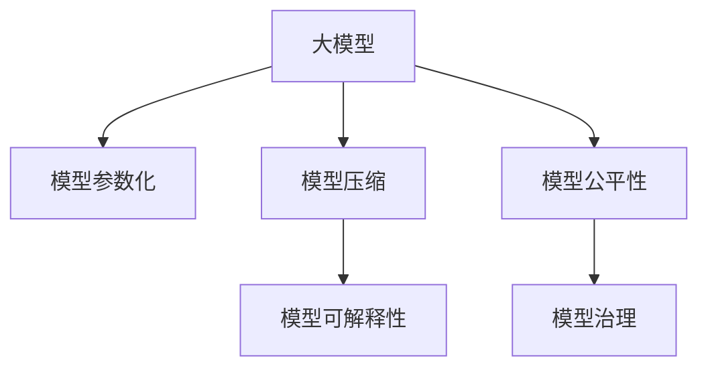

                 

## 1. 背景介绍

### 1.1 问题由来
近年来，人工智能领域经历了爆炸性的发展，尤其是在深度学习领域，各种大型神经网络模型层出不穷。其中，以大模型为代表的可扩展、高效的模型设计理念，在自然语言处理、计算机视觉、语音识别等多个领域展现了巨大的潜力。大模型通常具有超过数亿甚至数十亿的参数，能在几乎不增加硬件成本的情况下，通过增加训练数据和计算时间，不断提升性能。

随着深度学习模型的不断演进，未来的大模型规模化将进一步提升到万亿参数时代。万亿参数模型将拥有更加强大的表达能力和泛化能力，能够更好地适应各种复杂的任务和应用场景，带来革命性的性能提升。

### 1.2 问题核心关键点
大模型规模化所带来的性能提升和应用潜力，使得其成为当前人工智能领域的研究热点。然而，在追求大模型的同时，我们也必须关注其带来的新挑战：

- **模型效率**：超大规模模型对计算资源的消耗极大，如何在保持性能的同时提高模型效率，是未来大模型研究的一个重要方向。
- **模型压缩与优化**：如何有效压缩大模型的存储空间，提升其在实际应用中的计算速度和响应时间，是大模型落地应用的重大难题。
- **模型可解释性**：超大规模模型往往具有“黑盒”特性，如何增强模型的可解释性，使其能够提供透明、可理解的操作机制，是当前研究的另一个重要课题。
- **模型公平性与偏见**：在训练大模型时，如何避免数据偏见和模型偏见，确保模型的公平性和鲁棒性，是大规模模型应用中必须解决的问题。
- **模型治理**：如何构建大模型训练、部署、监控、更新等全生命周期的治理机制，确保模型安全可靠，是大模型应用的长期挑战。

### 1.3 问题研究意义
大模型的规模化对人工智能技术的未来发展具有重要意义：

1. **性能提升**：通过增加模型参数和训练数据，大模型能够提升其对复杂模式和任务的适应能力，取得更加精准的预测结果。
2. **广泛应用**：大模型能够被广泛应用于自然语言处理、计算机视觉、自动驾驶、医疗健康等多个领域，带来跨领域的创新和突破。
3. **产业升级**：大规模模型的应用将推动各行各业的数字化转型，带来更高效、更智能、更个性化的产品和服务。
4. **技术演进**：大模型的研究将促进深度学习技术的进一步发展，推动深度学习在更多领域的应用普及。

## 2. 核心概念与联系

### 2.1 核心概念概述

为更好地理解万亿参数大模型的规模化，我们首先需要掌握一些核心概念：

- **大模型(Large Model)**：指具有数亿到数十亿甚至万亿参数的深度神经网络模型。这些模型通常用于处理大规模数据，拥有强大的表达能力和泛化能力。
- **模型参数化(Parameterization)**：指通过增加模型参数数量，增强模型学习能力和泛化能力的过程。在大模型中，参数化通常通过预训练和微调来实现。
- **模型压缩(Compression)**：指在保持模型性能的前提下，通过减少模型参数和存储空间，提升模型计算效率和响应速度的技术。
- **模型可解释性(Explainability)**：指增强模型的可理解性和透明性，使人类能够理解模型的决策机制和推理过程。
- **模型公平性(Fairness)**：指确保模型在处理不同群体数据时，表现一致，避免歧视和偏见。
- **模型治理(Governance)**：指构建大模型从训练到部署的全生命周期管理机制，确保模型的安全性、可靠性、可维护性。

这些核心概念之间的逻辑关系可以通过以下Mermaid流程图来展示：



这个流程图展示了大模型从构建到应用的全流程，以及与其它关键概念的联系。

## 3. 核心算法原理 & 具体操作步骤
### 3.1 算法原理概述

万亿参数大模型的构建，通常遵循“先大后微调”的策略：

1. **预训练(Pre-training)**：在大规模无标签数据上，使用自监督学习任务训练通用语言模型。预训练模型通常具有数十亿或数百亿参数，能够捕捉到丰富的语言和视觉特征。
2. **微调(Fine-tuning)**：在预训练模型基础上，使用小规模有标签数据进行特定任务的微调，进一步提升模型在该任务上的性能。微调过程中，只更新模型的顶层参数，保持底层参数不变。

### 3.2 算法步骤详解

以下是大模型构建和微调的具体步骤：

**Step 1: 准备预训练数据和硬件资源**
- 收集大规模无标签数据，如Text8、ImageNet等，用于预训练。
- 准备高性能计算资源，如GPU、TPU、云计算平台等，以支持超大规模模型的训练。

**Step 2: 构建预训练模型**
- 使用深度学习框架（如TensorFlow、PyTorch）构建预训练模型，如BERT、GPT等。
- 选择适合的自监督任务，如掩码语言模型、自回归模型等，进行预训练。
- 设计合适的损失函数和优化算法，如Adam、SGD等，进行模型训练。

**Step 3: 进行微调**
- 收集小规模有标签数据，进行特定任务的微调。
- 设计合适的任务适配层，如分类头、回归头、解码器等。
- 选择适当的学习率，如2e-5，避免过拟合。
- 应用正则化技术，如L2正则、Dropout等，提升模型泛化能力。
- 进行梯度下降，更新模型参数，最小化损失函数。

**Step 4: 评估和部署**
- 在验证集上评估微调后的模型性能。
- 部署模型到实际应用场景中，进行推理和预测。
- 监控模型表现，定期更新参数，保持模型最新状态。

### 3.3 算法优缺点

万亿参数大模型在提升性能的同时，也面临以下挑战：

**优点：**
1. **性能提升**：超大规模模型在处理复杂任务时，能够获得更加精准的预测结果。
2. **应用广泛**：大模型可应用于多个领域，如自然语言处理、计算机视觉等，带来跨领域的创新。
3. **可扩展性**：模型参数的增加能够显著提升模型性能，且不需要增加硬件成本。
4. **可解释性**：大模型通常包含更多的层和参数，可以提供更丰富的解释信息。

**缺点：**
1. **计算资源消耗大**：超大规模模型的训练和推理需要大量的计算资源，包括GPU、TPU等高性能设备。
2. **存储需求高**：模型参数数量巨大，需要存储在高速读写设备中，以支持快速访问。
3. **训练时间长**：模型参数众多，训练时间显著增加。
4. **复杂度高**：模型结构复杂，调试和维护难度大。
5. **偏见和公平性问题**：模型可能学习到数据中的偏见，影响模型公平性。

### 3.4 算法应用领域

万亿参数大模型在多个领域展现出广泛的应用潜力：

1. **自然语言处理(NLP)**：如文本分类、语言生成、机器翻译、问答系统等。
2. **计算机视觉(CV)**：如目标检测、图像分类、图像生成、图像分割等。
3. **语音处理(Audio)**：如语音识别、语音合成、语音翻译等。
4. **医学健康(Health)**：如医学图像分析、患者诊断、药物研发等。
5. **自动驾驶(Autonomous Driving)**：如环境感知、决策规划、控制策略等。
6. **智能制造(Manufacturing)**：如质量检测、故障诊断、工艺优化等。

## 4. 数学模型和公式 & 详细讲解 & 举例说明

### 4.1 数学模型构建

假设我们有万亿参数的神经网络模型 $M_{\theta}$，其中 $\theta$ 为模型参数。在大规模无标签数据 $D_{\text{pretrain}}$ 上进行预训练，损失函数为 $\mathcal{L}_{\text{pretrain}}$，优化器为 $O$，则预训练过程可以表示为：

$$
\min_{\theta} \mathcal{L}_{\text{pretrain}}(M_{\theta}, D_{\text{pretrain}})
$$

在微调任务 $T$ 上，假设标注数据集为 $D_{\text{fine-tune}}$，任务适配层为 $F_{T}$，损失函数为 $\mathcal{L}_T$，优化器为 $O$，则微调过程可以表示为：

$$
\min_{\theta} \mathcal{L}_T(F_{T}(M_{\theta}), D_{\text{fine-tune}})
$$

### 4.2 公式推导过程

以BERT模型为例，其掩码语言模型的预训练任务可以表示为：

$$
\mathcal{L}_{\text{pretrain}} = -\frac{1}{N} \sum_{i=1}^N [\text{MLM}(M_{\theta}(x_i), y_i)]
$$

其中 $x_i$ 为输入文本，$y_i$ 为掩码标签，$\text{MLM}$ 为掩码语言模型的预训练任务。

微调任务 $T$ 可以是一个二分类任务，其损失函数可以表示为：

$$
\mathcal{L}_T = -\frac{1}{N} \sum_{i=1}^N [\text{CLS}(M_{\theta}(x_i), y_i)]
$$

其中 $x_i$ 为输入文本，$y_i$ 为标签，$\text{CLS}$ 为微调任务的任务适配层。

### 4.3 案例分析与讲解

以GPT模型为例，其预训练过程可以表示为：

$$
\min_{\theta} \mathcal{L}_{\text{pretrain}} = -\frac{1}{N} \sum_{i=1}^N \mathbb{E}_{\mathcal{D}}[\text{LM}(\text{GPT}_{\theta}(x_i))]
$$

其中 $\mathcal{D}$ 为预训练数据集，$\text{LM}$ 为语言模型损失函数，$\text{GPT}_{\theta}$ 为GPT模型。

微调任务 $T$ 可以是一个翻译任务，其损失函数可以表示为：

$$
\mathcal{L}_T = \frac{1}{N} \sum_{i=1}^N \text{L}_{\text{seq}}(M_{\theta}(x_i), y_i)
$$

其中 $x_i$ 为输入文本，$y_i$ 为翻译标签，$\text{L}_{\text{seq}}$ 为序列生成损失函数，$\text{M}_{\theta}$ 为微调后的模型。

## 5. 项目实践：代码实例和详细解释说明

### 5.1 开发环境搭建

在进行万亿参数大模型的实践前，我们需要准备好开发环境。以下是使用Python进行PyTorch开发的环境配置流程：

1. 安装Anaconda：从官网下载并安装Anaconda，用于创建独立的Python环境。

2. 创建并激活虚拟环境：
```bash
conda create -n pytorch-env python=3.8 
conda activate pytorch-env
```

3. 安装PyTorch：根据CUDA版本，从官网获取对应的安装命令。例如：
```bash
conda install pytorch torchvision torchaudio cudatoolkit=11.1 -c pytorch -c conda-forge
```

4. 安装TensorFlow：根据CUDA版本，从官网获取对应的安装命令。例如：
```bash
conda install tensorflow tensorflow-gpu=2.5.0 -c conda-forge
```

5. 安装各类工具包：
```bash
pip install numpy pandas scikit-learn matplotlib tqdm jupyter notebook ipython
```

完成上述步骤后，即可在`pytorch-env`环境中开始实践。

### 5.2 源代码详细实现

下面以BERT模型为例，给出使用PyTorch进行预训练和微调的完整代码实现。

首先，定义BERT模型的数据处理函数：

```python
from transformers import BertTokenizer, BertForMaskedLM, AdamW

tokenizer = BertTokenizer.from_pretrained('bert-base-uncased')
model = BertForMaskedLM.from_pretrained('bert-base-uncased', num_labels=2)

optimizer = AdamW(model.parameters(), lr=2e-5)
```

然后，定义预训练和微调函数：

```python
import torch

def pretrain(model, data_loader, optimizer, num_epochs):
    model.train()
    for epoch in range(num_epochs):
        for batch in data_loader:
            inputs, labels = batch
            loss = model(inputs, labels=labels)
            optimizer.zero_grad()
            loss.backward()
            optimizer.step()
```

接着，定义微调函数：

```python
def fine_tune(model, data_loader, optimizer, num_epochs, task):
    model.train()
    for epoch in range(num_epochs):
        for batch in data_loader:
            inputs, labels = batch
            task_model = model(inputs)
            loss = task_model.loss
            optimizer.zero_grad()
            loss.backward()
            optimizer.step()
```

最后，启动预训练和微调流程：

```python
pretrain(model, data_loader, optimizer, num_epochs)
fine_tune(model, data_loader, optimizer, num_epochs, task)
```

以上就是使用PyTorch对BERT进行预训练和微调的完整代码实现。可以看到，得益于Transformers库的强大封装，我们可以用相对简洁的代码完成BERT模型的加载和训练。

### 5.3 代码解读与分析

让我们再详细解读一下关键代码的实现细节：

**BERT预训练代码**：
- `tokenizer`：定义BERT模型的分词器。
- `model`：加载BERT模型，并指定任务为掩码语言模型。
- `optimizer`：定义优化器，并设置学习率。
- `pretrain`函数：执行BERT模型的预训练过程。

**BERT微调代码**：
- `tokenizer`：定义BERT模型的分词器。
- `model`：加载BERT模型，并指定任务为特定微调任务。
- `optimizer`：定义优化器，并设置学习率。
- `fine_tune`函数：执行BERT模型的微调过程。

**预训练和微调流程**：
- `pretrain`函数：在预训练数据集上进行预训练。
- `fine_tune`函数：在微调数据集上进行微调。

可以看到，PyTorch配合Transformers库使得BERT模型的预训练和微调代码实现变得简洁高效。开发者可以将更多精力放在数据处理、模型改进等高层逻辑上，而不必过多关注底层的实现细节。

## 6. 实际应用场景

### 6.1 智能客服系统

基于大模型规模化的智能客服系统，可以实时处理大规模用户咨询，提供高质量、高效率的智能客服服务。智能客服系统通常由大模型驱动，能够理解自然语言，并自动生成合适的回复，从而大大提升客户体验和问题解决效率。

在技术实现上，可以收集企业内部的历史客服对话记录，将问题和最佳答复构建成监督数据，在此基础上对预训练大模型进行微调。微调后的对话模型能够自动理解用户意图，匹配最合适的答案模板进行回复。对于客户提出的新问题，还可以接入检索系统实时搜索相关内容，动态组织生成回答。

### 6.2 金融舆情监测

金融机构需要实时监测市场舆论动向，以便及时应对负面信息传播，规避金融风险。传统的人工监测方式成本高、效率低，难以应对网络时代海量信息爆发的挑战。基于大模型规模化的文本分类和情感分析技术，为金融舆情监测提供了新的解决方案。

具体而言，可以收集金融领域相关的新闻、报道、评论等文本数据，并对其进行主题标注和情感标注。在此基础上对预训练语言模型进行微调，使其能够自动判断文本属于何种主题，情感倾向是正面、中性还是负面。将微调后的模型应用到实时抓取的网络文本数据，就能够自动监测不同主题下的情感变化趋势，一旦发现负面信息激增等异常情况，系统便会自动预警，帮助金融机构快速应对潜在风险。

### 6.3 个性化推荐系统

当前的推荐系统往往只依赖用户的历史行为数据进行物品推荐，无法深入理解用户的真实兴趣偏好。基于大模型规模化的个性化推荐系统可以更好地挖掘用户行为背后的语义信息，从而提供更精准、多样的推荐内容。

在实践中，可以收集用户浏览、点击、评论、分享等行为数据，提取和用户交互的物品标题、描述、标签等文本内容。将文本内容作为模型输入，用户的后续行为（如是否点击、购买等）作为监督信号，在此基础上微调预训练语言模型。微调后的模型能够从文本内容中准确把握用户的兴趣点。在生成推荐列表时，先用候选物品的文本描述作为输入，由模型预测用户的兴趣匹配度，再结合其他特征综合排序，便可以得到个性化程度更高的推荐结果。

### 6.4 未来应用展望

随着大模型规模化的发展，基于大模型的应用场景将更加广泛。未来，大模型可能广泛应用于医疗、教育、交通、智能制造等多个领域，带来更高效、更智能、更个性化的产品和服务。

在智慧医疗领域，基于大模型规模化的医疗问答、病历分析、药物研发等应用将提升医疗服务的智能化水平，辅助医生诊疗，加速新药开发进程。

在智能教育领域，大模型可应用于作业批改、学情分析、知识推荐等方面，因材施教，促进教育公平，提高教学质量。

在智慧城市治理中，大模型可应用于城市事件监测、舆情分析、应急指挥等环节，提高城市管理的自动化和智能化水平，构建更安全、高效的未来城市。

此外，在企业生产、社会治理、文娱传媒等众多领域，基于大模型规模化的AI应用也将不断涌现，为经济社会发展注入新的动力。相信随着预训练语言模型和微调方法的持续演进，大模型将更好地服务于社会，推动人工智能技术在各个领域的广泛应用。

## 7. 工具和资源推荐

### 7.1 学习资源推荐

为了帮助开发者系统掌握大模型规模化的理论基础和实践技巧，这里推荐一些优质的学习资源：

1. 《Transformer从原理到实践》系列博文：由大模型技术专家撰写，深入浅出地介绍了Transformer原理、BERT模型、规模化技术等前沿话题。

2. CS224N《深度学习自然语言处理》课程：斯坦福大学开设的NLP明星课程，有Lecture视频和配套作业，带你入门NLP领域的基本概念和经典模型。

3. 《Natural Language Processing with Transformers》书籍：Transformers库的作者所著，全面介绍了如何使用Transformers库进行NLP任务开发，包括规模化在内的诸多范式。

4. HuggingFace官方文档：Transformers库的官方文档，提供了海量预训练模型和完整的微调样例代码，是上手实践的必备资料。

5. CLUE开源项目：中文语言理解测评基准，涵盖大量不同类型的中文NLP数据集，并提供了基于规模化的baseline模型，助力中文NLP技术发展。

通过对这些资源的学习实践，相信你一定能够快速掌握大模型规模化的精髓，并用于解决实际的NLP问题。

### 7.2 开发工具推荐

高效的开发离不开优秀的工具支持。以下是几款用于大模型规模化开发的常用工具：

1. PyTorch：基于Python的开源深度学习框架，灵活动态的计算图，适合快速迭代研究。大部分预训练语言模型都有PyTorch版本的实现。

2. TensorFlow：由Google主导开发的开源深度学习框架，生产部署方便，适合大规模工程应用。同样有丰富的预训练语言模型资源。

3. Transformers库：HuggingFace开发的NLP工具库，集成了众多SOTA语言模型，支持PyTorch和TensorFlow，是进行规模化任务开发的利器。

4. Weights & Biases：模型训练的实验跟踪工具，可以记录和可视化模型训练过程中的各项指标，方便对比和调优。与主流深度学习框架无缝集成。

5. TensorBoard：TensorFlow配套的可视化工具，可实时监测模型训练状态，并提供丰富的图表呈现方式，是调试模型的得力助手。

6. Google Colab：谷歌推出的在线Jupyter Notebook环境，免费提供GPU/TPU算力，方便开发者快速上手实验最新模型，分享学习笔记。

合理利用这些工具，可以显著提升大模型规模化任务的开发效率，加快创新迭代的步伐。

### 7.3 相关论文推荐

大模型规模化领域的研究始于学界的持续探索。以下是几篇奠基性的相关论文，推荐阅读：

1. Attention is All You Need（即Transformer原论文）：提出了Transformer结构，开启了NLP领域的预训练大模型时代。

2. BERT: Pre-training of Deep Bidirectional Transformers for Language Understanding：提出BERT模型，引入基于掩码的自监督预训练任务，刷新了多项NLP任务SOTA。

3. Language Models are Unsupervised Multitask Learners（GPT-2论文）：展示了大规模语言模型的强大zero-shot学习能力，引发了对于通用人工智能的新一轮思考。

4. Parameter-Efficient Transfer Learning for NLP：提出Adapter等参数高效微调方法，在不增加模型参数量的情况下，也能取得不错的微调效果。

5. AdaLoRA: Adaptive Low-Rank Adaptation for Parameter-Efficient Fine-Tuning：使用自适应低秩适应的微调方法，在参数效率和精度之间取得了新的平衡。

这些论文代表了大模型规模化技术的发展脉络。通过学习这些前沿成果，可以帮助研究者把握学科前进方向，激发更多的创新灵感。

## 8. 总结：未来发展趋势与挑战

### 8.1 总结

本文对万亿参数大模型的规模化进行了全面系统的介绍。首先阐述了大模型规模化的研究背景和意义，明确了大模型在提升性能、拓展应用、推动产业发展等方面的重要价值。其次，从原理到实践，详细讲解了大模型构建和微调的数学原理和关键步骤，给出了完整的代码实例。同时，本文还广泛探讨了大模型规模化在多个领域的应用前景，展示了规模化范式的巨大潜力。此外，本文精选了大模型规模化的各类学习资源，力求为读者提供全方位的技术指引。

通过本文的系统梳理，可以看到，大模型规模化对人工智能技术的未来发展具有重要意义：通过增加模型参数和训练数据，大模型能够提升其对复杂模式和任务的适应能力，取得更加精准的预测结果。未来，伴随着预训练语言模型和微调方法的持续演进，大模型将更好地服务于社会，推动人工智能技术在各个领域的广泛应用。

### 8.2 未来发展趋势

展望未来，大模型规模化技术将呈现以下几个发展趋势：

1. **模型规模不断增大**：随着算力成本的下降和数据规模的扩张，大模型的参数量还将持续增长。超大规模模型将具有更强的表达能力和泛化能力，能够更好地适应各种复杂的任务和应用场景，带来革命性的性能提升。

2. **模型压缩与优化**：超大规模模型的训练和推理需要大量的计算资源，如何有效压缩模型参数和存储空间，提升模型计算效率和响应速度，是大模型落地应用的关键问题。

3. **模型可解释性增强**：大模型通常具有“黑盒”特性，如何增强模型的可理解性和透明性，使人类能够理解模型的决策机制和推理过程，是当前研究的另一个重要课题。

4. **模型公平性保障**：在训练大模型时，如何避免数据偏见和模型偏见，确保模型的公平性和鲁棒性，是大规模模型应用中必须解决的问题。

5. **模型治理体系完善**：如何构建大模型训练、部署、监控、更新等全生命周期的治理机制，确保模型的安全性、可靠性、可维护性，是未来大模型应用的长期挑战。

6. **跨领域知识融合**：如何将符号化的先验知识，如知识图谱、逻辑规则等，与神经网络模型进行巧妙融合，引导模型学习更准确、合理的语言模型，是未来研究的重要方向。

这些趋势凸显了大模型规模化技术的广阔前景。这些方向的探索发展，必将进一步提升大模型的性能和应用范围，为构建安全、可靠、可解释、可控的智能系统铺平道路。

### 8.3 面临的挑战

尽管大模型规模化技术已经取得了瞩目成就，但在迈向更加智能化、普适化应用的过程中，它仍面临着诸多挑战：

1. **计算资源瓶颈**：超大规模模型的训练和推理需要大量的计算资源，包括GPU、TPU等高性能设备。如何提高计算效率，降低硬件成本，是大模型规模化应用的关键问题。

2. **存储和压缩**：模型参数数量巨大，需要存储在高速读写设备中，以支持快速访问。如何有效压缩模型参数和存储空间，是实现大模型规模化的重要手段。

3. **模型复杂度**：大模型通常包含更多的层和参数，调试和维护难度大。如何设计高效、简洁的模型结构，减少模型复杂度，是提升大模型可维护性的重要方向。

4. **模型泛化能力**：大模型在特定领域微调时，泛化能力可能受到影响。如何在不同领域保持一致的泛化能力，是提升模型鲁棒性的重要问题。

5. **模型公平性和偏见**：大模型在训练过程中可能学习到数据中的偏见，影响模型的公平性和鲁棒性。如何消除模型偏见，确保模型的公平性，是未来研究的重要课题。

6. **模型治理和伦理**：如何构建大模型全生命周期的治理机制，确保模型的安全性、可靠性、可维护性，是未来大模型应用的长期挑战。

7. **可解释性和透明度**：大模型通常具有“黑盒”特性，如何增强模型的可理解性和透明性，使人类能够理解模型的决策机制和推理过程，是当前研究的另一个重要课题。

这些挑战需要我们在未来的大模型研究中不断探索和解决，以推动大模型规模化技术的发展和应用。

### 8.4 研究展望

面对大模型规模化所面临的种种挑战，未来的研究需要在以下几个方面寻求新的突破：

1. **高效模型压缩与优化**：开发更加高效、灵活的模型压缩与优化方法，如低秩分解、知识蒸馏等，在保持模型性能的同时，显著减少模型参数和存储空间。

2. **模型可解释性增强**：引入因果分析、符号推理等技术，增强模型的可解释性，使人类能够理解模型的决策机制和推理过程。

3. **模型公平性和偏见**：在模型训练目标中引入伦理导向的评估指标，过滤和惩罚有偏见、有害的输出倾向，确保模型的公平性和鲁棒性。

4. **跨领域知识融合**：将符号化的先验知识，如知识图谱、逻辑规则等，与神经网络模型进行巧妙融合，引导模型学习更准确、合理的语言模型。

5. **模型治理体系完善**：构建大模型训练、部署、监控、更新等全生命周期的治理机制，确保模型的安全性、可靠性、可维护性。

6. **跨模态信息整合**：引入图像、语音等多模态信息，增强模型对复杂环境的理解和建模能力，推动跨模态AI技术的发展。

这些研究方向的探索，必将引领大模型规模化技术迈向更高的台阶，为构建安全、可靠、可解释、可控的智能系统铺平道路。面向未来，大模型规模化技术还需要与其他人工智能技术进行更深入的融合，如知识表示、因果推理、强化学习等，多路径协同发力，共同推动自然语言理解和智能交互系统的进步。只有勇于创新、敢于突破，才能不断拓展大模型的边界，让智能技术更好地造福人类社会。

## 9. 附录：常见问题与解答

**Q1：大模型规模化是否适用于所有NLP任务？**

A: 大模型规模化在大多数NLP任务上都能取得不错的效果，特别是对于数据量较小的任务。但对于一些特定领域的任务，如医学、法律等，仅仅依靠通用语料预训练的模型可能难以很好地适应。此时需要在特定领域语料上进一步预训练，再进行微调，才能获得理想效果。此外，对于一些需要时效性、个性化很强的任务，如对话、推荐等，微调方法也需要针对性的改进优化。

**Q2：大规模模型在训练时如何优化计算资源的使用？**

A: 大规模模型的训练需要大量的计算资源，包括GPU、TPU等高性能设备。为了优化计算资源的使用，可以采取以下措施：

1. **数据并行**：将大规模数据集分成多个小批次，并行在多个GPU上训练，以加快训练速度。
2. **模型并行**：将大规模模型分成多个部分，分别在不同的GPU上进行并行训练，以提高计算效率。
3. **混合精度训练**：采用混合精度计算（如FP16），减少内存占用和计算时间。
4. **分布式训练**：使用多台计算机进行分布式训练，以加速训练过程。

这些优化措施能够显著降低大规模模型的计算成本，提高训练效率。

**Q3：大规模模型在推理时如何提升响应速度？**

A: 大规模模型的推理也需要大量的计算资源，可以采取以下措施：

1. **剪枝**：减少模型中的冗余参数，优化模型结构，以提高推理速度。
2. **量化**：将模型中的浮点参数转换为定点参数，减少计算量和内存占用。
3. **推理优化**：使用专门的推理引擎，如TensorRT、ONNX Runtime等，提高推理效率。
4. **批处理**：将多个推理请求合并到一个批次中，减少计算资源消耗。

这些优化措施能够显著提升大规模模型的推理速度，满足实时应用的需求。

**Q4：大规模模型的公平性和偏见问题如何解决？**

A: 大规模模型在训练过程中可能学习到数据中的偏见，影响模型的公平性和鲁棒性。解决公平性和偏见问题的方法包括：

1. **数据清洗**：从训练数据中移除有偏见的样本，减少模型学习到偏见的机会。
2. **公平损失函数**：在模型训练过程中加入公平性约束，减少模型对特定群体的歧视。
3. **多模型融合**：将多个训练数据集和多个模型融合，提高模型的泛化能力，减少偏见的影响。
4. **偏见检测**：在模型训练和部署过程中，持续监测模型的公平性和偏见，及时调整模型参数。

这些方法能够有效减少模型偏见，提高模型的公平性和鲁棒性。

**Q5：大规模模型的治理和伦理问题如何解决？**

A: 大规模模型的治理和伦理问题需要通过以下措施解决：

1. **模型监控**：在模型部署过程中，持续监测模型的行为和输出，确保模型的安全性。
2. **数据隐私保护**：在模型训练和推理过程中，保护用户数据的隐私和安全，确保用户数据不被滥用。
3. **模型透明性**：在模型设计和部署过程中，增强模型的透明性和可解释性，使人类能够理解模型的决策机制和推理过程。
4. **伦理导向**：在模型训练和部署过程中，引入伦理导向的评估指标，确保模型的输出符合人类价值观和伦理道德。

这些措施能够有效保障大规模模型的治理和伦理，确保模型的安全性和可靠性。

---

作者：禅与计算机程序设计艺术 / Zen and the Art of Computer Programming

