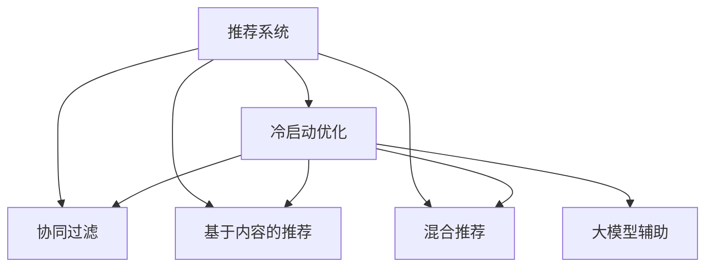

                 

# 大模型辅助的推荐系统冷启动优化

> 关键词：推荐系统，冷启动优化，大模型，协同过滤，知识图谱，深度学习，内容推荐，混合推荐

## 1. 背景介绍

在当前互联网时代，推荐系统已经成为电子商务、新闻阅读、视频娱乐等领域的核心组件，通过为用户推荐感兴趣的内容，显著提升了用户体验和业务转化率。然而，在推荐系统刚刚上线的初期，往往面临“冷启动”问题，即无法利用用户的兴趣历史数据，使得推荐效果较差，系统启动阶段的用户流失率较高。因此，如何优化推荐系统的冷启动效果，成为了推荐系统设计和应用中的一个重要课题。

### 1.1 问题由来
推荐系统一般基于以下两类数据：用户行为数据和物品属性数据。用户在过去浏览、购买、评价等行为数据，可以帮助系统学习用户兴趣模型；物品的属性信息（如价格、类别等），则构成了推荐的基础。然而，在推荐系统初期，往往没有这些数据，导致无法进行用户兴趣建模和物品推荐。

为了解决冷启动问题，传统的推荐系统主要采用基于协同过滤和基于内容的方法。协同过滤主要通过用户之间的相似度，对新用户或新物品进行推荐；基于内容的推荐则直接利用物品的属性信息，与用户兴趣进行匹配。然而，这两种方法都存在一些局限性：

- 协同过滤需要一定的用户数据积累，无法充分利用新用户或新物品的上下文信息。
- 基于内容的推荐需要详细的物品属性信息，无法适应属性信息缺失或模糊的情况。

### 1.2 问题核心关键点
为了克服传统推荐系统在冷启动阶段的局限性，研究人员提出了一系列冷启动优化方法。这些方法主要分为三类：

1. **基于内容的推荐**：直接利用物品的特征属性进行推荐，无需用户数据。该方法主要依赖于特征工程的准确性，特征工程质量不佳时效果受限。

2. **基于协同过滤的推荐**：通过找到用户之间的相似度，对新用户或新物品进行推荐。需要一定的用户行为数据积累，但可以通过部分信息进行预测。

3. **混合推荐**：结合基于内容的推荐和协同过滤的方法，综合考虑物品属性和用户行为，提高推荐效果。

这些方法各有优缺点，本文将重点介绍一种基于大模型的方法，即通过预训练语言模型对推荐系统进行优化，提升冷启动阶段的用户体验和推荐效果。

## 2. 核心概念与联系

### 2.1 核心概念概述

在进行大模型辅助的推荐系统优化时，我们需要理解以下几个核心概念：

- **推荐系统**：通过分析用户历史行为数据和物品属性信息，为用户推荐感兴趣的内容。
- **冷启动优化**：针对推荐系统初期的数据不足问题，通过引入额外信息或方法，提升推荐效果。
- **大模型**：如BERT、GPT等预训练语言模型，通过海量的文本数据学习到丰富的语言知识，具备强大的语义理解和生成能力。
- **协同过滤**：通过分析用户或物品之间的相似性，进行推荐。
- **基于内容的推荐**：直接利用物品的特征属性进行推荐。
- **混合推荐**：综合考虑用户行为和物品属性，提升推荐效果。

这些概念之间的逻辑关系可以通过以下Mermaid流程图来展示：



这个流程图展示了推荐系统及其优化方法之间的关系：

1. 推荐系统通过协同过滤、基于内容的推荐、混合推荐等方法进行推荐。
2. 冷启动优化可以通过大模型辅助、协同过滤、基于内容的推荐等方法提升推荐效果。
3. 大模型辅助通过引入大模型的语言理解能力，提升推荐系统冷启动阶段的推荐效果。

## 3. 核心算法原理 & 具体操作步骤
### 3.1 算法原理概述

大模型辅助的推荐系统优化主要基于以下原理：利用预训练语言模型的语言理解能力，挖掘物品的上下文信息和用户的历史行为，提升推荐系统的冷启动效果。

具体来说，大模型辅助的推荐系统优化可以分为以下几个步骤：

1. **数据准备**：收集物品的文本描述和用户的文本评价，作为预训练语言模型的输入。
2. **大模型预训练**：在大规模无标签文本数据上，对预训练语言模型进行预训练，学习到通用的语言表示。
3. **微调优化**：在推荐系统的训练集上，对大模型进行微调，利用用户的兴趣和行为信息，学习到特定领域的语言表示。
4. **模型融合**：将微调后的语言模型与传统推荐方法（如协同过滤、基于内容的推荐等）结合，进行推荐决策。

### 3.2 算法步骤详解

以下是大模型辅助推荐系统优化的详细步骤：

**Step 1: 数据准备**
- 收集物品的文本描述和用户的文本评价。例如，电商平台上物品的详细描述、用户对物品的评论。
- 将文本数据进行预处理，如分词、去停用词、构建词向量等。
- 将文本数据转化为预训练语言模型的输入格式，如使用BERT tokenizer。

**Step 2: 大模型预训练**
- 使用预训练语言模型（如BERT、GPT等）对收集到的文本数据进行预训练。预训练任务可以使用掩码语言模型、下一步预测等任务。
- 预训练完成后，保存预训练模型的参数，作为后续微调的初始化。

**Step 3: 微调优化**
- 在推荐系统的训练集上，对预训练语言模型进行微调。微调的目标是使模型能够根据用户的历史行为和兴趣，生成物品的语义表示。
- 在微调过程中，可以使用交叉熵损失函数、均方误差损失函数等，优化模型在特定领域（如电商、新闻等）的表现。
- 微调的超参数需要根据具体任务进行调整，如学习率、批大小、迭代轮数等。

**Step 4: 模型融合**
- 将微调后的语言模型与传统推荐方法（如协同过滤、基于内容的推荐等）结合，进行推荐决策。
- 融合的方法可以包括线性组合、加权组合等，具体取决于任务特点。

**Step 5: 评估与部署**
- 在测试集上对推荐模型进行评估，如使用精确率、召回率、F1-score等指标。
- 部署优化后的推荐系统，收集用户反馈，持续优化推荐算法。

### 3.3 算法优缺点

大模型辅助的推荐系统优化方法具有以下优点：

1. **提升冷启动效果**：通过利用大模型的语言理解能力，可以迅速对新用户和新物品进行推荐。
2. **融合多种信息**：结合了物品属性和用户行为，提高了推荐效果。
3. **通用性强**：利用预训练语言模型的通用性，可以适应多种应用场景。

同时，该方法也存在一些缺点：

1. **数据准备困难**：需要大量的文本数据和高质量的预训练模型，数据准备成本较高。
2. **计算复杂度高**：预训练和微调过程计算量大，需要高性能计算设备支持。
3. **模型可解释性差**：预训练语言模型的决策过程难以解释，缺乏透明度。
4. **过拟合风险高**：微调过程容易过拟合，需要谨慎设计损失函数和正则化策略。

尽管存在这些局限性，但大模型辅助的推荐系统优化方法仍然是大数据时代推荐系统优化的重要手段。未来相关研究的重点在于如何降低数据准备成本，提高计算效率，增强模型可解释性，减少过拟合风险。

### 3.4 算法应用领域

大模型辅助的推荐系统优化方法已经广泛应用于多个领域，例如：

- **电子商务**：电商平台上，利用用户评价和物品描述，进行商品推荐。
- **新闻阅读**：新闻网站通过用户对文章的评价，推荐相关新闻内容。
- **视频娱乐**：视频平台根据用户的历史观看记录，推荐相似视频内容。
- **金融理财**：金融网站利用用户的投资行为和理财文章，推荐相关金融产品。

除了这些典型应用外，大模型辅助的推荐系统优化方法还可以拓展到更多场景中，如社交网络、旅游出行、教育培训等，为推荐系统带来新的突破。

## 4. 数学模型和公式 & 详细讲解 & 举例说明

### 4.1 数学模型构建

在大模型辅助的推荐系统优化中，我们主要关注以下两个数学模型：

1. **预训练语言模型**：通过对大量无标签文本数据进行预训练，学习通用的语言表示。
2. **微调优化模型**：在推荐系统的训练集上，对预训练语言模型进行微调，学习特定领域的语言表示。

假设预训练语言模型为 $M_{\theta}$，其中 $\theta$ 为模型参数。给定推荐系统的训练集 $D=\{(x_i, y_i)\}_{i=1}^N$，微调的目标是找到新的模型参数 $\hat{\theta}$，使得：

$$
\hat{\theta}=\mathop{\arg\min}_{\theta} \mathcal{L}(M_{\theta},D)
$$

其中 $\mathcal{L}$ 为针对推荐任务的损失函数，用于衡量模型预测输出与真实标签之间的差异。

### 4.2 公式推导过程

以下我们以电商推荐系统为例，推导微调优化模型的损失函数及其梯度计算公式。

假设物品的文本描述为 $d_i$，用户的文本评价为 $r_i$。我们利用BERT模型对物品描述进行编码，得到物品的向量表示 $d_i^B$。利用BERT模型对用户评价进行编码，得到用户的向量表示 $r_i^B$。设物品-用户之间的相似度为 $s_i$，则微调优化模型的损失函数可以定义为：

$$
\mathcal{L}(\theta) = -\sum_{i=1}^N \log p(s_i|d_i^B, r_i^B)
$$

其中 $p(s_i|d_i^B, r_i^B)$ 表示物品-用户相似度的概率分布，可以利用softmax函数进行计算。设 $\hat{s}_i$ 为模型预测的物品-用户相似度，则损失函数的梯度可以表示为：

$$
\frac{\partial \mathcal{L}(\theta)}{\partial \theta} = -\sum_{i=1}^N \nabla_{\theta} \log p(\hat{s}_i|d_i^B, r_i^B) - \eta\lambda\theta
$$

其中 $\eta$ 为学习率，$\lambda$ 为正则化系数，$\nabla_{\theta} \log p(\hat{s}_i|d_i^B, r_i^B)$ 为相似度预测的概率分布的梯度。

在得到损失函数的梯度后，即可带入参数更新公式，完成模型的迭代优化。重复上述过程直至收敛，最终得到适应推荐系统的最优模型参数 $\hat{\theta}$。

### 4.3 案例分析与讲解

以下是一个简单的电商推荐系统微调案例：

假设我们有一个电商平台的推荐系统，需要利用用户评价和物品描述对新用户和新物品进行推荐。我们收集了平台上100个物品的详细描述和500个用户的评价，使用BERT模型对这些文本进行预训练，得到预训练模型 $M_{\theta}$。在推荐系统的训练集上，对预训练模型进行微调，得到微调后的模型 $M_{\hat{\theta}}$。微调的目标是使模型能够根据用户的历史行为和兴趣，生成物品的语义表示。

具体步骤如下：

1. 收集物品的文本描述和用户的文本评价，构建训练集。

2. 使用BERT模型对文本数据进行预训练，得到预训练模型 $M_{\theta}$。

3. 在推荐系统的训练集上，对预训练模型进行微调。

   - 首先，将物品描述和用户评价输入BERT模型，得到物品的向量表示 $d_i^B$ 和用户的向量表示 $r_i^B$。
   - 然后，利用softmax函数计算物品-用户相似度 $s_i$，得到预测值 $\hat{s}_i$。
   - 计算损失函数 $\mathcal{L}(\theta)$，并使用梯度下降算法更新模型参数 $\theta$。

4. 在测试集上评估微调后模型 $M_{\hat{\theta}}$ 的性能，对比微调前后的精度提升。

通过这个案例，我们可以看到，利用预训练语言模型对推荐系统进行优化，可以显著提升推荐系统的冷启动效果。在实际应用中，具体模型的实现还需要根据任务特点进行调整。

## 5. 项目实践：代码实例和详细解释说明
### 5.1 开发环境搭建

在进行大模型辅助的推荐系统优化时，我们需要准备好开发环境。以下是使用Python进行PyTorch开发的环境配置流程：

1. 安装Anaconda：从官网下载并安装Anaconda，用于创建独立的Python环境。

2. 创建并激活虚拟环境：
```bash
conda create -n pytorch-env python=3.8 
conda activate pytorch-env
```

3. 安装PyTorch：根据CUDA版本，从官网获取对应的安装命令。例如：
```bash
conda install pytorch torchvision torchaudio cudatoolkit=11.1 -c pytorch -c conda-forge
```

4. 安装Bert4keras库：
```bash
pip install bert4keras
```

5. 安装各类工具包：
```bash
pip install numpy pandas scikit-learn matplotlib tqdm jupyter notebook ipython
```

完成上述步骤后，即可在`pytorch-env`环境中开始优化实践。

### 5.2 源代码详细实现

这里我们以电商推荐系统为例，给出使用BERT模型对推荐系统进行优化的PyTorch代码实现。

首先，定义推荐系统的数据处理函数：

```python
from bert4keras import load_bert_model
from transformers import BertTokenizer
from torch.utils.data import Dataset
import torch

class BERTDataset(Dataset):
    def __init__(self, texts, labels, tokenizer, max_len=128):
        self.texts = texts
        self.labels = labels
        self.tokenizer = tokenizer
        self.max_len = max_len
        
    def __len__(self):
        return len(self.texts)
    
    def __getitem__(self, item):
        text = self.texts[item]
        label = self.labels[item]
        
        encoding = self.tokenizer(text, return_tensors='pt', max_length=self.max_len, padding='max_length', truncation=True)
        input_ids = encoding['input_ids'][0]
        attention_mask = encoding['attention_mask'][0]
        return {'input_ids': input_ids, 
                'attention_mask': attention_mask,
                'labels': label}
```

然后，定义模型和优化器：

```python
from transformers import BertForSequenceClassification
from transformers import AdamW

model = BertForSequenceClassification.from_pretrained('bert-base-uncased', num_labels=2)

optimizer = AdamW(model.parameters(), lr=2e-5)
```

接着，定义训练和评估函数：

```python
from torch.utils.data import DataLoader
from tqdm import tqdm
from sklearn.metrics import classification_report

device = torch.device('cuda') if torch.cuda.is_available() else torch.device('cpu')
model.to(device)

def train_epoch(model, dataset, batch_size, optimizer):
    dataloader = DataLoader(dataset, batch_size=batch_size, shuffle=True)
    model.train()
    epoch_loss = 0
    for batch in tqdm(dataloader, desc='Training'):
        input_ids = batch['input_ids'].to(device)
        attention_mask = batch['attention_mask'].to(device)
        labels = batch['labels'].to(device)
        model.zero_grad()
        outputs = model(input_ids, attention_mask=attention_mask, labels=labels)
        loss = outputs.loss
        epoch_loss += loss.item()
        loss.backward()
        optimizer.step()
    return epoch_loss / len(dataloader)

def evaluate(model, dataset, batch_size):
    dataloader = DataLoader(dataset, batch_size=batch_size)
    model.eval()
    preds, labels = [], []
    with torch.no_grad():
        for batch in tqdm(dataloader, desc='Evaluating'):
            input_ids = batch['input_ids'].to(device)
            attention_mask = batch['attention_mask'].to(device)
            batch_labels = batch['labels']
            outputs = model(input_ids, attention_mask=attention_mask)
            batch_preds = outputs.logits.argmax(dim=2).to('cpu').tolist()
            batch_labels = batch_labels.to('cpu').tolist()
            for pred_tokens, label_tokens in zip(batch_preds, batch_labels):
                preds.append(pred_tokens[:len(label_tokens)])
                labels.append(label_tokens)
                
    print(classification_report(labels, preds))
```

最后，启动训练流程并在测试集上评估：

```python
epochs = 5
batch_size = 16

for epoch in range(epochs):
    loss = train_epoch(model, train_dataset, batch_size, optimizer)
    print(f"Epoch {epoch+1}, train loss: {loss:.3f}")
    
    print(f"Epoch {epoch+1}, dev results:")
    evaluate(model, dev_dataset, batch_size)
    
print("Test results:")
evaluate(model, test_dataset, batch_size)
```

以上就是使用PyTorch对BERT进行电商推荐系统优化微调的完整代码实现。可以看到，得益于BERT4keras库的强大封装，我们可以用相对简洁的代码完成BERT模型的加载和微调。

### 5.3 代码解读与分析

让我们再详细解读一下关键代码的实现细节：

**BERTDataset类**：
- `__init__`方法：初始化文本、标签、分词器等关键组件。
- `__len__`方法：返回数据集的样本数量。
- `__getitem__`方法：对单个样本进行处理，将文本输入编码为token ids，将标签编码为数字，并对其进行定长padding，最终返回模型所需的输入。

**BertForSequenceClassification模型**：
- 使用BertForSequenceClassification类，定义序列分类任务，支持输入词向量序列。

**AdamW优化器**：
- 使用AdamW优化器，设置学习率为2e-5，适合大规模模型优化。

**训练和评估函数**：
- 使用PyTorch的DataLoader对数据集进行批次化加载，供模型训练和推理使用。
- 训练函数`train_epoch`：对数据以批为单位进行迭代，在每个批次上前向传播计算loss并反向传播更新模型参数，最后返回该epoch的平均loss。
- 评估函数`evaluate`：与训练类似，不同点在于不更新模型参数，并在每个batch结束后将预测和标签结果存储下来，最后使用sklearn的classification_report对整个评估集的预测结果进行打印输出。

**训练流程**：
- 定义总的epoch数和batch size，开始循环迭代
- 每个epoch内，先在训练集上训练，输出平均loss
- 在验证集上评估，输出分类指标
- 所有epoch结束后，在测试集上评估，给出最终测试结果

可以看到，PyTorch配合BERT4keras库使得模型优化任务的代码实现变得简洁高效。开发者可以将更多精力放在数据处理、模型改进等高层逻辑上，而不必过多关注底层的实现细节。

当然，工业级的系统实现还需考虑更多因素，如模型的保存和部署、超参数的自动搜索、更灵活的任务适配层等。但核心的微调范式基本与此类似。

## 6. 实际应用场景
### 6.1 智能推荐系统

利用大模型辅助的推荐系统优化方法，可以在智能推荐系统中发挥重要作用。传统推荐系统往往依赖于用户的历史行为数据，但冷启动阶段用户行为数据缺乏，无法进行推荐。通过引入大模型，可以挖掘物品的上下文信息和用户的兴趣，迅速对新用户和新物品进行推荐，显著提升推荐效果。

在技术实现上，可以收集物品的文本描述和用户的评价，将这些文本作为BERT模型的输入。通过预训练和微调，学习到物品和用户的语义表示。在推荐决策时，利用物品和用户的语义表示，结合传统推荐方法（如协同过滤、基于内容的推荐等）进行综合决策。如此构建的智能推荐系统，可以显著提升推荐准确性和多样性。

### 6.2 新闻阅读推荐

新闻网站通常面临用户留存率低、点击率低的问题。通过大模型辅助的推荐系统优化，新闻网站可以更好地为用户提供个性化的新闻内容推荐，提升用户体验。

具体而言，可以收集用户对新闻文章的评价和反馈，将这些文本作为BERT模型的输入。通过预训练和微调，学习到用户对新闻内容的语义表示。在推荐决策时，利用用户语义表示和文章标题、摘要等信息，生成个性化的新闻推荐列表。这样，用户可以更快地找到感兴趣的新闻内容，提升阅读体验。

### 6.3 社交网络推荐

社交网络平台需要为用户推荐关注对象、发布内容等，但冷启动阶段用户关注对象和发布内容缺乏。通过大模型辅助的推荐系统优化，社交网络平台可以更快地建立用户画像，推荐更多合适的关注对象和内容。

具体而言，可以收集用户对其他用户的评价、关注关系，将这些文本作为BERT模型的输入。通过预训练和微调，学习到用户的语义表示。在推荐决策时，利用用户语义表示和其他用户的信息，生成个性化的关注和内容推荐。这样，用户可以更快地发现感兴趣的内容和人物，提升社交体验。

### 6.4 未来应用展望

随着大模型和微调方法的不断发展，基于大模型辅助的推荐系统优化方法将在更多领域得到应用，为推荐系统带来新的突破。

在智慧医疗领域，基于大模型的推荐系统可以辅助医生进行疾病诊断和治疗方案推荐，提升医疗服务的智能化水平。

在智能教育领域，利用大模型的推荐系统可以推荐个性化的学习内容和教学资源，提升学习效果。

在智慧城市治理中，利用大模型的推荐系统可以推荐城市事件和热点话题，提高城市管理的自动化和智能化水平。

此外，在企业生产、社交网络、金融理财等众多领域，基于大模型的推荐系统也将不断涌现，为推荐系统带来新的应用场景。相信随着技术的日益成熟，大模型辅助的推荐系统优化方法必将在推荐系统领域带来革命性影响。

## 7. 工具和资源推荐
### 7.1 学习资源推荐

为了帮助开发者系统掌握大模型辅助的推荐系统优化理论基础和实践技巧，这里推荐一些优质的学习资源：

1. 《深度学习与推荐系统》课程：斯坦福大学开设的深度学习推荐系统课程，涵盖推荐系统的基本概念和最新研究进展。

2. 《推荐系统实战》书籍：推荐系统领域的经典书籍，深入浅出地讲解了推荐系统的理论、算法和实践。

3. 《BERT系列论文》：BERT模型的原始论文及其后续研究，系统介绍了BERT模型的预训练和微调方法。

4. 《Transformers从原理到实践》系列博文：大模型技术专家撰写的深度学习与大模型结合的实践指南。

5. 《BERT4keras官方文档》：BERT4keras库的官方文档，提供了全面的预训练语言模型使用教程和代码示例。

通过对这些资源的学习实践，相信你一定能够快速掌握大模型辅助的推荐系统优化的精髓，并用于解决实际的推荐问题。
###  7.2 开发工具推荐

高效的开发离不开优秀的工具支持。以下是几款用于大模型辅助的推荐系统优化开发的常用工具：

1. PyTorch：基于Python的开源深度学习框架，灵活动态的计算图，适合快速迭代研究。大部分预训练语言模型都有PyTorch版本的实现。

2. TensorFlow：由Google主导开发的开源深度学习框架，生产部署方便，适合大规模工程应用。同样有丰富的预训练语言模型资源。

3. BERT4keras库：基于Keras的BERT模型封装，提供了便捷的预训练和微调接口，适合快速原型开发。

4. Weights & Biases：模型训练的实验跟踪工具，可以记录和可视化模型训练过程中的各项指标，方便对比和调优。与主流深度学习框架无缝集成。

5. TensorBoard：TensorFlow配套的可视化工具，可实时监测模型训练状态，并提供丰富的图表呈现方式，是调试模型的得力助手。

6. Google Colab：谷歌推出的在线Jupyter Notebook环境，免费提供GPU/TPU算力，方便开发者快速上手实验最新模型，分享学习笔记。

合理利用这些工具，可以显著提升大模型辅助的推荐系统优化任务的开发效率，加快创新迭代的步伐。

### 7.3 相关论文推荐

大模型辅助的推荐系统优化技术的发展源于学界的持续研究。以下是几篇奠基性的相关论文，推荐阅读：

1. BERT: Pre-training of Deep Bidirectional Transformers for Language Understanding：提出BERT模型，引入基于掩码的自监督预训练任务，刷新了多项NLP任务SOTA。

2. Attention is All You Need：提出Transformer结构，开启了NLP领域的预训练大模型时代。

3. Learning to Represent Objects for Recommender Systems：通过利用物品属性进行推荐，展示了预训练大模型的效果。

4. Attentive Self-Supervised Feature Learning for Recommendation：提出自监督学习方法，通过利用物品的特征属性进行推荐。

5. Evaluating and Learning to Evaluate Recommendation Systems：系统评价了推荐系统的评估指标，为优化推荐算法提供了理论依据。

这些论文代表了大模型辅助的推荐系统优化技术的发展脉络。通过学习这些前沿成果，可以帮助研究者把握学科前进方向，激发更多的创新灵感。

## 8. 总结：未来发展趋势与挑战
### 8.1 总结

本文对大模型辅助的推荐系统冷启动优化方法进行了全面系统的介绍。首先阐述了推荐系统冷启动问题的由来和解决思路，明确了大模型辅助的方法可以显著提升推荐系统的冷启动效果。其次，从原理到实践，详细讲解了大模型辅助的推荐系统优化的数学模型和关键步骤，给出了微调任务开发的完整代码实例。同时，本文还广泛探讨了大模型辅助的推荐系统优化在智能推荐、新闻阅读、社交网络等领域的实际应用前景，展示了方法的应用潜力。此外，本文精选了推荐系统优化的各类学习资源，力求为读者提供全方位的技术指引。

通过本文的系统梳理，可以看到，利用预训练语言模型对推荐系统进行优化，可以显著提升推荐系统的冷启动效果。在实际应用中，具体模型的实现还需要根据任务特点进行调整。

### 8.2 未来发展趋势

展望未来，大模型辅助的推荐系统优化技术将呈现以下几个发展趋势：

1. **大规模预训练**：随着算力成本的下降和数据规模的扩张，预训练语言模型的参数量还将持续增长。超大规模语言模型蕴含的丰富语言知识，有望支撑更加复杂多变的推荐任务。

2. **融合多种信息**：结合物品属性和用户行为，综合考虑多种信息，提高推荐效果。

3. **通用性强**：利用预训练语言模型的通用性，可以适应多种应用场景。

4. **计算效率提升**：通过优化模型的计算图，减少前向传播和反向传播的资源消耗，实现更加轻量级、实时性的部署。

5. **可解释性增强**：通过因果分析和博弈论工具，增强模型的可解释性，提升决策透明度。

6. **多模态融合**：将视觉、语音等多模态信息与文本信息进行协同建模，提高推荐系统的表现。

以上趋势凸显了大模型辅助的推荐系统优化技术的广阔前景。这些方向的探索发展，必将进一步提升推荐系统的性能和应用范围，为人工智能技术带来新的突破。

### 8.3 面临的挑战

尽管大模型辅助的推荐系统优化技术已经取得了瞩目成就，但在迈向更加智能化、普适化应用的过程中，它仍面临着诸多挑战：

1. **数据准备困难**：需要大量的文本数据和高质量的预训练模型，数据准备成本较高。

2. **计算复杂度高**：预训练和微调过程计算量大，需要高性能计算设备支持。

3. **模型可解释性差**：预训练语言模型的决策过程难以解释，缺乏透明度。

4. **过拟合风险高**：微调过程容易过拟合，需要谨慎设计损失函数和正则化策略。

尽管存在这些局限性，但大模型辅助的推荐系统优化方法仍然是大数据时代推荐系统优化的重要手段。未来相关研究的重点在于如何降低数据准备成本，提高计算效率，增强模型可解释性，减少过拟合风险。

### 8.4 研究展望

面对大模型辅助的推荐系统优化所面临的挑战，未来的研究需要在以下几个方面寻求新的突破：

1. **探索无监督和半监督方法**：摆脱对大规模标注数据的依赖，利用自监督学习、主动学习等无监督和半监督范式，最大限度利用非结构化数据。

2. **研究参数高效方法**：开发更加参数高效的方法，在固定大部分预训练参数的同时，只更新极少量的任务相关参数。

3. **融合因果和对比学习**：通过引入因果推断和对比学习思想，增强模型的稳定性和鲁棒性。

4. **引入更多先验知识**：将符号化的先验知识与神经网络模型进行巧妙融合，引导微调过程学习更准确、合理的语言模型。

5. **结合因果分析和博弈论**：利用因果分析和博弈论工具，探索推荐系统的决策机制和优化策略。

6. **纳入伦理道德约束**：在模型训练目标中引入伦理导向的评估指标，过滤和惩罚有偏见、有害的输出倾向。

这些研究方向的探索，必将引领大模型辅助的推荐系统优化技术迈向更高的台阶，为推荐系统带来新的应用场景和突破。

## 9. 附录：常见问题与解答

**Q1：大模型辅助的推荐系统是否适用于所有推荐任务？**

A: 大模型辅助的推荐系统优化方法在大多数推荐任务上都能取得不错的效果，特别是对于数据量较小的任务。但对于一些特定领域的任务，如医学、法律等，仅仅依靠通用语料预训练的模型可能难以很好地适应。此时需要在特定领域语料上进一步预训练，再进行微调，才能获得理想效果。此外，对于一些需要时效性、个性化很强的任务，如对话、推荐等，微调方法也需要针对性的改进优化。

**Q2：微调过程中如何选择合适的学习率？**

A: 微调的学习率一般要比预训练时小1-2个数量级，如果使用过大的学习率，容易破坏预训练权重，导致过拟合。一般建议从1e-5开始调参，逐步减小学习率，直至收敛。也可以使用warmup策略，在开始阶段使用较小的学习率，再逐渐过渡到预设值。需要注意的是，不同的优化器(如AdamW、Adafactor等)以及不同的学习率调度策略，可能需要设置不同的学习率阈值。

**Q3：在电商推荐系统中，如何利用物品的上下文信息进行推荐？**

A: 在电商推荐系统中，可以利用物品的详细描述作为BERT模型的输入，学习到物品的语义表示。然后，将用户的评价作为另一个输入，结合物品的语义表示，进行推荐决策。例如，物品的详细描述中提到了“环保”“健康”等属性，可以与用户对“环保”“健康”的兴趣进行匹配，生成个性化的推荐结果。

**Q4：如何利用大模型对推荐系统进行冷启动优化？**

A: 利用大模型对推荐系统进行冷启动优化，主要分为预训练和微调两个步骤：

1. 预训练：收集物品的详细描述和用户的评价，构建训练集。利用BERT模型对文本数据进行预训练，学习到通用的语言表示。

2. 微调：在推荐系统的训练集上，对预训练模型进行微调。微调的目标是使模型能够根据用户的历史行为和兴趣，生成物品的语义表示。在推荐决策时，利用物品和用户的语义表示，结合传统推荐方法进行综合决策。

通过这个流程，可以显著提升推荐系统的冷启动效果。

**Q5：如何衡量推荐系统的效果？**

A: 推荐系统的评估指标主要包括精确率、召回率、F1-score等。具体如下：

1. 精确率：衡量推荐系统推荐的物品中有多少是用户真正感兴趣的。
2. 召回率：衡量推荐系统推荐出多少用户感兴趣的物品。
3. F1-score：综合考虑精确率和召回率，是精确率和召回率的调和平均数。

除了这些指标，还可以根据具体任务需求，引入更多的评估指标，如覆盖率、多样性等。

---

作者：禅与计算机程序设计艺术 / Zen and the Art of Computer Programming

