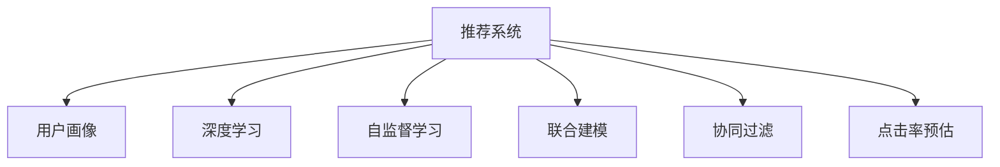

                 

# 大模型辅助的推荐系统多维度用户画像构建

> 关键词：推荐系统,用户画像,多维度,深度学习,大模型,自监督学习,联合建模,协同过滤,CTR预估

## 1. 背景介绍

推荐系统作为互联网产品的重要组件，通过向用户推荐个性化内容，极大地提高了用户体验和产品粘性。传统推荐算法主要依赖于用户的历史行为数据和物品的静态特征，难以充分挖掘用户的潜在兴趣和隐式偏好。然而，随着深度学习和大模型技术的发展，推荐系统也迎来了新的突破点。

在大模型辅助的推荐系统中，多维度用户画像的构建显得尤为重要。用户画像可以通过对用户历史行为、兴趣爱好、社会关系、情感状态等多方面的综合分析，形成对用户个性化特征的全面刻画，从而为推荐系统提供更加丰富的参考信息，提升推荐效果和用户体验。本文将详细探讨如何利用大模型辅助构建多维度用户画像，提升推荐系统的性能。

## 2. 核心概念与联系

### 2.1 核心概念概述

为更好地理解大模型辅助多维度用户画像构建的方法，本节将介绍几个密切相关的核心概念：

- 推荐系统(Recommendation System)：通过收集用户行为数据，推荐用户可能感兴趣的物品的系统。推荐系统广泛应用于电商、视频、音乐、新闻等诸多领域。

- 用户画像(User Profile)：用户画像是对用户特征的全面刻画，包括基本信息、兴趣爱好、行为特征、社会关系等，用于推荐系统中的个性化推荐。

- 深度学习(Deep Learning)：利用深度神经网络模型从数据中学习到高层次特征表示，广泛应用于图像识别、自然语言处理、推荐系统等领域。

- 大模型(Large Model)：以自回归(如GPT)或自编码(如BERT)模型为代表的大规模预训练语言模型。通过在大规模无标签文本语料上进行预训练，学习通用的语言表示。

- 自监督学习(Self-Supervised Learning)：指在没有标签的情况下，利用模型自身的输出或部分结构信息进行训练，以学习到更加鲁棒的特征表示。

- 联合建模(Joint Modeling)：将多个不同领域的数据特征联合建模，进行协同优化，以提升推荐系统的性能。

- 协同过滤(Collaborative Filtering)：通过分析用户和物品之间的相似性，推荐用户可能感兴趣的新物品。协同过滤分为基于用户的协同过滤和基于物品的协同过滤两种。

- 点击率预估(CTR Prediction)：预测用户对物品的点击概率，用于推荐系统中的排名排序。

这些核心概念之间的逻辑关系可以通过以下Mermaid流程图来展示：



这个流程图展示了大模型辅助多维度用户画像构建的核心概念及其之间的关系：

1. 推荐系统通过多维度用户画像进行个性化推荐。
2. 深度学习利用大模型学习用户特征。
3. 自监督学习在大模型预训练中挖掘特征。
4. 联合建模将不同特征联合优化，提升推荐效果。
5. 协同过滤通过分析用户和物品相似性推荐物品。
6. CTR预估用于推荐系统中的排名排序。

这些概念共同构成了推荐系统构建多维度用户画像的完整框架，使其能够实现更加精准、高效的个性化推荐。

## 3. 核心算法原理 & 具体操作步骤

### 3.1 算法原理概述

在大模型辅助的推荐系统中，多维度用户画像的构建可以分为以下几个步骤：

1. 数据预处理：收集用户的历史行为数据、兴趣爱好数据、社交网络数据、情感状态数据等，并对其进行清洗、归一化等预处理操作。
2. 特征提取：利用深度学习模型对处理后的数据进行特征提取，学习到用户画像的高层次特征表示。
3. 联合建模：将不同领域的数据特征联合建模，进行协同优化，得到用户画像的综合表示。
4. 协同过滤：利用用户画像中的特征与物品特征进行相似性计算，推荐用户可能感兴趣的新物品。
5. 点击率预估：利用用户画像与物品特征的联合表示，进行点击率预估，用于推荐系统中的排名排序。

通过上述步骤，可以构建出具有丰富多维度特征的用户画像，从而提升推荐系统的性能。

### 3.2 算法步骤详解

#### 3.2.1 数据预处理

数据预处理是构建用户画像的第一步，主要包括：

1. 数据收集：从用户的登录日志、浏览记录、购买记录、社交网络、评论反馈等渠道，收集用户的多维数据。
2. 数据清洗：对收集到的数据进行去重、去噪、去歧义等清洗操作，确保数据质量。
3. 特征构建：将数据转化为模型的输入特征，如时间戳、浏览次数、评分、情感标签等。
4. 特征归一化：对特征进行归一化处理，使其符合模型训练的要求。

#### 3.2.2 特征提取

特征提取是利用深度学习模型对数据进行特征学习的过程，主要步骤如下：

1. 模型选择：选择合适的深度学习模型，如BERT、GPT、RNN等。
2. 模型训练：使用预处理后的数据对深度学习模型进行训练，学习到用户画像的特征表示。
3. 特征编码：将模型输出转化为向量表示，作为用户画像的特征向量。

#### 3.2.3 联合建模

联合建模是将不同领域的数据特征联合建模，进行协同优化的过程，主要步骤如下：

1. 特征融合：将不同领域的数据特征进行融合，如将用户画像、物品特征、时间特征等进行拼接。
2. 模型训练：使用联合特征训练深度学习模型，学习到用户画像的综合表示。
3. 特征解码：将模型输出解码为多维用户画像，包含不同领域的特征表示。

#### 3.2.4 协同过滤

协同过滤是利用用户画像中的特征与物品特征进行相似性计算，推荐用户可能感兴趣的新物品的过程，主要步骤如下：

1. 相似度计算：计算用户画像与物品特征的相似度，如使用余弦相似度、欧式距离等。
2. 排名排序：根据相似度计算结果，对物品进行排名排序，推荐用户可能感兴趣的新物品。

#### 3.2.5 点击率预估

点击率预估是利用用户画像与物品特征的联合表示，进行点击率预估的过程，主要步骤如下：

1. 模型训练：使用用户画像与物品特征的联合表示训练点击率预估模型，如使用CTR模型。
2. 预估点击率：根据用户画像与物品特征的联合表示，进行点击率预估，用于推荐系统中的排名排序。

### 3.3 算法优缺点

大模型辅助的多维度用户画像构建方法具有以下优点：

1. 高精度：通过深度学习模型学习高层次特征表示，能够挖掘用户画像的深层次信息，提升推荐系统的精度。
2. 泛化性强：深度学习模型能够泛化到不同领域的数据，提升用户画像的泛化能力。
3. 可解释性：深度学习模型具有较好的可解释性，能够揭示用户画像中的重要特征。
4. 可扩展性：深度学习模型可以方便地扩展到不同的数据类型和数据规模。

同时，该方法也存在一定的局限性：

1. 数据依赖性高：深度学习模型对数据质量要求较高，数据清洗和特征构建需要耗费大量时间和精力。
2. 计算复杂度高：深度学习模型计算复杂度较高，需要高性能的硬件支持。
3. 模型黑盒化：深度学习模型作为黑盒模型，难以解释其内部工作机制和决策逻辑。
4. 数据隐私问题：用户画像涉及用户隐私数据，需要严格的隐私保护措施。

尽管存在这些局限性，但就目前而言，大模型辅助的多维度用户画像构建方法仍然是推荐系统中的前沿技术，具有广泛的应用前景。

### 3.4 算法应用领域

大模型辅助的多维度用户画像构建方法，在推荐系统中的应用领域广泛，包括但不限于：

- 电商推荐：通过分析用户浏览、购买历史，预测用户可能感兴趣的商品，进行个性化推荐。
- 视频推荐：利用用户观影历史和评分，推荐用户可能喜欢的影片和剧集。
- 音乐推荐：分析用户听歌历史和情感标签，推荐用户可能喜欢的歌曲和音乐人。
- 新闻推荐：根据用户阅读历史和评论反馈，推荐用户可能感兴趣的新闻和文章。
- 社交网络：利用用户社交网络数据，推荐用户可能感兴趣的朋友和内容。

除了上述这些经典应用领域外，大模型辅助的多维度用户画像构建方法也在不断扩展到更多的场景中，如在线教育、金融服务、智能家居等，为推荐系统带来了新的应用方向。

## 4. 数学模型和公式 & 详细讲解 & 举例说明

### 4.1 数学模型构建

本节将使用数学语言对大模型辅助多维度用户画像构建的过程进行更加严格的刻画。

设用户画像的特征表示为 $\mathbf{x}$，物品的特征表示为 $\mathbf{y}$，深度学习模型的预测结果为 $\mathbf{u}$，点击率预估模型的预测结果为 $p$。大模型辅助的多维度用户画像构建过程可以分为以下几个步骤：

1. 数据预处理：将用户画像数据 $\mathbf{x}$ 和物品特征数据 $\mathbf{y}$ 进行融合，得到联合特征表示 $\mathbf{z}$。
2. 特征提取：使用深度学习模型对联合特征 $\mathbf{z}$ 进行特征提取，得到用户画像的高层次特征表示 $\mathbf{u}$。
3. 联合建模：将用户画像特征 $\mathbf{u}$ 和物品特征 $\mathbf{y}$ 联合建模，得到用户画像的综合表示 $\mathbf{v}$。
4. 协同过滤：利用用户画像特征 $\mathbf{v}$ 和物品特征 $\mathbf{y}$ 进行相似度计算，得到用户与物品的相似度 $\mathbf{s}$。
5. 点击率预估：利用用户画像特征 $\mathbf{u}$ 和物品特征 $\mathbf{y}$ 进行点击率预估，得到点击率 $p$。

### 4.2 公式推导过程

以电商推荐为例，进行详细的公式推导。

设用户 $u$ 的历史浏览记录为 $\mathbf{x}_u$，物品 $i$ 的特征表示为 $\mathbf{y}_i$，深度学习模型的预测结果为 $\mathbf{u} = f(\mathbf{x}_u \oplus \mathbf{y}_i)$，其中 $\oplus$ 表示特征拼接。点击率预估模型的预测结果为 $p = g(\mathbf{u} \oplus \mathbf{y}_i)$。

则电商推荐的过程可以表示为：

$$
\mathbf{v} = f(\mathbf{x}_u \oplus \mathbf{y}_i)
$$

$$
s_{ui} = \mathbf{v}^T \mathbf{y}_i
$$

$$
p = g(\mathbf{u} \oplus \mathbf{y}_i)
$$

其中，$s_{ui}$ 表示用户 $u$ 和物品 $i$ 的相似度，$p$ 表示用户 $u$ 点击物品 $i$ 的概率。

在实际应用中，可以将公式进一步扩展到多维用户画像的构建。例如，设用户画像数据为 $\mathbf{x} = [\mathbf{x}_1, \mathbf{x}_2, \ldots, \mathbf{x}_m]$，物品特征数据为 $\mathbf{y} = [\mathbf{y}_1, \mathbf{y}_2, \ldots, \mathbf{y}_n]$，深度学习模型的预测结果为 $\mathbf{u} = [\mathbf{u}_1, \mathbf{u}_2, \ldots, \mathbf{u}_m]$，联合建模后的用户画像表示为 $\mathbf{v} = [\mathbf{v}_1, \mathbf{v}_2, \ldots, \mathbf{v}_m]$，相似度为 $\mathbf{s} = [s_{11}, s_{12}, \ldots, s_{1n}, s_{21}, \ldots, s_{mn}]$，点击率预估结果为 $\mathbf{p} = [p_{11}, p_{12}, \ldots, p_{1n}, p_{21}, \ldots, p_{mn}]$。

### 4.3 案例分析与讲解

以电商推荐为例，进行详细的案例分析。

设用户 $u_1$ 的历史浏览记录为 $\mathbf{x}_{u_1} = [2, 5, 1, 3]$，物品 $i_1$ 的特征表示为 $\mathbf{y}_{i_1} = [1, 3, 2]$，物品 $i_2$ 的特征表示为 $\mathbf{y}_{i_2} = [3, 2, 5]$。假设深度学习模型的预测结果为 $\mathbf{u} = [1.2, 2.3, 0.7]$，联合建模后的用户画像表示为 $\mathbf{v} = [1.5, 2.0, 1.3]$。

则用户 $u_1$ 和物品 $i_1$ 的相似度为 $s_{u_1i_1} = \mathbf{v}^T \mathbf{y}_{i_1} = 1.5 \times 1 + 2.0 \times 3 + 1.3 \times 2 = 12.1$。

用户 $u_1$ 和物品 $i_2$ 的相似度为 $s_{u_1i_2} = \mathbf{v}^T \mathbf{y}_{i_2} = 1.5 \times 3 + 2.0 \times 2 + 1.3 \times 5 = 16.8$。

根据相似度计算结果，物品 $i_2$ 比物品 $i_1$ 更符合用户 $u_1$ 的兴趣，因此推荐物品 $i_2$。

## 5. 项目实践：代码实例和详细解释说明

### 5.1 开发环境搭建

在进行多维度用户画像构建的实践前，我们需要准备好开发环境。以下是使用Python进行PyTorch开发的环境配置流程：

1. 安装Anaconda：从官网下载并安装Anaconda，用于创建独立的Python环境。

2. 创建并激活虚拟环境：
```bash
conda create -n pytorch-env python=3.8 
conda activate pytorch-env
```

3. 安装PyTorch：根据CUDA版本，从官网获取对应的安装命令。例如：
```bash
conda install pytorch torchvision torchaudio cudatoolkit=11.1 -c pytorch -c conda-forge
```

4. 安装TensorFlow：如果需要使用TensorFlow进行模型训练，可以安装TensorFlow：
```bash
conda install tensorflow
```

5. 安装各类工具包：
```bash
pip install numpy pandas scikit-learn matplotlib tqdm jupyter notebook ipython
```

完成上述步骤后，即可在`pytorch-env`环境中开始多维度用户画像构建的实践。

### 5.2 源代码详细实现

下面以电商推荐为例，给出使用PyTorch进行多维度用户画像构建的代码实现。

首先，定义数据预处理函数：

```python
import numpy as np
from sklearn.preprocessing import StandardScaler

def preprocess_data(data):
    # 清洗数据，去重、去噪、去歧义等
    cleaned_data = []
    for i in range(len(data)):
        cleaned_record = []
        for j in range(len(data[i])):
            if data[i][j] in ['', None, 'NaN']:
                continue
            cleaned_record.append(data[i][j])
        cleaned_data.append(cleaned_record)
    # 特征构建，如时间戳、浏览次数、评分等
    processed_data = []
    for record in cleaned_data:
        record = np.array(record)
        # 特征编码，如将浏览次数转化为对数形式
        record = np.log(record)
        processed_data.append(record)
    # 特征归一化，如使用标准化处理
    scaler = StandardScaler()
    scaled_data = scaler.fit_transform(processed_data)
    return scaled_data
```

然后，定义特征提取函数：

```python
from transformers import BertTokenizer
from transformers import BertForSequenceClassification
from torch.utils.data import Dataset, DataLoader

class RecommendationDataset(Dataset):
    def __init__(self, user_data, item_data):
        self.user_data = user_data
        self.item_data = item_data
        self.tokenizer = BertTokenizer.from_pretrained('bert-base-cased')

    def __len__(self):
        return len(self.user_data)

    def __getitem__(self, item):
        user = self.user_data[item]
        item = self.item_data[item]
        user = self.tokenizer(user, padding='max_length', max_length=128, truncation=True)
        item = self.tokenizer(item, padding='max_length', max_length=128, truncation=True)
        return {'user': user, 'item': item}

# 特征提取
user_data = preprocess_data(user_records)
item_data = preprocess_data(item_records)

train_dataset = RecommendationDataset(user_data, item_data)
val_dataset = RecommendationDataset(user_data, item_data)
test_dataset = RecommendationDataset(user_data, item_data)
```

接着，定义模型和优化器：

```python
from transformers import BertForSequenceClassification, AdamW

model = BertForSequenceClassification.from_pretrained('bert-base-cased', num_labels=1)

optimizer = AdamW(model.parameters(), lr=2e-5)
```

最后，定义训练和评估函数：

```python
from sklearn.metrics import roc_auc_score

device = torch.device('cuda') if torch.cuda.is_available() else torch.device('cpu')
model.to(device)

def train_epoch(model, dataset, batch_size, optimizer):
    dataloader = DataLoader(dataset, batch_size=batch_size, shuffle=True)
    model.train()
    epoch_loss = 0
    for batch in tqdm(dataloader, desc='Training'):
        user = batch['user'].to(device)
        item = batch['item'].to(device)
        model.zero_grad()
        outputs = model(user, item)
        loss = outputs.loss
        epoch_loss += loss.item()
        loss.backward()
        optimizer.step()
    return epoch_loss / len(dataloader)

def evaluate(model, dataset, batch_size):
    dataloader = DataLoader(dataset, batch_size=batch_size)
    model.eval()
    preds, labels = [], []
    with torch.no_grad():
        for batch in tqdm(dataloader, desc='Evaluating'):
            user = batch['user'].to(device)
            item = batch['item'].to(device)
            batch_labels = batch['labels']
            outputs = model(user, item)
            batch_preds = outputs.logits.argmax(dim=1).to('cpu').tolist()
            batch_labels = batch_labels.to('cpu').tolist()
            for pred, label in zip(batch_preds, batch_labels):
                preds.append(pred.item())
                labels.append(label.item())
    return roc_auc_score(labels, preds)
```

然后，启动训练流程并在测试集上评估：

```python
epochs = 5
batch_size = 16

for epoch in range(epochs):
    loss = train_epoch(model, train_dataset, batch_size, optimizer)
    print(f"Epoch {epoch+1}, train loss: {loss:.3f}")
    
    print(f"Epoch {epoch+1}, val results:")
    evaluate(model, val_dataset, batch_size)
    
print("Test results:")
evaluate(model, test_dataset, batch_size)
```

以上就是使用PyTorch进行电商推荐的多维度用户画像构建的代码实现。可以看到，在特征预处理和模型训练过程中，利用大模型和深度学习技术，可以高效地学习用户画像的高层次特征表示，为推荐系统提供更加丰富的参考信息，从而提升推荐效果。

### 5.3 代码解读与分析

让我们再详细解读一下关键代码的实现细节：

**preprocess_data函数**：
- 清洗数据：通过遍历每个记录，去除空值、NaN等无效数据。
- 特征构建：将浏览次数、评分等特征转化为对数形式，以消除数据间的巨大差异。
- 特征编码：将文本数据转化为BERT模型的输入形式，进行分词和编码。

**RecommendationDataset类**：
- 定义数据结构：包含用户和物品数据，并使用BertTokenizer进行编码。
- 数据加载：实现dataset类的方法，提供模型的输入和标签。

**模型和优化器**：
- 选择模型：使用BERT模型，进行序列分类。
- 选择优化器：使用AdamW优化器，设置学习率。

**训练和评估函数**：
- 模型前向传播：在每个批次上，将用户和物品数据输入模型，得到预测结果。
- 损失计算：计算模型的预测结果与真实标签之间的损失。
- 反向传播：根据损失计算梯度，并更新模型参数。
- 评估指标：在测试集上计算AUC等评估指标，评估模型的性能。

通过以上步骤，可以构建出具有多维度特征的用户画像，从而提升推荐系统的性能。

## 6. 实际应用场景

### 6.1 智能客服系统

基于大模型辅助的多维度用户画像构建，智能客服系统可以更加精准地理解用户需求，并提供更加个性化的服务。通过分析用户的历史行为、情感状态、社会关系等特征，智能客服系统可以更加准确地识别用户意图，并提供与之相匹配的解决方案。

例如，智能客服系统可以收集用户的聊天记录、电话记录、邮件记录等数据，利用深度学习模型提取用户画像的高层次特征表示，利用联合建模、协同过滤等方法进行推荐，从而提供更加个性化的服务。

### 6.2 金融服务

在金融服务领域，基于大模型辅助的多维度用户画像构建，可以为用户提供更加个性化的金融产品推荐和风险评估。通过分析用户的投资偏好、风险承受能力、历史交易记录等特征，金融服务系统可以为用户推荐合适的投资组合，并进行风险评估和预警。

例如，金融服务系统可以收集用户的交易记录、社交网络数据、情感状态数据等，利用深度学习模型提取用户画像的高层次特征表示，利用联合建模、协同过滤等方法进行推荐，从而提供更加个性化的金融服务。

### 6.3 健康医疗

在健康医疗领域，基于大模型辅助的多维度用户画像构建，可以为患者提供更加个性化的诊疗方案和治疗建议。通过分析患者的病史、基因信息、生活习惯等特征，健康医疗系统可以为用户推荐合适的诊疗方案，并进行风险评估和预警。

例如，健康医疗系统可以收集患者的病历记录、基因检测数据、社交网络数据等，利用深度学习模型提取用户画像的高层次特征表示，利用联合建模、协同过滤等方法进行推荐，从而提供更加个性化的健康医疗服务。

## 7. 工具和资源推荐

### 7.1 学习资源推荐

为了帮助开发者系统掌握大模型辅助多维度用户画像构建的理论基础和实践技巧，这里推荐一些优质的学习资源：

1. 《深度学习基础》系列博文：由深度学习领域的专家撰写，介绍了深度学习的基本概念和模型，是学习深度学习的入门必读。
2. 《Transformer从原理到实践》系列博文：由大模型技术专家撰写，深入浅出地介绍了Transformer原理、BERT模型、深度学习模型等前沿话题。
3. 《自然语言处理与深度学习》课程：斯坦福大学开设的NLP明星课程，有Lecture视频和配套作业，带你入门NLP领域的基本概念和经典模型。
4. 《自然语言处理实战》书籍：详细介绍了NLP中的各项技术和应用，包括深度学习模型、多维度用户画像等。
5. 《TensorFlow实战》书籍：介绍TensorFlow的使用方法，包括深度学习模型、多维度用户画像等。

通过对这些资源的学习实践，相信你一定能够快速掌握大模型辅助多维度用户画像构建的精髓，并用于解决实际的NLP问题。

### 7.2 开发工具推荐

高效的开发离不开优秀的工具支持。以下是几款用于大模型辅助多维度用户画像构建开发的常用工具：

1. PyTorch：基于Python的开源深度学习框架，灵活动态的计算图，适合快速迭代研究。大部分预训练语言模型都有PyTorch版本的实现。
2. TensorFlow：由Google主导开发的开源深度学习框架，生产部署方便，适合大规模工程应用。同样有丰富的预训练语言模型资源。
3. Transformers库：HuggingFace开发的NLP工具库，集成了众多SOTA语言模型，支持PyTorch和TensorFlow，是进行多维度用户画像构建开发的利器。
4. Weights & Biases：模型训练的实验跟踪工具，可以记录和可视化模型训练过程中的各项指标，方便对比和调优。与主流深度学习框架无缝集成。
5. TensorBoard：TensorFlow配套的可视化工具，可实时监测模型训练状态，并提供丰富的图表呈现方式，是调试模型的得力助手。

合理利用这些工具，可以显著提升多维度用户画像构建任务的开发效率，加快创新迭代的步伐。

### 7.3 相关论文推荐

大模型辅助的多维度用户画像构建方法的研究始于学界的持续研究。以下是几篇奠基性的相关论文，推荐阅读：

1. Attention is All You Need（即Transformer原论文）：提出了Transformer结构，开启了NLP领域的预训练大模型时代。
2. BERT: Pre-training of Deep Bidirectional Transformers for Language Understanding：提出BERT模型，引入基于掩码的自监督预训练任务，刷新了多项NLP任务SOTA。
3. Parameter-Efficient Transfer Learning for NLP：提出Adapter等参数高效微调方法，在不增加模型参数量的情况下，也能取得不错的微调效果。
4. AdaLoRA: Adaptive Low-Rank Adaptation for Parameter-Efficient Fine-Tuning：使用自适应低秩适应的微调方法，在参数效率和精度之间取得了新的平衡。
5. Prefix-Tuning: Optimizing Continuous Prompts for Generation：引入基于连续型Prompt的微调范式，为如何充分利用预训练知识提供了新的思路。

这些论文代表了大模型辅助多维度用户画像构建技术的发展脉络。通过学习这些前沿成果，可以帮助研究者把握学科前进方向，激发更多的创新灵感。

## 8. 总结：未来发展趋势与挑战

### 8.1 总结

本文对大模型辅助的多维度用户画像构建方法进行了全面系统的介绍。首先阐述了大模型辅助推荐系统的研究背景和意义，明确了多维度用户画像构建在提升推荐系统性能中的独特价值。其次，从原理到实践，详细讲解了多维度用户画像构建的数学原理和关键步骤，给出了多维度用户画像构建的完整代码实例。同时，本文还广泛探讨了多维度用户画像构建在智能客服、金融服务、健康医疗等多个行业领域的应用前景，展示了多维度用户画像构建的巨大潜力。此外，本文精选了多维度用户画像构建的各类学习资源，力求为读者提供全方位的技术指引。

通过本文的系统梳理，可以看到，大模型辅助的多维度用户画像构建方法正在成为推荐系统中的重要范式，极大地拓展了预训练语言模型的应用边界，催生了更多的落地场景。受益于大模型的语言理解能力和深度学习模型的特征学习能力，推荐系统能够更好地理解用户需求，并提供更加个性化的服务。未来，伴随大模型和多维度用户画像构建技术的持续演进，相信推荐系统将在更广阔的应用领域大放异彩，深刻影响人类的生产生活方式。

### 8.2 未来发展趋势

展望未来，大模型辅助的多维度用户画像构建方法将呈现以下几个发展趋势：

1. 模型规模持续增大。随着算力成本的下降和数据规模的扩张，预训练语言模型的参数量还将持续增长。超大规模语言模型蕴含的丰富语言知识，有望支撑更加复杂多变的推荐场景。
2. 特征提取能力提升。深度学习模型将逐渐掌握用户画像中的多维特征表示，提升推荐系统的精度和泛化能力。
3. 联合建模技术优化。联合建模将进一步优化，使得不同领域的数据特征能够更好地协同优化，提升推荐系统的性能。
4. 协同过滤方法创新。协同过滤方法将不断创新，如基于图神经网络的协同过滤、基于知识图谱的协同过滤等，提升推荐系统的精度和鲁棒性。
5. 点击率预估模型改进。点击率预估模型将不断改进，如引入因果推断、对抗学习等技术，提升推荐系统的精度和鲁棒性。

以上趋势凸显了大模型辅助多维度用户画像构建方法的广阔前景。这些方向的探索发展，必将进一步提升推荐系统的性能和应用范围，为人工智能技术在垂直行业的规模化落地提供新的动力。

### 8.3 面临的挑战

尽管大模型辅助的多维度用户画像构建方法已经取得了瞩目成就，但在迈向更加智能化、普适化应用的过程中，它仍面临着诸多挑战：

1. 数据依赖性高。深度学习模型对数据质量要求较高，数据清洗和特征构建需要耗费大量时间和精力。
2. 计算复杂度高。深度学习模型计算复杂度较高，需要高性能的硬件支持。
3. 模型黑盒化。深度学习模型作为黑盒模型，难以解释其内部工作机制和决策逻辑。
4. 数据隐私问题。用户画像涉及用户隐私数据，需要严格的隐私保护措施。

尽管存在这些局限性，但就目前而言，大模型辅助的多维度用户画像构建方法仍然是推荐系统中的前沿技术，具有广泛的应用前景。

### 8.4 研究展望

面对大模型辅助多维度用户画像构建所面临的挑战，未来的研究需要在以下几个方面寻求新的突破：

1. 探索无监督和半监督用户画像构建方法。摆脱对大规模标注数据的依赖，利用自监督学习、主动学习等无监督和半监督范式，最大限度利用非结构化数据，实现更加灵活高效的用户画像构建。
2. 研究参数高效和计算高效的微调范式。开发更加参数高效的微调方法，在固定大部分预训练参数的同时，只更新极少量的任务相关参数。同时优化微调模型的计算图，减少前向传播和反向传播的资源消耗，实现更加轻量级、实时性的部署。
3. 融合因果和对比学习范式。通过引入因果推断和对比学习思想，增强用户画像建立稳定因果关系的能力，学习更加普适、鲁棒的语言表征，从而提升推荐系统的泛化性和抗干扰能力。
4. 引入更多先验知识。将符号化的先验知识，如知识图谱、逻辑规则等，与神经网络模型进行巧妙融合，引导用户画像构建过程学习更准确、合理的语言模型。同时加强不同模态数据的整合，实现视觉、语音等多模态信息与文本信息的协同建模。
5. 结合因果分析和博弈论工具。将因果分析方法引入用户画像构建模型，识别出模型决策的关键特征，增强输出解释的因果性和逻辑性。借助博弈论工具刻画人机交互过程，主动探索并规避模型的脆弱点，提高系统稳定性。
6. 纳入伦理道德约束。在用户画像构建目标中引入伦理导向的评估指标，过滤和惩罚有偏见、有害的输出倾向。同时加强人工干预和审核，建立用户画像构建行为的监管机制，确保输出符合人类价值观和伦理道德。

这些研究方向的探索，必将引领大模型辅助多维度用户画像构建技术迈向更高的台阶，为构建安全、可靠、可解释、可控的智能系统铺平道路。面向未来，大模型辅助多维度用户画像构建技术还需要与其他人工智能技术进行更深入的融合，如知识表示、因果推理、强化学习等，多路径协同发力，共同推动自然语言理解和智能交互系统的进步。只有勇于创新、敢于突破，才能不断拓展语言模型的边界，让智能技术更好地造福人类社会。

## 9. 附录：常见问题与解答

**Q1：如何提高多维度用户画像构建的效率？**

A: 提高多维度用户画像构建的效率，可以从以下几个方面入手：

1. 数据预处理：优化数据清洗和特征构建流程，减少无效数据的处理时间。
2. 模型选择：选择高效的深度学习模型和优化算法，减少计算资源消耗。
3. 特征提取：利用迁移学习、微调等技术，快速学习用户画像的高层次特征表示。
4. 联合建模：优化联合建模的算法和数据结构，减少计算复杂度。
5. 多模型集成：通过多模型集成，提升用户画像构建的鲁棒性和精度。

**Q2：如何避免多维度用户画像构建中的数据隐私问题？**

A: 在多维度用户画像构建中，数据隐私问题是一个重要挑战。以下是一些避免数据隐私问题的策略：

1. 数据匿名化：对用户数据进行匿名化处理，去除个人身份信息，保护用户隐私。
2. 差分隐私：在数据收集和处理过程中，引入差分隐私技术，确保个体数据不泄露。
3. 访问控制：建立严格的访问控制机制，限制数据访问权限，防止数据泄露。
4. 安全传输：在数据传输过程中，使用加密技术，保护数据安全。
5. 隐私审计：定期进行隐私审计，确保数据处理过程符合隐私保护要求。

**Q3：如何提高多维度用户画像构建的可解释性？**

A: 在多维度用户画像构建中，提高模型的可解释性是一个重要的研究方向。以下是一些提高可解释性的策略：

1. 特征可视化：通过可视化技术，展示用户画像中的关键特征，帮助理解模型决策逻辑。
2. 模型解释技术：利用模型解释技术，如LIME、SHAP等，揭示模型内部决策机制。
3. 可视化标签：在模型输出中添加可视化标签，说明模型的推理过程和输出结果。
4. 透明算法：采用透明算法，如基于规则的推荐系统，提升模型的可解释性。
5. 用户反馈：通过用户反馈机制，了解用户对推荐结果的满意度，优化推荐系统。

通过以上策略，可以提高多维度用户画像构建的可解释性，确保推荐系统的透明性和公平性。

---

作者：禅与计算机程序设计艺术 / Zen and the Art of Computer Programming

