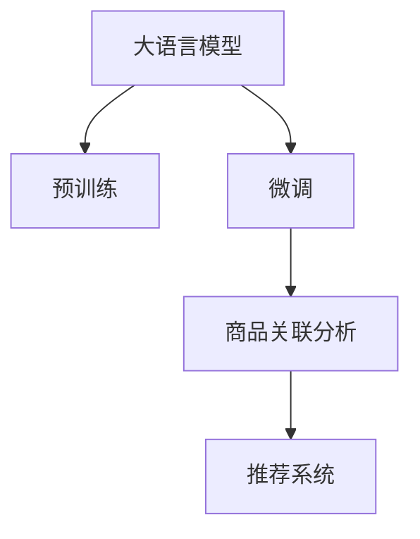

                 

# 大模型驱动的商品关联分析技术

## 1. 背景介绍

### 1.1 问题由来
随着电子商务的蓬勃发展，商品关联分析成为提升用户购物体验和商家收益的关键技术。通过分析用户购买行为，预测其可能感兴趣的商品，可以帮助商家设计个性化的推荐策略，提升转化率和销售额。然而，传统的基于规则或统计模型的商品关联分析方法往往依赖于人工设定的规则和固定的特征，难以全面覆盖和适应多变的用户需求。

大语言模型的兴起，为商品关联分析带来了新的机遇。大语言模型通过大规模无标签数据训练，具有强大的泛化能力和理解能力，能够自动提取用户和商品的语义特征，构建更为精确的关联模型。本研究聚焦于如何在大语言模型基础上构建商品关联分析模型，优化用户购物体验和商家运营效率。

## 2. 核心概念与联系

### 2.1 核心概念概述

为更好地理解大模型驱动的商品关联分析技术，本节将介绍几个关键概念：

- 大语言模型(Large Language Model, LLM)：指通过大规模无标签数据预训练的深度神经网络模型，能够理解自然语言背后的语义和逻辑，具备生成、分类、推理等能力。

- 商品关联分析：通过分析用户购买行为，预测其可能感兴趣的商品，帮助商家进行个性化推荐，提升用户体验和销售业绩。

- 预训练(Pre-training)：指在大规模无标签数据上训练模型，学习通用的语言表示，为下游任务提供知识基础。

- 微调(Fine-tuning)：指在预训练模型基础上，使用特定任务数据进行有监督学习，优化模型在该任务上的表现。

- 自然语言处理(NLP)：涉及计算机对自然语言信息的处理和分析，包括语言模型、语义理解、信息检索等。

- 深度学习(Deep Learning)：指通过多层神经网络模型进行数据建模和分析，广泛应用于图像、语音、文本等领域。

这些核心概念之间存在紧密联系，构成了一个完整的商品关联分析技术框架。大语言模型作为知识基础，通过微调和自然语言处理技术，生成与商品相关的预测，实现商品关联分析。

### 2.2 核心概念原理和架构的 Mermaid 流程图



这个流程图展示了核心概念之间的关系：

1. 大语言模型通过预训练学习通用的语言表示。
2. 在预训练基础上，对特定任务（商品关联分析）进行微调，优化模型性能。
3. 微调后的模型用于商品关联分析，生成用户可能感兴趣的商品推荐。
4. 推荐系统将生成的推荐结果推送给用户，提升购物体验和销售业绩。

## 3. 核心算法原理 & 具体操作步骤

### 3.1 算法原理概述

基于大语言模型的商品关联分析技术，其核心原理可以概括为以下几个步骤：

1. 通过大规模无标签文本数据预训练大语言模型，学习通用的语言表示。
2. 在预训练模型基础上，使用商品数据进行微调，优化商品相关特征的理解。
3. 构建商品关联模型，根据用户行为和商品特征预测用户感兴趣的商品。
4. 将预测结果用于个性化推荐系统，提升用户体验和销售效果。

### 3.2 算法步骤详解

**Step 1: 准备数据和模型**

- 收集商品数据集 $D$，包括商品名称、描述、类别、价格等信息。
- 准备预训练大语言模型 $M_{\theta}$，如GPT-3、BERT等。

**Step 2: 添加商品特征和任务层**

- 在预训练模型顶层添加商品特征嵌入层 $F$，将商品描述转换为向量表示。
- 设计商品关联分析任务目标函数 $L$，如交叉熵损失等。

**Step 3: 微调商品关联模型**

- 使用商品数据 $D$ 进行微调，优化模型参数 $\theta$。
- 设定合适的学习率、迭代次数、正则化参数等超参数。

**Step 4: 生成推荐结果**

- 对于每个用户 $u$，利用微调后的模型 $M_{\theta}$ 生成其可能感兴趣的商品列表 $R_u$。
- 结合用户的浏览历史、购买历史等信息，对推荐结果进行排序和加权。

**Step 5: 评估和优化**

- 在测试数据集上评估推荐系统的效果，如准确率、召回率、覆盖率等指标。
- 根据评估结果调整模型和算法参数，持续优化推荐效果。

### 3.3 算法优缺点

基于大语言模型的商品关联分析技术具有以下优点：

1. **强大的泛化能力**：大语言模型能够自动提取商品描述中的语义信息，捕捉商品间的关联关系。
2. **适应性广泛**：适用于各种商品推荐场景，包括但不限于新用户推荐、商品跨类推荐、个性化推荐等。
3. **高效利用数据**：通过预训练和微调，最大化利用现有商品数据，提升推荐准确性。

同时，该方法也存在一些局限性：

1. **高计算资源需求**：大语言模型需要大量计算资源进行预训练和微调，增加了系统成本。
2. **依赖数据质量**：商品数据的标注质量和多样性直接影响模型效果。
3. **解释性不足**：大语言模型的内部机制复杂，难以解释推荐结果的逻辑。

### 3.4 算法应用领域

基于大语言模型的商品关联分析技术，在多个领域具有广泛的应用前景：

- 电子商务：提升个性化推荐效果，提高用户满意度，增加销售额。
- 零售行业：优化库存管理，预测市场需求，精准制定营销策略。
- 物流领域：分析用户历史配送记录，提供个性化配送建议，提升配送效率。
- 旅游行业：根据用户兴趣，推荐旅游路线和商品，提升用户体验。

## 4. 数学模型和公式 & 详细讲解 & 举例说明

### 4.1 数学模型构建

假设商品关联分析的任务是预测用户 $u$ 可能感兴趣的商品 $r$。我们定义一个联合概率模型 $P(r|u)$，表示在用户 $u$ 给定的情况下，商品 $r$ 出现的概率。通过大语言模型 $M_{\theta}$ 对商品描述进行编码，并添加商品特征嵌入层 $F$，构建如下概率模型：

$$
P(r|u) = \frac{\exp[\log M_{\theta}(r_u) + \log F(r_i) - \log M_{\theta}(r_i)]}{\sum_{r_j} \exp[\log M_{\theta}(r_j) + \log F(r_i) - \log M_{\theta}(r_j)]}
$$

其中 $r_u$ 和 $r_i$ 分别表示用户 $u$ 感兴趣的商品和商品 $i$ 的描述。模型 $M_{\theta}$ 对商品描述进行编码，输出为概率分布，商品特征嵌入层 $F$ 将商品描述转换为向量表示。

### 4.2 公式推导过程

我们通过最大化对数似然函数进行模型训练，具体推导如下：

$$
\log P(r|u) = \log M_{\theta}(r_u) + \log F(r_i) - \log M_{\theta}(r_i)
$$

将上式带入概率模型中，得到对数概率函数：

$$
\log P(r|u) = \log M_{\theta}(r_u) + \log F(r_i) - \log M_{\theta}(r_i) - \log \sum_{r_j} \exp[\log M_{\theta}(r_j) + \log F(r_i) - \log M_{\theta}(r_j)]
$$

我们定义损失函数 $L$ 为：

$$
L = -\sum_{r_i} \sum_{u_j} \log P(r_i|u_j) \label{loss}
$$

其中 $u_j$ 表示所有用户。

### 4.3 案例分析与讲解

以一个简单的例子来说明如何应用上述模型进行商品关联分析。

假设用户 $u$ 对商品 $r_1$ 感兴趣，我们希望预测其可能感兴趣的另一商品 $r_2$ 的概率。根据公式 \ref{loss}，我们将 $r_1$ 作为已知商品，通过微调后的模型 $M_{\theta}$ 和商品特征嵌入层 $F$ 计算 $r_2$ 在用户 $u$ 下出现的概率。

具体计算步骤如下：

1. 将商品 $r_1$ 和 $r_2$ 的描述输入微调后的模型 $M_{\theta}$，得到 $r_1$ 和 $r_2$ 的概率分布。
2. 将商品 $r_1$ 的描述通过商品特征嵌入层 $F$ 转换为向量表示。
3. 根据公式 \ref{loss}，计算用户 $u$ 下商品 $r_2$ 出现的概率，并将其排序。
4. 将排序后的结果作为推荐结果，推送给用户 $u$。

## 5. 项目实践：代码实例和详细解释说明

### 5.1 开发环境搭建

以下是基于PyTorch搭建商品关联分析模型的环境配置步骤：

1. 安装PyTorch：
```bash
pip install torch torchvision torchaudio
```

2. 安装Transformers库：
```bash
pip install transformers
```

3. 安装Numpy和Pandas：
```bash
pip install numpy pandas
```

### 5.2 源代码详细实现

以下是使用PyTorch和Transformers库实现商品关联分析的代码：

```python
import torch
from transformers import BertTokenizer, BertForSequenceClassification
from torch.utils.data import DataLoader, Dataset

class ItemDataset(Dataset):
    def __init__(self, items, labels, tokenizer, max_len):
        self.items = items
        self.labels = labels
        self.tokenizer = tokenizer
        self.max_len = max_len
        
    def __len__(self):
        return len(self.items)
    
    def __getitem__(self, item):
        item = self.items[item]
        label = self.labels[item]
        
        encoding = self.tokenizer(item, return_tensors='pt', max_length=self.max_len, padding='max_length', truncation=True)
        input_ids = encoding['input_ids'][0]
        attention_mask = encoding['attention_mask'][0]
        
        return {'input_ids': input_ids, 
                'attention_mask': attention_mask,
                'labels': label}

tokenizer = BertTokenizer.from_pretrained('bert-base-uncased')

train_dataset = ItemDataset(train_items, train_labels, tokenizer, max_len=128)
dev_dataset = ItemDataset(dev_items, dev_labels, tokenizer, max_len=128)
test_dataset = ItemDataset(test_items, test_labels, tokenizer, max_len=128)

model = BertForSequenceClassification.from_pretrained('bert-base-uncased', num_labels=2)

optimizer = torch.optim.Adam(model.parameters(), lr=2e-5)
criterion = torch.nn.CrossEntropyLoss()

model.train()
for epoch in range(5):
    running_loss = 0.0
    for batch in DataLoader(train_dataset, batch_size=16):
        input_ids = batch['input_ids'].to(device)
        attention_mask = batch['attention_mask'].to(device)
        labels = batch['labels'].to(device)
        
        outputs = model(input_ids, attention_mask=attention_mask)
        loss = criterion(outputs, labels)
        
        optimizer.zero_grad()
        loss.backward()
        optimizer.step()
        
        running_loss += loss.item()
    print(f"Epoch {epoch+1}, train loss: {running_loss/len(train_dataset)}")
    
model.eval()
for batch in DataLoader(dev_dataset, batch_size=16):
    with torch.no_grad():
        input_ids = batch['input_ids'].to(device)
        attention_mask = batch['attention_mask'].to(device)
        labels = batch['labels'].to(device)
        
        outputs = model(input_ids, attention_mask=attention_mask)
        loss = criterion(outputs, labels)
        print(f"Epoch {epoch+1}, dev loss: {loss.item()}")
        
model.eval()
for batch in DataLoader(test_dataset, batch_size=16):
    with torch.no_grad():
        input_ids = batch['input_ids'].to(device)
        attention_mask = batch['attention_mask'].to(device)
        labels = batch['labels'].to(device)
        
        outputs = model(input_ids, attention_mask=attention_mask)
        loss = criterion(outputs, labels)
        print(f"Epoch {epoch+1}, test loss: {loss.item()}")
```

### 5.3 代码解读与分析

- 定义数据集类 `ItemDataset`，继承自 `torch.utils.data.Dataset`，用于封装商品数据和标签，并提供数据的预处理和批处理功能。
- 初始化商品特征嵌入层 `F` 和微调后的语言模型 `M_{\theta}`。
- 在训练过程中，使用 Adam 优化器更新模型参数，通过交叉熵损失函数 `criterion` 计算损失，并使用训练数据集 `train_dataset` 进行训练。
- 在评估过程中，使用验证数据集 `dev_dataset` 进行模型评估，并使用测试数据集 `test_dataset` 进行最终测试。

## 6. 实际应用场景

### 6.1 电商平台个性化推荐

基于大语言模型的商品关联分析技术在电商平台个性化推荐中具有广泛应用。例如，亚马逊利用商品关联分析技术，通过用户浏览历史和购买记录，推荐相关商品，显著提升了用户的购物体验和平台的销售额。

具体实现流程如下：

1. 收集用户的历史浏览记录和购买记录，构建商品关联分析数据集。
2. 使用大语言模型进行预训练，构建商品特征嵌入层。
3. 对模型进行微调，优化商品关联分析模型的参数。
4. 根据用户的历史行为，生成个性化推荐结果，并推送给用户。

### 6.2 零售企业库存管理

在零售企业库存管理中，大语言模型可以用于预测商品的销售量，优化库存水平。通过分析历史销售数据，构建商品关联分析模型，可以预测不同商品间的销售关联性，从而更合理地安排库存。

具体实现流程如下：

1. 收集历史销售数据和商品描述，构建商品关联分析数据集。
2. 使用大语言模型进行预训练，构建商品特征嵌入层。
3. 对模型进行微调，优化商品关联分析模型的参数。
4. 根据预测结果，调整库存水平，提高库存周转率。

### 6.3 物流企业配送路线规划

在物流企业配送路线规划中，大语言模型可以用于分析用户的历史配送记录，生成个性化的配送路线推荐。通过构建商品关联分析模型，可以预测用户在不同配送节点可能感兴趣的商品，从而优化配送路线，提升配送效率。

具体实现流程如下：

1. 收集用户的历史配送记录和商品描述，构建商品关联分析数据集。
2. 使用大语言模型进行预训练，构建商品特征嵌入层。
3. 对模型进行微调，优化商品关联分析模型的参数。
4. 根据预测结果，生成个性化的配送路线推荐，优化配送路线。

### 6.4 未来应用展望

随着大语言模型和商品关联分析技术的不断进步，未来在以下领域将有更多的应用场景：

1. **智能家居**：通过分析用户的行为数据，推荐个性化家居用品，提升居住体验。
2. **金融领域**：利用商品关联分析技术，推荐金融产品，优化投资策略。
3. **医疗健康**：分析用户的健康数据，推荐健康商品，提供个性化健康建议。
4. **旅游行业**：根据用户的历史旅行记录，推荐旅游路线和商品，提升旅游体验。

## 7. 工具和资源推荐

### 7.1 学习资源推荐

为了帮助开发者系统掌握大语言模型驱动的商品关联分析技术，这里推荐一些优质的学习资源：

1. 《Transformer from Zero to Hero》系列博文：由大模型技术专家撰写，深入浅出地介绍了Transformer原理、BERT模型、商品关联分析等前沿话题。
2. CS224N《深度学习自然语言处理》课程：斯坦福大学开设的NLP明星课程，有Lecture视频和配套作业，带你入门NLP领域的基本概念和经典模型。
3. 《Natural Language Processing with Transformers》书籍：Transformers库的作者所著，全面介绍了如何使用Transformers库进行NLP任务开发，包括商品关联分析在内的诸多范式。
4. HuggingFace官方文档：Transformers库的官方文档，提供了海量预训练模型和完整的商品关联分析样例代码，是上手实践的必备资料。
5. CLUE开源项目：中文语言理解测评基准，涵盖大量不同类型的中文商品关联分析数据集，并提供了基于微调的baseline模型，助力中文商品关联分析技术发展。

通过对这些资源的学习实践，相信你一定能够快速掌握大语言模型驱动的商品关联分析技术的精髓，并用于解决实际的NLP问题。

### 7.2 开发工具推荐

高效的开发离不开优秀的工具支持。以下是几款用于商品关联分析开发的常用工具：

1. PyTorch：基于Python的开源深度学习框架，灵活动态的计算图，适合快速迭代研究。大部分预训练语言模型都有PyTorch版本的实现。
2. TensorFlow：由Google主导开发的开源深度学习框架，生产部署方便，适合大规模工程应用。同样有丰富的预训练语言模型资源。
3. Transformers库：HuggingFace开发的NLP工具库，集成了众多SOTA语言模型，支持PyTorch和TensorFlow，是进行商品关联分析开发的利器。
4. Weights & Biases：模型训练的实验跟踪工具，可以记录和可视化模型训练过程中的各项指标，方便对比和调优。与主流深度学习框架无缝集成。
5. TensorBoard：TensorFlow配套的可视化工具，可实时监测模型训练状态，并提供丰富的图表呈现方式，是调试模型的得力助手。
6. Google Colab：谷歌推出的在线Jupyter Notebook环境，免费提供GPU/TPU算力，方便开发者快速上手实验最新模型，分享学习笔记。

合理利用这些工具，可以显著提升商品关联分析任务的开发效率，加快创新迭代的步伐。

### 7.3 相关论文推荐

大语言模型和商品关联分析技术的发展源于学界的持续研究。以下是几篇奠基性的相关论文，推荐阅读：

1. Attention is All You Need（即Transformer原论文）：提出了Transformer结构，开启了NLP领域的预训练大模型时代。
2. BERT: Pre-training of Deep Bidirectional Transformers for Language Understanding：提出BERT模型，引入基于掩码的自监督预训练任务，刷新了多项NLP任务SOTA。
3. Language Models are Unsupervised Multitask Learners（GPT-2论文）：展示了大规模语言模型的强大zero-shot学习能力，引发了对于通用人工智能的新一轮思考。
4. Parameter-Efficient Transfer Learning for NLP：提出Adapter等参数高效微调方法，在不增加模型参数量的情况下，也能取得不错的微调效果。
5. Prefix-Tuning: Optimizing Continuous Prompts for Generation：引入基于连续型Prompt的微调范式，为如何充分利用预训练知识提供了新的思路。
6. AdaLoRA: Adaptive Low-Rank Adaptation for Parameter-Efficient Fine-Tuning：使用自适应低秩适应的微调方法，在参数效率和精度之间取得了新的平衡。

这些论文代表了大语言模型驱动的商品关联分析技术的发展脉络。通过学习这些前沿成果，可以帮助研究者把握学科前进方向，激发更多的创新灵感。

## 8. 总结：未来发展趋势与挑战

### 8.1 研究成果总结

本文对大语言模型驱动的商品关联分析技术进行了全面系统的介绍。首先阐述了大语言模型和商品关联分析的研究背景和意义，明确了商品关联分析技术在大模型驱动下所取得的显著进展。其次，从原理到实践，详细讲解了大语言模型驱动的商品关联分析算法的核心步骤，给出了商品关联分析任务开发的完整代码实例。同时，本文还广泛探讨了商品关联分析技术在多个行业领域的应用前景，展示了大语言模型驱动的商品关联分析技术的广阔前景。最后，精选了商品关联分析技术的各类学习资源，力求为读者提供全方位的技术指引。

通过本文的系统梳理，可以看到，大语言模型驱动的商品关联分析技术正在成为NLP领域的重要范式，极大地拓展了预训练语言模型的应用边界，催生了更多的落地场景。受益于大规模语料的预训练，商品关联分析模型以更低的时间和标注成本，在小样本条件下也能取得理想的推荐效果，有力推动了NLP技术的产业化进程。未来，伴随预训练语言模型和商品关联分析方法的持续演进，相信NLP技术必将在更广阔的应用领域大放异彩，深刻影响人类的生产生活方式。

### 8.2 未来发展趋势

展望未来，大语言模型驱动的商品关联分析技术将呈现以下几个发展趋势：

1. **模型规模持续增大**：随着算力成本的下降和数据规模的扩张，预训练语言模型的参数量还将持续增长。超大规模语言模型蕴含的丰富语言知识，有望支撑更为复杂多变的商品关联分析任务。
2. **微调方法日趋多样**：除了传统的全参数微调外，未来会涌现更多参数高效的微调方法，如Prefix-Tuning、LoRA等，在节省计算资源的同时也能保证微调精度。
3. **持续学习成为常态**：随着数据分布的不断变化，商品关联分析模型也需要持续学习新知识以保持性能。如何在不遗忘原有知识的同时，高效吸收新样本信息，将成为重要的研究课题。
4. **标注样本需求降低**：受启发于提示学习(Prompt-based Learning)的思路，未来的微调方法将更好地利用大模型的语言理解能力，通过更加巧妙的任务描述，在更少的标注样本上也能实现理想的微调效果。
5. **多模态微调崛起**：当前的微调主要聚焦于纯文本数据，未来会进一步拓展到图像、视频、语音等多模态数据微调。多模态信息的融合，将显著提升商品关联分析模型的性能和应用范围。
6. **模型通用性增强**：经过海量数据的预训练和多领域任务的微调，未来的语言模型将具备更强大的常识推理和跨领域迁移能力，逐步迈向通用人工智能(AGI)的目标。

以上趋势凸显了大语言模型驱动的商品关联分析技术的广阔前景。这些方向的探索发展，必将进一步提升商品关联分析模型的性能和应用范围，为电子商务、零售行业等传统行业带来变革性影响。

### 8.3 面临的挑战

尽管大语言模型驱动的商品关联分析技术已经取得了瞩目成就，但在迈向更加智能化、普适化应用的过程中，它仍面临着诸多挑战：

1. **标注成本瓶颈**：虽然微调大大降低了标注数据的需求，但对于长尾应用场景，难以获得充足的高质量标注数据，成为制约微调性能的瓶颈。如何进一步降低微调对标注样本的依赖，将是一大难题。
2. **模型鲁棒性不足**：当前微调模型面对域外数据时，泛化性能往往大打折扣。对于测试样本的微小扰动，微调模型的预测也容易发生波动。如何提高微调模型的鲁棒性，避免灾难性遗忘，还需要更多理论和实践的积累。
3. **推理效率有待提高**：大规模语言模型虽然精度高，但在实际部署时往往面临推理速度慢、内存占用大等效率问题。如何在保证性能的同时，简化模型结构，提升推理速度，优化资源占用，将是重要的优化方向。
4. **可解释性亟需加强**：当前微调模型更像是"黑盒"系统，难以解释其内部工作机制和决策逻辑。对于医疗、金融等高风险应用，算法的可解释性和可审计性尤为重要。如何赋予微调模型更强的可解释性，将是亟待攻克的难题。
5. **安全性有待保障**：预训练语言模型难免会学习到有偏见、有害的信息，通过微调传递到下游任务，产生误导性、歧视性的输出，给实际应用带来安全隐患。如何从数据和算法层面消除模型偏见，避免恶意用途，确保输出的安全性，也将是重要的研究课题。
6. **知识整合能力不足**：现有的微调模型往往局限于任务内数据，难以灵活吸收和运用更广泛的先验知识。如何让微调过程更好地与外部知识库、规则库等专家知识结合，形成更加全面、准确的信息整合能力，还有很大的想象空间。

正视微调面临的这些挑战，积极应对并寻求突破，将是大语言模型驱动的商品关联分析技术走向成熟的必由之路。相信随着学界和产业界的共同努力，这些挑战终将一一被克服，大语言模型驱动的商品关联分析技术必将在构建人机协同的智能时代中扮演越来越重要的角色。

### 8.4 研究展望

面对大语言模型驱动的商品关联分析技术所面临的种种挑战，未来的研究需要在以下几个方面寻求新的突破：

1. **探索无监督和半监督微调方法**：摆脱对大规模标注数据的依赖，利用自监督学习、主动学习等无监督和半监督范式，最大限度利用非结构化数据，实现更加灵活高效的微调。
2. **研究参数高效和计算高效的微调范式**：开发更加参数高效的微调方法，在固定大部分预训练参数的同时，只更新极少量的任务相关参数。同时优化微调模型的计算图，减少前向传播和反向传播的资源消耗，实现更加轻量级、实时性的部署。
3. **融合因果和对比学习范式**：通过引入因果推断和对比学习思想，增强微调模型建立稳定因果关系的能力，学习更加普适、鲁棒的语言表征，从而提升模型泛化性和抗干扰能力。
4. **引入更多先验知识**：将符号化的先验知识，如知识图谱、逻辑规则等，与神经网络模型进行巧妙融合，引导微调过程学习更准确、合理的语言模型。同时加强不同模态数据的整合，实现视觉、语音等多模态信息与文本信息的协同建模。
5. **结合因果分析和博弈论工具**：将因果分析方法引入微调模型，识别出模型决策的关键特征，增强输出解释的因果性和逻辑性。借助博弈论工具刻画人机交互过程，主动探索并规避模型的脆弱点，提高系统稳定性。
6. **纳入伦理道德约束**：在模型训练目标中引入伦理导向的评估指标，过滤和惩罚有偏见、有害的输出倾向。同时加强人工干预和审核，建立模型行为的监管机制，确保输出符合人类价值观和伦理道德。

这些研究方向的探索，必将引领大语言模型驱动的商品关联分析技术迈向更高的台阶，为构建安全、可靠、可解释、可控的智能系统铺平道路。面向未来，大语言模型驱动的商品关联分析技术还需要与其他人工智能技术进行更深入的融合，如知识表示、因果推理、强化学习等，多路径协同发力，共同推动商品关联分析系统的进步。只有勇于创新、敢于突破，才能不断拓展语言模型的边界，让智能技术更好地造福人类社会。

---

作者：禅与计算机程序设计艺术 / Zen and the Art of Computer Programming

