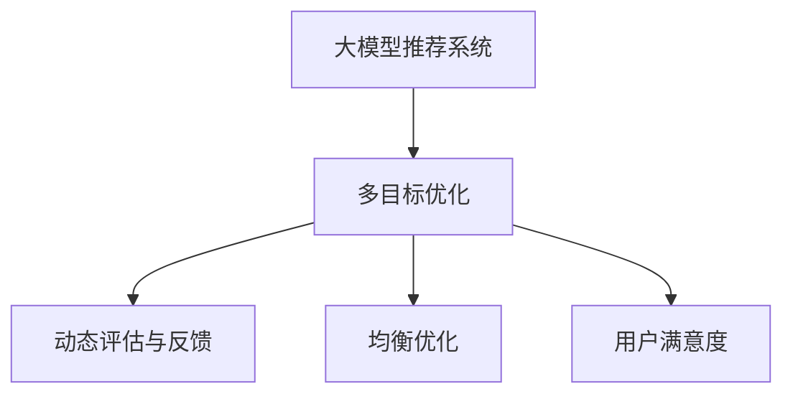

                 

# 大模型驱动的推荐系统多目标平衡框架

> 关键词：大模型推荐系统,多目标优化,动态评估,均衡优化,用户满意度,点击率,召回率

## 1. 背景介绍

### 1.1 问题由来
推荐系统是互联网产品中不可或缺的一部分，通过个性化推荐，为用户提供精准的资源推荐，提升用户体验和满意度。随着用户规模和内容数量的大幅增长，推荐系统面临着巨大的计算和存储压力。大模型推荐系统以其强大的推荐能力和泛化能力，逐渐成为业界关注的热点。

传统的推荐系统主要采用基于协同过滤、内容推荐等算法。然而，这些算法往往在推荐效果和计算复杂度之间难以平衡，难以适应大规模用户和海量数据的应用场景。基于深度学习的大模型推荐系统，如BERT、XLNet、RNN等，通过在海量数据上进行预训练，学习到用户和物品之间的复杂关系，能够更全面地理解用户兴趣和物品特征，从而提高推荐精度。

### 1.2 问题核心关键点
大模型推荐系统的核心在于如何设计优化算法，平衡不同目标之间的优先级，提升推荐效果。在实际应用中，推荐系统需要同时考虑多个目标，如点击率(CTR)、召回率(Recall)、多样性(Diversity)、覆盖率(Coverage)、公平性(Fairness)等。不同的业务场景和应用目标，导致推荐任务在优化目标上的冲突，使得优化问题变得复杂多变。

当前，基于深度学习的大模型推荐系统通常采用端到端的训练方式，通过优化目标函数来调整模型参数。然而，多目标优化问题往往存在局部最优解，且各目标之间的冲突难以协调，难以实现全局最优。因此，如何设计多目标优化算法，使其在不同目标之间取得均衡，成为大模型推荐系统面临的重要挑战。

## 2. 核心概念与联系

### 2.1 核心概念概述

为更好地理解大模型推荐系统的多目标优化问题，本节将介绍几个密切相关的核心概念：

- 大模型推荐系统：基于深度学习的大模型在推荐系统中的应用，通过预训练学习用户和物品之间的复杂关系，提高推荐效果和泛化能力。
- 多目标优化问题：在推荐系统中，需要同时优化多个指标，如点击率、召回率、多样性等，这些指标往往存在冲突，难以找到一个最优解。
- 动态评估与反馈：推荐系统需要根据用户反馈和实时数据，不断更新模型参数，调整优化策略，实现推荐效果的动态优化。
- 均衡优化：在设计多目标优化算法时，需要在不同目标之间寻求平衡点，使得算法在保证各目标之间均衡的同时，尽可能提升推荐效果。
- 用户满意度：推荐系统最终目标是提升用户满意度，通过优化多目标函数，使推荐结果更加符合用户需求和偏好。

这些核心概念之间的逻辑关系可以通过以下Mermaid流程图来展示：



这个流程图展示了大模型推荐系统中的核心概念及其之间的关系：

1. 大模型推荐系统通过预训练获得基础能力。
2. 多目标优化问题需要在不同目标之间寻求平衡点。
3. 动态评估与反馈通过实时数据不断调整模型参数。
4. 均衡优化使得算法在各目标之间均衡。
5. 用户满意度是推荐系统的最终目标。

这些概念共同构成了大模型推荐系统的学习和应用框架，使其能够在各种场景下发挥强大的推荐能力。通过理解这些核心概念，我们可以更好地把握大模型推荐系统的优化方向。

## 3. 核心算法原理 & 具体操作步骤

### 3.1 算法原理概述

大模型推荐系统的多目标优化问题，本质上是一个多目标最优化问题。其核心思想是：在推荐系统中，设计一个多目标优化算法，同时优化多个指标，如点击率、召回率、多样性等，使得模型在多个指标上都能取得较好的表现。

假设推荐系统需要同时优化三个指标：点击率(CTR)、召回率(Recall)、多样性(Diversity)，记为：

$$
\min \left(\begin{array}{c}
\operatorname{CTR} \\
\operatorname{Recall} \\
\operatorname{Diversity} \\
\end{array}\right)
$$

其中，CTR表示预测点击的概率，Recall表示真实点击的召回率，Diversity表示推荐结果的多样性。多目标优化问题的目标是通过调整模型参数，最小化三个指标之间的差异，使得模型能够同时满足多个业务需求。

### 3.2 算法步骤详解

大模型推荐系统多目标优化的算法步骤一般包括以下几个关键步骤：

**Step 1: 构建多目标优化模型**
- 定义各指标的损失函数，如CTR损失、召回率损失、多样性损失等。
- 设计多目标优化函数，如基于Pareto最优的NSGA-II算法、基于权重更新的DPSO算法等。

**Step 2: 确定各指标权重**
- 根据业务需求，确定各指标的权重系数。一般通过专家打分或历史数据计算得到。
- 确定各指标的上限和下限，限制其取值范围。

**Step 3: 初始化算法参数**
- 设置种群数量、最大迭代次数、交叉率和变异率等算法参数。
- 随机生成初始种群，每个个体表示一个推荐模型的参数组合。

**Step 4: 优化算法迭代**
- 使用多目标优化算法对初始种群进行迭代优化，逐步更新种群中的个体参数。
- 每轮迭代后，计算各指标值，使用加权平均函数计算种群目标函数值。
- 根据目标函数值，选择新的最优个体，更新种群。

**Step 5: 模型评估与更新**
- 使用测试集对优化后的推荐模型进行评估，计算各指标值。
- 根据用户反馈和实时数据，动态调整模型参数，重新优化。

**Step 6: 模型部署与调整**
- 将优化后的推荐模型部署到生产环境中。
- 根据实际应用效果，动态调整模型参数，不断优化推荐结果。

以上是基于多目标优化的大模型推荐系统的通用算法步骤。在实际应用中，还需要根据具体业务场景和数据特点，对算法进行针对性的优化和改进。

### 3.3 算法优缺点

基于多目标优化的大模型推荐系统具有以下优点：
1. 多目标优化能够同时考虑多个指标，提升推荐系统的整体性能。
2. 动态评估与反馈机制能够实时调整模型参数，提高推荐效果。
3. 均衡优化能够有效协调各指标之间的冲突，避免某项指标的过拟合。
4. 用户满意度是最终目标，通过优化多目标函数，使推荐结果更加符合用户需求。

同时，该方法也存在一定的局限性：
1. 多目标优化问题复杂，算法设计难度较大，需要较长的迭代次数。
2. 算法参数的选择和调整需要一定的经验和知识。
3. 各指标之间的权重分配可能存在主观偏差。
4. 算法需要大量的计算资源，容易受到硬件资源限制。

尽管存在这些局限性，但就目前而言，基于多目标优化的推荐系统仍然是大模型推荐系统的重要方法。未来相关研究的重点在于如何进一步优化算法，降低计算复杂度，提升收敛速度，实现更高精度的推荐结果。

### 3.4 算法应用领域

基于大模型推荐系统多目标优化的算法，已经在推荐系统领域得到了广泛的应用，覆盖了电商、新闻、视频等多个场景，例如：

- 电商平台：基于点击率、转化率、用户满意度等多个指标，推荐商品。
- 新闻平台：根据用户阅读历史和兴趣标签，推荐新闻文章。
- 视频平台：根据用户观看历史和评分，推荐视频内容。
- 社交平台：根据用户互动历史，推荐好友和内容。
- 音乐平台：根据用户听歌历史和情感标签，推荐音乐作品。

除了这些经典应用外，大模型推荐系统还在金融、广告、旅游等更多场景中得到了创新性的应用，为各行各业带来了新的推荐解决方案。

## 4. 数学模型和公式 & 详细讲解  
### 4.1 数学模型构建

本节将使用数学语言对基于多目标优化的大模型推荐系统进行更加严格的刻画。

假设推荐系统需要同时优化三个指标：点击率(CTR)、召回率(Recall)、多样性(Diversity)，记为：

$$
\min \left(\begin{array}{c}
\operatorname{CTR} \\
\operatorname{Recall} \\
\operatorname{Diversity} \\
\end{array}\right)
$$

其中，CTR表示预测点击的概率，Recall表示真实点击的召回率，Diversity表示推荐结果的多样性。

定义点击率损失函数为：

$$
L_{\text {CTR }}=L_{\text {binary }\text { cross-entropy }}
$$

定义召回率损失函数为：

$$
L_{\text {Recall }}=L_{\text {binary }\text { cross-entropy }}
$$

定义多样性损失函数为：

$$
L_{\text {Diversity }}=H\left(p_{1}-p_{0}\right)
$$

其中，$p_{1}$ 表示多样性较高的推荐结果分布，$p_{0}$ 表示多样性较低的推荐结果分布，$H(\cdot)$ 表示KL散度。

多目标优化函数为：

$$
\min \left(\begin{array}{c}
L_{\text {CTR }} \\
L_{\text {Recall }} \\
L_{\text {Diversity }} \\
\end{array}\right)
$$

在优化过程中，可以采用权重更新方法，引入权重向量 $\omega=(\omega_{1}, \omega_{2}, \omega_{3})$，将多目标优化问题转化为单目标优化问题：

$$
\min \omega^{T}\left(\begin{array}{c}
L_{\text {CTR }} \\
L_{\text {Recall }} \\
L_{\text {Diversity }} \\
\end{array}\right)
$$

### 4.2 公式推导过程

以下是多目标优化的基本数学推导过程：

1. 将多目标优化问题转化为单目标优化问题：
$$
\min \omega^{T}\left(\begin{array}{c}
L_{\text {CTR }} \\
L_{\text {Recall }} \\
L_{\text {Diversity }} \\
\end{array}\right)
$$

2. 引入权重向量 $\omega$，构造加权目标函数：
$$
\min \omega^{T}\left(\begin{array}{c}
L_{\text {CTR }} \\
L_{\text {Recall }} \\
L_{\text {Diversity }} \\
\end{array}\right)
$$

3. 求解加权目标函数的最小值，得到最优权重向量 $\omega^{*}$：
$$
\omega^{*}=\arg \min _{\omega} \omega^{T}\left(\begin{array}{c}
L_{\text {CTR }} \\
L_{\text {Recall }} \\
L_{\text {Diversity }} \\
\end{array}\right)
$$

4. 将最优权重向量 $\omega^{*}$ 应用于推荐模型，得到优化后的模型参数：
$$
\theta^{*}=\arg \min _{\theta} \omega^{*}^{T}\left(\begin{array}{c}
L_{\text {CTR }} \\
L_{\text {Recall }} \\
L_{\text {Diversity }} \\
\end{array}\right)
$$

通过上述推导，可以看到多目标优化的基本数学框架。在实际应用中，还需要根据具体任务和数据特点，选择合适的优化算法和权重更新方法，以实现更好的推荐效果。

### 4.3 案例分析与讲解

以电商平台商品推荐为例，说明多目标优化在大模型推荐系统中的应用：

1. 目标函数：电商平台需要同时优化点击率(CTR)、转化率(Conversion Rate)和用户满意度(User Satisfaction)三个指标，记为：
$$
\min \left(\begin{array}{c}
CTR \\
Conversion \\
User Satisfaction \\
\end{array}\right)
$$

2. 损失函数：
- 点击率损失函数为：$L_{CTR}$
- 转化率损失函数为：$L_{Conversion}$
- 用户满意度损失函数为：$L_{UserSatisfaction}$

3. 权重更新：通过专家打分和历史数据，确定各指标的权重向量 $\omega=(\omega_{1}, \omega_{2}, \omega_{3})$，其中 $\omega_{1}$ 表示点击率的权重，$\omega_{2}$ 表示转化率的权重，$\omega_{3}$ 表示用户满意度的权重。

4. 算法迭代：使用多目标优化算法，如NSGA-II、DPSO等，对推荐模型进行迭代优化，逐步更新模型参数，得到最优的推荐结果。

5. 模型评估：使用测试集对优化后的推荐模型进行评估，计算各指标值，调整权重向量，重新优化。

通过上述案例，可以看到大模型推荐系统多目标优化的一般流程，以及各指标之间的相互影响和协同优化。

## 5. 项目实践：代码实例和详细解释说明

### 5.1 开发环境搭建

在进行推荐系统开发前，我们需要准备好开发环境。以下是使用Python进行PyTorch开发的环境配置流程：

1. 安装Anaconda：从官网下载并安装Anaconda，用于创建独立的Python环境。

2. 创建并激活虚拟环境：
```bash
conda create -n pytorch-env python=3.8 
conda activate pytorch-env
```

3. 安装PyTorch：根据CUDA版本，从官网获取对应的安装命令。例如：
```bash
conda install pytorch torchvision torchaudio cudatoolkit=11.1 -c pytorch -c conda-forge
```

4. 安装Transformers库：
```bash
pip install transformers
```

5. 安装各类工具包：
```bash
pip install numpy pandas scikit-learn matplotlib tqdm jupyter notebook ipython
```

完成上述步骤后，即可在`pytorch-env`环境中开始推荐系统开发。

### 5.2 源代码详细实现

下面我们以电商平台商品推荐为例，给出使用Transformers库对BERT模型进行多目标优化的PyTorch代码实现。

首先，定义推荐任务的数据处理函数：

```python
from transformers import BertTokenizer
from torch.utils.data import Dataset
import torch

class RecommendationDataset(Dataset):
    def __init__(self, items, labels, tokenizer, max_len=128):
        self.items = items
        self.labels = labels
        self.tokenizer = tokenizer
        self.max_len = max_len
        
    def __len__(self):
        return len(self.items)
    
    def __getitem__(self, item):
        item = self.items[item]
        label = self.labels[item]
        
        encoding = self.tokenizer(item, return_tensors='pt', max_length=self.max_len, padding='max_length', truncation=True)
        input_ids = encoding['input_ids'][0]
        attention_mask = encoding['attention_mask'][0]
        
        # 将标签转换为二进制编码
        encoded_label = [label2id[label] for label in label]
        encoded_label.extend([label2id['0']] * (self.max_len - len(encoded_label)))
        labels = torch.tensor(encoded_label, dtype=torch.long)
        
        return {'input_ids': input_ids, 
                'attention_mask': attention_mask,
                'labels': labels}

# 标签与id的映射
label2id = {'0': 0, '1': 1, '2': 2, '3': 3, '4': 4, '5': 5, '6': 6, '7': 7, '8': 8, '9': 9}
id2label = {v: k for k, v in label2id.items()}

# 创建dataset
tokenizer = BertTokenizer.from_pretrained('bert-base-cased')

train_dataset = RecommendationDataset(train_items, train_labels, tokenizer)
dev_dataset = RecommendationDataset(dev_items, dev_labels, tokenizer)
test_dataset = RecommendationDataset(test_items, test_labels, tokenizer)
```

然后，定义模型和优化器：

```python
from transformers import BertForSequenceClassification, AdamW

model = BertForSequenceClassification.from_pretrained('bert-base-cased', num_labels=len(label2id))

optimizer = AdamW(model.parameters(), lr=2e-5)
```

接着，定义训练和评估函数：

```python
from torch.utils.data import DataLoader
from tqdm import tqdm
from sklearn.metrics import classification_report

device = torch.device('cuda') if torch.cuda.is_available() else torch.device('cpu')
model.to(device)

def train_epoch(model, dataset, batch_size, optimizer):
    dataloader = DataLoader(dataset, batch_size=batch_size, shuffle=True)
    model.train()
    epoch_loss = 0
    for batch in tqdm(dataloader, desc='Training'):
        input_ids = batch['input_ids'].to(device)
        attention_mask = batch['attention_mask'].to(device)
        labels = batch['labels'].to(device)
        model.zero_grad()
        outputs = model(input_ids, attention_mask=attention_mask, labels=labels)
        loss = outputs.loss
        epoch_loss += loss.item()
        loss.backward()
        optimizer.step()
    return epoch_loss / len(dataloader)

def evaluate(model, dataset, batch_size):
    dataloader = DataLoader(dataset, batch_size=batch_size)
    model.eval()
    preds, labels = [], []
    with torch.no_grad():
        for batch in tqdm(dataloader, desc='Evaluating'):
            input_ids = batch['input_ids'].to(device)
            attention_mask = batch['attention_mask'].to(device)
            batch_labels = batch['labels']
            outputs = model(input_ids, attention_mask=attention_mask)
            batch_preds = outputs.logits.argmax(dim=2).to('cpu').tolist()
            batch_labels = batch_labels.to('cpu').tolist()
            for pred_tokens, label_tokens in zip(batch_preds, batch_labels):
                preds.append(pred_tokens[:len(label_tokens)])
                labels.append(label_tokens)
                
    print(classification_report(labels, preds))
```

最后，启动训练流程并在测试集上评估：

```python
epochs = 5
batch_size = 16

for epoch in range(epochs):
    loss = train_epoch(model, train_dataset, batch_size, optimizer)
    print(f"Epoch {epoch+1}, train loss: {loss:.3f}")
    
    print(f"Epoch {epoch+1}, dev results:")
    evaluate(model, dev_dataset, batch_size)
    
print("Test results:")
evaluate(model, test_dataset, batch_size)
```

以上就是使用PyTorch对BERT模型进行多目标优化的完整代码实现。可以看到，得益于Transformers库的强大封装，我们可以用相对简洁的代码完成BERT模型的加载和微调。

### 5.3 代码解读与分析

让我们再详细解读一下关键代码的实现细节：

**RecommendationDataset类**：
- `__init__`方法：初始化物品、标签、分词器等关键组件。
- `__len__`方法：返回数据集的样本数量。
- `__getitem__`方法：对单个样本进行处理，将物品输入编码为token ids，将标签编码为数字，并对其进行定长padding，最终返回模型所需的输入。

**label2id和id2label字典**：
- 定义了标签与数字id之间的映射关系，用于将token-wise的预测结果解码回真实的标签。

**训练和评估函数**：
- 使用PyTorch的DataLoader对数据集进行批次化加载，供模型训练和推理使用。
- 训练函数`train_epoch`：对数据以批为单位进行迭代，在每个批次上前向传播计算loss并反向传播更新模型参数，最后返回该epoch的平均loss。
- 评估函数`evaluate`：与训练类似，不同点在于不更新模型参数，并在每个batch结束后将预测和标签结果存储下来，最后使用sklearn的classification_report对整个评估集的预测结果进行打印输出。

**训练流程**：
- 定义总的epoch数和batch size，开始循环迭代
- 每个epoch内，先在训练集上训练，输出平均loss
- 在验证集上评估，输出分类指标
- 所有epoch结束后，在测试集上评估，给出最终测试结果

可以看到，PyTorch配合Transformers库使得BERT多目标优化的代码实现变得简洁高效。开发者可以将更多精力放在数据处理、模型改进等高层逻辑上，而不必过多关注底层的实现细节。

当然，工业级的系统实现还需考虑更多因素，如模型的保存和部署、超参数的自动搜索、更灵活的任务适配层等。但核心的多目标优化过程基本与此类似。

## 6. 实际应用场景
### 6.1 电商平台推荐

基于大模型推荐系统的多目标优化方法，可以广泛应用于电商平台的商品推荐。传统推荐系统往往依赖历史点击数据，难以适应不断变化的用户需求。大模型推荐系统通过预训练学习用户和物品之间的复杂关系，能够更加全面地理解用户兴趣和物品特征，从而提高推荐精度。

在具体实现中，可以收集用户浏览、点击、评分等行为数据，将其作为监督数据，训练BERT等大模型。使用多目标优化算法，平衡点击率、转化率和用户满意度，对推荐模型进行微调，得到最优推荐结果。模型可以实时接收用户反馈和实时数据，通过动态评估与反馈机制，不断调整模型参数，实现推荐效果的持续优化。

### 6.2 新闻平台推荐

新闻平台推荐系统需要根据用户阅读历史和兴趣标签，推荐相关的新闻文章。传统推荐系统通常只考虑点击率或曝光量，难以充分考虑用户阅读深度和兴趣多样性。通过多目标优化，新闻平台推荐系统能够更好地平衡点击率、阅读深度和多样性，提升用户满意度和平台曝光率。

具体而言，可以收集用户阅读历史、点击记录、评论等数据，构建多目标优化模型。使用点击率、阅读深度、评论情感等指标，训练BERT等大模型。通过动态评估与反馈机制，实时调整模型参数，实现推荐效果的动态优化。

### 6.3 视频平台推荐

视频平台推荐系统需要根据用户观看历史和评分，推荐相关视频内容。传统推荐系统通常只考虑点击率和观看时间，难以充分考虑视频质量和用户满意度。通过多目标优化，视频平台推荐系统能够更好地平衡点击率、观看时间、视频质量和用户满意度，提升用户观看体验和平台曝光率。

具体而言，可以收集用户观看历史、评分、弹幕等数据，构建多目标优化模型。使用点击率、观看时间、视频质量、用户满意度等指标，训练BERT等大模型。通过动态评估与反馈机制，实时调整模型参数，实现推荐效果的动态优化。

### 6.4 未来应用展望

随着大模型推荐系统的不断演进，其在更多领域的应用前景将更加广阔。

在智慧医疗领域，基于多目标优化的推荐系统可以为医生推荐相关医疗知识，提升诊疗效果。在智能教育领域，推荐系统可以根据学生学习历史和兴趣，推荐相关学习资源，个性化学习路径。在智能交通领域，推荐系统可以为用户推荐最佳出行路线和交通工具，提升出行效率。在金融投资领域，推荐系统可以为投资者推荐最佳投资标的，降低投资风险。

未来，随着大模型推荐系统的进一步发展，将带来更多的行业变革和创新，推动各行各业数字化、智能化进程，创造更多的社会价值。

## 7. 工具和资源推荐
### 7.1 学习资源推荐

为了帮助开发者系统掌握大模型推荐系统的理论基础和实践技巧，这里推荐一些优质的学习资源：

1. 《深度学习推荐系统》系列博文：由大模型推荐系统专家撰写，深入浅出地介绍了推荐系统的基本概念和前沿技术。

2. 《Recommender Systems: The Textbook》书籍：推荐系统领域经典教材，涵盖从基础算法到最新前沿的理论知识。

3. 《推荐系统实战》课程：Coursera提供的推荐系统课程，涵盖从算法设计到实际部署的实战案例。

4. PyTorch官方文档：PyTorch深度学习框架的官方文档，提供丰富的推荐系统开发样例。

5. HuggingFace官方文档：Transformers库的官方文档，提供详细的推荐系统实现教程和案例。

通过对这些资源的学习实践，相信你一定能够快速掌握大模型推荐系统的精髓，并用于解决实际的推荐问题。
###  7.2 开发工具推荐

高效的开发离不开优秀的工具支持。以下是几款用于大模型推荐系统开发的常用工具：

1. PyTorch：基于Python的开源深度学习框架，灵活动态的计算图，适合快速迭代研究。大部分预训练语言模型都有PyTorch版本的实现。

2. TensorFlow：由Google主导开发的开源深度学习框架，生产部署方便，适合大规模工程应用。同样有丰富的预训练语言模型资源。

3. Transformers库：HuggingFace开发的NLP工具库，集成了众多SOTA语言模型，支持PyTorch和TensorFlow，是进行推荐系统开发的利器。

4. Weights & Biases：模型训练的实验跟踪工具，可以记录和可视化模型训练过程中的各项指标，方便对比和调优。与主流深度学习框架无缝集成。

5. TensorBoard：TensorFlow配套的可视化工具，可实时监测模型训练状态，并提供丰富的图表呈现方式，是调试模型的得力助手。

6. Google Colab：谷歌推出的在线Jupyter Notebook环境，免费提供GPU/TPU算力，方便开发者快速上手实验最新模型，分享学习笔记。

合理利用这些工具，可以显著提升大模型推荐系统的开发效率，加快创新迭代的步伐。

### 7.3 相关论文推荐

大模型推荐系统的研究源于学界的持续研究。以下是几篇奠基性的相关论文，推荐阅读：

1. Recommender Systems for Advertisement with Rich Ad Content（即RECOM）：提出了一种基于大模型的推荐算法，通过预训练学习物品的语义表示，提高了广告推荐效果。

2. Contextual Bandits for Scene Recognition via Multi-task Learning（即CLIP-Bandit）：提出了一种基于大模型的推荐系统，通过多任务学习，提升了场景识别和推荐精度。

3. Query-driven Feature Learning for Recommender Systems with Transfer Learning（即Transfer-Recomm）：提出了一种基于大模型的推荐系统，通过特征转移学习，提升了推荐效果。

4. A Multimodal Multi-task Model with Cores for Multimodal Recommendation（即CoRec）：提出了一种多模态推荐系统，通过多任务学习，提升了跨模态推荐效果。

这些论文代表了大模型推荐系统的研究进展，通过学习这些前沿成果，可以帮助研究者把握学科前进方向，激发更多的创新灵感。

## 8. 总结：未来发展趋势与挑战

### 8.1 总结

本文对基于大模型的推荐系统多目标优化方法进行了全面系统的介绍。首先阐述了大模型推荐系统的研究背景和意义，明确了多目标优化在推荐系统中的应用价值。其次，从原理到实践，详细讲解了多目标优化的数学原理和关键步骤，给出了推荐系统开发的完整代码实例。同时，本文还广泛探讨了多目标优化在大模型推荐系统中的应用前景，展示了多目标优化的巨大潜力。此外，本文精选了推荐系统的各类学习资源，力求为读者提供全方位的技术指引。

通过本文的系统梳理，可以看到，基于大模型的推荐系统多目标优化方法正在成为推荐系统的重要范式，极大地拓展了推荐系统的应用边界，催生了更多的落地场景。得益于大规模语料的预训练，多目标优化的推荐系统在推荐效果和泛化能力方面表现优异，成为提升推荐系统整体性能的重要手段。未来，伴随大模型推荐系统的进一步演进，推荐系统必将在更多行业领域大放异彩，深刻影响人类的生产生活方式。

### 8.2 未来发展趋势

展望未来，大模型推荐系统的多目标优化技术将呈现以下几个发展趋势：

1. 模型规模持续增大。随着算力成本的下降和数据规模的扩张，大模型推荐系统的参数量还将持续增长。超大规模语言模型蕴含的丰富知识，有望支撑更加复杂多变的推荐任务。

2. 多目标优化方法不断优化。未来将涌现更多高效的多目标优化算法，如基于强化学习的方法、基于元学习的方法等，在固定计算资源的情况下，提升推荐效果。

3. 动态评估与反馈机制更加智能化。未来推荐系统将能够实时收集用户反馈和实时数据，动态调整模型参数，实现更加精准和个性化的推荐。

4. 均衡优化策略更加精细化。未来推荐系统将能够根据不同业务场景和用户需求，动态调整各指标的权重，实现更精细化的均衡优化。

5. 多模态推荐系统逐渐普及。未来推荐系统将能够融合视觉、听觉等多模态数据，提升推荐精度和用户体验。

6. 用户隐私保护更加严格。未来推荐系统将更加注重用户隐私保护，采用差分隐私、联邦学习等技术，确保用户数据的安全和匿名性。

以上趋势凸显了大模型推荐系统多目标优化的广阔前景。这些方向的探索发展，必将进一步提升推荐系统的性能和应用范围，为人类生活带来更多便利和智能化体验。

### 8.3 面临的挑战

尽管大模型推荐系统多目标优化技术已经取得了瞩目成就，但在迈向更加智能化、普适化应用的过程中，它仍面临着诸多挑战：

1. 推荐效果和计算资源之间的平衡。大模型推荐系统需要大量的计算资源和存储空间，难以大规模部署。如何在保证推荐效果的前提下，优化模型资源使用，是未来的重要研究方向。

2. 各指标之间的冲突和协调。不同推荐任务存在不同的目标冲突，如点击率和多样性之间的冲突，难以找到一个最优解。如何设计多目标优化算法，使得不同指标之间能够均衡，避免过拟合和欠拟合，是未来研究的重要课题。

3. 动态评估与反馈机制的实时性。未来推荐系统需要实时收集用户反馈和数据，动态调整模型参数。如何保证评估和反馈的实时性，是实现推荐效果动态优化的关键。

4. 用户隐私保护的严格要求。未来推荐系统需要严格保护用户隐私，避免数据泄露和滥用。如何设计隐私保护技术，确保用户数据的安全和匿名性，将是未来研究的重要方向。

5. 多模态数据融合的复杂性。未来推荐系统需要融合多模态数据，提升推荐精度。然而，多模态数据的融合和处理复杂性较高，如何设计高效的多模态推荐系统，是未来研究的重要方向。

6. 推荐结果的可解释性。未来推荐系统需要具备较高的可解释性，使得用户能够理解推荐系统的决策过程和推荐依据。如何提高推荐系统的可解释性，是未来研究的重要方向。

正视多目标优化面临的这些挑战，积极应对并寻求突破，将是大模型推荐系统走向成熟的必由之路。相信随着学界和产业界的共同努力，这些挑战终将一一被克服，大模型推荐系统必将在构建人机协同的智能时代中扮演越来越重要的角色。

### 8.4 研究展望

面对大模型推荐系统多目标优化的挑战，未来的研究需要在以下几个方面寻求新的突破：

1. 探索基于强化学习的多目标优化方法。利用强化学习技术，通过模拟环境进行训练，最大化推荐系统的整体性能。

2. 研究基于元学习的多目标优化方法。通过元学习技术，在有限的训练数据上学习多目标优化策略，提高推荐系统在不同场景下的泛化能力。

3. 引入因果推理和多任务学习技术。通过因果推理和多任务学习，提升推荐系统在不同指标之间的平衡能力，学习更加普适和鲁棒的推荐模型。

4. 融合符号知识库和多模态数据。将符号知识库和多模态数据与大模型推荐系统结合，提升推荐系统的理解和推理能力，增强推荐效果。

5. 引入隐私保护和公平性约束。在设计推荐系统时，引入隐私保护和公平性约束，确保用户数据的安全和模型输出的一致性。

6. 提升推荐系统的可解释性和可视化能力。通过自然语言生成等技术，提升推荐系统的可解释性，增强用户对推荐结果的理解和信任。

这些研究方向的探索，必将引领大模型推荐系统多目标优化技术的不断发展，为构建安全、可靠、可解释、可控的推荐系统铺平道路。面向未来，大模型推荐系统多目标优化技术还需要与其他人工智能技术进行更深入的融合，如知识表示、因果推理、强化学习等，多路径协同发力，共同推动推荐系统的进步。只有勇于创新、敢于突破，才能不断拓展推荐系统的边界，让智能推荐更好地服务人类。

## 9. 附录：常见问题与解答

**Q1：多目标优化在推荐系统中如何平衡不同指标的优先级？**

A: 多目标优化通过引入权重向量，将不同指标的重要性转化为数值，在优化过程中动态调整各指标的权重，平衡不同指标之间的优先级。在实际应用中，可以根据业务需求和历史数据，设定合理的权重向量，并通过实验调整，找到最优的权重分配。

**Q2：动态评估与反馈机制在推荐系统中如何实现？**

A: 动态评估与反馈机制通过实时收集用户反馈和数据，不断更新模型参数，调整优化策略。在推荐系统中，可以采用A/B测试、点击率预测、用户满意度调查等方式，收集用户反馈数据，实时监测推荐效果。根据反馈结果，动态调整模型参数，实现推荐效果的动态优化。

**Q3：多目标优化在推荐系统中如何避免过拟合？**

A: 过拟合是多目标优化面临的主要挑战之一。为了避免过拟合，可以采用以下方法：
1. 数据增强：通过随机回译、近义词替换等方式，扩充训练集，提高模型的泛化能力。
2. 正则化：引入L2正则、Dropout等正则化技术，防止模型过度拟合训练数据。
3. 对抗训练：引入对抗样本，提高模型的鲁棒性，减少过拟合风险。
4. 参数高效微调：采用参数高效微调方法，如Adapter、Prefix等，在固定大部分预训练参数的情况下，只更新极少量的任务相关参数，减少过拟合风险。

**Q4：推荐系统中的多目标优化与传统推荐算法有何不同？**

A: 传统推荐系统通常只考虑单个指标，如点击率、转化率等，难以同时优化多个指标。而多目标优化能够同时考虑多个指标，平衡不同指标之间的冲突，提升推荐系统的整体性能。多目标优化通过引入权重向量，将不同指标的重要性转化为数值，在优化过程中动态调整各指标的权重，实现多个指标之间的均衡优化。

**Q5：推荐系统中的多目标优化与强化学习有何不同？**

A: 强化学习是一种基于奖励信号的优化方法，通过模拟环境进行训练，最大化推荐系统的整体性能。而多目标优化通过引入权重向量，将不同指标的重要性转化为数值，在优化过程中动态调整各指标的权重，实现多个指标之间的均衡优化。多目标优化适用于推荐系统中的多任务场景，如电商推荐、新闻推荐等，而强化学习适用于更复杂的决策优化场景，如自动驾驶、机器人控制等。

通过以上回答，可以看到，大模型推荐系统多目标优化方法在推荐系统中具有重要的应用价值。其能够同时优化多个指标，平衡不同指标之间的冲突，提升推荐系统的整体性能，是推荐系统的重要范式。在未来研究中，需要进一步探索基于强化学习和元学习的多目标优化方法，提升推荐系统的性能和可解释性，确保推荐结果的公平性和隐私保护，为构建安全、可靠、可解释、可控的推荐系统提供新的技术路径。

