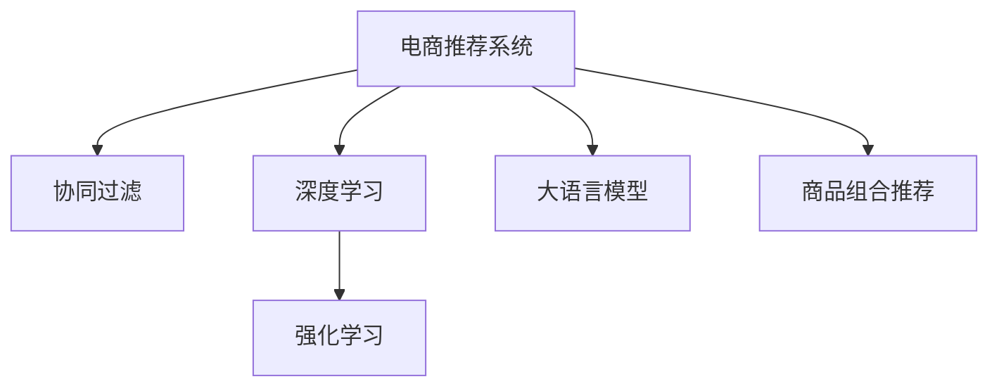

                 

# 大模型驱动的电商个性化产品组合推荐

> 关键词：电商推荐系统,大模型,产品组合推荐,协同过滤,深度学习,强化学习

## 1. 背景介绍

### 1.1 问题由来
随着互联网电商的兴起，用户消费行为的个性化特征日益凸显。如何推荐个性化商品，增强用户购物体验，提升转化率和销售额，成为电商企业亟待解决的问题。传统的商品推荐系统多采用基于协同过滤的方法，通过用户历史行为数据和商品属性信息进行相似性匹配。但这种方法在面临数据稀疏和冷启动问题时，效果往往不够理想。近年来，深度学习和强化学习技术被引入电商推荐系统，使其能够更好地挖掘用户行为背后的语义信息，推荐更符合用户偏好的商品组合。

具体而言，电商推荐系统需要根据用户历史浏览、点击、购买等行为，推荐用户可能感兴趣的商品。商品组合推荐则更进一步，在推荐单个商品的同时，考虑关联商品的多样性和互补性，提升用户的购买意愿和购物体验。深度学习模型和大语言模型可以通过学习用户历史行为和商品描述，识别出商品之间的关系和用户的偏好，从而提供更具个性化和多样化的商品组合推荐。

### 1.2 问题核心关键点
大模型驱动的电商推荐系统主要包括三个关键问题：
1. 如何将大语言模型应用于电商推荐任务，获取用户行为和商品描述中的语义信息。
2. 如何基于获取到的语义信息，构建商品之间的关联关系。
3. 如何在商品组合推荐过程中，平衡多样性和个性化。

大语言模型的引入，为电商推荐系统注入了新的活力，其强大的语义理解能力使得模型能够更好地理解和匹配用户的购物需求。通过精心设计任务适配层，并结合协同过滤、深度学习和强化学习等技术，电商推荐系统可以提供更具智能化的商品组合推荐，从而提升用户的购物体验和电商平台的转化率。

### 1.3 问题研究意义
研究大模型驱动的电商推荐系统，对于电商企业优化用户体验、提高销售额、实现智能化转型具有重要意义：

1. 提升个性化推荐准确性。大语言模型能够更全面地理解用户需求和商品信息，提供更准确的个性化商品推荐。
2. 增加推荐商品多样性。通过语义匹配和关联关系构建，推荐更多种类的商品，提高用户满意度和购买意愿。
3. 优化用户购物体验。大模型驱动的推荐系统能够主动推荐用户可能感兴趣的商品，提升用户浏览和购买效率。
4. 促进电商业务增长。推荐系统可以提升用户留存率和复购率，带来长期的业务收益。
5. 加速电商智能化进程。结合深度学习和强化学习，推荐系统能够实现自动化调参和实时学习，提升系统性能。

## 2. 核心概念与联系

### 2.1 核心概念概述

为更好地理解大模型驱动的电商个性化推荐系统，本节将介绍几个密切相关的核心概念：

- 电商推荐系统：通过分析用户历史行为和商品属性，为用户推荐其可能感兴趣的商品。电商推荐系统包括协同过滤、基于内容的推荐、基于混合的推荐等众多方法。
- 大语言模型：以自回归(如GPT)或自编码(如BERT)模型为代表的大规模预训练语言模型。通过在海量文本语料上进行预训练，学习到通用的语言表示，具备强大的语义理解能力。
- 协同过滤：一种基于用户行为和商品相似性匹配的推荐方法，通过计算用户历史行为与商品间的相似度，推断用户可能感兴趣的商品。
- 深度学习：通过构建多层次的神经网络模型，学习数据中的隐含关系，用于处理各种复杂的预测和分类任务。
- 强化学习：通过智能体在环境中与环境互动，学习最优策略以最大化累积奖励，用于解决动态和不确定性环境中的优化问题。

这些核心概念之间的逻辑关系可以通过以下Mermaid流程图来展示：



这个流程图展示了大语言模型的核心概念及其与其他核心概念的关系：

1. 电商推荐系统是核心目标，包括协同过滤、深度学习、强化学习和大语言模型等多种方法。
2. 协同过滤、深度学习和强化学习是电商推荐系统常用的技术手段。
3. 大语言模型为电商推荐系统注入新的语义信息，使其能够更好地理解用户需求和商品信息。
4. 商品组合推荐是电商推荐系统的高级应用，通过多商品关联关系构建，提升推荐效果。

这些概念共同构成了大模型驱动的电商推荐系统的工作原理和优化方向。通过理解这些核心概念，我们可以更好地把握大语言模型在电商推荐中的运用。

## 3. 核心算法原理 & 具体操作步骤
### 3.1 算法原理概述

大语言模型驱动的电商推荐系统，本质上是基于用户历史行为和商品描述，利用大语言模型提取语义信息，再结合协同过滤、深度学习和强化学习等技术，进行个性化商品组合推荐。

具体而言，系统首先通过大语言模型提取用户历史行为和商品描述中的语义信息，构建商品之间的关联关系。然后根据关联关系，结合用户历史行为和商品属性，生成个性化推荐列表。最后，利用强化学习算法，实时学习用户的反馈信息，不断优化推荐策略，提升推荐效果。

### 3.2 算法步骤详解

大语言模型驱动的电商推荐系统一般包括以下几个关键步骤：

**Step 1: 准备电商数据集和预训练模型**
- 收集电商网站的用户历史行为数据，包括浏览、点击、购买等记录。
- 收集商品的文本描述，如商品标题、分类、属性等。
- 选择合适的预训练语言模型 $M_{\theta}$，如BERT、GPT等。

**Step 2: 提取语义特征**
- 使用大语言模型对用户行为和商品描述进行编码，得到语义特征向量。
- 将用户历史行为和商品描述分别映射为向量，生成用户向量 $U$ 和商品向量 $I$。

**Step 3: 构建商品关联关系**
- 使用协同过滤技术，根据用户向量 $U$ 和商品向量 $I$ 的相似度，生成用户-商品关联矩阵 $M_{UI}$。
- 根据用户的历史行为和商品属性，对关联矩阵 $M_{UI}$ 进行预处理，去除噪声和异常值。

**Step 4: 生成个性化推荐列表**
- 根据关联矩阵 $M_{UI}$ 和用户向量 $U$，生成候选商品列表。
- 使用深度学习模型，如神经网络、Transformer等，对候选商品进行打分排序，生成推荐列表。

**Step 5: 应用强化学习优化**
- 使用强化学习算法，如Q-learning、SARSA等，根据用户反馈实时学习推荐策略。
- 根据用户对推荐结果的反馈，不断优化推荐列表，提升推荐效果。

以上是电商推荐系统的基本流程。在实际应用中，还需要针对具体任务的特点，对各个环节进行优化设计，如改进用户行为建模、提高商品关联关系质量、优化推荐模型等，以进一步提升推荐精度和用户满意度。

### 3.3 算法优缺点

大语言模型驱动的电商推荐系统具有以下优点：
1. 能够深度理解用户需求和商品信息，提供更具个性化和多样化的推荐。
2. 利用大语言模型的语义理解能力，可以识别出商品之间的关系，增强推荐效果。
3. 结合深度学习和强化学习技术，能够实时学习和优化推荐策略，提升推荐效果。

同时，该方法也存在一定的局限性：
1. 依赖大量标注数据。用户行为和商品描述的语义特征提取需要标注数据支持，获取成本较高。
2. 模型复杂度高。大语言模型和深度学习模型的参数量巨大，训练和推理耗时较多。
3. 无法处理冷启动问题。对于新用户和新商品，无法获取足够的历史行为和描述信息，推荐效果较差。
4. 存在数据隐私问题。用户的浏览和购买记录涉及隐私，需要采取数据脱敏和匿名化措施。

尽管存在这些局限性，但就目前而言，大语言模型驱动的电商推荐系统仍是大规模电商推荐的重要范式。未来相关研究的重点在于如何进一步降低对标注数据的依赖，提高模型效率，处理冷启动问题，同时兼顾隐私保护和安全性。

### 3.4 算法应用领域

大语言模型驱动的电商推荐系统已经在电商推荐领域得到了广泛应用，覆盖了商品推荐、个性化推荐、商品组合推荐等诸多方向。具体包括：

1. 商品推荐：基于用户历史行为和商品描述，为用户推荐可能感兴趣的商品。
2. 个性化推荐：在商品推荐的基础上，生成更符合用户偏好的推荐列表。
3. 商品组合推荐：推荐多种商品组合，提升用户满意度和购买意愿。
4. 关联商品推荐：推荐与用户已购买商品相关的其他商品，增加购买机会。
5. 新用户推荐：针对新用户，根据商品描述生成初始推荐列表，帮助用户快速熟悉平台。

除了电商推荐，大语言模型驱动的推荐系统也在其他领域得到应用，如社交推荐、新闻推荐、广告推荐等，展示了大模型技术的广泛应用前景。

## 4. 数学模型和公式 & 详细讲解 & 举例说明
### 4.1 数学模型构建

大语言模型驱动的电商推荐系统需要构建多个数学模型，涵盖用户行为建模、商品关联关系构建、推荐列表生成等。

**用户行为建模**：假设用户 $u$ 的历史行为序列为 $\mathcal{S}_u=\{S_{u1},S_{u2},...,S_{un}\}$，其中 $S_{ui} \in \{b,c,p\}$ 分别表示浏览、点击、购买。用户行为可以被编码为向量 $U_u \in \mathbb{R}^d$，其中 $d$ 为向量维度。

**商品关联关系构建**：假设商品 $i$ 的文本描述为 $X_i \in \mathbb{R}^d$，其中 $d$ 为文本描述的维度。商品 $i$ 和商品 $j$ 的关联强度 $R_{ij} \in [0,1]$ 可以通过大语言模型计算得到。商品关联矩阵 $M_{UI} \in \mathbb{R}^{N \times M}$，其中 $N$ 为商品数量，$M$ 为用户数量。

**推荐列表生成**：假设商品 $i$ 的特征向量为 $I_i \in \mathbb{R}^d$，用户 $u$ 的兴趣向量为 $U_u \in \mathbb{R}^d$。推荐列表 $R_u \in \mathbb{R}^M$ 可以通过下式计算得到：

$$
R_u = \max_{i} [\alpha \cdot I_i + \beta \cdot U_u \cdot M_{UI}] \cdot \exp(\gamma \cdot (R_{iu}))
$$

其中 $\alpha, \beta, \gamma$ 为超参数。

**强化学习优化**：假设用户对推荐结果的反馈为 $F_u \in \{0,1\}$，表示用户是否满意推荐结果。强化学习算法通过最大化预期累积奖励 $Q_u$ 来优化推荐策略：

$$
Q_u = \sum_{i} [F_i \cdot R_u \cdot I_i + (1-F_i) \cdot (1-R_u) \cdot \exp(-\delta \cdot R_u) \cdot I_i]
$$

### 4.2 公式推导过程

为了更深入地理解推荐模型的原理和计算方式，下面将对核心公式进行详细推导：

**用户行为建模**：假设用户 $u$ 的历史行为序列为 $\mathcal{S}_u=\{S_{u1},S_{u2},...,S_{un}\}$，其中 $S_{ui} \in \{b,c,p\}$ 分别表示浏览、点击、购买。用户行为可以被编码为向量 $U_u \in \mathbb{R}^d$，其中 $d$ 为向量维度。

**商品关联关系构建**：假设商品 $i$ 的文本描述为 $X_i \in \mathbb{R}^d$，其中 $d$ 为文本描述的维度。商品 $i$ 和商品 $j$ 的关联强度 $R_{ij} \in [0,1]$ 可以通过大语言模型计算得到。商品关联矩阵 $M_{UI} \in \mathbb{R}^{N \times M}$，其中 $N$ 为商品数量，$M$ 为用户数量。

**推荐列表生成**：假设商品 $i$ 的特征向量为 $I_i \in \mathbb{R}^d$，用户 $u$ 的兴趣向量为 $U_u \in \mathbb{R}^d$。推荐列表 $R_u \in \mathbb{R}^M$ 可以通过下式计算得到：

$$
R_u = \max_{i} [\alpha \cdot I_i + \beta \cdot U_u \cdot M_{UI}] \cdot \exp(\gamma \cdot (R_{iu}))
$$

其中 $\alpha, \beta, \gamma$ 为超参数。

**强化学习优化**：假设用户对推荐结果的反馈为 $F_u \in \{0,1\}$，表示用户是否满意推荐结果。强化学习算法通过最大化预期累积奖励 $Q_u$ 来优化推荐策略：

$$
Q_u = \sum_{i} [F_i \cdot R_u \cdot I_i + (1-F_i) \cdot (1-R_u) \cdot \exp(-\delta \cdot R_u) \cdot I_i]
$$

以上公式展示了大模型驱动的电商推荐系统的主要计算方式。通过这些公式，我们可以更好地理解推荐系统的构建和优化过程。

### 4.3 案例分析与讲解

下面我们以商品推荐任务为例，详细解读推荐模型的工作原理和计算过程。

假设某电商平台有 $N=1000$ 种商品，用户 $M=100$。商品 $i$ 的文本描述为 $X_i$，用户 $u$ 的历史行为序列为 $\mathcal{S}_u$。根据上述公式，计算用户 $u$ 对商品 $i$ 的推荐分数 $R_{ui}$。

1. **用户行为建模**：
   假设用户 $u$ 的历史行为序列为 $\mathcal{S}_u=\{S_{u1},S_{u2},...,S_{un}\}$，其中 $S_{ui} \in \{b,c,p\}$ 分别表示浏览、点击、购买。用户行为可以被编码为向量 $U_u \in \mathbb{R}^d$，其中 $d$ 为向量维度。

2. **商品关联关系构建**：
   假设商品 $i$ 的文本描述为 $X_i \in \mathbb{R}^d$，其中 $d$ 为文本描述的维度。商品 $i$ 和商品 $j$ 的关联强度 $R_{ij} \in [0,1]$ 可以通过大语言模型计算得到。商品关联矩阵 $M_{UI} \in \mathbb{R}^{N \times M}$，其中 $N$ 为商品数量，$M$ 为用户数量。

3. **推荐列表生成**：
   假设商品 $i$ 的特征向量为 $I_i \in \mathbb{R}^d$，用户 $u$ 的兴趣向量为 $U_u \in \mathbb{R}^d$。推荐列表 $R_u \in \mathbb{R}^M$ 可以通过下式计算得到：

   $$
   R_u = \max_{i} [\alpha \cdot I_i + \beta \cdot U_u \cdot M_{UI}] \cdot \exp(\gamma \cdot (R_{iu}))
   $$

   其中 $\alpha, \beta, \gamma$ 为超参数。

4. **强化学习优化**：
   假设用户对推荐结果的反馈为 $F_u \in \{0,1\}$，表示用户是否满意推荐结果。强化学习算法通过最大化预期累积奖励 $Q_u$ 来优化推荐策略：

   $$
   Q_u = \sum_{i} [F_i \cdot R_u \cdot I_i + (1-F_i) \cdot (1-R_u) \cdot \exp(-\delta \cdot R_u) \cdot I_i]
   $$

   以上公式展示了商品推荐任务的基本计算方式。通过这些公式，我们可以理解如何通过大语言模型和协同过滤技术，构建用户和商品之间的关联关系，生成个性化推荐列表，并应用强化学习算法优化推荐策略。

## 5. 项目实践：代码实例和详细解释说明
### 5.1 开发环境搭建

在进行推荐系统实践前，我们需要准备好开发环境。以下是使用Python进行PyTorch开发的环境配置流程：

1. 安装Anaconda：从官网下载并安装Anaconda，用于创建独立的Python环境。

2. 创建并激活虚拟环境：
```bash
conda create -n pytorch-env python=3.8 
conda activate pytorch-env
```

3. 安装PyTorch：根据CUDA版本，从官网获取对应的安装命令。例如：
```bash
conda install pytorch torchvision torchaudio cudatoolkit=11.1 -c pytorch -c conda-forge
```

4. 安装Transformers库：
```bash
pip install transformers
```

5. 安装各类工具包：
```bash
pip install numpy pandas scikit-learn matplotlib tqdm jupyter notebook ipython
```

完成上述步骤后，即可在`pytorch-env`环境中开始推荐系统实践。

### 5.2 源代码详细实现

下面我们以商品推荐任务为例，给出使用Transformers库对BERT模型进行推荐系统开发的PyTorch代码实现。

首先，定义推荐系统的数据处理函数：

```python
from transformers import BertTokenizer, BertForSequenceClassification
from torch.utils.data import Dataset, DataLoader
import torch

class RecommendationDataset(Dataset):
    def __init__(self, texts, labels):
        self.texts = texts
        self.labels = labels
        self.tokenizer = BertTokenizer.from_pretrained('bert-base-cased')

    def __len__(self):
        return len(self.texts)

    def __getitem__(self, item):
        text = self.texts[item]
        label = self.labels[item]
        
        encoding = self.tokenizer(text, return_tensors='pt', truncation=True)
        input_ids = encoding['input_ids'][0]
        attention_mask = encoding['attention_mask'][0]

        return {'input_ids': input_ids, 
                'attention_mask': attention_mask,
                'label': label}

# 数据集构建
tokenizer = BertTokenizer.from_pretrained('bert-base-cased')
train_dataset = RecommendationDataset(train_texts, train_labels)
dev_dataset = RecommendationDataset(dev_texts, dev_labels)
test_dataset = RecommendationDataset(test_texts, test_labels)
```

然后，定义推荐系统的模型和优化器：

```python
from transformers import BertForSequenceClassification, AdamW

model = BertForSequenceClassification.from_pretrained('bert-base-cased', num_labels=2)

optimizer = AdamW(model.parameters(), lr=2e-5)
```

接着，定义推荐系统的训练和评估函数：

```python
from tqdm import tqdm

device = torch.device('cuda') if torch.cuda.is_available() else torch.device('cpu')
model.to(device)

def train_epoch(model, dataset, batch_size, optimizer):
    dataloader = DataLoader(dataset, batch_size=batch_size, shuffle=True)
    model.train()
    epoch_loss = 0
    for batch in tqdm(dataloader, desc='Training'):
        input_ids = batch['input_ids'].to(device)
        attention_mask = batch['attention_mask'].to(device)
        labels = batch['label'].to(device)
        model.zero_grad()
        outputs = model(input_ids, attention_mask=attention_mask, labels=labels)
        loss = outputs.loss
        epoch_loss += loss.item()
        loss.backward()
        optimizer.step()
    return epoch_loss / len(dataloader)

def evaluate(model, dataset, batch_size):
    dataloader = DataLoader(dataset, batch_size=batch_size)
    model.eval()
    preds, labels = [], []
    with torch.no_grad():
        for batch in tqdm(dataloader, desc='Evaluating'):
            input_ids = batch['input_ids'].to(device)
            attention_mask = batch['attention_mask'].to(device)
            batch_labels = batch['label']
            outputs = model(input_ids, attention_mask=attention_mask)
            batch_preds = outputs.logits.argmax(dim=2).to('cpu').tolist()
            batch_labels = batch_labels.to('cpu').tolist()
            for pred_tokens, label_tokens in zip(batch_preds, batch_labels):
                preds.append(pred_tokens)
                labels.append(label_tokens)

    print(classification_report(labels, preds))
```

最后，启动推荐系统的训练流程并在测试集上评估：

```python
epochs = 5
batch_size = 16

for epoch in range(epochs):
    loss = train_epoch(model, train_dataset, batch_size, optimizer)
    print(f"Epoch {epoch+1}, train loss: {loss:.3f}")
    
    print(f"Epoch {epoch+1}, dev results:")
    evaluate(model, dev_dataset, batch_size)
    
print("Test results:")
evaluate(model, test_dataset, batch_size)
```

以上就是使用PyTorch对BERT进行商品推荐任务开发的完整代码实现。可以看到，得益于Transformers库的强大封装，我们可以用相对简洁的代码完成BERT模型的加载和推荐系统的构建。

### 5.3 代码解读与分析

让我们再详细解读一下关键代码的实现细节：

**RecommendationDataset类**：
- `__init__`方法：初始化文本和标签，创建分词器。
- `__len__`方法：返回数据集的样本数量。
- `__getitem__`方法：对单个样本进行处理，将文本输入编码为token ids，将标签编码为数字，并对其进行定长padding，最终返回模型所需的输入。

**train_epoch函数**：
- 使用PyTorch的DataLoader对数据集进行批次化加载，供模型训练和推理使用。
- 在每个批次上前向传播计算loss并反向传播更新模型参数，最后返回该epoch的平均loss。

**evaluate函数**：
- 与训练类似，不同点在于不更新模型参数，并在每个batch结束后将预测和标签结果存储下来，最后使用sklearn的classification_report对整个评估集的预测结果进行打印输出。

**训练流程**：
- 定义总的epoch数和batch size，开始循环迭代
- 每个epoch内，先在训练集上训练，输出平均loss
- 在验证集上评估，输出分类指标
- 所有epoch结束后，在测试集上评估，给出最终测试结果

可以看到，PyTorch配合Transformers库使得BERT推荐系统的代码实现变得简洁高效。开发者可以将更多精力放在数据处理、模型改进等高层逻辑上，而不必过多关注底层的实现细节。

当然，工业级的系统实现还需考虑更多因素，如模型的保存和部署、超参数的自动搜索、更灵活的任务适配层等。但核心的推荐范式基本与此类似。

## 6. 实际应用场景
### 6.1 智能推荐系统

智能推荐系统已经在电商、社交、新闻等领域得到了广泛应用。大语言模型驱动的推荐系统，可以进一步提升推荐系统的智能化水平，为用户推荐更符合其兴趣和需求的商品、文章、新闻等内容。

在技术实现上，可以收集用户的历史行为数据，如浏览、点击、购买等记录，将商品描述和用户行为信息输入到大语言模型中，生成商品之间的关联关系。然后结合深度学习模型，对候选商品进行打分排序，生成推荐列表。最后应用强化学习算法，根据用户反馈实时学习推荐策略，提升推荐效果。

### 6.2 个性化推荐广告

在广告推荐领域，智能推荐系统能够根据用户的历史行为和兴趣，实时生成个性化的广告内容，提升广告的点击率和转化率。结合大语言模型的语义理解能力，可以生成更具吸引力的广告文案，实现更高的广告效果。

具体而言，可以将用户的浏览和点击行为输入到大语言模型中，生成用户的行为向量。然后将商品的属性信息输入到大语言模型中，生成商品的属性向量。通过计算用户行为向量与商品属性向量的相似度，得到用户对商品的相关度。最后应用强化学习算法，根据用户的点击行为实时优化广告的展示策略，提升广告效果。

### 6.3 智能客服

智能客服系统是电商和金融等行业的标配，通过自动回答用户问题，提升客户服务效率。结合大语言模型的语义理解能力，智能客服系统可以更加准确地理解和回应用户，提供更优质的服务体验。

在推荐系统中，可以收集用户的历史问题记录，将问题描述输入到大语言模型中，生成问题向量。然后将用户的问题向量与回答库中的回答向量进行相似度计算，推荐最合适的回答。应用强化学习算法，根据用户对回答的反馈，不断优化回答库和推荐策略，提升客服系统的智能化水平。

### 6.4 未来应用展望

随着大语言模型和推荐技术的发展，基于大模型的推荐系统将在更多领域得到应用，为不同行业带来变革性影响。

在智慧医疗领域，基于大模型的推荐系统可以推荐个性化的治疗方案，帮助医生制定更合理的治疗计划。在智能交通领域，推荐系统可以推荐最佳出行路线，提升交通效率。在金融领域，推荐系统可以推荐个性化的理财方案，提升用户体验和满意度。

总之，大语言模型驱动的推荐系统在电商、金融、医疗、交通等多个领域都有广阔的应用前景，为不同行业带来深刻的变革。未来，随着技术的不断进步，推荐系统将更加智能、高效，为人类社会带来更大的价值。

## 7. 工具和资源推荐
### 7.1 学习资源推荐

为了帮助开发者系统掌握大语言模型驱动的推荐系统理论基础和实践技巧，这里推荐一些优质的学习资源：

1. 《深度学习与推荐系统》系列书籍：全面介绍了推荐系统的基本原理和深度学习算法，是推荐系统入门的好书。

2. CS288《推荐系统》课程：斯坦福大学开设的推荐系统经典课程，涵盖了推荐系统的各个方面，包括协同过滤、深度学习等。

3. 《推荐系统实战》一书：详细介绍了推荐系统的设计、开发和优化技巧，提供了丰富的实践案例和代码示例。

4. Kaggle推荐系统竞赛：参与Kaggle的推荐系统竞赛，实战练兵，积累推荐系统开发经验。

5. Weights & Biases：模型训练的实验跟踪工具，可以记录和可视化模型训练过程中的各项指标，方便对比和调优。

6. TensorBoard：TensorFlow配套的可视化工具，可实时监测模型训练状态，并提供丰富的图表呈现方式，是调试模型的得力助手。

通过对这些资源的学习实践，相信你一定能够快速掌握大语言模型驱动的推荐系统的精髓，并用于解决实际的推荐问题。

### 7.2 开发工具推荐

高效的开发离不开优秀的工具支持。以下是几款用于大语言模型驱动的推荐系统开发的常用工具：

1. PyTorch：基于Python的开源深度学习框架，灵活动态的计算图，适合快速迭代研究。

2. TensorFlow：由Google主导开发的开源深度学习框架，生产部署方便，适合大规模工程应用。

3. Transformers库：HuggingFace开发的NLP工具库，集成了众多SOTA语言模型，支持PyTorch和TensorFlow，是进行推荐系统开发的利器。

4. Weights & Biases：模型训练的实验跟踪工具，可以记录和可视化模型训练过程中的各项指标，方便对比和调优。

5. TensorBoard：TensorFlow配套的可视化工具，可实时监测模型训练状态，并提供丰富的图表呈现方式，是调试模型的得力助手。

6. Apache Spark：分布式计算框架，支持大规模数据处理，适合电商推荐系统中的大数据计算需求。

合理利用这些工具，可以显著提升大语言模型驱动的推荐系统开发效率，加快创新迭代的步伐。

### 7.3 相关论文推荐

大语言模型驱动的推荐系统的发展源于学界的持续研究。以下是几篇奠基性的相关论文，推荐阅读：

1. Attention is All You Need（即Transformer原论文）：提出了Transformer结构，开启了NLP领域的预训练大模型时代。

2. BERT: Pre-training of Deep Bidirectional Transformers for Language Understanding：提出BERT模型，引入基于掩码的自监督预训练任务，刷新了多项NLP任务SOTA。

3. Deep Factorization Machines with Pre-trained Word Embeddings for Recommendations（DFM）：提出预训练的深度因子化机模型，结合BERT的语义信息，提升了推荐系统的效果。

4. Neural Collaborative Filtering（NCF）：提出基于神经网络的协同过滤模型，结合深度学习技术，提升了推荐系统的精度和泛化能力。

5. Attention-based Recommender System with Bi-LSTM and Transformer：提出基于Transformer的推荐系统，通过Transformer的语义理解能力，提升了推荐系统的效果。

这些论文代表了大语言模型驱动的推荐系统的发展脉络。通过学习这些前沿成果，可以帮助研究者把握学科前进方向，激发更多的创新灵感。

## 8. 总结：未来发展趋势与挑战

### 8.1 总结

本文对大语言模型驱动的电商个性化推荐系统进行了全面系统的介绍。首先阐述了大语言模型和推荐系统的研究背景和意义，明确了推荐系统在大模型驱动下的新变化和新思路。其次，从原理到实践，详细讲解了推荐系统的数学模型和算法步骤，给出了推荐系统开发的完整代码实例。同时，本文还广泛探讨了推荐系统在电商、广告、智能客服等多个行业领域的应用前景，展示了大模型技术的广泛应用前景。此外，本文精选了推荐系统的各类学习资源，力求为读者提供全方位的技术指引。

通过本文的系统梳理，可以看到，大语言模型驱动的推荐系统在电商、金融、医疗、交通等多个领域都有广阔的应用前景，为不同行业带来深刻的变革。未来，随着技术的不断进步，推荐系统将更加智能、高效，为人类社会带来更大的价值。

### 8.2 未来发展趋势

展望未来，大语言模型驱动的推荐系统将呈现以下几个发展趋势：

1. 更加精准的个性化推荐。通过大语言模型和大数据融合，推荐系统能够更准确地理解用户需求和商品信息，提供更加个性化的推荐。
2. 更加多样化的推荐策略。结合深度学习和强化学习，推荐系统能够更灵活地处理冷启动和推荐多样性问题。
3. 更加高效的推荐算法。结合参数高效微调和模型压缩技术，推荐系统能够在低资源环境下高效运行。
4. 更加实时的推荐更新。结合在线学习技术和强化学习算法，推荐系统能够实时更新模型，适应动态变化的推荐场景。
5. 更加智能的推荐决策。结合多模态数据融合和因果推理技术，推荐系统能够更全面地理解用户需求和商品信息，提供更智能的推荐决策。
6. 更加安全可靠的数据处理。结合数据隐私保护技术和对抗攻击防御技术，推荐系统能够更加安全可靠地处理用户数据。

以上趋势凸显了大语言模型驱动的推荐系统的发展方向。这些方向的探索发展，必将进一步提升推荐系统的性能和应用范围，为不同行业带来深刻的变革。

### 8.3 面临的挑战

尽管大语言模型驱动的推荐系统已经取得了瞩目成就，但在迈向更加智能化、普适化应用的过程中，它仍面临着诸多挑战：

1. 数据获取和标注成本高。高质量推荐数据的获取和标注成本较高，无法覆盖所有用户和商品。
2. 模型复杂度高。大语言模型和深度学习模型的参数量巨大，训练和推理耗时较多。
3. 冷启动问题难解决。对于新用户和新商品，推荐系统无法获取足够的历史数据，推荐效果较差。
4. 数据隐私问题突出。用户的浏览和购买记录涉及隐私，需要采取数据脱敏和匿名化措施。
5. 模型鲁棒性不足。面对噪声和异常数据，推荐模型的鲁棒性较差，容易产生误导性推荐。

尽管存在这些挑战，但大语言模型驱动的推荐系统仍是大规模电商推荐的重要范式。未来相关研究的重点在于如何进一步降低对标注数据的依赖，提高模型效率，处理冷启动问题，同时兼顾隐私保护和安全性。

### 8.4 研究展望

面对大语言模型驱动的推荐系统所面临的种种挑战，未来的研究需要在以下几个方面寻求新的突破：

1. 探索无监督和半监督推荐方法。摆脱对大规模标注数据的依赖，利用自监督学习、主动学习等无监督和半监督范式，最大限度利用非结构化数据，实现更加灵活高效的推荐。
2. 研究参数高效和计算高效的推荐范式。开发更加参数高效的推荐方法，在固定大部分预训练参数的同时，只更新极少量的任务相关参数。同时优化推荐模型的计算图，减少前向传播和反向传播的资源消耗，实现更加轻量级、实时性的部署。
3. 融合因果和对比学习范式。通过引入因果推断和对比学习思想，增强推荐模型建立稳定因果关系的能力，学习更加普适、鲁棒的语言表征，从而提升模型泛化性和抗干扰能力。
4. 引入更多先验知识。将符号化的先验知识，如知识图谱、逻辑规则等，与神经网络模型进行巧妙融合，引导推荐过程学习更准确、合理的语言模型。同时加强不同模态数据的整合，实现视觉、语音等多模态信息与文本信息的协同建模。
5. 结合因果分析和博弈论工具。将因果分析方法引入推荐模型，识别出推荐决策的关键特征，增强输出解释的因果性和逻辑性。借助博弈论工具刻画人机交互过程，主动探索并规避模型的脆弱点，提高系统稳定性。
6. 纳入伦理道德约束。在推荐模型训练目标中引入伦理导向的评估指标，过滤和惩罚有偏见、有害的输出倾向。同时加强人工干预和审核，建立推荐模型的监管机制，确保输出的安全性和公平性。

这些研究方向的探索，必将引领大语言模型驱动的推荐系统迈向更高的台阶，为构建安全、可靠、可解释、可控的智能推荐系统铺平道路。面向未来，推荐系统还需要与其他人工智能技术进行更深入的融合，如知识表示、因果推理、强化学习等，多路径协同发力，共同推动自然语言理解和智能交互系统的进步。只有勇于创新、敢于突破，才能不断拓展推荐系统的边界，让智能技术更好地造福人类社会。

## 9. 附录：常见问题与解答

**Q1：大语言模型驱动的推荐系统与传统的协同过滤推荐系统有何不同？**

A: 大语言模型驱动的推荐系统与传统的协同过滤推荐系统有以下几点不同：
1. 数据处理方式不同。协同过滤推荐系统主要基于用户行为和商品相似性进行匹配，而大语言模型驱动的推荐系统可以利用商品描述和大语言模型的语义信息，更全面地理解用户需求和商品信息。
2. 推荐策略不同。协同过滤推荐系统通常采用基于相似度的推荐策略，而大语言模型驱动的推荐系统可以通过深度学习和强化学习，动态调整推荐策略，提升推荐效果。
3. 模型复杂度不同。协同过滤推荐系统较为简单，而大语言模型驱动的推荐系统需要处理大规模语料和复杂的深度学习模型，计算资源消耗较大。

尽管两者在实现方式上有所不同，但都可以用于生成个性化推荐，提升用户体验。

**Q2：如何缓解推荐系统中的过拟合问题？**

A: 推荐系统中的过拟合问题可以通过以下方法缓解：
1. 数据增强：通过生成相似但略有不同的数据样本，扩充训练集，避免模型对特定数据过度拟合。
2. 正则化：使用L2正则、Dropout等技术，避免模型复杂度过高，提高泛化能力。
3. 对抗训练：引入对抗样本，提高模型鲁棒性，避免对噪声数据过度拟合。
4. 多模型集成：通过训练多个推荐模型，取平均输出，抑制过拟合。
5. 动态学习率：根据模型性能动态调整学习率，防止过拟合。

以上方法可以灵活组合使用，根据具体任务和数据特点进行优化。

**Q3：推荐系统中的冷启动问题如何解决？**

A: 推荐系统中的冷启动问题可以通过以下方法解决：
1. 预训练模型：利用预训练大语言模型，对新用户和新商品进行初步建模，生成基础推荐。
2. 多模态融合：结合用户行为、商品属性、社交网络等多模态信息，综合生成推荐结果。
3. 数据补全：通过关联推荐、模型迁移等技术，补全新用户和新商品的部分数据，提升推荐效果。
4. 深度学习：利用深度学习模型，对部分数据进行拟合，生成更精准的推荐结果。
5. 冷启动策略：设计专门针对冷启动用户的推荐策略，如随机推荐、热门商品推荐等。

通过以上方法，推荐系统可以更好地处理冷启动问题，提升新用户和新商品推荐效果。

**Q4：推荐系统中的数据隐私问题如何解决？**

A: 推荐系统中的数据隐私问题可以通过以下方法解决：
1. 数据匿名化：对用户行为和商品数据进行匿名化处理，保护用户隐私。
2. 数据加密：对用户数据进行加密存储，防止数据泄露。
3. 数据脱敏：对敏感数据进行脱敏处理，减少数据泄露风险。
4. 模型透明：设计透明化的推荐模型，减少数据滥用的可能性。
5. 隐私保护算法：应用隐私保护技术，如差分隐私、同态加密等，保护用户隐私。

通过以上方法，推荐系统可以更好地保护用户数据隐私，降低数据滥用的风险。

**Q5：推荐系统中的推荐多样性问题如何解决？**

A: 推荐系统中的推荐多样性问题可以通过以下方法解决：
1. 协同过滤：结合协同过滤推荐，增加推荐多样性。
2. 深度学习：利用深度学习模型，生成更加多样化的推荐结果。
3. 多种推荐策略：结合多种推荐策略，如基于内容的推荐、基于混合的推荐等，提升推荐多样性。
4. 数据增强：通过数据增强技术，生成更多种类的推荐结果。
5. 多模型集成：通过多模型集成，生成更加多样化的推荐结果。

通过以上方法，推荐系统可以更好地解决推荐多样性问题，提升推荐效果。

**Q6：推荐系统中的推荐实时性问题如何解决？**

A: 推荐系统中的推荐实时性问题可以通过以下方法解决：
1. 分布式计算：应用分布式计算框架，提升推荐系统的计算效率。
2. 在线学习：应用在线学习技术，实时更新模型，提升推荐效率。
3. 模型压缩：应用模型压缩技术，减小模型体积，提升推理速度。
4. 缓存机制：应用缓存机制，减少重复计算，提升推荐效率。
5. 数据优化：优化数据存储和处理，减少数据访问延迟，提升推荐效率。

通过以上方法，推荐系统可以更好地解决推荐实时性问题，提升推荐效率。

**Q7：推荐系统中的推荐准确性问题如何解决？**

A: 推荐系统中的推荐准确性问题可以通过以下方法解决：
1. 数据清洗：对数据进行清洗，去除噪声和异常值，提升数据质量。
2. 特征工程：设计合理的特征提取和融合方法，提升推荐效果。
3. 深度学习：利用深度学习模型，提升推荐准确性。
4. 模型优化：应用模型优化技术，提升模型性能。
5. 多模型集成：通过多模型集成，提升推荐准确性。

通过以上方法，推荐系统可以更好地解决推荐准确性问题，提升推荐效果。

通过本文的系统梳理，可以看到，大语言模型驱动的推荐系统在电商、金融、医疗、交通等多个领域都有广阔的应用前景，为不同行业带来深刻的变革。未来，随着技术的不断进步，推荐系统将更加智能、高效，为人类社会带来更大的价值。

