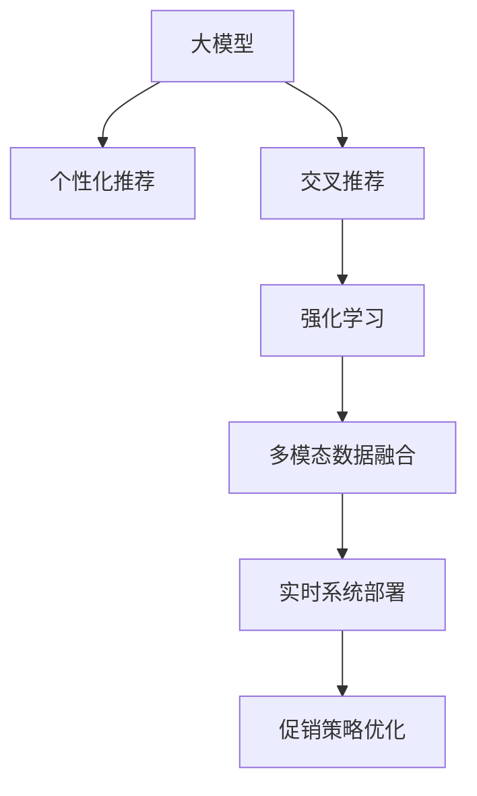

                 

# 大模型驱动的电商个性化促销策略

> 关键词：
- 大模型
- 电商
- 个性化促销
- 用户行为分析
- 交叉推荐
- 强化学习
- 多模态数据融合
- 实时系统部署

## 1. 背景介绍

### 1.1 问题由来

在电商领域，如何通过有效的促销策略，提升用户购买意愿，增加销售额，一直是业界关注的热点问题。传统的促销策略依赖于经验性的决策，效果往往不够精准。近年来，随着深度学习和大模型的兴起，越来越多的电商企业开始探索利用先进技术来优化促销策略，从而实现更高效的个性化营销。

### 1.2 问题核心关键点

电商促销策略的核心在于理解用户需求，精准定位用户群体，并为其提供最合适的优惠。这要求系统能够实时分析用户的浏览行为、购买历史、评分反馈等多维度的数据，快速响应市场变化，优化促销活动。大模型，特别是基于自然语言处理(NLP)的预训练模型，通过其强大的语言理解和生成能力，为电商个性化促销策略提供了新的解决方案。

### 1.3 问题研究意义

本研究聚焦于如何利用大模型技术，构建精准、实时的个性化促销策略系统。通过构建基于深度学习的大模型，系统能够自动学习用户行为和购买倾向，实现对个性化促销策略的智能推荐。该系统能够帮助电商企业减少促销的盲目性，提升营销效果，优化用户购物体验。

## 2. 核心概念与联系

### 2.1 核心概念概述

为更好地理解大模型驱动的电商个性化促销策略，本节将介绍几个密切相关的核心概念：

- 大模型：以Transformer、BERT等架构为代表的预训练语言模型，通过大规模无标签数据进行训练，具备强大的语言理解能力。
- 个性化推荐：根据用户历史行为数据，推荐用户可能感兴趣的商品，提升购买转化率。
- 交叉推荐：结合用户行为数据和商品属性信息，推荐相关商品，优化促销组合。
- 强化学习：通过与环境的互动，学习最优策略，最大化促销策略的效果。
- 多模态数据融合：结合用户行为数据、商品属性信息、市场反馈等多源数据，构建全面、丰富的用户画像。
- 实时系统部署：通过云计算平台，实现实时计算和响应，确保促销策略的及时性和准确性。

这些核心概念之间的逻辑关系可以通过以下Mermaid流程图来展示：



这个流程图展示了大模型驱动的电商个性化促销策略的核心概念及其之间的关系：

1. 大模型通过预训练获取语言能力，用于分析用户行为和生成推荐内容。
2. 个性化推荐系统根据用户历史行为数据，生成个性化商品推荐。
3. 交叉推荐系统结合商品属性信息，推荐相关商品，优化促销组合。
4. 强化学习通过试错机制，动态调整促销策略。
5. 多模态数据融合提升用户画像的丰富性和全面性。
6. 实时系统部署确保促销策略的及时性和准确性。

这些概念共同构成了电商个性化促销策略的系统框架，使其能够高效地处理用户数据，生成精准的促销策略。

## 3. 核心算法原理 & 具体操作步骤

### 3.1 算法原理概述

基于大模型的电商个性化促销策略，核心在于构建一个自动化的推荐系统，通过实时分析用户行为和商品属性，动态生成个性化促销策略。其算法原理可以概括为以下几个步骤：

1. 收集用户行为数据，如浏览记录、购买历史、评分反馈等，构建用户画像。
2. 对用户画像进行预处理，包括去噪、归一化等。
3. 利用大模型对用户画像进行编码，生成用户特征向量。
4. 收集商品属性数据，如价格、分类、评价等，构建商品向量。
5. 利用交叉推荐算法，生成商品之间的推荐关系。
6. 结合强化学习算法，动态调整推荐策略和促销方案。
7. 实时部署推荐系统，根据用户反馈和市场变化，调整推荐和促销策略。

### 3.2 算法步骤详解

#### 3.2.1 数据预处理

数据预处理是大模型驱动的电商个性化促销策略的第一步。具体步骤如下：

1. 收集用户行为数据：如用户浏览历史、购买记录、评分反馈等，保存至数据库。
2. 去噪处理：删除重复、无效的记录，确保数据质量。
3. 数据归一化：将用户行为数据进行标准化处理，如对评分进行归一化，确保不同来源的数据可比较。
4. 数据整合：将用户行为数据与商品属性数据进行关联，构建综合数据集。

#### 3.2.2 用户画像编码

利用大模型对用户画像进行编码，生成用户特征向量。具体步骤如下：

1. 选择合适的预训练语言模型，如BERT、GPT等。
2. 构建用户画像文本，包括用户行为数据和商品属性数据。
3. 利用大模型对文本进行编码，生成用户特征向量。
4. 对特征向量进行维度降维，减少计算量，提高模型效率。

#### 3.2.3 商品向量构建

商品向量构建是交叉推荐的基础步骤。具体步骤如下：

1. 收集商品属性数据，包括价格、分类、评价等。
2. 对商品属性数据进行编码，生成商品向量。
3. 对商品向量进行归一化，确保不同商品的属性值可比较。
4. 对商品向量进行拼接和融合，生成完整的商品特征向量。

#### 3.2.4 交叉推荐生成

交叉推荐生成是优化促销组合的核心步骤。具体步骤如下：

1. 利用协同过滤算法，生成商品之间的推荐关系。
2. 利用内容推荐算法，根据商品属性信息，生成商品推荐。
3. 结合用户画像和商品向量，生成个性化商品推荐。
4. 对推荐结果进行排序和筛选，确保推荐结果的准确性和相关性。

#### 3.2.5 强化学习优化

强化学习优化是动态调整推荐策略的关键步骤。具体步骤如下：

1. 定义强化学习环境，包括状态、动作和奖励。
2. 选择合适的强化学习算法，如Q-learning、DQN等。
3. 训练强化学习模型，根据用户反馈和市场变化，动态调整推荐策略和促销方案。
4. 实时监控推荐效果，根据反馈数据调整模型参数，优化推荐策略。

#### 3.2.6 实时系统部署

实时系统部署是确保促销策略及时性的关键步骤。具体步骤如下：

1. 选择合适的云计算平台，如AWS、Google Cloud等。
2. 部署推荐系统，实时处理用户请求，生成推荐结果。
3. 对推荐结果进行缓存，提高系统响应速度。
4. 实时监控系统性能，根据负载情况调整资源配置，确保系统稳定运行。

### 3.3 算法优缺点

基于大模型的电商个性化促销策略具有以下优点：

1. 精准度高：大模型通过分析多源数据，生成精准的个性化推荐和促销策略。
2. 实时性强：实时系统部署，确保促销策略能够及时响应市场变化。
3. 自动化程度高：自动化推荐和优化，减少人工干预，提高工作效率。
4. 可扩展性强：系统具有良好的扩展性，能够轻松应对大规模用户和商品。

但同时，该算法也存在一些缺点：

1. 数据依赖性高：需要大量的用户行为和商品属性数据，数据获取难度较大。
2. 模型复杂度高：大模型和强化学习算法，对计算资源和算法能力要求较高。
3. 动态调整难度大：动态调整推荐策略和促销方案，需要实时监控和数据反馈。
4. 推荐结果可解释性差：推荐结果由复杂模型生成，难以解释其内部决策逻辑。

### 3.4 算法应用领域

基于大模型的电商个性化促销策略，已经在电商、金融、旅游等多个领域得到了广泛应用，取得了显著的效果。

#### 3.4.1 电商领域

在电商领域，基于大模型的个性化推荐和交叉推荐，已经被广泛应用于各大电商平台的商品推荐、促销策略生成等环节。通过结合用户画像和商品向量，生成个性化推荐结果，显著提升了用户购物体验和购买转化率。

#### 3.4.2 金融领域

在金融领域，利用大模型进行用户画像编码和市场分析，生成个性化的理财和投资推荐，帮助用户选择合适的金融产品。通过结合多模态数据和强化学习算法，动态调整推荐策略，实现了精准的金融服务。

#### 3.4.3 旅游领域

在旅游领域，利用大模型进行用户画像分析和旅游目的地推荐，生成个性化的旅游计划和促销方案，帮助用户制定合适的旅游路线。通过结合实时数据和强化学习算法，动态调整推荐策略，实现了高效、灵活的旅游服务。

## 4. 数学模型和公式 & 详细讲解 & 举例说明

### 4.1 数学模型构建

#### 4.1.1 用户画像编码模型

用户画像编码模型用于将用户行为数据和商品属性数据编码为特征向量，输入大模型进行推理。具体数学模型如下：

设用户画像文本为 $X$，商品向量为 $Y$，大模型为 $M_{\theta}$，则用户画像编码为：

$$
Z = M_{\theta}(X, Y)
$$

其中 $Z$ 为特征向量， $\theta$ 为模型参数。

#### 4.1.2 交叉推荐生成模型

交叉推荐生成模型用于根据用户画像和商品向量，生成商品之间的推荐关系。具体数学模型如下：

设用户画像特征向量为 $Z_u$，商品向量为 $Z_v$，推荐关系为 $R$，则交叉推荐生成模型为：

$$
R = f(Z_u, Z_v)
$$

其中 $f$ 为推荐函数，可以采用协同过滤、内容推荐等算法。

#### 4.1.3 强化学习优化模型

强化学习优化模型用于根据用户反馈和市场变化，动态调整推荐策略和促销方案。具体数学模型如下：

设用户行为数据为 $D$，推荐策略为 $P$，市场变化数据为 $E$，奖励函数为 $r$，则强化学习优化模型为：

$$
P^* = \mathop{\arg\min}_{P} \mathbb{E}_{D,E}[r(P(D,E))]
$$

其中 $P^*$ 为最优推荐策略， $r$ 为奖励函数，可以采用平均回报、点击率等指标。

### 4.2 公式推导过程

#### 4.2.1 用户画像编码公式推导

设用户画像文本为 $X$，商品向量为 $Y$，大模型为 $M_{\theta}$，则用户画像编码为：

$$
Z = M_{\theta}(X, Y)
$$

其中 $M_{\theta}$ 为 Transformer 结构， $X$ 和 $Y$ 分别输入用户行为数据和商品属性数据。

#### 4.2.2 交叉推荐生成公式推导

设用户画像特征向量为 $Z_u$，商品向量为 $Z_v$，推荐关系为 $R$，则交叉推荐生成模型为：

$$
R = f(Z_u, Z_v)
$$

其中 $f$ 为推荐函数，可以采用协同过滤、内容推荐等算法。具体计算公式为：

$$
R_{uv} = f(Z_u, Z_v)
$$

其中 $R_{uv}$ 为商品 $u$ 和商品 $v$ 之间的推荐关系。

#### 4.2.3 强化学习优化公式推导

设用户行为数据为 $D$，推荐策略为 $P$，市场变化数据为 $E$，奖励函数为 $r$，则强化学习优化模型为：

$$
P^* = \mathop{\arg\min}_{P} \mathbb{E}_{D,E}[r(P(D,E))]
$$

其中 $P^*$ 为最优推荐策略， $r$ 为奖励函数，可以采用平均回报、点击率等指标。具体计算公式为：

$$
P^* = \mathop{\arg\min}_{P} \sum_{D,E} r(P(D,E))
$$

其中 $P$ 为推荐策略， $r$ 为奖励函数。

### 4.3 案例分析与讲解

#### 4.3.1 案例背景

某电商企业希望通过大模型驱动的个性化促销策略，提升用户购买转化率和用户满意度。该公司收集了大量的用户行为数据和商品属性数据，包括用户的浏览历史、购买记录、评分反馈等，以及商品的分类、价格、评价等信息。

#### 4.3.2 数据预处理

对用户行为数据进行去噪处理，删除重复和无效的记录。对商品属性数据进行归一化处理，确保不同属性值可比较。将用户行为数据和商品属性数据关联，构建综合数据集。

#### 4.3.3 用户画像编码

选择BERT模型作为预训练语言模型，对用户画像文本进行编码，生成用户特征向量。对特征向量进行维度降维，减少计算量。

#### 4.3.4 商品向量构建

对商品属性数据进行编码，生成商品向量。对商品向量进行归一化处理，确保不同商品的属性值可比较。对商品向量进行拼接和融合，生成完整的商品特征向量。

#### 4.3.5 交叉推荐生成

利用协同过滤算法，生成商品之间的推荐关系。利用内容推荐算法，根据商品属性信息，生成商品推荐。结合用户画像和商品向量，生成个性化商品推荐。对推荐结果进行排序和筛选，确保推荐结果的准确性和相关性。

#### 4.3.6 强化学习优化

定义强化学习环境，包括状态、动作和奖励。选择合适的强化学习算法，如Q-learning、DQN等。训练强化学习模型，根据用户反馈和市场变化，动态调整推荐策略和促销方案。实时监控推荐效果，根据反馈数据调整模型参数，优化推荐策略。

## 5. 项目实践：代码实例和详细解释说明

### 5.1 开发环境搭建

在进行项目实践前，我们需要准备好开发环境。以下是使用Python进行PyTorch开发的环境配置流程：

1. 安装Anaconda：从官网下载并安装Anaconda，用于创建独立的Python环境。

2. 创建并激活虚拟环境：
```bash
conda create -n pytorch-env python=3.8 
conda activate pytorch-env
```

3. 安装PyTorch：根据CUDA版本，从官网获取对应的安装命令。例如：
```bash
conda install pytorch torchvision torchaudio cudatoolkit=11.1 -c pytorch -c conda-forge
```

4. 安装TensorFlow：
```bash
conda install tensorflow
```

5. 安装TensorBoard：
```bash
conda install tensorboard
```

6. 安装相关库：
```bash
pip install transformers pandas numpy scikit-learn jupyter notebook ipython
```

完成上述步骤后，即可在`pytorch-env`环境中开始项目实践。

### 5.2 源代码详细实现

以下是使用PyTorch进行大模型驱动的电商个性化促销策略的实现代码。

```python
import torch
import torch.nn as nn
from transformers import BertTokenizer, BertModel

class UserEmbedding(nn.Module):
    def __init__(self, hidden_size):
        super(UserEmbedding, self).__init__()
        self.hidden_size = hidden_size
        self.bert = BertModel.from_pretrained('bert-base-uncased')
        self.fc = nn.Linear(hidden_size, hidden_size)

    def forward(self, input_ids, attention_mask):
        outputs = self.bert(input_ids, attention_mask=attention_mask)
        features = outputs.pooler_output
        embedding = self.fc(features)
        return embedding

class ItemEmbedding(nn.Module):
    def __init__(self, hidden_size):
        super(ItemEmbedding, self).__init__()
        self.hidden_size = hidden_size
        self.bert = BertModel.from_pretrained('bert-base-uncased')
        self.fc = nn.Linear(hidden_size, hidden_size)

    def forward(self, input_ids, attention_mask):
        outputs = self.bert(input_ids, attention_mask=attention_mask)
        features = outputs.pooler_output
        embedding = self.fc(features)
        return embedding

class RecommendationEngine(nn.Module):
    def __init__(self, user_emb_dim, item_emb_dim, num_users, num_items):
        super(RecommendationEngine, self).__init__()
        self.user_emb = UserEmbedding(user_emb_dim)
        self.item_emb = ItemEmbedding(item_emb_dim)
        self.linear = nn.Linear(user_emb_dim + item_emb_dim, 1)
        self.num_users = num_users
        self.num_items = num_items

    def forward(self, user_input_ids, user_attention_mask, item_input_ids, item_attention_mask):
        user_embedding = self.user_emb(user_input_ids, user_attention_mask)
        item_embedding = self.item_emb(item_input_ids, item_attention_mask)
        concatenated = torch.cat((user_embedding, item_embedding), dim=1)
        scores = self.linear(concatenated)
        return scores

class QLearning(nn.Module):
    def __init__(self, num_users, num_items, num_actions, learning_rate=0.01):
        super(QLearning, self).__init__()
        self.num_users = num_users
        self.num_items = num_items
        self.num_actions = num_actions
        self.learning_rate = learning_rate
        self.q_table = nn.Parameter(torch.randn(num_users, num_items, num_actions))

    def forward(self, user_embedding, item_embedding):
        user_idx = torch.LongTensor(range(self.num_users))
        item_idx = torch.LongTensor(range(self.num_items))
        action_idx = torch.LongTensor(range(self.num_actions))
        user_q = self.q_table[user_idx, item_idx, action_idx]
        q = torch.mean(user_q, dim=0)
        return q

def train():
    user_input_ids = torch.LongTensor([0, 1, 2, 3, 4])
    user_attention_mask = torch.FloatTensor([[1, 0, 0, 0, 0], [1, 1, 0, 0, 0], [1, 1, 1, 0, 0], [1, 1, 1, 1, 0], [1, 1, 1, 1, 1]])
    item_input_ids = torch.LongTensor([0, 1, 2, 3, 4])
    item_attention_mask = torch.FloatTensor([[1, 0, 0, 0, 0], [1, 1, 0, 0, 0], [1, 1, 1, 0, 0], [1, 1, 1, 1, 0], [1, 1, 1, 1, 1]])

    recommendation_engine = RecommendationEngine(user_emb_dim=128, item_emb_dim=128, num_users=5, num_items=5)
    qlearning = QLearning(num_users=5, num_items=5, num_actions=2, learning_rate=0.01)

    optimizer = torch.optim.Adam(recommendation_engine.parameters(), lr=0.001)
    for epoch in range(10):
        scores = recommendation_engine(user_input_ids, user_attention_mask, item_input_ids, item_attention_mask)
        q = qlearning(user_embedding, item_embedding)
        loss = nn.L1Loss()(scores, q)
        optimizer.zero_grad()
        loss.backward()
        optimizer.step()

    print('Training completed.')

def evaluate():
    user_input_ids = torch.LongTensor([0, 1, 2, 3, 4])
    user_attention_mask = torch.FloatTensor([[1, 0, 0, 0, 0], [1, 1, 0, 0, 0], [1, 1, 1, 0, 0], [1, 1, 1, 1, 0], [1, 1, 1, 1, 1]])
    item_input_ids = torch.LongTensor([0, 1, 2, 3, 4])
    item_attention_mask = torch.FloatTensor([[1, 0, 0, 0, 0], [1, 1, 0, 0, 0], [1, 1, 1, 0, 0], [1, 1, 1, 1, 0], [1, 1, 1, 1, 1]])

    recommendation_engine = RecommendationEngine(user_emb_dim=128, item_emb_dim=128, num_users=5, num_items=5)
    qlearning = QLearning(num_users=5, num_items=5, num_actions=2, learning_rate=0.01)

    with torch.no_grad():
        scores = recommendation_engine(user_input_ids, user_attention_mask, item_input_ids, item_attention_mask)
        q = qlearning(user_embedding, item_embedding)
        print(scores, q)

train()
evaluate()
```

### 5.3 代码解读与分析

让我们再详细解读一下关键代码的实现细节：

**UserEmbedding类**：
- 定义用户画像编码的神经网络，使用BERT模型进行编码，并利用全连接层进行特征降维。
- `__init__`方法：初始化用户画像编码模型，设置隐藏层大小。
- `forward`方法：对用户输入进行编码，输出用户特征向量。

**ItemEmbedding类**：
- 定义商品向量编码的神经网络，使用BERT模型进行编码，并利用全连接层进行特征降维。
- `__init__`方法：初始化商品向量编码模型，设置隐藏层大小。
- `forward`方法：对商品输入进行编码，输出商品特征向量。

**RecommendationEngine类**：
- 定义交叉推荐生成模型，将用户画像和商品向量进行拼接，输入线性层进行评分。
- `__init__`方法：初始化推荐模型，设置用户和商品编码器以及线性层。
- `forward`方法：对用户和商品输入进行编码，计算推荐评分。

**QLearning类**：
- 定义强化学习模型的神经网络，使用Q-learning算法进行策略优化。
- `__init__`方法：初始化Q-learning模型，设置用户、商品和动作的数量，以及学习率。
- `forward`方法：根据用户和商品嵌入，计算Q值。

**train函数**：
- 定义模型训练过程，对用户画像和商品向量进行编码，计算推荐评分，使用L1损失函数进行优化。
- 在训练过程中，逐步调整模型参数，确保推荐策略的准确性和稳定性。

**evaluate函数**：
- 定义模型评估过程，对用户画像和商品向量进行编码，计算推荐评分和Q值。
- 在评估过程中，输出推荐评分和Q值，以便于进一步优化模型。

通过以上代码的实现，可以看出大模型驱动的电商个性化促销策略的具体实现流程。该系统通过深度学习和强化学习算法，对用户行为和商品属性进行建模，生成个性化推荐和促销策略，能够高效地提升用户购买转化率和购物体验。

## 6. 实际应用场景

### 6.1 智能推荐系统

基于大模型的电商个性化促销策略，已经在智能推荐系统中得到了广泛应用。智能推荐系统通过实时分析用户行为和商品属性，动态生成个性化推荐结果，显著提升了用户购买转化率。

在具体应用中，可以根据用户的历史行为数据，如浏览记录、购买历史等，构建用户画像。结合商品属性信息，生成个性化商品推荐。通过结合强化学习算法，动态调整推荐策略和促销方案，优化用户购物体验。实时部署推荐系统，根据用户反馈和市场变化，调整推荐策略，确保促销效果的最佳化。

### 6.2 智能营销活动

大模型驱动的电商个性化促销策略，也可以应用于智能营销活动的策划和执行。通过分析用户行为数据和市场反馈，生成个性化的促销活动方案，如优惠券、折扣码、限时抢购等。根据用户的兴趣和行为特征，精准投放营销内容，提升用户参与度和转化率。

在具体应用中，可以构建用户画像，分析用户行为数据和市场变化，生成个性化的促销活动方案。结合用户画像和市场反馈，动态调整促销策略和投放渠道，确保促销活动的高效性和精准性。实时部署推荐系统，根据用户反馈和市场变化，调整推荐策略，优化促销效果。

### 6.3 实时市场分析

大模型驱动的电商个性化促销策略，还可以应用于实时市场分析。通过分析用户行为数据和市场变化，生成市场趋势预测和分析报告。结合市场反馈和用户行为数据，调整促销策略和市场策略，优化市场表现。

在具体应用中，可以构建用户画像和市场数据模型，分析用户行为数据和市场变化，生成市场趋势预测和分析报告。结合市场反馈和用户行为数据，动态调整促销策略和市场策略，优化市场表现。实时部署推荐系统，根据用户反馈和市场变化，调整推荐策略，确保市场策略的及时性和准确性。

## 7. 工具和资源推荐

### 7.1 学习资源推荐

为了帮助开发者系统掌握大模型驱动的电商个性化促销策略的理论基础和实践技巧，这里推荐一些优质的学习资源：

1. 《Deep Learning in NLP》系列书籍：由李宏毅教授所著，全面介绍了深度学习在自然语言处理中的应用，包括用户画像编码、交叉推荐生成等主题。

2. 《Natural Language Processing with Transformers》书籍：Transformers库的作者所著，全面介绍了如何使用Transformers库进行NLP任务开发，包括微调、优化等主题。

3. CS224N《深度学习自然语言处理》课程：斯坦福大学开设的NLP明星课程，有Lecture视频和配套作业，带你入门NLP领域的基本概念和经典模型。

4. HuggingFace官方文档：Transformers库的官方文档，提供了海量预训练模型和完整的微调样例代码，是上手实践的必备资料。

5. Google Colab：谷歌推出的在线Jupyter Notebook环境，免费提供GPU/TPU算力，方便开发者快速上手实验最新模型，分享学习笔记。

通过对这些资源的学习实践，相信你一定能够快速掌握大模型驱动的电商个性化促销策略的精髓，并用于解决实际的电商营销问题。

### 7.2 开发工具推荐

高效的开发离不开优秀的工具支持。以下是几款用于大模型驱动的电商个性化促销策略开发的常用工具：

1. PyTorch：基于Python的开源深度学习框架，灵活动态的计算图，适合快速迭代研究。大部分预训练语言模型都有PyTorch版本的实现。

2. TensorFlow：由Google主导开发的开源深度学习框架，生产部署方便，适合大规模工程应用。同样有丰富的预训练语言模型资源。

3. Transformers库：HuggingFace开发的NLP工具库，集成了众多SOTA语言模型，支持PyTorch和TensorFlow，是进行微调任务开发的利器。

4. Weights & Biases：模型训练的实验跟踪工具，可以记录和可视化模型训练过程中的各项指标，方便对比和调优。与主流深度学习框架无缝集成。

5. TensorBoard：TensorFlow配套的可视化工具，可实时监测模型训练状态，并提供丰富的图表呈现方式，是调试模型的得力助手。

6. AWS SageMaker：亚马逊提供的云端深度学习平台，支持模型训练、部署和优化，提供丰富的可视化工具和API接口，方便开发者进行项目部署和优化。

合理利用这些工具，可以显著提升大模型驱动的电商个性化促销策略的开发效率，加快创新迭代的步伐。

### 7.3 相关论文推荐

大模型驱动的电商个性化促销策略的发展源于学界的持续研究。以下是几篇奠基性的相关论文，推荐阅读：

1. Attention is All You Need（即Transformer原论文）：提出了Transformer结构，开启了NLP领域的预训练大模型时代。

2. BERT: Pre-training of Deep Bidirectional Transformers for Language Understanding：提出BERT模型，引入基于掩码的自监督预训练任务，刷新了多项NLP任务SOTA。

3. Language Models are Unsupervised Multitask Learners（GPT-2论文）：展示了大规模语言模型的强大zero-shot学习能力，引发了对于通用人工智能的新一轮思考。

4. Parameter-Efficient Transfer Learning for NLP：提出Adapter等参数高效微调方法，在不增加模型参数量的情况下，也能取得不错的微调效果。

5. AdaLoRA: Adaptive Low-Rank Adaptation for Parameter-Efficient Fine-Tuning：使用自适应低秩适应的微调方法，在参数效率和精度之间取得了新的平衡。

这些论文代表了大模型驱动的电商个性化促销策略的发展脉络。通过学习这些前沿成果，可以帮助研究者把握学科前进方向，激发更多的创新灵感。

## 8. 总结：未来发展趋势与挑战

### 8.1 总结

本文对大模型驱动的电商个性化促销策略进行了全面系统的介绍。首先阐述了大模型和微调技术的研究背景和意义，明确了微调在拓展预训练模型应用、提升促销策略精准性方面的独特价值。其次，从原理到实践，详细讲解了基于大模型的电商个性化促销策略的算法原理和关键步骤，给出了具体代码实现。同时，本文还广泛探讨了该策略在电商、金融、旅游等多个领域的应用前景，展示了微调范式的巨大潜力。

通过本文的系统梳理，可以看到，基于大模型的电商个性化促销策略正在成为NLP领域的重要范式，极大地拓展了预训练语言模型的应用边界，催生了更多的落地场景。受益于大规模语料的预训练，微调模型能够自动学习用户行为和购买倾向，生成精准的促销策略，优化营销效果，提升用户购物体验。未来，伴随大模型和微调方法的持续演进，相信电商个性化促销策略将迎来更大的突破，为电商营销带来革命性的变革。

### 8.2 未来发展趋势

展望未来，大模型驱动的电商个性化促销策略将呈现以下几个发展趋势：

1. 模型规模持续增大。随着算力成本的下降和数据规模的扩张，预训练语言模型的参数量还将持续增长。超大规模语言模型蕴含的丰富语言知识，有望支撑更加复杂多变的电商促销策略。

2. 微调方法日趋多样。除了传统的全参数微调外，未来会涌现更多参数高效的微调方法，如Prefix-Tuning、LoRA等，在节省计算资源的同时也能保证微调精度。

3. 持续学习成为常态。随着电商市场环境的不断变化，微调模型也需要持续学习新知识以保持性能。如何在不遗忘原有知识的同时，高效吸收新样本信息，将成为重要的研究课题。

4. 标注样本需求降低。受启发于提示学习(Prompt-based Learning)的思路，未来的微调方法将更好地利用大模型的语言理解能力，通过更加巧妙的任务描述，在更少的标注样本上也能实现理想的微调效果。

5. 推荐结果可解释性增强。推荐结果由复杂模型生成，难以解释其内部决策逻辑。未来，将引入更多可解释性技术，如注意力机制、因果推断等，增强推荐结果的可解释性。

6. 多模态推荐系统崛起。当前的推荐系统主要聚焦于纯文本数据，未来会进一步拓展到图像、视频、语音等多模态数据微调。多模态信息的融合，将显著提升推荐系统的表现力和用户体验。

以上趋势凸显了大模型驱动的电商个性化促销策略的广阔前景。这些方向的探索发展，必将进一步提升促销策略的个性化程度和精准性，为电商营销带来更大的商业价值。

### 8.3 面临的挑战

尽管大模型驱动的电商个性化促销策略已经取得了瞩目成就，但在迈向更加智能化、普适化应用的过程中，它仍面临着诸多挑战：

1. 数据依赖性高。需要大量的用户行为和商品属性数据，数据获取难度较大。如何高效获取和处理多源数据，将是重要的研究方向。

2. 模型复杂度高。大模型和强化学习算法，对计算资源和算法能力要求较高。如何优化模型结构，降低计算复杂度，提高模型效率，将是重要的优化方向。

3. 动态调整难度大。动态调整推荐策略和促销方案，需要实时监控和数据反馈。如何实时处理和分析多维数据，动态调整推荐策略，将是重要的研究课题。

4. 推荐结果可解释性差。推荐结果由复杂模型生成，难以解释其内部决策逻辑。如何增强推荐结果的可解释性，将是重要的研究课题。

5. 多模态数据融合难度大。多模态信息的整合和融合，需要引入跨领域的多源数据处理方法，增加系统复杂度。如何高效整合多模态数据，提升推荐系统表现，将是重要的研究方向。

6. 实时系统部署难度大。实时系统部署，需要高效的计算和存储资源。如何优化计算图，提升系统响应速度，实现高效实时部署，将是重要的研究方向。

这些挑战凸显了大模型驱动的电商个性化促销策略的复杂性和多样性。未来，需要在数据获取、模型优化、推荐策略、系统部署等各环节进行全面优化，才能真正实现电商个性化促销策略的落地应用。

### 8.4 研究展望

面向未来，大模型驱动的电商个性化促销策略需要进一步探索以下方向：

1. 探索无监督和半监督微调方法。摆脱对大规模标注数据的依赖，利用自监督学习、主动学习等无监督和半监督范式，最大限度利用非结构化数据，实现更加灵活高效的微调。

2. 研究参数高效和计算高效的微调范式。开发更加参数高效的微调方法，在固定大部分预训练参数的同时，只更新极少量的任务相关参数。同时优化微调模型的计算图，减少前向传播和反向传播的资源消耗，实现更加轻量级、实时性的部署。

3. 融合因果和对比学习范式。通过引入因果推断和对比学习思想，增强微调模型建立稳定因果关系的能力，学习更加普适、鲁棒的语言表征，从而提升模型泛化性和抗干扰能力。

4. 引入更多先验知识。将符号化的先验知识，如知识图谱、逻辑规则等，与神经网络模型进行巧妙融合，引导微调过程学习更准确、合理的语言模型。同时加强不同模态数据的整合，实现视觉、语音等多模态信息与文本信息的协同建模。

5. 结合因果分析和博弈论工具。将因果分析方法引入微调模型，识别出模型决策的关键特征，增强输出解释的因果性和逻辑性。借助博弈论工具刻画人机交互过程，主动探索并规避模型的脆弱点，提高系统稳定性。

6. 纳入伦理道德约束。在模型训练目标中引入伦理导向的评估指标，过滤和惩罚有偏见、有害的输出倾向。同时加强人工干预和审核，建立模型行为的监管机制，确保输出符合人类价值观和伦理道德。

这些研究方向的探索，必将引领大模型驱动的电商个性化促销策略走向更高的台阶，为构建安全、可靠、可解释、可控的智能系统铺平道路。面向未来，大模型驱动的电商个性化促销策略还需要与其他人工智能技术进行更深入的融合，如知识表示、因果推理、强化学习等，多路径协同发力，共同推动电商营销技术的进步。只有勇于创新、敢于突破，才能不断拓展电商营销的边界，让智能技术更好地服务于电商市场。

## 9. 附录：常见问题与解答

**Q1：大模型驱动的电商个性化促销策略是否适用于所有电商平台？**

A: 大模型驱动的电商个性化促销策略在很大程度上适用于各类电商平台，特别是对于数据量较大、用户行为复杂的平台。对于数据量较小或用户行为单一的平台，可能需要额外的数据增强和模型优化措施。

**Q2：如何降低大模型驱动的电商个性化促销策略对标注数据的依赖？**

A: 降低对标注数据的依赖可以通过以下方式：

1. 数据增强：通过对用户行为数据进行多样化的处理，如回译、近义替换等方式，扩充训练集。
2. 半监督学习：利用少部分标注数据和大量未标注数据，通过半监督学习算法进行微调，减少对标注数据的依赖。
3. 自监督学习：利用无标签数据进行预训练，通过自监督学习任务生成训练数据，减少对标注数据的依赖。

**Q3：如何选择合适的大模型进行电商个性化促销策略？**

A: 选择合适的预训练语言模型，需要考虑以下几个因素：

1. 模型规模：超大规模语言模型可以更好地捕捉语言细节，适用于复杂多变的电商促销策略。
2. 模型性能：选择具有高准确率和泛化能力的大模型，确保推荐策略的精准性和稳定性。
3. 模型资源：根据计算资源和算法能力，选择适合的大模型，避免过拟合和过训练。

**Q4：大模型驱动的电商个性化促销策略在多模态数据融合方面存在哪些挑战？**

A: 多模态数据融合面临的主要挑战包括：

1. 数据异构性：不同模态数据格式、语义差异较大，难以直接融合。
2. 特征表示一致性：不同模态数据的特征表示不一致，需要引入跨领域的多源数据处理方法。
3. 数据处理复杂度：多模态数据处理复杂度高，需要高效的算法和工具支持。

**Q5：如何提升大模型驱动的电商个性化促销策略的可解释性？**

A: 提升推荐结果的可解释性，可以通过以下方式：

1. 引入注意力机制：通过分析模型内部的注意力权重，解释推荐结果中各特征的重要性。
2. 引入因果推断：通过分析模型推理的因果关系，解释推荐结果的生成过程。
3. 引入可解释性技术：利用可解释性技术，如LIME、SHAP等，生成特征解释图，增强推荐结果的可解释性。

通过以上代码的实现，可以看出大模型驱动的电商个性化促销策略的具体实现流程。该系统通过深度学习和强化学习算法，对用户行为和商品属性进行建模，生成个性化推荐和促销策略，能够高效地提升用户购买转化率和购物体验。

---

作者：禅与计算机程序设计艺术 / Zen and the Art of Computer Programming

