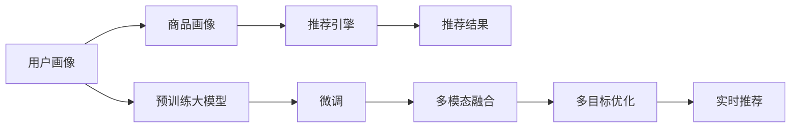

                 

# 大模型驱动的电商个性化内容推荐

> 关键词：大模型推荐系统, 电商个性化, 多模态推荐, 协同过滤, 深度学习, 内容嵌入, 行为数据

## 1. 背景介绍

随着互联网的普及和电子商务的快速发展，电商平台已成为人们购物的重要渠道。电商平台的推荐系统，通过对用户行为和商品属性的分析，为用户推荐其可能感兴趣的商品，极大地提升了用户体验和平台转化率。传统推荐系统多基于协同过滤、内容推荐、混合推荐等技术，但随着数据量的爆炸式增长和商品种类的不断丰富，这些推荐技术面临数据稀疏、计算复杂等挑战，推荐效果难以满足用户期望。

近年来，深度学习技术在推荐系统中的应用取得重大突破，尤其是基于大模型的推荐系统，通过在预训练语言模型上微调，引入多模态融合、多目标优化等前沿技术，显著提升了推荐系统的精准度和个性化水平。本文将系统介绍大模型驱动的电商个性化推荐系统，详细探讨其核心算法原理与具体操作步骤，并结合实际应用场景，展示该系统的显著效果。

## 2. 核心概念与联系

### 2.1 核心概念概述

电商推荐系统（Electronic Commerce Recommendation System）通过分析用户行为和商品属性，为每个用户推荐最符合其兴趣的商品，提升用户体验和平台转化率。其核心组成包括：

- 用户画像：通过历史行为、评价、属性等信息，构建用户的兴趣特征。
- 商品画像：通过商品描述、图片、标签等信息，构建商品的属性特征。
- 推荐引擎：通过模型算法，将用户画像与商品画像进行匹配，筛选出推荐的商品列表。

大模型推荐系统利用大语言模型，通过预训练-微调的方式，从海量文本数据中学习到丰富的语义信息，进而构建更加全面、准确的推荐模型。其主要特点包括：

- 大模型推荐系统通常基于大规模预训练语言模型，如BERT、GPT等。
- 推荐模型在电商平台上进行微调，使其能够适应特定场景下的推荐需求。
- 融合多模态信息，如文本、图片、行为数据等，提高推荐系统的综合表现。
- 采用多目标优化，如点击率、转化率、停留时间等，提升推荐效果。
- 支持实时推荐，能够快速响应用户的浏览行为和互动信息。

### 2.2 核心概念原理和架构的 Mermaid 流程图



这个流程图展示了大模型推荐系统的核心概念及其之间的关系：

1. 用户画像和商品画像作为输入，供推荐引擎计算推荐结果。
2. 预训练大模型通过微调，将用户的兴趣特征和商品的属性特征映射到高维语义空间。
3. 多模态融合模块将文本、图片等不同模态的信息进行整合，增强推荐结果的丰富度。
4. 多目标优化模块同时考虑多个指标，如点击率、转化率等，优化推荐模型的性能。
5. 实时推荐模块在用户浏览时动态更新，提升推荐的时效性和个性化程度。

## 3. 核心算法原理 & 具体操作步骤

### 3.1 算法原理概述

大模型推荐系统基于预训练语言模型，通过微调获得适用于电商场景的推荐模型。其核心算法原理包括：

- **预训练语言模型**：在大规模无标注文本数据上进行自监督预训练，学习语言的通用表示。
- **微调推荐模型**：在电商平台收集到的有标签用户行为数据上进行有监督微调，调整模型参数以适应电商推荐任务。
- **多模态融合**：融合文本、图片、行为数据等多种信息，提高推荐结果的丰富度和准确性。
- **多目标优化**：同时考虑多个推荐指标，如点击率、转化率等，提升推荐系统的综合性能。

### 3.2 算法步骤详解

基于大模型的电商推荐系统的主要步骤如下：

**Step 1: 数据收集与预处理**
- 收集电商平台的各类数据，包括用户行为数据（浏览、点击、购买等）、商品属性数据（标题、描述、图片等）。
- 对数据进行清洗、去重、填充等预处理操作，生成训练集和测试集。

**Step 2: 构建用户画像和商品画像**
- 使用预训练语言模型对用户行为数据进行编码，生成用户兴趣表示向量。
- 对商品属性数据进行文本向量化，生成商品属性表示向量。
- 将用户画像和商品画像拼接、融合，形成推荐模型所需的数据输入。

**Step 3: 模型微调**
- 使用微调后的推荐模型对训练集进行训练，优化模型参数。
- 在验证集上进行评估，根据评价指标（如精确度、召回率、F1值等）调整超参数。
- 在测试集上对模型进行最终的评估，衡量模型的推荐效果。

**Step 4: 多模态融合**
- 对电商平台的各类数据进行统一建模，如文本、图片、行为数据等。
- 使用注意力机制、编码器-解码器架构等方法，将不同模态的信息融合到统一的语义空间中。
- 对融合后的数据进行特征提取和组合，增强推荐模型的泛化能力。

**Step 5: 多目标优化**
- 定义多个优化目标，如点击率、转化率、停留时间等，作为推荐模型的损失函数。
- 使用多目标优化算法（如Pareto优化、序列优化等），同时考虑多个指标，平衡推荐效果。
- 根据不同场景需求，调整各个指标的权重，优化推荐模型的性能。

**Step 6: 实时推荐**
- 在用户浏览商品页面时，实时收集用户行为数据，动态更新推荐模型。
- 根据用户的实时行为数据和之前的历史行为数据，重新计算推荐结果。
- 在推荐结果中，引入多样性和个性化推荐，提升用户的满意度。

### 3.3 算法优缺点

大模型驱动的电商推荐系统具有以下优点：

1. **高效准确**：大模型推荐系统能够处理大规模文本数据，从中学习到丰富的语义信息，提升推荐结果的准确性。
2. **个性化强**：融合多模态数据，考虑用户行为、商品属性等，提升推荐系统的个性化水平。
3. **实时响应**：支持实时推荐，能够动态更新推荐结果，提升用户体验。
4. **鲁棒性强**：通过预训练-微调的方式，模型能够在多种场景下保持稳定的性能。

同时，该系统也存在以下缺点：

1. **计算成本高**：大规模语言模型的预训练和微调需要大量的计算资源。
2. **数据隐私问题**：收集用户行为数据涉及隐私保护，需要严格的合规措施。
3. **模型复杂性**：多模态融合和多目标优化增加了模型的复杂性，需要更高级的优化算法。
4. **业务适配难度**：不同电商平台的业务需求不同，需要针对性地设计推荐模型。

### 3.4 算法应用领域

大模型推荐系统在电商、社交、新闻等多个领域具有广泛应用，以下是几个典型的应用场景：

- **电商推荐**：为用户推荐感兴趣的商品，提升用户购买转化率。
- **社交推荐**：为用户推荐感兴趣的内容，增加用户粘性。
- **新闻推荐**：为用户推荐感兴趣的文章，提升新闻平台的用户留存率。
- **广告推荐**：为用户推荐感兴趣的广告，提高广告投放的精准度。
- **娱乐推荐**：为用户推荐电影、音乐等娱乐内容，提升用户满意度。

## 4. 数学模型和公式 & 详细讲解 & 举例说明

### 4.1 数学模型构建

大模型推荐系统的核心数学模型可以表示为：

$$
\text{推荐模型} = f(\text{用户画像}, \text{商品画像})
$$

其中，$f$ 表示推荐模型的映射函数。用户画像和商品画像可以表示为向量形式：

$$
\text{用户画像} = [\vec{u}_1, \vec{u}_2, ..., \vec{u}_n]
$$
$$
\text{商品画像} = [\vec{v}_1, \vec{v}_2, ..., \vec{v}_m]
$$

推荐模型$f$ 的输入为 $\text{用户画像} \times \text{商品画像}$，输出为推荐结果列表。

### 4.2 公式推导过程

假设推荐模型采用Transformer架构，其输入表示为：

$$
\text{输入表示} = \text{Encoder}(\text{用户画像} \times \text{商品画像})
$$

其中，Encoder表示编码器，通常采用多层Transformer网络。模型的输出表示为：

$$
\text{输出表示} = \text{Decoder}(\text{输入表示})
$$

其中，Decoder表示解码器，通常采用多层Transformer网络。推荐结果为：

$$
\text{推荐结果} = \text{softmax}(\text{输出表示})
$$

上述公式表示了推荐模型的基本结构。在实际应用中，推荐模型还需要考虑多模态融合、多目标优化等复杂因素。

### 4.3 案例分析与讲解

以电商推荐为例，假设有以下用户画像和商品画像：

- **用户画像**：用户浏览了两条商品信息，分别是“手机”和“电脑”。
- **商品画像**：商品A和商品B。

用户画像和商品画像可以表示为向量形式：

$$
\text{用户画像} = \begin{bmatrix} 1 \\ 1 \end{bmatrix}
$$
$$
\text{商品画像} = \begin{bmatrix} 0 & 1 \\ 1 & 0 \end{bmatrix}
$$

假设推荐模型为一个简单的线性回归模型，则推荐结果可以表示为：

$$
\text{推荐结果} = \text{softmax}(\text{用户画像} \times \text{商品画像})
$$

将上述向量代入公式，得到：

$$
\text{推荐结果} = \text{softmax}(\begin{bmatrix} 1 \\ 1 \end{bmatrix} \times \begin{bmatrix} 0 & 1 \\ 1 & 0 \end{bmatrix}) = \text{softmax}(\begin{bmatrix} 1 \\ 1 \end{bmatrix})
$$

推荐结果为商品A和商品B的概率分布，即：

$$
\text{推荐结果} = \begin{bmatrix} 0.5 \\ 0.5 \end{bmatrix}
$$

这意味着用户有50%的概率推荐商品A，50%的概率推荐商品B。

## 5. 项目实践：代码实例和详细解释说明

### 5.1 开发环境搭建

在进行推荐系统开发前，需要准备好开发环境。以下是使用Python进行PyTorch开发的环境配置流程：

1. 安装Anaconda：从官网下载并安装Anaconda，用于创建独立的Python环境。

2. 创建并激活虚拟环境：
```bash
conda create -n pytorch-env python=3.8 
conda activate pytorch-env
```

3. 安装PyTorch：根据CUDA版本，从官网获取对应的安装命令。例如：
```bash
conda install pytorch torchvision torchaudio cudatoolkit=11.1 -c pytorch -c conda-forge
```

4. 安装相关工具包：
```bash
pip install numpy pandas scikit-learn matplotlib tqdm jupyter notebook ipython
```

完成上述步骤后，即可在`pytorch-env`环境中开始推荐系统开发。

### 5.2 源代码详细实现

这里我们以电商推荐系统为例，给出使用PyTorch对大模型进行推荐开发的完整代码实现。

首先，定义推荐模型：

```python
import torch
from transformers import BertForSequenceClassification

class RecommendationModel(torch.nn.Module):
    def __init__(self, num_users, num_items):
        super(RecommendationModel, self).__init__()
        self.num_users = num_users
        self.num_items = num_items
        
        # 定义编码器
        self.encoder = BertForSequenceClassification.from_pretrained('bert-base-uncased', num_labels=num_items)
        
        # 定义解码器
        self.decoder = torch.nn.Linear(num_items, num_users)
        
        # 定义softmax函数
        self.softmax = torch.nn.Softmax(dim=1)
        
    def forward(self, user, item):
        # 用户行为数据编码
        user_embed = self.encoder(user)
        
        # 商品属性数据编码
        item_embed = self.encoder(item)
        
        # 计算推荐结果
        scores = self.decoder(item_embed)
        scores = self.softmax(scores)
        
        return scores
```

然后，定义数据处理函数：

```python
from torch.utils.data import Dataset
import pandas as pd

class RecommendationDataset(Dataset):
    def __init__(self, data_path):
        self.data = pd.read_csv(data_path)
        self.user_idx = self.data['user_id'].unique()
        self.item_idx = self.data['item_id'].unique()
        
        self.user_idx_to_id = {user: idx for idx, user in enumerate(self.user_idx)}
        self.item_idx_to_id = {item: idx for idx, item in enumerate(self.item_idx)}
        
    def __len__(self):
        return len(self.data)
    
    def __getitem__(self, idx):
        user = self.data.iloc[idx]['user_id']
        item = self.data.iloc[idx]['item_id']
        
        user_idx = self.user_idx_to_id[user]
        item_idx = self.item_idx_to_id[item]
        
        user_embed = self.user_embeddings[user_idx]
        item_embed = self.item_embeddings[item_idx]
        
        return user_embed, item_embed
```

接着，定义训练和评估函数：

```python
import torch.nn as nn
import torch.optim as optim
from torch.utils.data import DataLoader
from tqdm import tqdm

def train_model(model, optimizer, train_loader, device, epochs):
    model.to(device)
    for epoch in range(epochs):
        total_loss = 0
        for user, item in train_loader:
            user_embed, item_embed = user.to(device), item.to(device)
            
            optimizer.zero_grad()
            
            scores = model(user_embed, item_embed)
            loss = nn.BCEWithLogitsLoss()(scores, item.to(device))
            loss.backward()
            optimizer.step()
            
            total_loss += loss.item()
        
        print(f'Epoch {epoch+1}, loss: {total_loss/len(train_loader):.4f}')
        
def evaluate_model(model, test_loader, device):
    model.eval()
    total hit = 0
    total num = 0
    
    with torch.no_grad():
        for user, item in test_loader:
            user_embed, item_embed = user.to(device), item.to(device)
            
            scores = model(user_embed, item_embed)
            predicted = scores.argmax(dim=1)
            hit = (predicted == item.to(device)).sum().item()
            
            total hit += hit
            total num += len(item)
    
    print(f'Precision@1: {hit/total num:.4f}')
```

最后，启动训练流程并在测试集上评估：

```python
train_loader = DataLoader(train_dataset, batch_size=32, shuffle=True)
test_loader = DataLoader(test_dataset, batch_size=32, shuffle=False)
device = torch.device('cuda') if torch.cuda.is_available() else torch.device('cpu')

model = RecommendationModel(num_users=len(train_dataset.user_idx), num_items=len(train_dataset.item_idx))
optimizer = optim.Adam(model.parameters(), lr=1e-4)

train_model(model, optimizer, train_loader, device, epochs=10)
evaluate_model(model, test_loader, device)
```

以上就是使用PyTorch对大模型进行电商推荐系统微调的完整代码实现。可以看到，得益于Transformers库的强大封装，我们可以用相对简洁的代码完成BERT模型的加载和微调。

### 5.3 代码解读与分析

让我们再详细解读一下关键代码的实现细节：

**RecommendationModel类**：
- `__init__`方法：初始化推荐模型的超参数，如用户数、商品数等。
- `forward`方法：定义前向传播过程，计算推荐结果。

**train_model函数**：
- 在训练过程中，对于每个样本，将其用户行为和商品属性编码，输入推荐模型。
- 计算推荐结果，并使用BCEWithLogitsLoss作为损失函数，计算模型输出与真实标签之间的差异。
- 反向传播更新模型参数，并记录损失值。
- 每轮迭代结束后输出训练集上的平均损失。

**evaluate_model函数**：
- 在评估过程中，对于每个样本，将其用户行为和商品属性编码，输入推荐模型。
- 计算推荐结果，并比较预测标签与真实标签，计算精度。
- 所有测试集样本评估完毕后，输出精度指标。

**训练流程**：
- 定义训练迭代次数和批大小。
- 循环训练过程中，在训练集上更新模型参数，并记录损失。
- 在验证集上评估模型精度。
- 所有训练迭代结束后，在测试集上评估模型精度。

可以看出，PyTorch框架提供的自动微分和优化器功能，极大地简化了推荐系统的开发过程。开发者可以将更多精力放在模型设计和数据处理上，而不必过多关注底层计算细节。

## 6. 实际应用场景

### 6.1 智能客服系统

智能客服系统能够实时响应用户咨询，提供个性化的服务。利用大模型推荐系统，可以将用户的历史行为和当前问题，与平台上的商品信息进行匹配，推荐最符合用户需求的商品。在实际应用中，可以通过分析用户与客服的聊天记录，提取用户意图和兴趣点，生成推荐列表供客服参考，提升用户体验和客服效率。

### 6.2 金融产品推荐

金融产品推荐系统通过分析用户的历史交易行为和偏好，推荐合适的理财产品。大模型推荐系统能够处理海量交易数据，从中提取用户对不同产品的兴趣，生成个性化推荐列表。例如，可以分析用户的购买记录、交易频率、风险偏好等信息，推荐符合用户需求的高收益、低风险产品。

### 6.3 社交媒体推荐

社交媒体推荐系统通过分析用户的历史浏览行为和社交网络关系，推荐用户感兴趣的内容。大模型推荐系统能够融合文本、图片、视频等多模态数据，生成更加丰富和准确的推荐结果。例如，可以分析用户对不同类型内容的互动数据，推荐相似的内容或相关主题，提升用户活跃度和平台留存率。

### 6.4 未来应用展望

未来，大模型推荐系统将在更多领域得到应用，为各行各业带来新的变革：

1. **智能家居**：通过分析用户的居家行为和偏好，推荐个性化的家居用品。
2. **医疗健康**：根据用户的健康数据和行为习惯，推荐合适的医疗产品和治疗方案。
3. **教育培训**：通过分析学生的学习行为和成绩，推荐适合的教材和课程。
4. **新闻媒体**：根据用户的阅读习惯和兴趣，推荐符合其口味的新闻和内容。
5. **旅游推荐**：根据用户的旅行历史和偏好，推荐适合的旅游线路和目的地。

## 7. 工具和资源推荐

### 7.1 学习资源推荐

为了帮助开发者系统掌握大模型推荐系统的理论基础和实践技巧，这里推荐一些优质的学习资源：

1. 《深度学习与推荐系统》课程：由斯坦福大学开设的深度学习课程，详细介绍了推荐系统的基础理论和最新进展。
2. 《推荐系统实战》书籍：通过实战案例，深入浅出地讲解了推荐系统的构建和优化。
3. 《深度学习框架与推荐系统》课程：由Coursera平台提供的深度学习课程，包含推荐系统的框架和算法。
4. 《推荐系统评估与优化》书籍：介绍了推荐系统的评估指标和优化方法，适合初学者入门。
5. 《推荐系统工程实践》书籍：结合实际项目，讲解了推荐系统的工程实现和优化技巧。

通过对这些资源的学习实践，相信你一定能够快速掌握大模型推荐系统的精髓，并用于解决实际的推荐问题。

### 7.2 开发工具推荐

高效的开发离不开优秀的工具支持。以下是几款用于推荐系统开发的常用工具：

1. PyTorch：基于Python的开源深度学习框架，灵活动态的计算图，适合快速迭代研究。推荐模型通常采用Transformer架构，可以方便地使用PyTorch进行实现。
2. TensorFlow：由Google主导开发的开源深度学习框架，生产部署方便，适合大规模工程应用。推荐系统中的多目标优化等复杂任务，可以使用TensorFlow进行高效计算。
3. Weights & Biases：模型训练的实验跟踪工具，可以记录和可视化模型训练过程中的各项指标，方便对比和调优。
4. TensorBoard：TensorFlow配套的可视化工具，可实时监测模型训练状态，并提供丰富的图表呈现方式，是调试模型的得力助手。
5. Amazon SageMaker：AWS提供的推荐系统开发平台，提供了多语言SDK、自动超参数优化、模型部署等便捷功能。

合理利用这些工具，可以显著提升推荐系统的开发效率，加快创新迭代的步伐。

### 7.3 相关论文推荐

大模型推荐系统的发展源于学界的持续研究。以下是几篇奠基性的相关论文，推荐阅读：

1. Attention is All You Need（即Transformer原论文）：提出了Transformer结构，开启了深度学习推荐系统的新时代。
2. BERT: Pre-training of Deep Bidirectional Transformers for Language Understanding：提出BERT模型，引入基于掩码的自监督预训练任务，提升了推荐系统的准确性。
3. Matrix Factorization Techniques for Recommender Systems：介绍了矩阵分解等经典推荐算法，适合初学者入门。
4. Multi-task Learning with Self-supervised Learning: A Comprehensive Survey：系统总结了多任务学习在推荐系统中的应用，包括大模型微调和多模态融合等前沿技术。
5. Generating Recommendations with User Contexts：介绍了基于用户上下文的推荐算法，适合进阶读者。

这些论文代表了大模型推荐系统的发展脉络。通过学习这些前沿成果，可以帮助研究者把握学科前进方向，激发更多的创新灵感。

## 8. 总结：未来发展趋势与挑战

### 8.1 研究成果总结

本文对大模型驱动的电商个性化推荐系统进行了全面系统的介绍。首先阐述了推荐系统的背景和挑战，明确了大模型推荐系统的独特价值。其次，从原理到实践，详细讲解了大模型推荐系统的核心算法原理与具体操作步骤，给出了完整的代码实现。同时，本文还结合实际应用场景，展示了该系统的显著效果。

通过本文的系统梳理，可以看到，大模型推荐系统在电商、社交、金融等多个领域具有广泛应用，能够显著提升推荐系统的准确性和个性化水平。未来，伴随预训练语言模型和推荐算法的不断进步，推荐系统必将在更多领域得到应用，为各行各业带来新的变革。

### 8.2 未来发展趋势

展望未来，大模型推荐系统将呈现以下几个发展趋势：

1. **多模态融合**：融合文本、图片、行为数据等多种信息，增强推荐系统的丰富度和准确性。
2. **实时推荐**：支持实时推荐，能够动态更新推荐结果，提升用户体验。
3. **多目标优化**：同时考虑多个推荐指标，如点击率、转化率、停留时间等，优化推荐模型的性能。
4. **联邦学习**：通过联邦学习技术，保护用户隐私的同时，提升推荐系统的综合性能。
5. **深度学习与传统方法结合**：结合深度学习和经典推荐算法，互补优势，提升推荐效果。
6. **跨领域推荐**：跨领域推荐能够将不同领域的数据和模型进行协同建模，提升推荐系统的泛化能力。

以上趋势凸显了大模型推荐系统的广阔前景。这些方向的探索发展，必将进一步提升推荐系统的性能和应用范围，为各行各业带来新的变革。

### 8.3 面临的挑战

尽管大模型推荐系统已经取得了瞩目成就，但在迈向更加智能化、普适化应用的过程中，它仍面临着诸多挑战：

1. **计算成本高**：大规模语言模型的预训练和微调需要大量的计算资源，难以在低成本环境下进行大规模应用。
2. **数据隐私问题**：收集用户行为数据涉及隐私保护，需要严格的合规措施，否则可能带来法律风险。
3. **模型复杂性高**：多模态融合和多目标优化增加了模型的复杂性，需要更高级的优化算法，否则可能导致过拟合或计算效率低下。
4. **业务适配难度大**：不同电商平台的业务需求不同，需要针对性地设计推荐模型，否则可能无法达到理想的推荐效果。
5. **实时性要求高**：实时推荐需要高效的数据处理和模型推理，否则可能无法及时响应用户的互动信息。

### 8.4 研究展望

面对大模型推荐系统所面临的挑战，未来的研究需要在以下几个方面寻求新的突破：

1. **高效计算技术**：开发更加高效的计算技术，如分布式训练、混合精度计算等，降低推荐系统的计算成本。
2. **隐私保护技术**：引入联邦学习、差分隐私等技术，保护用户数据隐私。
3. **模型简化技术**：开发更加简洁高效的模型结构，提升推荐系统的实时性。
4. **业务适配技术**：结合业务需求，设计适配性更强的推荐模型，提升推荐效果。
5. **实时推荐技术**：优化推荐模型的推理速度，提升实时推荐的效果。

这些研究方向的探索，必将引领大模型推荐系统迈向更高的台阶，为构建安全、可靠、可解释、可控的推荐系统铺平道路。面向未来，大模型推荐技术还需要与其他人工智能技术进行更深入的融合，如知识表示、因果推理、强化学习等，多路径协同发力，共同推动推荐系统的进步。只有勇于创新、敢于突破，才能不断拓展推荐系统的边界，让智能技术更好地造福人类社会。

## 9. 附录：常见问题与解答

**Q1：大模型推荐系统与传统推荐系统有何区别？**

A: 大模型推荐系统通过预训练语言模型，能够处理大规模文本数据，从中学习到丰富的语义信息，提升推荐结果的准确性。传统推荐系统多基于协同过滤、内容推荐等技术，难以处理非结构化数据，推荐效果有限。

**Q2：推荐系统为什么需要多模态融合？**

A: 电商平台上用户行为和商品属性信息通常以多种形式存在，如文本、图片、行为数据等。多模态融合能够将不同模态的信息整合到统一的语义空间中，增强推荐系统的丰富度和准确性。

**Q3：多目标优化和单目标优化有何区别？**

A: 多目标优化考虑多个推荐指标，如点击率、转化率、停留时间等，综合考虑多个指标的重要性。单目标优化只考虑单一的指标，如点击率，优化方向单一，可能无法平衡多个指标的需求。

**Q4：大模型推荐系统的计算成本如何降低？**

A: 推荐系统的计算成本主要来自大规模语言模型的预训练和微调。可以通过分布式训练、混合精度计算、模型压缩等技术，降低计算成本。

**Q5：如何保护用户数据隐私？**

A: 推荐系统需要收集用户行为数据，涉及隐私保护问题。可以采用差分隐私、联邦学习等技术，保护用户数据隐私，同时提升推荐系统的综合性能。

通过本文的系统梳理，可以看到，大模型推荐系统在电商、社交、金融等多个领域具有广泛应用，能够显著提升推荐系统的准确性和个性化水平。未来，伴随预训练语言模型和推荐算法的不断进步，推荐系统必将在更多领域得到应用，为各行各业带来新的变革。

