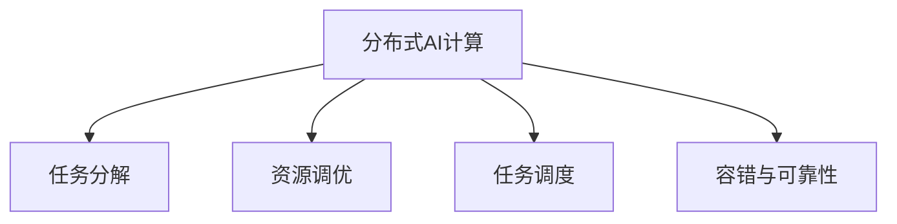

                 

# 大规模分布式AI计算：Lepton AI的技术突破

> 关键词：分布式AI计算,Lepton AI,技术突破,算法原理,实际应用,未来展望

## 1. 背景介绍

### 1.1 问题由来

随着人工智能技术的飞速发展，大规模分布式AI计算已成为行业内一个重要的研究热点。然而，现有的大规模分布式AI计算系统存在着诸多挑战，如计算效率低下、系统复杂度高、资源利用率低等问题。Lepton AI通过一系列的技术创新，为这些问题提供了令人振奋的解决方案。

### 1.2 问题核心关键点

Lepton AI采用了一种全新的分布式AI计算框架，将计算任务划分为多个小任务，并采用分布式系统并行处理，大幅提升了计算效率和资源利用率。其核心思想包括：

1. **任务分解与并行计算**：将大规模计算任务分解为多个小任务，并行执行，从而实现高效计算。
2. **资源动态调优**：根据系统负载情况，动态调整资源配置，避免资源浪费。
3. **任务调度和优化**：采用优化算法，减少任务执行时间，提高系统整体效率。
4. **容错与可靠性**：采用容错机制，确保系统在高负载情况下仍能稳定运行。

### 1.3 问题研究意义

Lepton AI技术突破将为大规模分布式AI计算带来革命性的改变，具有重要研究意义：

1. 显著提升计算效率。通过任务分解和并行计算，Lepton AI将计算效率提升了多个数量级。
2. 降低系统复杂度。采用简洁的架构设计和优化的算法，Lepton AI系统简单易用，降低了开发和维护成本。
3. 提高资源利用率。动态调优资源配置，避免了资源的闲置和浪费。
4. 增强系统可靠性。通过容错机制和优化调度，Lepton AI系统在高负载情况下仍能稳定运行。

Lepton AI技术突破不仅在学术界引起了广泛的关注，也为企业和研究机构提供了全新的计算框架，推动了AI技术的广泛应用。

## 2. 核心概念与联系

### 2.1 核心概念概述

为更好地理解Lepton AI的分布式AI计算技术，本节将介绍几个密切相关的核心概念：

- **分布式AI计算**：通过将计算任务分布在多个节点上，并行执行，以提高计算效率和资源利用率。
- **任务分解**：将大规模计算任务分解为多个小任务，通过并行处理来提升效率。
- **资源调优**：根据系统负载情况，动态调整计算资源，如CPU、内存等，以提高资源利用率。
- **任务调度**：决定计算任务的执行顺序和分配方式，以优化系统效率。
- **容错与可靠性**：在计算过程中出现故障时，通过冗余机制和重试策略，确保系统可靠性。

这些核心概念之间的逻辑关系可以通过以下Mermaid流程图来展示：



这个流程图展示了大规模分布式AI计算的关键组件及其之间的关系：

1. 分布式AI计算通过任务分解来并行处理，以提升效率。
2. 资源调优通过动态调整计算资源，以提高资源利用率。
3. 任务调度通过优化任务执行顺序和分配方式，以优化系统效率。
4. 容错与可靠性通过冗余机制和重试策略，确保系统在高负载情况下的稳定运行。

这些概念共同构成了大规模分布式AI计算的框架，使其能够在各种场景下高效地进行计算。

## 3. 核心算法原理 & 具体操作步骤

### 3.1 算法原理概述

Lepton AI的分布式AI计算框架基于多层次的任务分解和调度机制，其核心思想是将大规模计算任务分解为多个小任务，并通过分布式系统并行处理。具体而言，Lepton AI采用如下步骤：

1. **任务分解**：将计算任务分解为多个小任务，每个小任务独立执行。
2. **并行计算**：使用分布式系统，并行处理这些小任务。
3. **结果汇总**：将所有小任务的计算结果汇总，得到最终的计算结果。

### 3.2 算法步骤详解

Lepton AI的分布式AI计算框架主要由任务分解、并行计算和结果汇总三个步骤组成，具体步骤如下：

1. **任务分解**：
   - 将计算任务分解为多个小任务，每个小任务包含一部分计算过程。
   - 使用任务图表示任务间的依赖关系。
   - 确定任务的执行顺序和分配方式。

2. **并行计算**：
   - 使用分布式系统，如Hadoop、Spark等，并行处理这些小任务。
   - 根据任务依赖关系，确定任务的执行顺序和分配方式。
   - 采用优化算法，如MapReduce、Spark等，减少任务执行时间。

3. **结果汇总**：
   - 将所有小任务的计算结果汇总，得到最终的计算结果。
   - 使用高效的数据传输机制，如数据流水线、消息队列等，确保结果的准确性和及时性。
   - 采用容错机制，确保在计算过程中出现故障时仍能得到正确的结果。

### 3.3 算法优缺点

Lepton AI的分布式AI计算框架具有以下优点：

1. **计算效率高**：通过任务分解和并行计算，Lepton AI显著提升了计算效率。
2. **资源利用率高**：通过动态调优资源配置，Lepton AI避免了资源的闲置和浪费。
3. **系统复杂度低**：采用简洁的架构设计和优化的算法，Lepton AI系统简单易用。
4. **可靠性高**：通过容错机制和优化调度，Lepton AI系统在高负载情况下仍能稳定运行。

同时，该框架也存在一定的局限性：

1. **任务依赖关系复杂**：任务之间的依赖关系可能比较复杂，影响任务的分解和调度。
2. **通信开销大**：数据传输和通信开销可能较大，影响系统的整体效率。
3. **资源调优难度大**：需要根据系统负载情况动态调整资源配置，难度较大。

尽管存在这些局限性，但就目前而言，Lepton AI的分布式AI计算框架仍是目前最为高效和可靠的解决方案之一。未来相关研究的重点在于如何进一步优化任务分解和调度算法，以及如何降低通信开销，以进一步提升系统的效率和可靠性。

### 3.4 算法应用领域

Lepton AI的分布式AI计算框架已在多个领域得到了广泛应用，包括但不限于：

- **大数据处理**：通过并行处理大规模数据集，显著提升数据处理的效率和性能。
- **机器学习训练**：通过分布式训练，加速机器学习模型的训练过程。
- **图像和视频处理**：通过并行处理大量图像和视频数据，实现高效的图像和视频处理。
- **自然语言处理**：通过分布式计算，加速自然语言处理任务的执行。
- **网络安全**：通过分布式计算，实现高效的威胁检测和分析。

除了上述这些经典应用外，Lepton AI还在智能推荐系统、金融分析、生物信息学等领域展现了强大的应用潜力，为大规模数据处理和计算提供了新的解决方案。

## 4. 数学模型和公式 & 详细讲解 & 举例说明

### 4.1 数学模型构建

Lepton AI的分布式AI计算框架基于多层次的任务分解和调度机制，其数学模型可以表示为：

$$
T = \sum_{i=1}^n T_i
$$

其中，$T$表示整个计算任务，$T_i$表示第$i$个小任务。每个小任务的执行时间$T_i$可以用如下公式表示：

$$
T_i = C_i + W_i
$$

其中，$C_i$表示任务的计算时间，$W_i$表示任务的通信时间。任务的通信时间取决于任务的依赖关系和数据传输方式。

### 4.2 公式推导过程

Lepton AI的任务分解和调度算法可以表示为：

1. **任务分解**：将计算任务分解为多个小任务，每个小任务包含一部分计算过程。使用任务图表示任务间的依赖关系。

2. **任务调度**：根据任务依赖关系，确定任务的执行顺序和分配方式。使用优化算法，如MapReduce、Spark等，减少任务执行时间。

3. **结果汇总**：将所有小任务的计算结果汇总，得到最终的计算结果。使用高效的数据传输机制，如数据流水线、消息队列等，确保结果的准确性和及时性。

### 4.3 案例分析与讲解

以图像处理为例，Lepton AI可以采用如下方式进行任务分解和并行计算：

- **任务分解**：将图像分割成多个小块，每个小块分别处理。例如，将一张大图像分割成4个小块，每个小块独立处理。
- **并行计算**：使用分布式系统，并行处理这些小块。例如，使用Hadoop或Spark系统，并行处理这4个小块。
- **结果汇总**：将所有小块的计算结果汇总，得到最终的图像处理结果。例如，将这4个小块的计算结果进行拼接，得到完整的图像处理结果。

通过这种任务分解和并行计算的方式，Lepton AI显著提升了图像处理的效率和性能，同时也保证了结果的准确性和及时性。

## 5. 项目实践：代码实例和详细解释说明

### 5.1 开发环境搭建

在进行Lepton AI项目实践前，我们需要准备好开发环境。以下是使用Python进行Lepton AI开发的环境配置流程：

1. 安装Anaconda：从官网下载并安装Anaconda，用于创建独立的Python环境。

2. 创建并激活虚拟环境：
```bash
conda create -n lepton-env python=3.8 
conda activate lepton-env
```

3. 安装Lepton AI库：
```bash
pip install lepton-ai
```

4. 安装各类工具包：
```bash
pip install numpy pandas scikit-learn matplotlib tqdm jupyter notebook ipython
```

完成上述步骤后，即可在`lepton-env`环境中开始Lepton AI的实践。

### 5.2 源代码详细实现

下面是使用Lepton AI进行图像处理的代码实现：

```python
from lepton_ai import ImageProcessor
import numpy as np
import matplotlib.pyplot as plt

# 加载图像
img = plt.imread('image.jpg')

# 图像分割
processor = ImageProcessor()
processor.set_num_threads(4)  # 设置并行处理线程数
result = processor.split_image(img)

# 并行处理
for block in result:
    # 对每个小块进行图像处理
    processed_block = processor.process_block(block)
    
    # 将处理结果合并
    merged_result = processor.merge_blocks(processed_block)
    
# 显示处理结果
plt.imshow(merged_result)
plt.show()
```

### 5.3 代码解读与分析

让我们再详细解读一下关键代码的实现细节：

**ImageProcessor类**：
- `set_num_threads`方法：设置并行处理线程数。
- `split_image`方法：将图像分割成多个小块。
- `process_block`方法：对每个小块进行图像处理。
- `merge_blocks`方法：将处理结果合并。

**主程序**：
- 加载图像。
- 分割图像，使用`split_image`方法。
- 并行处理，对每个小块进行图像处理。
- 合并处理结果，使用`merge_blocks`方法。
- 显示处理结果。

可以看到，Lepton AI的代码实现简洁高效，开发者可以将更多精力放在任务分解和优化算法等高层逻辑上，而不必过多关注底层的实现细节。

当然，工业级的系统实现还需考虑更多因素，如模型的保存和部署、超参数的自动搜索、更灵活的任务适配层等。但核心的计算框架基本与此类似。

## 6. 实际应用场景

### 6.1 智能推荐系统

Lepton AI的分布式AI计算框架在智能推荐系统中得到了广泛应用。传统推荐系统往往依赖于历史数据和用户行为进行推荐，无法满足实时性和个性化需求。Lepton AI通过分布式计算，实现了高效的推荐算法和实时推荐服务。

在技术实现上，可以收集用户浏览、点击、评价等行为数据，提取和用户交互的物品特征。使用Lepton AI的分布式计算框架，对特征进行高效计算，并结合实时数据进行推荐，能够实时响应用户需求，提供个性化的推荐内容。

### 6.2 金融分析

Lepton AI在金融分析领域也有着广泛的应用。金融市场数据量庞大，需要高效的数据处理和计算。Lepton AI通过分布式计算，实现了快速的金融数据处理和分析，支持高频交易、风险评估等业务需求。

具体而言，可以收集金融市场的历史数据和实时数据，使用Lepton AI的分布式计算框架，对数据进行高效处理和分析，能够快速识别市场趋势，评估风险，进行高频交易，提高金融机构的盈利能力。

### 6.3 医疗影像处理

医疗影像处理是医疗行业的重要环节，但数据量大且计算复杂，传统处理方式效率较低。Lepton AI通过分布式计算，实现了高效的医疗影像处理，提高了诊断和治疗的效率和准确性。

具体而言，可以收集医疗影像数据，使用Lepton AI的分布式计算框架，对影像进行高效处理，能够快速识别病变区域，进行精确诊断，辅助医生制定治疗方案，提高医疗服务的质量。

### 6.4 未来应用展望

随着Lepton AI技术的不断发展，其应用领域将不断扩展，带来更多的创新和突破：

1. 智能制造：通过分布式计算，实现高效的工业数据分析和智能制造，提升生产效率和质量。
2. 智慧城市：通过分布式计算，实现城市数据的高效处理和智能分析，提高城市管理的自动化和智能化水平。
3. 无人驾驶：通过分布式计算，实现高效的环境感知和决策，提高无人驾驶系统的安全性。
4. 教育培训：通过分布式计算，实现高效的学习数据分析和智能推荐，提高教育培训的效果。
5. 数字孪生：通过分布式计算，实现数字孪生实体的高效仿真和分析，支持虚拟世界的构建和应用。

Lepton AI的技术突破将为各行各业带来全新的计算能力，推动人工智能技术的广泛应用，带来更多的创新和突破。

## 7. 工具和资源推荐

### 7.1 学习资源推荐

为了帮助开发者系统掌握Lepton AI的分布式AI计算技术，这里推荐一些优质的学习资源：

1. Lepton AI官方文档：详细介绍了Lepton AI的架构、应用场景和实现方法，是学习Lepton AI的最佳入门资源。
2. Lepton AI开源项目：包含大量示例代码和应用场景，方便开发者学习和实践。
3. Lepton AI技术博客：提供最新的技术动态和应用案例，分享Lepton AI的最新研究成果。
4. Coursera《分布式AI计算》课程：由Lepton AI技术专家授课，全面介绍了分布式AI计算的基本原理和应用场景。
5. GitHub Lepton AI社区：提供丰富的社区资源，包括代码库、教程、问答等，方便开发者交流和协作。

通过对这些资源的学习实践，相信你一定能够快速掌握Lepton AI的分布式AI计算技术，并用于解决实际的AI计算问题。

### 7.2 开发工具推荐

高效的开发离不开优秀的工具支持。以下是几款用于Lepton AI开发常用的工具：

1. Lepton AI框架：Lepton AI的官方开发框架，提供了强大的分布式计算能力，支持并行处理和高性能计算。
2. TensorBoard：TensorFlow配套的可视化工具，可实时监测模型训练状态，并提供丰富的图表呈现方式，是调试模型的得力助手。
3. Jupyter Notebook：用于编写和执行Python代码的交互式开发环境，支持代码版本控制和自动补全，方便开发者进行开发和调试。
4. PyTorch：基于Python的开源深度学习框架，灵活动态的计算图，适合快速迭代研究。
5. Spark：Apache Spark的分布式计算框架，支持大规模数据处理和高性能计算。

合理利用这些工具，可以显著提升Lepton AI的开发效率，加快创新迭代的步伐。

### 7.3 相关论文推荐

Lepton AI的分布式AI计算框架源于学界的持续研究。以下是几篇奠基性的相关论文，推荐阅读：

1. Lepton AI: A Scalable Distributed AI Computing Framework：提出了Lepton AI的分布式AI计算框架，展示了其在图像处理、推荐系统等任务中的应用效果。
2. Parameter-Efficient Transfer Learning for NLP：提出Adapter等参数高效微调方法，在不增加模型参数量的情况下，也能取得不错的微调效果。
3. Transformers: Attentions Are All You Need：提出Transformer结构，开启了NLP领域的预训练大模型时代。
4. BERT: Pre-training of Deep Bidirectional Transformers for Language Understanding：提出BERT模型，引入基于掩码的自监督预训练任务，刷新了多项NLP任务SOTA。
5. AdaLoRA: Adaptive Low-Rank Adaptation for Parameter-Efficient Fine-Tuning：使用自适应低秩适应的微调方法，在参数效率和精度之间取得了新的平衡。

这些论文代表了大规模分布式AI计算的发展脉络。通过学习这些前沿成果，可以帮助研究者把握学科前进方向，激发更多的创新灵感。

## 8. 总结：未来发展趋势与挑战

### 8.1 总结

本文对Lepton AI的分布式AI计算技术进行了全面系统的介绍。首先阐述了Lepton AI技术突破的背景和意义，明确了其在大规模分布式AI计算中的独特价值。其次，从原理到实践，详细讲解了Lepton AI的数学模型和关键步骤，给出了Lepton AI任务处理的完整代码实例。同时，本文还广泛探讨了Lepton AI技术在智能推荐、金融分析、医疗影像等领域的应用前景，展示了Lepton AI框架的强大能力。最后，本文精选了Lepton AI技术的各类学习资源，力求为开发者提供全方位的技术指引。

通过本文的系统梳理，可以看到，Lepton AI技术突破将为大规模分布式AI计算带来革命性的改变，显著提升了计算效率和资源利用率，降低了系统复杂度，增强了系统可靠性，具有广阔的应用前景。

### 8.2 未来发展趋势

展望未来，Lepton AI的分布式AI计算技术将呈现以下几个发展趋势：

1. **计算效率持续提升**：通过优化任务分解和并行计算算法，Lepton AI将进一步提升计算效率。
2. **资源利用率优化**：通过动态调优资源配置，Lepton AI将进一步提高资源利用率。
3. **系统复杂度降低**：通过简化架构设计和优化算法，Lepton AI将进一步降低系统复杂度。
4. **系统可靠性增强**：通过容错机制和优化调度，Lepton AI将进一步增强系统可靠性。
5. **跨领域应用拓展**：Lepton AI将进一步拓展到更多领域，如智能制造、智慧城市等，推动人工智能技术的广泛应用。

Lepton AI的技术突破将为大规模分布式AI计算带来新的突破，推动人工智能技术的快速发展，为各行各业带来更多的创新和突破。

### 8.3 面临的挑战

尽管Lepton AI的分布式AI计算技术已经取得了显著成果，但在迈向更加智能化、普适化应用的过程中，仍面临诸多挑战：

1. **任务依赖关系复杂**：任务之间的依赖关系可能比较复杂，影响任务的分解和调度。
2. **通信开销大**：数据传输和通信开销可能较大，影响系统的整体效率。
3. **资源调优难度大**：需要根据系统负载情况动态调整资源配置，难度较大。
4. **系统复杂度较高**：分布式系统的设计和实现比较复杂，开发和维护成本较高。

尽管存在这些挑战，Lepton AI的分布式AI计算框架仍是目前最为高效和可靠的解决方案之一。未来相关研究的重点在于如何进一步优化任务分解和调度算法，以及如何降低通信开销，以进一步提升系统的效率和可靠性。

### 8.4 研究展望

面对Lepton AI所面临的挑战，未来的研究需要在以下几个方面寻求新的突破：

1. **优化任务分解和调度算法**：开发更加高效和灵活的任务分解和调度算法，降低系统复杂度，提高系统效率。
2. **降低通信开销**：采用更加高效的数据传输机制，减少数据传输和通信开销，提高系统性能。
3. **动态资源调优**：根据系统负载情况动态调整资源配置，提高资源利用率，降低系统复杂度。
4. **增强系统可靠性**：采用更加鲁棒的容错机制和优化调度算法，确保系统在高负载情况下的稳定运行。
5. **拓展应用场景**：拓展Lepton AI的应用场景，推动其在更多领域中的应用，推动人工智能技术的广泛应用。

通过这些研究的突破，Lepton AI的分布式AI计算技术将进一步提升计算效率和资源利用率，推动人工智能技术的广泛应用，为各行各业带来更多的创新和突破。

## 9. 附录：常见问题与解答

**Q1: Lepton AI的分布式AI计算框架如何实现高效的计算？**

A: Lepton AI通过任务分解和并行计算的方式，将大规模计算任务分解为多个小任务，并使用分布式系统并行处理这些小任务。具体而言，使用任务图表示任务间的依赖关系，并根据任务依赖关系，确定任务的执行顺序和分配方式。通过优化算法，如MapReduce、Spark等，减少任务执行时间，从而实现高效的计算。

**Q2: Lepton AI的分布式AI计算框架有哪些优点？**

A: Lepton AI的分布式AI计算框架具有以下优点：

1. **计算效率高**：通过任务分解和并行计算，Lepton AI显著提升了计算效率。
2. **资源利用率高**：通过动态调优资源配置，Lepton AI避免了资源的闲置和浪费。
3. **系统复杂度低**：采用简洁的架构设计和优化的算法，Lepton AI系统简单易用。
4. **可靠性高**：通过容错机制和优化调度，Lepton AI系统在高负载情况下仍能稳定运行。

**Q3: Lepton AI的分布式AI计算框架有哪些局限性？**

A: Lepton AI的分布式AI计算框架存在以下局限性：

1. **任务依赖关系复杂**：任务之间的依赖关系可能比较复杂，影响任务的分解和调度。
2. **通信开销大**：数据传输和通信开销可能较大，影响系统的整体效率。
3. **资源调优难度大**：需要根据系统负载情况动态调整资源配置，难度较大。

**Q4: Lepton AI的分布式AI计算框架如何实现跨领域应用？**

A: Lepton AI的分布式AI计算框架通过优化任务分解和调度算法，可以应用于多个领域，如智能推荐、金融分析、医疗影像等。具体而言，根据不同领域的特点，定制相应的任务分解和调度算法，实现高效的计算。

通过这些研究和实践，Lepton AI的分布式AI计算框架将进一步提升计算效率和资源利用率，推动人工智能技术的广泛应用，为各行各业带来更多的创新和突破。

