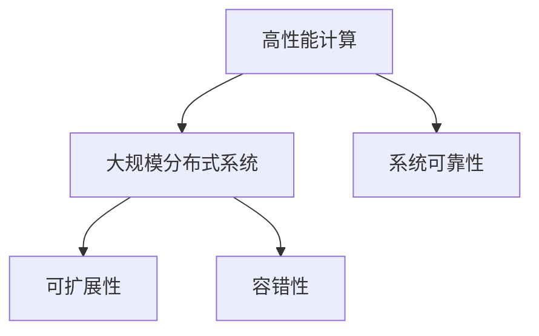

                 

# 大规模分布式系统设计原则与实践

> 关键词：大规模分布式系统, 分布式系统设计, 高性能计算, 系统可靠性, 可扩展性, 容错性

## 1. 背景介绍

### 1.1 问题由来

随着互联网应用的快速发展，大规模分布式系统（Massive Distributed Systems）成为现代企业架构的核心。无论是电子商务、社交媒体、金融交易，还是物联网、云计算、人工智能，许多关键应用场景都离不开大型的、高性能的、可扩展的分布式系统。

近年来，Google、Facebook、Amazon、Alibaba等顶尖企业纷纷披露其背后庞大的分布式系统架构，展现出令人叹为观止的规模和复杂性。但同时，这些系统在稳定性、可靠性、性能等方面的要求也愈发严苛，如何构建和维护这样的系统，成为了全球IT行业面临的一大难题。

本文将深入探讨大规模分布式系统的核心设计原则与实践方法，帮助开发者和架构师构建稳定、可靠、高性能的分布式系统，应对日益增长的业务需求和复杂性挑战。

## 2. 核心概念与联系

### 2.1 核心概念概述

在深入探讨大规模分布式系统的设计原则与实践前，首先需要理解以下几个核心概念：

- **大规模分布式系统（Massive Distributed Systems）**：指的是由成百上千台服务器构成的分布式计算环境，主要用于处理海量数据、实时交易、高性能计算等大规模应用场景。

- **高性能计算（High Performance Computing, HPC）**：指的是通过并行计算、分布式计算、云计算等方式，提升计算任务的执行效率，以处理大规模和高并发的数据计算任务。

- **系统可靠性（System Reliability）**：指的是系统在面对故障、故障转移、数据冗余等情况下的稳定性和持续性，确保业务服务的连续性。

- **可扩展性（Scalability）**：指的是系统能够平滑地添加或减少资源，以应对不断增长的业务需求。

- **容错性（Fault Tolerance）**：指的是系统在发生故障时能够自动检测、定位、恢复，并继续正常运行。

这些核心概念之间的逻辑关系可以通过以下Mermaid流程图来展示：



这个流程图展示了高性能计算、大规模分布式系统以及可靠性、可扩展性、容错性之间的联系：高性能计算是基础，大规模分布式系统是架构，而可靠性、可扩展性和容错性则是构建和运行系统的关键属性。

## 3. 核心算法原理 & 具体操作步骤

### 3.1 算法原理概述

大规模分布式系统设计涉及诸多算法原理，包括负载均衡、故障检测、数据同步、分布式事务等。这些原理相互配合，共同保证系统的性能、可靠性和可扩展性。

- **负载均衡（Load Balancing）**：通过将请求和数据均匀地分配到各个节点，提高系统的吞吐量和资源利用率。
- **故障检测（Fault Detection）**：在节点发生故障时快速识别和报告，避免单点故障导致整个系统崩溃。
- **数据同步（Data Synchronization）**：保持分布式系统内各节点之间的数据一致性，避免数据丢失和冲突。
- **分布式事务（Distributed Transactions）**：在分布式环境中实现原子性操作，确保跨节点操作的一致性和隔离性。

### 3.2 算法步骤详解

大规模分布式系统的设计步骤通常包括以下几个关键阶段：

**Step 1: 系统规划与设计**

1. **需求分析**：明确业务需求、用户场景、系统性能指标等。
2. **架构设计**：选择适合的架构模式（如微服务、SOA、Monolithic），确定系统的层次结构。
3. **技术选型**：选择合适的技术栈和工具（如Docker、Kubernetes、Hadoop、Spark等）。

**Step 2: 分布式部署与配置**

1. **部署模式**：选择合适的部署模式（如容器化、云原生、虚拟机）。
2. **配置管理**：使用配置管理工具（如Ansible、Puppet、Chef）进行环境部署和配置。
3. **服务发现**：使用服务发现机制（如Consul、Eureka、Kubernetes DNS）实现服务发现和负载均衡。

**Step 3: 系统监控与调优**

1. **监控指标**：定义系统的关键监控指标（如CPU、内存、网络带宽、响应时间）。
2. **监控工具**：使用监控工具（如Prometheus、Grafana、ELK Stack）实现系统监控和告警。
3. **调优策略**：根据监控数据进行系统调优，优化性能瓶颈。

**Step 4: 故障处理与恢复**

1. **故障检测**：使用心跳机制、心跳包等方式实现节点故障检测。
2. **故障恢复**：在节点故障时自动切换资源，保证业务连续性。
3. **数据冗余**：通过数据冗余和备份机制，避免数据丢失。

**Step 5: 安全与隐私**

1. **安全机制**：实施身份认证、授权机制、数据加密等安全措施。
2. **隐私保护**：确保用户数据的隐私和安全，遵守相关法律法规。

**Step 6: 测试与验证**

1. **功能测试**：进行单元测试、集成测试、压力测试等。
2. **性能测试**：进行负载测试、稳定性测试、容错测试等。
3. **验证工具**：使用测试工具（如JMeter、LoadRunner、Siege）进行系统测试。

### 3.3 算法优缺点

大规模分布式系统设计具有以下优点：

- **高可用性**：通过冗余和故障恢复机制，保证系统的连续性和稳定性。
- **高扩展性**：通过负载均衡和资源扩展，适应业务需求的变化。
- **高性能**：通过并行计算和分布式处理，提升系统的处理能力和响应速度。
- **灵活性**：通过微服务架构和容器化技术，实现快速部署和更新。

然而，大规模分布式系统设计也面临一些挑战：

- **复杂性高**：系统的构建和维护需要高度的技术和经验积累。
- **成本高**：分布式系统的硬件和软件成本较高。
- **难度大**：需要考虑性能、可靠性、可扩展性等多方面的因素。

## 4. 数学模型和公式 & 详细讲解 & 举例说明

### 4.1 数学模型构建

为了更好地理解大规模分布式系统的设计原则与实践，本节将使用数学语言对系统设计进行严格刻画。

假设系统由 $N$ 个节点组成，每个节点的负载为 $L_i$，其中 $i \in \{1, 2, \ldots, N\}$。系统的总负载为 $L = \sum_{i=1}^N L_i$。系统的吞吐量为 $T$，负载均衡因子为 $\alpha_i = \frac{L_i}{L}$。系统设计的目标是最小化总负载偏差 $\Delta = \max_i |\alpha_i - \frac{1}{N}|$，以实现最优的负载均衡。

### 4.2 公式推导过程

负载均衡的目标是最小化总负载偏差 $\Delta$，即：

$$
\min_{\alpha_1, \alpha_2, \ldots, \alpha_N} \Delta = \max_i |\alpha_i - \frac{1}{N}|
$$

考虑节点 $i$ 的负载偏差 $\Delta_i = \alpha_i - \frac{1}{N}$，目标函数可以重写为：

$$
\min_{\alpha_1, \alpha_2, \ldots, \alpha_N} \max_i |\Delta_i| = \min_{\alpha_1, \alpha_2, \ldots, \alpha_N} \max_i |\alpha_i - \frac{1}{N}|
$$

采用Lagrange乘子法，引入约束条件 $\sum_{i=1}^N \alpha_i = 1$，目标函数变为：

$$
\min_{\alpha_1, \alpha_2, \ldots, \alpha_N} \max_i |\alpha_i - \frac{1}{N}| + \lambda (\sum_{i=1}^N \alpha_i - 1)
$$

通过求解上述优化问题，可以得到最优的负载均衡因子 $\alpha_i$。

### 4.3 案例分析与讲解

以Google的分布式计算框架MapReduce为例，分析其负载均衡策略。

MapReduce通过将计算任务划分为Map和Reduce两个阶段，每个阶段由多个计算节点并行处理。MapReduce通过"Shuffle"机制实现数据的本地化，即将每个计算节点上生成的中间数据，根据键值映射到对应的Reduce节点上。

MapReduce的负载均衡策略包括以下几个步骤：

1. **Map任务划分**：根据输入数据的规模和计算资源，将Map任务均匀分配到各个节点上。
2. **Reduce任务划分**：根据Map任务生成的中间数据，将Reduce任务均匀分配到各个节点上。
3. **Shuffle机制**：在Map任务完成后，通过Shuffle机制将中间数据本地化，减少网络传输开销。
4. **任务调度**：通过心跳机制和任务调度机制，实时监控节点状态，动态调整任务分配。

MapReduce通过以上策略，实现了高效的负载均衡和资源利用，支持大规模分布式计算。

## 5. 项目实践：代码实例和详细解释说明

### 5.1 开发环境搭建

在进行大规模分布式系统项目实践前，我们需要准备好开发环境。以下是使用Python进行Kubernetes开发的环境配置流程：

1. 安装Anaconda：从官网下载并安装Anaconda，用于创建独立的Python环境。

2. 创建并激活虚拟环境：
```bash
conda create -n k8s-env python=3.8 
conda activate k8s-env
```

3. 安装Kubernetes相关库：
```bash
pip install kubernetes pykube pyftl
```

4. 安装Docker和Kubernetes：
```bash
sudo apt-get install docker-ce
sudo apt-get install kubelet kube-proxy kube-dns kube-controller-manager kube-scheduler kube-apiserver
```

完成上述步骤后，即可在`k8s-env`环境中开始大规模分布式系统的项目实践。

### 5.2 源代码详细实现

这里我们以Kubernetes集群搭建为例，展示大规模分布式系统的项目实践代码实现。

首先，创建Kubernetes集群，配置`kubeconfig`文件：

```python
from pykube import KubeConfig
config = KubeConfig.from_iam_auth()
config.set_current_context('default')
```

然后，定义Kubernetes集群节点：

```python
from pyftl import PyFTL
k8s = PyFTL(config)

# 定义节点列表
nodes = [
    {'name': 'node1', 'cpus': 4, 'memory': 16},
    {'name': 'node2', 'cpus': 4, 'memory': 16},
    {'name': 'node3', 'cpus': 4, 'memory': 16},
]
k8s.node.add(node1, node2, node3)
```

接着，部署应用：

```python
# 定义Pod和Service
pod1 = {
    'api_version': 'v1',
    'kind': 'Pod',
    'labels': {'hello': 'world'},
    'containers': [
        {
            'name': 'hello',
            'image': 'nginx',
            'ports': [
                {'container_port': 80},
            ]
        }
    ]
}

pod2 = {
    'api_version': 'v1',
    'kind': 'Pod',
    'labels': {'hello': 'world'},
    'containers': [
        {
            'name': 'world',
            'image': 'nginx',
            'ports': [
                {'container_port': 80},
            ]
        }
    ]
}

service1 = {
    'api_version': 'v1',
    'kind': 'Service',
    'type': 'LoadBalancer',
    'selector': {'hello': 'world'},
    'ports': [
        {'protocol': 'TCP', 'port': 80, 'target_port': 80},
    ]
}

k8s.pod.add(pod1, pod2)
k8s.service.add(service1)
```

最后，启动Kubernetes集群：

```python
k8s.start()
```

以上代码展示了使用PyFTL构建Kubernetes集群和部署Pod的过程，开发者可以根据需要添加更多的节点、Pod和Service，构建更为复杂的大规模分布式系统。

### 5.3 代码解读与分析

让我们再详细解读一下关键代码的实现细节：

**KubeConfig**：
- 使用PyKube库创建Kubernetes配置，通过`from_iam_auth()`方法自动获取认证信息。

**节点定义**：
- 通过`k8s.node.add()`方法添加节点，定义节点名称、CPU和内存配置。

**Pod定义**：
- 通过`k8s.pod.add()`方法添加Pod，定义Pod的API版本、种类型、标签、容器和端口信息。

**Service定义**：
- 通过`k8s.service.add()`方法添加Service，定义Service的API版本、种类型、选择器、端口信息。

**集群启动**：
- 通过`k8s.start()`方法启动Kubernetes集群。

可以看到，PyFTL库使得大规模分布式系统的部署和操作变得简单高效。开发者可以利用更少的代码实现复杂的系统架构和功能。

当然，工业级的系统实现还需考虑更多因素，如服务发现、负载均衡、容错机制等，但核心的分布式系统构建流程基本与此类似。

## 6. 实际应用场景

### 6.1 电商系统

电商平台需要同时处理数以万计的用户请求，确保系统的高性能和高可用性。通过大规模分布式系统架构，电商系统能够支持每秒数百万次的并发请求，同时保持系统的稳定性。

在实际应用中，电商平台可以使用微服务架构，将系统拆分为用户管理、商品管理、订单管理、支付管理等微服务，每个微服务部署在独立的节点上，通过API网关实现服务调用。同时，系统通过Kubernetes实现容错和自动扩缩容，支持动态调整资源以满足业务需求。

### 6.2 金融系统

金融系统需要处理高并发、高频率的交易请求，确保系统的稳定性和准确性。通过大规模分布式系统架构，金融系统能够处理每秒数万次的交易请求，同时保证系统的低延迟和高可靠性。

在实际应用中，金融系统可以使用分布式事务、数据冗余和容错机制，确保交易操作的原子性和一致性。同时，系统通过负载均衡和资源扩展，支持动态调整资源以满足交易需求。

### 6.3 物联网系统

物联网系统需要实时处理海量传感器数据，确保系统的实时性和准确性。通过大规模分布式系统架构，物联网系统能够支持每秒数百万次的数据采集和处理，同时保持系统的低延迟和高可靠性。

在实际应用中，物联网系统可以使用数据流计算和实时流处理技术，对传感器数据进行实时分析和处理。同时，系统通过负载均衡和容错机制，支持动态调整资源以满足数据处理需求。

## 7. 工具和资源推荐

### 7.1 学习资源推荐

为了帮助开发者和架构师系统掌握大规模分布式系统的设计与实践，这里推荐一些优质的学习资源：

1. 《大规模分布式系统设计与实践》书籍：系统介绍了大规模分布式系统的设计原则与实践方法，适合深入学习和实践。

2. 《分布式系统原理与实现》课程：斯坦福大学开设的分布式系统课程，详细讲解了分布式系统的核心概念和设计原理。

3. Kubernetes官方文档：Kubernetes的官方文档，提供了详细的Kubernetes集群搭建和操作教程。

4. TensorFlow分布式训练文档：TensorFlow的分布式训练文档，提供了多种分布式训练模式的实现方法和工具。

5. Google Cloud分布式系统教程：Google Cloud提供的分布式系统教程，涵盖了大规模分布式系统设计、部署和调优的实战案例。

通过这些资源的学习，相信你一定能够快速掌握大规模分布式系统的设计与实践方法，构建高效、可靠的系统。

### 7.2 开发工具推荐

高效的开发离不开优秀的工具支持。以下是几款用于大规模分布式系统开发的常用工具：

1. Kubernetes：由Google主导开发的开源容器编排系统，支持大规模集群管理。

2. Docker：开源的容器化平台，支持快速构建和部署应用。

3. Elastic Kubernetes Operator：支持Kubernetes的Elastic计算和存储功能，支持动态扩缩容和资源管理。

4. Prometheus和Grafana：开源的监控和可视化工具，支持实时监控和数据展示。

5. Jaeger和Zipkin：开源的分布式跟踪系统，支持实时追踪和问题诊断。

6. WeaveWorks：提供容器网络和服务发现功能的开源工具，支持Kubernetes集群管理。

合理利用这些工具，可以显著提升大规模分布式系统的开发效率，加快创新迭代的步伐。

### 7.3 相关论文推荐

大规模分布式系统设计的研究来源于学界的持续探索。以下是几篇奠基性的相关论文，推荐阅读：

1. MapReduce: Simplified Data Processing on Large Clusters：Google推出的MapReduce分布式计算框架，奠定了分布式计算的基础。

2. Spanner: Google's Global Transaction Management System：Google推出的Spanner分布式数据库，展示了分布式事务的实现方法。

3. Paxos Made Simple：Leslie Lamport的Paxos算法，是分布式一致性协议的代表。

4. Raft：David G. Andersen的Raft算法，是分布式一致性协议的另一重要实现。

5. Apache Hadoop：Apache基金会开源的分布式计算框架，支持大数据处理和存储。

这些论文代表了分布式系统设计的理论进展，通过学习这些前沿成果，可以帮助研究者把握学科前进方向，激发更多的创新灵感。

## 8. 总结：未来发展趋势与挑战

### 8.1 总结

本文对大规模分布式系统的设计原则与实践进行了全面系统的介绍。首先阐述了大规模分布式系统的研究背景和意义，明确了高性能计算、系统可靠性、可扩展性、容错性等关键属性的重要性。其次，从原理到实践，详细讲解了大规模分布式系统的设计步骤和算法实现方法，给出了系统构建和调优的完整代码实例。同时，本文还广泛探讨了大规模分布式系统在电商、金融、物联网等领域的实际应用场景，展示了分布式系统的广阔前景。此外，本文精选了大规模分布式系统的各类学习资源，力求为开发者提供全方位的技术指引。

通过本文的系统梳理，可以看到，大规模分布式系统设计是现代IT架构的核心，其核心设计原则和实践方法对于构建高效、稳定、可靠的分布式系统至关重要。未来，伴随分布式技术的发展，大规模分布式系统将在更多领域发挥重要作用，成为驱动经济和社会进步的重要力量。

### 8.2 未来发展趋势

展望未来，大规模分布式系统设计将呈现以下几个发展趋势：

1. **自动化与智能化**：通过自动化运维和智能调度，提升系统的部署和管理效率。例如，使用机器学习算法优化资源分配和调度策略，实现动态资源调整和优化。

2. **云原生架构**：云原生架构将成为未来分布式系统的主流架构，支持微服务、容器化、自动化部署和扩展。例如，使用Kubernetes和Istio等云原生工具，构建灵活、高效、自适应的分布式系统。

3. **边缘计算**：边缘计算将进一步扩展分布式系统的应用范围，提升系统的实时性和响应速度。例如，在物联网、车联网等场景中，通过边缘计算节点进行数据预处理和分析，减少中心化计算压力。

4. **分布式事务**：分布式事务将进一步优化和完善，确保跨节点操作的原子性和一致性。例如，引入两阶段提交、事务隔离等机制，提升系统的可靠性和性能。

5. **多云混合部署**：多云混合部署将成为未来分布式系统的主要模式，支持跨云资源的灵活调度和管理。例如，使用云服务提供商的云平台，结合企业自建的数据中心，实现混合云资源管理。

6. **区块链技术**：区块链技术将进一步应用于分布式系统，提升系统的透明性和安全性。例如，使用区块链技术实现分布式共识和数据存储，提升系统的信任度和可靠性。

以上趋势凸显了大规模分布式系统设计的广阔前景。这些方向的探索发展，必将进一步提升分布式系统的性能、可靠性和可扩展性，为构建高效、稳定、智能的分布式系统铺平道路。

### 8.3 面临的挑战

尽管大规模分布式系统设计已经取得了瞩目成就，但在迈向更加智能化、普适化应用的过程中，它仍面临诸多挑战：

1. **复杂性高**：分布式系统的构建和维护需要高度的技术和经验积累，开发和运维难度大。

2. **成本高**：分布式系统的硬件和软件成本较高，资源投入大。

3. **稳定性差**：分布式系统容易受到网络、硬件等因素的影响，系统稳定性难以保障。

4. **安全性低**：分布式系统需要考虑多层次的安全问题，如数据隐私、系统攻击等，安全防护难度大。

5. **数据一致性**：分布式系统需要在多节点之间保持数据一致性，避免数据冲突和丢失。

6. **系统延迟**：分布式系统需要处理多节点之间的通信和同步，系统延迟较高。

7. **性能瓶颈**：分布式系统需要考虑性能瓶颈和优化策略，保证系统的高效运行。

以上挑战需要在系统设计、部署、运维等多个环节进行全面优化，才能实现高效、稳定、可靠的分布式系统。

### 8.4 研究展望

面对大规模分布式系统设计所面临的挑战，未来的研究需要在以下几个方面寻求新的突破：

1. **自动化运维技术**：通过自动化运维和智能调度，提升系统的部署和管理效率，降低运维成本。例如，使用机器学习算法优化资源分配和调度策略，实现动态资源调整和优化。

2. **分布式共识算法**：进一步研究和优化分布式共识算法，提升系统的可靠性和一致性。例如，引入拜占庭容错、故障容忍等机制，提升系统的容错性和稳定性。

3. **微服务架构**：继续研究和优化微服务架构，提升系统的灵活性和可扩展性。例如，使用Kubernetes和Istio等云原生工具，构建灵活、高效、自适应的分布式系统。

4. **边缘计算技术**：深入研究和应用边缘计算技术，提升系统的实时性和响应速度。例如，在物联网、车联网等场景中，通过边缘计算节点进行数据预处理和分析，减少中心化计算压力。

5. **区块链技术**：进一步研究和应用区块链技术，提升系统的透明性和安全性。例如，使用区块链技术实现分布式共识和数据存储，提升系统的信任度和可靠性。

6. **分布式存储技术**：深入研究和应用分布式存储技术，提升系统的数据一致性和可靠性。例如，使用分布式文件系统和对象存储，实现数据的分布式存储和访问。

7. **容器化技术**：深入研究和应用容器化技术，提升系统的资源利用率和部署效率。例如，使用Docker和Kubernetes等容器化技术，实现应用的快速部署和扩展。

这些研究方向将推动大规模分布式系统设计迈向新的高度，为构建高效、稳定、智能的分布式系统提供更多选择和优化策略。

## 9. 附录：常见问题与解答

**Q1: 如何确保大规模分布式系统的可扩展性？**

A: 可扩展性是大规模分布式系统设计的重要属性。为确保系统的可扩展性，可以从以下几个方面入手：

1. **微服务架构**：采用微服务架构，将系统拆分为多个独立的微服务，每个微服务独立部署和管理。

2. **容器化技术**：使用容器化技术，如Docker和Kubernetes，实现应用的快速部署和扩展。

3. **自动化运维**：使用自动化运维工具，如Ansible和Puppet，实现系统的快速部署和配置管理。

4. **负载均衡**：使用负载均衡技术，如Nginx和HAProxy，实现系统的负载均衡和资源分配。

5. **弹性伸缩**：使用弹性伸缩技术，如Kubernetes的Horizontal Pod Autoscaler，实现系统的自动扩缩容和资源管理。

通过以上措施，可以确保大规模分布式系统的可扩展性，应对不断增长的业务需求。

**Q2: 如何保证大规模分布式系统的容错性？**

A: 容错性是大规模分布式系统设计的关键属性。为保证系统的容错性，可以从以下几个方面入手：

1. **冗余和备份**：使用冗余和备份技术，如数据备份和冗余副本，确保系统的容错性和可靠性。

2. **故障检测和恢复**：使用故障检测和恢复技术，如心跳机制和自动切换，确保系统的故障检测和快速恢复。

3. **分布式事务**：使用分布式事务技术，如两阶段提交和事务隔离，确保跨节点操作的原子性和一致性。

4. **日志和监控**：使用日志和监控技术，如ELK Stack和Prometheus，实时监控系统的状态和性能，及时发现和解决故障。

5. **自适应系统**：使用自适应系统，如Kubernetes和Docker Swarm，实现系统的自适应和自我修复。

通过以上措施，可以确保大规模分布式系统的容错性，提高系统的稳定性和可靠性。

**Q3: 大规模分布式系统面临的主要挑战是什么？**

A: 大规模分布式系统面临的主要挑战包括：

1. **复杂性高**：分布式系统的构建和维护需要高度的技术和经验积累，开发和运维难度大。

2. **成本高**：分布式系统的硬件和软件成本较高，资源投入大。

3. **稳定性差**：分布式系统容易受到网络、硬件等因素的影响，系统稳定性难以保障。

4. **安全性低**：分布式系统需要考虑多层次的安全问题，如数据隐私、系统攻击等，安全防护难度大。

5. **数据一致性**：分布式系统需要在多节点之间保持数据一致性，避免数据冲突和丢失。

6. **系统延迟**：分布式系统需要处理多节点之间的通信和同步，系统延迟较高。

7. **性能瓶颈**：分布式系统需要考虑性能瓶颈和优化策略，保证系统的高效运行。

以上挑战需要在系统设计、部署、运维等多个环节进行全面优化，才能实现高效、稳定、可靠的分布式系统。

**Q4: 大规模分布式系统设计需要考虑哪些因素？**

A: 大规模分布式系统设计需要考虑以下几个关键因素：

1. **需求分析**：明确业务需求、用户场景、系统性能指标等。

2. **架构设计**：选择合适的架构模式（如微服务、SOA、Monolithic），确定系统的层次结构。

3. **技术选型**：选择合适的技术栈和工具（如Docker、Kubernetes、Hadoop、Spark等）。

4. **部署模式**：选择合适的部署模式（如容器化、云原生、虚拟机）。

5. **配置管理**：使用配置管理工具（如Ansible、Puppet、Chef）进行环境部署和配置。

6. **服务发现**：使用服务发现机制（如Consul、Eureka、Kubernetes DNS）实现服务发现和负载均衡。

7. **系统监控**：定义系统的关键监控指标（如CPU、内存、网络带宽、响应时间）。

8. **故障处理**：使用故障检测和恢复机制，确保系统的连续性和稳定性。

9. **数据同步**：保持分布式系统内各节点之间的数据一致性，避免数据丢失和冲突。

10. **分布式事务**：在分布式环境中实现原子性操作，确保跨节点操作的一致性和隔离性。

通过以上因素的考虑和优化，可以构建高效、稳定、可靠的大规模分布式系统。

**Q5: 大规模分布式系统设计的核心目标是什么？**

A: 大规模分布式系统设计的核心目标是构建稳定、可靠、高性能的分布式系统，实现业务服务的连续性和高可用性。具体目标包括：

1. **高可用性**：通过冗余和故障恢复机制，保证系统的连续性和稳定性。

2. **高扩展性**：通过负载均衡和资源扩展，适应业务需求的变化。

3. **高性能**：通过并行计算和分布式处理，提升系统的处理能力和响应速度。

4. **灵活性**：通过微服务架构和容器化技术，实现快速部署和更新。

5. **安全性**：通过身份认证、授权机制、数据加密等安全措施，保障数据和系统的安全。

6. **稳定性**：通过故障检测和恢复机制，避免单点故障导致整个系统崩溃。

通过以上目标的实现，可以构建高效、稳定、可靠的分布式系统，提升业务服务的质量和用户体验。

---

作者：禅与计算机程序设计艺术 / Zen and the Art of Computer Programming

