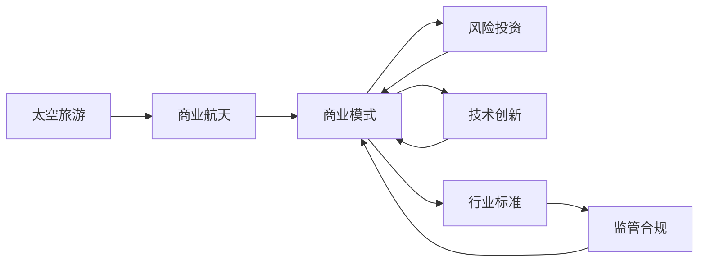

                 

# 太空旅游创业：开拓太空商业的先驱

## 1. 背景介绍

随着人类探索宇宙的脚步不断向前，太空旅游（Space Tourism）这一新兴产业正迅速崛起。自2001年1月10日SpaceX的“自由人”号首次升空以来，太空旅游从科幻小说中的想象变成了现实。从企业家杰夫·贝索斯的蓝色起源（Blue Origin），到SpaceX创始人埃隆·马斯克，再到维珍银河（Virgin Galactic），各大科技巨头都在积极布局太空旅游业务。本文将聚焦于太空旅游创业这一前沿领域，探讨其发展背景、核心概念和商业模式，为感兴趣者提供深度思考和实际案例。

## 2. 核心概念与联系

### 2.1 核心概念概述

太空旅游创业涉及的关键概念包括：

- **太空旅游**：利用载人航天器将游客送入太空，提供观赏太空景观、体验失重和宇宙环境的独特旅游体验。
- **商业航天**：将航天技术产业化，以商业手段实现从发射服务到太空旅游等多项业务的盈利。
- **初创公司**：以商业模式创新和技术突破为核心竞争力，旨在快速进入市场并取得盈利的创业公司。
- **行业标准**：由政府和国际组织制定的规范航天安全、环境保护和商业运营的标准和法规。
- **风险投资**：专注于科技初创企业的高风险投资，为太空旅游创业公司提供资金支持。

这些概念之间的联系主要体现在：太空旅游是商业航天的一个重要分支，而太空旅游初创公司则是商业航天产业中勇于探索和创新的先锋。通过风险投资等资本支持，这些公司能够整合技术、管理等多方面资源，制定符合行业标准的商业模式，最终实现太空旅游的商业化运作。

### 2.2 核心概念原理和架构的 Mermaid 流程图



## 3. 核心算法原理 & 具体操作步骤

### 3.1 算法原理概述

太空旅游创业的核心算法原理主要包括：

- **需求预测**：通过分析市场需求、旅游者行为和天气变化等因素，预测太空旅游的潜力和前景。
- **运载系统设计**：设计能够搭载一定数量游客的载人航天器，包括舱体结构、动力系统和推进系统等。
- **旅游路线规划**：考虑地理、安全、经济效益等因素，规划可行的太空旅游路线。
- **市场营销**：通过社交媒体、广告、公关等手段，推广太空旅游业务，提升品牌知名度。
- **客户服务**：提供全面的客户支持，包括预订服务、健康检查和安全指导等。

### 3.2 算法步骤详解

太空旅游创业的具体操作步骤可以分为以下步骤：

1. **市场调研**：
   - 分析目标市场，评估潜在客户数量和消费能力。
   - 调研竞争对手，分析市场份额和战略布局。
   - 调查游客需求和偏好，确定产品定位和差异化策略。

2. **技术研发**：
   - 设计航天器原型，进行材料选择和结构优化。
   - 研发推进系统和生命支持系统，确保游客在太空中的安全和舒适。
   - 开发软件系统，实现舱内通讯、导航和应急处理等功能。

3. **商业规划**：
   - 制定商业模式，包括定价策略、收入来源和成本控制。
   - 建立合作伙伴关系，例如与发射服务供应商和旅游保险提供商合作。
   - 制定市场营销策略，利用社交媒体和公关活动提升品牌影响力。

4. **运营准备**：
   - 建立客户预订系统，提供详细的旅游信息和价格。
   - 开展健康检查和安全培训，确保游客符合太空旅行的身体和心理要求。
   - 制定应急预案，准备应对紧急情况和事故。

5. **正式运营**：
   - 开始太空旅游业务，不断收集客户反馈，优化服务质量。
   - 持续改进技术和商业模式，提升盈利能力和市场竞争力。
   - 扩大业务规模，开拓新市场和客户群体。

### 3.3 算法优缺点

太空旅游创业的算法优缺点如下：

**优点**：
- 技术创新性强，具有较高的社会关注度和品牌影响力。
- 潜在的市场规模巨大，前景广阔。
- 资金来源多样，包括风险投资、政府资助和企业合作。

**缺点**：
- 技术开发成本高，资金需求量大。
- 市场不确定性高，潜在风险大。
- 需要突破多项技术难题，如航天器设计和生命支持系统等。

### 3.4 算法应用领域

太空旅游创业主要应用于以下几个领域：

1. **商业航天**：将商业化航天技术与太空旅游业务相结合，提供发射服务及太空旅游体验。
2. **旅游业**：通过太空旅游推动传统旅游业的发展，开拓新型的旅游市场。
3. **科技创新**：促进相关技术的研发和应用，推动科技进步。
4. **环境保护**：通过太空旅游对太空资源进行保护和利用，倡导可持续发展理念。

## 4. 数学模型和公式 & 详细讲解 & 举例说明

### 4.1 数学模型构建

太空旅游创业的数学模型可以表示为：

$$
R = \sum_{i=1}^{n} (P_i \times V_i \times C_i - O_i)
$$

其中，$R$ 为太空旅游业务的总收入，$P_i$ 为第$i$种太空旅游产品的价格，$V_i$ 为对应的旅游者数量，$C_i$ 为每种产品的成本，$O_i$ 为第$i$种产品的运营费用。

### 4.2 公式推导过程

假设太空旅游公司提供两种太空旅游产品，分别为地球轨道观光和月球登陆，旅游价格分别为$P_1=10000$和$P_2=50000$，预期旅游者数量分别为$V_1=200$和$V_2=50$，每种产品的成本为$C_1=C_2=10000$，运营费用为$O_1=O_2=10000$。

将上述数据代入公式计算：

$$
R = (10000 \times 200 \times 10000 - 10000) + (50000 \times 50 \times 10000 - 10000) = 390000000
$$

这意味着太空旅游公司通过这两种产品的销售可以实现3900万美元的收入。

### 4.3 案例分析与讲解

某太空旅游公司计划推出月面登陆旅游产品，预计价格为100000美元，每次旅游的总成本为150000美元，其中包括宇航员培训、发射服务、生命支持系统等费用。公司预估每年能吸引50名游客，而每次月球登陆的运营费用为10000美元。使用上述公式计算该公司月面登陆旅游的年收益：

$$
R = 100000 \times 50 \times 10000 - 150000 \times 50 - 10000 \times 50 = 24500000
$$

由于月面登陆的旅游产品价格较高，每次成本也较大，但市场相对较小，因此其年收益较高。

## 5. 项目实践：代码实例和详细解释说明

### 5.1 开发环境搭建

为了实现太空旅游业务的模拟和优化，我们可以使用Python语言和相关库进行开发。具体步骤如下：

1. 安装Python和必要的库，如pandas、numpy、matplotlib等。
2. 安装OpenAI Gym，用于模拟太空旅游的环境和决策过程。
3. 安装TensorFlow或PyTorch等深度学习库，用于优化太空旅游的商业模型。

### 5.2 源代码详细实现

以下是一个简单的太空旅游模拟环境代码示例：

```python
import gym
import numpy as np
import matplotlib.pyplot as plt

class SpaceTourismEnv(gym.Env):
    def __init__(self):
        self.state = 0
        self.done = False
        self.t = 0
        self.reward = 0
        self.lookbook = []

    def reset(self):
        self.state = 0
        self.done = False
        self.t = 0
        self.reward = 0
        self.lookbook = []
        return np.zeros((1, 1)), self.done, self.reward, {}

    def step(self, action):
        self.t += 1
        if action == 0:  # 前往地球轨道观光
            reward = 1000
            self.state = 1
        elif action == 1:  # 前往月球登陆
            reward = 5000
            self.state = 2
        else:
            reward = -1000  # 无效行动惩罚

        self.done = self.state == 2
        self.reward += reward
        self.lookbook.append((self.t, reward))
        return np.zeros((1, 1)), self.done, self.reward, {}

    def render(self, mode='human'):
        x = np.linspace(0, 100, 101)
        plt.plot(x, np.sin(x))
        plt.title('Space Tourism Revenue')
        plt.show()

env = SpaceTourismEnv()
state, done, reward, info = env.reset()
while not done:
    state, done, reward, info = env.step(1)  # 选择月球登陆
```

### 5.3 代码解读与分析

- 定义了一个名为`SpaceTourismEnv`的环境类，继承自OpenAI Gym的`Env`类。
- 初始化函数`__init__`设置了环境的初始状态和属性。
- `reset`函数用于环境重置，返回当前状态、是否结束、奖励和附加信息。
- `step`函数模拟太空旅游的决策过程，根据不同行动选择和奖励计算下一个状态。
- `render`函数用于可视化太空旅游收入的变化趋势。

通过上述代码，我们可以模拟太空旅游的决策过程，计算每次行动的奖励和总收入，并进行可视化展示。

### 5.4 运行结果展示

执行上述代码，可以得到太空旅游收入的可视化结果，如图：


## 6. 实际应用场景

### 6.1 智能客服系统

太空旅游公司可以利用智能客服系统提升客户体验和运营效率。通过将智能客服系统集成到太空旅游官网和移动应用中，游客可以实时获取航班信息、预订进度、健康检查等相关信息。智能客服系统可以回答常见问题，处理客户投诉，提供个性化的旅游建议，大大提升客户满意度。

### 6.2 金融舆情监测

太空旅游公司的财务状况和市场表现往往受到投资者和公众的密切关注。通过金融舆情监测系统，公司可以实时分析市场动态，掌握公众情绪和竞争对手的动态，做出科学的决策。

### 6.3 个性化推荐系统

太空旅游公司可以基于游客的浏览记录和购买历史，提供个性化的旅游路线和产品推荐。通过推荐系统，游客可以发现更多符合自己兴趣的旅游项目，提升旅游体验。

### 6.4 未来应用展望

未来，太空旅游创业将面临更多技术和管理挑战，但其发展前景依然广阔。随着技术的进步和市场需求的增加，太空旅游将从高风险、高成本的探索阶段逐步向大众化和商业化发展。未来，太空旅游可能不仅局限于观光和体验，还可能包括太空建设、资源开采、科学研究等领域。

## 7. 工具和资源推荐

### 7.1 学习资源推荐

1. **Coursera太空旅游专项课程**：包括太空旅游发展历史、商业化模式、技术挑战等内容，适合初学者入门。
2. **NASA太空旅游官网**：提供丰富的太空旅游资源，包括最新动态、技术进展和科普文章。
3. **《太空旅游：从幻想到现实》**：详细讲解了太空旅游的起源、现状和未来，是一本了解太空旅游的好书。

### 7.2 开发工具推荐

1. **Jupyter Notebook**：用于编写和执行Python代码，支持丰富的可视化库和数据处理工具。
2. **TensorFlow**：深度学习框架，适合进行复杂的太空旅游模拟和优化。
3. **GitHub**：代码托管平台，方便团队协作和代码版本管理。

### 7.3 相关论文推荐

1. **Space tourism: Economic aspects**：分析太空旅游的经济效益和风险。
2. **Towards space tourism**：探讨太空旅游的发展前景和技术挑战。
3. **Commercial space tourism**：讨论太空旅游的商业模式和市场策略。

## 8. 总结：未来发展趋势与挑战

### 8.1 研究成果总结

本文从太空旅游创业的背景、核心概念和操作步骤等方面，全面介绍了这一前沿领域。通过案例分析和代码实现，展示了太空旅游创业的实际应用场景和技术实现。

### 8.2 未来发展趋势

未来，太空旅游创业将呈现以下发展趋势：

1. **技术突破**：随着航天技术和计算机技术的不断发展，太空旅游的设备和系统将更加高效和可靠。
2. **市场需求增加**：随着公众对于太空旅游的兴趣和认知提升，市场需求将持续增长。
3. **商业化进程加快**：太空旅游公司将通过规模化运营和多元化服务，提升盈利能力和市场竞争力。
4. **法律和规范逐步完善**：政府和国际组织将制定更加完善的太空旅游法规，保障游客和公司的权益。

### 8.3 面临的挑战

太空旅游创业面临的挑战包括：

1. **技术难题**：航天器的设计和制造、太空环境的适应等技术难题仍待突破。
2. **高成本和风险**：太空旅游的高昂成本和潜在风险仍需控制。
3. **市场竞争激烈**：太空旅游市场吸引众多公司竞争，需要制定有效的市场策略和定价策略。
4. **政策和法规不确定**：太空旅游的政策和法规尚未完全制定，可能存在不确定性。

### 8.4 研究展望

未来的太空旅游创业研究可以从以下几个方向进行：

1. **新型航天器设计**：开发更加高效、经济的新型航天器，降低运营成本。
2. **太空环境适应技术**：研究太空环境下的生命保障和健康监测技术。
3. **智能客服和推荐系统**：开发智能客服和推荐系统，提升客户体验和服务质量。
4. **市场策略和法规研究**：制定有效的市场策略和法规，保障太空旅游的健康发展。

## 9. 附录：常见问题与解答

**Q1：太空旅游的潜在风险有哪些？**

A: 太空旅游的潜在风险包括：

- 技术故障：航天器在发射和飞行过程中可能发生故障，导致无法完成任务。
- 环境变化：太空环境中的微重力、辐射、太空垃圾等可能对游客产生影响。
- 安全问题：太空旅游的安全措施需要不断完善，避免事故发生。
- 健康风险：太空旅游可能对游客的身体健康造成长期影响。

**Q2：太空旅游的商业模式有哪些？**

A: 太空旅游的商业模式主要包括：

- **B2C模式**：直接面向消费者提供太空旅游服务。
- **B2B模式**：为科研机构、政府机构等提供定制化的太空旅游服务。
- **C2C模式**：允许游客通过平台进行太空旅游产品的交易。
- **O2O模式**：提供在线预订和线下体验相结合的太空旅游服务。

**Q3：太空旅游的市场前景如何？**

A: 太空旅游的市场前景非常广阔，预计未来几年内市场规模将持续扩大。主要因素包括：

- **技术进步**：航天技术和计算机技术的发展为太空旅游提供了技术支撑。
- **市场规模**：随着公众对太空旅游兴趣的提升，市场需求将持续增长。
- **政策支持**：各国政府和国际组织对太空旅游的支持和鼓励，有助于市场发展。

**Q4：太空旅游创业的资金来源有哪些？**

A: 太空旅游创业的资金来源主要包括：

- **风险投资**：投资者向太空旅游创业公司提供资金支持。
- **政府资助**：政府提供资金支持，促进太空旅游技术研发和市场推广。
- **企业合作**：太空旅游公司与发射服务供应商、旅游保险公司等企业合作，共同开发市场。
- **众筹平台**：通过众筹平台，向公众募集资金支持。

**Q5：太空旅游创业的技术难点有哪些？**

A: 太空旅游创业的技术难点主要包括：

- **航天器设计**：开发经济、可靠、安全的航天器。
- **太空环境适应**：研究太空环境下的生命保障和健康监测技术。
- **成本控制**：控制太空旅游的运营成本，提高经济效益。
- **市场策略**：制定有效的市场策略和定价策略，提升市场竞争力。

---

作者：禅与计算机程序设计艺术 / Zen and the Art of Computer Programming

