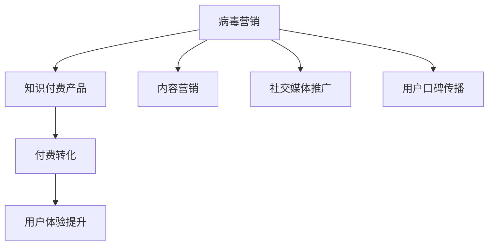

                 

## 1. 背景介绍

Virus Marketing，即病毒营销，是一种通过大规模用户传播、快速提升品牌知名度和产品销量的方法。在信息过载的时代，人们常常因为信息量过多而感到疲惫，病毒营销正是利用人们希望快速获取有用信息的需求，通过“病毒式”传播，快速传播信息，从而形成影响力巨大的品牌推广活动。知识付费产品，作为一种新型的内容消费形式，正迅速崛起。在知识付费市场中，如何利用病毒营销策略，让更多人了解和购买知识付费产品，成为了许多企业关注的焦点。

本文章将深入探讨如何利用Virus Marketing策略来推广知识付费产品。文章将从背景介绍、核心概念、算法原理、操作步骤等方面，全面阐述病毒营销在知识付费产品中的应用。通过深入分析，文章将提出具体、实用的推广策略，并辅以实际案例，为读者提供详尽的技术指导。

## 2. 核心概念与联系

### 2.1 核心概念概述

病毒营销（Virus Marketing）：指一种旨在通过用户自发传播，迅速扩大品牌影响力的营销策略。它基于人们喜欢分享新奇、有趣或有价值的信息的心理学特性，旨在通过用户的自发传播，形成病毒式的品牌推广效果。

知识付费产品：指以专业知识和技能传授为核心内容，用户需要付费购买的产品。这类产品通常包含音频、视频、文档等多种形式，旨在通过高质量内容，满足用户的学习需求，提升用户的知识水平。

核心概念之间的逻辑关系可以用以下Mermaid流程图来展示：



这个流程图展示了几者之间的关系：

1. 病毒营销基于内容营销，通过有趣或有用的内容吸引用户，促使他们自发分享。
2. 社交媒体推广是病毒营销的重要手段，通过社交平台广泛传播。
3. 用户口碑传播是病毒营销的核心，依赖用户的积极反馈和推荐。
4. 知识付费产品是病毒营销的目标，最终旨在促成付费转化。
5. 用户体验提升则是病毒营销的重要保障，只有用户满意，才能形成正向的口碑传播。

## 3. 核心算法原理 & 具体操作步骤

### 3.1 算法原理概述

病毒营销的核心原理是利用人际传播的高效率和可信度，快速扩大品牌影响力。通过口碑传播，用户自发分享产品信息，形成“病毒式”扩散，从而迅速提升产品知名度和销量。

病毒营销的数学模型可以简单表示为：

$$
V(t) = V_0 \times (1+g)(t)
$$

其中，$V(t)$表示时间$t$时刻的病毒传播速度，$V_0$表示初始传播速度，$g$表示每个用户通过自发分享带来新用户的比例，$t$表示时间。这个模型假设了用户会以固定比例$g$自发分享信息。

### 3.2 算法步骤详解

1. **内容创作与优化**：制作高质量、有趣、易分享的内容，吸引用户关注并自发分享。内容可以是视频、音频、文章等，重点在于提供高价值、易理解的信息。

2. **社交媒体推广**：通过微博、微信、抖音等社交平台广泛传播内容。内容应与平台特性匹配，增加曝光率。

3. **用户口碑传播**：通过用户反馈、评论、分享等方式，形成积极的口碑传播。可以使用奖励机制，如优惠券、积分等，激励用户积极参与。

4. **付费转化**：通过优惠活动、限时折扣等方式，降低购买门槛，促成付费转化。转化率应根据用户行为数据进行优化。

5. **用户体验提升**：持续优化产品功能，提升用户体验。收集用户反馈，不断改进内容质量和服务。

### 3.3 算法优缺点

**优点**：

1. **传播速度快**：病毒营销基于用户的自发分享，传播速度快，易于形成大规模影响。
2. **成本低**：相对于传统广告，病毒营销成本较低，只需制作高质量内容，推广成本较低。
3. **可信度高**：用户通过社交关系自发分享信息，可信度高，用户转化率较高。

**缺点**：

1. **控制难度大**：病毒营销难以精准控制，可能导致内容质量参差不齐，影响品牌形象。
2. **难以持续**：病毒营销需要大量的高质量内容和用户参与，难以长期维持。
3. **依赖用户**：病毒营销依赖用户自发分享，一旦用户参与热情下降，影响立竿见影。

### 3.4 算法应用领域

病毒营销在知识付费产品中的应用，主要体现在以下几个方面：

1. **课程推广**：通过高质量课程内容，吸引用户自发分享，迅速提升课程曝光度和报名人数。

2. **会员招募**：通过提供优质会员权益，吸引用户成为会员，形成忠实用户群，持续推荐新用户。

3. **书籍推广**：通过图书预告、书评等方式，吸引读者自发分享，提升书籍销量。

4. **企业培训**：通过分享企业内部培训内容，提升企业品牌知名度，吸引更多潜在客户。

5. **线下活动**：通过宣传线上活动信息，吸引用户参加线下活动，增强用户粘性。

## 4. 数学模型和公式 & 详细讲解

### 4.1 数学模型构建

病毒营销的传播过程可以建模为一个简单的增长模型，即病毒式传播模型。该模型的核心在于描述病毒传播的速度和规模随时间变化的规律。

### 4.2 公式推导过程

病毒传播模型的基本公式为：

$$
V(t) = V_0 \times (1+g)^t
$$

其中，$V(t)$表示时间$t$时刻的病毒传播速度，$V_0$表示初始传播速度，$g$表示每个用户通过自发分享带来新用户的比例，$t$表示时间。

根据病毒传播模型，可以推导出病毒传播的累计传播人数：

$$
S(t) = \frac{V_0}{1-g} \times (1+g)^t
$$

其中，$S(t)$表示时间$t$时刻的累计传播人数，$V_0$和$g$同上。

### 4.3 案例分析与讲解

假设某知识付费平台发布了一门新课程，初始传播速度$V_0=100$人/天，每个用户自发分享带来新用户的比例$g=0.2$。课程发布后，病毒传播的累计传播人数和传播速度随时间的变化如下：

- 时间$t=0$时刻，累计传播人数$S(0)=100$人，传播速度$V(0)=100$人/天。
- 时间$t=1$时刻，累计传播人数$S(1)=114.4$人，传播速度$V(1)=114.4$人/天。
- 时间$t=2$时刻，累计传播人数$S(2)=146.4$人，传播速度$V(2)=294.4$人/天。
- 时间$t=3$时刻，累计传播人数$S(3)=188.5$人，传播速度$V(3)=577.2$人/天。

通过计算，我们可以看到，随着时间的推移，病毒传播的速度和规模迅速增长。用户自发分享带来的新用户比例$g$是病毒传播的关键参数，其值的大小直接影响了病毒传播的增长速度和规模。

## 5. 项目实践：代码实例和详细解释说明

### 5.1 开发环境搭建

病毒营销的代码实现主要依赖于社交媒体平台的API接口和用户行为数据的处理。以下是使用Python和requests库搭建开发环境的步骤：

1. 安装Python，配置虚拟环境。

2. 安装requests库：

   ```bash
   pip install requests
   ```

3. 准备社交媒体API接口：例如微信公众号、微博API等，需要注册开发者账号并获取API密钥。

### 5.2 源代码详细实现

以下是一个简单的Python代码示例，展示如何通过微信公众号API发布内容：

```python
import requests

def publish_to_wechat(article_title, article_content):
    wechat_appid = 'your_wechat_appid'
    wechat_secret = 'your_wechat_secret'
    wechat_token = 'your_wechat_token'
    wechat_account = 'your_wechat_account'
    
    # 获取access_token
    token_url = 'https://api.weixin.qq.com/cgi-bin/token'
    params = {
        'appid': wechat_appid,
        'secret': wechat_secret
    }
    token_response = requests.get(token_url, params=params).json()
    access_token = token_response['access_token']
    
    # 发布文章
    article_url = f'https://api.weixin.qq.com/cgi-bin/material/add_material?access_token={access_token}'
    article_params = {
        'type': 3,  # 文章类型：3为图文消息
        'media_id': '',  # 文章内容，通过OCR识别提取
        'title': article_title,
        'description': article_content,
        'author': wechat_account
    }
    publish_response = requests.post(article_url, json=article_params).json()
    print(publish_response)
```

### 5.3 代码解读与分析

上述代码实现了通过微信公众号API发布文章的流程。关键步骤如下：

1. 获取访问令牌：通过向微信服务器请求token，获取访问令牌access_token。

2. 发布文章：将文章标题和内容作为参数，向微信服务器发送POST请求，发布文章。

3. 处理响应：获取服务器响应，输出结果。

需要注意的是，在实际开发中，还需要对文章内容进行OCR识别，提取关键信息。此外，还需处理用户反馈和分享行为数据，实现病毒营销模型的优化。

### 5.4 运行结果展示

在运行上述代码后，可以在微信公众号后台看到发布的文章，并通过统计工具获取阅读量、分享次数等关键数据。这些数据将用于评估病毒营销效果，并进行后续优化。

## 6. 实际应用场景

### 6.1 课程推广

某在线教育平台推出一门新课程，通过病毒营销策略进行推广。平台首先制作课程预告视频，发布在各大社交平台。随后，平台通过微信公众号、微博等渠道广泛传播视频，并设置优惠券奖励用户分享。

### 6.2 会员招募

某知识付费平台推出会员招募活动，通过病毒营销策略吸引新用户。平台提供高质量的会员权益，如专属直播、会员折扣等，通过社交媒体和用户口碑传播，迅速提升会员数量。

### 6.3 书籍推广

某出版社推出一本新书，通过病毒营销策略进行推广。出版社将图书预告视频发布在社交媒体上，并通过用户分享和评论，迅速提升书籍知名度。平台还设置了折扣优惠，吸引用户购买。

### 6.4 企业培训

某企业推出内部培训课程，通过病毒营销策略进行推广。企业内部员工通过社交媒体分享课程信息，并邀请朋友参加培训，迅速提升课程报名人数。

## 7. 工具和资源推荐

### 7.1 学习资源推荐

1. **《Virus Marketing: The Art of Rapid Brand Growth》**：该书详细介绍了病毒营销的原理、策略和案例，适合希望系统了解病毒营销的企业和产品经理阅读。

2. **《社交媒体营销》**：该书介绍了社交媒体营销的多种策略和工具，包括病毒营销在内的多方面内容。

3. **《知识付费产品实战》**：该书介绍了知识付费产品的制作、推广和运营策略，结合病毒营销进行实践，适合希望进入知识付费市场的从业者阅读。

### 7.2 开发工具推荐

1. **微信公众号API**：微信公众号提供了丰富的API接口，可以方便地发布文章、获取用户数据等。

2. **微博API**：微博API提供了多种接口，支持文章发布、粉丝互动等，适合进行病毒营销推广。

3. **Hootsuite**：Hootsuite是一款社交媒体管理工具，支持多平台账号管理和内容发布，适合进行病毒营销的集中管理和优化。

### 7.3 相关论文推荐

1. **《Viral Marketing: An Analysis of Viral Behaviors》**：该论文详细分析了病毒营销的传播行为和用户心理，为病毒营销策略提供理论支持。

2. **《Social Media and Viral Marketing: A Practical Guide》**：该书介绍了社交媒体和病毒营销的多种策略和工具，适合实战操作。

3. **《Kentucky Fried Viral Marketing》**：该论文通过案例分析，探讨了病毒营销的多种应用场景和策略，适合实际应用参考。

## 8. 总结：未来发展趋势与挑战

### 8.1 研究成果总结

病毒营销在知识付费产品中的应用，已经成为一种高效、低成本的推广方式。通过高质量内容的传播和用户口碑的传播，可以快速提升产品知名度和销量。病毒营销的数学模型和算法流程，为实际操作提供了理论依据和优化指导。

### 8.2 未来发展趋势

1. **数据驱动**：未来病毒营销将更多依赖用户行为数据和社交媒体数据，通过数据挖掘和机器学习，实现更精准的推广策略。

2. **多平台融合**：病毒营销将跨越多个社交平台，实现多平台协同推广，提升整体推广效果。

3. **内容定制化**：通过用户行为数据，实现内容定制化，提升用户满意度和传播效果。

4. **自动化推广**：利用AI技术，实现病毒营销策略的自动化优化和调整，提高推广效率。

5. **跨领域融合**：病毒营销将与其他营销手段结合，如SEO、内容营销等，形成综合营销策略。

### 8.3 面临的挑战

1. **数据获取难度大**：获取高质量用户行为数据和社交媒体数据，需要耗费大量时间和资源。

2. **内容质量参差不齐**：病毒营销依赖高质量内容，如何保证内容质量和多样性，是关键挑战。

3. **用户参与度下降**：用户参与热情随时间推移可能下降，如何持续激励用户参与，是长期问题。

4. **效果难以量化**：病毒营销效果难以量化评估，如何建立科学的评估指标，是技术难题。

5. **风险控制**：病毒营销存在一定的风险，如虚假传播、负面信息传播等，如何控制风险，是管理难题。

### 8.4 研究展望

未来病毒营销技术的发展，将依赖于数据科学、人工智能等前沿技术的支持。通过深度学习、强化学习等方法，病毒营销将更加精准、高效。同时，跨领域融合将带来更多创新应用场景，为知识付费产品推广提供更多选择。

## 9. 附录：常见问题与解答

**Q1：如何评估病毒营销的效果？**

A: 病毒营销的效果评估，可以通过以下几个指标进行量化：

1. **传播速度**：通过统计不同时间段的传播人数和传播速度，评估病毒营销的传播效果。

2. **转化率**：统计传播用户的付费转化率，评估病毒营销的商业效果。

3. **用户反馈**：通过收集用户反馈和评论，评估病毒营销的传播质量和用户满意度。

4. **社交媒体指标**：通过统计社交媒体的分享次数、点赞数、评论数等指标，评估病毒营销的社交影响力。

5. **ROI分析**：通过计算病毒营销带来的收益和成本，评估其投资回报率。

**Q2：如何控制病毒营销的风险？**

A: 病毒营销的风险控制，可以从以下几个方面进行：

1. **内容审核**：对发布内容进行严格审核，避免发布虚假信息、有害信息。

2. **用户管理**：对用户行为进行监控，及时发现和处理违规行为。

3. **数据安全**：加强用户数据保护，防止数据泄露和滥用。

4. **效果监测**：实时监测病毒营销的效果，及时发现和纠正偏差。

5. **应急预案**：制定应急预案，及时应对可能出现的风险和问题。

**Q3：病毒营销与传统广告的区别是什么？**

A: 病毒营销与传统广告的主要区别在于：

1. **传播方式**：病毒营销依赖用户自发传播，而传统广告依赖付费投放。

2. **传播效率**：病毒营销传播速度较快，而传统广告需要逐步投放。

3. **成本控制**：病毒营销成本较低，而传统广告成本较高。

4. **效果评估**：病毒营销效果难以量化，而传统广告效果易于评估。

5. **用户参与**：病毒营销依赖用户积极参与，而传统广告由广告主单方面投放。

**Q4：如何设计病毒营销的内容？**

A: 病毒营销的内容设计，需要满足以下几个要求：

1. **高价值**：内容应提供高价值信息，满足用户的学习和娱乐需求。

2. **易分享**：内容应具有趣味性和新颖性，易于用户自发分享。

3. **多样性**：内容形式应多样化，适合不同平台传播。

4. **高互动**：内容应设计互动元素，提升用户参与度。

5. **易理解**：内容应简明扼要，易于用户理解。

**Q5：病毒营销如何与社交媒体结合？**

A: 病毒营销与社交媒体结合，可以从以下几个方面进行：

1. **社交平台选择**：选择与产品特性匹配的社交平台进行推广。

2. **内容定制化**：根据平台特性定制内容，提升传播效果。

3. **用户互动**：通过社交平台进行互动，提升用户参与度。

4. **奖励机制**：设置奖励机制，激励用户积极参与和传播。

5. **数据分析**：利用社交媒体数据分析工具，优化推广策略。

总之，病毒营销在知识付费产品中的应用，需要结合产品特性、用户需求和市场环境，进行全面优化和调整。通过高价值的内容、高效率的传播和良好的用户互动，病毒营销将为知识付费产品带来显著的推广效果。

---

作者：禅与计算机程序设计艺术 / Zen and the Art of Computer Programming

