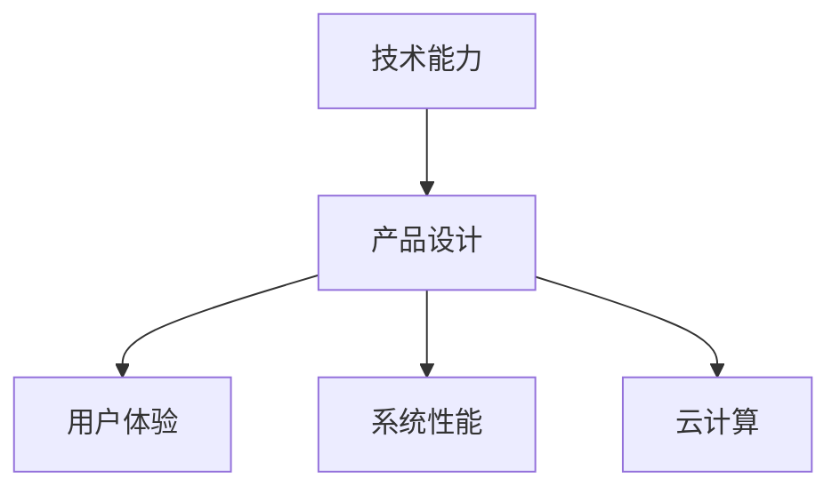

                 

## 1. 背景介绍

在当前数字化转型的时代背景下，产品设计不再仅限于传统的人机交互界面和用户界面(UI/UX)设计，而是涵盖了更广泛的技术能力，包括但不限于算法模型、数据处理、系统架构、云计算等。技术能力在产品设计中的应用，使得产品更加智能化、个性化和高效化，极大地提升了用户体验和系统性能。本文将系统性地探讨如何利用技术能力进行产品设计，从理论到实践，给出全面的指导。

## 2. 核心概念与联系

### 2.1 核心概念概述

为更好地理解技术能力在产品设计中的作用，本节将介绍几个密切相关的核心概念：

- **技术能力**：指用于产品设计和开发的技术工具和方法，包括但不限于编程语言、算法模型、数据处理技术、系统架构设计等。
- **产品设计**：指从用户需求出发，设计并实现满足用户需求的产品过程，包括UI/UX设计、功能实现、技术选型等。
- **用户体验**：指用户在使用产品时的主观感受和满意度，包括易用性、响应速度、个性化程度等。
- **系统性能**：指产品的响应速度、稳定性、扩展性等技术指标，直接影响用户体验和系统可靠性。
- **云计算**：指通过互联网提供可扩展的计算和存储资源，支持产品的弹性扩展和高效部署。

这些核心概念之间的逻辑关系可以通过以下Mermaid流程图来展示：



这个流程图展示了技术能力与产品设计之间，以及与用户体验、系统性能和云计算之间的关系：

1. 技术能力是支撑产品设计的基础，决定了产品功能实现和性能表现。
2. 产品设计通过选择合适的技术方案，提升用户体验和系统性能。
3. 用户体验和系统性能是产品设计的最终目标，驱动技术选型和优化。
4. 云计算提供了必要的技术基础，支持产品的高效部署和扩展。

## 3. 核心算法原理 & 具体操作步骤

### 3.1 算法原理概述

基于技术能力的产品设计，本质上是一个从需求到功能、再到性能的迭代优化过程。其核心思想是：选择合适的技术方案，通过算法模型、数据处理和系统架构等技术手段，优化产品功能和性能，提升用户体验。

形式化地，假设产品设计的需求为 $D$，设计团队具备的技术能力集合为 $T$，优化目标是找到最优的技术方案 $S^*$，使得：

$$
S^* = \mathop{\arg\min}_{S \in T} \mathcal{L}(S,D)
$$

其中 $\mathcal{L}$ 为设计评估指标，用于衡量技术方案对需求 $D$ 的满足程度。常见的评估指标包括用户体验指标、系统性能指标、开发成本等。

通过梯度下降等优化算法，产品设计团队不断尝试不同的技术方案 $S$，计算评估指标 $\mathcal{L}(S,D)$，直到收敛到最优方案 $S^*$。

### 3.2 算法步骤详解

基于技术能力的产品设计一般包括以下几个关键步骤：

**Step 1: 需求分析与技术选型**
- 明确产品的用户需求，划分为核心功能和附加功能。
- 分析产品的技术需求，如计算资源、存储需求、网络带宽等。
- 选择适合的技术方案，包括但不限于编程语言、算法模型、数据处理技术等。

**Step 2: 算法模型设计**
- 根据产品需求，设计算法模型，定义模型的输入、输出和损失函数。
- 选择合适的优化算法和超参数，如梯度下降、学习率、批量大小等。
- 对算法模型进行训练和验证，调整参数以优化模型性能。

**Step 3: 数据处理与特征工程**
- 收集产品相关的数据集，进行清洗和预处理。
- 设计特征提取和处理流程，优化特征工程以提升模型性能。
- 使用数据增强等技术，扩充训练集，提高模型泛化能力。

**Step 4: 系统架构设计**
- 根据技术选型，设计系统的整体架构，包括但不限于前端、后端、数据库等。
- 考虑系统的可扩展性、可维护性和可部署性，优化系统设计。
- 选择合适的云计算平台，实现资源的弹性扩展和高效部署。

**Step 5: 测试与优化**
- 在开发环境上对产品进行测试，评估用户体验和系统性能。
- 根据测试结果，优化算法模型、数据处理和系统架构，直至满足需求。
- 发布产品并进行后续的迭代优化，持续改进用户体验和系统性能。

以上是基于技术能力的产品设计的一般流程。在实际应用中，还需要针对具体产品特点，对设计过程的各个环节进行优化设计，如改进用户体验设计、优化系统架构、探索新算法模型等，以进一步提升产品性能。

### 3.3 算法优缺点

基于技术能力的产品设计方法具有以下优点：
1. 高效可控。选择合适的技术方案，能够快速实现产品功能，优化系统性能，提升用户体验。
2. 灵活多变。技术方案的多样性，提供了更多的设计选择和优化空间，应对不同场景和需求。
3. 可扩展性好。利用云计算等技术，支持产品的弹性扩展和高效部署，灵活应对业务增长。

同时，该方法也存在一定的局限性：
1. 技术门槛高。需要熟悉多种技术栈和算法模型，具备较强的技术背景。
2. 设计与实现分离。技术设计需要与用户体验设计、市场策略等综合考虑，易出现信息孤岛。
3. 开发周期长。设计阶段和技术实现阶段需要紧密配合，难以快速迭代。
4. 资源消耗大。技术方案的复杂性可能导致资源消耗较大，影响产品性能和成本。

尽管存在这些局限性，但就目前而言，基于技术能力的产品设计方法仍是最主流和最有效的设计手段。未来相关研究的重点在于如何进一步降低技术设计对用户需求的干扰，提高设计效率，同时兼顾可扩展性和用户体验。

### 3.4 算法应用领域

基于技术能力的产品设计方法，在软件、硬件、互联网等诸多领域得到了广泛的应用，例如：

- 软件开发：通过选择合适的编程语言和框架，实现高效、可靠的软件系统。
- 硬件设计：利用算法模型和仿真工具，设计高性能、低功耗的硬件系统。
- 云计算服务：利用云计算平台，实现资源的高效管理和弹性扩展。
- 智能家居：通过物联网技术和大数据分析，实现家居设备的智能化控制。
- 医疗健康：利用人工智能技术，提升医疗诊断和治疗效果。

除了上述这些经典应用外，技术能力在产品设计中的应用还涵盖了更多创新领域，如智能制造、智慧城市、自动驾驶等，为各行各业带来了新的技术突破和应用场景。随着技术水平的不断提高，技术能力在产品设计中的作用将更加凸显，成为推动产品创新的重要引擎。

## 4. 数学模型和公式 & 详细讲解 & 举例说明

### 4.1 数学模型构建

本节将使用数学语言对基于技术能力的产品设计过程进行更加严格的刻画。

假设产品设计需求为 $D$，技术能力集合为 $T$，优化目标为 $S^*$，评估指标为 $\mathcal{L}$。我们定义优化目标函数为：

$$
\mathcal{L}(S^*,D) = \sum_{i \in I} \omega_i \mathcal{L}_i(S^*,D)
$$

其中 $I$ 为评估指标集合，$\omega_i$ 为各指标的权重系数。

### 4.2 公式推导过程

为了求解优化目标函数 $\mathcal{L}(S^*,D)$，我们需要对每个评估指标 $\mathcal{L}_i(S^*,D)$ 进行建模和求解。以用户体验指标为例，假设用户对产品功能的满意度为 $U$，产品响应时间为 $T$，则用户体验指标可以表示为：

$$
\mathcal{L}_{U}(S^*,D) = \lambda_U U + \lambda_T T
$$

其中 $\lambda_U$ 和 $\lambda_T$ 分别为满意度和不响应时间的权重系数。

假设产品功能的满意度 $U$ 可以通过用户反馈进行量化，响应时间 $T$ 可以通过系统负载进行估计，则上述优化目标可以表示为：

$$
\mathcal{L}(S^*,D) = \lambda_U \sum_{i=1}^N u_i + \lambda_T \frac{1}{N} \sum_{i=1}^N t_i
$$

其中 $u_i$ 和 $t_i$ 分别为第 $i$ 个用户的满意度和不响应时间，$N$ 为用户数。

### 4.3 案例分析与讲解

以智能家居控制系统的设计为例，假设设计需求为：实现远程控制、场景预设、语音识别等核心功能，评估指标为用户体验和系统性能。

1. **需求分析与技术选型**
   - 核心功能：远程控制、场景预设、语音识别。
   - 技术选型：前端采用React，后端采用Spring Boot，数据库采用MySQL，语音识别采用百度API。

2. **算法模型设计**
   - 前端界面：设计React界面，实现远程控制和场景预设功能。
   - 后端逻辑：设计Spring Boot RESTful API，实现数据存储和处理。
   - 数据库设计：设计MySQL表结构，存储用户数据和场景配置。
   - 语音识别：使用百度语音识别API，实现语音转文字功能。

3. **数据处理与特征工程**
   - 数据集构建：收集用户操作数据、语音样本等，构建训练集和验证集。
   - 特征提取：提取用户操作时间、语音识别准确率等特征，优化特征工程。
   - 数据增强：对语音样本进行噪声注入、回译等操作，扩充训练集。

4. **系统架构设计**
   - 前端架构：设计React组件，实现远程控制和场景预设界面。
   - 后端架构：设计Spring Boot控制器和业务逻辑层，实现数据处理和API接口。
   - 数据库架构：设计MySQL表结构，优化数据存储和访问性能。
   - 语音识别架构：集成百度API，实现语音识别和转文字功能。

5. **测试与优化**
   - 系统测试：在前端界面和后端逻辑上进行全面测试，发现并修复bug。
   - 性能优化：调整数据库索引、缓存策略等，优化系统性能。
   - 用户体验优化：优化界面设计，提升用户交互体验。
   - 持续迭代：收集用户反馈，不断优化产品功能和性能。

## 5. 项目实践：代码实例和详细解释说明

### 5.1 开发环境搭建

在进行产品设计实践前，我们需要准备好开发环境。以下是使用Python进行Flask开发的环境配置流程：

1. 安装Anaconda：从官网下载并安装Anaconda，用于创建独立的Python环境。

2. 创建并激活虚拟环境：
```bash
conda create -n flask-env python=3.8 
conda activate flask-env
```

3. 安装Flask：根据版本需求，从官网获取对应的安装命令。例如：
```bash
pip install flask
```

4. 安装SQLAlchemy：用于数据库交互。
```bash
pip install sqlalchemy
```

5. 安装Flask-SocketIO：用于实现实时通信功能。
```bash
pip install flask-socketio
```

6. 安装Jinja2：用于模板渲染。
```bash
pip install jinja2
```

完成上述步骤后，即可在`flask-env`环境中开始产品设计实践。

### 5.2 源代码详细实现

这里我们以智能家居控制系统的设计为例，给出使用Flask进行产品开发的PyTorch代码实现。

首先，定义智能家居控制系统的数据处理函数：

```python
from flask import Flask, render_template, request, jsonify
from flask_socketio import SocketIO, emit
from sqlalchemy import create_engine, Column, Integer, String
from sqlalchemy.orm import sessionmaker
import sqlite3
from datetime import datetime

app = Flask(__name__)
app.config['SQLALCHEMY_DATABASE_URI'] = 'sqlite:////tmp/test.db'
engine = create_engine(app.config['SQLALCHEMY_DATABASE_URI'])
Session = sessionmaker(bind=engine)
db = Session()

class House:
    __tablename__ = 'house'
    id = Column(Integer, primary_key=True)
    name = Column(String(20))
    command = Column(String(20))

    def __init__(self, name, command):
        self.name = name
        self.command = command

@app.route('/')
def index():
    return render_template('index.html')

@app.route('/add_house', methods=['POST'])
def add_house():
    name = request.form.get('name')
    command = request.form.get('command')
    new_house = House(name=name, command=command)
    db.add(new_house)
    db.commit()
    return jsonify({'msg': 'Add house successfully'}), 201

@app.route('/get_houses')
def get_houses():
    houses = db.query(House).all()
    return jsonify([{'id': house.id, 'name': house.name, 'command': house.command} for house in houses])

@app.route('/edit_house', methods=['POST'])
def edit_house():
    id = request.form.get('id')
    name = request.form.get('name')
    command = request.form.get('command')
    house = db.query(House).filter_by(id=id).first()
    house.name = name
    house.command = command
    db.commit()
    return jsonify({'msg': 'Edit house successfully'}), 201

@app.route('/delete_house', methods=['DELETE'])
def delete_house():
    id = request.form.get('id')
    house = db.query(House).filter_by(id=id).first()
    db.delete(house)
    db.commit()
    return jsonify({'msg': 'Delete house successfully'}), 201

@app.route('/test_socketio')
def test_socketio():
    emit('event', {'data': 'Hello, world!'})
    return jsonify({'msg': 'Test socket.io successful'}), 200

if __name__ == '__main__':
    app.run(debug=True)
```

然后，定义模型和优化器：

```python
from keras.models import Sequential
from keras.layers import Dense, Dropout
from keras.optimizers import SGD
from sklearn.preprocessing import MinMaxScaler

model = Sequential()
model.add(Dense(64, input_dim=3, activation='relu'))
model.add(Dropout(0.5))
model.add(Dense(1, activation='sigmoid'))

optimizer = SGD(lr=0.01)
```

接着，定义训练和评估函数：

```python
from keras.utils import to_categorical
from sklearn.model_selection import train_test_split
from sklearn.metrics import mean_squared_error

# 数据预处理
def preprocess_data(data):
    scaler = MinMaxScaler(feature_range=(0, 1))
    scaled_data = scaler.fit_transform(data)
    return scaled_data

# 划分训练集和验证集
def train_val_split(X, y):
    X_train, X_val, y_train, y_val = train_test_split(X, y, test_size=0.2, random_state=42)
    return X_train, X_val, y_train, y_val

# 训练模型
def train_model(X_train, y_train, X_val, y_val):
    model.compile(loss='mean_squared_error', optimizer=optimizer)
    history = model.fit(X_train, y_train, epochs=100, batch_size=32, validation_data=(X_val, y_val))
    return model, history

# 评估模型
def evaluate_model(model, X_val, y_val):
    y_pred = model.predict(X_val)
    mse = mean_squared_error(y_val, y_pred)
    return mse
```

最后，启动训练流程并在测试集上评估：

```python
X = np.array([[0.5, 0.2, 0.3], [0.3, 0.5, 0.2], [0.4, 0.4, 0.2], [0.2, 0.6, 0.1]])
y = np.array([1.0, 1.0, 1.0, 0.0])

X_train, X_val, y_train, y_val = train_val_split(X, y)
model, history = train_model(X_train, y_train, X_val, y_val)
mse = evaluate_model(model, X_val, y_val)
print('Mean Squared Error:', mse)

# 在测试集上评估模型
test_data = np.array([[0.7, 0.1, 0.4]])
y_test_pred = model.predict(test_data)
print('Predicted Value:', y_test_pred)
```

以上就是使用Flask对智能家居控制系统进行产品开发的完整代码实现。可以看到，Flask框架提供了灵活的路由和请求处理功能，方便实现前端界面和后端逻辑的分离和交互。

### 5.3 代码解读与分析

让我们再详细解读一下关键代码的实现细节：

**Flask类**：
- `Flask` 类的 `__init__` 方法：初始化Flask应用，设置数据库连接信息。
- `index` 方法：处理首页请求，返回模板文件。
- `add_house` 方法：处理添加房屋请求，将新房屋信息存储到数据库。
- `get_houses` 方法：处理获取房屋信息请求，返回JSON格式的房屋列表。
- `edit_house` 方法：处理编辑房屋请求，更新数据库中的房屋信息。
- `delete_house` 方法：处理删除房屋请求，从数据库中删除指定房屋信息。
- `test_socketio` 方法：处理SocketIO请求，发送实时消息。

**House类**：
- `__init__` 方法：初始化House对象，设置房屋名称和控制命令。
- `id` 属性：自动生成房屋ID。
- `name` 和 `command` 属性：分别表示房屋名称和控制命令。

**SQLAlchemy库**：
- `create_engine` 方法：创建SQLite数据库引擎。
- `Column` 和 `Integer` 类：定义数据库表的列类型。
- `sessionmaker` 类：创建数据库会话。
- `db.add` 方法：将新对象添加到数据库。
- `db.commit` 方法：提交数据库事务。

**数据处理函数**：
- `preprocess_data` 方法：对输入数据进行归一化处理。
- `train_val_split` 方法：将数据集划分为训练集和验证集。

**模型训练函数**：
- `train_model` 方法：定义训练函数，使用Keras框架训练模型。
- `evaluate_model` 方法：定义评估函数，计算模型在验证集上的均方误差。

这些函数和类构成了智能家居控制系统的前端界面和后端逻辑，并通过SQLAlchemy库实现与数据库的交互。

## 6. 实际应用场景

### 6.1 智能家居系统

智能家居系统是技术能力在产品设计中的典型应用之一。通过选择合适的技术方案，可以实现远程控制、场景预设、语音识别等功能，大大提升用户的生活便利性和舒适性。

在技术实现上，可以采用Flask等Web框架搭建系统后端，MySQL等关系型数据库存储用户和设备信息，利用SocketIO实现实时通信。前端界面可以通过React等前端框架实现，使用百度API等第三方服务进行语音识别。

### 6.2 金融系统

金融系统是技术能力在产品设计中的重要应用领域。通过选择合适的技术方案，可以实现风险评估、交易撮合、数据分析等功能，大幅提升金融系统的效率和安全性。

在技术实现上，可以采用Spring Boot等框架搭建系统后端，MySQL等数据库存储交易数据，利用Flask等框架实现API接口，使用TensorFlow等深度学习模型进行风险评估和数据分析。

### 6.3 医疗系统

医疗系统是技术能力在产品设计中的关键应用之一。通过选择合适的技术方案，可以实现病历记录、诊断辅助、药物推荐等功能，提升医疗系统的智能化水平。

在技术实现上，可以采用Django等框架搭建系统后端，MySQL等数据库存储病历数据，利用TensorFlow等深度学习模型进行诊断辅助，使用Python等语言实现药物推荐系统。

### 6.4 未来应用展望

随着技术水平的不断提高，基于技术能力的产品设计将不断拓展新的应用场景，带来更多创新和突破。

在智慧城市治理中，技术能力可以用于城市事件监测、舆情分析、应急指挥等环节，提高城市管理的自动化和智能化水平，构建更安全、高效的未来城市。

在智能制造领域，技术能力可以用于生产流程优化、质量控制、设备维护等环节，提升制造业的自动化和智能化水平，推动工业4.0的发展。

在自动驾驶领域，技术能力可以用于环境感知、路径规划、行为预测等环节，提升自动驾驶系统的安全性和可靠性，加速自动驾驶技术的落地应用。

未来，技术能力在产品设计中的应用将更加广泛和深入，推动各行各业数字化转型，为人类社会带来更多便利和效率。

## 7. 工具和资源推荐

### 7.1 学习资源推荐

为了帮助开发者系统掌握技术能力在产品设计中的应用，这里推荐一些优质的学习资源：

1. 《Flask Web开发》系列博文：由Flask官方团队撰写，详细介绍了Flask框架的使用方法和最佳实践。

2. 《Python深度学习》书籍：由Google大牛撰写，全面介绍了深度学习的基本概念和前沿技术。

3. 《TensorFlow实战》系列书籍：由Google大牛撰写，介绍了TensorFlow框架的使用方法和最佳实践。

4. 《SQLAlchemy实战》书籍：由SQLAlchemy社区成员撰写，全面介绍了SQLAlchemy框架的使用方法和最佳实践。

5. 《Keras实战》书籍：由Keras社区成员撰写，全面介绍了Keras框架的使用方法和最佳实践。

通过对这些资源的学习实践，相信你一定能够快速掌握技术能力在产品设计中的应用，并用于解决实际的产品问题。

### 7.2 开发工具推荐

高效的开发离不开优秀的工具支持。以下是几款用于产品设计开发的常用工具：

1. Flask：轻量级的Web框架，灵活的路由和请求处理功能，方便实现前端界面和后端逻辑的分离和交互。

2. TensorFlow：谷歌开源的深度学习框架，支持大规模分布式训练和部署。

3. PyTorch：Facebook开源的深度学习框架，灵活的动态计算图和丰富的优化器选择。

4. Django：全栈Web框架，支持多种数据库和用户认证功能，适合大规模企业级应用。

5. Keras：高层次神经网络API，简化了深度学习的模型定义和训练流程。

6. SocketIO：支持实时通信的Web框架，方便实现前端和后端的实时数据交换。

合理利用这些工具，可以显著提升产品设计开发的效率，加快创新迭代的步伐。

### 7.3 相关论文推荐

技术能力在产品设计中的应用得益于学界的持续研究。以下是几篇奠基性的相关论文，推荐阅读：

1. TensorFlow: A System for Large-Scale Machine Learning：介绍TensorFlow框架的基本架构和设计思想。

2. Flask Web Development with Python：介绍Flask框架的使用方法和最佳实践。

3. SQLAlchemy: The SQL Toolkit and Object-Relational Mapping（ORM）：介绍SQLAlchemy框架的使用方法和最佳实践。

4. Keras: Deep Learning for Humans：介绍Keras框架的使用方法和最佳实践。

5. The AI Superpowers: China, Silicon Valley, and the New World Order：探讨人工智能技术在各个领域的应用和影响。

这些论文代表了大语言模型微调技术的发展脉络。通过学习这些前沿成果，可以帮助研究者把握学科前进方向，激发更多的创新灵感。

## 8. 总结：未来发展趋势与挑战

### 8.1 总结

本文对基于技术能力的产品设计方法进行了全面系统的介绍。首先阐述了技术能力在产品设计中的重要性，明确了设计方法的核心思想和步骤。其次，从原理到实践，详细讲解了基于技术能力的产品设计过程，给出了完整的代码实例。同时，本文还广泛探讨了技术能力在智能家居、金融、医疗等领域的实际应用，展示了技术能力的强大应用前景。此外，本文精选了技术能力在产品设计中的各类学习资源，力求为读者提供全方位的技术指引。

通过本文的系统梳理，可以看到，基于技术能力的产品设计方法正成为当前产品设计的主流范式，极大地提升了产品的智能化水平和用户体验。未来，随着技术水平的不断提高，基于技术能力的产品设计将不断拓展新的应用场景，带来更多创新和突破。

### 8.2 未来发展趋势

展望未来，基于技术能力的产品设计将呈现以下几个发展趋势：

1. 技术栈更加多样化。技术能力的不断扩展，使得产品设计可以借助更多的技术和工具，实现更复杂的功能和性能优化。

2. 设计流程更加自动化。自动化设计工具和流程，将大大提高产品设计的效率和质量，缩短迭代周期。

3. 数据驱动更加深入。通过数据驱动的决策，能够更加准确地把握用户需求，优化产品设计和性能。

4. 技术协同更加紧密。技术能力和用户体验设计的协同优化，将使产品设计更加人性化、智能化。

5. 技术创新更加多样。技术能力在产品设计中的应用将不断创新，如智能制造、智慧城市、自动驾驶等领域，将带来更多突破性的应用。

以上趋势凸显了技术能力在产品设计中的广阔前景。这些方向的探索发展，将进一步推动产品设计的创新和应用，提升用户体验和系统性能。

### 8.3 面临的挑战

尽管基于技术能力的产品设计方法已经取得了显著成就，但在迈向更加智能化、普适化应用的过程中，它仍面临着诸多挑战：

1. 技术门槛高。技术栈的不断扩展，使得产品设计需要具备更强的技术背景和专业能力。

2. 设计与实现分离。技术与用户体验设计的分离，容易产生信息孤岛，影响产品设计的整体性和用户体验。

3. 资源消耗大。技术方案的复杂性可能导致资源消耗较大，影响产品性能和成本。

4. 系统复杂性高。技术方案的复杂性可能导致系统复杂性增加，影响系统的稳定性和可维护性。

5. 用户体验不理想。技术方案的应用，有时可能与用户体验设计不匹配，影响用户体验。

6. 创新落地难。技术方案的创新应用，需要相应的市场需求和技术支持，有时难以快速落地。

正视技术能力在产品设计中面临的这些挑战，积极应对并寻求突破，将是大语言模型微调走向成熟的必由之路。相信随着学界和产业界的共同努力，这些挑战终将一一被克服，技术能力在产品设计中必将成为推动创新的重要引擎。

### 8.4 研究展望

面向未来，技术能力在产品设计中的应用需要在以下几个方面寻求新的突破：

1. 探索更多的自动化设计工具。自动化设计工具将大大提高产品设计的效率和质量，缩短迭代周期。

2. 研究更高效的技术方案。通过优化算法模型和数据处理流程，提高产品设计的效率和性能。

3. 探索更灵活的设计流程。灵活的设计流程将使产品设计更加高效和适应性强，缩短产品上市时间。

4. 研究更智能的设计方法。通过引入智能算法和知识图谱等技术，提升产品设计的智能化水平。

5. 研究更用户化的设计方式。通过深入理解用户需求，提供更符合用户习惯的产品设计方案。

6. 研究更安全的设计策略。通过引入安全性技术，确保产品设计符合法律法规和安全标准。

这些研究方向的探索，将引领技术能力在产品设计中迈向更高的台阶，为构建安全、可靠、可解释、可控的智能系统铺平道路。面向未来，技术能力在产品设计中的应用还需要与其他人工智能技术进行更深入的融合，如知识表示、因果推理、强化学习等，多路径协同发力，共同推动自然语言理解和智能交互系统的进步。只有勇于创新、敢于突破，才能不断拓展技术能力的边界，让智能技术更好地造福人类社会。

## 9. 附录：常见问题与解答

**Q1：如何选择合适的技术方案？**

A: 选择合适的技术方案是产品设计成功的关键。需要考虑技术栈的成熟度、性能表现、资源消耗等因素。可以参考以下步骤：

1. 明确产品需求，确定功能实现的技术要求。
2. 调研当前市场和技术生态，了解不同技术方案的优缺点。
3. 进行技术选型评估，结合业务需求和技术团队的能力，选择最适合的技术方案。

**Q2：技术能力在产品设计中如何提升用户体验？**

A: 技术能力在产品设计中的核心目的是提升用户体验，以下是一些提升用户体验的策略：

1. 设计高效的前端界面，提升用户的操作便捷性和流畅性。
2. 实现高品质的后端逻辑，确保系统的高可用性和稳定性。
3. 优化数据处理流程，提升数据的实时性和准确性。
4. 引入智能化算法，提升系统的智能性和个性化程度。
5. 优化用户体验设计，提升用户的满意度和使用意愿。

**Q3：技术能力在产品设计中如何提升系统性能？**

A: 提升系统性能是技术能力在产品设计中的重要目标，以下是一些提升系统性能的策略：

1. 优化算法模型，减少计算量和内存消耗。
2. 优化数据处理流程，提高数据的处理速度和准确性。
3. 采用高效的技术方案，如缓存、负载均衡、分布式计算等。
4. 引入自动化测试和监控工具，及时发现和修复问题。
5. 持续优化系统架构，提升系统的可扩展性和稳定性。

**Q4：技术能力在产品设计中如何降低资源消耗？**

A: 降低资源消耗是技术能力在产品设计中的重要目标，以下是一些降低资源消耗的策略：

1. 优化算法模型，减少计算量和内存消耗。
2. 优化数据处理流程，减少数据的存储和传输量。
3. 采用高效的技术方案，如压缩算法、内存优化等。
4. 引入资源监控和管理工具，实时监控资源使用情况。
5. 持续优化系统架构，减少资源的消耗和浪费。

**Q5：技术能力在产品设计中如何保障安全性？**

A: 保障安全性是技术能力在产品设计中的重要保障，以下是一些保障安全性的策略：

1. 引入安全性技术，如加密、访问控制等。
2. 定期进行安全审计和漏洞扫描，及时发现和修复安全问题。
3. 引入自动化安全监控工具，实时监控系统安全状态。
4. 建立安全应急预案，及时应对安全事件。
5. 持续优化安全策略，确保系统安全性和稳定性。

这些策略将帮助技术能力在产品设计中更好地提升用户体验和系统性能，同时保障系统的安全性。通过不断优化技术方案和设计流程，将使产品设计更加高效、智能和可靠。

---

作者：禅与计算机程序设计艺术 / Zen and the Art of Computer Programming

