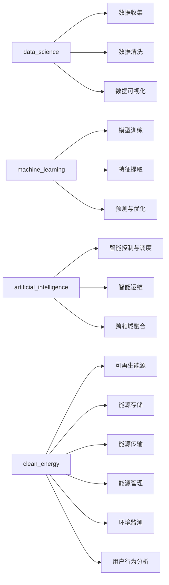

                 

## 1. 背景介绍

### 1.1 问题由来
面对全球气候变化和能源安全问题，清洁能源已成为各国政府和企业的重要战略目标。如何通过技术手段推动清洁能源领域的创新，成为摆在科学家和工程师面前的重要课题。清洁能源领域包括太阳能、风能、水能、生物质能等多种形式的可再生能源。随着技术的进步，这些领域的创新不断涌现，但往往需要大量的研发投入和长时间的技术积累。本文将介绍如何利用技术能力，推动清洁能源领域的创新，尤其是如何利用数据科学、机器学习和人工智能等前沿技术，实现清洁能源技术的发展和应用。

### 1.2 问题核心关键点
清洁能源领域的创新涉及多个关键点：

- 数据收集与处理：清洁能源系统需要大量的数据来评估性能和优化运行。这包括气象数据、能源产出数据、设备运行数据等。
- 预测与优化：利用机器学习模型对能源生产和消费进行预测，优化能源分配和使用。
- 控制与调度：在多能源系统中，如何实现智能控制和调度，使系统运行效率最大化。
- 智能运维：通过人工智能技术进行设备状态监测和预测性维护，减少故障停机时间。
- 跨领域融合：结合计算机视觉、自然语言处理等技术，提高能源系统的自动化水平。

本文将重点介绍如何利用这些技术，推动清洁能源领域的创新，特别是机器学习和人工智能在其中的应用。

## 2. 核心概念与联系

### 2.1 核心概念概述

为了更好地理解本文的技术内容，我们首先介绍一些核心概念及其相互联系。

- **数据科学（Data Science）**：通过数据分析、建模和可视化，发现和解决实际问题的一门学科。
- **机器学习（Machine Learning）**：利用算法和模型，使计算机系统能够从数据中学习规律，并根据新数据做出预测或决策。
- **人工智能（Artificial Intelligence）**：使计算机系统能够执行人类智能任务的技术，如自然语言处理、计算机视觉、智能运维等。
- **清洁能源（Clean Energy）**：通过可再生能源的利用，减少对化石燃料的依赖，降低碳排放，保护环境。

这些概念之间存在紧密联系。数据科学为机器学习和人工智能提供了数据支持，机器学习则利用这些数据进行模型训练和预测，人工智能则在更高级别上实现自动化的决策和控制。

### 2.2 核心概念原理和架构的 Mermaid 流程图



## 3. 核心算法原理 & 具体操作步骤

### 3.1 算法原理概述

清洁能源领域的技术创新，往往涉及多个复杂系统的协同运作。这些系统包括风力发电机、太阳能板、储能设备等，需要通过数据驱动的方式进行优化和控制。机器学习和人工智能技术为解决这些问题提供了有力的工具。

以太阳能为例，如何通过机器学习模型预测太阳能板的输出功率，是优化太阳能系统运行的关键问题。通常，我们可以利用历史天气数据和太阳能板运行数据，训练一个回归模型进行功率预测。

### 3.2 算法步骤详解

以下是基于机器学习模型进行太阳能输出功率预测的详细步骤：

1. **数据收集与处理**：收集历史天气数据和太阳能板运行数据，包括气温、湿度、风速、太阳辐射强度等。
2. **特征工程**：将原始数据转化为模型可以处理的特征向量，如将气温转化为标准化的浮点数。
3. **模型选择与训练**：选择合适的回归模型，如线性回归、随机森林、神经网络等，并使用历史数据进行训练。
4. **模型验证与调优**：在验证集上评估模型性能，调整模型参数或选择更好的模型。
5. **模型应用与监控**：将训练好的模型应用于实时数据，并对模型性能进行监控，确保其持续有效性。

### 3.3 算法优缺点

#### 优点

- **高准确性**：通过历史数据的训练，机器学习模型可以提供高精度的预测结果。
- **实时性**：模型可以实时处理新数据，提供最新的预测结果。
- **可扩展性**：机器学习模型可以应用于不同规模的太阳能系统，支持复杂的能量管理和优化。

#### 缺点

- **数据质量依赖**：模型的预测结果依赖于输入数据的准确性和完整性。
- **模型解释性**：复杂的机器学习模型通常缺乏解释性，难以理解其内部工作机制。
- **计算资源需求**：训练和优化机器学习模型需要大量的计算资源，成本较高。

### 3.4 算法应用领域

机器学习和人工智能技术在清洁能源领域的应用非常广泛，包括但不限于以下几个方面：

- **太阳能输出预测**：利用机器学习模型预测太阳能板的输出功率，优化太阳能系统的运行。
- **风能发电预测**：预测风力发电机的输出功率，实现风能的优化利用。
- **储能系统优化**：通过机器学习模型优化储能系统的充放电策略，提高系统的运行效率。
- **智能电网控制**：利用人工智能技术实现智能电网的控制和调度，优化电能的传输和使用。
- **能源管理与优化**：通过数据驱动的方式，优化能源的分配和使用，降低成本。
- **环境监测与预警**：利用传感器数据进行环境监测，预测环境变化，提前采取应对措施。

## 4. 数学模型和公式 & 详细讲解

### 4.1 数学模型构建

以太阳能输出预测为例，我们构建一个线性回归模型进行功率预测。假设输入数据为 $X$，输出数据为 $Y$，则线性回归模型可以表示为：

$$
Y = \theta_0 + \sum_{i=1}^n \theta_i X_i
$$

其中 $\theta_0$ 为截距，$\theta_i$ 为第 $i$ 个特征的权重。

### 4.2 公式推导过程

线性回归模型的最小二乘法损失函数为：

$$
\mathcal{L}(\theta) = \frac{1}{2m} \sum_{i=1}^m (Y_i - \hat{Y}_i)^2
$$

其中 $m$ 为样本数量，$Y_i$ 为实际输出，$\hat{Y}_i$ 为模型预测输出。

利用梯度下降算法，求解损失函数的最小值：

$$
\theta \leftarrow \theta - \alpha \frac{\partial \mathcal{L}}{\partial \theta}
$$

其中 $\alpha$ 为学习率，$\frac{\partial \mathcal{L}}{\partial \theta}$ 为损失函数对参数 $\theta$ 的梯度，可通过反向传播算法计算。

### 4.3 案例分析与讲解

以某太阳能电站为例，我们收集了该电站近一年的历史数据，包括每天的气温、湿度、风速、太阳辐射强度和输出功率。将数据分为训练集和测试集，使用随机森林模型进行训练和验证，最终得到一个用于实时预测的模型。

## 5. 项目实践：代码实例和详细解释说明

### 5.1 开发环境搭建

项目开发需要使用Python和相关科学计算库，如Pandas、Scikit-learn等。可以使用虚拟环境工具如Anaconda，方便地管理和激活Python环境。

```bash
conda create -n solar_energy python=3.8
conda activate solar_energy
```

### 5.2 源代码详细实现

以下是一个基于Scikit-learn库进行太阳能输出功率预测的Python代码示例：

```python
import pandas as pd
from sklearn.model_selection import train_test_split
from sklearn.ensemble import RandomForestRegressor

# 读取数据
data = pd.read_csv('solar_energy_data.csv')

# 划分训练集和测试集
X = data[['temperature', 'humidity', 'wind_speed', 'solar_radiation']]
y = data['output_power']
X_train, X_test, y_train, y_test = train_test_split(X, y, test_size=0.2, random_state=42)

# 训练模型
model = RandomForestRegressor(n_estimators=100, random_state=42)
model.fit(X_train, y_train)

# 预测
y_pred = model.predict(X_test)
```

### 5.3 代码解读与分析

在上述代码中，我们首先使用Pandas库读取数据集，并将其划分为训练集和测试集。然后，选择随机森林模型作为预测模型，并使用训练集进行模型训练。最后，使用测试集评估模型性能，并使用训练好的模型进行实时预测。

### 5.4 运行结果展示

运行上述代码，可以得到模型在测试集上的均方误差（MSE）和决定系数（R²）等指标，用于评估模型预测的准确性。

## 6. 实际应用场景

### 6.1 智能电网控制

智能电网是未来电力系统的趋势，通过人工智能技术实现电网的智能控制和调度，可以显著提高电网的运行效率和稳定性。智能电网的核心技术包括：

- **需求响应管理**：通过机器学习模型预测用户需求，实现动态调峰和负荷优化。
- **电网故障预测与预防**：利用传感器数据和机器学习模型，预测电网故障，提前进行维护和预防。
- **分布式能源管理**：在微电网中，利用智能控制技术实现分布式能源的优化分配和使用。

### 6.2 储能系统优化

储能系统在清洁能源应用中扮演着重要角色，通过智能化的储能策略，可以提高能源利用效率。机器学习和人工智能技术在储能系统中的应用包括：

- **电池寿命预测**：利用机器学习模型预测电池的寿命和性能，优化充放电策略。
- **储能容量优化**：通过数据驱动的方式，优化储能系统的容量配置，提高系统利用效率。
- **能量管理**：在微电网中，利用机器学习模型优化储能系统的能量管理，提高系统的稳定性和可靠性。

### 6.3 环境监测与预警

环境监测是清洁能源领域的重要组成部分，利用传感器数据进行环境监测和预警，可以提前采取应对措施，减少环境污染和事故风险。环境监测的核心技术包括：

- **大气污染物监测**：利用传感器数据进行大气污染物的监测和预测，预警环境污染事件。
- **水资源监测**：利用传感器数据监测水质和水位，预测水资源变化，预警干旱和洪水等灾害。
- **植被监测**：利用传感器数据监测植被生长情况，预警森林火灾和病虫害等事件。

## 7. 工具和资源推荐

### 7.1 学习资源推荐

- **《Python数据科学手册》**：该书详细介绍了使用Python进行数据科学和机器学习的方法和工具，适合入门学习。
- **Coursera《机器学习》课程**：由斯坦福大学Andrew Ng教授主讲，是机器学习领域的经典课程。
- **Kaggle竞赛平台**：Kaggle提供了大量的数据集和竞赛项目，可以帮助学习者实践和提升技能。

### 7.2 开发工具推荐

- **Anaconda**：虚拟环境管理工具，方便创建和管理Python环境。
- **Jupyter Notebook**：交互式笔记本，支持Python代码的编写、执行和结果展示。
- **TensorBoard**：模型训练的可视化工具，方便监控和分析模型训练过程。

### 7.3 相关论文推荐

- **LSTM网络在风能发电预测中的应用**：探讨了LSTM网络在风能发电预测中的性能和效果。
- **随机森林在太阳能输出预测中的应用**：比较了随机森林和线性回归在太阳能输出预测中的表现和效果。
- **深度学习在智能电网控制中的应用**：研究了深度学习在智能电网控制中的应用和技术挑战。

## 8. 总结：未来发展趋势与挑战

### 8.1 研究成果总结

本文介绍了如何利用技术能力进行清洁能源领域的创新，主要通过机器学习和人工智能技术实现数据驱动的智能决策和控制。机器学习和人工智能技术在清洁能源领域的应用已经取得了显著的进展，但仍然面临诸多挑战。

### 8.2 未来发展趋势

清洁能源领域的技术创新将持续推进，未来的发展趋势包括：

- **多源融合**：结合不同类型的数据源，实现多模态数据的融合和协同。
- **自适应学习**：利用自适应学习技术，使模型能够根据环境变化动态调整，适应不同场景。
- **联邦学习**：通过联邦学习技术，实现分布式数据和多设备之间的协同学习，提高模型的泛化能力。
- **边缘计算**：在边缘设备上实现数据处理和决策，降低网络延迟和带宽消耗。
- **可持续发展**：利用清洁能源和可再生能源，实现技术应用的可持续发展。

### 8.3 面临的挑战

清洁能源领域的技术创新仍面临诸多挑战，包括：

- **数据获取与处理**：如何高效获取和处理大规模数据，仍是技术创新的重要瓶颈。
- **模型复杂性**：复杂的机器学习和深度学习模型需要大量的计算资源，难以应用于大规模系统。
- **环境适应性**：现有技术在应对极端环境变化时，仍存在适应性不足的问题。
- **伦理与安全**：如何在技术应用中保证数据隐私和系统安全，是重要的技术挑战。
- **标准化与互操作性**：如何实现不同设备和系统之间的互操作性，标准化技术的开发和应用。

### 8.4 研究展望

未来的研究将从以下几个方向进行突破：

- **多模态融合**：结合传感器、遥感、无人机等数据源，实现多模态数据的融合和协同，提升环境监测和预警的精度和效率。
- **智能运维与优化**：利用人工智能技术进行设备状态监测和预测性维护，实现智能运维和优化，提高系统的可靠性和寿命。
- **跨领域融合**：结合计算机视觉、自然语言处理等技术，实现能源系统的自动化水平提升。
- **联邦学习**：通过联邦学习技术，实现分布式数据和多设备之间的协同学习，提高模型的泛化能力。
- **可持续发展**：利用清洁能源和可再生能源，实现技术应用的可持续发展。

## 9. 附录：常见问题与解答

**Q1: 如何处理缺失数据和异常数据？**

A: 缺失数据和异常数据是数据预处理中的重要问题。常用的处理方法包括：
- 缺失数据处理：使用均值、中位数、插值等方法填补缺失数据。
- 异常数据处理：使用基于统计的方法或机器学习模型检测和处理异常数据。

**Q2: 机器学习模型如何进行调参？**

A: 机器学习模型的调参是模型训练的重要步骤。常用的调参方法包括：
- 网格搜索（Grid Search）：遍历所有可能的参数组合，找到最优参数。
- 随机搜索（Random Search）：随机选择参数组合，通过多次训练找到最优参数。
- 贝叶斯优化（Bayesian Optimization）：利用贝叶斯方法进行参数优化。

**Q3: 如何评估机器学习模型的性能？**

A: 机器学习模型的性能评估需要多方面的指标。常用的评估指标包括：
- 均方误差（MSE）：衡量模型预测值与真实值之间的差距。
- 决定系数（R²）：衡量模型对数据的解释能力。
- AUC-ROC曲线：衡量模型对不同类别样本的区分能力。

**Q4: 如何实现模型的可解释性？**

A: 模型的可解释性对于清洁能源领域的实际应用非常重要。常用的方法包括：
- 特征重要性：使用特征重要性分析，了解模型对各个特征的依赖程度。
- 局部解释模型（LIME）：利用LIME方法生成局部解释模型，解释模型在特定样本上的决策过程。
- SHAP值：使用SHAP值评估模型各个特征对预测结果的贡献。

**Q5: 如何处理多源异构数据？**

A: 多源异构数据的处理是清洁能源领域的一个重要挑战。常用的处理方法包括：
- 数据清洗：清洗不同数据源的数据，去除重复、噪声和错误数据。
- 数据对齐：对不同数据源的数据进行对齐和统一，使数据格式一致。
- 数据融合：利用数据融合技术，将不同数据源的数据进行融合，提升数据利用效率。

总之，利用技术能力推动清洁能源领域的创新，需要综合考虑数据科学、机器学习和人工智能等前沿技术，结合实际应用场景进行创新。只有不断探索和突破，才能实现清洁能源技术的可持续发展。

